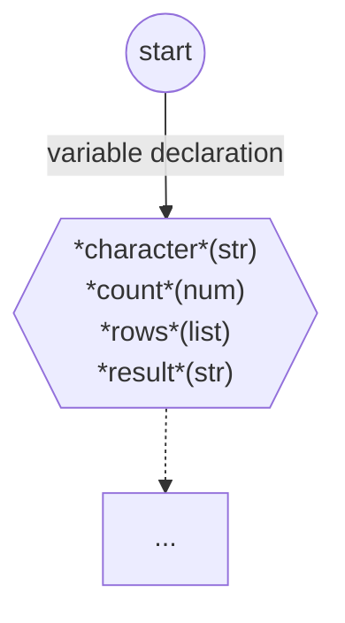
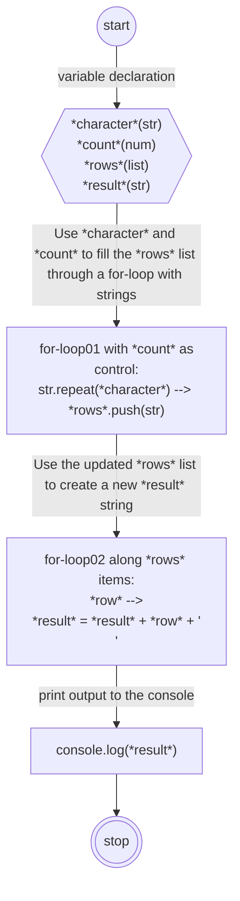
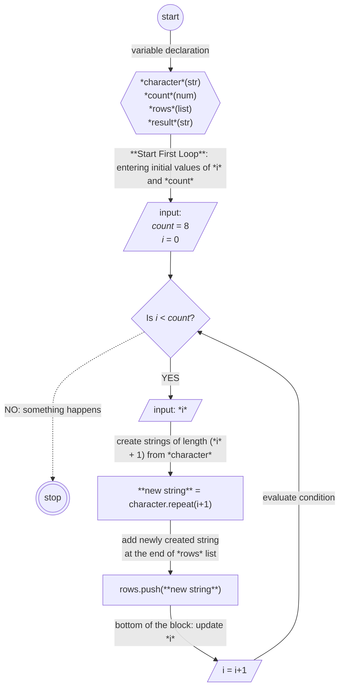
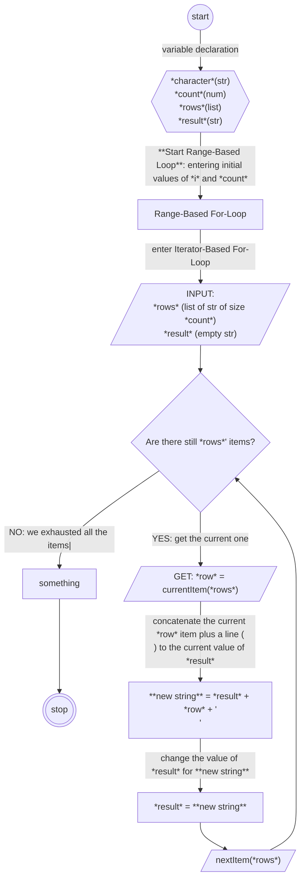
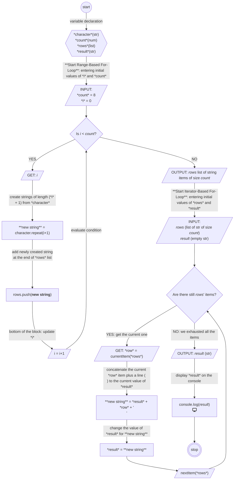
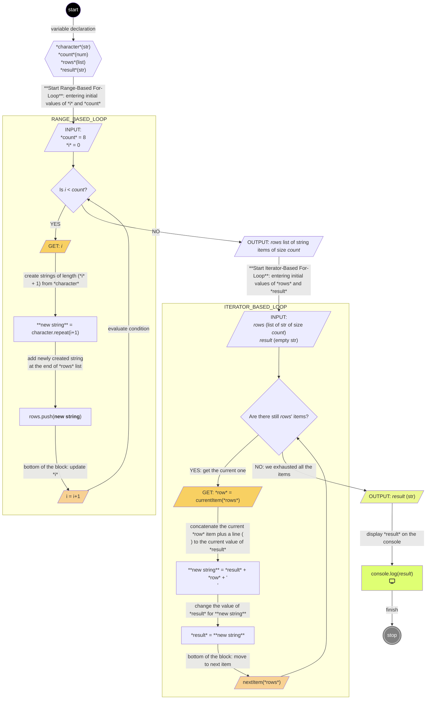

# {{ $frontmatter.title }} 관련

```component VPCard
{
  "title": "Mermaid.js > Article(s)",
  "desc": "Article(s)",
  "link": "/programmnig/js-mermaid/articles/README.md",
  "logo": "/images/ico-wind.svg",
  "background": "rgba(10,10,10,0.2)"
}
```

[[toc]]

---

<SiteInfo
  name="How to Make Flowcharts with Mermaid and Bring Joy to your Coding"
  desc="Coding can be intense. Especially when you are knee-deep in debugging or trying to map complex projects. For many developers — novice and pros alike — it is not uncommon to spend hours staring at code, looking for answers that won't come. You may hav..."
  url="https://freecodecamp.org/news/how-to-make-flowcharts-with-mermaid"
  logo="https://cdn.freecodecamp.org/universal/favicons/favicon.ico"
  preview="https://cdn.hashnode.com/res/hashnode/image/upload/v1736777856399/98a5d535-280e-4496-b0fb-67ad5a1b401d.png"/>

Coding can be intense. Especially when you are knee-deep in debugging or trying to map complex projects. For many developers — novice and pros alike — it is not uncommon to spend hours staring at code, looking for answers that won't come.

You may have tried every trick you know but still feel lost. But have you tried creating a visual representation of the problem so you can see how the code actually works?

I'm talking about using a **flowchart**.

In this article, you'll learn how flowcharts work along with some common symbols and labels you can use in your flowcharts. We'll also discuss some popular diagramming tools you can use to create flowcharts more easily. Finally, we'll walk through how to actually build a flowchart so you can start using them in your projects.

---

## What is a Flowchart?

Simply put, a flowchart is a diagrammatic representation of an algorithm. It's called a *flow*chart because it not only represents the steps but also depicts the direction the “job” flows as tasks are transferred to the next entity.

In many cases, a flowchart is considered part of a larger family of diagrams, usually referred to as **flow diagrams**. And although both names are commonly used, we'll stick to the use of flowcharts to represent algorithms for now.

](https://cdn.hashnode.com/res/hashnode/image/upload/v1732568840505/37302d26-7815-468c-86cf-45fbae2e843a.webp)

You'll notice that it uses certain different shapes and colors - we'll discuss these further below.

### How Common Are Flowcharts These Days?

“*Aren't they from the time of, like, Cobol?*” you might ask. Well, yes they are - and from even before that. Flow diagrams were quite popular from their introduction in the 1920's all the way to the 1970's. But their use started to fall off soon after that.

So you might wonder: are developers actually using flowcharts - or any kind of diagram - nowadays? I did some quick research across different developer community chats. I found that while not all devs say they use flowcharts, many of them mentioned that they were important in helping them *sketch a vizualization* of the code or the system.

I also found that senior developers were less interested in the use of diagrams because they usually knew the algorithms or the codebase almost by heart. But newer developers who were exposed to a codebase for the first time, revisiting a forgotten algorithm, or those needing to share some code with others tended to use flowcharts more often.

### Why Do Devs Use Flowcharts?

Here are some of the most common reasons developers use flowcharts these days:

- **Focus**: A visual resource to help you think about a problem.
- **Planning**: Map out your steps before diving in.
- **Sharing standard processes**: As a tool to facilitate the reading of standard processes.
- **Communicating and teaching**: Explaining your code to both technical and non-technical people.
- **Documenting**: Keep track of your work in a way that's easy to follow.
- **Analysing existing code**: Break down your code and others' to see what's really going on.

Of course, there are other methods you could use to cope with the situations listed above. But there are advantages to using flowcharts over other methods that have to do with the way we process information in our brain.

Still, making flowcharts is an intellectual process that entails some risks, particularly when it comes to clarifying information. So we need the right tools and a methodology to work with them.

In the following sections, we will go through all those points in more detail:

- The semiotic of the flowchart - that is, the use of symbols to convey information. We'll also discuss the role of the flowchart as an information tool, its limitations, and how to address them.
- The most common symbols, their meanings, and how to use them
- The intellectual processes of constructing flowcharts and their risks
- A methodology to help you reduce those risks
- The available tools to create flowcharts with a quick introduction to the one we will use for our examples

---

## A Flowchart's Symbology, the Limitations of Symbols, and Solutions

Earlier, I defined a flowchart as a diagram of sequences of steps, or **workflow**, of an algorithm. But we can also understand the flowchart as a “language”: when using a flowchart, we are translating the description of an algorithm from a verbal / textual language to a more symbolic one.

In other words, we can define a flowchart as a visualization of a streamlined workflow where we identify steps and relations by substituting meaningful symbols for verbal / textual descriptions.

### How Symbols Work

What are the advantages of using a visualization based on symbols to understand an algorithm?

Physically, our brain has to make more of an effort to extract meaning from either text or numbers than it does from visual attributes and shapes. For example, after some learning and under the relevant context, it is easy to get the meaning of this street sign:

](https://media-studies.com/wp-content/uploads/2021/07/barthes-road-sign-268x225.jpg)

This sign may work better than writing a board explaining that drivers should be careful as there are kids crossing the road.

In our example, if you have to pause to read the explanatory board, by the time you learn what the message is it could be too late. But our brain makes a faster evaluation of the situation when presented with the sign after some training.

Also, visual attributes and shapes can not only refer to concrete, tangible objects, but also to *concepts and actions*. For example, if you have done arithmetics before, you'll know the meaning of the following symbols:

)](https://b2990823.smushcdn.com/2990823/wp-content/uploads/2021/11/86-860869_math-math-symbol-math-clip-art-1-300x251.png?lossy=1&strip=1&webp=1)

When we use a symbol to convey meaning, whether concrete or intangible, we usually talk about [**semiosis**](https://en.wikipedia.org/wiki/Semiosis). Semiosis is the process of producing and interpreting signs and symbols to convey meaning. It involves the interaction between a symbol, its meaning, and the person or machine interpreting it. This process is central to the communication, understanding, and creation of knowledge in both people and machines.

Symbolic communication takes advantage of our innate visual processing skills. This helps reduce the need for long-winded explanations because the observer has learned somehow what the sign means. Instead of “semiosis”, some people prefer the term **abstraction** to refer to the same process.

](https://cdn.hashnode.com/res/hashnode/image/upload/v1736344070987/cede4eac-ca8c-4fa9-9a76-280d08f655d7.png)

That it is what we do with flowcharts: abstracting meanings through symbols.

The value of semiotics in a visualization is substantial. Using meaningful symbols in a visualization such as a flowchart allows you and your audience to *focus on patterns* that written text, such as code or a script, can't easily tell or describe.

And that is where the power of visualizations like flowcharts resides.

But flowchart symbols are not operators like you'd find in mathematics. Rather, they're *representations.* In fact, they might represent something *specific to the person who draws them*.

Because of this, the symbols alone are often insufficient to fully convey abstract concepts. For example, the term "database” can represent many types of systems or technologies, and can have many different setups and uses. Also, as technology evolves, some symbols may lose their relevance.

To address this, clear textual explanations should accompany the shapes, ensuring the flowchart remains meaningful and avoids vagueness. You can also add styling and even images to strengthen the symbols' meaning.

---

## Common Symbols and Labels Used in Flowcharts

When creating a flowchart, you can use custom symbols, but it's typically a good idea to stick to certain conventions. Conventions ensure better communication as well as consistency of messaging across different flowcharts.

The [<FontIcon icon="fas fa-globe"/>ANSI/ISO standards](https://the9000store.com/articles/iso-9000-tips-iso-9001-flowchart-basics/) list more than 30 recognized flowchart **shapes**, though their usage isn't strictly regulated. This allows vendors and developers to agree on best practices.

Since these symbols require textual and styling support anyway, some devs argue that you can reduce the number of shapes to a “necessary few” versatile symbols instead. I refer to these as "wildcards”. Wildcards can represent broader abstractions when paired with clear text and or styling. But don't hesitate to use other standard symbols if you think that they bring more clarity to your flowchart.

For our example, we will focus on the most common shapes. Some of the most common and most versatile shapes are:

](https://cdn.hashnode.com/res/hashnode/image/upload/v1733765176295/06d45bcd-38c1-4c88-854d-c91bdb7e0a7c.jpeg)

As you can see in the table above, we have the following shapes:

- Oval (a start or end point)
- Arrow (a connector that shows relationships between shapes)
- Parallelogram (an input or output)
- Rectangle (a process)
- Diamond (a decision)

Let's go through each of these now and examine how they work and how to use them.

### The Terminator (Oval) Shape

This is the oval shape, called the start/end shape. It marks the starting and ending points of the process/system. The oval indicates the beginning or end result of the workflow, and the potential outcomes of a path.

Many devs use the oval shape, along with the words “start” and “end/stop/finish” for clarity.


Some people prefer to use a single circle to represent the start and a double circle to represent the end of a flowchart:


I personally prefer the circle - but it's up to you. Just make sure you pick one and stick with it for consistency.

### The Arrow or Flowline Shape

Also called the link or the edge by vendors and practitioners, this shape represents the connection between two steps. Also depending on its shape, it might indicate if that flow is broken, failed, or if it is an alternate path or process, and more.

The most common representation is the **arrow**, which indicates the direction of the workflow between two steps. The arrow points in the direction of the next step in the process.


When working with flowcharts, I accompany arrow flowlines and any other flowline with concise descriptions about the next step, sometimes with information about variables and, when it makes sense, the current state.


### The Process (Rectangle) Shape

You can represent a process using a rectangle in a flowchart. It's also referred to as a box:


A box can represent a **single step**, like an expression (for example, $x=y\timesx^{2}$), a **entire block statement**, like “`loop through array and update values by multiplying by 2`”, or an **entire sub-process**, like an existing function or even a module.


The process shape is a proper wildcard and it can morph into many things, so it's important to add a label to it and using text or other resources like formatting to clarify its meaning.

### The Decision (Diamond) Shape

The decision is represented by a diamond. It is an abstraction for a **condition's test**, a YES/NO, or TRUE/FALSE question. It is the equivalent of an IF/ELSE statement in coding.

The text accompanying this shape is a question formulating a comparison between an entering value and a control value. The flowchart usually splits into different branches depending on the answer or consequences after you use the decision shape:


The result of the decision box determines the next step in the process workflow. It's usually declared to only answer a simple question, but you can abstract the question so it looks similar to an IF/ELSE IF/ … /ELSE control statement in coding, with lines representing different decisions.

When one of the flows returns to the decision shape from where it left, we are talking about **a loop**:


The interpretation is like asking to test the condition again after going through some steps along a specific workflow branch, then checking if the answer has changed.

### The Input/Output (Parallelogram) Shape

You can use the parallelogram shape as an abstraction for data that's available for input or output or for resources used or generated. It indicates that some information is required at this point in the workflow.

The input/output shape is typically accompanied by the following text:

- Either “input” or “output”, so you know which is being represented. You can also write other similar words like “get” / “put”, “in” / “out”, and so on.
- An input or an output could be related to a variable that you are planning or you already have in your code. If that variable should have an expected type when either entering as input or output, I would also add the type.
- Its corresponding state, as long as it provides more clarity to the flowchart.
- Optionally, it would be also useful to mention the source of the input / output. Is it a dataset? A manual entry? A form? Will it be printed in the console?

Notice that the whole point of the use of this shape is to trace the entry or the exit of data into or out of the process. Therefore, this shape is valuable when you want to have at least an idea of data exchange.


Finally, a less common symbol, but one that I use often is…

### The Preparation (Hexagon) Symbol

The preparation symbol is represented by an hexagon and it abstracts the setup for the following step. I usually use this shape to declare all the initial conditions when the workflow begins. I accompany this shape with a list of variables, their types, and even functions or initial event settings, like event listeners, together with their initial values.


---

## How to Add Shapes to Your Flowchart: Generalization vs Refinement

Now that you understand the basics of the symbols, you may be wondering how to insert them into the diagram.

Especially for large diagrams, you'll want to be very intentional about adding shapes. You'll need to make careful decisions about placing and the number of shapes you'll use, otherwise your flowchart could become unreadable.

You'll need to make decisions about things like:

- where to place the shapes so it results in a tidy flowchart.
- which of those shapes are essential to the understanding of the workflow, and which are not.

Placing is perhaps the most difficult task of making a flowchart. If you are manually constructing your flowchart, unfortunately there's not a simple formula that instructs you where to place the shapes in order to prevent overlapping. It's up to you to visually resolve the placement and to decide when any overlap makes your diagram unreadable.

As you'll see later, there are computationally-based solutions for the placing of shapes. But there is a simple rule that applies to all cases: the smaller the flowchart, the easier it is to place the shapes. So reducing the number of shapes and only including the key shapes is key to creating a clear flowchart.

Keep in mind that I'm not suggesting that you try to create the most minimalistic flowchart you can. Just that you try to make the simplest one that conveys enough information to help you understand the workflow.

### How to Choose Which Shapes to Use

Deciding which shapes to use can turn into an iterative process of adding, moving, or removing text or symbols into or out of the flowchart.

There are two competing tendencies here: **generalization** and **refinement**.

For example, the next figure shows three different flowcharts that demonstrate how to use a coffee machine:


In the image above, you can see that the example on the left is the one with less explanations and fewer shapes, while the one on the right has more details.

In the same way, depending on your needs and the specific details you want to get out of the visualization, the flowchart can be more generalized or it can be more refined. In fact, it might acquire some elements of subjectivity, which usually rely on the **amount of information and knowledge** you have about the process **before** looking at the flowchart.

#### Generalization:

In the case of flowcharts, **generalization**, also known as *lifting*, is when you enclose several steps into a few words and / or symbols. There are two reasons to use a more generalized approach:

1. You and your audience are competent enough to complete the information not provided by the flowchart.
2. You and your audience don't know much about that specific step.

In the second case, there are two situations you might be dealing with:

1. Even if you don't know much about that part of the process, you can keep that step generalized because that step plays a small role in providing information that's essential to you. Or,
2. The point is critical for you to understand the process, but you and your audience simply don't know more.

It's in the second situation when you have to try to “open the box”. And this is done through refinement.

#### Refinement

**Refinement** consists of adding more steps and more words and symbols in order to add more detail to a procedure. It usually follows researching and studying.

When you're refining your flowchart, this doesn't necessarily mean that you know absolutely nothing about the procedure. What you're looking for is something that allows you to point to specific details, and what comes before and what comes next.

But how much generalization is helpful? And how much refinement?

When your flowchart is too general, it results in a simpler visualization but it doesn't contain much information. You might have to use more words or rely on inner knowledge in order to explain what the chart or a step means. The first flowchart in the previous image is the most generalized of all of them.

The risk of over-generalization is *non-information*.

The process of refinement involves the opposite risk, and is, in my view, more dangerous. If you don't control the refinement process, you might end up with an absolute mess, like this:


The above diagram isn't a flowchart, but the risk is the same. The risk of excessive refinement is *noise*.

There are several rules and mechanisms that help you prevent reaching an unnecessary level of either refinement or abstraction. This is what we are going to learn in the next sections. But first, let's take a quick look at the available tools you can use to make diagrams and flowcharts.

---

## Popular Diagramming Tools for Creating Flowcharts

Now that you know the shapes, what they are for, and have some idea about how to use them, you can start building a flowchart.

But before doing so, I'm going to make a short detour to talk about the tools you can use to build flowcharts.

Nowadays, the options are many. You can use online as well as offline resources. Some are specialized for building diagrams, while others are more general. Some you can access for free, and others are more for enterprise operations and come with high fees.

Below, you'll find a quick table categorizing some of the dedicated tools I have used in the past or that I have been investigating recently.

### Dedicated Solutions for Drawing Flowcharts

::: tabs

@tab:active Drag and Drop

Shapes are manually dragged into a editor screen, linked with connectors and filled with relevant text.

> **Example**: draw.io

@tab Scriptable

A script is written with a dedicated syntax for shapes, relationships, and text. The flowchart is automatically rendered and updated after changing the script.

> **Example**: Mermaid, PlantUML

@tab AI-based

A descriptive prompt or even code is provided to the AI. The AI analyzes the content, usually recoding into a scriptable diagram before rendering it.

> **Example**: codetoflow.ai, ChatGPT plugins

@tab Parser

Map (binary) code into dedicated graphical solutions based on established syntax rules.

> **Example**: drgarbagetools for Java in Eclipse, graphdracula for JQuery

:::

#### No-code or low code tools

The large majority of the existing specialized diagramming tools are designed to help people without coding skills.

When using these types of tools, you have to manually construct the diagram by **dragging-and-dropping** shapes into an (online) editor: you select the shape and move it around until you find your preferred place for it on the screen. There are functionalities to draw the flowlines (“connectors”) also by a dragging action, and you can always edit the shapes to add text or styling.

#### Script-based tools

But there are also some less well-known tools that have been around for a while that are rising in popularity now: the **script-based** options. With these kinds of tools, you describe the shapes and relationships by scripting them according to the syntax of the tool.

These kinds of tools have the relative advantage that the diagram will be drawn for you on a rendering screen or image. An algorithm will try to find the best place for your shapes on the screen without you having to place them manually.

#### AI tools:

Then there are the **AI** tools. Many of those tools are based on the scripting tools. Some of them work as follows:

1. the AI interprets either a descriptive prompt or the code itself
2. Then it translates the prompt into a script using a scriptable diagramming tool
3. The diagram renders according to the AI-generated code.

I've found that these AI tools are still not quite up to the task for more complex projects - but they can come handy if you just want a quick solution. One that I have used is codetoflow.io, but there are also (guess what…) ChatGPT plugins you can use.

#### Parsers

Even before the AI tools came around, there were the parsers. They map steps and relationships into shapes based on well-established syntax rules. Some of those parsers are turning to AI instead, as the AI generators are easier to program and require less maintenance. But sometimes the rule-based parsers can be more precise if the rules they are based on remain without changes.

Some of those tools read on binary code, which is a better proxy to follow the full workflow, something that popular AI tools are not capable of. Some IDEs, like Eclipse, allow you to add plugins to draw a flowchart of your code based on binaries. One example is [<FontIcon icon="fas fa-globe"/>drgarbagetools](https://sourceforge.net/projects/drgarbagetools/) which works only for Java in Eclipse.

#### General-purpose tools

Apart from those dedicated tools, you can always use others that are not specifically built for diagramming. I have used PowerPoint and Google Slides in the past, and there are other presentation applications that support the ANSI / ISO shapes' catalogue. You can also use tools like Figma, Miro, or others. There are too many others to list here.

And finally, there is always pen a paper.

### Our Example: Using Mermaid.js

For the example in this tutorial, I'll be using one of the scripting tools called Mermaid. One reason for using a script-based tool is the ease with which you can update the flowchart along the way. And this will come in handy when we reach the generalization / refinement step.

Although other tools do not hinder the generalization/refinement process, the fact that you might find yourself redoing the whole flowchart manually could become quite time consuming. With a script-based tool, you can focus mostly on writing down the right relationships and shapes, while you let the program place the shapes for you.

Although I'm using Mermaid here, I'm not prescribing the use of any particular tool for the examples ahead. You can use the one that suits your needs and with which you feel the most comfortable. None of them are perfect, and they all have their own merits.

But if you want to learn more about Mermaid, [**I've written another tutorial for you**](/freecodecamp.org/use-mermaid-javascript-library-to-create-flowcharts.md) that'll give you a general overview of the tool and how to use it. I will also provide the syntax I am using to create the examples so you can try it yourself.

---

## How to Build a Flowchart - Methodology and Example

When building a flowchart, you can follow these steps:

1. Define the scope of your flowchart
2. Find the start of the workflow
3. Trace the workflow to the end while using high levels of generalization for the steps
4. Select what should be refined and what can be left generalized
5. Iterate: Research. Refine. Test. Research. Refine or Generalize. Test. Research. Refine or Generalize…
6. Enhance
7. Extend (optional)

### Step 1: Define the Scope of Your Flowchart

It's important to be clear about what you want to do with your flowchart. Is it representing a full codebase or just a fragment of a script? Is it an algorithm that you want to study or is it an analysis of some existing code? Do you want a detailed explanation of a workflow or just look at the relationships?

Having a clear goal for your flowchart will help you guide its construction.

For this example, we are going to use an exercise from freeCodeCamp's curriculum:

```js
const character = "#";
const count = 8;
const rows = [];

for (let i = 0; i < count; i = i + 1) {
  rows.push(character.repeat(i + 1))
}

let result = "

for (const row of rows) {
  result = result + row + "\n";
}

console.log(result);
```

Our purpose here is to understand this code, particularly to gain more insights about the for-loops.

### Step 2: Find the Start of the Workflow

Once you have an idea of what you want to do with your flowchart, try to figure out the point from where the workflow begins. If it involves analyzing existing code, bear in mind that the start of the workflow might not be at the start of your target code. Just keep in mind that whatever triggers the whole procedure, that is an indication that the “start” is there.

The workflow usually starts with the setting of the initial declarations and values, so we could say that our flowchart could start like this for this example:




<!--  -->

### Step 3: Trace the Workflow to the End and Use High Levels of Generalization in Each Step

Once you've found the starting point, try to systematically trace the workflow steps from start to end. If there are procedures along the way, you can compact them into more generalized steps using no more than two shapes.

The most common shape for depicting a generalized step is the **process shape**. Candidates to keep generalized are functions, control statement blocks like loops or if-statements, modules, or even libraries. Labels of those steps should consist of general descriptions of the things that are happening or should happen at that step.

For our example, we can represent our workflow and in particular the for-loops at a general level like this:

```mermaid{6-11} :collapsed-lines title="finding the end point and adding general steps"
flowchart TD
  A((start))
  B{{"*character*(str)<br/>*count*(num)<br/>*rows*(list)<br/>*result*(str)"}}
  A --variable declaration--> B
  C["for-loop01 with *count* as<br/>control:<br/>str.repeat(*character*) --> *rows*.push(str)"]
  B --Use *character* and *count* to fill the *rows* list through a for-loop with strings--> C
  D["for-loop02 along *rows* items:<br/>*row* --><br/>*result* = *result* + *row* + '\n'"]
  C --Use the updated *rows* list to create a new *result* string--> D
  E["console.log(*result*)"]
  D --print output to the console--> E
  E --> F(((stop)))
```



<!--  -->

### Step 4: Determine What Requires Refinement and What to Leave Generalized

Stop for a while and review the schema you've created. Once you have a picture of the whole workflow, you'll want to decide which sections might require more details.

In our case, we'll refine the parts of the flowchart that deal with the two for-loops. Describing a for-loop is a typical example when learning to create flowcharts, but I also realized that the two for-loops in our exercise are not of the same type. So I thought it would be interesting to see if the flowchart can reveal how they compare.

### Step 5: Time to Iterate (Research, Refine or Generalize. Test. Repeat.)

What you've prepared up to Step 4 is a general sketch of the workflow. Now it's time to dig into the areas where more detail is required. During this process, sometimes you'll find yourself coming back to an abstraction while looking for the clearest way forward with your flowchart.

There are two things that will help you in this process:

1. **New Shapes**: this is the time when you may want to use some other shapes. Start with the most common ones. Use other shapes as long as you can give them a clear role in your flowchart and they help you reduce a long explanation about what the replaced shape does.
2. **Text**: Extend the use of text to explain the workflow. It should be more specific to the algorithm itself.

This process ends when you are satisfied with the clarity and level of detail of your flowchart. But there are a best practices that allow you to control the process:

- Try to keep everything to a single page.
- Keep the number of shapes to around 20 per page.
- Avoid line-crossing more than 4 times. Use connectors when that happens. Having to explain 5 or more connections is likely not a good thing.

After any change, test your flowchart. **Testing** is the most subjective aspect of the methodology. There might not be a way to test the flowchart result against a tangible outcome.

If that makes you uncomfortable, try to think in the following way: the flowchart can be seen as a sort of ordered TODO list or brainstorm notes describing what the code or system should do in order to accomplish a desired task.

A flowchart is similar to this TODO list. But instead of writing all those steps as comments or even pseudo-code, you are using (conventional) symbols.

But barring the advances of AI or any use of [<FontIcon icon="fa-brands fa-wikipedia-w"/>flow-based programming](https://en.wikipedia.org/wiki/No-code_development_platform), comments are not code, no matter how detailed they are.

So the decision of whether the flowchart is working or not is left to you and your audience. The most important question to resolve here is: is the information provided by the flowchart enough to understand what you need to understand about the process? Is it revealing something new? Is it helping you organize your ideas more clearly?

If you are still not satisfied, then repeat the process. But don't feel like you have to stick to this process alone. You can always stop this effort and look for another way to explain your procedures if you find that a flowchart won't work for you.

You could facilitate the refining and the clarity of the output by doing some additional research. Try to find how other people describe the procedure you are about to work on. Is there something about the language that you should keep in mind? Whenever possible, don't start from scratch.

Also, try to be faithful as much as possible to the actual way in which the procedure should be coded, especially if you are refining. But don't forget that it's a representation. Feel free to work on a draft when not enough information is available.

Let's go back to our example. I did some quick research to find out how others might interpret a for-loop in a flowchart.

 to guide my own description:](https://upload.wikimedia.org/wikipedia/commons/thumb/d/d1/For_loop_example.svg/220px-For_loop_example.svg.png)

This approach seems to be fairly standard and I will try to include some of those steps in my flowchart. I also found that according to JavaScript documentation, the kind of for-loop we are about to represent repeats [<FontIcon icon="fa-brands fa-firefox"/>until a specified condition evaluates to false](https://developer.mozilla.org/en-US/docs/Web/JavaScript/Guide/Loops_and_iteration), just like in the flowchart above.

Let's start by working on the first for-loop only:




<!--  -->

Perfect.

Let's now focus on the second for-loop. It turns out that it's syntactically different from the previous one. And in fact, there are [<FontIcon icon="fa-brands fa-wikipedia-w"/>different kinds of loops in programming](https://en.wikipedia.org/wiki/For_loop). The one we refined earlier is usually known as the “traditional” one, or better a *numeric range* type for-loop. The second one is an *iterator* type for-loop.

An [<FontIcon icon="fas fa-globe"/>iterator](https://refactoring.guru/design-patterns/iterator) is a functionality that moves incrementally along a group of values or *items*. That functionality can have subprocesses to initialize the iterator - one to get the current value the iterator is pointing to, as well as a subprocess to go to the next one.

Also, remember that a for-loop stops repeating a workflow branch as soon as the condition evaluates to `false`.

Let's try to reflect all this knowledge when refining the second for-loop. I will generalize the first for-loop for the sake of clarity:




<!--  -->

Now we have a clear flowchart for each of the for-loops! We had to first understand what the loops were about, and then had to find a way to represent them. We used refinement and generalization to expand / contract the information rendered by the flowchart.

At the end, we just have to accept that these are still approximations — in order to get how those for-loops *really* work, we would have to go learn more about JavaScript, probably looking through the JavaScript source code, or even closer to the machine by analysing binaries. But I'm personally satisfied with the information I got from the analysis.

Now after making these changes, we can come back and merge both flowcharts (for each of the for-loops) to complete the full representation of the code:

```mermaid{5-37} :collapsed-lines title="complete flowchart of the example code"
flowchart TD
  A((start))
  B{{"*character*(str)<br/>*count*(num)<br/>*rows*(list)<br/>*result*(str)"}}
  A --variable declaration--> B
  C[/"INPUT: <br/>*count* = 8<br/>*i* = 0<br/>"/]
  B --**Start Range-Based For-Loop**: entering initial values of *i* and *count*--> C
  D{"`Is *i* < *count*?`"}
  C --> D
  E1[/"`GET: *i*`"/]
  D --YES--> E1
  E2["**new string** = character.repeat(i+1)"]
  E1 --create strings of length (*i* + 1) from *character*--> E2
  E3["`rows.push(**new string**)`"]
  E2 --add newly created string<br/>at the end of *rows* list --> E3
  E4[/i = i+1/]
  E3 --bottom of the block: update *i*--> E4
  E4 --evaluate condition--> D
  F1[/"`OUTPUT: *rows* list of string items of size *count*`"/]
  D --NO--> F1
  F2[[/"`INPUT:<br/>*rows* (list of str of size *count*)<br/>*result* (empty str)`"/]]
  F1 --**Start Iterator-Based For-Loop**: entering initial values of *rows* and *result*--> F2
  F3{"`Are there still *rows*' items?`"}
  F2 --> F3
  F4[/"GET: *row* = currentItem(*rows*)"/]
  F3 --YES: get the current one--> F4
  F5["**new string** = *result* + *row* + '\n'"]
  F4 --concatenate the current *row* item plus a line (\n) to the current value of *result*--> F5
  F6[*result* = **new string**]
  F5 --change the value of *result* for **new string**--> F6
  F7[/"nextItem(*rows*)"/]
  F6 --> F7
  F7 --> F3
  G[/"`OUTPUT: *result* (str)`"/]
  F3 --NO: we exhausted all the items--> G
  H["`console.log(*result*)<br/>fa:fa-display`"]
  G --display *result* on the console--> H
  H --> Z(((stop)))
```



<!--  -->

### Step 6: Enhance the Flowchart

Sometimes, specially with large flowcharts, the repeated use of similar shapes requires additional enhancement to provide more clarity. Normally you won't quite know what you need to enhance until you have the full picture of something more final.

One way to do this is by grouping sections of the workflow. For that, you can use styling, like coloring the shapes, to highlight similar or related steps. It can also be helpful to highlight elements in the workflow that are really playing a fundamental role in the analysis.

You can also create groups of sub-procedures by boxing them (that is, placing a box around related elements of the flowchart).

Let's apply some enhancements to our final flowchart by boxing and coloring:

```mermaid{8-20,26-38,45-50} :collapsed-lines title="Flowchart after styling"
flowchart TD
  A((start))
  B{{"*character*(str)<br/>*count*(num)<br/>*rows*(list)<br/>*result*(str)"}}
  A --variable declaration--> B
  C[/"INPUT: <br/>*count* = 8<br/>*i* = 0<br/>"/]
  B --**Start Range-Based For-Loop**: entering initial values of *i* and *count*--> C

  subgraph RANGE_BASED_LOOP
    D{"`Is *i* < *count*?`"}
    C --> D
    E1[/"`GET: *i*`"/]:::get
    D --YES--> E1
    E2["**new string** = character.repeat(i+1)"]
    E1 --create strings of length (*i* + 1) from *character*--> E2
    E3["`rows.push(**new string**)`"]
    E2 --add newly created string<br/>at the end of *rows* list --> E3
    E4[/i = i+1/]:::input
    E3 --bottom of the block: update *i*--> E4
    E4 --evaluate condition--> D
  end
  
  F1[/"`OUTPUT: *rows* list of string items of size *count*`"/]
  D --NO--> F1
  F2[/"`INPUT:<br/>*rows* (list of str of size *count*)<br/>*result* (empty str)`"/]
  F1 --**Start Iterator-Based For-Loop**: entering initial values of *rows* and *result*--> F2
  subgraph ITERATOR_BASED_LOOP
    F3{"`Are there still *rows*' items?`"}
    F2 --> F3
    F4[/"GET: *row* = currentItem(*rows*)"/]:::get
    F3 --YES: get the current one--> F4
    F5["**new string** = *result* + *row* + '\n'"]
    F4 --concatenate the current *row* item plus a line (\n) to the current value of *result*--> F5
    F6[*result* = **new string**]
    F5 --change the value of *result* for **new string**--> F6
    F7[/"nextItem(*rows*)"/]:::input
    F6 --bottom of the block: move to next item--> F7
    F7 --> F3
  end
  G[/"`OUTPUT: *result* (str)`"/]:::output
  F3 --NO: we exhausted all the items--> G
  H["`console.log(*result*)<br/>fa:fa-display`"]
  G --display *result* on the console--> H
  H --finish--> Z(((stop)))

  style A fill:black, color:#fff
  style H fill: #DFFF73
  style Z fill:grey, color:#fff, stroke: white
  classDef input fill:#F8D192
  classDef get fill:#F8D062
  classDef output fill:#ECF892
```



<!--  -->

### Step 7: Extend the Flowchart

This step is optional. If you have done what you can to keep the flowchart as clear as possible - but you are finding that it still needs more refinement - you may be dealing with a complex process.

In this case, it's time to think about a separate flowchart to continue or extend the one you are working on. There are ways to indicate the connection between pages. You can also show a section of a flowchart as a generalization and show a more refined flowchart on a separate pages using references.

I won't go into the details of how to do that here, as this article is long enough as it is. And in this case, I think we can keep our flowchart to just one page, so I won't go further with creating new pages for it.

So we are done!

---

## Conclusion

When making a flowchart, we are not looking to imitate our code. Rather, we're looking to *understand it*. This means that the flowchart has to be *clear*.

And if you use your flowcharts correctly, along with the right tools, they can help you reveal patterns and hidden operations, as well as stay organized, reduce overwhelm, and ultimately make coding feel more manageable. This will ultimately improve your coding skills and your state of mind.

So give flowcharts a try — you might be surprised at how much they can help you out.

<!-- TODO: add ARTICLE CARD -->
```component VPCard
{
  "title": "How to Make Flowcharts with Mermaid and Bring Joy to your Coding",
  "desc": "Coding can be intense. Especially when you are knee-deep in debugging or trying to map complex projects. For many developers — novice and pros alike — it is not uncommon to spend hours staring at code, looking for answers that won't come. You may hav...",
  "link": "https://chanhi2000.github.io/bookshelf/fcc/how-to-make-flowcharts-with-mermaid.html",
  "logo": "https://cdn.freecodecamp.org/universal/favicons/favicon.ico",
  "background": "rgba(10,10,35,0.2)"
}
```
