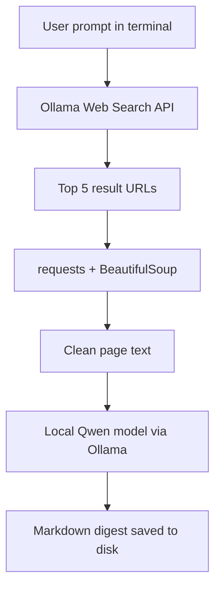

# {{ $frontmatter.title }} 관련

```component VPCard
{
  "title": "Python > Article(s)",
  "desc": "Article(s)",
  "link": "/programming/py/articles/README.md",
  "logo": "/images/ico-wind.svg",
  "background": "rgba(10,10,10,0.2)"
}
```

```component VPCard
{
  "title": "Ollama > Article(s)",
  "desc": "Article(s)",
  "link": "/ai/ollama/articles/README.md",
  "logo": "/images/ico-wind.svg",
  "background": "rgba(10,10,10,0.2)"
}
```

```component VPCard
{
  "title": "Qwen > Article(s)",
  "desc": "Article(s)",
  "link": "/ai/qwen/articles/README.md",
  "logo": "/images/ico-wind.svg",
  "background": "rgba(10,10,10,0.2)"
}
```

[[toc]]

---

<SiteInfo
  name="How to Build a Personal AI Web Research Agent with Ollama and Qwen"
  desc="In this tutorial, I’ll show you how to build an AI web research agent using Ollama, Qwen, and Python. The agent searches the web for a topic, fetches relevant pages, and uses a local LLM to generate a"
  url="https://freecodecamp.org/news/build-a-personal-ai-web-research-agent-with-ollama-and-qwen"
  logo="https://cdn.freecodecamp.org/universal/favicons/favicon.ico"
  preview="https://cdn.hashnode.com/uploads/covers/5e1e335a7a1d3fcc59028c64/b42208cb-204d-45e0-9dd4-c67e2e41991b.png"/>

In this tutorial, I’ll show you how to build an AI web research agent using Ollama, Qwen, and Python. The agent searches the web for a topic, fetches relevant pages, and uses a local LLM to generate a concise digest.

---

## Background

Most of us have used ChatGPT or Claude to send queries to a large language model. You've probably also seen hallucinations in the response when the model didn't know something, sometimes because its knowledge was out of date.

With the rise of tool calling, LLMs can now use tools to search the web for the latest information. They can then bring that information into context and use it to generate an output, summarize results, and extract key points from retrieved sources.

In this tutorial, I'll show you how I built a personal research agent that searches the internet for any topic and uses local LLM to summarize what it finds. It runs entirely on my own machine to preserve privacy and has no API costs. So it's completely free.

To follow this tutorial, you'll need [<VPIcon icon="iconfont icon-ollama"/>Ollama](https://ollama.com) installed on your machine and a free Ollama account. The tutorial works on macOS, Windows, and Linux. I'm using a MacBook Pro with 32 GB of RAM, but you can run this on a lower-memory machine by choosing a smaller Qwen model from Ollama.

---

## Motivation and Architecture

The motivation behind this project is to have agents running on my machine that can handle a variety of tasks every day. I can spin off agents to create a daily digest of AI news, surface the latest world events, or look for new job postings.

Running a local LLM also means none of these queries leave my machine. My research history stays private, and there are no per-query API costs to worry about.

For this project, we'll use Ollama web search for retrieval and local Qwen LLM for summarization (rather than rely on hosted chat tools like ChatGPT or Claude). The system diagram below shows how the agent works.

When run in the terminal, the agent asks the user what they want to research. It then calls the Ollama web search API to fetch the top 5 results for the query, downloads each of those pages, and extracts the readable text.

The extracted content from all five pages is sent to the local Qwen model along with the user's prompt and a system prompt: "*Use these web results and page contents to answer in Markdown format*." The model's response is then saved as a Markdown file on disk.


<!-- TODO: mermaid -->



---

## Step 1: Install Ollama and Get an API Key

To get started, install the [<VPIcon icon="iconfont icon-ollama"/>Ollama application](https://ollama.com/download) and create an account to get an [<VPIcon icon="iconfont icon-ollama"/>API key](https://docs.ollama.com/capabilities/web-search). The free tier of Ollama will suffice for this tutorial.

Once you have the key, place it in an environment variable:

```sh
export OLLAMA_API_KEY="paste-key-here"
```

---

## Step 2: Pull the Qwen Model

We'll use Qwen for this tutorial, an open-weight model that's currently one of the best smaller sized models available.

I'm using the 4-billion-parameter variant because it follows structured prompts well and runs on a laptop without a dedicated GPU. There are other sizes like 2b or 9b available.

To use [<VPIcon icon="iconfont icon-ollama"/>Qwen3.5:4b](https://ollama.com/library/qwen3.5:4b) locally, install it using Ollama. The 4b model size is around 3.4 GB on my machine. If your machine has lower RAM, you can use qwen3.5:0.8b instead of the 4b model.

```sh
ollama pull qwen3.5:4b
```

---

## Step 3: Install Python Dependencies

```sh
python3 -m venv venv
source venv/bin/activate
pip install ollama requests beautifulsoup4
```

---

## Step 4: Write the Agent Code

The below Python code does four things: it takes a research prompt from the terminal, calls Ollama's web search API for the top 5 results, downloads the webpages using Requests and cleans each page's text using BeautifulSoup, then sends everything to a local Qwen model with an instruction to summarize in Markdown. Finally, it saves the result to a timestamped .md file.

Save the code in your research_agent.py file.

The summarization prompt is intentionally basic. Feel free to tweak it to match the kind of output you want.

```py :collapsed-lines
import os
import json
import requests
import ollama
from bs4 import BeautifulSoup
from datetime import datetime
from pathlib import Path

API_KEY = os.getenv("OLLAMA_API_KEY")
SEARCH_URL = "https://ollama.com/api/web_search"
MODEL = "qwen3.5:4b"

# Search web using Ollama web search 
def search_web(query):
    response = requests.post(
        SEARCH_URL,
        headers={"Authorization": f"Bearer {API_KEY}"},
        json={"query": query, "max_results": 5},
        timeout=30,
    )
    response.raise_for_status()
    return response.json().get("results", [])

# Fetch full web page content
def fetch_text(url):
    try:
        response = requests.get(url, timeout=10)
        response.raise_for_status()
    except requests.RequestException as e:
        return ""
    soup = BeautifulSoup(response.text, "html.parser")
    for tag in soup(["script", "style", "nav", "footer"]):
        tag.decompose()
    return soup.get_text(separator="\n", strip=True)


def main():
    user_prompt = input("Enter your prompt: ").strip()
    if not user_prompt:
        print("Prompt cannot be empty.")
        return

    results = search_web(user_prompt)

    # For each url in web search result, fetch full content
    pages = []
    for item in results:
        url = item.get("url")
        if not url:
            continue

        print(f"Fetching: {url}")
        page_text = fetch_text(url)

        pages.append({
            "title": item.get("title", ""),
            "url": url,
            "snippet": item.get("content", ""),
            "page_text": page_text,
        })

    # Prompt to send to Qwen model with web data
    prompt = f"""
    User request:
    {user_prompt}

    Use these web results and page contents to answer in markdown format.

    Data:
    {json.dumps(pages, ensure_ascii=False)}
    """

    # Invoke local Qwen model 
    response = ollama.chat(
        model=MODEL,
        messages=[{"role": "user", "content": prompt}],
    )

    digest = response.message.content

    # Build a unique filename using today's date and time
    timestamp = datetime.now().strftime("%Y-%m-%d_%H-%M-%S")
    filename = f"digest-{timestamp}.md"

    # Save the digest to disk
    with open(filename, "w") as f:
        f.write(digest)
    
    print(f"Saved to digest")

if __name__ == "__main__":
    main()
```

---

## Step 5: Run the Agent

```sh
python research_agent.py
```

The script will prompt you to enter the topic you'd like to research.

### Sample Output

The summarized digest is saved as a timestamped Markdown file. The agent also prints the source URLs as it fetches them.

Before trusting the summary, skim it and spot-check a claim or two against the original source. Local models are smaller than hosted frontier models and tend to hallucinate more. So spot-checking can help with accuracy.

As a test run, I asked the research agent: "What's new in LLMs" and it fetched 5 web pages as seen below:

```plaintext
Enter your prompt: What's new in LLMs
Fetching: https://openai.com/nl-NL/index/chatgpt-memory-dreaming/
Fetching: https://pub.towardsai.net/tai-210-glm-5-2-closes-most-of-the-open-weight-gap-in-ten-weeks-2f970c5f1326
Fetching: https://www.globenewswire.com/news-release/2026/06/23/3315999/0/en/Multiverse-Computing-Launches-Pulsar-16B-in-collaboration-with-NVIDIA-Frontier-Grade-Reasoning-at-Half-the-Parameters.html
Fetching: https://thenextweb.com/news/anthropic-claude-tag-slack-always-on-ai-teammate
Fetching: https://www.aidoers.io/blog/claude-mythos-5-and-fable-5-explained-what-anthropic-actually-shipped

Saved to digest
```

The digest came out reasonably well-structured for a 4B local model. It's organized into sections with all the relevant data from the sources. I spot-checked the summary and it was accurate.

Here's what it produced:

```md :collapsed-lines
# What's New in LLMs (June 2026)

The landscape of Large Language Models (LLMs) has evolved rapidly in June 2026, with significant updates in memory synthesis, new frontier models, enterprise integrations, and market dynamics.

---

## 1. Memory & Personalization: OpenAI’s "Dreaming" Update
OpenAI has deployed a new memory architecture for ChatGPT, referred to as **Dreaming V3**.
*   **Purpose:** Improves memory synthesis to optimize freshness, continuity, and relevance.
*   **Evolution:**
    *   **2024:** "Saved memories" (manual instruction-based).
    *   **2025:** "Dreaming V0" (background process curating memories from chat history).
    *   **2026:** **Dreaming V3** (significantly more capable and compute-efficient architecture).
*   **Impact:** Memory is now reviewable via a summary page, allowing users to update information and set instructions on topics to bring up.
*   **Availability:** Rolled out to ChatGPT Plus and Pro users in the US today, expanding to additional countries and Free/Go users over coming weeks.
*   **Capability:** The model now remembers specific user setups (e.g., photography gear preferences) and constraints (e.g., vegetarian diet, hotel AC preferences) without requiring explicit "remember" cues.

---

## 2. New Frontier Models & Benchmarks

### Claude Fable 5 & Mythos 5 (Anthropic)
*   **Classification:** Mythos-class tier, sitting above Opus in raw capability.
*   **Differentiation:** **Fable 5** is available to the public. **Mythos 5** is the identical model with cybersecurity safeguards removed, restricted to **Project Glasswing** partners only.
*   **Pricing:** \(10 per million input tokens / \)50 per million output tokens.
*   **Availability:** Included at no extra cost on Pro, Max, Team, and enterprise plans until June 22.
*   **Capabilities:** Significant jumps in **Knowledge work**, **Agentic coding**, **Vision**, **Legal reasoning**, and **Biology**.

### Z.ai GLM-5.2 (Open Weights)
*   **Release:** Z.ai (Z.AI) released GLM-5.2 under an MIT license on June 16, 2026.
*   **Performance:** Closed the open-weight gap in ten weeks. Scored **51** on the Artificial Analysis Intelligence Index.
    *   **Context:** Expanded from 200K to **1 million tokens**.
    *   **Architecture:** Utilizes "IndexShare" for long-context efficiency and "Compaction-aware reinforcement learning" for agents.
*   **Benchmarks:** Ranked third on the AA-Briefcase (91 held-out tasks), behind Fable and Opus 4.8 but ahead of GPT-5.5.
*   **Cost:** ~\(0.52 per task (compared to \)0.86 for GPT-5.5 and $1.80 for Opus 4.8).

### Multiverse Pulsar 16B (NVIDIA Collaboration)
*   **Parameters:** 16.15B total parameters (3.1B active).
*   **Performance:** Delivers 30B-class intelligence at half the parameter count.
*   **Validation:** Matches 30B-class architectures (e.g., Nemotron-3-Nano-30B-A3B) on reasoning, coding, and math.
*   **Deployment:** Available on Hugging Face under Apache 2.0 license. Optimized for lower-memory GPUs and single-node environments.

---

## 3. Enterprise Integration & Tools

*   **Claude Tag (Anthropic):**
    *   An "always-on AI teammate" available to **Claude Enterprise and Team** customers.
    *   **Features:** Lives inside Slack, follows conversations, learns context, and uses an **ambient mode** to proactively flag updates and tasks.
    *   **Scoping:** Identity-based permissions allow admins to restrict which channels/teams the AI can access.
*   **MCP Connectors (Anthropic):**
    *   Launched **Enterprise-Managed Authorization (EMA)**.
    *   Allows IT admins to provision connector access via identity providers (Okta) without individual OAuth flows.
*   **Perplexity Brain (Computer Agent):**
    *   Research preview for Max/Enterprise Max subscribers.
    *   Self-improving memory system that remembers what the agent *did* rather than user preferences.
    *   Results show 25% increase in answer correctness on repeated tasks.

---

## 4. Industry Trends & Personnel Moves

*   **Market Dynamics:** ChatGPT market share dropped below 50% (46.4% by May 2026). Claude leads in subscription conversion (13%).
*   **Talent Shifts:**
    *   **Noam Shazeer:** Co-inventor of Transformer (Google) joins OpenAI as Lead for Architecture Research.
    *   **John Jumper:** Nobel Laureate (DeepMind) joins Anthropic for AI-for-science infrastructure.
*   **Corporate M&A:**
    *   **SpaceX** acquires **Cursor** (Anysphere) for **$60 Billion** in a Q3 2026 deal to strengthen its AI coding division.
    *   **Alibaba** released the **Qwen-Robot Suite** (Qwen-RobotNav, Manip, World) for embodied intelligence and robotic control.
```

---

## Conclusion

In this tutorial, you learned how to build a personal AI web research agent that searches the web, summarizes results with a local LLM, and saves a Markdown digest. All this runs on your own machine with no data leaving your laptop. You have full control over the model and prompts without any API costs.

From here, you can try new prompts to research different topics, tweak the system prompt to change the output, swap in other local models like Qwen 3.6 or Mistral, or extend the script to fit your own workflow. Happy tinkering!

If you enjoyed this tutorial, you can find more of my writing on my [<VPIcon icon="fas fa-globe"/>blog](https://darshshah.org/blog/) (recent posts include system design paper series), my work on my [<VPIcon icon="fas fa-globe"/>personal website](https://darshshah.org/), and updates on [LinkedIn (<VPIcon icon="fa-brands fa-linkedin"/>`darshs`)](https://linkedin.com/in/darshs).

<!-- TODO: add ARTICLE CARD -->
```component VPCard
{
  "title": "How to Build a Personal AI Web Research Agent with Ollama and Qwen",
  "desc": "In this tutorial, I’ll show you how to build an AI web research agent using Ollama, Qwen, and Python. The agent searches the web for a topic, fetches relevant pages, and uses a local LLM to generate a",
  "link": "https://chanhi2000.github.io/bookshelf/freecodecamp.org/build-a-personal-ai-web-research-agent-with-ollama-and-qwen.html",
  "logo": "https://cdn.freecodecamp.org/universal/favicons/favicon.ico",
  "background": "rgba(10,10,35,0.2)"
}
```
