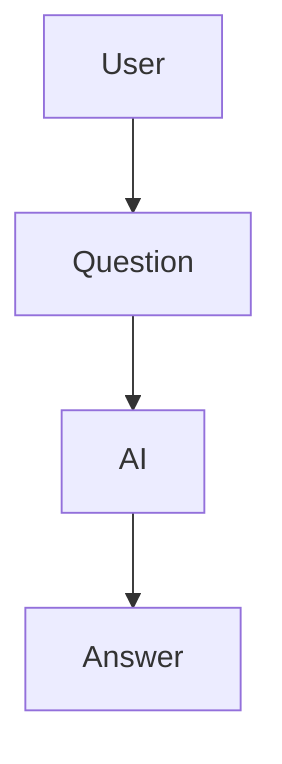
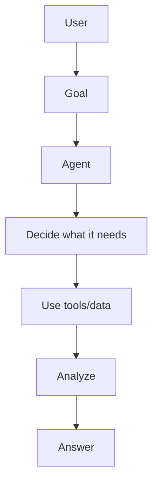
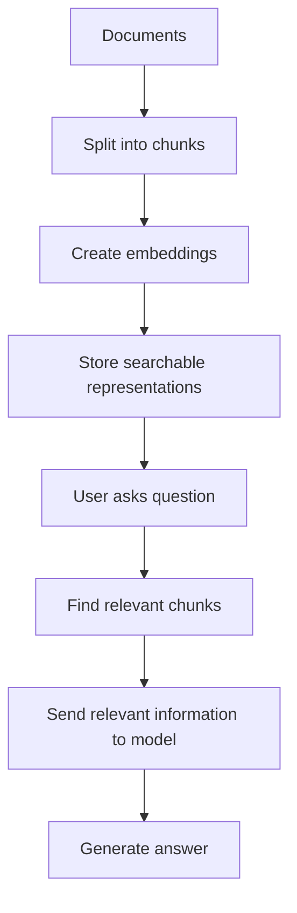
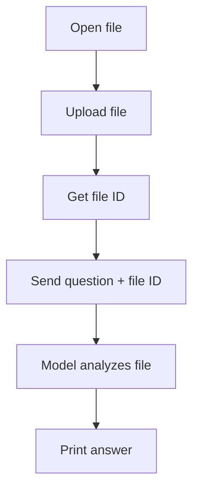

# {{ $frontmatter.title }} 

```component VPCard
{
  "title": "Python > Article(s)",
  "desc": "Article(s)",
  "link": "/programming/py/articles/README.md",
  "logo": "/images/ico-wind.svg",
  "background": "rgba(10,10,10,0.2)"
}
```

```component VPCard
{
  "title": "OpenAI > Article(s)",
  "desc": "Article(s)",
  "link": "/ai/openai/articles/README.md",
  "logo": "/images/ico-wind.svg",
  "background": "rgba(10,10,10,0.2)"
}
```

[[toc]]

---

<SiteInfo
  name="How to Build an AI File Analysis Agent with Python"
  desc="If you've ever opened a 30-page PDF and thought, “There's absolutely no way I am reading all of this,” you already understand why file-analysis AI agents are useful. Imagine uploading a research paper"
  url="https://freecodecamp.org/news/build-an-ai-analysis-agent"
  logo="https://cdn.freecodecamp.org/universal/favicons/favicon.ico"
  preview="https://cdn.hashnode.com/uploads/covers/5e1e335a7a1d3fcc59028c64/c24acbb2-2ab2-440d-83ae-682183a2f125.png"/>

If you've ever opened a 30-page PDF and thought, “There's absolutely no way I am reading all of this,” you already understand why file-analysis AI agents are useful.

Imagine uploading a research paper, résumé, CSV file, business report, or PDF and simply asking:

> “What are the most important findings?”

Instead of manually searching through the document, an AI agent can inspect the file, understand what's inside it, and answer questions about it.

In this tutorial, we're going to build exactly that. We'll create a beginner-friendly **AI file analysis agent in Python** that can:

- Accept a file from your computer
- Upload the file to an AI model
- Read the contents of the file
- Understand natural-language questions
- Analyze the file
- Return a useful answer
- Handle different types of questions without us writing a separate function for every possible question

We'll build the project using Python and the OpenAI API.

The important part is that we won't just copy and paste code and hope it works. We'll go through the code line by line so you understand what every important piece is doing.

By the end, you should understand not only how to build this project, but also the basic architecture behind many real-world AI agents.

---

## What Are We Actually Building?

Before writing code, let's define what an AI agent actually means.

An ordinary AI chatbot might work like this:



An AI agent can be more flexible:



For our project, the “data” will be a file.

For example, imagine we give our agent a research paper called:

```plaintext
ai-research.pdf
```

Then we ask:

```plaintext
What is the main argument of this paper?
```

The agent needs to:

1. Receive the question.
2. Access the file.
3. Read the relevant content.
4. Understand the content.
5. Analyze it.
6. Produce an answer.

The AI model handles the language understanding and reasoning. Our Python program handles the workflow around it.

That distinction is important.

The model isn't magically reading files sitting on your laptop. **Our application has to give the model access to the file.**

OpenAI's current API supports sending uploaded files as inputs to the Responses API, which allows models to analyze files directly.

---

## What We Are Going to Use

Our project will use:

- **Python**: our programming language
- **OpenAI Python SDK**: lets Python communicate with the OpenAI API
- **Responses API**: the API endpoint we'll use to interact with the model
- **An uploaded file**: the information our agent will analyze
- **A prompt**: instructions telling the agent what to do

We'll intentionally keep the first version simple.

You don't need LangChain, a vector database, React, or a complicated backend.

Once you understand this version, you can add those technologies later.

---

## What You Should Know Before Starting

This tutorial is designed for beginner and intermediate developers.

You should be comfortable with basic Python concepts such as:

- Variables
- Functions
- `if` statements
- Imports
- Strings
- Lists
- Dictionaries
- Running Python programs from a terminal

You do **not** need to know machine learning, know how transformers work internally, or the mathematics behind large language models.

We're focusing on how to build the application here.

---

## What We'll Cover:

- [Step 1: Create the Project](#heading-step-1-create-the-project)
- [Step 2: Create a Virtual Environment](#heading-step-2-create-a-virtual-environment)
- [Step 3: Install the OpenAI SDK](#heading-step-3-install-the-openai-sdk)
- [Step 4: Create Your API Key](#heading-step-4-create-your-api-key)
- [Step 5: Createrequirements.txt](#heading-step-5-create-requirementstxt)
- [Step 6: Create the Python File](#heading-step-6-create-the-python-file)
- [Step 7: Ask the User for a File](#heading-step-7-ask-the-user-for-a-file)
- [Step 8: Check Whether the File Exists](#heading-step-8-check-whether-the-file-exists)
- [Step 9: Upload the File](#heading-step-9-upload-the-file)
- [Step 10: Look at the Uploaded File ID](#heading-step-10-look-at-the-uploaded-file-id)
- [Step 11: Create the Agent's Instructions](#heading-step-11-create-the-agents-instructions)
- [Step 12: Ask the User What They Want to Know](#heading-step-12-ask-the-user-what-they-want-to-know)
- [Step 13: Send the File and Question to the Model](#heading-step-13-send-the-file-and-question-to-the-model)
- [Step 14: Print the Answer](#heading-step-14-print-the-answer)
- [Our First Complete Version](#heading-our-first-complete-version)
- [Step 15: Run the Application](#heading-step-15-run-the-application)
- [Step 16: Turn It Into a Real Conversation](#heading-step-16-turn-it-into-a-real-conversation)
- [Step 17: Move the AI Request Into the Loop](#heading-step-17-move-the-ai-request-into-the-loop)
- [Step 18: Improve the Agent's Instructions](#heading-step-18-improve-the-agents-instructions)
- [Step 19: Add Error Handling](#heading-step-19-add-error-handling)
- [Step 20: Validate the File Extension](#heading-step-20-validate-the-file-extension)
- [Step 21: Add a File Name to the Interface](#heading-step-21-add-a-file-name-to-the-interface)
- [Step 22: Build the Clean Final Version](#heading-step-22-build-the-clean-final-version)
- [Step 23: Make the Agent Better at Different Types of Files](#heading-step-23-make-the-agent-better-at-different-types-of-files)
- [Step 24: Give the Agent a Specific Role](#heading-step-24-give-the-agent-a-specific-role)
- [Step 25: Add an Analysis Mode](#heading-step-25-add-an-analysis-mode)
- [Step 26: Why This Is Different From Hard-Coding Every Answer](#heading-step-26-why-this-is-different-from-hard-coding-every-answer)
- [Step 27: Security Matters](#heading-step-27-security-matters)
- [Step 28: Be Careful With Sensitive Files](#heading-step-28-be-careful-with-sensitive-files)
- [Common Mistakes that Developers Make](#heading-common-mistakes-that-developers-make)
- [How the Final Program Works](#heading-how-the-final-program-works)
- [The Most Important Code to Remember](#heading-the-most-important-code-to-remember)
- [What You Can Build With This](#heading-what-you-can-build-with-this)
- [Final Thoughts](#heading-final-thoughts)

---

## Step 1: Create the Project

First, create a folder for the project.

For example:

```sh
file-analysis-agent/
```

Inside it, we'll eventually have:

```sh title="file structure"
file-analysis-agent/
├── agent.py
├── requirements.txt
└── .env
```

Each file has a purpose.

1. .<VPIcon icon="fa-brands fa-python"/>`agent.py`: This is where our Python application lives.
2. .<VPIcon icon="fas fa-file-lines"/>`requirements.txt`: This tells Python which external packages our project needs.
3. .<VPIcon icon="iconfont icon-dotenv"/>`.env`: This is where we can store our API key locally instead of putting it directly into our Python code.

Keeping secrets out of source code is an important habit to develop early.

---

## Step 2: Create a Virtual Environment

Open your terminal inside the project folder.

Run:

```sh
python -m venv venv
```

This creates a Python virtual environment.

A virtual environment gives your project its own isolated collection of Python packages. Think of it like giving this project its own little Python workspace.

You can activate it on Windows with:

::: code-tabs#sh

@tab:active <VPIcon icon="fa-brands fa-windows"/>

```sh
venv\Scripts\activate
```

@tab <VPIcon icon="iconfont icon-macos"/>,<VPIcon icon="fa-brands fa-linux"/>

```sh
source venv/bin/activate
```

:::

Once activated, you should see something similar to:

```plaintext
(venv)
```

at the beginning of your terminal prompt.

---

## Step 3: Install the OpenAI SDK

Now install the official OpenAI Python package:

```sh
pip install openai
```

The SDK gives us Python classes and methods that make API calls much easier.

Without an SDK, we would have to manually construct HTTP requests.

With the SDK, we can write Python like:

```py
client.responses.create(...)
```

instead of manually constructing the entire HTTP request.

The OpenAI quickstart currently uses the Responses API as the starting point for API requests.

---

## Step 4: Create Your API Key

You need an OpenAI API key to communicate with the API. Create an API key through your OpenAI developer account.

Do **not** put your real API key directly into your source code like this:

```py
api_key = "sk-your-real-key"
```

That's a bad habit.

If you upload your project to GitHub, you could accidentally expose the key. Instead, store it as an environment variable.

::: tabs

@tab:active <VPIcon icon="fa-brands fa-windows"/>

For example, on Windows PowerShell:

```powershell
$env:OPENAI_API_KEY="your_api_key_here"
```

@tab <VPIcon icon="iconfont icon-macos"/>,<VPIcon icon="fa-brands fa-linux"/>

```sh
export OPENAI_API_KEY="your_api_key_here"
```

:::

The OpenAI SDK can automatically read the `OPENAI_API_KEY` environment variable.

---

## Step 5: Create <VPIcon icon="fas fa-file-lines"/>`requirements.txt`

Create a file called: <VPIcon icon="fas fa-file-lines"/>`requirements.txt`

Put this inside:

```plaintext title="requirements.txt"
openai
```

Now another developer can install the project's dependency with:

```sh
pip install -r requirements.txt
```

This is a small thing, but it's a very useful professional habit.

---

## Step 6: Create the Python File

Create: <VPIcon icon="fa-brands fa-python"/>`agent.py`

Start with:

```py title="agent.py"
from openai import OpenAI
```

Let's break this down.

- `from`: Python's `from` keyword allows us to import something from another module.
- `openai`: This is the Python package we installed.
- `import OpenAI`: We're importing the `OpenAI` class from that package.

Now we can create an OpenAI client.

Add:

```py
client = OpenAI()
```

This creates our API client.

You can think of `client` as our application's connection point to the OpenAI API. Whenever we want to communicate with the API, we'll use this client.

For example:

```py
response = client.responses.create(...)
```

The client handles the underlying HTTP communication for us.

---

## Step 7: Ask the User for a File

We want our application to allow the user to specify a file.

Add:

```py
file_path = input("Enter the path to your file: ")
```

Now let's understand this line.

The `input()` function waits for the user to type something.

For example, the terminal might display:

```plaintext
Enter the path to your file:
```

The user might type:

```plaintext
research.pdf
```

Python stores that text inside:

```py
file_path
```

So after the user enters:

```plaintext
research.pdf
```

we effectively have:

```py
file_path = "research.pdf"
```

Now our program knows which file the user wants to analyze.

---

## Step 8: Check Whether the File Exists

Before uploading anything, it's a good idea to make sure the file actually exists.

We can use Python's built-in `os` module for this.

Add:

```py
import os

if not os.path.exists(file_path):
    print("File not found.")
    exit()
```

Let's break this down.

The `os` module gives Python tools for interacting with the operating system.

One of those tools is:

```py
os.path.exists()
```

It checks whether a file or folder exists at a particular path.

`if`: We're checking a condition.

```py
if not os.path.exists(file_path):
```

This means:

> If the file does NOT exist...

The `not` keyword reverses the result.

If:

```py
os.path.exists(file_path)
```

returns `True` then `not True` becomes `False`. But if the file doesn't exist...`False` becomes `True`.

So the code inside the `if` statement only runs when the file can't be found.

Next, `print()` displays:

```plaintext
File not found.
```

`exit()` stops the program.

That prevents our application from trying to upload a file that doesn't exist.

---

## Step 9: Upload the File

Now comes the interesting part: we need to send the file to the API.

Add:

```py
with open(file_path, "rb") as file:
    uploaded_file = client.files.create(
        file=file,
        purpose="user_data"
    )
```

This looks more complicated than it really is.

Let's go through it piece by piece.

### Understanding `open()`

The first line is:

```py
with open(file_path, "rb") as file:
```

The `open()` function opens a file.

The first argument is:

```py
file_path
```

which is the path entered by the user.

The second argument is:

```py
"rb"
```

This means:

- `r` = read
- `b` = binary

We use binary mode because we're dealing with uploaded files rather than simply reading plain text.

The `with` statement is important because Python automatically handles closing the file when we are finished with it.

The variable:

```py
file
```

represents the opened file.

### Uploading the File

Inside the `with` block we have:

```py
uploaded_file = client.files.create(
```

This asks the OpenAI API to create an uploaded file.

The `file` argument:

```py
file=file
```

passes the file we opened.

Then:

```py
purpose="user_data"
```

tells the API that the uploaded file is intended to be used as user data.

The Files API supports a `user_data` purpose for flexible file use.

After this finishes, OpenAI returns information about the uploaded file. We store that information in:

```py
uploaded_file
```

One useful property is:

```py
uploaded_file.id
```

That ID identifies the uploaded file.

---

## Step 10: Look at the Uploaded File ID

Add:

```py
print("Uploaded file:", uploaded_file.id)
```

Now you can see something like:

```plaintext
Uploaded file: file-abc123
```

That ID is important.

Our local computer knows the file as:

```plaintext
research.pdf
```

The API knows it through something like:

```plaintext
file-abc123
```

We can use that ID when sending the file to the model.

---

## Step 11: Create the Agent's Instructions

Now we need to tell the AI what its job is.

Create:

```py
instructions = """
You are a file analysis assistant.

Your job is to carefully analyze the file provided by the user.

Answer questions using information from the file.

If the answer can't be found in the file, clearly say that the information is not available in the file.

Do not invent facts.

When useful, organize your answer with headings and bullet points.
"""
```

This is called an instruction or prompt.

The triple quotes:

```py
"""
...
"""
```

allow us to create a multi-line string.

Our agent now has a role.

It knows:

- What it's supposed to do
- What information it should use
- What to do when information is missing
- How it should format answers

The instruction:

```plaintext
Do not invent facts.
```

is especially important for file-analysis applications.

We want the model to distinguish between:

> “The file says this.”

and:

> “I think this might be true.”

Those are not the same thing.

---

## Step 12: Ask the User What They Want to Know

Now we need the actual question.

Add:

```py
question = input("What would you like me to analyze? ")
```

For example, the user could enter:

```plaintext
What are the three most important findings in this paper?
```

Or:

```plaintext
Summarize this document in five bullet points.
```

Or:

```plaintext
What methodology did the researchers use?
```

This is where our application becomes flexible.

We don't need to create separate Python functions for every possible question. The user can ask questions naturally.

---

## Step 13: Send the File and Question to the Model

Now we can finally create the response.

Add:

```py
response = client.responses.create(
    model="gpt-5",
    instructions=instructions,
    input=[
        {
            "role": "user",
            "content": [
                {
                    "type": "input_text",
                    "text": question
                },
                {
                    "type": "input_file",
                    "file_id": uploaded_file.id
                }
            ]
        }
    ]
)
```

This is the most important section of the entire project.

Let's slow down and understand it.

### Understanding `client.responses.create()`

We start with:

```py
client.responses.create(
```

We're asking the Responses API to generate a response.

The OpenAI API supports file inputs in the Responses API, including using an uploaded file's ID as an `input_file`.

### Understanding the Model

We have:

```py
model="gpt-5"
```

This tells the API which model should process the request.

The model is the part responsible for understanding the question and analyzing the information provided to it.

The exact model you choose can change over time, so treat the model name as a configurable part of your application rather than something permanently hard-coded into your architecture.

### Understanding `instructions`

Next:

```py
instructions=instructions
```

Remember the variable we created earlier?

```py
instructions = """
You are a file analysis assistant.
...
"""
```

We're passing those instructions into the API request so the model knows what role it should perform.

### Understanding `input`

Next we have:

```py
input=[
```

The `input` contains the information we give the model.

In our case, we're giving it:

1. The user's question
2. The file

This is important because an AI model can't answer a file-specific question if we never give it the file.

### Understanding the User Message

Inside the input we have:

```py
{
    "role": "user",
```

This tells the API that this input represents the user's message.

Then:

```py
"content": [
```

contains the actual content of that message.

### Sending the Question

The first content item is:

```py
{
    "type": "input_text",
    "text": question
}
```

This tells the model:

> Here is some text input.

The actual text comes from:

```py
question
```

which was entered by the user.

If the user entered:

```plaintext
What is the main conclusion?
```

then the model receives that question.

### Sending the File

The next content item is:

```py
{
    "type": "input_file",
    "file_id": uploaded_file.id
}
```

This tells the API:

> Here is a file input.

And:

```py
uploaded_file.id
```

tells the API exactly which uploaded file we're referring to.

So our request effectively contains:

```plaintext
Question:
"What is the main conclusion?"

File:
research.pdf
```

The model can then analyze the provided file in the context of the user's question.

---

## Step 14: Print the Answer

We have the response stored in:

```py
response
```

But we don't want to print the entire response object.

We want the generated text.

The SDK provides:

```py
response.output_text
```

So add:

```py
print("\nAgent:\n")
print(response.output_text)
```

The first `print()` creates a little spacing and prints:

```plaintext
Agent:
```

The second prints the actual answer.

---

## Our First Complete Version

At this point, our entire <VPIcon icon="fa-brands fa-python"/>`agent.py` looks like this:

```py :collapsed-lines title="agent.py"
import os
from openai import OpenAI

client = OpenAI()
file_path = input("Enter the path to your file: ")

if not os.path.exists(file_path):
    print("File not found.")
    exit()

with open(file_path, "rb") as file:
    uploaded_file = client.files.create(
        file=file,
        purpose="user_data"
    )

print("Uploaded file:", uploaded_file.id)

instructions = """
You are a file analysis assistant.

Your job is to carefully analyze the file provided by the user.

Answer questions using information from the file.

If the answer cannot be found in the file, clearly say that the information is not available in the file.

Do not invent facts.

When useful, organize your answer with headings and bullet points.
"""

question = input("What would you like me to analyze? ")

response = client.responses.create(
    model="gpt-5",
    instructions=instructions,
    input=[
        {
            "role": "user",
            "content": [
                {
                    "type": "input_text",
                    "text": question
                },
                {
                    "type": "input_file",
                    "file_id": uploaded_file.id
                }
            ]
        }
    ]
)

print("\nAgent:\n")
print(response.output_text)
```

That's already a functional file-analysis AI application.

But we can make it much better.

---

## Step 15: Run the Application

Place a file such as:

```plaintext
research.pdf
```

inside your project folder.

Then run:

```sh
python agent.py
```

You should see:

```plaintext
Enter the path to your file:
```

Enter:

```plaintext
research.pdf
```

Then you might see:

```plaintext
Uploaded file: file-abc123
```

Next:

```plaintext
What would you like me to analyze?
```

You could ask:

```plaintext
Summarize the main findings in five bullet points.
```

The agent will analyze the file and return an answer.

### Why Is This an Agent?

At first glance, this might look like a normal API call. And technically, yes, our first version is a fairly simple agent workflow.

The important concept is the **agent loop**.

An agent generally has:

1. A goal
2. Instructions
3. Access to information
4. Potential tools
5. A reasoning process
6. An action
7. An output

Our application has several of these pieces.

The user provides a goal:

```plaintext
Analyze this research paper.
```

The instructions define the agent's behavior:

```plaintext
You are a file analysis assistant.
```

The file provides information:

```plaintext
research.pdf
```

The model processes the information, then the application returns the result.

As applications become more advanced, agents can also use tools such as file search, web search, function calling, and other external systems. OpenAI's platform currently supports built-in tools and custom function tools for extending agents.

---

## Step 16: Turn It Into a Real Conversation

Our current application only asks one question.

That's useful, but not ideal.

Imagine uploading a research paper and then having to restart the program every time you want to ask another question.

We can improve that by putting the question inside a loop.

Instead of:

```py
question = input("What would you like me to analyze? ")
```

we can use:

```py
while True:
    question = input("\nAsk a question (or type 'exit'): ")

    if question.lower() == "exit":
        break
```

Now let's understand it.

- `while True`: This creates a loop that continues indefinitely. It will keep asking questions until we tell it to stop.
- `question = input(...)`: The user enters another question.
- `question.lower()`: The `.lower()` method converts the question to lowercase.

For example:

```plaintext
EXIT
```

becomes:

```plaintext
exit
```

and:

```plaintext
Exit
```

also becomes:

```plaintext
exit
```

This makes our exit check more reliable.

Finally, the `break` keyword stops the loop. So:

```py
if question.lower() == "exit":
    break
```

means:

> If the user types exit, stop asking questions.

---

## Step 17: Move the AI Request Into the Loop

Now the API request needs to happen inside the loop.

Our structure becomes:

```py
while True:
    question = input("\nAsk a question (or type 'exit'): ")

    if question.lower() == "exit":
        break

    response = client.responses.create(
        model="gpt-5",
        instructions=instructions,
        input=[
            {
                "role": "user",
                "content": [
                    {
                        "type": "input_text",
                        "text": question
                    },
                    {
                        "type": "input_file",
                        "file_id": uploaded_file.id
                    }
                ]
            }
        ]
    )

    print("\nAgent:\n")
    print(response.output_text)
```

Now the user can ask multiple questions about the same file.

For example:

```plaintext
Ask a question:
What is this paper about?
```

Then:

```plaintext
Ask a question:
What methodology did the researchers use?
```

Then:

```plaintext
Ask a question:
What were the biggest limitations?
```

And finally:

```plaintext
Ask a question:
exit
```

This makes the application feel much more like an actual assistant.

---

## Step 18: Improve the Agent's Instructions

A good AI application isn't just about calling an API. The instructions matter a lot.

We can make our instructions more specific.

For example:

```py
instructions = """
You are an AI file analysis assistant.

Your job is to analyze the file provided by the user.

Follow these rules:

1. Use the provided file as your primary source.
2. Answer the user's question directly.
3. Do not invent information that is not supported by the file.
4. If the file does not contain enough information to answer a question, say so.
5. When summarizing, focus on the most important information.
6. When comparing ideas, clearly explain the similarities and differences.
7. When analyzing research, distinguish between results, methods, and conclusions.
8. Use simple language unless the user asks for technical language.
9. Use bullet points when they make the answer easier to understand.
10. If you make an inference, clearly label it as an inference.
"""
```

This is much stronger.

We're essentially giving our AI a set of rules.

### Why Good Instructions Matter

Imagine telling someone:

> “Read this document.”

They might read it and give you almost anything.

Now imagine saying:

> “Read this document, identify the research question, summarize the methodology, identify the major findings, and explain the limitations using simple language.”

That second instruction is much more useful.

AI agents work the same way. The more clearly you define the job, the easier it is for the model to produce consistent results.

---

## Step 19: Add Error Handling

Right now, our program assumes everything will work.

Real applications shouldn't do that. Files can fail to upload, the API can return an error, the user can enter an invalid path, or the network can temporarily fail.

We can use `try` and `except` to handle these situations.

For example:

```py
try:
    response = client.responses.create(
        model="gpt-5",
        instructions=instructions,
        input=[
            {
                "role": "user",
                "content": [
                    {
                        "type": "input_text",
                        "text": question
                    },
                    {
                        "type": "input_file",
                        "file_id": uploaded_file.id
                    }
                ]
            }
        ]
    )

    print(response.output_text)

except Exception as error:
    print("Something went wrong:")
    print(error)
```

- `try`: The code inside the `try` block is code that might fail.
- `except`: If an error happens, Python jumps to the `except` block.
- `Exception as error`: This captures the error so we can display it.

Instead of the entire application crashing with a confusing traceback, the user sees:

```plaintext
Something went wrong:
...
```

For a production application, you would usually want more sophisticated logging and error handling, but this is a good starting point.

---

## Step 20: Validate the File Extension

We can also check which type of file the user selected.

Add:

```py
allowed_extensions = {
    ".pdf",
    ".txt",
    ".docx",
    ".csv"
}
```

This creates a set of file extensions that our application expects to support.

Then:

```py
extension = os.path.splitext(file_path)[1].lower()
```

Let's break this down.

### `os.path.splitext()`

This separates the filename from its extension.

For:

```plaintext
research.pdf
```

it gives us approximately:

```plaintext
research
```

and:

```plaintext
.pdf
```

The `[1]` selects the extension.

Then:

```py
.lower()
```

converts it to lowercase.

So:

```plaintext
RESEARCH.PDF
```

becomes:

```plaintext
.pdf
```

Now we can check:

```py
if extension not in allowed_extensions:
    print("Unsupported file type.")
    exit()
```

This prevents users from uploading file types our application hasn't been designed to handle.

Always verify the currently supported file types for the API and model you choose before expanding your application. OpenAI's file and input APIs document file handling and supported input types.

---

## Step 21: Add a File Name to the Interface

We can make the terminal experience slightly nicer.

Instead of:

```py
print("Uploaded file:", uploaded_file.id)
```

we can write:

```py
print(f"\nSuccessfully uploaded: {os.path.basename(file_path)}")
```

The `f` before the string creates an f-string.

That allows us to insert Python variables inside `{}`.

For example:

```py
f"Successfully uploaded: {os.path.basename(file_path)}"
```

might produce:

```plaintext
Successfully uploaded: research.pdf
```

### `os.path.basename()`

This extracts just the filename from the path.

If the user enters:

```plaintext
documents/research.pdf
```

then:

```py
os.path.basename(file_path)
```

returns:

```plaintext
research.pdf
```

---

## Step 22: Build the Clean Final Version

Now let's combine everything.

Here is a cleaner version of our application:

```py
import os

from openai import OpenAI


# Create the OpenAI client.
client = OpenAI()


# Ask the user for a file.
file_path = input("Enter the path to your file: ").strip()


# Make sure the file exists.
if not os.path.exists(file_path):
    print("File not found.")
    exit()


# Allowed file types.
allowed_extensions = {
    ".pdf",
    ".txt",
    ".docx",
    ".csv"
}


# Get the file extension.
extension = os.path.splitext(file_path)[1].lower()


# Make sure the file type is supported by our application.
if extension not in allowed_extensions:
    print(f"Unsupported file type: {extension}")
    print("Supported types:", ", ".join(allowed_extensions))
    exit()


# Upload the file.
try:
    with open(file_path, "rb") as file:
        uploaded_file = client.files.create(
            file=file,
            purpose="user_data"
        )

except Exception as error:
    print("The file could not be uploaded.")
    print(error)
    exit()


print(f"\nSuccessfully uploaded: {os.path.basename(file_path)}")


# Define the agent's behavior.
instructions = """
You are an AI file analysis assistant.

Your job is to analyze the file provided by the user.

Follow these rules:

1. Use the provided file as your primary source.
2. Answer the user's question directly.
3. Do not invent information that is not supported by the file.
4. If the file does not contain enough information to answer a question, say so.
5. When summarizing, focus on the most important information.
6. When comparing ideas, clearly explain similarities and differences.
7. When analyzing research, distinguish between methods, results, and conclusions.
8. Use simple language unless the user asks for technical language.
9. Use bullet points when they make the answer easier to understand.
10. If you make an inference, clearly label it as an inference.
"""


# Start the conversation.
print("\nYour file is ready to analyze.")
print("Ask questions about the file.")
print("Type 'exit' when you are finished.")


while True:

    # Get a question from the user.
    question = input("\nYou: ").strip()


    # Stop the program if the user wants to exit.
    if question.lower() == "exit":
        print("Goodbye!")
        break


    # Ignore empty questions.
    if not question:
        print("Please enter a question.")
        continue


    # Send the question and file to the model.
    try:
        response = client.responses.create(
            model="gpt-5",
            instructions=instructions,
            input=[
                {
                    "role": "user",
                    "content": [
                        {
                            "type": "input_text",
                            "text": question
                        },
                        {
                            "type": "input_file",
                            "file_id": uploaded_file.id
                        }
                    ]
                }
            ]
        )


        # Display the AI's response.
        print("\nAgent:")
        print(response.output_text)


    except Exception as error:
        print("\nThe agent encountered an error.")
        print(error)
```

### Let's Understand the Architecture

At this point, it is useful to step away from the code. Our application has several layers.

#### Layer 1: User Interface

The terminal asks:

```plaintext
Enter the path to your file:
```

and:

```plaintext
You:
```

This is how the user interacts with our application.

#### Layer 2: File Handling

Python checks:

```py
os.path.exists(file_path)
```

and opens:

```py
open(file_path, "rb")
```

This layer handles the local file.

#### Layer 3: File Upload

The application sends the file to the API:

```py
client.files.create(...)
```

The API gives us a file ID.

#### Layer 4: Agent Instructions

We define:

```py
instructions
```

This tells the model how to behave.

#### Layer 5: User Request

The user asks:

```plaintext
What are the main findings?
```

#### Layer 6: Model

The model receives:

- The instructions
- The question
- The file

and generates an answer.

#### Layer 7: Output

We display:

```py
response.output_text
```

to the user.

This separation is useful because it makes the project easier to extend later.

### Why We Don't Need to Manually Extract Every PDF

A beginner might wonder:

> “Why don't we use Python to extract all the text first?”

That's absolutely possible. You could use libraries such as:

```plaintext
PyPDF
python-docx
pandas
```

to read different file formats yourself.

Then you could send the extracted text to an AI model.

That approach can be useful, especially when you need custom preprocessing. But it also creates more work.

You would need to write separate logic for:

```plaintext
PDF → extract text
DOCX → extract text
CSV → read rows
TXT → read text
```

Then you would need to figure out how to send all that information to the model.

With file inputs, the API can accept the file directly, which can simplify the architecture for supported use cases.

### But What About Very Large Files?

This is where things get more interesting.

Imagine a user uploads a 2,000-page collection of documents. You probably don't want to send everything into every single request.

Instead, you may want a system that can search for the most relevant sections. This is where **retrieval** becomes important.

One common architecture is:



This approach is commonly associated with **Retrieval-Augmented Generation**, or RAG.

OpenAI also provides a file search tool that can search uploaded files using vector stores.

Our first project intentionally doesn't introduce RAG because it would add a lot of concepts at once.

First understand direct file analysis. Then learn retrieval. Then combine the two.

### Direct File Input vs RAG

It's useful to understand the difference.

#### Direct File Input

You give the model a file for a particular request.

For example:

```plaintext
Upload:
research-paper.pdf

Question:
What was the main conclusion?
```

This is simple and great for many smaller applications.

#### RAG

You have a larger collection of documents.

For example:

```plaintext
100 research papers
50 reports
20 manuals
```

Instead of giving the model every document for every question, you search the collection for relevant information first. Then you provide the relevant pieces to the model.

This is more scalable for large knowledge bases.

---

## Step 23: Make the Agent Better at Different Types of Files

Different files contain different kinds of information.

A PDF might contain:

```plaintext
Research paper
```

A CSV might contain:

```plaintext
Name,Age,Score
Alex,17,91
Sam,18,87
```

A DOCX might contain:

```plaintext
A long essay
```

A good agent should understand what kind of information it is dealing with.

We can make our instructions reflect this.

For example:

```py
instructions = """
You are an AI file analysis assistant.

First understand what type of information the uploaded file contains.

If the file is a research paper:
- Identify the research question.
- Explain the methodology.
- Summarize the results.
- Explain the conclusion.
- Identify limitations.

If the file contains tabular data:
- Identify the columns.
- Describe important patterns.
- Identify unusual values when possible.
- Explain trends clearly.
- Do not invent numerical results.

If the file is a general document:
- Identify its main purpose.
- Summarize the important sections.
- Answer questions using information from the document.

Always:
- Use the file as your primary source.
- Do not invent facts.
- Clearly distinguish facts from inferences.
- Say when the file does not contain enough information.
- Use simple language.
"""
```

Now our agent has more context about the kinds of work it may perform.

---

## Step 24: Give the Agent a Specific Role

You can think of the instruction as the agent's job description.

For example:

```plaintext
You are an AI research assistant.
```

is fairly broad.

But:

```plaintext
You are an AI research assistant who analyzes academic papers.
```

is more specific.

We can go further:

```plaintext
You are an AI research assistant specializing in helping students understand academic papers.
```

Now we have a target audience.

The model can adjust its explanations accordingly.

This is one of the easiest ways to make an AI application feel much more useful without writing a huge amount of code.

---

## Step 25: Add an Analysis Mode

We can make the application even more useful by letting the user select an analysis mode.

For example:

```plaintext
1. Summarize
2. Explain
3. Find key points
4. Analyze
5. Ask a question
```

We could ask:

```py
mode = input(
    "\nChoose a mode: "
    "summarize, explain, analyze, or question: "
)
```

Then modify the prompt based on the user's selection.

For example:

```py
if mode.lower() == "summarize":
    task = "Summarize the most important information from the file."

elif mode.lower() == "explain":
    task = "Explain the file in beginner-friendly language."

elif mode.lower() == "analyze":
    task = "Perform a detailed analysis of the file."

else:
    task = question
```

This is a simple example of application logic controlling an AI model.

The AI still generates the language, but our Python application decides what kind of task it should perform.

---

## Step 26: Why This Is Different From Hard-Coding Every Answer

Imagine you wanted to support these questions:

1. Summarize the file.
2. What is the main idea?
3. What are the limitations?
4. Who is the target audience?
5. What evidence supports the conclusion?

You could technically create a separate Python function for each one. But that would quickly become ridiculous.

Instead, we can let the user ask naturally:

```py
question = input("What would you like to know? ")
```

The AI handles the language. Our application provides the file and context.

This is one of the major advantages of using language models in applications.

---

## Step 27: Security Matters

Now let's talk about something that's not as exciting as the AI part but is extremely important.

::: warning Never expose your API key.

Bad:

```py
client = OpenAI(
    api_key="sk-real-secret-key"
)
```

Better:

```py
client = OpenAI()
```

with the key stored in an environment variable.

:::

Also avoid committing secrets to GitHub.

Your <VPIcon icon="iconfont icon-git"/>`.gitignore` file should include things such as:

```gitignore title=".gitignore"
.env
venv/
__pycache__/
```

If you decide to use a <VPIcon icon="iconfont icon-dotenv"/>`.env` file locally, make sure it is ignored by Git.

---

## Step 28: Be Careful With Sensitive Files

A file-analysis agent can potentially process sensitive information.

That means you should think carefully before uploading things such as:

- Medical records
- Financial information
- Passwords
- Private company documents
- Personal identification documents
- Confidential school records

Your application's privacy requirements depend on the type of data you're handling.

Don't treat an AI API as a place to casually upload every document on your computer.

Understand the provider's current data controls, retention behavior, and policies before deploying a file-processing application with sensitive information. OpenAI documents file retention and data controls in its platform documentation.

---

## Common Mistakes that Developers Make

### Common Mistake #1: Putting the API Key in GitHub

Never do:

```py
api_key = "your-secret-key"
```

and commit it.

Use environment variables instead.

### Common Mistake #2: Assuming the AI Knows Everything in the File

Just because you upload a file doesn't mean your application can magically solve every possible question.

The model's ability to analyze a file depends on:

- File type
- File size
- File structure
- Model capabilities
- API limits
- The quality of your instructions
- The complexity of the question

Design your application around those limitations.

### Common Mistake #3: Telling the Model to "Just Analyze It"

This:

```plaintext
Analyze the file.
```

is extremely vague.

This is better:

```plaintext
Identify the main argument, summarize the evidence,
explain the methodology, and identify the limitations.
```

Clear instructions produce a clearer task.

### Common Mistake #4: Ignoring Hallucinations

AI models can generate incorrect information.

That is why our instructions include:

```plaintext
Do not invent information.
```

and:

```plaintext
If the file does not contain enough information, say so.
```

You should still validate important information yourself.

For high-stakes applications, you need stronger evaluation and verification systems.

### Common Mistake #5: Sending Huge Amounts of Data Everywhere

If you have thousands of documents, don't simply throw all of them into every request.

That is when retrieval systems become useful. Search first. Then give the model the most relevant information.

### Common Mistake #6: Building Everything at Once

A common beginner mistake is starting with:

```plaintext
React
FastAPI
LangChain
PostgreSQL
Pinecone
Docker
Kubernetes
OpenAI
Authentication
RAG
Agents
```

all at the same time.

Please don't.

You will spend more time debugging infrastructure than learning AI.

Start with:

```plaintext
Python
+
OpenAI API
+
File
```

Get that working.

Then add features one at a time.

---

## How the Final Program Works

Let's summarize our program from beginning to end.

The user runs:

```sh
python agent.py
```

The program asks:

```plaintext
Enter the path to your file:
```

The user enters:

```plaintext
research.pdf
```

Python checks whether the file exists.

Then the application uploads it:

```py
client.files.create(...)
```

The API returns a file ID. The application stores that ID.

Then the user asks:

```plaintext
What is the main argument?
```

Our application sends:

```plaintext
Instructions
+
Question
+
File
```

to the model.

The model analyzes the information.

Then our program prints:

```py
response.output_text
```

The user receives the answer.

And that's the core of a file-analysis AI agent.

---

## The Most Important Code to Remember

If you forget everything else, remember this structure:

```py
from openai import OpenAI


client = OpenAI()


with open("research.pdf", "rb") as file:
    uploaded_file = client.files.create(
        file=file,
        purpose="user_data"
    )


response = client.responses.create(
    model="gpt-5",
    instructions="Analyze the uploaded file carefully.",
    input=[
        {
            "role": "user",
            "content": [
                {
                    "type": "input_text",
                    "text": "What is the main argument?"
                },
                {
                    "type": "input_file",
                    "file_id": uploaded_file.id
                }
            ]
        }
    ]
)


print(response.output_text)
```

The important mental model is:



Once you understand this flow, you can build much more complicated applications on top of it.

---

## What You Can Build With This

This simple project can become the foundation for many real applications.

### AI Research Assistant

Upload academic papers and ask:

```plaintext
What is the research question?
```

```plaintext
What methodology was used?
```

```plaintext
What were the main findings?
```

### Résumé Analyzer

Upload a résumé and ask:

```plaintext
What skills are missing for this job?
```

### Study Assistant

Upload a textbook chapter and ask:

```plaintext
Explain this chapter in beginner-friendly language.
```

### Legal Document Assistant

Upload a document and ask questions about its contents, while carefully considering privacy, accuracy, and appropriate legal safeguards.

### Business Report Analyzer

Upload a report and ask:

```plaintext
What are the most important trends?
```

### Data Analysis Assistant

Upload a dataset and eventually give the agent access to Python-based analysis tools.

The possibilities are huge.

---

## Final Thoughts

Building an AI agent that can read files sounds complicated at first.

But when you break it down, the core idea is surprisingly simple.

1. Your Python application does the setup.
2. The API provides access to the AI model.
3. The file provides the information.
4. The instructions define the agent's job.
5. The user provides the question.
6. The model analyzes the information and generates the response.

The really interesting part is what happens next.

Once you understand how to give an AI model access to files, you can start adding retrieval, tools, databases, web search, memory, user interfaces, and multi-step workflows.

That's where simple AI scripts start turning into actual AI applications.

And the best part? You don't need to understand every piece of AI before you start building.

Start small and get one file working. Ask one question. Understand what every line of code does. Then add the next feature.

That's how you go from: "I want to build an AI agent" to "I actually built one".

Happy coding!

<!-- TODO: add ARTICLE CARD -->
```component VPCard
{
  "title": "How to Build an AI File Analysis Agent with Python",
  "desc": "If you've ever opened a 30-page PDF and thought, “There's absolutely no way I am reading all of this,” you already understand why file-analysis AI agents are useful. Imagine uploading a research paper",
  "link": "https://chanhi2000.github.io/bookshelf/freecodecamp.org/build-an-ai-analysis-agent/",
  "logo": "https://cdn.freecodecamp.org/universal/favicons/favicon.ico",
  "background": "rgba(10,10,35,0.2)"
}
```
