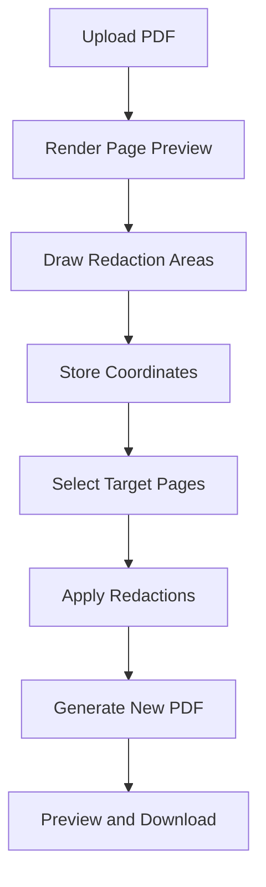

# {{ $frontmatter.title }} 관련

```component VPCard
{
  "title": "JavaScript > Article(s)",
  "desc": "Article(s)",
  "link": "/programming/js/articles/README.md",
  "logo": "/images/ico-wind.svg",
  "background": "rgba(10,10,10,0.2)"
}
```

[[toc]]

---

<SiteInfo
  name="How to Build a Browser-Based PDF Redaction Tool Using JavaScript"
  desc="PDF documents are frequently used to share invoices, contracts, reports, legal records, customer documents, financial statements, and internal business files. But before these documents are shared, th"
  url="https://freecodecamp.org/news/build-pdf-redaction-tool-javascript"
  logo="https://cdn.freecodecamp.org/universal/favicons/favicon.ico"
  preview="https://cdn.hashnode.com/uploads/covers/5e1e335a7a1d3fcc59028c64/18191d9d-9abf-44a3-8330-e452ce7194c2.png"/>

PDF documents are frequently used to share invoices, contracts, reports, legal records, customer documents, financial statements, and internal business files. But before these documents are shared, they may contain information that shouldn't be visible to the recipient.

An invoice might include an account number. A customer document may contain a home address or phone number. A legal file could reveal confidential case information, while an internal report may contain names, references, or business data intended only for employees.

This is where PDF redaction becomes useful.

Redaction allows users to select sensitive areas of a document and permanently cover those areas before creating a new PDF. A practical redaction tool should also support multiple redaction areas, page selection, document preview, and final output verification.

In this tutorial, you'll build a browser-based PDF Redaction Tool using JavaScript. Users will upload a PDF, navigate through its pages, draw redaction boxes directly on the document preview, manage multiple redactions, apply them to selected pages, preview the processed document, rename the final file, and download the redacted PDF.

The entire workflow runs inside the browser. This is particularly useful for privacy-focused document tools because PDF processing can happen locally without requiring a backend server.

By the end of this tutorial, you'll understand not only how to draw redaction areas but also how to translate browser coordinates into PDF coordinates and apply those selections to the actual document.

---

## Redaction Is Not the Same as Drawing a Black Box

A common mistake is assuming that placing a black rectangle over text automatically makes the information secure.

Visually, the document may look redacted. But depending on how the PDF is modified, the original text or image content may still exist underneath the rectangle.

For example, imagine adding a black box as a new annotation layer above an account number. The number is no longer visible on the page, but the underlying PDF content may still be present.

In some poorly redacted documents, users may be able to select, copy, search, or recover the hidden content.

This is why redaction must be treated differently from simple visual decoration.

In our browser-based workflow, the selected areas are applied while generating the processed PDF. The final document should then be reviewed carefully before it's shared.

Never assume that a black rectangle alone guarantees secure removal of underlying PDF content. For high-security or legally sensitive documents, the final file should be validated with a dedicated redaction verification process.

---

## How Browser-Based PDF Redaction Works

The redaction workflow can be divided into a few clear stages.

First, the browser reads the uploaded PDF and renders a page preview. The preview gives users a visual surface where they can identify sensitive information.

Next, users click and drag over the preview to create redaction rectangles.

Each rectangle is stored as a set of coordinates.

```js
const redaction = {
  page: 7,
  x: 420, y: 35,
  width: 310, height: 220
};
```

The application can store multiple rectangles for the same page.

```js
redactions.push(redaction);
```

When users click **Apply & Finalize**, the application determines which pages should receive the selected redactions.

The redaction coordinates are then converted from preview coordinates to actual PDF page coordinates. Finally, the application modifies the PDF and generates a new document for preview and download.

The overall workflow looks like this:



Separating the interface from the PDF processing logic makes the application easier to manage and debug.

---

## Understanding PDF and Canvas Coordinates

One of the most important technical parts of this project is coordinate conversion.

The PDF page shown inside the browser is usually scaled to fit the available screen space. A PDF page may have an actual width of 842 points, while the browser preview is displayed at only 600 pixels wide.

This means a rectangle drawn at `x = 300` on the preview can't simply be placed at `x = 300` in the PDF.

We'll first calculate the scale difference.

```js
const scaleX = pdfPageWidth / canvasWidth;
const scaleY = pdfPageHeight / canvasHeight;
```

The selected rectangle can then be converted.

```js
const pdfX = redaction.x * scaleX;
const pdfWidth = redaction.width * scaleX;
const pdfHeight = redaction.height * scaleY;
```

The Y coordinate requires extra attention because browser canvases and PDF pages commonly use different coordinate origins.

Canvas coordinates generally begin at the top-left corner. PDF coordinates commonly work from the bottom-left.

The Y position can therefore be converted like this:

```js
const pdfY = pdfPageHeight - ((redaction.y + redaction.height) * scaleY);
```

This small calculation is critical.

Without correct coordinate conversion, a redaction box drawn over a phone number might appear several centimeters away from that number in the generated PDF.

Accurate coordinate mapping ensures that the redaction users draw in the browser matches the same area in the final document.

---

## Project Setup

We'll keep the project structure simple because the redaction workflow runs entirely inside the browser.

Create a new project folder with three files:

```sh title="file structure"
pdf-redaction-tool/
├── index.html
├── style.css
└── script.js
```

The <VPIcon icon="fa-brands fa-html5"/>`index.html` file contains the upload interface, PDF preview, redaction controls, and final download section.

The <VPIcon icon="fa-brands fa-css3-alt"/>`style.css` file handles the page layout and redaction overlay styling.

The <VPIcon icon="fa-brands fa-js"/>`script.js` file contains the PDF loading, rendering, coordinate tracking, redaction management, and final PDF generation logic.

Start with a basic HTML structure.

```html title="index.html"
<!DOCTYPE html>
<html lang="en">
  <head>
    <meta charset="UTF-8" />
    <meta name="viewport" content="width=device-width, initial-scale=1.0" />
    <title>PDF Redaction Tool</title>
    <link rel="stylesheet" href="style.css" />
  </head>

  <body>
    <main id="app">
      <section id="uploadSection"></section>
      <section id="editorSection"></section>
      <section id="resultSection"></section>
    </main>
    <script src="script.js"></script>
  </body>
</html>
```

Separating the upload, editor, and result sections makes it easier to show and hide different parts of the interface as users move through the redaction workflow.

---

## What Libraries Are We Using?

We'll use **PDF.js** and **PDF-lib** for this project.

PDF.js handles PDF loading and page rendering. It allows us to display an uploaded PDF page inside a canvas so users can visually select the areas they want to redact.

PDF-lib handles the final document modification. After the user creates redaction areas, PDF-lib opens the original PDF, accesses the selected pages, and applies the redaction rectangles before generating a new file.

Add both libraries before your main JavaScript file.

```html
<script src="https://cdnjs.cloudflare.com/ajax/libs/pdf.js/3.11.174/pdf.min.js"></script>
<script src="https://cdn.jsdelivr.net/npm/pdf-lib/dist/pdf-lib.min.js"></script>
<script src="script.js"></script>
```

Configure the PDF.js worker.

```js
pdfjsLib.GlobalWorkerOptions.workerSrc = "https://cdnjs.cloudflare.com/ajax/libs/pdf.js/3.11.174/pdf.worker.min.js";
```

We'll also create a few variables for storing the active document and redaction data.

```js
let pdfDocument = null;
let pdfBytes = null;
let currentPage = 1;
let redactions = {};
```

Instead of storing every redaction in one flat array, we can organize them by page number.

```js
redactions = {
  1: [],
  2: [],
  7: []
};
```

This structure makes page navigation and per-page redaction management much easier.

---

## Creating the PDF Upload Interface

The first screen users see is the PDF upload area.

Users can drag a document onto the upload box or click the **Select PDF** button to open the browser's file picker.

Create the upload interface.

```html
<section id="uploadSection">
  <h1>PDF Redaction Tool</h1>
  <p>Upload your PDF to permanently black out sensitive information.</p>
  <div id="dropZone" class="drop-zone">
    <div class="upload-icon">☁</div>
    <h2>Drag & Drop PDF Here</h2>
    <p>Or click to browse file</p>
    <button id="selectPdfButton">Select PDF</button>
    <input id="pdfInput" type="file" accept="application/pdf" hidden />
  </div>
</section>
```

Connect the button to the hidden file input.

```js
const pdfInput = document.getElementById("pdfInput");
const selectPdfButton = document.getElementById("selectPdfButton");
selectPdfButton.addEventListener("click", () => {
  pdfInput.click();
});
```

Next, listen for file selection.

```js
pdfInput.addEventListener("change", async event => {
  const file = event.target.files[0];
  if (!file) {
    return;
  }
  await loadPdfFile(file);
});
```

Before loading the document, validate the selected file.

```js
async function loadPdfFile(file) {
  if (file.type !== "application/pdf") {
    alert("Please select a valid PDF file.");
    return;
  }
  pdfBytes = await file.arrayBuffer();
}
```

We can also support drag-and-drop uploads.

```js
dropZone.addEventListener("dragover", event => {
  event.preventDefault();
  dropZone.classList.add("dragging");
});

dropZone.addEventListener("dragleave", () => {
  dropZone.classList.remove("dragging");
});

dropZone.addEventListener("drop", async event => {
  event.preventDefault();
  dropZone.classList.remove("dragging");

  const file = event.dataTransfer.files[0];
  if (file) {
    await loadPdfFile(file);
  }
});
```

After reading the file, load it with PDF.js.

```js
pdfDocument = await pdfjsLib.getDocument({
  data: pdfBytes.slice(0)
}).promise;

currentPage = 1;
await renderPage(currentPage);
```

At this point, the document is ready for preview and redaction.


---

## Previewing Uploaded PDF Pages

Once the PDF has loaded, the application displays the current page inside a canvas.

The canvas serves two purposes. First, it gives users an accurate preview of the document. Second, it becomes the visual surface where redaction rectangles will be drawn.

Create the editor preview.

```html
<section id="editorSection">
  <div class="preview-wrapper">
    <div id="pageContainer">
      <canvas id="pdfCanvas"></canvas>
      <div id="redactionLayer"></div>
    </div>

    <div class="page-navigation">
      <button id="previousPage">&lt;</button>
      <span id="pageInfo"> Page 1 of 1 </span>
      <button id="nextPage">&gt;</button>
    </div>
  </div>
</section>
```

The `pdfCanvas` displays the PDF page.

The `redactionLayer` sits above the canvas and contains the selection boxes created by the user.

Render the active page using PDF.js.

```js
async function renderPage(pageNumber) {
  const page = await pdfDocument.getPage(pageNumber);

  const viewport = page.getViewport({
    scale: 1.4
  });

  const canvas = document.getElementById("pdfCanvas");
  const context = canvas.getContext("2d");

  canvas.width = viewport.width;
  canvas.height = viewport.height;

  await page.render({
    canvasContext: context,
    viewport: viewport
  }).promise;

  updatePageInformation();
  renderSavedRedactions();
}
```

Update the page navigation information.

```js
function updatePageInformation() {
  document .getElementById("pageInfo").textContent = `Page ${currentPage} of ${pdfDocument.numPages}`;
}
```

Users can move to the previous page.

```js
previousPage.addEventListener("click", async () => {
  if (currentPage <= 1) {
    return;
  }
  currentPage--;
  await renderPage(currentPage);
});
```

The next-page button works in the same way.

```js
nextPage.addEventListener("click", async () => {
  if (currentPage >= pdfDocument.numPages) {
    return;
  }
  currentPage++;
  await renderPage(currentPage);
});
```

Whenever users change pages, the canvas renders the selected PDF page and restores any redaction boxes already saved for that page.

This is important because redactions are page-specific. A rectangle created on page 7 should not automatically appear on page 8 unless the user later chooses to apply that selection to multiple pages.


The PDF is now loaded, rendered, and ready for user interaction.

---

## Drawing Redaction Areas on the PDF

Now that the PDF page is visible, users need a simple way to mark the information they want to hide.

In this project, users can click and drag directly over the page preview to create a redaction rectangle. The interaction is similar to selecting an area in an image editor.

We'll first track the starting position of the pointer.

```js
let isDrawing = false;

let startX = 0;
let startY = 0;

let activeBox = null;
```

Listen for the pointer-down event on the redaction layer.

```js
redactionLayer.addEventListener("pointerdown", event => {
  isDrawing = true;

  const bounds = redactionLayer.getBoundingClientRect();
  startX = event.clientX - bounds.left;
  startY = event.clientY - bounds.top;
  activeBox = document.createElement("div");
  activeBox.className = "redaction-box";
  activeBox.style.left = `${startX}px`;
  activeBox.style.top = `${startY}px`;
  redactionLayer.appendChild(activeBox);
});
```

As the pointer moves, update the rectangle dimensions.

```js
redactionLayer.addEventListener("pointermove", event => {
  if (!isDrawing) {
    return;
  }

  const bounds = redactionLayer.getBoundingClientRect();
  const currentX = event.clientX - bounds.left;
  const currentY = event.clientY - bounds.top;

  const width = Math.abs(currentX - startX);
  const height = Math.abs(currentY - startY);
  activeBox.style.width = `${width}px`;
  activeBox.style.height = `${height}px`;
  activeBox.style.left = `${Math.min(startX, currentX)}px`;
  activeBox.style.top = `${Math.min(startY, currentY)}px`;
});
```

The `Math.min()` calls are important because users may drag in any direction. They can begin at the top-left and move down, or start at the bottom-right and drag upward.

When the pointer is released, save the completed rectangle.

```js
redactionLayer.addEventListener("pointerup", () => {
  if (!isDrawing) {
    return;
  }

  isDrawing = false;
  saveRedaction(activeBox);
  activeBox = null;
});
```

The redaction area can be styled as a semi-transparent black rectangle during editing.

```css
.redaction-box {
  position: absolute;
  background: rgba(0, 0, 0, 0.8);
  border: 1px dashed #ffffff;
  cursor: move;
}
```

Using a transparent preview helps users see which content is currently covered while still recognizing the surrounding page.


---

## Storing and Managing Redactions

Drawing a rectangle visually is only the first step. The application also needs to remember its position and dimensions.

When a redaction box is completed, read its current coordinates.

```js
function saveRedaction(box) {
  const redaction = {
    x: parseFloat(box.style.left),
    y: parseFloat(box.style.top),
    width: box.offsetWidth,
    height: box.offsetHeight
  };

  if (!redactions[currentPage]) {
    redactions[currentPage] = [];
  }

  redactions[currentPage].push(redaction);
  renderSavedRedactions();
  updateRedactionList();
}
```

Because redactions are stored by page, users can navigate through the document without losing their selections.

For example:

```js
redactions = {
  7: [{
    x: 420, y: 35,
    width: 310, height: 220
  }, {
    x: 160, y: 320,
    width: 150, height: 140
  }]
};
```

Page 7 now contains two redaction areas.

The interface can display them as **Redaction #1** and **Redaction #2**.

```js
function updateRedactionList() {
  const list = document.getElementById("redactionList");
  list.innerHTML = "";

  const pageRedactions = redactions[currentPage] || [];
  pageRedactions.forEach((redaction, index) => {
    const item = document.createElement("div");
    item.textContent = `Redaction #${index + 1}`;
    list.appendChild(item);
  });
}
```

This list gives users a clear overview of the areas selected on the current page.

### Removing One Redaction

Users may accidentally cover the wrong section of a document. They shouldn't have to clear every selection and begin again.

Add a remove button to each redaction item.

```js
const removeButton = document.createElement("button");
removeButton.textContent = "×";
removeButton.addEventListener("click",() => {
  removeRedaction(index);
});
item.appendChild(removeButton);
```

Remove only the selected rectangle.

```js
function removeRedaction(index) {
  redactions[currentPage].splice(index, 1);
  renderSavedRedactions();
  updateRedactionList();
}
```

The remaining redactions stay unchanged.

### Clearing All Redactions from the Current Page

The **Clear All on This Page** button removes every selection from the active page.

```js
clearPageButton.addEventListener("click", () => {
  redactions[currentPage] = [];
  renderSavedRedactions();
  updateRedactionList();
});
```

Notice that this doesn't remove redactions created on other pages.

If page 7 is cleared, selections saved on pages 2 or 5 remain available.


---

## Applying Redactions to Selected Pages

A redaction tool needs to handle more than a single page.

Sometimes the sensitive information appears only once. In other documents, the same information may repeat across several pages.

For example, a confidential reference number may appear in the header of every page. Manually drawing the same rectangle 50 times would be inefficient.

Our interface provides three page selection modes:

1. **Current page only** applies the redaction to the active page.
2. **All pages** copies the current page's redaction positions across the complete document.
3. **Specific pages** applies the selections only to page numbers or ranges entered by the user.

Create the page selection controls.

```html
<h3>3. Apply to Pages</h3>
<label>
  <input type="radio" name="applyMode" value="current" checked>
  Current page only
</label>
<label>
  <input type="radio" name="applyMode" value="all">
  All pages
</label>
<label>
  <input type="radio" name="applyMode" value="specific">
  Specific pages
</label>
<input id="pageRange" type="text" placeholder="e.g., 1, 3-5, 10">
```

Read the selected mode.

```js
const applyMode = document.querySelector('input[name="applyMode"]:checked').value;
```

For the current page, only one page number is required.

```js
if (applyMode === "current") {
  targetPages = [currentPage];
}
```

For all pages, generate the complete page list.

```js
if (applyMode === "all") {
  targetPages = Array.from({
    length: pdfDocument.numPages
  }, (_, index) => index + 1);
}
```

Specific page ranges require a small parser.

```js
function parsePageRange(value) {
  const pages = new Set();
  value.split(",").forEach(part => {
    const range = part.trim().split("-");
    if (range.length === 2) {
      const start = Number(range[0]);
      const end = Number(range[1]);
      for (let page = start; page <= end; page++) {
        pages.add(page);
      }
    } else {
      pages.add(Number(range[0]));
    }
  });
  return [...pages];
}
```

The value:

```plaintext
1, 3-5, 10
```

becomes:

```plaintext
[1, 3, 4, 5, 10]
```

Before processing, remove invalid page numbers.

```js
targetPages = targetPages.filter(page =>
  page >= 1 && page <= pdfDocument.numPages
);
```

This page selection feature is particularly useful for repeated headers, footers, document IDs, or other information positioned consistently across several pages.

### Applying and Finalizing the Redactions

After users have created their redaction areas and selected the target pages, they can click **Apply & Finalize**.

Create the action controls.

```html
<div class="action-buttons">
  <button id="applyButton">Apply & Finalize</button>
  <button id="startOverButton">Start Over</button>
</div>
```

Connect the finalize button to the processing function.

```js
applyButton.addEventListener("click", async () => {
  const pageRedactions = redactions[currentPage] || [];
  if (pageRedactions.length === 0) {
    alert("Please add at least one redaction.");
    return;
  }
  await generateRedactedPdf();
});
```

The **Start Over** button clears the current document and returns users to the upload interface.

```js
startOverButton.addEventListener("click", () => {
  pdfDocument = null;
  pdfBytes = null;
  currentPage = 1;
  redactions = {};
  pdfInput.value = "";
  location.reload();
});
```

In a production application, you can reset individual interface sections instead of reloading the complete page.


At this stage, users can draw several redaction boxes, remove individual selections, clear all redactions from the active page, and choose exactly which pages should receive the selected redaction areas.

---

## Generating the Redacted PDF

The redaction boxes currently exist only in the browser preview. To create the final document, we need to apply those positions to the actual PDF pages.

Load the original PDF using PDF-lib.

```js
async function generateRedactedPdf() {
  const pdfDoc = await PDFLib.PDFDocument.load(pdfBytes.slice(0));
  const pages = pdfDoc.getPages();

  const sourceRedactions = redactions[currentPage] || [];
  const targetPages = getTargetPages();
}
```

Next, loop through the selected pages.

```js
targetPages.forEach(pageNumber => {
  const page = pages[pageNumber - 1];
  applyPageRedactions(page, sourceRedactions);
});
```

The browser preview and PDF page may have different dimensions, so each rectangle must be scaled before it's applied.

```js
function applyPageRedactions(page, pageRedactions) {
  const {
    width: pdfWidth,
    height: pdfHeight
  } = page.getSize();

  const canvas = document.getElementById("pdfCanvas");
  const scaleX = pdfWidth / canvas.width;
  const scaleY = pdfHeight / canvas.height;

  pageRedactions.forEach(redaction => {
    const x = redaction.x * scaleX;
    const width = redaction.width * scaleX;
    const height = redaction.height * scaleY;
    const y = pdfHeight - (
      redaction.y + redaction.height
    ) * scaleY;

    page.drawRectangle({
      x, y,
      width, height,
      color: PDFLib.rgb(0, 0, 0)
    });
  });
}
```

Here, the black rectangles are written into the generated PDF page content rather than remaining browser-only preview elements.

Finally, save the processed document.

```js
const outputBytes = await pdfDoc.save();

const outputBlob = new Blob([outputBytes], {
  type: "application/pdf"
});

showFinalPreview(outputBlob);
```

This distinction is important because the visual result alone should never be used as proof that hidden content has been securely removed.

---

## Previewing and Renaming the Final PDF

Before downloading the document, users should be able to review the processed pages.

The final preview helps confirm that each selected area appears in the expected position.

Create a new PDF.js document from the processed file.

```js
async function showFinalPreview(blob) {
  const bytes = await blob.arrayBuffer();
  const finalPdf = await pdfjsLib.getDocument({
    data: bytes
  }).promise;

  renderFinalPage(finalPdf, 1);
}
```

The preview can use the same page navigation approach we used earlier.

```js
let finalPage = 1;

nextFinalPage.addEventListener("click", async () => {
  if (finalPage >= finalPdf.numPages) {
    return;
  }
  finalPage++;

  await renderFinalPage(finalPdf, finalPage);
});
```

Users can move through the generated PDF and visually check the applied areas before saving the file.


The tool also allows users to change the output filename.

For example, the automatically generated name might be:

```text
combined-images (12)_redacted.pdf
```

Create an editable filename input.

```html
<input id="outputFilename" type="text" value="document_redacted.pdf">
```

Before downloading, make sure the filename ends with `.pdf`.

```js
function getOutputFilename() {
  let filename = outputFilename.value.trim();

  if (!filename.toLowerCase().endsWith(".pdf")) {
    filename += ".pdf";
  }

  return filename;
}
```

Allowing the filename to be changed is useful when users process several versions of the same document.


---

## Downloading the Final PDF

The final result section displays basic information about the processed document.

In this project, users can see the filename, total number of pages, and final file size before downloading.

Calculate the file size in megabytes.

```js
function formatFileSize(bytes) {
  return (bytes / 1024 / 1024).toFixed(2) + " MB";
}
```

Update the result information.

```js
filePageCount.textContent = `Total Pages: ${pdfDocument.numPages}`;
fileSize.textContent = `File Size: ${formatFileSize(outputBlob.size)}`;
```

To download the document, create a temporary object URL.

```js
downloadButton.addEventListener("click", () => {
  const url = URL.createObjectURL(outputBlob);
  const link = document.createElement("a");
  link.href = url;
  link.download = getOutputFilename();
  link.click();
  URL.revokeObjectURL(url);
});
```

The browser downloads the generated PDF using the filename selected by the user.


After downloading, users can click **Start Over** to clear the existing document and process another PDF.

```js
function resetTool() {
  pdfDocument = null;
  pdfBytes = null;
  redactions = {};
  currentPage = 1;
  pdfInput.value = "";
  showUploadSection();
}
```

The complete processing workflow is now connected: users can mark areas on a page, apply those selections, preview the result, rename the generated file, review its details, and download the processed PDF.

---

## Demo: How the PDF Redaction Tool Works

Now that the complete redaction workflow is connected, let's walk through the application from upload to download.

### Step 1: Upload the PDF Document

Users begin by uploading a PDF through the drag-and-drop area or by clicking the **Select PDF** button.

The browser validates the file, reads the document into memory, and prepares it for local processing. No backend server is required for this workflow.


### Step 2: Preview and Navigate the PDF

After the file loads, the current PDF page appears inside the preview area.

Page navigation controls allow users to move backward and forward through the document. The current page number and total page count are displayed below the preview.

Users can review the document first and navigate to the page containing the information they want to cover.


### Step 3: Configure the Redaction

The redaction settings appear beside the PDF preview.

Users draw a rectangle directly over the document by clicking and dragging across the sensitive area. The selected region appears as a dark overlay, making the chosen position easy to verify.

The page application controls also let users choose whether the same redaction position should be applied to the current page, all pages, or specific page numbers.

This is helpful when the same field appears in a consistent position across several pages.


### Step 4: Manage Multiple Redaction Areas

A single page may contain several areas that need to be covered.

For example, users may select a name near the top of the page and another piece of information farther down the document.

Each selection appears separately as **Redaction #1**, **Redaction #2**, and so on.

Individual remove controls allow users to delete one selection without affecting the others. The **Clear All on This Page** option removes every redaction area from the active page.

This gives users a chance to correct selections before processing the PDF.


### Step 5: Apply and Finalize the PDF

Once the redaction areas and target pages are ready, users click **Apply & Finalize**.

The application converts the browser selection coordinates into PDF page coordinates and applies the opaque areas to the selected pages while generating the processed document.

If the wrong PDF was uploaded or users want to begin again, the **Start Over** button resets the current workflow.


### Step 6: Preview the Processed PDF

After processing finishes, the generated PDF appears in a new preview section.

Users can navigate through the document and visually confirm that the selected areas are covered in the expected locations.

This review stage is important. A small coordinate or page-selection mistake could leave information visible on another page.


### Step 7: Rename the PDF

Before downloading, users can edit the generated filename.

The application may automatically add `_redacted` to the original filename, but users can replace it with a name that better matches their document workflow.

For example:

```plaintext
customer-record_redacted.pdf
```

or:

```plaintext
public-report-copy.pdf
```


### Step 8: Review File Details and Download

The final section displays the output filename, number of pages, and generated file size.

After reviewing these details, users click **Download** to save the PDF locally.

The browser creates the download directly from the processed document data.


### Step 9: Start Over with Another PDF

After downloading the file, users can click **Start Over**.

The application clears the current PDF, page preview, stored coordinates, and generated result before returning to the upload interface.

Users can then process another document without manually refreshing the browser.


---

## How to Verify the Redacted PDF

A document that looks correct in the preview should still be checked before it's shared.

First, navigate through every affected page and confirm that each intended area is fully covered. Pay particular attention to redactions applied across multiple pages because page layouts may not always be identical.

The application can perform a simple check to confirm that redaction areas exist before finalization.

```js
const totalRedactions =
  Object.values(redactions).reduce((total, items) => total + items.length, 0);

if (totalRedactions === 0) {
  alert("No redaction areas were added.");
  return;
}
```

You should also verify that every selected target page exists.

```js
const validPages = targetPages.every(page =>
  page >= 1 && page <= pdfDocument.numPages
);
```

For visual masking workflows like the rectangle-based implementation shown here, remember that an opaque rectangle does **not by itself prove that the underlying PDF content has been securely removed**.

If the document contains legally protected, highly confidential, or compliance-sensitive information, use a standards-based redaction and sanitization process that removes the underlying content objects, then test the result for text selection, searchability, annotations, metadata, and other recoverable content before sharing it.

That verification distinction is especially important in a redaction project.

---

## Performance Optimization Tips

PDF redaction itself may appear simple, but page rendering and document generation can consume noticeable browser memory when working with large files.

Avoid rendering every PDF page at full resolution simultaneously. Render the active page when users navigate to it.

```js
await renderPage(currentPage);
```

Store redaction coordinates as small JavaScript objects rather than saving complete canvas images.

```js
redactions[currentPage].push({
  x, y,
  width, height
});
```

When generating the output, modify only the required pages.

```js
for (const pageNumber of targetPages) {
  const page = pages[pageNumber - 1];
  applyPageRedactions(page, sourceRedactions);
s}
```

Temporary object URLs should also be released after use.

```js
URL.revokeObjectURL(url);
```

These choices keep the interface responsive and reduce unnecessary memory use, particularly when processing long reports or multi-page business documents.

---

## Important Notes and Common Mistakes

The most common mistake in a redaction interface is incorrect coordinate conversion.

The canvas preview and actual PDF page may have different dimensions. Applying browser coordinates directly to the PDF can move the rectangle away from the intended content.

Always calculate the scale values first.

```js
const scaleX = pdfWidth / canvas.width;
const scaleY = pdfHeight / canvas.height;
```

Another mistake is forgetting that PDF and canvas Y coordinates may use different origins.

```js
const pdfY = pdfHeight - (
  redaction.y + redaction.height
) * scaleY;
```

Users should also be careful when applying one selection to all pages. A header may appear in the same position throughout a document, but other page layouts can change. Always preview the processed result.

Validate custom page ranges before processing.

```js
targetPages = targetPages.filter(page =>
  Number.isInteger(page) &&
  page >= 1 &&
  page <= pdfDocument.numPages
);
```

Finally, don't describe a visually covered area as securely removed unless the implementation actually removes the underlying text, image, annotation, and related content from the PDF structure.

For a simple browser project, opaque masking demonstrates coordinate mapping and PDF modification well. A production redaction system handling sensitive information requires stronger content-removal and output-sanitization logic.

---

## Conclusion

In this tutorial, you built a browser-based PDF redaction interface using JavaScript.

You learned how to upload a PDF, render document pages with PDF.js, navigate between pages, draw redaction areas, store rectangle coordinates, manage multiple selections, choose target pages, convert canvas coordinates into PDF coordinates, generate a processed PDF, preview the result, rename the output file, and download it locally.

You also saw an important security distinction: visually covering content with an opaque rectangle is not automatically the same as permanently removing the underlying PDF content. That difference matters when moving from a learning project to a production-grade redaction system.

::: info

You can explore the browser-based workflow with the [<VPIcon icon="fas fa-globe"/>PDF Redaction Tool.](https://allinonetools.net/redact-pdf/)

<SiteInfo
  name="Redact PDF Online - Free Secure PDF Redaction Tool"
  desc="Easily redact PDF documents online for free. Permanently black out sensitive text and images. Secure, fast, and simple PDF redaction at AllInOneTools."
  url="https://allinonetools.net/redact-pdf//"
  logo="https://allinonetools.net/wp-content/uploads/2025/05/cropped-yellow-icon-removebg-preview-192x192.png"
  preview="https://allinonetools.net/wp-content/uploads/2025/09/assets_task_01k4chs6m6f6csnf1xbc6c6txr_1757062992_img_0-e1764822756169.webp"/>

:::

Once you understand the coordinate and page-processing workflow, you can extend the project with searchable-text detection, automatic pattern identification, annotation cleanup, metadata sanitization, redaction verification, or a true content-removal pipeline.

The same coordinate-mapping concepts can also be reused when building PDF annotation, signature, highlighting, cropping, and document review tools.

<!-- TODO: add ARTICLE CARD -->
```component VPCard
{
  "title": "How to Build a Browser-Based PDF Redaction Tool Using JavaScript",
  "desc": "PDF documents are frequently used to share invoices, contracts, reports, legal records, customer documents, financial statements, and internal business files. But before these documents are shared, th",
  "link": "https://chanhi2000.github.io/bookshelf/freecodecamp.org/build-pdf-redaction-tool-javascript.html",
  "logo": "https://cdn.freecodecamp.org/universal/favicons/favicon.ico",
  "background": "rgba(10,10,35,0.2)"
}
```
