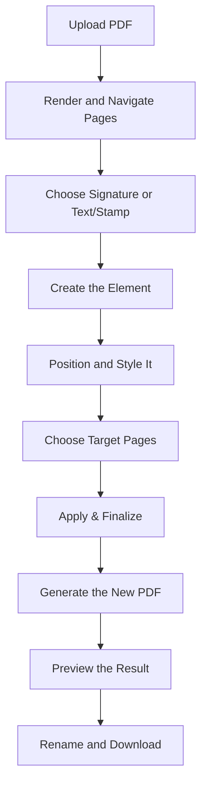

# {{ $frontmatter.title }} 관련

```component VPCard
{
  "title": "JavaScript > Article(s)",
  "desc": "Article(s)",
  "link": "/programming/js/articles/README.md",
  "logo": "/images/ico-wind.svg",
  "background": "rgba(10,10,10,0.2)"
}
```

[[toc]]

---

<SiteInfo
  name="How to Build a Browser-Based PDF Signature Tool Using JavaScript"
  desc="PDF documents are commonly used for agreements, forms, approvals, invoices, reports, applications, and other documents that may need a signature or additional text before they are shared. A traditiona"
  url="https://freecodecamp.org/news/build-pdf-signature-tool-javascript"
  logo="https://cdn.freecodecamp.org/universal/favicons/favicon.ico"
  preview="https://cdn.hashnode.com/uploads/covers/5e1e335a7a1d3fcc59028c64/175ab1f9-2917-4588-9e67-50607f6fa5a1.png"/>

PDF documents are commonly used for agreements, forms, approvals, invoices, reports, applications, and other documents that may need a signature or additional text before they are shared.

A traditional workflow often involves printing the document, signing it by hand, scanning it again, and sending the new file. For a simple electronic signature, that process adds unnecessary steps.

In this tutorial, you'll build a browser-based PDF Signature Tool using JavaScript. Users will be able to upload a PDF, preview and navigate its pages, and add content directly to the document.

The application will support two main element types: **Signature** and **Text/Stamp**.

For signatures, users can draw directly in the browser, type their name and choose a signature style, or upload an existing signature image. For text-based elements, they can enter custom text or use preset stamps such as **APPROVED**, **CONFIDENTIAL**, **DRAFT**, and **PAID**.

After creating an element, users can position it on the PDF preview and adjust properties such as scale, rotation, opacity, font size, and color. The element can then be applied to the current page, every page, or a specific set of pages.

Once processing is complete, the application generates a new PDF for review. Users can preview the result, rename the output file, check its page count and file size, and download it directly from the browser.

The project uses PDF.js for document rendering and PDF-lib for modifying and generating the final PDF.

By the end of this tutorial, you'll understand how to build an interactive PDF editing workflow that combines canvas-based input, image embedding, text placement, coordinate conversion, page selection, and client-side file generation.

---

## What This PDF Signature Tool Can Do

The application provides a single editing workflow for adding signatures, text, and common document stamps to PDF pages.

When **Signature** is selected, users can create the signature in three different ways.

1. The **Draw** option provides a canvas where the user can write a signature using a mouse, trackpad, stylus, or touch input.
2. The **Type** option converts entered text into a signature-style element. Users can type their name, adjust the size, and choose from the available signature styles.
3. The **Upload** option accepts an existing signature image. This is useful for someone who already has a transparent PNG or another supported image of their handwritten signature.

The second element type is **Text/Stamp**. Users can enter custom text such as:

```text
Signed on: 08-09-2025
```

They can also quickly choose a predefined stamp:

```text
APPROVED
CONFIDENTIAL
DRAFT
PAID
```

After an element has been created, the application provides controls for its placement and appearance. Users can move it to the required location and adjust its scale, rotation, opacity, and position.

Text and stamp elements can additionally use configurable font sizes and colors.

The page controls determine where the selected element will be applied. A signature may belong only on the final page of a contract, while a `CONFIDENTIAL` stamp may need to appear on every page.

The application therefore supports:

```text
Current page only
All pages
Specific pages
```

The goal is to provide one consistent workflow for several common PDF editing tasks without requiring separate tools for each element type.

---

## Electronic Signatures vs Digital Signatures

Before building the application, it's important to distinguish between an **electronic signature** and a **digital signature**.

The tool in this tutorial creates an electronic signature workflow.

A drawn signature, typed signature, or uploaded signature image is placed visually onto the PDF page. This is similar to signing a document by hand and inserting a visible representation of that signature into the file.

For example, a user might draw a signature on a canvas:

```js
const signatureImage = signatureCanvas.toDataURL("image/png");
```

The generated image can then be embedded into the PDF.

A digital signature is technically different.

Certificate-based digital signatures use cryptographic methods to help verify document integrity and the identity associated with a signing certificate. They may involve digital certificates, private keys, signature validation, and trust chains.

Simply placing a handwritten signature image on a PDF doesn't create that type of cryptographic verification.

This distinction matters because the terms are sometimes used interchangeably in everyday conversation even though the underlying technologies are different.

The project we're building focuses on **visual electronic signatures and document elements**. It doesn't create certificate-based cryptographic digital signatures.

Keeping that distinction clear makes it easier to understand exactly what the application does and what would require a more advanced signing system.

---

## How the Browser-Based Workflow Works

The process begins when a user selects a PDF file.

PDF.js loads the document and renders the current page into a browser canvas. Previous and next buttons allow the user to navigate through the PDF before choosing where to place an element.

The user then selects one of two element types:

```text
Signature
Text/Stamp
```

If **Signature** is selected, the application provides three creation methods:

```text
Draw
Type
Upload
```

The selected signature is converted into an element that can be displayed over the PDF preview.

If **Text/Stamp** is selected, the application instead creates a text element using either custom content or one of the predefined stamp values.

The complete workflow looks like this:



During editing, the element displayed over the PDF preview is only a browser-side representation. Its position must later be translated into coordinates that match the actual PDF page.

For example, the application may store an element like this:

```js
const element = {
  type: "signature",
  x: 622,
  y: 496,
  scale: 1.14,
  rotation: 0,
  opacity: 1
};
```

When the user clicks **Apply & Finalize**, those values are used to calculate the final placement inside the PDF.

This separation between the interactive preview and the final PDF generation is the foundation of the project. It allows users to visually prepare the document first and create the modified PDF only after the placement is ready.

---

## Project Setup

To keep the project easy to understand, we'll use three main files:

```sh title="file structure"
pdf-signature-tool/
│
├── index.html
├── style.css
└── script.js
```

The HTML file contains the upload interface, PDF preview, editing controls, final preview, and download section.

The CSS file handles the layout and visual states.

The JavaScript file manages PDF loading, page rendering, signature creation, text and stamp elements, positioning, final PDF generation, and downloading.

Start with the basic HTML structure:

```html
<!DOCTYPE html>
<html lang="en">
  <head>
    <meta charset="UTF-8" />
    <meta name="viewport" content="width=device-width, initial-scale=1.0" />
    <title>PDF Signature Tool</title>
    <link rel="stylesheet" href="style.css" />
  </head>
  <body>
    <main class="pdf-signature-tool">
      <section id="uploadSection">
        <h1>PDF Signature Tool</h1>
        <p>Upload your PDF to add your electronic signature.</p>
        <div id="dropZone">
          <p>Drag & Drop PDF Here</p>
          <p>Or click to browse file</p>
          <button id="selectPdfButton">Select PDF</button>
          <input type="file" id="pdfInput" accept="application/pdf" hidden />
        </div>
      </section>
      <section id="editorSection" hidden>
        <div class="pdf-preview">
          <div id="previewContainer">
            <canvas id="pdfCanvas"></canvas>
            <div id="elementLayer"></div>
          </div>
          <div class="page-navigation">
            <button id="previousPage">&lt;</button>
            <span id="pageInfo"> Page 1 of 1 </span>
            <button id="nextPage">&gt;</button>
          </div>
        </div>
        <aside id="editorControls">
        <!-- Signature and text controls will be added here -->
        </aside>
      </section>

      <section id="resultSection" hidden>
      <!-- Final preview and download controls will be added here -->
      </section>
    </main>

    <script src="script.js"></script>
  </body>
</html>
```

The `previewContainer` is especially important.

It contains two layers:

```text
PDF Canvas
    +
Interactive Element Layer
```

The PDF page is rendered onto the canvas, while signatures, text, and stamps are displayed in a separate overlay.

This allows users to move and style an element without modifying the original PDF every time they make a small adjustment.

The overlay should match the dimensions and position of the PDF canvas.

```css
#previewContainer {
  position: relative;
  display: inline-block;
}

#pdfCanvas {
  display: block;
}

#elementLayer {
  position: absolute;
  inset: 0;
  pointer-events: none;
}
```

Individual signature and text elements can later enable their own pointer interactions.

```css
.pdf-element {
  position: absolute;
  cursor: move;
  pointer-events: auto;
  transform-origin: center;
}
```

This layered structure becomes the foundation of the interactive editor.

---

## What Libraries Are We Using?

This project uses two JavaScript libraries for different parts of the PDF workflow.

### PDF.js for Rendering and Previewing

PDF.js is responsible for reading the uploaded document and rendering its pages inside the browser.

A page can be loaded like this:

```js
const page = await pdfDocument.getPage(currentPage);
```

The page is then rendered to a canvas:

```js
const viewport = page.getViewport({
  scale: 1.5
});

const context = pdfCanvas.getContext("2d");
pdfCanvas.width = iewport.width;
pdfCanvas.height = viewport.height;

await page.render({
  canvasContext: context,
  viewport
}).promise;
```

PDF.js handles the visual preview.

### PDF-lib for Modifying the PDF

PDF-lib is used later when the user clicks **Apply & Finalize**.

It allows us to load the original PDF bytes and add content to its pages.

For example:

```js
const pdfDoc = await PDFLib.PDFDocument.load(originalPdfBytes);
```

An uploaded PNG signature can then be embedded:

```js
const signatureImage = await pdfDoc.embedPng(signatureBytes);
```

Text can also be drawn directly onto a PDF page:

```js
page.drawText("APPROVED", {
  x: 100,
  y: 100,
  size: 18
});
```

The two libraries therefore have separate responsibilities:

```text
PDF.js
→ Load and visually render PDF pages

PDF-lib
→ Modify pages and generate the final PDF
```

Separating these responsibilities keeps the editor easier to manage.

Include both libraries in the project before <VPIcon icon="fa-brands fa-js"/>`script.js`.

```html
<script src="https://cdnjs.cloudflare.com/ajax/libs/pdf.js/3.11.174/pdf.min.js"></script>
<script src="https://unpkg.com/pdf-lib/dist/pdf-lib.min.js"></script>
<script src="script.js"></script>
```

Configure the PDF.js worker as well:

```js
pdfjsLib.GlobalWorkerOptions.workerSrc =
    "https://cdnjs.cloudflare.com/ajax/libs/pdf.js/3.11.174/pdf.worker.min.js";
```

For a production project, pin and test the exact library versions you use rather than automatically loading an unspecified latest release.

---

## Uploading and Previewing the PDF

The first interactive step is accepting the user's PDF.

Get references to the required elements:

```js
const pdfInput = document.getElementById("pdfInput");
const selectPdfButton = document.getElementById("selectPdfButton");
const dropZone = document.getElementById("dropZone");
const uploadSection = document.getElementById("uploadSection");
const editorSection = document.getElementById("editorSection");
const pdfCanvas = document.getElementById("pdfCanvas");
```

We also need a few variables to store the current document state.

```js
let pdfDocument = null;
let originalPdfBytes = null;
let currentPage = 1;
let totalPages = 0;
```

Clicking the custom button opens the hidden file input.

```js
selectPdfButton.addEventListener("click", () => { pdfInput.click(); });
```

When a file is selected, pass it to the PDF loading function.

```js
pdfInput.addEventListener("change", event => {
  const file = event.target.files[0];
  if (file) {
    loadPdf(file);
  }
});
```

Before processing the file, validate its type.

```js
async function loadPdf(file) {
  if (file.type !== "application/pdf") {
    alert("Please select a valid PDF file.");
    return;
  }
}
```

Read the file as an `ArrayBuffer`.

```js
const arrayBuffer = await file.arrayBuffer();
```

Keep a copy of the original bytes because PDF.js and PDF-lib will use the document at different stages.

```js
originalPdfBytes = new Uint8Array(arrayBuffer);
```

Now load the document with PDF.js.

```js
pdfDocument = await pdfjsLib.getDocument({
  data: originalPdfBytes.slice()
}).promise;
```

Store the number of pages.

```js
totalPages = pdfDocument.numPages;
currentPage = 1;
```

Switch from the upload interface to the editor.

```js
uploadSection.hidden = true;
editorSection.hidden = false;
```

Finally, render the first page.

```js
await renderPage(currentPage);
```

The complete loading function becomes:

```js
async function loadPdf(file) {
  if (file.type !== "application/pdf") {
    alert("Please select a valid PDF file.");
    return;
  }

  const arrayBuffer = await file.arrayBuffer();
  originalPdfBytes = new Uint8Array(arrayBuffer);

  pdfDocument = await pdfjsLib.getDocument({
    data: originalPdfBytes.slice()
  }).promise;

  totalPages = pdfDocument.numPages;
  currentPage = 1;
  uploadSection.hidden = true;
  editorSection.hidden = false;

  await renderPage(currentPage);
}
```

For drag-and-drop support, prevent the browser's default behavior.

```js
dropZone.addEventListener("dragover", event => {
  event.preventDefault();
  dropZone.classList.add("drag-active");
});
```

Remove the active state when the file leaves the drop area.

```js
dropZone.addEventListener("dragleave", () => {
  dropZone.classList.remove("drag-active");
});
```

Handle the dropped file:

```js
dropZone.addEventListener("drop", event => {
  event.preventDefault();
  dropZone.classList.remove("drag-active");

  const file = event.dataTransfer.files[0];
  if (file) {
    loadPdf(file);
  }
});
```


---

## Rendering the Current PDF Page

The `renderPage()` function loads one page from the PDF and displays it on the canvas.

```js
async function renderPage(pageNumber) {
  const page = await pdfDocument.getPage(pageNumber);
  const viewport = page.getViewport({ scale: 1.5 });
  const context = pdfCanvas.getContext("2d");
  pdfCanvas.width = viewport.width;
  pdfCanvas.height = viewport.height;

  await page.render({
    canvasContext: context,
    viewport
  }).promise;

  updatePageInfo();
}
```

Because the interactive element layer sits above the canvas, it must use the same dimensions.

```js
const elementLayer = document.getElementById("elementLayer");
elementLayer.style.width = `${viewport.width}px`;
elementLayer.style.height = `${viewport.height}px`;
```

Add those lines inside `renderPage()` after setting the canvas dimensions.

The page information can then be updated:

```js
function updatePageInfo() {
  pageInfo.textContent = `Page ${currentPage} of ${totalPages}`;
}
```

At this point, the uploaded PDF page is visible, but users still need a way to move through multi-page documents.

---

## Adding PDF Page Navigation

Get the navigation controls:

```js
const previousPage = document.getElementById("previousPage");
const nextPage = document.getElementById("nextPage");
const pageInfo = document.getElementById("pageInfo");
```

The previous button decreases the page number.

```js
previousPage.addEventListener("click", async () => {
  if (currentPage <= 1) {
    return;
  }
  currentPage--;
  await renderPage(currentPage);
});
```

The next button moves forward.

```js
nextPage.addEventListener("click", async () => {
  if (currentPage >= totalPages) {
    return;
  }
  currentPage++;
  await renderPage(currentPage);
});
```

The boundary checks prevent navigation outside the document.

For a 12-page PDF, the interface may display:

```text
Page 12 of 12
```

The previous button remains available, while the next action can be disabled because the user is already on the final page.

```js
function updateNavigationState() {
  previousPage.disabled = currentPage === 1;
  nextPage.disabled = currentPage === totalPages;
}
```

Call this function whenever a new page is rendered.

```js
function updatePageInfo() {
  pageInfo.textContent = `Page ${currentPage} of ${totalPages}`;
  updateNavigationState();
}
```

The user can now upload a PDF, preview its pages, and navigate to the exact page where a signature, custom text, or document stamp needs to be placed.


---

## Choosing an Element to Add

Once the PDF is loaded and the correct page is visible, the user can choose what type of element to place on the document.

The editor provides two options:

```text
Signature
Text/Stamp
```

Create the element selector:

```html
<div class="element-selector">
  <h3>1. Choose Element</h3>
  <label>
    <input type="radio" name="elementType" value="signature" checked />
    Signature
  </label>

  <label>
    <input type="radio" name="elementType" value="text" />
    Text/Stamp
  </label>
</div>
```

Get the controls in JavaScript:

```js
const elementTypeInputs = document.querySelectorAll('input[name="elementType"]');
const signatureControls = document.getElementById("signatureControls");
const textControls = document.getElementById("textControls");
```

Listen for changes:

```js
elementTypeInputs.forEach(input => {
  input.addEventListener("change", event => {
    const type = event.target.value;
    if (type === "signature") {
      signatureControls.hidden = false;
      textControls.hidden = true;
    } else {
      signatureControls.hidden = true;
      textControls.hidden = false;
    }
  });
});
```

This keeps the interface focused. Signature-specific controls appear only when the user is creating a signature, while text and stamp controls appear when that element type is selected.

---

## Creating a Signature

The signature workflow supports three methods:

```text
Draw
Type
Upload
```

Create the method selector:

```html
<div id="signatureControls">
  <h3>2. Create Signature</h3>

  <div class="signature-tabs">
    <button data-method="draw" class="active">Draw</button>
    <button data-method="type">Type</button>
    <button data-method="upload">Upload</button>
  </div>

  <div id="drawPanel"></div>
  <div id="typePanel" hidden></div>
  <div id="uploadPanel" hidden></div>
</div>
```

Track the currently selected method:

```js
let signatureMethod = "draw";
```

Switch between the three panels:

```js
const signatureTabs = document.querySelectorAll(".signature-tabs button");
signatureTabs.forEach(button => {
  button.addEventListener("click", () => {
    signatureMethod = button.dataset.method;
    showSignatureMethod(signatureMethod);
  });
});
```

The panel switching function can hide the inactive methods:

```js
function showSignatureMethod(method) {
  drawPanel.hidden = method !== "draw";
  typePanel.hidden = method !== "type";
  uploadPanel.hidden = method !== "upload";
}
```

Each method creates the same type of final element (a signature) but the source of that signature is different.

---

## Drawing a Signature

The **Draw** option allows users to create a handwritten signature directly in the browser.

Add a canvas to the Draw panel:

```html
<div id="drawPanel">
  <canvas id="signatureCanvas" width="500" height="180"> </canvas>
  <button id="clearSignature">Clear</button>
</div>
```

Get the drawing context:

```js
const signatureCanvas = document.getElementById("signatureCanvas");
const signatureContext = signatureCanvas.getContext("2d");
let isDrawing = false;
```

Begin drawing when the pointer touches the canvas:

```js
signatureCanvas.addEventListener("pointerdown", event => {
  isDrawing = true;

  const rect = signatureCanvas.getBoundingClientRect();
  signatureContext.beginPath();
  signatureContext.moveTo(
    event.clientX - rect.left,
    event.clientY - rect.top
  );
});
```

Continue the line while the pointer moves:

```js
signatureCanvas.addEventListener("pointermove", event => {
  if (!isDrawing) {
    return;
  }

  const rect = signatureCanvas.getBoundingClientRect();
  signatureContext.lineTo(
    event.clientX - rect.left,
    event.clientY - rect.top
  );
  signatureContext.stroke();
});
```

Stop drawing when the pointer is released:

```js
signatureCanvas.addEventListener("pointerup", () => {
  isDrawing = false;
});

signatureCanvas.addEventListener("pointerleave", () => {
  isDrawing = false;
});
```

Set a few drawing properties:

```js
signatureContext.lineWidth = 2;
signatureContext.lineCap = "round";
signatureContext.lineJoin = "round";
```

For touch devices, prevent the browser from interpreting drawing gestures as page scrolling:

```css
#signatureCanvas {
  touch-action: none;
  cursor: crosshair;
}
```

The Clear button resets the drawing canvas:

```js
clearSignature.addEventListener("click", () => {
  signatureContext.clearRect(
    0, 0,
    signatureCanvas.width, signatureCanvas.height
  );
});
```

Once the signature is ready, convert the canvas into a PNG data URL:

```js
const drawnSignature = signatureCanvas.toDataURL("image/png");
```

Because the canvas can preserve transparency, the resulting signature can be placed over the PDF without adding an unwanted rectangular background.

The generated image can now be displayed inside the interactive element layer.

```js
function useDrawnSignature() {
  const image = new Image();
  image.src = signatureCanvas.toDataURL("image/png");
  image.onload = () => {
    createSignatureElement(image.src);
  };
}
```

This gives the user a visual signature element that can later be positioned over the PDF page.

---

## Typing a Signature

Not every user has a touchscreen, stylus, or existing signature image.

The **Type** option allows users to enter their name and choose a signature-style appearance.

Add the input controls:

```html
<div id="typePanel" hidden>
  <input type="text" id="typedSignature" placeholder="Type your name" />
  <label for="signatureFontSize"> Font Size </label>
  <input type="number" id="signatureFontSize" value="45" min="12" max="120" />
  <div id="signatureStyles"></div>
</div>

```

Listen for text changes:

```js
typedSignature.addEventListener("input", updateTypedSignatures);
```

Create several style previews:

```js
const signatureFonts = [
  "cursive",
  "'Brush Script MT', cursive",
  "'Segoe Script', cursive"
];
```

Render the available options:

```js
function updateTypedSignatures() {
  const value = typedSignature.value.trim();
  signatureStyles.innerHTML = "";
  if (!value) {
    return;
  }

  signatureFonts.forEach(font => {
    const option = document.createElement("button");
    option.textContent = value;
    option.style.fontFamily = font;
    option.style.fontSize = `${signatureFontSize.value}px`;
    option.addEventListener("click", () => {
      createTypedSignature(
        value,
        font
      );
    });
    signatureStyles.appendChild(option);
  });
}
```

A typed signature can be converted to an image using another canvas.

```js
function createTypedSignature(
  text,
  fontFamily
) {
  const canvas = document.createElement("canvas");
  const context = canvas.getContext("2d");
  const fontSize = Number(signatureFontSize.value);

  context.font =
    `${fontSize}px ${fontFamily}`;

  const width =
    context.measureText(
      text
    ).width;

  canvas.width = Math.ceil(width + 40);
  canvas.height = Math.ceil(fontSize * 2);
  context.font = `${fontSize}px ${fontFamily}`;
  context.textBaseline = "middle";
  context.fillText(text, 20, canvas.height / 2);

  const imageUrl = canvas.toDataURL("image/png");
  createSignatureElement(imageUrl);
}
```

The typed signature is now treated like the drawn signature: it becomes an image element that can be positioned and later embedded into the PDF.


---

## Uploading a Signature Image

The third option allows users to upload an existing signature image.

Add a file input:

```html
<div id="uploadPanel" hidden>
  <input type="file" id="signatureUpload" accept="image/png,image/jpeg" />
  <p id="selectedSignatureFile">No file chosen</p>
</div>
```

Listen for file selection:

```js
signatureUpload.addEventListener("change", event => {
  const file = event.target.files[0];
  if (!file) {
    return;
  }
  loadSignatureImage(file);
});
```

Validate the image:

```js
function loadSignatureImage(file) {
  const allowedTypes = [
    "image/png",
    "image/jpeg"
  ];

  if (!allowedTypes.includes(file.type)) {
    alert("Please upload a PNG or JPEG image.");
    return;
  }
}
```

Read the selected image:

```js
const reader = new FileReader();
reader.onload = event => {
  createSignatureElement(
    event.target.result
  );
};

reader.readAsDataURL(file);
```

Display the selected filename:

```js
selectedSignatureFile.textContent = `Selected: ${file.name}`;
```

The complete function becomes:

```js
function loadSignatureImage(file) {
  const allowedTypes = [
    "image/png",
    "image/jpeg"
  ];

  if (!allowedTypes.includes(file.type)) {
    alert("Please upload a PNG or JPEG image.");
    return;
  }

  selectedSignatureFile.textContent = `Selected: ${file.name}`;
  const reader = new FileReader();
  reader.onload = event => {
    createSignatureElement(event.target.result);
  };
  reader.readAsDataURL(file);
}
```

A transparent PNG usually works particularly well because only the signature strokes remain visible over the document.


---

## Creating the Signature Preview Element

All three signature methods eventually call the same function:

```js
createSignatureElement(imageUrl);
```

This means the rest of the editor doesn't need separate positioning logic for drawn, typed, and uploaded signatures.

Create the preview element:

```js
let activeElement = null;

function createSignatureElement(imageUrl) {
  elementLayer.innerHTML = "";

  const image = document.createElement("img");
  image.src = imageUrl;
  image.className = "pdf-element signature-element";
  image.style.left = "100px";
  image.style.top = "100px";
  image.style.width = "180px";

  elementLayer.appendChild(image);
  activeElement = {
    type: "signature",
    source: imageUrl,
    element: image,
    x: 100,
    y: 100,
    scale: 1,
    rotation: 0,
    opacity: 1
  };
}
```

The preview now represents the signature that will eventually be written into the PDF.

The same state object can later be updated when the user changes the signature's position, scale, rotation, or opacity.

---

## Adding Text and Preset Stamps

The second main element type is **Text/Stamp**.

This mode is useful when a document needs a short label, status, date, or other text rather than a handwritten signature.

Create the controls:

```html
<div id="textControls" hidden>
  <h3>2. Add Text or Stamp</h3>
  <input type="text" id="customText" placeholder="Enter text" />
  <div class="stamp-options">
    <button data-stamp="APPROVED">APPROVED</button>
    <button data-stamp="CONFIDENTIAL">CONFIDENTIAL</button>
    <button data-stamp="DRAFT">DRAFT</button>
    <button data-stamp="PAID">PAID</button>
  </div>

  <label>
    Size
    <input type="number" id="textSize" value="16" min="8" max="120" />
  </label>

  <label>
    Color
    <input type="color" id="textColor" value="#000000" />
  </label>
</div>
```

Custom text can be displayed as the user types:

```js
customText.addEventListener("input", () => {
  createTextElement(customText.value);
});
```

Preset stamps can update the same text input:

```js
const stampButtons = document.querySelectorAll("[data-stamp]");
stampButtons.forEach(button => {
  button.addEventListener("click", () => {

    const stamp = button.dataset.stamp;

    customText.value = stamp;
    createTextElement(stamp);
  });
});
```

Create the text preview:

```js
function createTextElement(text) {
  if (!text.trim()) {
    elementLayer.innerHTML = "";
    activeElement = null;
    return;
  }

  elementLayer.innerHTML = "";
  const textElement =
    document.createElement("div");

  textElement.className = "pdf-element text-element";
  textElement.textContent = text;
  textElement.style.left = "100px";
  textElement.style.top = "100px";
  textElement.style.fontSize = `${textSize.value}px`;
  textElement.style.color = textColor.value;
  elementLayer.appendChild(textElement);
  activeElement = {
    type: "text",
    text,
    element: textElement,
    x: 100,
    y: 100,
    fontSize: Number(textSize.value),
    color: textColor.value,
    rotation: 0,
    opacity: 1
  };
}
```

When the size changes, update the current element:

```js
textSize.addEventListener("input", () => {
  if (activeElement?.type !== "text") {
    return;
  }
  activeElement.fontSize = Number(textSize.value);
  activeElement.element.style.fontSize = `${textSize.value}px`;
});
```

Do the same for the color:

```js
textColor.addEventListener("input", () => {
  if (activeElement?.type !== "text") {
    return;
  }
  activeElement.color = textColor.value;
  activeElement.element.style.color = textColor.value;
});
```

The user can now enter custom content such as:

```text
Signed on: 08-09-2025
```

or quickly select a predefined document stamp.


At this point, the application can create content using all of the available input methods: a drawn signature, typed signature, uploaded signature image, custom text, or preset document stamp.

---

## Positioning and Styling the Element

After creating a signature, text label, or preset stamp, the next step is positioning it correctly on the PDF page.

The preview element sits inside the `elementLayer` created earlier. Because this layer matches the PDF canvas dimensions, users can move the element visually before anything is written into the final PDF.

The editor also provides controls for:

- Scale
- Rotation
- Opacity
- X position
- Y position

The exact controls can vary depending on the active element. For example, scale is particularly useful for signatures, while text size and color are handled by the Text/Stamp controls from the previous section.

Create the placement controls:

```html
<div id="placementControls">
  <h3>3. Placement & Style</h3>
  <label>
    Rotation (°)
    <input type="number" id="rotationInput" value="0" />
  </label>
  <label>
    Opacity
    <input type="range" id="opacityInput" min="0" max="100" value="100" />
  </label>
  <label>
    X Position
    <input type="number" id="xPosition" value="100" />
  </label>
  <label>
    Y Position
    <input type="number" id="yPosition" value="100" />
  </label>
</div>

```

For signature elements, add a scale control:

```html
<label>
  Scale (<span id="scaleValue">100%</span>)
  <input type="range" id="scaleInput" min="25" max="250" value="100" />
</label>
```

Get the controls in JavaScript:

```js
const scaleInput = document.getElementById("scaleInput");
const scaleValue = document.getElementById("scaleValue");
const rotationInput = document.getElementById("rotationInput");
const opacityInput = document.getElementById("opacityInput");
const xPosition = document.getElementById("xPosition");
const yPosition = document.getElementById("yPosition");
```

We'll use a single function to update the visual transformation.

```js
function updateElementTransform() {
  if (!activeElement) {
    return;
  }

  activeElement.element.style.transform = `
    scale(${activeElement.scale})
    rotate(${activeElement.rotation}deg)
  `;

  activeElement.element.style.opacity = activeElement.opacity;
}
```

For text elements, initialize `scale` as `1` so the same transformation function can still be used.

```js
activeElement = {
  type: "text",
  text,
  element: textElement,
  x: 100,
  y: 100,
  scale: 1,
  rotation: 0,
  opacity: 1
};
```

### Changing the Element Scale

When the user moves the scale slider, convert the percentage into a decimal value.

```js
scaleInput.addEventListener("input", () => {
  if (!activeElement) {
    return;
  }

  const percentage = Number(scaleInput.value);

  activeElement.scale = percentage / 100;
  scaleValue.textContent = `${percentage}%`;
  updateElementTransform();
});
```

A value of `100%` represents the original preview size.

```text
50%  → 0.5
100% → 1
114% → 1.14
200% → 2
```

This makes it easy to enlarge or reduce an uploaded, drawn, or typed signature without creating a new image.

### Rotating the Element

The rotation input stores the angle in degrees.

```js
rotationInput.addEventListener("input", () => {
  if (!activeElement) {
    return;
  }
  activeElement.rotation = Number(rotationInput.value);
  updateElementTransform();
});
```

A rotation of `0` keeps the element horizontal, while positive or negative values rotate it around its center.

### Adjusting Opacity

Opacity can be useful for stamps, watermarks, and other document labels.

Convert the percentage slider to a value between `0` and `1`.

```js
opacityInput.addEventListener("input", () => {
  if (!activeElement) {
    return;
  }

  activeElement.opacity = Number(opacityInput.value) / 100;
  updateElementTransform();
});
```

For example:

```text
100% → 1
75%  → 0.75
50%  → 0.5
```

The same opacity value will later be used when generating the final PDF.

---

## Dragging an Element Across the PDF Preview

Typing X and Y coordinates manually is useful for precise adjustments, but most users will prefer to drag the element directly to the required location.

Track the dragging state:

```js
let isDragging = false;
let dragOffsetX = 0;
let dragOffsetY = 0;
```

When a signature or text element is created, attach the dragging behavior.

```js
function enableDragging(element) {
  element.addEventListener("pointerdown", event => {
    isDragging = true;
    const elementRect = element.getBoundingClientRect();
    dragOffsetX = event.clientX - elementRect.left;
    dragOffsetY = event.clientY - elementRect.top;
    element.setPointerCapture(event.pointerId);
  });
}
```

Call this function when creating an element.

```js
enableDragging(image);
```

or:

```js
enableDragging(textElement);
```

Next, listen for pointer movement.

```js
elementLayer.addEventListener("pointermove", event => {
  if (!isDragging || !activeElement) {
    return;
  }

  const layerRect = elementLayer.getBoundingClientRect();

  const x = event.clientX - layerRect.left - dragOffsetX;
  const y = event.clientY - layerRect.top - dragOffsetY;
  moveActiveElement(x, y);
});
```

Create a reusable movement function:

```js
function moveActiveElement(x, y) {
  if (!activeElement) {
    return;
  }
  activeElement.x = x;
  activeElement.y = y;
  activeElement.element.style.left = `${x}px`;
  activeElement.element.style.top = `${y}px`;
  xPosition.value = Math.round(x);
  yPosition.value = Math.round(y);
}
```

Stop dragging when the pointer is released.

```js
elementLayer.addEventListener("pointerup", () => {
  isDragging = false;
});

elementLayer.addEventListener("pointercancel", () => {
  isDragging = false;
});
```

Now the signature or text element can be moved directly over the document.

For example, an uploaded signature may be positioned near the bottom-right corner of the final page.


---

## Updating the Position Manually

The X and Y fields provide another way to position the element.

Listen for changes to the X coordinate:

```js
xPosition.addEventListener("input", () => {
  if (!activeElement) {
    return;
  }

  const x = Number(xPosition.value);
  moveActiveElement(x, activeElement.y);
});
```

Do the same for Y:

```js
yPosition.addEventListener("input", () => {
  if (!activeElement) {
    return;
  }

  const y = Number(yPosition.value);
  moveActiveElement(activeElement.x, y);
});
```

Dragging and manual coordinate entry remain synchronized. Moving the element updates the fields, while changing the fields moves the preview element.

---

## Keeping the Element Inside the Page

Without boundaries, users could accidentally drag an element completely outside the PDF preview.

We can limit the position before saving it.

```js
function clampPosition(x, y) {
  const element = activeElement.element;
  const maxX = elementLayer.clientWidth - element.offsetWidth;
  const maxY = elementLayer.clientHeight - element.offsetHeight;
  return {
    x: Math.max(0, Math.min(x, maxX)),
    y: Math.max(0, Math.min(y, maxY))
  };
}
```

Use it inside `moveActiveElement()`:

```js
const position = clampPosition(x, y);
activeElement.x = position.x;
activeElement.y = position.y;
```

When scale or rotation is applied, the element's transformed visual bounds can extend beyond its original box. A production editor can use `getBoundingClientRect()` for more precise transformed-boundary calculations.

The basic clamp shown here is sufficient to demonstrate the positioning workflow.

---

## Applying the Element to Selected Pages

After positioning the element, the user decides which PDF pages should receive it.

The interface provides three options:

```text
Current page only
All pages
Specific pages
```

Create the controls:

```html
<div id="pageApplication">
  <h3>4. Apply to Pages</h3>
  <label>
    <input type="radio" name="applyMode" value="current" checked />
    Current page only
  </label>
  <label>
    <input type="radio" name="applyMode" value="all" />
    All pages
  </label>
  <label>
    <input type="radio" name="applyMode" value="specific" />
    Specific pages
  </label>
  <input type="text" id="specificPages" placeholder="e.g., 1, 3-5, 10" />
</div>
```

Read the selected mode:

```js
function getTargetPages() {
  const mode = document.querySelector('input[name="applyMode"]:checked').value;
  if (mode === "current") {
    return [currentPage];
  }

  if (mode === "all") {
    return Array.from({ length: totalPages }, (_, index) => index + 1);
  }

  return parsePageRange(specificPages.value);
}
```

Parse custom values such as:

```text
1, 3-5, 10
```

with:

```js
function parsePageRange(value) {
  const pages = new Set();
  value.split(",").forEach(part => {
    const item = part.trim();
    if (!item) {
      return;
    }

    if (item.includes("-")) {
      const [start, end] = item
        .split("-")
        .map(Number);

      for (let page = start; page <= end; page++) {
        if (page >= 1 && page <= totalPages) {
          pages.add(page);
        }
      }
    } else {
      const page = Number(item);
      if (page >= 1 && page <= totalPages) {
        pages.add(page);
      }
    }
  });
  return [ ...pages ];
}
```

The result becomes:

```json
[1, 3, 4, 5, 10]
```

This allows a signature or stamp to be placed once and then applied to multiple target pages.

Just keep in mind that page dimensions may differ within the same PDF. Applying the same coordinates across pages works best when those pages use a consistent size and layout.

---

## Applying and Finalizing the PDF

Once the element is created, positioned, styled, and assigned to the correct pages, the user can click **Apply & Finalize**.

Create the action buttons:

```html
<div class="editor-actions">
  <button id="applyButton">Apply & Finalize</button>
  <button id="startOverButton">Start Over</button>
</div>
```

Get the buttons:

```js
const applyButton = document.getElementById("applyButton");
const startOverButton = document.getElementById("startOverButton");
```

Before generating the final PDF, make sure an element exists.

```js
applyButton.addEventListener("click", async () => {
  if (!activeElement) {
    alert("Please add a signature, text, or stamp first.");
    return;
  }

  const targetPages = getTargetPages();
  if (targetPages.length === 0) {
    alert("Please select at least one valid page.");
    return;
  }
  await generateFinalPdf(targetPages);
});
```

The `generateFinalPdf()` function will handle the actual PDF modification in the next section.

The **Start Over** button clears the current document and resets the application.

```js
startOverButton.addEventListener("click", resetTool);
```

Create the reset function:

```js
function resetTool() {
  pdfDocument = null;
  originalPdfBytes = null;
  currentPage = 1;
  totalPages = 0;
  activeElement = null;
  pdfInput.value = "";
  elementLayer.innerHTML = "";
  editorSection.hidden = true;
  resultSection.hidden = true;
  uploadSection.hidden = false;
}
```

This returns the application to its original upload state.


The interactive editing stage is now complete. Users can create a signature or text element, position it directly over the PDF, adjust its appearance, choose the target pages, and prepare the document for final processing.

---

## Generating the Signed PDF

The element shown over the browser preview hasn't yet been added to the actual PDF. When users click **Apply & Finalize**, the application loads the original document with PDF-lib and writes the selected signature, text, or stamp onto the target pages.

Start by loading the original PDF bytes:

```js
async function generateFinalPdf(targetPages) {
  const pdfDoc = await PDFLib.PDFDocument.load(originalPdfBytes.slice());
  const pages = pdfDoc.getPages();
}
```

Before placing the element, we need to convert its browser coordinates into PDF coordinates.

The preview canvas may be displayed at a different size from the actual PDF page. The coordinate systems also use different Y-axis origins.

For each target page, calculate the scale:

```js
const {
  width: pdfWidth,
  height: pdfHeight
} = page.getSize();

const scaleX = pdfWidth / pdfCanvas.width;
const scaleY = pdfHeight / pdfCanvas.height;
```

Convert the preview position:

```js
const pdfX = activeElement.x * scaleX;
const pdfY = pdfHeight - (
  activeElement.y +
  activeElement.element.offsetHeight
) * scaleY;
```

This conversion maps the element from the browser's top-left coordinate system to the PDF page's coordinate system.

### Embedding a Signature

Drawn, typed, and uploaded signatures are all represented as images by the time they reach the final processing stage.

Convert the signature data URL into bytes:

```js
async function dataUrlToBytes(dataUrl) {
  const response = await fetch(dataUrl);
  return await response.arrayBuffer();
}
```

Embed the signature image:

```js
const signatureBytes = await dataUrlToBytes(activeElement.source);
const signatureImage = await pdfDoc.embedPng(signatureBytes);
```

If uploaded JPEG signatures are supported, the application should preserve the original image format and use `embedJpg()` when appropriate.

Calculate the final dimensions:

```js
const previewWidth = activeElement.element.offsetWidth * activeElement.scale;
const previewHeight = activeElement.element.offsetHeight * activeElement.scale;
const finalWidth = previewWidth * scaleX;
const finalHeight = previewHeight * scaleY;
```

Then draw the signature:

```js
page.drawImage(signatureImage, {
  x: pdfX,
  y: pdfHeight - (activeElement.y * scaleY) - finalHeight,
  width: finalWidth,
  height: finalHeight,
  rotate: PDFLib.degrees(activeElement.rotation),
  opacity: activeElement.opacity
});
```

The same processing logic works whether the signature was drawn, typed, or uploaded because all three methods produce an image element before finalization.

### Adding Text or a Stamp

Text and preset stamps are written directly onto the PDF page.

First, convert the selected color from hexadecimal to RGB values.

```js
function hexToRgb(hex) {
  const value = hex.replace("#", "");
  return {
    r: parseInt(value.substring(0, 2), 16) / 255,
    g: parseInt(value.substring(2, 4), 16) / 255,
    b: parseInt(value.substring(4, 6), 16) / 255
  };
}
```

Apply the text:

```js
const color = hexToRgb(activeElement.color);
page.drawText(activeElement.text, {
  x: activeElement.x * scaleX,
  y: pdfHeight - (activeElement.y * scaleY) - activeElement.fontSize,
  size: activeElement.fontSize * scaleY,
  color: PDFLib.rgb(color.r, color.g, color.b),
  rotate: PDFLib.degrees(activeElement.rotation),
  opacity: activeElement.opacity
});
```

After processing every target page, save the modified document:

```js
const finalPdfBytes = await pdfDoc.save();
const finalPdfBlob = new Blob([finalPdfBytes], {
  type: "application/pdf"
});
await showFinalPreview(finalPdfBlob);
```

At this point, the selected signature, text, or stamp has been added to the generated PDF.

---

## Previewing the Final PDF

Before downloading the document, the application displays the completed PDF in a separate preview area.

This allows users to confirm that the element appears on the correct page and in the expected position.

Load the generated file with PDF.js:

```js
let finalPdfDocument = null;
let finalPage = 1;

async function showFinalPreview(blob) {
  const bytes = await blob.arrayBuffer();
  finalPdfDocument = await pdfjsLib.getDocument({
    data: bytes
  }).promise;
  finalPage = 1;
  editorSection.hidden = true;
  resultSection.hidden = false;
  await renderFinalPage(finalPage);
}
```

Render the current result page:

```js
async function renderFinalPage(pageNumber) {
  const page = await finalPdfDocument.getPage(pageNumber);
  const viewport = page.getViewport({ scale: 1.4 });
  finalCanvas.width = viewport.width;
  finalCanvas.height = viewport.height;
  await page.render({
    canvasContext: finalCanvas.getContext("2d"),
    viewport
  }).promise;
  finalPageInfo.textContent = `Page ${pageNumber} of ${finalPdfDocument.numPages}`;
}
```

Previous and next controls can use the same navigation pattern as the original PDF preview.


---

## Renaming and Downloading the Final PDF

After reviewing the processed document, users can rename the file before downloading it.

For example:

```plaintext
document_signed.pdf
```

Create the filename input:

```html
<input type="text" id="outputFilename" value="document_signed.pdf">
```

Make sure the filename has the correct extension:

```js
function getOutputFilename() {
  let filename = outputFilename.value.trim();
  if (!filename) {
    filename = "document_signed.pdf";
  }

  if (!filename.toLowerCase().endsWith(".pdf")) {
    filename += ".pdf";
  }
  return filename;
}
```

The result section can also display the total page count and generated file size.

```js
function formatFileSize(bytes) {
  if (bytes < 1024 * 1024) {
    return (bytes / 1024).toFixed(2) + " KB";
  }
  return (bytes / 1024 / 1024).toFixed(2) + " MB";
}
```

Update the file information:

```js
filePageCount.textContent = `Total Pages: ${finalPdfDocument.numPages}`;
fileSize.textContent = `File Size: ${formatFileSize(finalPdfBlob.size)}`;
```

Download the file using a temporary object URL:

```js
downloadButton.addEventListener("click", () => {
  const url = URL.createObjectURL(finalPdfBlob);
  const link = document.createElement("a");
  link.href = url;
  link.download = getOutputFilename();
  link.click();
  URL.revokeObjectURL(url);
});
```


After downloading, the **Start Over** button resets the application so another PDF can be processed.


---

## Demo: How the PDF Signature Tool Works

Let's walk through the complete workflow from upload to download.

### Step 1: Upload the PDF

Users begin by dragging a PDF into the upload area or clicking **Select PDF**.

The browser reads the document and prepares it for local processing.


### Step 2: Preview and Navigate the Document

After upload, the current page appears in the PDF preview.

Previous and next controls allow users to navigate through multi-page documents and find the page where an element needs to be added.


### Step 3: Choose What to Add

The user chooses between **Signature** and **Text/Stamp**.

This determines which creation controls appear in the editor.


### Step 4: Create the Signature

If Signature is selected, users can choose **Draw**, **Type**, or **Upload**.

Drawing works directly inside the signature canvas. The Type option creates a signature-style element from entered text, while Upload accepts an existing signature image.


### Step 5: Add Custom Text or a Preset Stamp

Instead of a signature, users can select **Text/Stamp**.

They can enter custom content or choose a preset such as **APPROVED**, **CONFIDENTIAL**, **DRAFT**, or **PAID**.


### Step 6: Position and Style the Element

The created element appears over the PDF preview.

Users can drag it to the required position and adjust properties such as scale, rotation, opacity, X position, and Y position.

Text elements also support configurable font size and color.


### Step 7: Choose the Target Pages

The element can be applied to the current page, every page, or a specific page selection.

For example:

```text
1, 3-5, 10
```


This is useful when the same stamp or document label needs to appear on several pages.

### Step 8: Apply and Finalize

After checking the element and target pages, users click **Apply & Finalize**.

The browser converts the preview position into PDF coordinates and generates the modified document.


### Step 9: Preview the Completed PDF

The generated document appears in a final preview.

Users can navigate through the pages and verify that the signature, text, or stamp appears correctly before downloading.


### Step 10: Rename and Download

The final section allows users to change the output filename and review the total number of pages and file size.

Clicking **Download** saves the generated PDF locally.


Afterward, **Start Over** clears the session and returns to the upload interface.

---

## Handling Signature Transparency

Uploaded signatures often look best when the background is transparent.

A transparent PNG contains only the visible signature strokes, allowing the original PDF content to remain visible around the signature.

A JPEG image, by comparison, usually includes a solid background. If the image was scanned from white paper, placing it on a colored PDF area may create a visible white rectangle.

For uploaded signatures, transparent PNG files are therefore usually the better option.

The same principle applies to drawn and typed signatures. When converting a canvas to PNG, avoid filling the canvas with a background color unless that background is intentionally required.

```js
const signatureImage = signatureCanvas.toDataURL("image/png");
```

The transparent canvas can then be embedded directly into the PDF.

---

## Important Notes and Common Mistakes

One common mistake is assuming that the browser preview and the actual PDF use identical coordinates.

Always calculate the relationship between the canvas dimensions and the target PDF page before placing the final element.

```js
const scaleX = pdfWidth / pdfCanvas.width;
const scaleY = pdfHeight / pdfCanvas.height;
```

Another issue occurs when the same element is applied to pages with different dimensions. A position that looks correct on an A4 page may not appear in the same visual location on a landscape or differently sized page.

Uploaded signature images should also be validated before processing.

```js
const allowedTypes = [
  "image/png", "image/jpeg"
];

if (!allowedTypes.includes(file.type)) {
  alert("Please upload a PNG or JPEG image.");
  return;
}
```

Very large image files should be resized before embedding to avoid unnecessarily increasing the final PDF size.

Users should also review the completed document before downloading it. Rotation, scaling, or coordinate conversion errors are much easier to identify in the final preview than after the file has already been shared.

Finally, remember that this project adds a **visual electronic signature** to a PDF. It does not create a certificate-based cryptographic digital signature or provide automatic identity verification.

---

## Conclusion

In this tutorial, you built a browser-based PDF Signature Tool using JavaScript.

You learned how to upload and preview PDF documents, navigate between pages, create signatures by drawing, typing, or uploading an image, add custom text and preset stamps, position elements directly over a PDF preview, adjust their appearance, choose target pages, and generate the completed document with PDF-lib.

You also learned how browser coordinates are converted into PDF coordinates and why signature transparency matters when embedding images into a document.

The final workflow allows users to preview the completed PDF, rename the output file, review its page count and size, and download it directly from the browser.

::: info

You can explore the complete workflow using the [<VPIcon icon="fas fa-globe"/>PDF Signature Tool](https://allinonetools.net/sign-pdf/).

<SiteInfo
  name="Sign PDF Online Free – Add Signature to PDF Files"
  desc="Easily sign PDF documents online for free. Draw, type, or upload your signature. Add text, dates, & stamps. Secure, fast & simple PDF signing at AllInOneTools."
  url="https://allinonetools.net/sign-pdf//"
  logo="https://allinonetools.net/wp-content/uploads/2025/05/cropped-yellow-icon-removebg-preview-192x192.png"
  preview="https://allinonetools.net/wp-content/uploads/2025/09/assets_task_01k4chs6m6f6csnf1xbc6c6txr_1757062992_img_0-e1764822756169.webp"/>

:::

The project can be extended further with multiple elements per page, reusable signature profiles, date fields, initials, custom fonts, signature removal before finalization, or certificate-based digital signing through a dedicated signing infrastructure.

<!-- TODO: add ARTICLE CARD -->
```component VPCard
{
  "title": "How to Build a Browser-Based PDF Signature Tool Using JavaScript",
  "desc": "PDF documents are commonly used for agreements, forms, approvals, invoices, reports, applications, and other documents that may need a signature or additional text before they are shared. A traditiona",
  "link": "https://chanhi2000.github.io/bookshelf/freecodecamp.org/build-pdf-signature-tool-javascript.html",
  "logo": "https://cdn.freecodecamp.org/universal/favicons/favicon.ico",
  "background": "rgba(10,10,35,0.2)"
}
```
