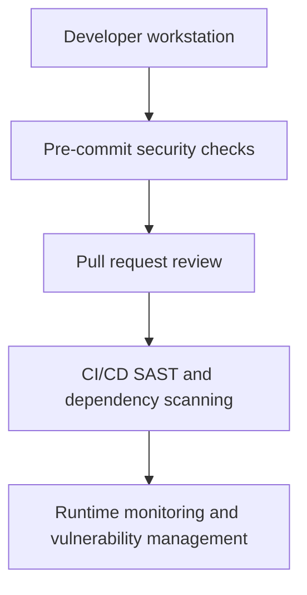

# {{ $frontmatter.title }} 관련

```component VPCard
{
  "title": "Security > Article(s)",
  "desc": "Article(s)",
  "link": "/devops/security/articles/README.md",
  "logo": "/images/ico-wind.svg",
  "background": "rgba(10,10,10,0.2)"
}
```

```component VPCard
{
  "title": "Github > Article(s)",
  "desc": "Article(s)",
  "link": "/devops/github/articles/README.md",
  "logo": "/images/ico-wind.svg",
  "background": "rgba(10,10,10,0.2)"
}
```

[[toc]]

---

<SiteInfo
  name="How to Catch Security Vulnerabilities in Code Before They Reach Your Pull Requests"
  desc="Security reviews are most effective when developers receive feedback while the code is still fresh in their minds. Waiting until a pull request, CI build, or penetration test to find exposed credentia"
  url="https://freecodecamp.org/news/catch-security-vulnerabilities-code-pull-requests"
  logo="https://cdn.freecodecamp.org/universal/favicons/favicon.ico"
  preview="https://cdn.hashnode.com/uploads/covers/5e1e335a7a1d3fcc59028c64/1443bfb4-581b-457b-afc3-7a85dd5fb3be.png"/>

Security reviews are most effective when developers receive feedback while the code is still fresh in their minds. Waiting until a pull request, CI build, or penetration test to find exposed credentials and insecure patterns creates unnecessary rework.

A lightweight way to shift security left is to run static application security testing (SAST) locally through Git pre-commit hooks.

In this guide, you'll install the DevSkim CLI, wire it into `pre-commit` so it lints staged files, add a dedicated secret scanner alongside it, verify the setup with a deliberate failure, and enforce the same checks in CI.

---

## Why Pre-Commit Security Scanning?

Pre-commit hooks run automatically before Git creates a commit. They're useful for catching hardcoded passwords, tokens, and connection strings, insecure cryptographic patterns, weak input validation, risky file or process handling, and other language-specific security anti-patterns.

The goal isn't to replace CI security scanning or manual reviews. It's to give developers fast, actionable feedback at the earliest practical point.

A healthy model looks like this:



---

## What Is DevSkim?

DevSkim is a security linter created by Microsoft. It ships as IDE extensions and a cross-platform CLI, and it flags insecure coding patterns using a configurable rule set.

It works well as a developer-facing guardrail because it scans files quickly and explains why a pattern may be risky. Its rules cover dangerous API usage, weak cryptography, insecure deserialization, weak TLS or certificate validation, and potential command injection risks.

One distinction matters before you rely on it: DevSkim is a security linter, not a secret scanner. It bundles a few generic credential rules, but those are regex patterns aimed at long, token-like values.

Teams typically pair DevSkim with a dedicated secret-scanning tool such as [Gitleaks (<VPIcon icon="iconfont icon-github"/>`gitleaks/gitleaks`)](https://github.com/gitleaks/gitleaks), [detect-secrets (<VPIcon icon="iconfont icon-github"/>`Yelp/detect-secrets`)](https://github.com/Yelp/detect-secrets), or [TruffleHog (<VPIcon icon="iconfont icon-github"/>`trufflesecurity/trufflehog`)](https://github.com/trufflesecurity/trufflehog). Gitleaks and detect-secrets both publish official `pre-commit` hooks, so either slots into this workflow easily. This guide uses Gitleaks.

As with any security scanner, findings need context. A warning isn't automatically a vulnerability, but it's worth reviewing before the code moves downstream.

::: note Prerequisites

You'll need Git, Python 3, and the .NET SDK, which DevSkim's CLI is distributed through.

Install `pre-commit`:

```sh
pip install pre-commit
```

Install the DevSkim CLI as a .NET global tool:

```sh
dotnet tool install --global Microsoft.CST.DevSkim.CLI
```

If you prefer not to install the .NET SDK, platform-specific binaries are available on the [DevSkim releases page (<VPIcon icon="iconfont icon-github"/>`microsoft/DevSkim`)](https://github.com/microsoft/DevSkim/releases).

Confirm both installations in a new terminal, so it picks up the updated `PATH`:

```sh
pre-commit --version
devskim --version
```

For inline feedback while you type, also install the [<VPIcon icon="iconfont icon-vscode"/>DevSkim VS Code extension](https://marketplace.visualstudio.com/items?itemName=MS-CST-E.vscode-devskim). The CLI is what the Git hook uses.

:::

---

## Create a Pre-Commit Configuration

DevSkim's CLI takes a single source path after `-I`, while `pre-commit` appends every staged filename to the command it runs. Passing `devskim analyze` directly therefore breaks as soon as a commit touches more than one file.

The simplest fix is a small wrapper that invokes DevSkim once per filename. Create <VPIcon icon="fas fa-folder-open"/>`scripts/run-devskim.py` in your repository:

```py title="scripts/run-devskim.py"
import subprocess
import sys

exit_code = 0

for filename in sys.argv[1:]:
    result = subprocess.run(["devskim", "analyze", "-I", filename])
    exit_code = exit_code or result.returncode

sys.exit(exit_code)
```

Now create <VPIcon icon="iconfont icon-yaml"/>`.pre-commit-config.yaml` at the root of your repository:

```yaml title=".pre-commit-config.yaml"
repos:
  - repo: local
    hooks:
      - id: devskim
        name: DevSkim security lint
        entry: python scripts/run-devskim.py
        language: system
        types_or: [python, javascript, typescript, json, yaml]
        pass_filenames: true

  - repo: https://github.com/gitleaks/gitleaks
    rev: v8.30.1
    hooks:
      - id: gitleaks
```

The first hook runs DevSkim against the staged files that match the listed types. The second adds Gitleaks for the secret detection DevSkim isn't designed to handle.

If you would rather keep things simpler and scan the whole repository on every commit, drop the wrapper and use a single fixed path instead:

```yaml title=".pre-commit-config.yaml"
      - id: devskim
        name: DevSkim security lint
        entry: devskim analyze -I .
        language: system
        pass_filenames: false
```

That version is easier to reason about, but it gets slower as the repository grows. Staged-file scanning is the better default once a project has real history.

---

## Install the Git Hook

Run this once from the repository root:

```sh
pre-commit install
```

Now, every `git commit` triggers the configured checks.

You can run the hooks manually against the entire codebase:

```sh
pre-commit run --all-files
```

That's particularly useful when introducing the tool to an existing project. Expect initial findings. Older repositories often contain patterns that predate current security standards.

---

## Verify the Setup With a Deliberate Failure

Before trusting the hook, you'll want to confirm that it actually blocks something. Create a file called <VPIcon icon="fa-brands fa-js"/>`insecure-example.js` with a weak hashing call:

```js title="insecure-example.js"
const crypto = require("crypto");

const hash = crypto.createHash("md5").update("password").digest("hex");
```

Stage it and attempt a commit:

```sh
git add insecure-example.js
git commit -m "Test security hooks"
```

The commit should be rejected. `pre-commit` prints a status line per hook, followed by the failing hook's ID, its exit code, and the scanner's own findings:

```plaintext
DevSkim security lint....................................................Failed
- hook id: devskim
- exit code: 1

[DevSkim output listing the weak hash finding appears here]
```

DevSkim's finding text includes a rule ID, a severity label, and the file and line, and the exact formatting varies by version and ruleset. What matters is the non-zero exit code and the blocked commit.

If the hook passes unexpectedly, run the scan directly to isolate the problem:

```sh
devskim analyze -I insecure-example.js
```

If that reports the finding but the hook does not, the issue is in your <VPIcon icon="iconfont icon-yaml"/>`.pre-commit-config.yaml` rather than in DevSkim.

---

## Example: Catching a Hardcoded Secret

Secrets are where the linter and the secret scanner divide. DevSkim's generic credential rules are regex-based and target long, token-like values, so a readable placeholder string will usually slip past them. A value shaped like a real key is a more realistic test:

```js
const apiKey = "4f2a9c1e7b6d3a8f0c5e9b2d7a41c6";
```

Stage the change and run the hooks:

```sh
git add config.js
pre-commit run
```

This is the case the secret scanner is built for. Gitleaks applies entropy and pattern checks tuned for credentials, so it's the hook you should expect to block a value like this, and its status line will report a failure and a non-zero exit code. Treat DevSkim's result here as a bonus rather than the control you rely on, which is exactly why the two tools sit side by side.

The fix is to move the value out of source control:

```js
const apiKey = process.env.PAYMENT_API_KEY;
```

The real value should be stored in an approved secret manager, such as Azure Key Vault, GitHub Actions Secrets, or another managed platform.

This small shift matters. Removing a secret after it has been committed is harder, because Git history, clones, CI logs, and deployment systems may already contain it.

Once you have confirmed both hooks behave as expected, delete the test files. Never use a real credential to test a scanner.

---

## Keep Hooks Fast and Focused

Developers will bypass slow hooks. A good local security scan should complete quickly and focus on high-confidence findings.

Start by scanning only staged or changed files locally, then reserve broader scans for CI. Block high-severity findings such as exposed secrets and critical insecure API usage first. Lower-confidence findings can be reported for review while the team tunes noisy rules and documents justified suppressions.

---

## Handling False Positives

False positives are expected in static analysis. The wrong response is disabling the scanner entirely. Verify whether a finding is exploitable and fix it when it represents real risk. When an exception is justified, use a narrowly scoped suppression, record the reason, and review it periodically.

Avoid broad exclusions such as skipping entire directories unless there's a clear technical reason. Broad exclusions tend to become blind spots.

---

## Add Security Checks to CI Too

Pre-commit hooks improve developer feedback, but they aren't enforcement. You can skip hooks with:

```sh
git commit --no-verify
```

That's why the same or equivalent security checks should run in CI. Here's a GitHub Actions workflow that runs both tools on every pull request. Save it as <VPIcon icon="fas fa-folder-open"/>`.github/workflows/`<VPIcon icon="iconfont icon-yaml"/>`security.yml`:

```yaml title=".github/workflows/security.yml"
name: Security Checks

on:
  pull_request:
  push:
    branches: [main]

jobs:
  scan:
    runs-on: ubuntu-latest
    permissions:
      contents: read
    steps:
      - uses: actions/checkout@v4
        with:
          fetch-depth: 0

      - uses: actions/setup-dotnet@v4
        with:
          dotnet-version: "8.0.x"

      - name: Install DevSkim
        run: dotnet tool install --global Microsoft.CST.DevSkim.CLI

      - name: Run DevSkim
        run: devskim analyze -I . -f sarif -O devskim.sarif

      - name: Upload DevSkim results
        uses: github/codeql-action/upload-sarif@v3
        with:
          sarif_file: devskim.sarif

      - name: Run Gitleaks
        uses: gitleaks/gitleaks-action@v2
        env:
          GITHUB_TOKEN: ${{ secrets.GITHUB_TOKEN }}
```

A few details here are worth calling out. `fetch-depth: 0` gives Gitleaks the full history it needs to scan past commits rather than just the tip. The SARIF upload sends DevSkim findings to the repository's Security tab, so results are reviewable in GitHub instead of buried in build logs. Microsoft also publishes a [DevSkim Action (<VPIcon icon="iconfont icon-github"/>`microsoft/DevSkim-Action`)](https://github.com/microsoft/DevSkim-Action) if you prefer not to manage the CLI install yourself.

From there, use pre-commit for fast feedback on changed code, pull request pipelines for SAST, secret scanning, and dependency checks, main-branch builds for full scans and reporting, and release pipelines for gates on critical findings. This layered approach balances developer experience with governance.

---

## Practical Rollout Tips

Start with one or two repositories and baseline existing findings before enforcing new rules. Initially, block only high-confidence, high-impact issues, then share examples of findings and fixes with developers. Track recurring patterns to guide secure coding training, and measure adoption and time-to-remediation instead of focusing only on finding counts.

The aim is to help developers make secure choices by default, not create another tool that gets ignored.

---

## Final Thoughts

Security tooling is most valuable when it appears at the moment a developer can act on it. Pre-commit hooks make secure coding feedback immediate, while CI provides the enforcement and broader coverage needed for production systems.

DevSkim is a useful lightweight entry point for teams building a shift-left security practice, and pairing it with a dedicated secret scanner covers the gap a linter is not built to fill. Start small, tune the rules, keep scans fast, and support the workflow with CI validation and secure coding guidance.

The best security control is often the one that prevents the issue from being committed in the first place.

<!-- TODO: add ARTICLE CARD -->
```component VPCard
{
  "title": "How to Catch Security Vulnerabilities in Code Before They Reach Your Pull Requests",
  "desc": "Security reviews are most effective when developers receive feedback while the code is still fresh in their minds. Waiting until a pull request, CI build, or penetration test to find exposed credentia",
  "link": "https://chanhi2000.github.io/bookshelf/freecodecamp.org/catch-security-vulnerabilities-code-pull-requests.html",
  "logo": "https://cdn.freecodecamp.org/universal/favicons/favicon.ico",
  "background": "rgba(10,10,35,0.2)"
}
```
