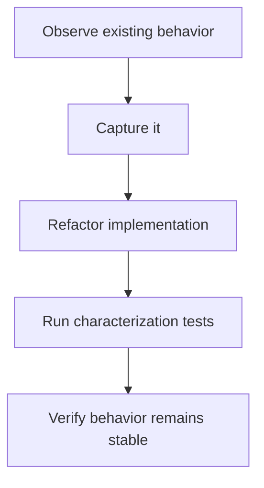
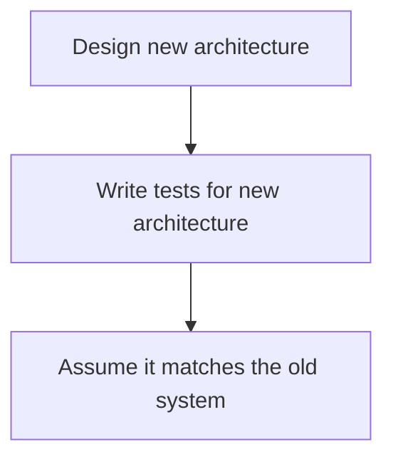
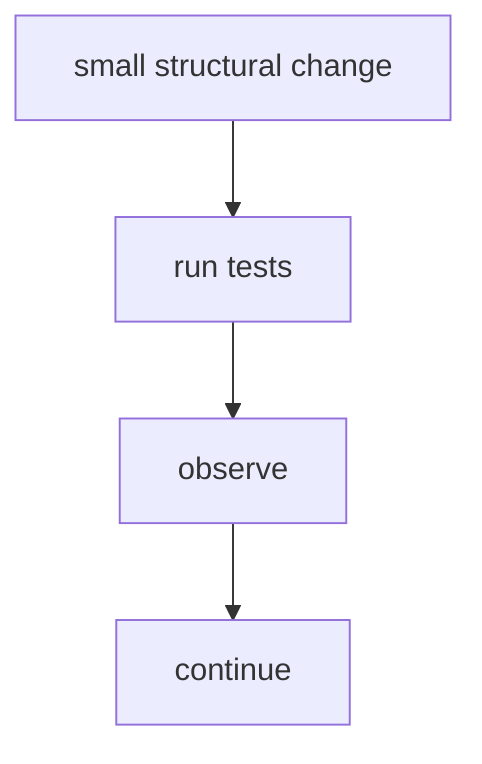
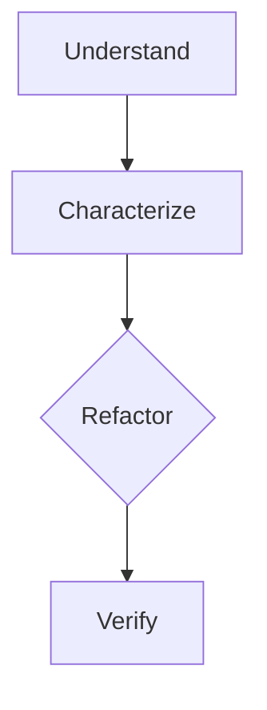

# {{ $frontmatter.title }} 관련

```component VPCard
{
  "title": "Node.js > Article(s)",
  "desc": "Article(s)",
  "link": "/programming/js-node/articles/README.md",
  "logo": "/images/ico-wind.svg",
  "background": "rgba(10,10,10,0.2)"
}
```

```component VPCard
{
  "title": "LLM > Article(s)",
  "desc": "Article(s)",
  "link": "/ai/llm/articles/README.md",
  "logo": "/images/ico-wind.svg",
  "background": "rgba(10,10,10,0.2)"
}
```

[[toc]]

---

<SiteInfo
  name="How to Build Characterization Tests Before Refactoring Legacy Code"
  desc="The first thing many engineers want to do when they inherit legacy code is improve it. You find a function that's difficult to understand. Or you see duplicated logic, deeply nested conditions, databa"
  url="https://freecodecamp.org/news/characterization-tests-before-refactoring-legacy-code"
  logo="https://cdn.freecodecamp.org/universal/favicons/favicon.ico"
  preview="https://cdn.hashnode.com/uploads/covers/5e1e335a7a1d3fcc59028c64/50ec1fe6-8e1f-4c42-a8ad-fd52ea0d089d.png"/>

The first thing many engineers want to do when they inherit legacy code is improve it.

You find a function that's difficult to understand. Or you see duplicated logic, deeply nested conditions, database calls mixed with business rules, and dependencies that make testing almost impossible.

You know the code could be better, so you start cleaning it up.

Then something breaks. Not because the new implementation is obviously wrong. It breaks because the old implementation was doing something nobody knew it was doing.

That's one of the most common risks in legacy modernization.

Before changing code, you need a way to answer a simple question:

> Did I preserve the behavior that already mattered?

That is where characterization tests become useful.

A characterization test doesn't begin by asking what the software **should** do. It begins by documenting what the software **does today**.

That distinction matters.

In a greenfield application, tests usually express intended behavior. But in a legacy application, you may first need tests that capture existing behavior so you can change the implementation without accidentally changing its observable results.

In this tutorial, I'll show you how to use characterization tests as a safety net before refactoring legacy code.

We'll look at how to:

- identify behavior worth protecting,
- choose useful test boundaries,
- capture current outputs,
- deal with side effects,
- handle databases and external systems,
- use AI to accelerate test discovery,
- avoid freezing implementation details,
- decide what not to characterize,
- and turn characterization tests into a foundation for safer refactoring.

The examples use TypeScript and Vitest, but the approach applies to most languages and testing frameworks.

The goal isn't to preserve every line of legacy behavior forever. The goal is to make behavior visible before you start changing the code that produces it.

::: note Prerequisites

You should be comfortable with:

- TypeScript or a similar programming language
- unit and integration testing
- dependency injection
- mocks and test doubles
- basic refactoring techniques
- reading an unfamiliar codebase

It also helps if you've already mapped the capability you want to change.

Before writing characterization tests, you should have some idea of:

- where the behavior starts
- what state it changes
- which external systems it touches
- which outputs may be consumed elsewhere

:::

---

## What Characterization Tests Actually Protect

Suppose you inherit this function:

```ts :collapsed-lines
type Customer = {
  id: string;
  type: "STANDARD" | "PREMIUM";
};

type Order = {
  id: string;
  customer: Customer;
  subtotal: number;
  country: string;
  paymentMethod: "CARD" | "TRANSFER";
};

async function processOrder(order: Order) {
  let total = order.subtotal;

  if (order.customer.type === "PREMIUM") {
    total = total * 0.9;
  }

  if (order.country === "AR" && order.paymentMethod === "TRANSFER") {
    total = total - 500;
  }

  if (total < 0) {
    total = 0;
  }

  await ordersRepository.save({
    ...order,
    total,
    status: "PROCESSED",
  });

  await eventBus.publish("order.processed", {
    orderId: order.id,
    total,
  });

  return total;
}
```

There are several things you may want to refactor here.

For example, the pricing rules could move to another module. Persistence could be isolated. The event publisher could sit behind an interface. And the function could return an object rather than a primitive.

Those may all be good decisions, but before making them, you should ask: What behavior currently matters?

For this function, observable behavior includes at least:

- premium customers receive a 10% discount
- Argentine transfers receive another adjustment
- totals can't become negative
- the order is persisted with a specific status
- an event is published
- the event contains the calculated total
- the function returns that total

A characterization test gives you a baseline for those behaviors.

For example:

```ts :collapsed-lines
import { describe, expect, it, vi } from "vitest";

describe("processOrder", () => {
  it("applies the existing premium customer behavior", async () => {
    const save = vi.spyOn(ordersRepository, "save");
    const publish = vi.spyOn(eventBus, "publish");

    const order: Order = {
      id: "order-1",
      customer: {
        id: "customer-1",
        type: "PREMIUM",
      },
      subtotal: 10000,
      country: "US",
      paymentMethod: "CARD",
    };

    const result = await processOrder(order);

    expect(result).toBe(9000);

    expect(save).toHaveBeenCalledWith(
      expect.objectContaining({
        id: "order-1",
        total: 9000,
        status: "PROCESSED",
      })
    );

    expect(publish).toHaveBeenCalledWith("order.processed", {
      orderId: "order-1",
      total: 9000,
    });
  });
});
```

This test isn't saying that a 10% discount is the best pricing model.

It's saying:

> This is what the system currently does.

That's the contract you need to understand before changing it.

---

## Start with Behavior, Not Implementation

A common mistake is to write tests around the structure you're planning to create.

Suppose you want to refactor the previous code into:

```plaintext
OrderProcessor
PricingPolicy
OrdersRepository
OrderEventPublisher
```

You may be tempted to write tests for those future classes first.

But those classes don't describe the existing system. They describe your proposed design.

Characterization tests should begin at the current observable boundary.

Instead of asking:

> How should `PricingPolicy` work?

ask:

> Given this input, what does `processOrder()` currently produce?

That difference helps prevent your new architecture from redefining behavior accidentally.

The sequence should be:



Not:



The second workflow tests your design. The first protects the migration.

---

## Choose One Capability Before Writing Tests

Don't start by trying to characterize an entire legacy application. Instead, pick one business capability.

For example:

```plaintext
Approve Order
Generate Invoice
Renew Subscription
Register Customer
Calculate Commission
Cancel Reservation
```

Then trace that capability through the system.

Suppose you choose:

> Generate Invoice

You discover this path:

```mermaid
flowchart TD
  A[POST /orders/:id/invoice] --> B[InvoiceController.generate()]
  B --> C[InvoiceService.generate()]
  C --> D[TaxCalculator.calculate()]
  D --> E[InvoiceRepository.save()]
  E --> F[PdfGenerator.create()]
  F --> G[EmailService.send()]
```

That becomes the scope of your investigation.

Now ask: Which behaviors matter if I refactor this capability?

Perhaps:

```plaintext
tax calculation
invoice numbering
database state
PDF fields
email recipient
email attachment
error behavior
```

Those are candidates for characterization.

This is more useful than trying to increase test coverage across the repository indiscriminately.

Coverage isn't the goal. Behavioral confidence is.

---

## Find the Smallest Useful Test Boundary

Characterization tests can exist at different levels.

You might test:

```plaintext
function
service
module
API endpoint
background job
complete workflow
```

The right boundary is usually the smallest one that still captures meaningful behavior.

Suppose the logic you want to refactor lives inside:

```ts
class InvoiceService {
  async generate(orderId: string) {
    // 300 lines of legacy behavior
  }
}
```

If `generate()` coordinates tax calculation, persistence, numbering, and external calls, testing a small internal helper may not protect enough behavior.

Testing the whole production stack may be too slow and difficult.

A service-level characterization test may be the useful compromise.

For example:

```ts
describe("InvoiceService.generate", () => {
  it("preserves the existing invoice calculation", async () => {
    const service = createInvoiceService();

    const invoice = await service.generate("order-123");

    expect(invoice.subtotal).toBe(10000);
    expect(invoice.tax).toBe(2100);
    expect(invoice.total).toBe(12100);
  });
});
```

You don't want to ask what's the smallest unit you can test. You want to ask what's the smallest boundary that gives you confidence during this refactor.

Those aren't always the same thing.

---

## Capture Existing Behavior Before Improving It

Legacy code often contains behavior that looks suspicious.

Consider:

```ts
function calculateDiscount(amount: number) {
  if (amount > 10000) {
    return amount * 0.15;
  }

  if (amount > 5000) {
    return amount * 0.1;
  }

  return 0;
}
```

You run a few examples and discover:

```plaintext
5000  -> 0
5001  -> 500.1
10000 -> 1000
10001 -> 1500.15
```

You might think:

> `5000` should probably receive the 10% discount.

Maybe. But that's not what the current code does.

A characterization test could record:

```ts
describe("calculateDiscount", () => {
  it.each([
    [5000, 0],
    [5001, 500.1],
    [10000, 1000],
    [10001, 1500.15],
  ])(
    "returns the existing discount for amount %d",
    (amount, expected) => {
      expect(calculateDiscount(amount)).toBe(expected);
    }
  );
});
```

This creates a behavioral boundary around the existing implementation.

Later, if the business confirms that `5000` should receive a discount, you can intentionally change:

```ts
if (amount > 5000)
```

to:

```ts
if (amount >= 5000)
```

and update the relevant test.

The important part is that the change becomes explicit.

Without the test, it could happen accidentally during an unrelated refactor.

---

## Characterize Edge Cases You Don't Yet Understand

The obvious cases aren't always the risky ones. Legacy systems often fail at boundaries.

Look for values such as:

```plaintext
0
-1
null
empty string
maximum value
minimum value
exact threshold values
unknown status
duplicate identifiers
missing related records
```

Suppose you find:

```ts
function normalizeBalance(balance?: number) {
  if (!balance) {
    return 0;
  }

  return Math.round(balance * 100) / 100;
}
```

That means:

```plaintext
undefined -> 0
0         -> 0
```

But also potentially:

```plaintext
NaN -> 0
```

because `NaN` is falsy.

Is that intentional? You may not know yet.

You can characterize it:

```ts
describe("normalizeBalance", () => {
  it("returns zero for undefined", () => {
    expect(normalizeBalance(undefined)).toBe(0);
  });

  it("returns zero for zero", () => {
    expect(normalizeBalance(0)).toBe(0);
  });

  it("returns zero for NaN in the current implementation", () => {
    expect(normalizeBalance(Number.NaN)).toBe(0);
  });
});
```

The name matters.

Notice that I wrote:

> in the current implementation

I'm not pretending that behavior is correct. I'm just documenting it.

That distinction becomes important when a test describes questionable behavior.

---

## Test Side Effects, Not Just Return Values

A return value is only one kind of behavior.

Legacy functions frequently produce side effects.

Consider:

```ts
async function cancelOrder(order: Order) {
  order.status = "CANCELLED";

  await orders.save(order);
  await inventory.release(order.id);
  await audit.log("ORDER_CANCELLED", order.id);

  return order;
}
```

A weak characterization test might only check:

```ts
expect(result.status).toBe("CANCELLED");
```

But a refactor could still accidentally remove:

```plaintext
inventory.release()
audit.log()
```

and the test would continue passing.

A stronger characterization test captures observable side effects:

```ts
it("preserves cancellation side effects", async () => {
  const save = vi.spyOn(orders, "save");
  const release = vi.spyOn(inventory, "release");
  const log = vi.spyOn(audit, "log");

  const order = {
    id: "order-1",
    status: "APPROVED",
  } as Order;

  await cancelOrder(order);

  expect(save).toHaveBeenCalled();

  expect(release).toHaveBeenCalledWith("order-1");

  expect(log).toHaveBeenCalledWith(
    "ORDER_CANCELLED",
    "order-1"
  );
});
```

This doesn't mean every internal call deserves an assertion.

The question is whether the call produces observable behavior that matters outside the implementation.

---

## How to Characterize Code That Depends on a Database

Database-heavy legacy code can be difficult to test.

Suppose you have:

```ts
async function activateCustomer(customerId: string) {
  const customer = await db.customers.findById(customerId);

  if (!customer) {
    throw new Error("Customer not found");
  }

  await db.customers.update(customerId, {
    status: "ACTIVE",
    activatedAt: new Date(),
  });

  return db.customers.findById(customerId);
}
```

You have several options.

### Use an Integration Test

If the database behavior itself matters, run against a disposable test database.

For example:

```ts
it("activates an existing customer", async () => {
  await seedCustomer({
    id: "customer-1",
    status: "PENDING",
  });

  const result = await activateCustomer("customer-1");

  expect(result?.status).toBe("ACTIVE");
  expect(result?.activatedAt).toBeTruthy();
});
```

This gives high confidence, but the test may be slower.

### Introduce a Seam

If database access makes testing impractical, you may need a very small structural change before characterization.

For example:

```ts
type CustomerRepository = {
  findById(id: string): Promise<Customer | null>;
  update(
    id: string,
    data: Partial<Customer>
  ): Promise<void>;
};
```

Then:

```ts
async function activateCustomer(
  customerId: string,
  customers: CustomerRepository
) {
  // existing behavior
}
```

This is a useful concept from legacy-code work: create a **seam**, a place where behavior can be observed or replaced without rewriting the system.

The key is to keep this preparatory change mechanical.

Don't redesign the business logic while creating the test boundary.

First make it testable. Then characterize it. Then refactor.

---

## How to Handle External Services

Legacy code frequently talks directly to:

```plaintext
payment providers
email services
ERPs
CRMs
message brokers
cloud storage
third-party APIs
```

You usually don't want characterization tests repeatedly calling those systems.

Instead, capture the interaction at the boundary.

Suppose:

```ts
async function chargeOrder(order: Order) {
  const response = await stripe.charge({
    amount: order.total,
    currency: "usd",
    customerId: order.customerId,
  });

  await orders.markPaid(order.id, response.id);

  return response.id;
}
```

You can characterize the request:

```ts
it("sends the existing payment payload", async () => {
  const charge = vi
    .spyOn(stripe, "charge")
    .mockResolvedValue({
      id: "payment-123",
    });

  const markPaid = vi.spyOn(orders, "markPaid");

  const order = {
    id: "order-1",
    total: 5000,
    customerId: "customer-1",
  } as Order;

  await chargeOrder(order);

  expect(charge).toHaveBeenCalledWith({
    amount: 5000,
    currency: "usd",
    customerId: "customer-1",
  });

  expect(markPaid).toHaveBeenCalledWith(
    "order-1",
    "payment-123"
  );
});
```

That protects the external contract without hitting the external system.

But be careful. If the provider behavior itself matters, mocks alone may not be enough.

You might also need:

- provider sandbox tests
- contract tests
- integration tests
- schema validation

Characterization testing doesn't eliminate the need for those layers.

---

## How to Use AI to Discover Characterization Tests

AI is particularly useful when you are staring at a large legacy function and trying to understand what deserves a test.

Suppose you have a 400-line service.

Instead of asking:

```md title="prompt"
Write unit tests for this class.
```

use a more investigative prompt:

```md title="prompt"
Analyze this class without changing it.

Identify observable behaviors that could change during refactoring.

Group them into:

1. returned values,
2. state changes,
3. persistence effects,
4. external calls,
5. emitted events,
6. exceptions,
7. boundary conditions.

For every proposed characterization test:

- reference the relevant source code,
- explain what behavior the test would protect,
- distinguish observed behavior from inferred behavior.

Do not invent expected values.
```

That final instruction matters: you want AI to help identify **what to observe**. You don't want it inventing what the software should do.

Another useful prompt is:

```md title="prompt"
Review the existing test suite for this capability.

Compare the behaviors covered by tests with the
observable behaviors in the implementation.

List behavior that appears unprotected.

Do not generate tests yet.
```

This is often more valuable than immediately asking for test code.

First identify the gaps, and then decide which gaps matter.

---

## Don't Let AI Invent Expected Behavior

This is probably the most important rule when combining AI with characterization testing, and it's worth talking a bit more about.

Suppose AI reads:

```ts
if (customer.age > 65) {
  discount = 0.2;
}
```

It may generate:

```ts
expect(calculateDiscount(65)).toBe(0.2);
```

because it assumes the intended business rule is:

> Customers aged 65 or older receive a discount.

But that's not what the code says.

The existing behavior is:

```plaintext
65 -> no discount
66 -> discount
```

The expected values in characterization tests should come from evidence.

Useful evidence includes:

- running the current system
- existing tests
- fixtures
- production-safe observations
- documented examples
- database state
- historical behavior

Don't derive expectations solely from what seems reasonable.

A better AI instruction is:

```md title="prompt"
For each candidate test, tell me how I can obtain
the expected result from the current implementation.

Do not propose the expected result yourself unless it
can be directly derived from executable behavior
or an existing test.
```

This turns AI into an assistant for experiment design rather than an authority on business rules.

---

## Avoid Testing Implementation Details

Characterization tests can become harmful if they freeze the current code structure.

Suppose the implementation is:

```ts
async function processOrder(order: Order) {
  validateOrder(order);
  calculatePrice(order);
  reserveInventory(order);
  saveOrder(order);
}
```

A brittle test might assert:

```ts
expect(validateOrder).toHaveBeenCalledBefore(calculatePrice);
expect(calculatePrice).toHaveBeenCalledBefore(reserveInventory);
expect(reserveInventory).toHaveBeenCalledBefore(saveOrder);
```

Maybe that order matters. Maybe it doesn't.

If consumers only care about:

```plaintext
correct total
inventory reserved
order persisted
```

then asserting the exact sequence unnecessarily constrains the refactor.

Prefer protecting externally meaningful behavior.

For example:

```ts
expect(savedOrder.total).toBe(9000);
expect(inventory.reserve).toHaveBeenCalledWith(
  "product-1",
  2
);
expect(repository.save).toHaveBeenCalled();
```

Characterization tests should create a safety net. They shouldn't turn the legacy implementation into a specification of every internal decision.

---

## When a Characterization Test Reveals a Bug

Eventually you'll encounter behavior that appears clearly wrong.

For example:

```ts
function calculateFee(amount: number) {
  if (amount === 0) {
    return 100;
  }

  return amount * 0.02;
}
```

You confirm that zero-value transactions are charged a fixed fee. Everyone agrees this looks suspicious.

What should the characterization test do?

First, separate two questions:

1. What does the system do today?
2. What should the system do?

The characterization test answers the first.

```ts
it("currently charges 100 for a zero-value transaction", () => {
  expect(calculateFee(0)).toBe(100);
});
```

Then investigate whether this is intentional business behavior, a historical workaround, or an actual defect.

If the business confirms it is a bug, create a separate change.

For example:

```ts
it("does not charge a fee for a zero-value transaction", () => {
  expect(calculateFee(0)).toBe(0);
});
```

Then modify the production code.

This may sound overly formal for a small condition. But it creates a clean distinction between:

```plaintext
behavior discovered during refactoring
```

and:

```plaintext
behavior intentionally changed
```

That distinction becomes extremely valuable in large migrations.

---

## How Much Behavior Should You Characterize

You don't need to characterize everything. Trying to preserve every observed detail can create another form of paralysis.

Prioritize behavior with high change risk or high business impact.

I usually look first at:

- financial calculations
- state transitions
- authentication and authorization
- external contracts
- queue and event payloads
- data transformations
- retry behavior
- idempotency
- regulatory rules
- critical error handling

You may care less about:

- internal helper naming
- private method structure
- log wording that nobody consumes
- temporary object shapes
- implementation-specific call sequences

A useful question is: If this behavior changed during refactoring, could somebody outside this function notice?

If the answer is yes, it's probably worth considering.

---

## Use Characterization Tests During the Refactor

Once the characterization suite exists, keep the refactor small.

Suppose you begin with:

```ts
async function processOrder(order: Order) {
  // validation
  // pricing
  // inventory
  // persistence
  // event publishing
}
```

You might first extract pricing:

```ts
function calculateOrderTotal(order: Order) {
  let total = order.subtotal;

  if (order.customer.type === "PREMIUM") {
    total *= 0.9;
  }

  if (
    order.country === "AR" &&
    order.paymentMethod === "TRANSFER"
  ) {
    total -= 500;
  }

  return Math.max(total, 0);
}
```

Run the characterization suite. If everything still passes, continue.

Next isolate inventory and run it again.

Then persistence. Run it again.

This gives you a migration rhythm:



If something fails, the search space is small.

Compare that with rewriting 2,000 lines and then discovering 47 broken tests.

Small changes turn failures into useful feedback, while Large changes turn failures into archaeology.

Again.

---

## A Practical Characterization Testing Workflow

Here is the workflow I would use on an unfamiliar legacy capability.

### 1. Map the Capability

Identify:

```plaintext
entry point
business logic
state changes
side effects
external contracts
outputs
```

Don't refactor yet.

### 2. Find Existing Tests

Search for tests that already describe the capability.

Look for:

```plaintext
happy paths
boundary cases
errors
historical bugs
integration behavior
```

Don't duplicate useful tests unnecessarily.

### 3. List Observable Behaviors

Create a table such as:

| Behavior | Evidence | Protected? |
| ---: | :--- | :--- |
| Premium discount | Code + production example | No |
| Order event | Code | Yes |
| Transfer adjustment | Code | No |
| Negative total clamp | Code | No |
| Save status | Existing integration test | Yes |

Now you know where the risk is.

### 4. Pick the Test Boundary

Decide whether the useful boundary is:

```plaintext
function
service
module
endpoint
job
workflow
```

Choose based on confidence, not test ideology.

### 5. Capture Current Behavior

Run the existing system.

Use real observable outputs when possible.

Don't guess expectations.

### 6. Add Critical Edge Cases

Test:

```plaintext
thresholds
empty values
nulls
errors
duplicate operations
retry scenarios
```

especially around logic you intend to change.

### 7. Capture Side Effects

Protect meaningful:

```plaintext
writes
events
messages
external calls
state transitions
```

not only function return values.

### 8. Mark Uncertain Behavior

Use test names or documentation that clearly distinguishes:

```plaintext
confirmed business rule
```

from:

```plaintext
current observed behavior
```

### 9. Refactor Incrementally

Make one structural change.

Run the suite.

Repeat.

### 10. Replace Characterization with Intent Where Appropriate

As understanding improves, some characterization tests can evolve into true specification tests.

Instead of:

```plaintext
currently returns 0 for this input
```

you may eventually be able to say:

```plaintext
does not apply a discount below the premium threshold
```

That transition is useful. It means the system is becoming understood rather than merely preserved.

---

## What Characterization Tests Can't Tell You

Characterization tests are powerful, but they have an important limitation.

They tell you what happened for the cases you observed. They don't automatically tell you why.

Suppose the test says:

```plaintext
Argentine transfer orders receive a 500-unit adjustment.
```

The test can protect that behavior.

It can't tell you whether the adjustment exists because of:

- a tax rule
- a banking fee
- an old promotion
- a customer-specific workaround
- a bug nobody removed

For that, you still need other evidence:

- documentation
- Git history
- production telemetry
- domain experts
- incident records
- external system contracts

This is why characterization testing belongs after codebase understanding, not instead of it.

You first discover the behavior. Then you protect it. Then you continue investigating what it means.

---

## Characterization Tests Are Temporary Knowledge Infrastructure

There's another way I think about these tests.

Legacy systems contain knowledge that's often trapped inside implementation details. A characterization test moves some of that knowledge into an executable form.

Before:

```plaintext
Nobody knows what changing this condition will break.
```

After:

```plaintext
Changing this condition causes these four observable behaviors to change.
```

That's already progress.

The test suite becomes part of your understanding of the system. It creates a bridge between:

```plaintext
what the code currently does
```

and:

```plaintext
what we eventually want the system to do
```

You don't have to keep every characterization test forever.

Some will become proper specification tests.

Some will disappear when obsolete behavior is intentionally removed.

Some will remain as regression tests.

Their first job is simpler: **make change safer while understanding is still incomplete.**

---

## Conclusion

AI makes refactoring legacy code faster.

It can explain functions, generate candidate abstractions, extract interfaces, suggest module boundaries, and rewrite large sections of code in seconds.

That makes characterization testing more important, not less.

When the cost of producing a new implementation decreases, the risk shifts toward verifying that the new implementation still preserves the behavior that matters.

Before asking:

```plaintext
How should I refactor this?
```

ask:

```plaintext
What does this do today?
```

Then:

```plaintext
Which of those behaviors matter?
```

Then:

```plaintext
How can I prove they still work after the change?
```

That is what characterization tests give you.

They don't tell you that legacy behavior is correct. They give you evidence that it exists.

And once that evidence is executable, you can refactor with much more confidence.

The sequence becomes:



AI can accelerate every step in that workflow. But the engineering judgment remains in deciding what behavior deserves to survive, what behavior should change, and when you have enough evidence to safely make that distinction.

<!-- TODO: add ARTICLE CARD -->
```component VPCard
{
  "title": "How to Build Characterization Tests Before Refactoring Legacy Code",
  "desc": "The first thing many engineers want to do when they inherit legacy code is improve it. You find a function that's difficult to understand. Or you see duplicated logic, deeply nested conditions, databa",
  "link": "https://chanhi2000.github.io/bookshelf/freecodecamp.org/characterization-tests-before-refactoring-legacy-code.html",
  "logo": "https://cdn.freecodecamp.org/universal/favicons/favicon.ico",
  "background": "rgba(10,10,35,0.2)"
}
```
