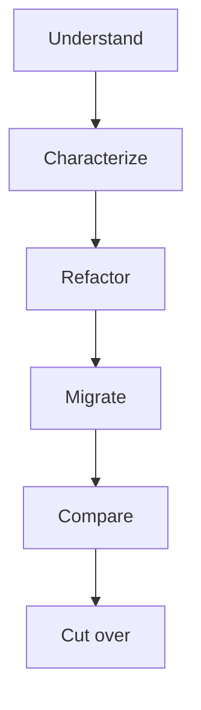

# {{ $frontmatter.title }} 관련

```component VPCard
{
  "title": "TypeScript > Article(s)",
  "desc": "Article(s)",
  "link": "/programming/ts/articles/README.md",
  "logo": "/images/ico-wind.svg",
  "background": "rgba(10,10,10,0.2)"
}
```

```component VPCard
{
  "title": "LLM > Article(s)",
  "desc": "Article(s)",
  "link": "/ai/llm/articles/README.md",
  "logo": "/images/ico-wind.svg",
  "background": "rgba(10,10,10,0.2)"
}
```

[[toc]]

---

<SiteInfo
  name="How to Use Differential Testing During a Legacy Migration"
  desc="The most dangerous moment in a legacy migration isn't necessarily when you start writing the new implementation. It's when the new implementation looks finished. The code compiles, the tests pass, the"
  url="https://freecodecamp.org/news/differential-testing-legacy-migration"
  logo="https://cdn.freecodecamp.org/universal/favicons/favicon.ico"
  preview="https://cdn.hashnode.com/uploads/covers/5e1e335a7a1d3fcc59028c64/6717bbb6-16b9-4fc1-8bfe-7381a3024f73.png"/>

The most dangerous moment in a legacy migration isn't necessarily when you start writing the new implementation. It's when the new implementation looks finished.

The code compiles, the tests pass, the architecture is cleaner, and the new service responds faster.

Then everybody starts asking the same question:

> Can we switch traffic now?

That's where confidence becomes difficult.

A new implementation can pass its own test suite and still behave differently from the system it is replacing.

Maybe rounding changed, or null values are handled differently, or an error became a successful response.

Maybe records are sorted differently, or a side effect happens in a different order, or a business rule you never documented was lost during the migration.

This is why, during a legacy migration, I like having another source of evidence: **run the old and new implementations with the same inputs and compare what they do.**

That's the basic idea behind differential testing. Instead of asking only if the new system passes its tests, you also ask: given the same input, where does the new system behave differently from the old one?

Those differences become evidence.

Some are bugs, some are intentional improvements, some are harmless representation differences, and some reveal behavior nobody knew existed.

In this tutorial, I'll show you how to use differential testing during a legacy migration to:

- Compare old and new implementations
- Define what should be considered equivalent
- Normalize outputs before comparing them
- Handle timestamps and other nondeterministic values
- Compare errors and side effects
- Run differential tests automatically
- Introduce tolerances where exact equality doesn't make sense
- Analyze mismatches
- Use shadow traffic in production safely
- Use AI to classify divergences without letting it decide correctness
- Determine when the new implementation is ready for cutover

The examples use TypeScript and Vitest, but the approach applies to most languages and migration strategies.

The goal isn't to prove that two implementations are internally identical. It's to obtain evidence that they are **behaviorally equivalent where equivalence matters**.

---

## Prerequisites

To follow along here, you should be comfortable with:

- TypeScript or a similar language
- unit and integration testing
- asynchronous code
- API and service boundaries
- legacy modernization
- basic observability concepts

You should also already have some understanding of the capability being migrated.

Ideally, you know its inputs, outputs, important business rules, external contracts, side effects, and known areas of uncertainty.

Differential testing works best after you've already created a boundary around the capability you want to migrate.

---

## What Differential Testing Actually Tells You

Imagine that your legacy application calculates the final price of an order.

The legacy implementation looks like this:

```ts
type Order = {
  subtotal: number;
  customerType: "STANDARD" | "PREMIUM";
  country: string;
};

function legacyCalculateTotal(order: Order): number {
  let total = order.subtotal;

  if (order.customerType === "PREMIUM") {
    total *= 0.9;
  }

  if (order.country === "AR") {
    total -= 500;
  }

  return Math.max(total, 0);
}
```

During the migration, you create a new implementation:

```ts
function newCalculateTotal(order: Order): number {
  const premiumDiscount =
    order.customerType === "PREMIUM"
      ? order.subtotal * 0.1
      : 0;

  const countryAdjustment =
    order.country === "AR"
      ? 500
      : 0;

  return Math.max(
    order.subtotal -
      premiumDiscount -
      countryAdjustment,
    0
  );
}
```

The implementations look different. And that's fine. What matters is whether they produce equivalent behavior.

A simple differential test can run both:

```ts
import { describe, expect, it } from "vitest";

describe("order total migration", () => {
  it("matches the legacy implementation", () => {
    const order: Order = {
      subtotal: 10000,
      customerType: "PREMIUM",
      country: "AR",
    };

    const legacy =
      legacyCalculateTotal(order);

    const migrated =
      newCalculateTotal(order);

    expect(migrated).toBe(legacy);
  });
});
```

For this input:

```text
legacy → 8500
new    → 8500
```

Good. But one matching example proves very little.

The value comes from systematically asking:

```text
same input
↓
legacy implementation ──→ result A

same input
↓
new implementation ─────→ result B

compare A and B
```

Every mismatch gives you something to investigate.

---

## Start with One Observable Boundary

Don't begin by comparing entire applications. To start, choose one capability.

For example:

```text
Calculate Order Total
Generate Invoice
Approve Customer
Renew Subscription
Calculate Commission
Create Shipment
```

Suppose the migration boundary is:

```ts
interface OrderProcessor {
  process(order: Order): Promise<ProcessedOrder>;
}
```

Now you have two implementations:

```text
LegacyOrderProcessor

NewOrderProcessor
```

That is a useful differential boundary, because both receive the same conceptual input, and both produce the same conceptual output.

You can compare them without requiring their internal architecture to match.

That matters because migrations often change structure intentionally.

The legacy implementation might be:

```text
controller
→ service
→ SQL
→ provider SDK
```

while the new implementation might be:

```text
use case
→ repository
→ gateway
→ events
```

Differential testing shouldn't care. It should care about observable behavior.

---

## Run the Legacy and New Implementations with the Same Input

Suppose both implementations expose:

```ts
interface OrderProcessor {
  process(order: Order): Promise<ProcessedOrder>;
}
```

You can create:

```ts
const legacyProcessor =
  new LegacyOrderProcessor();

const newProcessor =
  new NewOrderProcessor();
```

Then:

```ts
it("produces the same processed order", async () => {
  const input: Order = {
    id: "order-1",
    subtotal: 10000,
    customerType: "PREMIUM",
    country: "US",
  };

  const legacy =
    await legacyProcessor.process(
      structuredClone(input)
    );

  const migrated =
    await newProcessor.process(
      structuredClone(input)
    );

  expect(migrated).toEqual(legacy);
});
```

Notice the use of:

```ts
structuredClone(input)
```

That matters if either implementation mutates its input.

Without separate copies, the first execution could influence the second.

You want:

```text
same initial state
```

not:

```text
new implementation receives state modified by legacy implementation
```

That kind of contamination can create misleading results.

---

## Don't Compare Raw Output Blindly

The first version of a differential test is often:

```ts
expect(newResult).toEqual(legacyResult);
```

Sometimes that's exactly right. But other times it's wrong.

Imagine the legacy system returns:

```json
{
  "id": "order-1",
  "total": 9000,
  "status": "PROCESSED",
  "generatedAt": "2026-09-09T10:00:01.231Z",
  "requestId": "legacy-f93a"
}
```

The new system returns:

```json
{
  "requestId": "new-b517",
  "status": "PROCESSED",
  "generatedAt": "2026-09-09T10:00:01.416Z",
  "total": 9000,
  "id": "order-1"
}
```

A raw object comparison may fail because:

```text
requestId differs
timestamp differs
```

But the business behavior might be equivalent.

You need to decide which fields are part of the meaningful contract.

Maybe:

```text
id
total
status
```

matter.

While:

```text
generatedAt
requestId
```

don't need exact equivalence.

That leads to normalization.

---

## Normalize Values Before Comparing Them

Normalization means transforming outputs into a common representation before comparing them.

The goal isn't to change the business meaning of the data. It's to remove differences that are expected and irrelevant to the comparison, such as generated request IDs or timestamps, so the test can focus on the fields that actually define the behavior you care about.

In practice, that often means creating a canonical representation: a smaller, stable shape that contains only the meaningful fields you want to compare.

For example:

```ts
type ProcessedOrder = {
  id: string;
  total: number;
  status: string;
  generatedAt: string;
  requestId: string;
};

function normalizeOrder(
  order: ProcessedOrder
) {
  return {
    id: order.id,
    total: order.total,
    status: order.status,
  };
}
```

Here, `ProcessedOrder` contains both business-relevant fields and values that may legitimately differ between executions.

The `normalizeOrder()` function keeps `id`, `total`, and `status`, while leaving out `generatedAt` and `requestId`. That means two results can still be considered equivalent even if they were generated at slightly different times or used different request identifiers.

Now compare:

```ts
expect(
  normalizeOrder(migrated)
).toEqual(
  normalizeOrder(legacy)
);
```

This makes your equivalence rule explicit.

You're saying:

> These fields define relevant behavior for this comparison.

Normalization can also handle:

- ordering
- casing
- optional fields
- timestamps
- generated identifiers
- numeric formatting
- provider-specific metadata

But normalization must be deliberate. If you remove too much, you can hide real migration bugs.

---

## Handle Timestamps and Other Nondeterministic Values

Legacy systems contain many nondeterministic values.

For example:

```text
timestamps
UUIDs
random tokens
request IDs
trace IDs
database-generated IDs
unordered collections
provider-generated references
```

If you compare those values exactly, your differential suite may fail constantly.

One option is dependency control.

Dependency control means moving a nondeterministic source, such as the current time or an ID generator, behind an interface that you can replace during tests.

Instead of letting each implementation read the real clock independently, you inject the same controlled clock into both. That gives them the same value and removes time itself as a source of meaningless divergence.

Suppose the code uses:

```ts
new Date()
```

You can replace that dependency with a clock:

```ts
interface Clock {
  now(): Date;
}
```

Then both implementations receive:

```ts
const clock = {
  now: () =>
    new Date(
      "2026-09-09T10:00:00.000Z"
    ),
};
```

Now time becomes deterministic.

The same technique can work for ID generation:

```ts
interface IdGenerator {
  next(): string;
}
```

Then tests can provide:

```ts
const ids = {
  next: () => "fixed-id",
};
```

If controlling nondeterminism is impractical, normalize it out only when it's not part of the behavior you need to protect.

---

## Compare Business Meaning, Not Just JSON

Two systems can return different representations while expressing the same business state.

Imagine you have this in your legacy system:

```json
{
  "status": 2
}
```

And this in your new one:

```json
{
  "status": "APPROVED"
}
```

Raw comparison says:

```text
different
```

Business comparison may say:

```text
equivalent
```

You can create a semantic normalizer:

```ts
function normalizeStatus(
  status: number | string
) {
  if (status === 2) {
    return "APPROVED";
  }

  return status;
}
```

Here, the normalizer translates the legacy numeric value `2` into the business meaning used by the new implementation: `"APPROVED"`.

It doesn't claim that every number and string are interchangeable. It encodes one explicit equivalence rule that you've already decided is valid for this migration.

Then:

```ts
expect(
  normalizeStatus(newResult.status)
).toBe(
  normalizeStatus(legacyResult.status)
);
```

This is especially useful when migration intentionally changes:

```text
database schema
API representation
enumerations
provider-specific formats
internal identifiers
```

The important question becomes:

> Does the observable business meaning remain equivalent?

Not:

> Are the bytes identical?

---

## Compare Errors as Part of the Contract

Success responses aren't the whole behavior. Errors matter too.

Suppose the legacy implementation rejects a missing customer:

```ts
throw new Error("Customer not found");
```

The new implementation accidentally returns:

```ts
return null;
```

These two implementations behave very differently for the same invalid input.

The legacy version fails explicitly, while the new version silently returns a value that a caller may interpret as a successful result.

If your differential tests only exercise cases where a valid customer exists, both implementations may appear equivalent and this contract change will remain invisible.

That's why failure behavior has to be compared too.

Create cases that capture errors:

```ts
async function captureResult<T>(
  operation: () => Promise<T>
) {
  try {
    return {
      type: "success" as const,
      value: await operation(),
    };
  } catch (error) {
    return {
      type: "error" as const,
      error:
        error instanceof Error
          ? error.message
          : String(error),
    };
  }
}
```

The helper wraps an asynchronous operation and converts both possible outcomes into data.

If the operation succeeds, it returns an object with `type: "success"` and the returned value. If the operation throws, the `catch` block converts that exception into an object with `type: "error"` and a readable error message.

This gives both implementations the same comparison shape, so the test can compare success versus failure explicitly instead of letting an exception stop the test before the two behaviors can be evaluated.

Now:

```ts
const legacy =
  await captureResult(() =>
    legacyProcessor.process(input)
  );

const migrated =
  await captureResult(() =>
    newProcessor.process(input)
  );

expect(migrated.type).toBe(legacy.type);
```

If errors are contractually important, compare:

```text
error category
HTTP status
error code
retryability
validation details
```

Don't necessarily compare exact wording unless clients depend on it.

---

## Compare Side Effects, Too

One of the easiest migration mistakes is preserving the return value while losing a side effect.

Suppose both implementations return:

```json
{
  "status": "PROCESSED"
}
```

But the legacy version also:

```text
persists the order
publishes an event
creates a payment
writes an audit entry
```

and the new version forgets the audit entry.

Response-level differential testing won't catch that. So you'll want to capture side effects.

For example:

```ts
type Effect =
  | {
      type: "payment";
      orderId: string;
      amount: number;
    }
  | {
      type: "event";
      name: string;
      orderId: string;
    };
```

A test adapter can record them:

```ts
class RecordingPaymentGateway {
  effects: Effect[] = [];

  async charge(
    orderId: string,
    amount: number
  ) {
    this.effects.push({
      type: "payment",
      orderId,
      amount,
    });
  }
}
```

Instead of sending a real payment request, this adapter records what the application attempted to do in the `effects` array.

You can apply the same idea to event publication:

```ts
class RecordingEvents {
  effects: Effect[] = [];

  async publish(
    name: string,
    orderId: string
  ) {
    this.effects.push({
      type: "event",
      name,
      orderId,
    });
  }
}
```

The application still calls its payment and event dependencies as usual. The test doubles simply capture those calls as structured data instead of performing the real external actions.

After running the legacy and migrated implementations with their own recording adapters, you can compare the two recorded effect lists and verify that both systems attempted the same observable side effects.

Now the differential test can compare:

```ts
expect(newEffects).toEqual(legacyEffects);
```

Again, exact ordering should only be required if ordering matters.

---

## Use Tolerances When Exact Equality Is Wrong

Some domains shouldn't use exact equality.

Imagine a migrated calculation produces:

```text
legacy → 34.333333333
new    → 34.333333334
```

Is that a migration bug? Maybe not.

Floating-point calculations may justify a tolerance.

For example:

```ts
expect(newResult).toBeCloseTo(
  legacyResult,
  6
);
```

Or define an explicit comparator:

```ts
function withinTolerance(
  a: number,
  b: number,
  tolerance: number
) {
  return Math.abs(a - b) <= tolerance;
}
```

Then:

```ts
expect(
  withinTolerance(
    migrated.total,
    legacy.total,
    0.01
  )
).toBe(true);
```

But tolerances should come from domain requirements. Don't use them just to make failing tests disappear.

For financial systems, one cent can matter. For scientific calculations, a much smaller numerical difference may matter.

Equivalence is a business and engineering decision.

---

## Build a Reusable Differential Test Harness

Once you compare more than a few cases, you can create a reusable harness.

For example:

```ts :collapsed-lines
type DifferentialResult<T> = {
  input: T;
  equivalent: boolean;
  legacy: unknown;
  migrated: unknown;
};

async function compareImplementations<
  TInput,
  TOutput
>(
  input: TInput,
  legacy: (
    input: TInput
  ) => Promise<TOutput>,
  migrated: (
    input: TInput
  ) => Promise<TOutput>,
  normalize: (
    output: TOutput
  ) => unknown
): Promise<
  DifferentialResult<TInput>
> {
  const legacyResult =
    await legacy(
      structuredClone(input)
    );

  const migratedResult =
    await migrated(
      structuredClone(input)
    );

  const normalizedLegacy =
    normalize(legacyResult);

  const normalizedMigrated =
    normalize(migratedResult);

  return {
    input,
    equivalent:
      JSON.stringify(
        normalizedLegacy
      ) ===
      JSON.stringify(
        normalizedMigrated
      ),
    legacy: normalizedLegacy,
    migrated: normalizedMigrated,
  };
}
```

The harness does four things.

First, it runs the legacy and migrated implementations with separate clones of the same input, so one execution can't mutate the data seen by the other.

Second, it passes both outputs through the same `normalize()` function. That applies the equivalence rules in one place instead of repeating them in every test.

Third, it compares the normalized results and records whether they're equivalent.

Finally, it returns the input and both normalized outputs together. That makes a failed comparison easier to inspect because the test report can show exactly which case diverged and what each implementation produced.

Then:

```ts
const result =
  await compareImplementations(
    input,
    legacyProcessor.process.bind(
      legacyProcessor
    ),
    newProcessor.process.bind(
      newProcessor
    ),
    normalizeOrder
  );

expect(result.equivalent).toBe(true);
```

For real systems, I would usually avoid relying on `JSON.stringify()` as the final equality mechanism.

The example keeps the harness readable.

In production-quality tooling, use a proper structural or domain-specific comparator.

The important part is that comparison logic becomes centralized.

---

## Generate Test Cases from Real Behavior

Hand-written examples are useful. But migrations often fail on cases nobody thought to write manually.

Useful sources of inputs include:

```text
existing test fixtures
historical incidents
production-safe request samples
database records
boundary values
previous bug reports
known customer scenarios
```

Suppose production shows these order shapes:

```ts
const cases: Order[] = [
  {
    subtotal: 0,
    customerType: "STANDARD",
    country: "US",
  },
  {
    subtotal: 500,
    customerType: "PREMIUM",
    country: "AR",
  },
  {
    subtotal: 10000,
    customerType: "STANDARD",
    country: "AR",
  },
];
```

The first block is the test data. It captures a small set of representative input shapes that you've observed in real usage or reconstructed safely from production behavior.

The next block is the test itself. `it.each(cases)` tells Vitest to run the same differential comparison once for every input in that array.

That separates two concerns: defining realistic cases and defining how every case should be evaluated.

Now:

```ts
it.each(cases)(
  "matches legacy behavior",
  async (input) => {
    const legacy =
      await legacyProcessor.process(
        structuredClone(input)
      );

    const migrated =
      await newProcessor.process(
        structuredClone(input)
      );

    expect(
      normalizeOrder(migrated)
    ).toEqual(
      normalizeOrder(legacy)
    );
  }
);
```

Real examples help expose assumptions that synthetic test data often misses. But production data must be handled carefully.

Remove or anonymize:

```text
personal data
credentials
tokens
financial identifiers
confidential business data
```

The objective is to preserve useful behavioral shapes, not copy sensitive production information into test fixtures.

---

## Classify Every Difference

A differential failure doesn't automatically mean that the new implementation is wrong.

Suppose you find 200 mismatches. Classify them.

I like categories such as:

```text
migration defect
legacy defect intentionally preserved
intentional behavior change
representation difference
nondeterministic difference
test/comparator defect
unknown
```

For example:

```text
Input:
subtotal = 5000

Legacy:
discount = 0

New:
discount = 500

Classification:
unknown
```

Investigation reveals that the new implementation changed:

```ts
amount > 5000
```

to:

```ts
amount >= 5000
```

Now you need a decision.

Was that:

```text
accidental migration change
```

or:

```text
intentional bug fix
```

Differential testing exposes the decision. It doesn't make the decision for you.

That's one of its greatest benefits.

---

## How to Use AI to Investigate Differential Failures

Large migrations can produce hundreds or thousands of differences. And AI can help triage them.

Suppose you have:

```json
{
  "input": {
    "subtotal": 5000,
    "country": "AR"
  },
  "legacy": {
    "total": 4500
  },
  "new": {
    "total": 4000
  }
}
```

You can give the model:

- the input
- both outputs
- relevant legacy code
- relevant migrated code
- the comparator rules

Then ask:

```text
Analyze this differential test failure.

Identify the smallest behavioral difference that could
explain the mismatch.

Compare the legacy and migrated implementations.

Return:

1. observed difference,
2. relevant legacy branch,
3. relevant migrated branch,
4. likely cause,
5. evidence supporting the cause,
6. additional test cases that could confirm it.

Do not decide which behavior is correct.
Do not modify the code yet.
```

That last instruction matters. AI can be very useful for locating why two implementations diverge. It shouldn't silently turn that diagnosis into a business decision.

### Don't Let AI Decide Which Behavior Is Correct

Imagine the legacy system does this:

```text
Customer age 65 → no discount
Customer age 66 → discount
```

The new system does:

```text
Customer age 65 → discount
Customer age 66 → discount
```

AI may look at the code and say:

> The new implementation appears more logical because senior discounts typically begin at age 65. That's irrelevant.

The business rule might be:

```text
age > 65
```

for a reason. Or the legacy behavior might contain a bug.

You need evidence.

Use:

```text
requirements
existing tests
production behavior
business owners
historical tickets
commit history
contracts
```

AI can help gather and summarize that evidence. It shouldn't invent the rule.

Differential testing is valuable because it tells you that there's a difference before you accidentally turn that difference into production behavior.

---

## How to Use Shadow Traffic Safely

Once offline differential tests look good, you can sometimes compare behavior with real traffic. This is often called shadowing or traffic mirroring.

The pattern looks like:

```text
real request
    │
    ├────────────→ legacy system
    │                  │
    │                  ↓
    │             real response
    │
    └────────────→ new system
                       │
                       ↓
                  shadow result
```

The user still receives:

```text
legacy response
```

while the new system processes a copy of the request.

Then you compare:

```text
legacy output
vs.
shadow output
```

This can reveal cases that your test suite never captured.

For example:

```text
unexpected null combinations
rare customer states
unusual international data
old records
large values
unusual sequence patterns
```

But shadow execution requires careful design, especially when the operation has side effects.

### How to Prevent Shadow Execution from Duplicating Side Effects

Imagine shadowing:

```text
POST /payments
```

If both systems really execute the payment, you have a serious problem.

The same applies to:

```text
send email
create shipment
charge card
modify inventory
publish event
write external record
```

The shadow implementation shouldn't perform destructive or externally visible effects unless they're safely isolated.

One approach is to replace real gateways with recording adapters:

```ts
class ShadowPaymentGateway
  implements PaymentGateway {
  calls: PaymentRequest[] = [];

  async charge(
    request: PaymentRequest
  ) {
    this.calls.push(request);

    return {
      paymentId: "shadow",
    };
  }
}
```

The new implementation still tries to execute:

```text
payment
```

but instead of charging a real card, the shadow adapter records:

```text
what would have been sent
```

You can then compare that intent with the legacy side effect.

This distinction is important:

```text
compare behavior
```

does not mean:

```text
duplicate production effects
```

---

## Measure Divergence Instead of Waiting for Perfection

When running thousands of comparisons, a binary:

```text
pass / fail
```

may not tell the whole story.

You can measure divergence.

For example:

```text
Requests compared:     100,000
Equivalent:             99,620
Different:                 380

Divergence rate:          0.38%
```

Then classify those 380:

```text
250 timestamp differences
80 known intentional changes
30 comparator problems
15 migration defects fixed
5 still unexplained
```

After normalization:

```text
meaningful unresolved divergence:
5 / 100,000
= 0.005%
```

Now the conversation becomes much more concrete.

Instead of:

> I think the migration is ready.

you can say:

> We compared 100,000 representative executions and have five unresolved behavioral differences.

Whether that's acceptable depends on what those five cases are.

One incorrect financial transaction can matter more than 100 harmless formatting differences.

So don't evaluate only the percentage. Evaluate the severity.

---

## How to Know When You're Ready for Cutover

Differential testing doesn't give you a universal threshold. But it can give you evidence.

Before cutover, I would want to answer questions such as:

### Have Important Input Classes Been Compared?

Not only happy paths.

Include:

```text
boundaries
errors
historical bugs
large values
missing values
rare states
```

### Are Meaningful Differences Classified?

Avoid:

```text
we have 47 unexplained mismatches
```

### Are Critical Differences Resolved?

Especially:

```text
money
authorization
state transitions
data integrity
external contracts
idempotency
```

### Are Intentional Differences Documented?

If the new behavior intentionally differs, that should be explicit.

### Are Side Effects Equivalent?

Not only responses.

### Have Production-like Cases Been Tested?

Synthetic fixtures alone may not be enough.

### Can the Migration Be Rolled Back?

Differential confidence reduces risk. It doesn't eliminate the need for rollback.

If you can answer these questions, you're much closer to a controlled cutover.

---

## A Practical Differential Testing Workflow

Here's the workflow I would use.

### 1. Pick One Capability

For example:

```text
Process Order
Calculate Invoice
Approve Customer
```

Don't compare the whole platform at once.

### 2. Define the Observable Contract

List what matters:

```text
return value
status
error
database state
events
external calls
```

### 3. Create Legacy and New Adapters

Expose both implementations through the same conceptual interface.

### 4. Define Normalization Rules

Decide how to handle:

```text
timestamps
generated IDs
ordering
representation changes
optional values
```

Do this before looking at lots of failures. Otherwise you may weaken the comparator simply to make results pass.

### 5. Compare Known Cases

Begin with:

```text
existing tests
characterization cases
edge cases
historical bugs
```

### 6. Capture Side Effects

Use recording or fake adapters where necessary.

### 7. Automate the Harness

Produce structured output for every mismatch.

For example:

```json
{
  "caseId": "case-493",
  "equivalent": false,
  "legacy": {},
  "migrated": {},
  "difference": {}
}
```

### 8. Classify Differences

Use categories:

```text
defect
intentional change
normalization issue
nondeterminism
unknown
```

### 9. Add Representative Real-World Cases

Use anonymized or safely reconstructed production patterns.

### 10. Shadow Real Traffic When Appropriate

Only after controlling side effects and privacy risk.

### 11. Measure Divergence

Track both:

```text
frequency
severity
```

### 12. Resolve Unknowns Before Cutover

The most dangerous category is often not:

```text
different
```

It is:

```text
different and nobody knows why
```

---

## What Differential Testing Can't Prove

Differential testing has an important limitation: it compares the new system against the old one.

That means the legacy system becomes a behavioral reference. But the legacy system may already be wrong.

Suppose:

```text
legacy output = wrong
new output    = same wrong result
```

The differential test passes, but that doesn't make the behavior correct.

This is why differential testing should complement:

```text
specification tests
characterization tests
business requirements
security testing
performance testing
contract testing
domain review
```

It answers:

> Did behavior change?

It doesn't automatically answer:

> Is this the right behavior?

That distinction matters. The legacy application is evidence, it's not absolute truth.

---

## Differential Testing Turns Migration Risk into Evidence

There's another reason I like this technique. Without differential testing, migration discussions can become subjective.

One person says:

> The new implementation looks ready.

Another says:

> I do not trust it yet.

Both may have reasonable instincts, but neither statement is very measurable.

Differential testing changes the conversation.

Now you can say:

```text
12,000 cases compared
47 differences found
31 representation differences
9 intentional behavior changes
6 migration defects fixed
1 unresolved
```

That is a much better engineering discussion. You're converting uncertainty into observable differences. Then you can decide what to do with them.

---

## Conclusion

A legacy migration is not complete because the new implementation passes its own tests.

The harder question is whether it preserves the behavior that matters from the system it is replacing.

Differential testing gives you another way to answer that question.

Run both implementations with the same inputs.

Compare outputs.

Compare errors.

Compare side effects.

Normalize only the differences that truly do not matter.

Investigate everything else.

And when possible, use representative production behavior to discover cases your test suite did not anticipate.

The migration sequence now becomes:



AI can accelerate this process too.

It can help build comparators, analyze failures, group similar divergences, inspect code paths, and suggest additional test cases.

But it should not decide which implementation is correct.

That still requires evidence, domain knowledge, and engineering judgment.

The purpose of differential testing is not to eliminate uncertainty completely.

It is to make uncertainty visible **before** you switch production traffic.

Because during a migration, discovering that the new system behaves differently is useful.

Discovering it after the old system has been turned off is much more expensive.

<!-- TODO: add ARTICLE CARD -->
```component VPCard
{
  "title": "How to Use Differential Testing During a Legacy Migration",
  "desc": "The most dangerous moment in a legacy migration isn't necessarily when you start writing the new implementation. It's when the new implementation looks finished. The code compiles, the tests pass, the",
  "link": "https://chanhi2000.github.io/bookshelf/freecodecamp.org/differential-testing-legacy-migration.html",
  "logo": "https://cdn.freecodecamp.org/universal/favicons/favicon.ico",
  "background": "rgba(10,10,35,0.2)"
}
```
