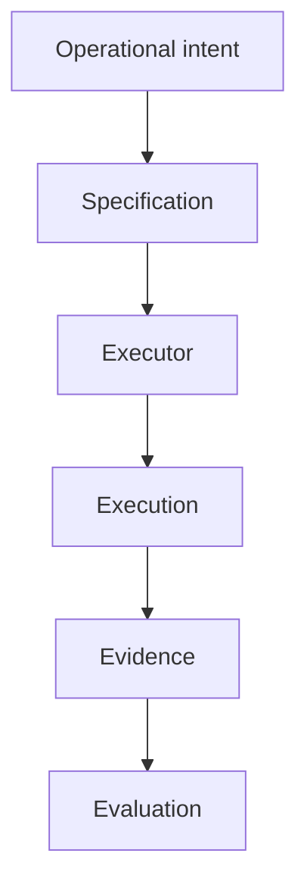
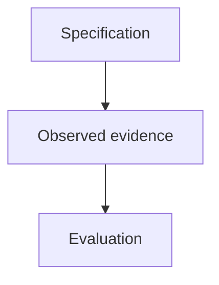
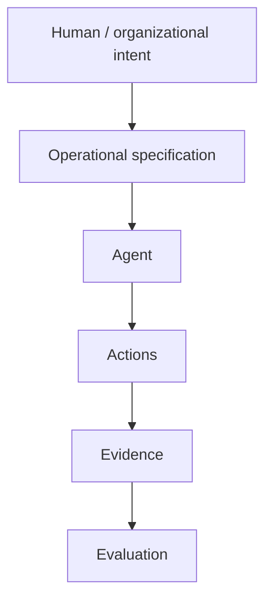
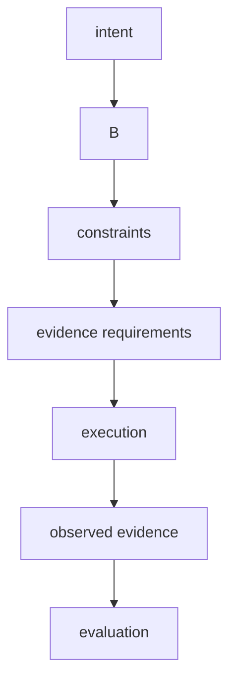

# {{ $frontmatter.title }} 관련

```component VPCard
{
  "title": "TypeScript > Article(s)",
  "desc": "Article(s)",
  "link": "/programming/ts/articles/README.md",
  "logo": "/images/ico-wind.svg",
  "background": "rgba(10,10,10,0.2)"
}
```

```component VPCard
{
  "title": "DevOps > Article(s)",
  "desc": "Article(s)",
  "link": "/devops/articles/README.md",
  "logo": "/images/ico-wind.svg",
  "background": "rgba(10,10,10,0.2)"
}
```

```component VPCard
{
  "title": "Kubernetes > Article(s)",
  "desc": "Article(s)",
  "link": "/devops/k8s/articles/README.md",
  "logo": "/images/ico-wind.svg",
  "background": "rgba(10,10,10,0.2)"
}
```

[[toc]]

---

<SiteInfo
  name="How Executable Operational Specifications Can Make Software Automation Verifiable"
  desc="Modern software systems are increasingly automated. We automate deployments, infrastructure changes, scaling, incident response, and data pipelines. And now, with AI agents, we are starting to automat"
  url="https://freecodecamp.org/news/executable-operational-specifications-software-automation"
  logo="https://cdn.freecodecamp.org/universal/favicons/favicon.ico"
  preview="https://cdn.hashnode.com/uploads/covers/5fc16e412cae9c5b190b6cdd/1f1ae0c4-da67-46b6-ae60-c22aa29fc517.png"/>

Modern software systems are increasingly automated. We automate deployments, infrastructure changes, scaling, incident response, and data pipelines.

And now, with AI agents, we are starting to automate operational decisions too. That sounds like progress, but it creates a problem that is easy to miss:

> We are getting better at executing operations without necessarily getting better at specifying what those operations are supposed to achieve.

A deployment pipeline can run successfully and still violate an important business constraint.

An infrastructure script can finish without error and still leave the system in the wrong state.

An AI agent can complete a sequence of actions and still produce an outcome that nobody can verify afterward.

In many systems, operational intent still lives across:

```plaintext
runbooks
tickets
Slack messages
CI/CD configuration
Terraform files
dashboards
monitoring rules
human memory
```

Those artifacts are useful. But they are not the same thing as an executable operational specification.

An executable operational specification describes what should happen in a way that can later be evaluated against what actually happened.

That distinction becomes increasingly important as execution gets faster, more distributed, and more autonomous.

In this article, I'll explore:

- why automation alone is not enough,
- the difference between execution logic and operational intent,
- what an executable operational specification is,
- why observability does not solve this problem by itself,
- how specifications can make operational behavior verifiable,
- how this applies to CI/CD, infrastructure, incident response, and AI agents,
- what a minimal specification might look like,
- and what problems this approach still does not solve.

The central idea is simple:

> If a system can execute an operation automatically, we should also be able to describe what successful execution means independently of the tool performing it.

::: note Prerequisites

You should be comfortable with:

- software architecture
- CI/CD
- infrastructure automation
- observability
- distributed systems
- basic testing concepts
- automation workflows

You do not need to use any particular cloud provider, deployment platform, or orchestration tool.

The ideas in this article are deliberately tool-independent.

:::

---

## Automation Solves Execution, Not Intent

Consider a deployment pipeline. It might:

```plaintext
build the application
run tests
build an image
push the image
deploy it
wait for readiness
mark the pipeline as successful
```

If every step completes, the pipeline turns green. But what did the pipeline actually prove?

Usually, something like:

```plaintext
the configured steps completed successfully
```

That is useful. But it is not necessarily the same as:

```plaintext
the intended operational outcome was achieved
```

Suppose the deployment succeeds technically, but:

```plaintext
the wrong image version was deployed
only two replicas are running instead of three
the error rate increased
a required feature flag is disabled
the service is healthy but cannot reach a dependency
the rollout violated a regional constraint
```

The executor did its job. The operation still failed in a broader sense. This is the gap between **execution success** and **operational conformance**.

Automation tells us:

> The steps ran.

What we often need to know is:

> Did the resulting system satisfy the intended conditions?

Those are different questions.

---

## Operational Knowledge Is Usually Fragmented

Most production systems already contain operational knowledge. The problem is that it is scattered.

For example, a deployment rule might exist partly in:

```plaintext
GitHub Actions
Terraform
Kubernetes manifests
Grafana dashboards
PagerDuty alerts
a runbook
a ticket
a senior engineer's memory
```

One artifact might define how many replicas should exist. Another might define what error rate is acceptable. A third might explain when rollback is required. A fourth might describe which regions are allowed.

No single representation says:

```md
This is the operation we intend to perform.

These are its constraints.

This is the evidence we require.

This is how we determine whether it succeeded.
```

That makes operations harder to reason about. It also makes automation brittle.

When the rules are distributed across tools, the executor often becomes the de facto specification.

And once that happens, it becomes difficult to ask whether the executor behaved correctly.

The logic that performs the action and the logic that defines success are effectively the same thing.

---

## Execution Logic and Operational Intent Are Different Things

Imagine a deployment script:

```sh
kubectl set image \
deployment/orders \
orders=registry.example.com/orders:2026.09.19
```

This tells Kubernetes **how to perform an action**. It does not fully describe **why the action is acceptable**.

The operational intent might be closer to:

```plaintext
Deploy version 2026.09.19 of the Orders service.

Constraints:

- production must keep at least 3 available replicas
- the error rate must remain below 1%
- p95 latency must stay below 400 ms
- deployment is allowed only in us-east-1
- rollback must remain possible for 30 minutes
```

The command and the intent are related. But they are not the same artifact.

This distinction matters because several different executors might be able to satisfy the same intent.

::: tip For example:

```plaintext
Kubernetes
Nomad
a cloud deployment service
a custom deployment controller
an AI-operated platform
```

If the operational goal is expressed independently, the executor becomes replaceable.

If the goal is embedded inside executor-specific code, replacing the executor may also mean rediscovering the intent.

---

## What Is an Executable Operational Specification?

An executable operational specification is a machine-readable description of an operational objective that can be evaluated against observed evidence.

At a minimum, it should answer questions like:

```plaintext
What are we trying to achieve?

What constraints must hold?

What evidence should be collected?

How do we determine whether the operation conforms?
```

For example:

```yaml
operation: deploy-orders-service

target:
  service: orders
  version: 2026.09.19
  environment: production

constraints:
  minAvailableReplicas: 3
  maxErrorRate: 0.01
  maxP95LatencyMs: 400
  region: us-east-1

evidence:
  - deployedVersion
  - availableReplicas
  - errorRate
  - p95Latency
  - region
```

This is intentionally simple. The important part is not the YAML syntax.

The important part is that the specification defines success independently from the mechanism used to perform the deployment.

That gives us a structure like:



The specification becomes a stable point of reference.

---

## A Simple Deployment Example

Suppose we want to deploy version `2026.09.19` of an Orders service.

The operation succeeds only if:

```plaintext
the correct version is running
at least three replicas are available
error rate stays below 1%
p95 latency stays below 400 ms
```

We can express that as:

```ts
type DeploymentSpec = {
  service: string;
  version: string;
  minAvailableReplicas: number;
  maxErrorRate: number;
  maxP95LatencyMs: number;
};
```

For example:

```ts
const spec: DeploymentSpec = {
  service: "orders",
  version: "2026.09.19",
  minAvailableReplicas: 3,
  maxErrorRate: 0.01,
  maxP95LatencyMs: 400,
};
```

Now suppose execution produces evidence:

```ts
type DeploymentEvidence = {
  deployedVersion: string;
  availableReplicas: number;
  errorRate: number;
  p95LatencyMs: number;
};
```

For example:

```ts
const evidence: DeploymentEvidence = {
  deployedVersion: "2026.09.19",
  availableReplicas: 3,
  errorRate: 0.004,
  p95LatencyMs: 280,
};
```

We can evaluate the evidence against the specification:

```ts
function conforms(
  spec: DeploymentSpec,
  evidence: DeploymentEvidence
): boolean {
  return (
    evidence.deployedVersion ===
      spec.version &&
    evidence.availableReplicas >=
      spec.minAvailableReplicas &&
    evidence.errorRate <=
      spec.maxErrorRate &&
    evidence.p95LatencyMs <=
      spec.maxP95LatencyMs
  );
}
```

Then:

```ts
console.log(
  conforms(spec, evidence)
);
//
// true
```

Now imagine the pipeline technically succeeds but only two replicas remain available:

```ts
const evidence: DeploymentEvidence = {
  deployedVersion: "2026.09.19",
  availableReplicas: 2,
  errorRate: 0.004,
  p95LatencyMs: 280,
};
```

The executor may still report success.

The specification does not:

```plaintext
conforms → false
```

That is the distinction we want.

---

## Turn Success Criteria into Evidence Requirements

A specification becomes useful when its claims can be evaluated.

Suppose the specification says:

```plaintext
error rate must remain below 1%
```

Then the system needs evidence for:

```plaintext
error rate
```

If it says:

```plaintext
at least 3 replicas must remain available
```

then it needs evidence for:

```plaintext
available replica count
```

This sounds obvious, but it introduces an important discipline:

> Every operational requirement should imply some form of observable evidence.

For example:

| Requirement | Evidence |
| --- | --- |
| correct version deployed | running image/version |
| minimum replicas available | replica count |
| error rate below threshold | request/error metrics |
| latency below threshold | latency metrics |
| correct region | runtime placement |
| no schema regression | schema validation result |

This relationship matters because vague operational goals are difficult to automate safely.

Consider:

```plaintext
Deploy safely.
```

What evidence proves that?

The statement is too ambiguous.

A better specification decomposes "safely" into conditions that can be checked.

---

## Why Observability Alone Is Not Enough

At this point you might ask:

> Isn't this just observability?

Not exactly. Observability helps answer:

> What is happening?

A specification helps answer:

> What should be happening?

Those are complementary questions.

A dashboard might tell you:

```plaintext
error rate = 1.4%
```

That is an observation.

But whether `1.4%` is acceptable depends on an expected condition.

The specification might say:

```plaintext
maxErrorRate = 1%
```

Now you can evaluate:

```plaintext
observed: 1.4%
expected: <= 1%

result: non-conformant
```

Without the expected condition, the metric is just a number. Without the metric, the specification cannot be verified. You need both.

Conceptually:



---

## Specifications Make Automation Verifiable

Automation without an independent specification is difficult to verify.

Consider a script that performs:

```plaintext
scale service
restart pods
change routing
wait
finish
```

If the script is also the only place where expected outcomes are encoded, then asking whether it behaved correctly becomes circular.

You are effectively asking:

> Did the automation do what the automation says it should do?

A separate specification gives you another reference point.

Now you can ask:

```plaintext
What was intended?

What did the executor do?

What evidence did execution produce?

Did the evidence satisfy the specification?
```

This makes operations easier to audit and test. It also makes failures more informative.

Instead of:

```plaintext
deployment failed
```

you can potentially say:

```plaintext
deployment execution completed

but specification failed because:

availableReplicas:
expected >= 3
observed = 2
```

That is much more useful.

---

## Keep the Specification Independent from the Executor

One of the strongest properties of this model is executor independence.

Suppose the specification says:

```plaintext
Deploy Orders version 2026.09.19

Keep:
- >= 3 replicas
- error rate <= 1%
- p95 latency <= 400 ms
```

One executor might use Kubernetes. Another might use a managed cloud platform. Another might use a custom orchestrator.

The specification should not need to change simply because the executor changed.

Conceptually:

```plaintext
                 ┌── Kubernetes Executor
Specification ───┼── Cloud Executor
                 ├── Custom Executor
                 └── AI Agent
```

Each executor produces evidence. Each execution is evaluated against the same intent.

That gives you a useful separation:

```plaintext
what should happen
```

from:

```plaintext
how it happens
```

This separation is common in other areas of software engineering. Interfaces separate callers from implementations. SQL separates queries from storage mechanics. Desired-state systems separate target state from reconciliation logic.

Operational specifications apply a similar idea to operational workflows.

---

## A Minimal TypeScript Model

A simple generic model might look like this:

```ts
type Constraint<T> = {
  name: string;
  evaluate(
    evidence: T
  ): boolean;
};

type OperationalSpec<T> = {
  name: string;
  constraints: Constraint<T>[];
};
```

For deployment evidence:

```ts
type Evidence = {
  version: string;
  replicas: number;
  errorRate: number;
};
```

You can define:

```ts
const deploymentSpec:
  OperationalSpec<Evidence> = {
    name: "deploy-orders",
    constraints: [
      {
        name: "correct-version",
        evaluate: (evidence) =>
          evidence.version ===
          "2026.09.19",
      },
      {
        name: "minimum-replicas",
        evaluate: (evidence) =>
          evidence.replicas >= 3,
      },
      {
        name: "error-rate",
        evaluate: (evidence) =>
          evidence.errorRate <= 0.01,
      },
    ],
  };
```

Then evaluate every constraint:

```ts
function evaluate<T>(
  spec: OperationalSpec<T>,
  evidence: T
) {
  return spec.constraints.map(
    (constraint) => ({
      constraint: constraint.name,
      passed:
        constraint.evaluate(
          evidence
        ),
    })
  );
}
```

For:

```ts
const evidence: Evidence = {
  version: "2026.09.19",
  replicas: 2,
  errorRate: 0.003,
};
```

you might get:

```plaintext
correct-version    PASS
minimum-replicas   FAIL
error-rate         PASS
```

That is more useful than a single generic success or failure flag. It tells you exactly which part of the intended operation did not conform.

---

## How This Applies to CI/CD

CI/CD systems already contain some declarative elements.

For example:

```yaml
steps:
  - test
  - build
  - deploy
```

But these steps mostly describe execution order. A specification can add operational expectations around them.

::: tip For example:

```plaintext
Deployment objective:
release version X

Constraints:
tests passed
artifact digest matches approved build
minimum replicas remain available
error rate stays below threshold
rollback remains possible
```

The pipeline still performs the work. The specification defines the conditions the pipeline must satisfy. This also makes pipeline replacement easier.

If you move from:

```plaintext
GitHub Actions
```

to:

```plaintext
GitLab CI
```

or:

```plaintext
Argo
```

the executor changes.

The operational objective does not necessarily need to.

---

## How This Applies to Infrastructure

Infrastructure-as-code already gives us desired state. That is closely related to this idea.

For example:

```hcl
resource "aws_instance" "app" {
  instance_type = "t3.medium"
}
```

But operational intent often extends beyond configuration state.

You may also care about:

```plaintext
service availability
cost limits
regional restrictions
security controls
capacity
latency
backup freshness
```

Those constraints may live outside the IaC definition. An operational specification can bring them together.

::: tip For example:

```plaintext
Provision application environment

Required:
3 instances
region = us-east-1
monthly projected cost < $500
encryption enabled
backup age < 24h
```

The executor may use Terraform.

The evidence may come from:

```plaintext
cloud APIs
cost systems
security scanners
backup metadata
```

The specification gives those sources a common purpose.

---

## How This Applies to Incident Response

Incident response is another place where execution and intent are often mixed together.

A runbook might say:

```plaintext
restart service
clear cache
scale replicas
```

But the actual operational objective might be:

```plaintext
restore checkout availability

while:
avoiding duplicate payments
preserving order state
keeping error rate below threshold
```

That difference matters.

If restarting the service does not restore checkout availability, the runbook technically executed but the operation failed.

An executable specification could express recovery conditions:

```plaintext
checkout success rate > 99%
payment duplication = 0
queue backlog < threshold
error rate < 1%
```

Then incident automation can be evaluated by the result it achieves, not just the actions it performs.

---

## How This Applies to AI Agents

This becomes even more important with AI agents. Traditional automation usually follows predefined execution logic.

An AI agent may choose the execution path dynamically. For example, an operations agent might decide to:

```plaintext
inspect metrics
restart a service
change capacity
modify a feature flag
reroute traffic
```

The exact sequence may vary from one incident to another. That makes executor-level validation harder.

You cannot always verify the agent by checking whether it followed one exact script. But you can still verify operational intent.

::: tip For example:

```plaintext
Objective:
restore API availability

Constraints:
do not disable authentication
do not lose queued requests
error rate < 1%
p95 latency < 500 ms
cost increase < 20%
```

The agent may choose different actions and the specification remains stable.

That creates a useful control structure:



The more autonomous execution becomes, the more valuable this separation becomes.

---

## What Should Go Into an Operational Specification?

A useful specification often includes several categories.

### Objective

What should be achieved?

::: tip For example:

```plaintext
Deploy Orders service version 2026.09.19
```

:::

### Scope

Where does the operation apply?

::: tip For example:

```plaintext
environment: production
region: us-east-1
service: orders
```

:::

### Constraints

What must remain true?

::: tip For example:

```plaintext
available replicas >= 3
error rate <= 1%
p95 latency <= 400 ms
```

:::

### Required Evidence

What must be observed?

::: tip For example:

```plaintext
running version
replica count
error rate
latency
```

:::

### Evaluation Rules

How do we decide whether execution conforms?

::: tip For example:

```plaintext
version must match exactly
replicas must be >= 3
error rate must be <= 0.01
```

:::

### Recovery Conditions

What should happen if conformance fails?

::: tip For example:

```plaintext
stop rollout
restore previous route
require human approval
```

:::

Not every specification needs all of these.

But separating them makes operational intent much clearer.

---

## What Should Stay Out of the Specification?

A specification should not become another implementation script. That means avoiding unnecessary executor-specific mechanics.

For example, this is probably too implementation-specific:

```plaintext
run kubectl command X
wait 10 seconds
call endpoint Y
run shell command Z
```

Those belong in an executor. The specification should focus on the desired operational outcome.

::: tip For example:

```plaintext
service version = 2026.09.19
available replicas >= 3
health checks passing
```

A useful rule is:

> If changing the execution tool forces you to rewrite the specification, the specification may contain too much implementation detail.

Some executor-specific constraints are unavoidable. But the default should be to keep intent and mechanism separate.

---

## A Practical Workflow

If I were introducing executable operational specifications into an existing system, I would start small.

### 1. Pick One Important Operation

::: tip For example:

```plaintext
deploy service
rotate certificate
restore backup
scale worker pool
```

### 2. Write Down the Objective

Ask:

> What does success actually mean?

Not:

> Which commands do we run?

### 3. Identify Constraints

::: tip For example:

```plaintext
minimum availability
maximum error rate
security requirements
regional restrictions
cost limits
```

### 4. Identify Evidence

For each constraint, ask:

> What observation would prove or disprove this condition?

### 5. Separate the Executor

Keep the mechanism that performs the work independent from the specification.

### 6. Evaluate After Execution

Collect evidence and compare it against the specification.

### 7. Report Conformance

Prefer:

```plaintext
3 constraints passed
1 constraint failed
```

over:

```plaintext
operation failed
```

### 8. Improve the Specification

Missing evidence and ambiguous constraints will become visible quickly.

That is useful.

The specification becomes better as operational knowledge becomes explicit.

---

## What Executable Specifications Do Not Solve

Executable specifications are not a complete operations architecture.

They do not automatically solve:

```plaintext
bad requirements
incorrect metrics
missing observability
distributed transactions
security failures
poor executor implementations
organizational ownership
conflicting business goals
```

They also introduce their own risks:

- A bad specification can encode the wrong objective.
- An incomplete specification can create false confidence.
- A stale specification can become another source of drift.
- And not every operational decision can be reduced to a simple threshold.

Human judgment still matters. The goal is not to eliminate judgment. The goal is to make operational intent more explicit and more testable.

---

## From Automated Operations to Verifiable Operations

Software operations have spent years becoming more automated. That trend will continue. But increasing automation creates a new question:

> How do we know the automation achieved the right outcome?

Execution logs, pipeline success, and agent confidence are not enough. We need something to compare execution against. That is where an executable operational specification becomes useful.

It gives us:



That structure turns an operation from:

```plaintext
something happened
```

into:

```plaintext
something happened,
we know what was expected,
we collected evidence,
and we can evaluate the result.
```

That is a much stronger foundation for automation.

---

## Conclusion

The more software operations we automate, the more important it becomes to separate **what we want** from **how a tool executes it**.

Pipelines are executors.

Infrastructure tools, scripts, and AI agents are executors. They can all perform actions.

But the operational objective should exist independently from the mechanism carrying it out.

An executable operational specification gives us a way to describe that objective in terms of:

```plaintext
desired outcome
constraints
required evidence
evaluation rules
```

Then execution becomes something we can verify instead of merely observe.

This matters today for deployments, infrastructure, and incident response.

It will matter even more as operational systems become increasingly autonomous.

Because automation can tell us that an action was executed.

What we really need to know is whether the system ended up where it was supposed to be.

<!-- TODO: add ARTICLE CARD -->
```component VPCard
{
  "title": "How Executable Operational Specifications Can Make Software Automation Verifiable",
  "desc": "Modern software systems are increasingly automated. We automate deployments, infrastructure changes, scaling, incident response, and data pipelines. And now, with AI agents, we are starting to automat",
  "link": "https://chanhi2000.github.io/bookshelf/freecodecamp.org/executable-operational-specifications-software-automation.html",
  "logo": "https://cdn.freecodecamp.org/universal/favicons/favicon.ico",
  "background": "rgba(10,10,35,0.2)"
}
```
