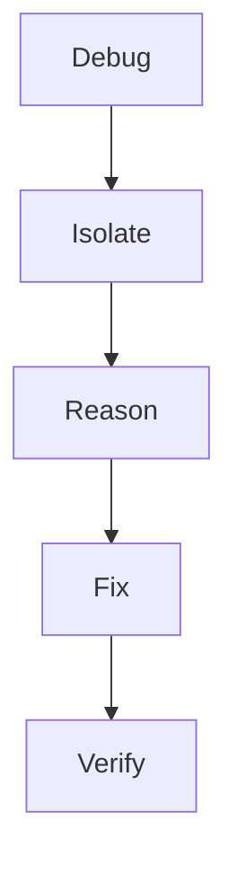
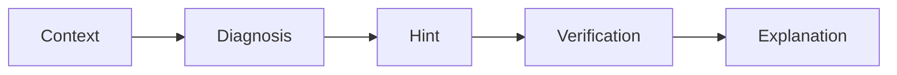
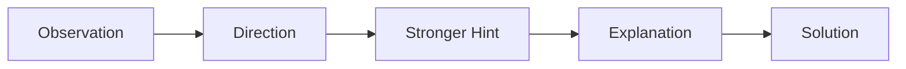
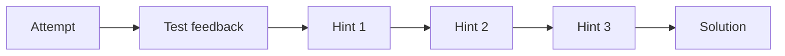
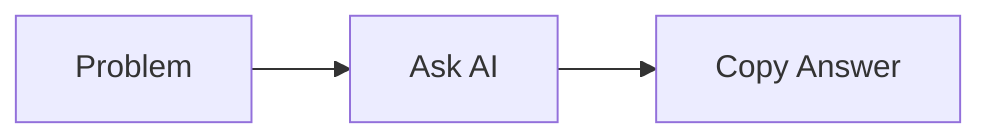

# {{ $frontmatter.title }} 관련

```component VPCard
{
  "title": "Python > Article(s)",
  "desc": "Article(s)",
  "link": "/programming/py/articles/README.md",
  "logo": "/images/ico-wind.svg",
  "background": "rgba(10,10,10,0.2)"
}
```

```component VPCard
{
  "title": "LLM > Article(s)",
  "desc": "Article(s)",
  "link": "/ai/llm/articles/README.md",
  "logo": "/images/ico-wind.svg",
  "background": "rgba(10,10,10,0.2)"
}
```

[[toc]]

---

<SiteInfo
  name="How AI Coding Assistants Can Help You Debug Without Writing the Code for You"
  desc="AI coding assistants have become really good at fixing code. Paste an error into an AI tool and, within seconds, you'll get a corrected implementation. That's useful when you simply want to get someth"
  url="https://freecodecamp.org/news/how-ai-coding-assistants-can-help-you-debug-without-writing-the-code-for-you"
  logo="https://cdn.freecodecamp.org/universal/favicons/favicon.ico"
  preview="https://cdn.hashnode.com/uploads/covers/5e1e335a7a1d3fcc59028c64/b42d645f-44fd-408c-860f-bb187cdcbb02.png"/>

AI coding assistants have become really good at fixing code.

Paste an error into an AI tool and, within seconds, you'll get a corrected implementation. That's useful when you simply want to get something working.

But when you're learning to program, there's another question worth asking: did the AI help you understand the problem, or did it just remove the problem for you?

That difference matters.

Debugging isn't only about arriving at working code. It's also about understanding why something failed, identifying the incorrect assumption, making a change, and verifying that the change actually fixed the problem.

I explored this while using Coddy.tech, an interactive coding-learning platform that combines coding exercises, test feedback, debugging tools, hints, and an AI tutor called Bugsy.

Rather than looking only at whether the AI could solve a programming problem, I tried to examine something different: **how much assistance should an AI coding tutor provide before it simply gives away the answer?**

In this article, I'll explore that question, propose a simple framework for AI-assisted debugging, and use some of my hands-on experiments with Coddy to see how these ideas work in practice.

---

## Debugging Is More Than Producing Correct Code

Let's start with a simple Python function:

```py
def calculate_average(numbers):
    total = 0

    for number in numbers:
        total += number

    return total / (len(numbers) - 1)


scores = [80, 90, 70, 100]

print(calculate_average(scores))
```

The above program runs without any syntax errors or exceptions, but the result is wrong.

The four scores total is 340, so the expected average is:

`340 / 4 = 85`

Instead, the function calculates:

`340 / 3`

because of this line:

```py
return total / (len(numbers) - 1)
```

An AI assistant could immediately respond with:

```py
return total / len(numbers)
```

The problem is solved. But for someone learning programming, the AI has performed most of the important reasoning for them.

A different response could be:

> Your logic calculates the total correctly. But take a closer look at the divisor. How many number of values are actually present in numbers?

Now the developer still has to investigate the logic.The small difference represents two very different approaches to AI assistance.

---

## How Developers Actually Debug

When we debug manually, we usually perform some version of this process:



Suppose this test fails:

```py
assert calculate_average([80, 90, 70, 100]) == 85
```

We usually inspect the actual result. Then check if total contains the expected value. If the total is correct, we verify the division.

Eventually, we notice that four values are being divided as though only three existed.

This whole process creates understanding.

If an AI assistant immediately rewrites the function, the code becomes valid, but much of that reasoning disappears. This suggests that coding assistants designed for learning nees more than code-generation ability. They need a strategy for deciding how much help to provide.

---

## A Framework for AI-Assisted Debugging

One way I think about this is through five stages:



Each stage serves a different purpose.

### 1. Context

Before suggesting a solution, an assistant needs to understand what you're trying to accomplish.

That context might include:

- the requirement or problem statement
- the current code
- expected output
- actual output
- compiler or runtime errors
- failed tests
- previous attempts

Without this information, technically valid advice can still be wrong for the actual requirement.

Consider:

```py
def is_adult(age):
    return age > 18
```

Is this implementation correct? We don't know.

If the requirement says that a person must be older than 18, then it's correct.

But if the requirement says that a person is considered an adult at age 18 or older, then we have a boundary-condition bug.

The code itself doesn't contain enough information to make that determination. The requirement supplies the missing context.

### 2. Diagnosis

Once enough context is available, the assistant can identify the likely source of the problem.

Diagnosis should answer what appears to be wrong. It doesn't necessarily need to answer what exact code should replace it.

For our average example, the AI assistant could say:

> The total is being calculated correctly, but the number of elements used in the division does not match the number of values in the list.

That alone narrows the problem without completely solving it.

### 3. Hint

If diagnosis isn't enough, the assistant can provide a more specific hint, like:

> Check what len(numbers) returns for the sample input and compare it with the divisor in your return statement.

Now you have a concrete debugging step but still have to make the correction.

This creates something like a hint ladder:



AI assistance doesn't need to be binary. There are useful levels between providing no help and revealing the complete logic/implementation.

### 4. Verification

Fixing the failure isn't enough.

After correcting your implementation, you might test:

```py
assert calculate_average([80, 90, 70, 100]) == 85

assert calculate_average([10, 20]) == 15

assert calculate_average([5]) == 5
```

Everything appears fine.

But then try:

```py
calculate_average([])
```

Now you have another problem: division by zero.

The original bug is fixed, but verification exposes another condition you hadn't considered.

Any Useful AI assistant shouldn't only help you make one failing example pass. Instead it should also encourage you to think about what else could fail.

### 5. Explanation

After you reach the solution, AI can reinforce the concept:

> An average is calculated by dividing the sum by the number of elements/values. Because the length of the list is four elements, subtracting one from its length caused the total to be divided by three instead of four.

At this point, the explanation reinforces the reasoning rather than replacing it.

---

## Progressive Assistance Matters

Imagine someone is implementing this requirement: A person is considered an adult at age 18 or older.

They write:

```py
def is_adult(age):

    return age > 18
```

Instead of immediately replacing > with >=, an AI tutor could increase the assistance level. The first hint might bee:

> Check your boundary condition.

If the learner still struggles:

> What should happen when age is exactly 18?

And then:

> Your comparison currently excludes the boundary value itself.

Only if necessary does the assistant finally show: `return age >= 18`. Instead of **Problem → AI → Answer**, we get **Problem → Observation → Hint → Reasoning → Attempt → Verification → Explanation.**

That's a very different learning experience.

---

## I Tried This Learning Loop in Coddy

I wanted to see how the ideas translate into an actual coding-learning environment, so I experimented with Coddy.tech.

I started with a beginner Python challenge about line comments.

There's a straightforward requirement: comment out a print("Goodbye!") line without deleting it so that below line is printed:

```plaintext
Hello, Python!
```

The exercise wasn't particularly interesting from a programming perspective. What caught my attention was everything surrounding the code.

In the same workspace I had access to the challenge requirements, browser-based Python editor, Run Code, test results, expected output, multiple hints, solution access, an option to explain the challenge, and Coddy's AI tutor, Bugsy.

That creates several ways to respond to a failure instead of immediately asking AI for the solution.

### Test Feedback Before AI

I intentionally entered an incorrect solution and executed the code.

Coddy's test area connected the failure back to the requirement, telling me that I needed to add the comment symbol at the beginning of the Goodbye line without deleting it.

The expected output was also displayed:

```plaintext
Hello, Python!
```

From a testing perspective, it's useful even though it seems simple. The learner isn't only asking: **Does the code execute?** They're also asking: **Does the implementation produce the behavior required by the exercise?**

Those two aren't the same questions. A program can execute successfully and still be functionally incorrect.

Showing the expected behavior introduces that distinction early.

### Progressive Hints

The same exercise also provided multiple hint levels.

The first hint directed me toward adding `#` at the beginning of the appropriate line, while additional hints remains available.

This creates another path: 



The learner doesn't necessarily need to jump directly from failure to the complete answer. That supports the progressive-assistance model we discussed earlier.


### Testing Bugsy With My Incorrect Code

Next, I opened Bugsy while the incorrect code was still in the editor.

This gave more interesting result.

Bugsy understood the objective of the exercise and directed me towards commenting out the Goodbye line.

But it also noticed another problem in my current implementation: the Hello statement had an incorrectly formed closing quote/parenthesis.

That second problem matters most because it wasn't simply the concept being taught by the exercise.

It comes from my current code. Bugsy appeared to be responding to both the challenge context and what I had actually written in the editor.

This illustrates why context was the first element of the framework:


Consider this code outside the exercise:

```py
print("Goodbye!")

print("Hello, Python!")
```

There's nothing inherently wrong with it.

You need a complex requirement to know that Goodbye! shouldn't appear and specifically, that you're supposed to comment out the line rather than delete it.

That's where integrating AI becomes interesting in the learning environment.

### Separating Help From the Solution

Another detail that i found interesting: Bugsy provided guidance while keeping "Reveal Solution" locked as a separate action.

That creates a useful difference between **help me move forward** and **reveal the answer.**

The distinction may not be perfect (we'll come back to that) but I like the underlying design idea.

An AI tutor doesn't necessarily need to treat every request for help as a request to reveal complete implementation.

---

## Moving to a Harder Challenge

A beginner comments exercise can only tell us basic things. So I tried a medium-level Python challenge involving more reasoning.

The task was to implement:

```py
find_book_descriptions(catalog, query)
```

The function needed to search a two-dimensional library catalog.

Each book contains an ID and description.

The implementation needed to:

- iterate through the books
- perform case-insensitive matching
- search both the ID and description
- collect matching descriptions
- join multiple results with newline characters
- return `"No books found."` when there were no matches

This gave me a much better environment for testing the assistance.

I intentionally created a broken implementation containing a mixture of Python and pseudocode.

When I ran it, multiple test cases failed.


### Those Test Cases Shows the Behavior too, Not Just Failure

The test panel showed multiple test cases along with arguments, program output, and expected output. Which is important.

Instead of seeing only **failure**, you can investigate the relationship between **Input → Actual behavior → Expected behavior.**

That's basically a testing workflow.

A single successful example doesn't necessarily mean that an implementation satisfies the complete requirement. Different inputs may expose different defects.

### Debugging Without Immediately Asking AI

The same challenge also had a separate Debug option that I used on the broken implementation.

Instead of correcting the entire program or explaining the whole implementation, the Debug panel surfaced the immediate Python failure:

```plaintext
SyntaxError: invalid syntax (main.py, line 5)
```

I liked the separation. Not every programming problem needs generative AI.

If Python already knows where parsing failed, exposing that information gives you an opportunity to investigate independently.

At this point, I had three different feedback mechanisms:

| Mechanism | Question it helps answer |
| --- | --- |
| Test Cases | Does my implementation behave as expected? |
| Debug | Where is execution currently failing? |
| Bugsy | What may be wrong with my approach, and how can I move forward? |


### Then I Asked Bugsy

I gave the same broken implementation to Bugsy.

This time the response went beyond identifying the syntax error. Bugsy recognized that the implementation was mixing Python with pseudocode.

It navigated me toward several changes, including creating a list for matching descriptions, iterating through each book, separating the book ID and description, using lowercase comparisons for case-insensitive searching, and appending the description rather than the query.

It also identified a more interesting control-flow problem.

The "No books found" decision shouldn't happen while individual books are still being searched. Why?

Imagine the first book doesn't match but the second one does.

If the program concludes "No books found" while still inside the search loop, it may make that decision before looping through the rest of the catalog.

That's not just syntax correction. It also requires understanding the relationship between the requirement and the control flow.

This is where contextual AI assistance becomes more interesting than a generic error explanation.

---

## But How Much Help Is Too Much?

The medium challenge also exposed a limitation, or at least an important tradeoff.

Bugsy didn't stop after identifying the problematic areas. It provided a fairly detailed structure showing how the function could be implemented.

From a productivity perspective, that's very useful. If I'm an experienced developer trying to finish something quickly, I highly appreciate it.

But if I'm trying to learn the concept, I'm less convinced that more information is always better.

Consider below two responses.

**Approach A**

`Here is the corrected implementation...`

**Approach B**

`Your "No books found" condition is being evaluated while you're still searching the catalog.`

What could happen if the first book doesn't match, but the second book does?Both can eventually lead to correct code.

But Approach B requires you to reason about control flow.

This exposes a difficult problem for AI tutors.

They potentially have two goals:

> **Help the learner succeed**

and

> **Preserve enough difficulty to get the learner to think**

Those goals can conflict.

An AI assistant capable of generating the complete solution still has to decide whether generating it is actually the most useful thing to do.

### Different Learners May Need Different Amounts of Help

The appropriate amount of assistance also depends on who's asking.

A beginner learning loops for the first time may benefit from progressive hints. An experienced developer debugging unfamiliar library behavior may simply want the answer.

So perhaps the ideal interaction shouldn't always be:

`Here's how to fix it.`

It could begin by understanding intent:

`Do you want a hint, an explanation, or the corrected implementation?`

That's a relatively small UX decision, but it changes the role of the AI.

---

## AI Isn't the Entire Learning System

After spending more time exploring Coddy, another thing became clearer: Bugsy isn't the only learning experience.

The platform also separates activities into areas such as Journey, Practice, Projects, and Missions.

In the Python Journey I explored, lessons were organized through a syllabus and progression path.

The interface also included XP, levels, streaks, daily missions, and a leaderboard.


Those may sound like gamification features rather than AI features. But that's exactly why they're worth discussing.

Learning programming requires repetition and encouragement to help make learning interesting and fun

AI can explain why a loop fails. But understanding that explanation once doesn't mean you'll correctly implement a different loop tomorrow.

You still need to practice. This gives us two complementary systems.

1. Learning progression: **Journey → Practice → Projects → Repetition**
2. Assistance when something goes wrong: **Run Code → Test Feedback → Debug/Hints → Bugsy → Solution**

I think this distinction matters when evaluating AI-learning products.

The question shouldn't only be how capable is the AI?

We should also ask what is the learner doing before and after asking the AI?Are they building stronger fundamentals by using it, or becoming more dependent on AI?

---

## Coding Assistants Should Be Tested Differently

Most evaluations of coding assistants naturally focus on whether they produce correct code which is important.

But for an AI system intended to support learning, I think we need additional test cases.

For example:

| Scenario | What I would evaluate |
| --- | --- |
| Syntax error | Does it correctly locate the problem? |
| Runtime error | Does it explain why execution failed? |
| Logic error | Can it diagnose the problem without unnecessarily rewriting everything? |
| Boundary condition | Does it understand values such as `0`, empty input, or equality boundaries? |
| Wrong algorithm | Can it guide the learner toward the right concept? |
| Repeated wrong attempts | Does the assistance adapt? |
| Correct implementation | Does it recognize that nothing needs fixing? |
| Alternative valid implementation | Does it accept a solution different from the reference answer? |

The final two are particularly interesting.

### Correct Code Is Also a Test Case

Consider:

```py
def square(number):
    return number * number
```

Suppose this completely satisfies the requirement.

What happens if I still ask the AI for help?

A poor assistant might suggest unnecessary changes because it feels obligated to produce something.

A better assistant should be able to say:

> Your implementation already satisfies the stated requirement.

This is closely related to something we encounter when testing generative AI systems: false positives.

Being helpful doesn't always mean finding something wrong. Sometimes being helpful means recognizing that nothing needs fixing.

### Alternative Solutions Matter

Programming problems also rarely have only one valid implementation.

Consider:

```py
def is_even(number):

return number % 2 == 0

Someone else might write:

def is_even(number):

if number % 2 == 0:

return True

return False
```

The first is more concise, but both satisfy the requirement.

An AI learning assistant shouldn't confuse different from the reference solution with incorrect.

That's an important test case for any coding-learning system.

### Repeated Failure Is Another Test

Suppose the learner receives a hint and submits another incorrect solution.

What should happen? Repeating the exact same hint may not help. Immediately revealing the entire solution may be too aggressive.

Instead, assistance could become progressively more specific.

For example:

Attempt 1

> Look closely at the operation you're using to determine whether the number is even.

Attempt 2

> Division gives you the quotient. Think about which operation tells you the remainder.

Attempt 3

> In Python, % returns the remainder after division. Try using it with 2. This is an interesting evaluation dimension for AI tutors because the evaluation isn't only about correctness, but also about adaptation.


In this example, the second request produced another explanation of the same underlying problem, while also pointing out the issue in my current `Hello` statement.

This raises another useful evaluation question: should repeated requests simply produce another explanation, or should the level of assistance adapt based on the learner's previous interaction?

---

## AI Coding Assistants Have Boundary Conditions Too

Traditional software testing spends a lot of time around boundaries.

- What happens at zero?
- What happens at the maximum value?
- What happens when input is empty?
- What happens exactly at the threshold?

AI coding assistants have boundaries too, but many of them are behavioral.

- How little context can we provide before the assistant starts guessing?
- How much assistance can it provide before it effectively gives away the exercise?
- When should a hint become an explanation?
- When should an explanation become code?
- What happens after repeated failures?
- What happens when the learner produces a different but valid implementation?

And when should the AI simply say: I don't have enough information yet.

These aren't only educational questions. They're quality-engineering questions.

---

## A Practical Framework for Evaluating AI Coding Assistance

After these experiments, I come back to the five stages introduced earlier:

1. **Context:** Does the assistant understand what the developer is actually trying to accomplish?
2. **Diagnosis:** Can it identify why the current implementation fails?
3. **Hint:** Can it provide enough direction without unnecessarily revealing the complete solution?
4. **Verification:** Does the environment help the developer validate the correction against additional scenarios?
5. **Explanation:** Does the interaction leave the developer understanding why the final implementation works?

Together:

**Context → Diagnosis → Hint → Verification → Explanation**

A coding assistant that performs well across those dimensions is doing more than generating code. It's participating in the debugging process.

### Where Coddy Fits

This is why I found Coddy interesting to explore. The most interesting part isn't simply that it has an AI tutor.

AI can be attached to almost any coding interface today. In fact not only just to coding interfaces, but to almost anything in general.

The more interesting combination is: **Structured learning + coding exercises + executable code + test feedback + debugging + contextual AI assistance.**

Each component serves a different purpose.

Structured learning provides direction. Exercises require application. Execution provides immediate feedback. Test cases compare implementation against expected behavior. Debugging exposes technical failures. And hints provide incremental assistance.

Bugsy can provide additional contextual guidance. And the complete solution remains another level of assistance.

In the exercises I tried, that produced a workflow closer to:

```mermaid
mermaid LR
  A[Learn] --> B[Code]
  B --> C[Run]
  C --> D[Fail]
  D --> E[Inspect]
  E --> F[Debug]
  F --> G[Ask for Help]
  G --> H[Retry]
```

rather than:



That specific difference is important.

At the same time, my medium-level experiment showed that contextual AI can still provide a substantial amount of implementation guidance very quickly.

How much the AI reveals (and when it reveals it) remains an important design decision.

Less AI isn't always the goal. None of this means developers should avoid AI-generated code. There are plenty of situations where generating the implementation immediately is exactly what we want.

Experienced engineers may use AI to:

- generate boilerplate
- create unit tests
- refactor repetitive code
- understand unfamiliar libraries
- prototype implementations
- explain legacy code
- create documentation

In those situations, speed may be the primary objective

But compare these two requests:

> Help me finish this implementation.

and:

> Help me understand why my implementation fails.

They may involve exactly the same code. But they represent completely different goals. A useful AI coding assistant should ideally recognize that difference.

---

## Wrapping up

The most impressive AI coding assistant may not always be the one that produces the most code. Sometimes it may be the one that knows when not to produce code.

Good debugging assistance should help developers move from:

**“My code doesn't work.”**

to:

**“I understand why my code didn't work.”**

That requires more than code generation.

It requires context, diagnosis, progressive assistance, verification, and explanation.

My experiment with Coddy showed why integrating the AI with the coding environment can be useful: Bugsy could respond to both the exercise and the code I was working with, while test cases, debugging, hints, and solution access provided different levels of assistance.

It also exposed the harder question: when an AI knows how to solve the problem, how much of that solution should it reveal?

As AI becomes more deeply integrated into programming education, I think evaluating whether an assistant generates correct code will remain important.

But we should also measure something harder: did the developer leave the interaction understanding the problem better than when they entered it?

For an AI tutor, that may ultimately be the more meaningful test.

::: info About Author

If you would like to experiment with the features discussed in this article, you can explore them on [<VPIcon icon="fas fa-globe"/>Coddy.tech](http://Coddy.tech).

:::

<!-- TODO: add ARTICLE CARD -->
```component VPCard
{
  "title": "How AI Coding Assistants Can Help You Debug Without Writing the Code for You",
  "desc": "AI coding assistants have become really good at fixing code. Paste an error into an AI tool and, within seconds, you'll get a corrected implementation. That's useful when you simply want to get someth",
  "link": "https://chanhi2000.github.io/bookshelf/freecodecamp.org/how-ai-coding-assistants-can-help-you-debug-without-writing-the-code-for-you.html",
  "logo": "https://cdn.freecodecamp.org/universal/favicons/favicon.ico",
  "background": "rgba(10,10,35,0.2)"
}
```
