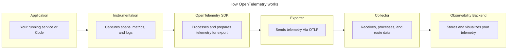
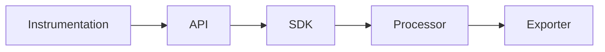

# {{ $frontmatter.title }} 관련

```component VPCard
{
  "title": "Express.js > Article(s)",
  "desc": "Article(s)",
  "link": "/programming/js-express/articles/README.md",
  "logo": "/images/ico-wind.svg",
  "background": "rgba(10,10,10,0.2)"
}
```

```component VPCard
{
  "title": "OpenTelemetry > Article(s)",
  "desc": "Article(s)",
  "link": "/devops/opentelemetry/articles/README.md",
  "logo": "/images/ico-wind.svg",
  "background": "rgba(10,10,10,0.2)"
}
```

[[toc]]

---

<SiteInfo
  name="How OpenTelemetry Works: A Complete Guide"
  desc="If you’re a software developer or DevOps engineer, you've probably come across OpenTelemetry. It comes up a lot, especially when talking about observability, monitoring, or debugging distributed syste"
  url="https://freecodecamp.org/news/how-opentelemetry-works"
  logo="https://cdn.freecodecamp.org/universal/favicons/favicon.ico"
  preview="https://cdn.hashnode.com/uploads/covers/5e1e335a7a1d3fcc59028c64/32307170-27b3-463c-bae9-da3dbfd2a634.png"/>

If you’re a software developer or DevOps engineer, you've probably come across OpenTelemetry. It comes up a lot, especially when talking about observability, monitoring, or debugging distributed systems.

You might even know the basic definition, but knowing what OpenTelemetry is vs how it actually works are two different things.

By the end of this guide, you'll understand how OpenTelemetry works end-to-end, from the moment a request enters your application to the moment you can see it in your observability backend. You'll learn how traces, spans, context propagation, and exporters all fit together into one pipeline.

If you're completely new to OpenTelemetry, don't worry: the next section will get you up to speed before we go any further.

---

## What is OpenTelemetry?

[<VPIcon icon="iconfont icon-opentelemetry"/>OpenTelemetry](https://opentelemetry.io/docs/) is an open-source, vendor-neutral observability framework. It gives you a standard way to instrument your application, generate telemetry data, and export that data to any observability backend of your choice.

Before OpenTelemetry, every monitoring tool had its own way of collecting data. If you used Datadog, you’ll have to instrument your app the Datadog way. If you switched to Jaeger, you started over. OpenTelemetry changed that by giving you one standard way to instrument your application, regardless of which backend you use

::: info

OpenTelemetry is not a monitoring platform, dashboard, or data store. It provides the tools and standards for collecting and exporting telemetry from your application to an observability backend, where the data can be stored, queried, and analyzed.

:::

The data OpenTelemetry collects is called telemetry. It's the information your application produces about itself as it runs, and it comes in three forms:

- **Traces** tell you how a request traveled through your system.
- **Metrics** give you numbers, like how many requests per second your app is handling, or how much memory it's using.
- **Logs** are timestamped records of specific events that happened inside your application.

---

## How OpenTelemetry Works

When a request hits your application, a lot happens behind the scenes. OpenTelemetry's job is to capture all of that activity (the traces, metrics, and logs) and send them to the right place.

Here’s what it looks like:




<!-- TODO: mermaid화 -->

Each stage has a specific job. Let's walk through them one by one.

### Step 1: Instrument Your Application

Before OpenTelemetry can capture anything, your application needs to be instrumented. Instrumentation is simply the process of adding code that tells OpenTelemetry what to watch and what to record.

There are two ways to instrument your application: automatically or manually.

#### 1. Automatic instrumentation

This is the easiest one to start with. You add a library to your project, and it instruments your application for you with no changes to your existing code.

For example, if you're running a Node.js Express app, you can add the OpenTelemetry auto-instrumentation package, and it will automatically start capturing incoming HTTP requests, outgoing calls, database queries, and more.

Here's what that setup looks like:

```js
const { NodeSDK } = require('@opentelemetry/sdk-node');
const { getNodeAutoInstrumentations } = require('@opentelemetry/auto-instrumentations-node');

const sdk = new NodeSDK({
  instrumentations: [getNodeAutoInstrumentations()],
});

sdk.start();
```

Once this runs before your app starts, OpenTelemetry begins capturing telemetry automatically. For a complete setup guide, see [<VPIcon icon="iconfont icon-opentelemetry"/>Getting started with OpenTelemetry in Node.js](https://opentelemetry.io/docs/languages/js/getting-started/nodejs/).

#### 2. Manual instrumentation

Automatic instrumentation covers a lot, but it can't capture everything that happens inside your own code. If you want to track what happens inside a specific function, like how long it takes to process a payment or validate a user, you need to add that yourself.

Here's a simple example. Let’s say you have a function that processes an order:

```js
function processOrder(orderId) {
  // processing logic
}
```

With manual instrumentation, you wrap it like this:

```js
const { trace } = require('@opentelemetry/api');

const tracer = trace.getTracer('order-service');

function processOrder(orderId) {
  return tracer.startActiveSpan('processOrder', (span) => {
    // processing logic

    span.end();
  });
}
```

What happens is that you created a span. That span now records when `processOrder` started, when it ended, and how long it took. You'll learn more about spans in Step 3. For the full manual instrumentation reference, see [<VPIcon icon="iconfont icon-opentelemetry"/>OpenTelemetry JavaScript instrumentation](https://opentelemetry.io/docs/languages/js/instrumentation/#traces).

### Step 2: OpenTelemetry Creates Telemetry Signals

Once your application is instrumented, OpenTelemetry starts producing telemetry data about what your application is doing. That data comes in three forms, called signals, which we've already briefly talked about: [<VPIcon icon="iconfont icon-opentelemetry"/>traces](https://opentelemetry.io/docs/concepts/signals/traces/), [<VPIcon icon="iconfont icon-opentelemetry"/>metrics](https://opentelemetry.io/docs/concepts/signals/metrics/), and [<VPIcon icon="iconfont icon-opentelemetry"/>logs](https://opentelemetry.io/docs/concepts/signals/logs/). Each signal answers a different kind of observability question.

**Traces** show you how a request moved through your system, which services it touched, and how long each step took. **Metrics** give you numbers over time, things like request rate, error rate, and memory usage. **Logs** are timestamped records of specific events that happened inside your application.

Here's a quick comparison:

| Signal | What to shows | Example | Question it answers |
| --- | --- | --- | --- |
| Trace | The journey of a request through your system | A checkout request passing through your API, order service, and database | Why is this request slow? Where did it fail? |
| Metric | A measured value over time | 200 requests per second, 95ms average response time | Is my application healthy right now? |
| Log | A record of a specific event | `ERROR: payment failed for order #1234` | What exactly happened at this point in time? |

You don't have to choose between them. In practice, you'll use all three together. A metric tells you something is wrong, a trace shows you where, and a log tells you exactly what happened.

### Step 3: Traces Follow Requests Through Your Application

When a user sends a request to your application, that request usually touches multiple services before a response comes back. A trace is the complete record of that journey, from the moment the request enters your system to the moment it finishes.

A trace is actually made up of smaller units called **spans**. Each span represents one operation, like an API call, a database query, or a function execution, and together they give you the full picture of what happened.

Every trace gets a unique trace ID, and every span gets its own span ID. The trace ID is what links all the spans together. No matter how many services a request passes through, they all share the same trace ID, so you can follow the request from start to finish in your observability backend.

Here's a simple example. A user places an order, and the request flows through four services:


<!-- TODO: mermaid화 -->

Each span has a start time and an end time, so you can see how long each operation took. If something slowed down or failed, you can pinpoint exactly where it happened just by looking at the spans.

### Step 4: Context Propagation Connects Work Across Services

In Step 3, you saw how a single trace is made up of spans from multiple services. But here's a question you need to ask: how does OpenTelemetry know that a span in your payment service belongs to the same trace as a span in your order service?

Without something connecting them, each service would record its own spans independently. Your API gateway would see one operation, your order service would see another, and your payment service would see a third. They'd look like completely separate requests with no relationship to each other, which makes debugging across services nearly impossible.

That's where context propagation comes in. As a request moves from one service to another, OpenTelemetry attaches the trace context to it, typically as HTTP headers. That context carries the trace ID and the parent span ID, so every service that handles the request knows which trace it belongs to and where it sits in the chain.

Here's what that looks like in practice:


<!-- TODO: mermaid화 -->

All three services share the same trace ID. That's what lets your observability backend connect the spans together into one complete trace.

OpenTelemetry doesn't invent its own rules for this. It follows the [<VPIcon icon="iconfont icon-opentelemetry"/>W3C Trace Context](https://opentelemetry.io/docs/concepts/context-propagation/#propagation) standard, a widely adopted specification that defines how trace context should be formatted and passed between services, so it works consistently across different languages, frameworks, and vendors.

The good news is that if you're using automatic instrumentation, context propagation happens automatically. OpenTelemetry handles the headers for you, so you don't have to think about it unless you're working with a custom transport or a non-standard setup.

### Step 5: The OpenTelemetry SDK Processes the Telemetry

At this point, OpenTelemetry is capturing telemetry and keeping traces connected across services. But between the moment a span is created and the moment it leaves your application, something has to process it. That's the SDK's job.

When your instrumented code creates a span, it does that through the OpenTelemetry API. The API is what you interact with as a developer, things like `trace.getTracer()` and `tracer.startActiveSpan()`. But the API alone doesn't process or send anything. It needs the SDK behind it to actually do the work.




<!-- TODO: mermaid화 -->

Once the SDK receives the telemetry, it runs it through a processor. The processor is responsible for things like batching spans together before sending them, adding extra attributes, or filtering out data you don't need. The most common one you'll see is the `BatchSpanProcessor`, which groups spans and exports them in batches rather than one at a time, making it more efficient in production.

Before the processor even runs, the SDK also handles sampling. Sampling lets you control how much telemetry you actually collect. In high-traffic applications, recording every single span would generate an enormous amount of data. With sampling, you can tell the SDK to only capture a percentage of traces, which keeps your costs and data volume manageable without losing visibility.

Once the processor is done, it hands the data to the exporter, which is what actually sends it to its destination. You'll see how that works in the next step.

### Step 6: Exporters Send the Telemetry

The exporter's job is simple: take the telemetry the SDK prepared and send it to whatever destination you've configured.

OpenTelemetry uses OTLP, the OpenTelemetry Protocol, to transport telemetry data. It's a standard wire protocol designed specifically for transmitting traces, metrics, and logs, and it runs over either HTTP or gRPC.

::: note

OTLP and OpenTelemetry are not the same thing. OpenTelemetry is the full framework, covering instrumentation, the SDK, the Collector, and more. OTLP is just the protocol it uses to transport data.

:::

Although OTLP is the default, not every exporter uses it. Some exporters send data directly to specific backends in their own format, like Jaeger or Prometheus. So depending on your setup, you might use an OTLP exporter to send data to a Collector or backend, or a vendor-specific exporter to send it directly."

### Step 7: The OpenTelemetry Collector Receives and Processes the Data

The OpenTelemetry Collector is a standalone service that sits between your application and your observability backend. It receives telemetry data, processes it, and forwards it to one or more destinations.

Using the Collector is common but not mandatory. You can configure your exporter to send data directly to your backend and skip the Collector entirely. But in most production setups, teams add a Collector because it gives them a central place to manage telemetry, without touching application code.

The Collector has three stages:

- **Receivers** accept incoming telemetry from your applications, typically over OTLP.
- **Processors** transform the data at the Collector level, things like batching spans, filtering out noise, or adding attributes before forwarding.
- **Exporters** send the processed data to your backend, or multiple backends if needed.

Here's a minimal Collector configuration:

```yaml
receivers:
  otlp:
    protocols:
      grpc:
        endpoint: 0.0.0.0:4317

processors:
  batch:

exporters:
  otlphttp:
    endpoint: https://your-backend.com

service:
  pipelines:
    traces:
      receivers: [otlp]
      processors: [batch]
      exporters: [otlphttp]
```

This config accepts traces over gRPC, batches them for efficiency, and forwards them to an observability backend over HTTP.

The Collector can also receive data from multiple applications simultaneously and route it to one or more destinations. So instead of each application shipping telemetry directly to your backend, they all send it to the Collector, and the Collector handles the rest.

For the full configuration, see the [<VPIcon icon="iconfont icon-opentelemetry"/>OpenTelemetry Collector configuration docs](https://opentelemetry.io/docs/collector/configuration/).

### Step 8: An Observability Backend Stores and Analyzes the Telemetry

This is where OpenTelemetry's job ends. Once your telemetry leaves the Collector, it arrives at your observability backend.

The backend is what stores your data, lets you query it, and gives you the dashboards and alerts you actually interact with day to day. OpenTelemetry doesn't provide any of that. It gets the data there, and the backend does the rest.

A few popular backends that support OpenTelemetry natively:

- **Open-source:** Jaeger, Prometheus, Grafana Tempo
- **Commercial:** Datadog, New Relic, Honeycomb, Dynatrace, Elastic, Lightstep, Grafana Cloud, Middleware.

Once your data is in the backend, you can search through traces to debug a slow request, build dashboards to monitor your application's health, and set up alerts when something goes wrong.

---

## Putting the OpenTelemetry Flow Together

Let’s assume a user initiates a bank transfer on a mobile banking app. The request hits your API gateway, and because your application is instrumented, OpenTelemetry immediately starts capturing what’s happening. It creates a span for the incoming request and assigns it a trace ID.

As the request moves to the authentication service, context propagation carries that trace ID along in the request headers. The authentication service creates its own span and attaches it to the same trace. The same thing happens when the authentication service calls the transaction service, and when the transaction service hits the database to process the transfer. Four services and four spans, with one trace ID connecting them all.

Meanwhile, the SDK processes the telemetry in the background, runs the spans through the batch processor, and hands them to the exporter. The exporter packages everything into OTLP and sends it to the Collector, which applies your processing rules and forwards it to your observability backend.

Here’s a summary of every component involved in that flow:

| **Component** | Role |
| --- | --- |
| Instrumentation | Captures what’s happening inside your application |
| API | Exposes the methods your code calls to create spans, metrics, and logs |
| SDK | Processes and prepares telemetry for export |
| Exporter | Packages and sends telemetry via OTLP |
| Collector | Receives, processes, and routes telemetry to your backend |
| Observability backend | Stores, queries, and visualizes your telemetry |

From that single transfer request, you now have a complete trace in your backend. When you open your dashboard and search the trace ID, you'll see every service, every span, and every millisecond of that transaction laid out in front of you.

---

## Do You Need Every OpenTelemetry Component?

To be honest, you don’t need every component to get started with OpenTelemetry. The pipeline you’ve seen throughout this article is the full setup, but not every team uses all of that.

1. **Without the Collector:** Your exporter sends telemetry directly to your backend with nothing in between. Works well for smaller projects or when you're just getting started.
2. **With the Collector:** The more common production setup. Teams add the Collector when they need more control, like routing telemetry to multiple backends, filtering sensitive data, or managing telemetry from dozens of services in one place.

The Collector is powerful, but it’s not mandatory. Start without it if your setup is simple, and add it when you actually need it.

---

## Why Use OpenTelemetry?

You've now seen how every piece of OpenTelemetry fits together. Here's why it's worth using:

- **Vendor-neutral instrumentation:** Before OpenTelemetry, switching observability tools meant you had to re-instrument your entire application from scratch. With OpenTelemetry, you instrument once and switch backends freely.
- **Consistent telemetry across services and languages:** Your backend might be in Go, your microservices in Python, and your data pipeline in Java. OpenTelemetry has SDKs for all of them, and they all produce telemetry in the same format, so your whole stack speaks the same language.
- **Correlated observability signals:** Traces, metrics, and logs all flow through the same pipeline. So when something goes wrong, a spike in your metrics leads you to a trace, and that trace points you to the exact log entry where things broke down.
- **It's becoming the industry standard:** Most observability backends already support OpenTelemetry natively. Instead of learning a vendor-specific instrumentation approach every time you adopt a new tool, you learn OpenTelemetry once and it works everywhere.

---

## Conclusion

OpenTelemetry gives you a standard way to instrument your application, collect telemetry, and ship it to any backend you choose, without locking you into a specific vendor or tool.

If you remember nothing else from this article, remember this: you instrument your application, generate telemetry, process it, export it, and analyze it. Every step has a component behind it, and now you know what each one does.

If you're just getting started, you don't need to set everything up at once. Start with instrumentation, get your telemetry flowing to a backend, and add the Collector when you need it. You can always add more as your needs grow.

::: info About Author

If you found this helpful, I'd love to connect. You can find me on [LinkedIn (<VPIcon icon="fa-brands fa-linkedin"/>`chosenvincent1`)](https://linkedin.com/in/chosenvincent1) or [X (<VPIcon icon="fa-brands fa-x-twitter"/>`ChosenVincent1`)](https://x.com/ChosenVincent1). Feel free to reach out if you have questions or just want to talk about observability and developer tooling.

:::

<!-- TODO: add ARTICLE CARD -->
```component VPCard
{
  "title": "How OpenTelemetry Works: A Complete Guide",
  "desc": "If you’re a software developer or DevOps engineer, you've probably come across OpenTelemetry. It comes up a lot, especially when talking about observability, monitoring, or debugging distributed syste",
  "link": "https://chanhi2000.github.io/bookshelf/freecodecamp.org/how-opentelemetry-works.html",
  "logo": "https://cdn.freecodecamp.org/universal/favicons/favicon.ico",
  "background": "rgba(10,10,35,0.2)"
}
```
