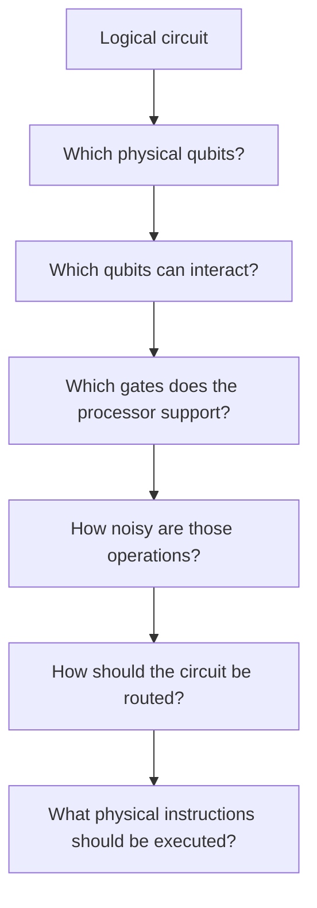
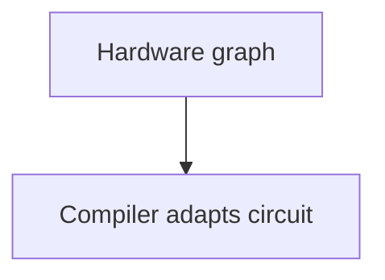
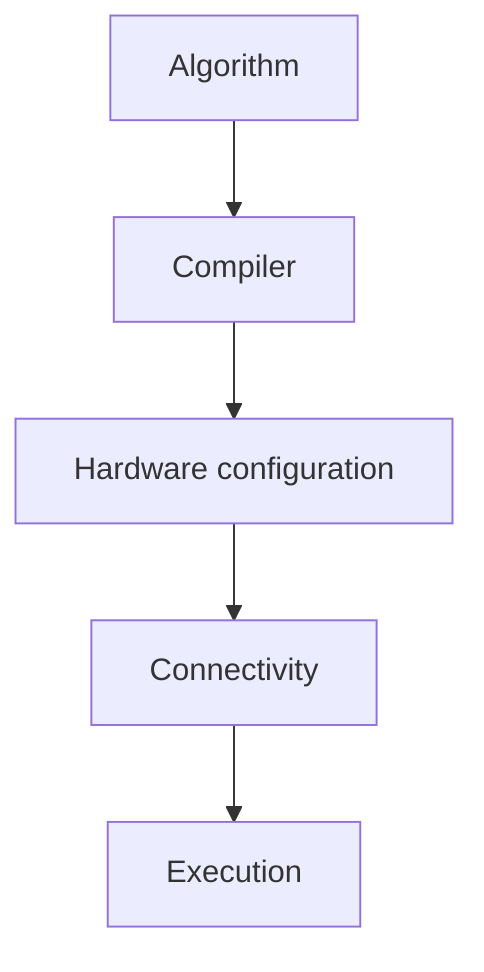

# {{ $frontmatter.title }} 관련

```component VPCard
{
  "title": "Qiskit > Article(s)",
  "desc": "Article(s)",
  "link": "/programming/py-qiskit/articles/README.md",
  "logo": "/images/ico-wind.svg",
  "background": "rgba(10,10,10,0.2)"
}
```

```component VPCard
{
  "title": "Hardware > Article(s)",
  "desc": "Article(s)",
  "link": "/hw/articles/README.md",
  "logo": "/images/ico-wind.svg",
  "background": "rgba(10,10,10,0.2)"
}
```

[[toc]]

---

<SiteInfo
  name="How Quantum Connectivity Shapes What Your Quantum Computer Can Actually Compute"
  desc="Suppose your quantum program needs to apply a two-qubit operation between qubits 0 and 50. From the programmer's perspective, that sounds simple. You have two qubits. You have a gate that operates on "
  url="https://freecodecamp.org/news/how-quantum-connectivity-shapes-what-your-quantum-computer-can-actually-compute"
  logo="https://cdn.freecodecamp.org/universal/favicons/favicon.ico"
  preview="https://cdn.hashnode.com/uploads/covers/5e1e335a7a1d3fcc59028c64/5a82d460-3285-4bd3-b2a6-31176a1c3316.png"/>

Suppose your quantum program needs to apply a two-qubit operation between qubits `0` and `50`.

From the programmer's perspective, that sounds simple.

You have two qubits. You have a gate that operates on two qubits. So why shouldn't the quantum computer simply execute it?

Because on a real quantum processor, qubits aren't necessarily connected to every other qubit.

A quantum processor isn't a bag of interchangeable qubits where every qubit can instantly interact with every other qubit. The physical arrangement of those qubits matters. So do the couplers, control electronics, gate set, error rates, and communication paths between them.

This creates an important distinction between the quantum computer you program and the quantum computer that actually executes your program.

This article is for developers, students, and quantum computing enthusiasts who understand the basics of quantum circuits but want to learn what happens when those circuits meet real quantum hardware. You'll learn how physical qubit connectivity affects circuit execution, why compilers sometimes insert SWAP gates, how routing can increase circuit depth and errors, and how architectures such as IBM's Heron, Nighthawk, and ZuriQ's reconfigurable trapped-ion systems approach the connectivity problem differently.

---

## From Logical Qubits to Physical Qubits

Your circuit might describe interactions between logical qubits that look like this:

```plaintext
q0 ─────●────
│
q1 ─────┼────
│
q2─────-┼────
│
q3────-─x────
```

But the physical quantum processor may only allow neighboring qubits to interact directly.

If the two qubits your algorithm needs aren't physically connected, the compiler has to find another way to make the interaction happen.

That usually means mapping logical qubits to physical qubits, routing operations to respect the hardware's connectivity, and sometimes inserting additional `SWAP` gates to move quantum information around. IBM Quantum explains these steps in its [<VPIcon icon="iconfont icon-ibm"/>transpiler stages guide](https://quantum.cloud.ibm.com/docs/en/guides/transpiler-stages).

Those extra operations aren't part of the algorithm you originally wrote. They're overhead created by the physical architecture of the quantum computer.

This is why quantum connectivity is more than a hardware specification.

It can influence:

- how a quantum circuit is compiled
- how many gates the final circuit contains
- how deep the circuit becomes
- how much noise the computation accumulates
- which algorithms are practical
- and ultimately what useful computation the hardware can perform

IBM Quantum's recent hardware roadmap provides a useful example of this problem. IBM's Heron processors use a heavy-hex topology, while its newer Nighthawk processor moves to a square lattice in which each qubit can connect to up to four neighbors. IBM explicitly describes the increased connectivity as a way to reduce routing overhead and support more complex circuits.

Another way to approach this problem is through ZuriQ. They're developing a trapped-ion architecture in which the ions can be rearranged and transported by dynamically changing the voltages applied to the trap electrodes. The company's architecture describes three-dimensional reconfiguration of the ion trap, allowing ions to be moved across the chip on demand.

That raises a fascinating question: What happens to a quantum program when the qubits it needs to interact with aren't physically connected?

To answer that, we first need to understand what "connectivity" actually means.

---

## What Does Quantum Connectivity Mean?

In a quantum computer, connectivity describes which pairs of physical qubits can directly participate in a two-qubit operation.

You can think of the processor as a graph. Each qubit is a node, and each allowed two-qubit interaction is an edge.

For example, suppose we have five physical qubits:

```plaintext
q0 ─── q1 ─── q2
│
q3 ─── q4
```

This graph tells us that these qubits are directly connected:

```plaintext
q0 <-> q1
q1 <-> q2
q0 <-> q3
q3 <-> q4
```

Even though `q0` and `q4` aren't directly connected, this doesn't mean they can never interact. It means the compiler can't necessarily implement their two-qubit operation directly.

It needs a strategy for getting the quantum information into a configuration where the required operation becomes physically possible.

[<VPIcon icon="iconfont icon-ibm"/>IBM's Qiskit documentation](https://quantum.cloud.ibm.com/docs/en/guides/represent-quantum-computers) calls this hardware description a **coupling map**. The coupling map represents which physical qubits support two-qubit gates. A quantum circuit, meanwhile, starts with logical or virtual qubits that have to be mapped onto those physical qubits.

This distinction is easy to miss when you're learning quantum programming.

You might write:

```py
qc.cx(0, 4)
```

and think you just applied a CNOT between qubits `0` and `4`.

At the abstract circuit level, that's correct. But at the hardware level, the actual processor may say:

> Qubit 0 and physical qubit 4 can't perform this operation directly.

The compiler now has a problem to solve.

---

## A Real-World Analogy: Roads and Cities

Think about a road network.

Suppose you want to drive from City A to City D.

If there's a direct highway between them, the trip is simple.

```plaintext
A ───────── D
```

But imagine the road network looks like this:

```plaintext
A ─ B ─ C ─ D
```

You can still reach D. You simply have to travel through B and C.

Quantum routing works in a similar way.

The difference is that moving quantum information around is expensive.

A classical computer can copy information into memory, move it between locations, and generally tolerate a lot of communication overhead.

Quantum information is much more delicate.

A quantum processor must preserve the quantum state while performing the additional operations required to move that information.

That's where `SWAP` gates enter the story.

---

## What Happens When Two Qubits Aren't Connected?

Suppose your algorithm needs a two-qubit gate between logical qubits `q0` and `q3`.

Your hardware looks like this:

```plaintext
q0 ─── q1 ─── q2 ─── q3
```

The qubits are arranged in a line.

There's no direct edge between `q0` and `q3`.

You can't simply ask the hardware to execute:

```py
qc.cx(0, 3)
```

and expect the physical device to have a direct interaction available.

Instead, the compiler can move the quantum states around.

For example:

```plaintext
Initial:

q0 ─── q1 ─── q2 ─── q3
 A     B      C      D
```

Suppose we want `A` to interact with `D`.

The compiler might perform a series of swaps:

```plaintext
q0 ─── q1 ─── q2 ─── q3
 A     B      C      D

         SWAP
    --> 
q0 ─── q1 ─── q2 ─── q3
 B     A      C      D

         SWAP
    --> 
q0 ─── q1 ─── q2 ─── q3
 B     C      A      D
```

Now `A` and `D` are adjacent.

The desired two-qubit operation can finally be executed.

The problem is that the `SWAP` operations themselves are quantum gates. They take time, and they can introduce errors. They also increase the circuit depth.

IBM's Qiskit documentation explicitly describes routing this way:

> When two qubits required by a circuit are not directly connected on the target device, the transpiler can insert `SWAP` gates to move quantum information until the required qubits become adjacent.

---

## Why is a SWAP Gate Expensive?

A `SWAP` gate exchanges the quantum states of two qubits.

Mathematically, we can describe it as:

```plaintext
|a⟩|b⟩ -> |b⟩|a⟩
```

But many quantum processors don't implement `SWAP` as a single native operation.

Instead, it can be decomposed into three CNOT operations:

```plaintext
SWAP(a, b) = CX(a, b)
             CX(b, a)
             CX(a, b)
```

In Qiskit, we can demonstrate the decomposition:

```py
from qiskit import QuantumCircuit

qc = QuantumCircuit(2)

qc.swap(0, 1)

print(qc)
```

The code creates a two-qubit circuit and applies a `SWAP` gate to exchange the quantum states of qubits 0 and 1. Although Qiskit represents this as one `swap(0, 1)` operation.

Conceptually, this represents:

```plaintext
q0: ──X──●──X──
         │
q1: ──●──X──●──
```

The diagram shows that a SWAP can be implemented using three CNOT operations, which means moving quantum information between qubits can require multiple physical gates.

The important point is that routing a qubit through a quantum processor adds extra operations, increasing circuit depth and the chance of errors.

IBM's documentation notes that inserted SWAP gates can create substantial errors because they're expensive and noisy operations.

---

## Circuit Depth: the Hidden Cost of Poor Connectivity

Gate count is only part of the problem. Another important metric is **circuit depth**.

Circuit depth is roughly the number of sequential layers of operations that must be executed.

Consider these two circuits:

```plaintext
Circuit A:

q0 ──H────●────────
          │
q1 ───────X────────
```

and:

```plaintext
Circuit B:

q0 ──H──SWAP──SWAP──●────
                    │
q1 ─────────────────X────
```

Circuit B contains additional operations.

More importantly, some of those operations must happen before the desired interaction can occur.

That increases the time during which the quantum state has to survive.

This matters because physical qubits are noisy.

The longer and deeper the computation, the more opportunities there are for errors to accumulate.

IBM's recent work illustrates the relationship between connectivity, routing, circuit depth, and useful computation. In May 2026, IBM reported a 52-qubit quantum Fourier transform executed on a Heron processor using a parity-based circuit construction that avoided explicit SWAP-based routing. IBM highlighted routing overhead, circuit depth, and accumulated noise as major challenges for scaling QFT circuits.

That example demonstrates something important:

If the hardware can't easily execute your algorithm, you have two choices: **move the qubits around to fit the algorithm, or redesign the algorithm so it fits the hardware.**

The second option can be much more efficient when it eliminates a large amount of routing overhead.

---

## IBM Heron: Optimizing a Powerful but Structured Topology

IBM's Heron family is a useful place to start because it represents a major step in IBM's superconducting quantum hardware development.

Current IBM documentation lists Heron processors with 133 or 156 programmable qubits and tunable couplers. IBM describes Heron as a core part of its System Two architecture.

Heron uses a heavy-hex topology. A simplified representation looks something like this:

```plaintext
      q1────q2
     /        \
   q0          q3
     \        /
      q4────q5
```

The exact physical layout is more complicated, but the important idea is that **not every qubit is directly connected to every other qubit**.

This topology is deliberate.

Quantum hardware designers are balancing several competing requirements:

- qubit density
- control complexity
- crosstalk
- fabrication constraints
- gate fidelity
- wiring
- connectivity

Increasing connectivity isn't free. Adding more physical couplers can make the processor more complex to build and control.

So the hardware designer has to find a useful compromise.

Heron's heavy-hex architecture is one such compromise.

IBM's 2024 announcement described Heron R2 as a 156-qubit processor with a heavy-hex layout and tunable couplers designed to help suppress crosstalk.

This creates an interesting situation for programmers. The processor may have more than 100 qubits, but the programmer still can't treat those qubits as if they form a completely connected network.

The topology becomes part of the programming environment.

---

## Nighthawk Changes the Connectivity Equation

IBM's Nighthawk takes a different approach.

Rather than continuing with the same heavy-hex topology, Nighthawk uses a **square lattice**.

IBM currently describes Nighthawk as having 120 programmable qubits, with each qubit connected to up to four neighboring qubits.

A simplified square lattice looks like this:

```plaintext
q0 ─── q1 ─── q2
│      │      │
q3 ─── q4 ─── q5
│      │      │
q6 ─── q7 ─── q8
```

The difference may appear small.

Instead of connecting a qubit to a smaller number of neighbors, we give it up to four.

But for quantum circuits, that can make a significant difference.

Imagine an algorithm requires interactions like:

```plaintext
q0 <-> q1
q1 <-> q4
q4 <-> q7
q7 <-> q8
```

A square lattice can accommodate these local interactions naturally.

Now imagine an algorithm requires:

```plaintext
q0 <-> q8
```

Those qubits still aren't directly connected.

So Nighthawk doesn't eliminate routing. Rather, it reduces the amount of routing required for many circuits.

IBM says the square topology provides more connectivity than the heavy-hex architecture and enables circuits with fewer SWAP gates. IBM's 2025 developer conference material described Nighthawk's 218 couplers compared with Heron's 176 and said the increased connectivity allows developers to design circuits that are roughly 30% more complex with fewer SWAP gates.

IBM's 2026 roadmap goes further, describing Nighthawk as a platform for scaling quantum advantage, with plans for larger circuit capacities and multiple 120-qubit modules.

This is the deeper lesson: Increasing qubit count is only one way to make a quantum processor more capable. Increasing useful connectivity can be just as important.

---

## The Compiler Becomes Part of the Hardware Story

This is where quantum computing becomes particularly interesting for software developers.

In classical programming, you can often write code without knowing the exact physical arrangement of the CPU's transistors.

Quantum programming is different. The compiler has to know things about the target processor.

For example:



IBM's Qiskit documentation explicitly describes the target of transpilation as including information such as the QPU's coupling map, supported basis gates, and error rates.

That means a quantum compiler isn't simply translating one programming language into another. It's solving a **hardware-constrained optimization problem**.

The compiler has to answer questions such as:

- Which physical qubits should represent my logical qubits?
- Which mapping minimizes routing?
- Which available qubits have better calibration?
- Where should SWAP operations be inserted?
- Can the circuit be rewritten to reduce two-qubit operations?
- Can a different layout eliminate routing altogether?

This is why compilation can directly affect the quality of a quantum computation.

---

## Mapping: Putting the Right Qubits in the Right Places

Suppose your algorithm frequently uses:

```plaintext
q0 <-> q1
q0 <-> q2
q0 <-> q3
```

You want these logical qubits to be physically close together.

If the compiler maps them to hardware positions like:

```plaintext
q0 -> physical 0
q1 -> physical 1
q2 -> physical 2
q3 -> physical 3
```

the circuit may require little routing.

But imagine the compiler chooses:

```plaintext
q0 → physical 0
q1 → physical 25
q2 → physical 70
q3 → physical 110
```

Now every interaction could require significant routing.

The algorithm hasn't changed. The number of logical qubits hasn't changed. But the physical execution can be dramatically different.

Qiskit, therefore, tries to find layouts that reduce the amount of routing needed. Its documentation notes that finding the optimal SWAP mapping is computationally difficult, so Qiskit uses heuristic approaches such as `SabreSwap` to find good mappings without exhaustively searching every possibility.

---

## The Surprising Part: Your Algorithm Can Be Redesigned Around Hardware

There is another strategy.

Instead of asking how to force your algorithm onto this topology, you can ask:

> Can I express the algorithm in a form that naturally fits this topology?

IBM's recent work provides a good example.

The quantum Fourier transform is an important building block in quantum algorithms, but its interactions can create difficult routing requirements as the number of qubits grows.

In May 2026, researchers demonstrated a 52-qubit QFT on an IBM Heron processor using a parity-based circuit construction. According to IBM, the approach eliminated explicit SWAP-based routing by changing how quantum information was represented and propagated.

This is a powerful idea.

There are at least three ways to deal with limited connectivity:

1. Improve the compiler -> better mapping/routing
2. Improve the hardware -> more physical connectivity
3. Improve the algorithm -> less need for long-range interactions

The future of quantum computing will likely involve all three.

---

## Why IBM is Going Beyond Nearest-Neighbor Connectivity

Nighthawk's square lattice isn't the end of IBM's connectivity strategy. They're also working on technologies that provide connectivity beyond immediate neighbors.

For example, IBM's roadmap describes **c-couplers** that can connect more distant qubits on a chip. IBM says its Loon processor demonstrated up to six degrees of connectivity, a capability motivated in part by the requirements of its quantum error-correcting architecture.

IBM is also developing **l-couplers** for communication between separate quantum modules.

This is important because scaling a quantum computer eventually becomes a systems problem.

Instead of thinking about one giant quantum chip, we can think about:

```plaintext
QPU ─── QPU ─── QPU
 │       │       │
 └───────┴───────┘
   communication
```

IBM describes its long-term architecture as modular, with l-couplers intended to enable quantum communication across chips, modules, and systems.

IBM's roadmap has described plans to connect multiple Nighthawk modules, with the 2026 roadmap targeting configurations of up to three 120-qubit modules.

This changes the question.

We're no longer asking only: **Which qubits are connected on this chip?** We're beginning to ask: **How should quantum information move between processors?**

That is a much bigger architectural problem.

---

## A Different Approach: Reconfigurable Trapped-ion Quantum Computers

Superconducting processors such as IBM's Heron and Nighthawk aren't the only way to build a scalable quantum computer.

Another approach uses **trapped ions**.

Instead of fabricating superconducting qubits on a chip, trapped-ion systems use individual ions held in electromagnetic traps.

The important difference is that the physical arrangement of the ions can potentially be changed.

ZuriQ is developing a trapped-ion architecture based on a reconfigurable ion trap.

According to ZuriQ, varying electrode voltages over time allows its trap array to be reconfigured in three dimensions, enabling ions to be rearranged and transported across the chip when needed.

This is a fundamentally different way of thinking about connectivity.

With a fixed-topology processor, we might think that physical connectivity looks like this:

```plaintext
A ─ B ─ C ─ D
```

If `A` needs to interact with `D`, the compiler has to find a way to move the quantum information through the available network.

With a reconfigurable architecture, the physical arrangement itself can change.

Conceptually, before:

```plaintext
A ─ B ─ C ─ D
```

Reconfigure:

```plaintext
A ─ D ─ B ─ C
```

Now `A` and `D` can become physically close.

The important distinction is that this isn't simply another routing algorithm. The hardware itself participates in changing the connectivity.

That's one of the reasons reconfigurable trapped-ion architectures are interesting from a quantum compilation perspective.

---

## Does Reconfigurable Connectivity Eliminate Compilation?

No. And this is an important distinction.

It would be incorrect to conclude that a reconfigurable quantum computer means the compiler no longer matters.

The compiler still has to decide:

- which ions should interact
- when they should move
- how they should be arranged
- which operations should occur in parallel
- how movement affects timing
- how to avoid unwanted interactions
- how to preserve high-fidelity operations

In other words, the compiler's job changes.

Instead of only asking: **Where can this gate execute?**

It can potentially ask: **How should I configure the hardware so this gate can execute efficiently?**

That distinction is significant.

ZuriQ describes its architecture as dynamically reconfigurable, with ions transported across the chip on demand as part of its approach to scaling trapped-ion quantum computers.

The broader implication is an architectural question: **Should quantum hardware adapt itself to the algorithm, or should the algorithm adapt itself to the hardware?**

The answer may ultimately be **both.**

---

## Fixed Connectivity Versus Reconfigurable Connectivity

We can simplify the difference like this:

| **Approach** | **Connectivity model** | **Main strategy** |
| --- | --- | --- |
| Conventional fixed-topology QPU | Mostly fixed | Compiler routes information |
| IBM Nighthawk | Square lattice, up to four neighbors | Increase local connectivity |
| IBM long-range/modular research | Additional couplers and module links | Extend connectivity beyond nearest neighbors |
| Reconfigurable trapped-ion architecture | Dynamically change ion arrangement | Move ions to create useful interactions |

This doesn't mean one approach is automatically better. Every architecture comes with trade-offs.

A superconducting processor can exploit semiconductor fabrication and fast control technologies but operates under extremely demanding cryogenic conditions (temperatures typically below −150 °C).

A trapped-ion architecture can offer excellent qubit properties and reconfigurable connectivity, but physically transporting ions also introduces engineering and control challenges.

The interesting question is therefore not: Which architecture wins?

It's: Which combination of hardware, connectivity, compilation, and error correction can produce useful large-scale computation?

---

## Connectivity Also Matters for Quantum Error Correction

Connectivity becomes even more important when we move from today's noisy processors toward fault-tolerant quantum computers.

Error correction requires many physical qubits to interact according to specific patterns.

You can't simply add thousands of qubits and assume the system automatically becomes scalable.

The qubits need to be connected in a topology that supports the required error-correction operations.

IBM's fault-tolerant roadmap illustrates this directly.

IBM has described a modular architecture based on bivariate bicycle codes and says that implementing the required quantum low-density parity-check structures requires connections between qubits that are farther apart than nearest neighbors. Its roadmap includes technologies such as c-couplers and l-couplers to address these connectivity requirements.

This gives us a broader definition of connectivity.

Connectivity isn't only about making an algorithm faster. It can determine whether a particular error-correction architecture is practical.

---

## Connectivity Can Change the Algorithm You Choose

Suppose you have two quantum algorithms that solve the same problem.

Algorithm `A` requires many long-distance interactions.

Algorithm `B` uses mostly local interactions.

On a fully connected hypothetical quantum computer, both may look attractive.

On a real QPU with limited connectivity, Algorithm `B` could be much easier to execute.

This is why hardware-aware algorithm design is becoming increasingly important.

IBM's own documentation includes examples of algorithms being adapted to hardware topology. For example, IBM's LUCJ chemistry workflow maps interactions to a topology that can be implemented on heavy-hex hardware without introducing SWAP routing.

That's an important lesson for quantum programmers: **The best quantum algorithm on paper may not be the best quantum algorithm for your processor.** A practical algorithm is one that considers the machine it will actually run on.

---

## You Can Visualize Connectivity as a Graph

One useful way to understand all of this is through graph theory.

Suppose your quantum circuit contains these interactions:

```plaintext
Logical circuit graph:

q0 ───── q1
│ \       │
│  \      │
q2 ───── q3
```

This is the interaction graph of your algorithm.

Now suppose the hardware looks like:

```plaintext
Physical hardware:

p0 ─── p1 ─── p2
│
p3 ─── p4 ─── p5
```

The compiler's task is essentially to find a useful mapping between these two graphs.

You can think of it as:

```plaintext
flowchart TD
A [Algorithm graph] --> B[mapping]
B --> C[Hardware graph]
C --> D[routing]
D --> E[Executable circuit]
```

The closer the two graphs match, the less work the compiler may need to do.

The further apart they are, the more routing may be required.

This is one reason quantum hardware topology and quantum compilation can't really be treated as separate subjects. They're two halves of the same problem.

---

## A Small Qiskit Experiment

Let's make the idea concrete.

Create a circuit that repeatedly asks distant qubits to interact:

```py
from qiskit import QuantumCircuit 

qc = QuantumCircuit(6) 

for _ in range(3): 
qc.cx(0, 5) 
qc.cx(1, 4) 
qc.cx(2, 3) 

print(qc)
```

Now define a simple linear hardware topology:

```py
from qiskit.transpiler import CouplingMap
from qiskit.transpiler import generate_preset_pass_manager

coupling_map = CouplingMap([
    [0, 1],
    [1, 2],
    [2, 3],
    [3, 4],
    [4, 5]
])
```

Then transpile the circuit:

```py
pm = generate_preset_pass_manager(
    optimization_level=0,
    coupling_map=coupling_map
)

compiled = pm.run(qc)

print("Original depth:", qc.depth())
print("Compiled depth:", compiled.depth())
print("Original gates:", len(qc.data))
print("Compiled gates:", len(compiled.data))
```

The exact numbers depend on the transpiler version and optimization configuration, but the experiment demonstrates the important principle: **The hardware topology can change the physical circuit even though the logical algorithm remains the same.**

You can try a topology with more useful connections and compare the resulting circuit.

This is exactly the kind of experiment that makes connectivity tangible for someone learning quantum programming.

---

## Why Fewer SWAP Gates Matter So Much

Suppose Circuit A requires:

```plaintext
100 two-qubit gates
```

and Circuit B requires:

```plaintext
100 algorithmic two-qubit gates
     +
40 SWAP gates
```

If each SWAP is decomposed into three two-qubit gates, those 40 SWAPs can represent a substantial amount of additional two-qubit work.

That means the processor isn't spending all of its time executing the algorithm. It's also spending time rearranging quantum information so the algorithm can execute.

This is the quantum equivalent of spending part of a program's runtime moving data between memory locations instead of performing useful computation.

But there's another difference: Those extra gates can introduce additional opportunities for errors.

This is why routing overhead affects more than performance. It can also affect whether the final result is accurate enough to be useful.

IBM's Qiskit documentation explicitly identifies reducing SWAP operations as an important objective in layout and routing, while IBM's recent QFT demonstration highlighted routing overhead and accumulated noise as barriers to scaling quantum circuits.

---

## More Qubits Doesn't Automatically Mean More Computational Power

This leads to one of the most important ideas in quantum hardware: **A quantum computer with more qubits isn't automatically a more capable quantum computer.**

Imagine two processors.

Processor A:

```plaintext
1,000 qubits
- limited connectivity
- high routing overhead
```

Processor B:

```plaintext
500 qubits
- better connectivity
- lower routing overhead
```

Which one is more useful?

There's no universal answer. It depends on the workload.

If your algorithm requires mostly local interactions, Processor A may work very well.

If your algorithm requires frequent interactions between distant qubits, Processor B's connectivity could make it significantly easier to execute.

This is why modern quantum hardware roadmaps increasingly discuss several dimensions at once:

- qubit count
- gate fidelity
- circuit depth
- connectivity
- throughput
- error correction
- modularity
- software

IBM's current hardware roadmap reflects this broader view, describing Heron, Nighthawk, modular systems, inter-module communication, and scalable infrastructure as parts of the same development path.

---

## The Future May Be About Programmable Connectivity

The most interesting possibility is that connectivity itself could become increasingly programmable.

Today, we can think of a processor as having a mostly fixed physical graph:



But future architectures could move toward:



The compiler wouldn't merely choose gates. It could help determine the physical arrangement or communication structure needed for those gates.

IBM is exploring this idea through increasingly connected chip and modular architectures, while ZuriQ's trapped-ion approach provides a different example in which the positions of ions can be dynamically reconfigured.

That doesn't mean quantum computers will become completely connected.

Physics and engineering constraints will remain.

But it suggests that **connectivity may become something the system actively manages rather than something programmers simply accept.**

---

## What This Means for Quantum Programmers

If you're learning Qiskit or another quantum SDK, it's tempting to think of a quantum circuit as the final program.

It isn't.

It's closer to a high-level description of what you want the quantum computer to do.

The actual execution process looks more like:

```plaintext
Your quantum algorithm 
  --> B[Logical circuit ]
B --> C[Qubit mapping]
C --> D[Routing]
D --> E[Gate decomposition]
E --> F[Optimization]
F --> G[Scheduling]
G --> H[Hardware execution]
```

The physical processor imposes constraints along the way.

This means quantum developers should eventually become comfortable thinking about:

1. **Hardware topology**: Which qubits can directly interact?
2. **Logical-to-physical mapping**: Where should each logical qubit live?
3. **Routing:** How can non-local interactions be implemented?
4. **Circuit depth**: How many sequential operations must execute?
5. **Two-qubit gate count**: How many expensive entangling operations does the circuit require?
6. **Hardware-aware optimization**: Can the circuit be rewritten to match the processor better?
7. **Architecture**: Could a different quantum hardware design reduce the problem altogether?

These questions move quantum programming beyond writing gates. They move it toward quantum systems engineering.

---

## The Deeper Lesson from IBM and ZuriQ

IBM's Heron and Nighthawk processors demonstrate two important ideas.

First, **connectivity is a design trade-off**.

Heron's heavy-hex topology provides a structured architecture for high-performance superconducting qubits. Nighthawk changes the topology to a square lattice with up to four neighbors per qubit, reducing routing overhead for many workloads.

Second, IBM's roadmap shows that local connectivity may not be enough forever.

The company is exploring longer-range couplers and modular communication as it moves toward fault-tolerant systems.

ZuriQ approaches the problem from another direction.

Its trapped-ion architecture uses dynamically controlled electrodes to rearrange and transport ions in three dimensions. Rather than treating connectivity as entirely fixed, the architecture is designed around the ability to reconfigure the physical arrangement of the ions.

These are different engineering philosophies.

One asks:

> **How can we build a better-connected fixed architecture?**

The other asks:

> **How can we make the physical architecture reconfigurable?**

Neither question has a universally correct answer yet.

But both point toward the same fundamental problem: Scalable quantum computing requires a way to move quantum information, or make the right quantum information interact, without allowing the cost of connectivity to overwhelm the computation itself.

---

## Conclusion

When you write:

```py
qc.cx(0, 50)
```

you're describing a logical operation.

You aren't describing everything the physical quantum computer must do to execute that operation.

If qubits `0` and `50` are directly connected, the hardware may be able to perform the interaction efficiently.

If they're not, the compiler may have to rearrange quantum information using additional operations.

Those operations increase gate count and circuit depth, and they can introduce additional opportunities for error.

That makes connectivity one of the hidden forces shaping quantum computation.

IBM's evolution from Heron's heavy-hex architecture toward Nighthawk's square lattice demonstrates how changing hardware topology can reduce routing overhead and enable more complex circuits. IBM's work on long-range couplers and modular communication shows that the connectivity problem becomes even more important as quantum processors scale beyond individual chips.

At the same time, ZuriQ's reconfigurable trapped-ion approach illustrates a different possibility:

instead of asking the compiler to work around a completely fixed topology, the physical arrangement of ions can itself be changed to create useful configurations.

This gives us a useful way to think about the future of quantum computing:

```plaintext
Better algorithms
       +
Better compilers
       +
Better connectivity
       +
Reconfigurable architectures
       +
Better error correction
       =
More useful quantum computers
```

The next time you look at a quantum processor and see a number such as 120 or 156 qubits, don't ask only:

> How many qubits does it have?

Also ask:

> How are those qubits connected?

Because the answer may tell you much more about what the machine can actually compute.

<!-- TODO: add ARTICLE CARD -->
```component VPCard
{
  "title": "How Quantum Connectivity Shapes What Your Quantum Computer Can Actually Compute",
  "desc": "Suppose your quantum program needs to apply a two-qubit operation between qubits 0 and 50. From the programmer's perspective, that sounds simple. You have two qubits. You have a gate that operates on ",
  "link": "https://chanhi2000.github.io/bookshelf/freecodecamp.org/how-quantum-connectivity-shapes-what-your-quantum-computer-can-actually-compute.html",
  "logo": "https://cdn.freecodecamp.org/universal/favicons/favicon.ico",
  "background": "rgba(10,10,35,0.2)"
}
```
