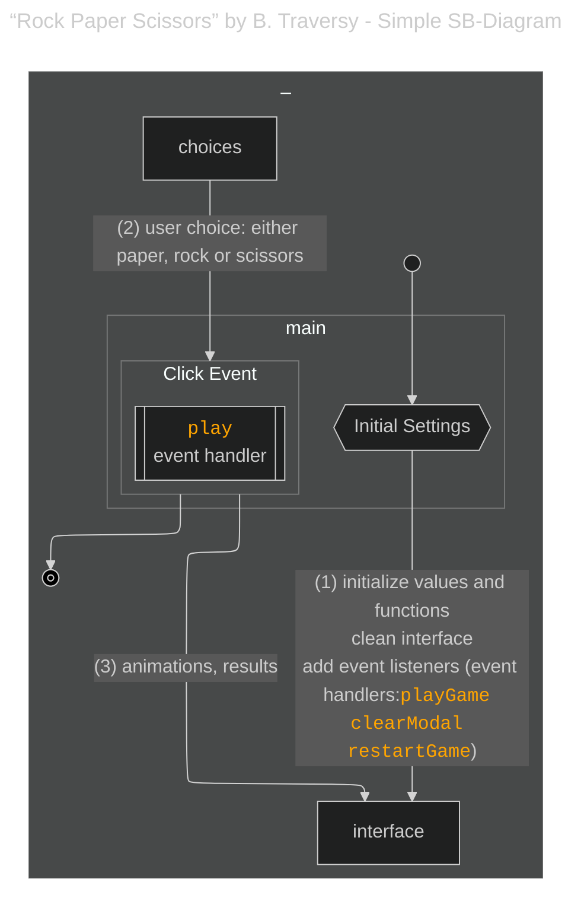
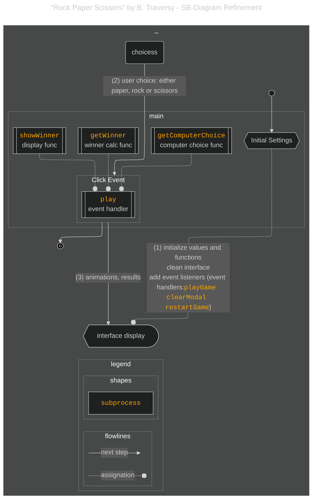
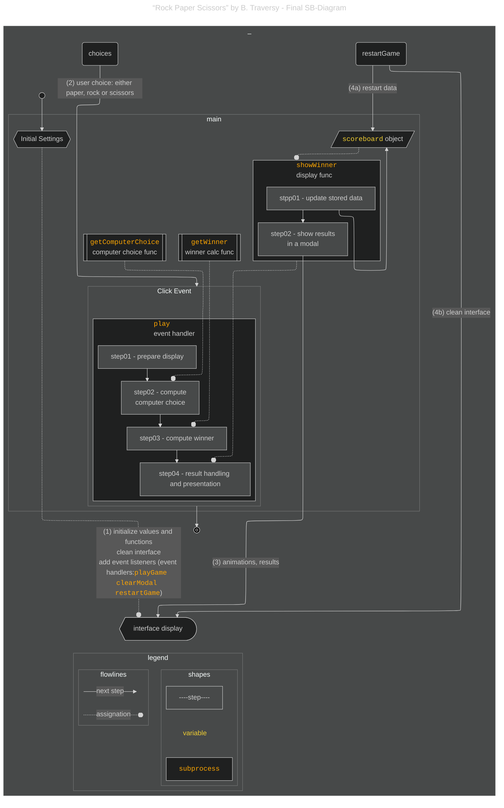

# {{ $frontmatter.title }} 관련

```component VPCard
{
  "title": "How to Become an Analytical Programmer - Solve the “Rock, Paper, Scissors” Game 5 Ways Using JavaScript & Mermaid.js",
  "desc": "Over the past year, I’ve explored tools and practices that help developers build an analytical mindset. One recurring theme is how experienced programmers often describe understanding code as forming a mental picture - a conceptual map of the program...",
  "link": "/freecodecamp.org/how-to-become-an-analytical-programmer-compare-five-projects/README.md",
  "logo": "https://cdn.freecodecamp.org/universal/favicons/favicon.ico",
  "background": "rgba(10,10,35,0.2)"
}
```

[[toc]]

---

<SiteInfo
  name="How to Become an Analytical Programmer - Solve the “Rock, Paper, Scissors” Game 5 Ways Using JavaScript & Mermaid.js"
  desc="Over the past year, I’ve explored tools and practices that help developers build an analytical mindset. One recurring theme is how experienced programmers often describe understanding code as forming a mental picture - a conceptual map of the program..."
  url="https://freecodecamp.org/news/how-to-become-an-analytical-programmer-compare-five-projects#heading-3-rock-paper-scissors-by-brad-traversy-a-project-with-a-modal-and-a-reset"
  logo="https://cdn.freecodecamp.org/universal/favicons/favicon.ico"
  preview="https://cdn.hashnode.com/res/hashnode/image/upload/v1746812725602/cd4a5bc4-71f2-4678-8f5d-5571d9cc38e8.png"/>

If you started self-learning JavaScript at some point between 2015 and today (2025), you might have heard of this guy. [Brad Traversy (<VPIcon icon="fa-brands fa-linkedin"/>`bradtraversy`)](https://linkedin.com/in/bradtraversy) is a legend among those learning to code and has also made his own learning program.

The number of resources produced by Brad is immense. His first contribution to CodePen dates back to 2017. His activity in CodePen has declined with the time, but he has been posting valuable resources nonetheless.

In 2019 he made this Rock Paper Scissors game. This code delivers a straightforward but engaging implementation with a dynamic user interface. The integration of a randomized computer choice, score tracking, and modal result display creates an interactive and visually appealing experience for users.

Key features of this project are:

- **Randomized opponent choice**: The computer's move is randomized each round to simulate an unpredictable opponent.
- **Dynamic modal display**: A modal window shows round results for a polished, user-friendly experience.
- **Re-starting the game**.
- **Score persistence across rounds**: The scoreboard tracks scores until the game is manually reset, allowing for continuous gameplay.

---

## Analysis of the Project

### Quickly discovering of the start and end of the workflow

Inspecting this other code reveals a definitive pattern in the way the game is set. Similarly to the previous projects, in this one:

- it initializes variables and states immediately after the project is accessed
- it has event handlers added to the corresponding HTML elements in the interface
- a function is usually associated to the event handler which is the one that coordinates the workflow - in this case the `play` function.
- the workflow ends by showing results on the interface

Also, this project in particular involves a second event handler with a function to close a modal used to show the results. A third event handler is added to restart the game.

Again, given the similarities between this project and the previous ones at this level of analysis, I reused the script I created and modified it accordingly.




<!-- TODO: 내용 비교 후 이미지 삭제 -->


### Refinement

This project takes a step forward in designing an event handler, the `play` function. Its sole responsibility would be to delegate operations to other functions.

Three functions are called from this event handler:

- `getComputerChoice`
- `getWinner`
- `showWinner`

Notice that again, all those functions are declared in the global scope - but this time, the `play` function is also in the same scope.




<!-- TODO: 내용 비교 후 이미지 삭제 -->


### The `play` event handler as a Controller

In this project, the `play` function resembles more the idea of a **controller**. The tasks of this event handler are reduced to act as a delegator, something that we have not seen fully implemented in the previous projects.

```js
// Play game
function play(e) {
  restart.style.display = 'inline-block';
  const playerChoice = e.target.id;
  const computerChoice = getComputerChoice();
  const winner = getWinner(playerChoice, computerChoice);
  showWinner(winner, computerChoice);
}
```

The **Controller Pattern** is a common architectural pattern used in interactive applications to manage user input by directing it to other components for processing and coordination. The `play` controller will be the one coordinating the actions once the user calls the function from the interface.

### Modularity and Separatation of Concerns (SoC)

However, this one is very **modular**, following a structured procedural flow.

That modularity could be associated to achieving a better Separation of Concerns, or SoC. SoC involves designing code so each section of the code is handled by a different operational unit. Despite its size, this code shows attention to that principle in the form of functions.

### Procedural Programming

**Procedural programming** is a form of imperative programming where procedures are delegated to functions. The way the project is designed is more in accordance to those practices.

### Finalizing the diagram and comparison to previous projects

The functional operations of the functions called by the controller are more evident from the final diagram for this project:




<!-- TODO: 내용 비교 후 이미지 삭제 -->


Let’s point out the different steps carried out by the delegated functions:

- The `getComputerChoice` is in charge of calculating the computer’s choice.
- Results are collected by the controller and passed to another function, `getWinner`, which is in charge of calculating the winner.
- Then the results of the `getWinner` function are collected by the controller and passed to the next function, `showWinner`.
- The `showWinner` function has a similar design as the one made by Hmz C for his project. It will have just one less responsibility, and will take only responsibilities for data handling of a slightly more complex data type for the capture and maintance of the current score (the `scoreboard` object), as well as displaying results.

Despite of the differences in the way the code was designed, the order of the steps is very similar to the projects we have discussed before.

Other features different from the previous code examples are the existence of a modal for result presentation and a reset functionality. We are not discussing them as they fall outside of the scope of the analyses, which is the design of the Rock, Paper, Scissors game.
