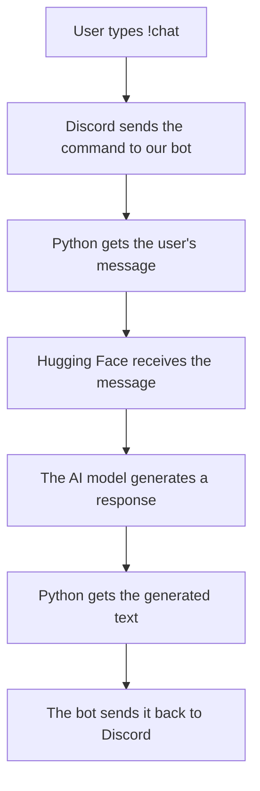
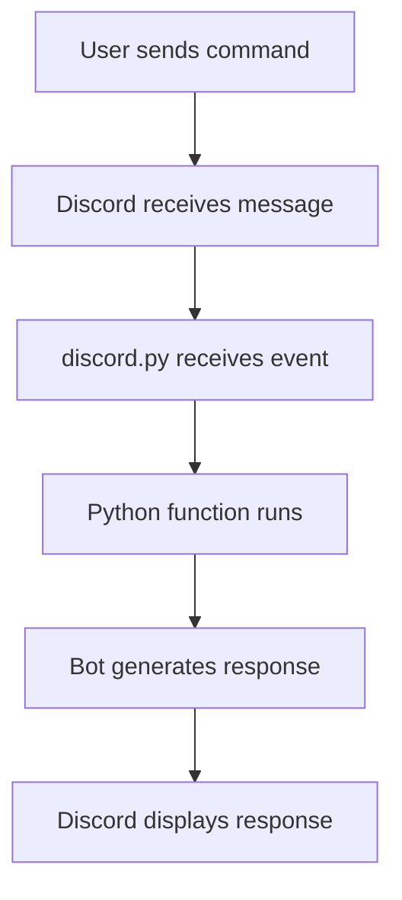

# {{ $frontmatter.title }} 관련

```component VPCard
{
  "title": "Python > Article(s)",
  "desc": "Article(s)",
  "link": "/programming/py/articles/README.md",
  "logo": "/images/ico-wind.svg",
  "background": "rgba(10,10,10,0.2)"
}
```

```component VPCard
{
  "title": "SQLite > Article(s)",
  "desc": "Article(s)",
  "link": "/data-science/sqlite/articles/README.md",
  "logo": "/images/ico-wind.svg",
  "background": "rgba(10,10,10,0.2)"
}
```

```component VPCard
{
  "title": "LLM > Article(s)",
  "desc": "Article(s)",
  "link": "/ai/llm/articles/README.md",
  "logo": "/images/ico-wind.svg",
  "background": "rgba(10,10,10,0.2)"
}
```

[[toc]]

---

<SiteInfo
  name="How to Build a Basic Discord Storytelling, Chat, and Mental Wellness Bot with Python"
  desc="Discord bots can look surprisingly complicated when you see them in action. A bot can respond to messages, tell stories, remember parts of conversations, and stay online around the clock. When I first"
  url="https://freecodecamp.org/news/how-to-build-a-basic-discord-bot-with-python"
  logo="https://cdn.freecodecamp.org/universal/favicons/favicon.ico"
  preview="https://cdn.hashnode.com/uploads/covers/5e1e335a7a1d3fcc59028c64/6a444c51-d332-4915-aa1f-326b57b17472.png"/>

Discord bots can look surprisingly complicated when you see them in action. A bot can respond to messages, tell stories, remember parts of conversations, and stay online around the clock.

When I first started looking into how they worked, I assumed there had to be a huge amount of complicated code behind all of it.

But the basic idea is actually pretty simple.

At its core, a Discord bot is just a Python program that connects to Discord, waits for something to happen, and then decides how to respond. Once you understand that basic idea, you can start adding features one at a time and turn a simple bot into something much more interesting.

In this tutorial, we'll start with a very small bot and gradually build it into something more capable. Along the way, you'll learn about Discord commands, events, asynchronous Python, user state, environment variables, and basic deployment.

One quick disclaimer before we start: the mental-wellness feature that we'll be integrating in this bot in this project is **not therapy**, and the bot is not a therapist or medical professional. It should only provide general supportive suggestions and encourage users to reach out to a trusted person when appropriate.

With that out of the way, let's get coding!

### What We'll Cover:

- [Create the Discord Bot](#heading-create-the-discord-bot)
- [Give the Bot Permission to Read Messages](#heading-give-the-bot-permission-to-read-messages)
- [Create the Project](#heading-create-the-project)
- [Create a Virtual Environment](#heading-create-a-virtual-environment)
- [Install discord.py](#heading-install-discordpy)
- [Create Your First Bot](#heading-create-your-first-bot)
- [Build the Storytelling System](#heading-build-the-storytelling-system)
- [Put Everything Together](#heading-put-everything-together)
- [Our Bot Doesn't Actually Remember Anything](#heading-our-bot-doesnt-actually-remember-anything)
- [Adding Real AI Chat](#heading-adding-real-ai-chat)
- [How Do We Keep the Bot Online?](#heading-how-do-we-keep-the-bot-online)
- [What "Forever" Actually Means](#heading-what-forever-actually-means)
- [Don't Try to "Keep It Awake" With Random Tricks](#heading-dont-try-to-keep-it-awake-with-random-tricks)
- [Additional Features and Where to Go Next](#heading-additional-features-and-where-to-go-next)
- [Test Everything Locally First](#heading-test-everything-locally-first)
- [Deploying the Bot](#heading-deploying-the-bot)
- [Remember: Keep Your Secrets Secret](#heading-remember-keep-your-secrets-secret)

::: info What We're Building

Our finished bot will have several commands:

```plaintext
!hello
!story
!chat hello!
!support I'm having a stressful day
!help
```

For example:

```plaintext
User:
!story

Bot:
You wake up inside an abandoned library.

There are three doors in front of you:

1. A red wooden door
2. A metal door covered in strange symbols
3. A staircase leading underground

Which one do you choose?
```

The user can then continue the story.

For chat:

```plaintext
User:
!chat What's a good way to learn Python?

Bot:
Try building small projects instead of only reading tutorials.
A Discord bot is actually a pretty fun project to start with.
```

And for mental-wellness support:

```plaintext
User:
!support I'm really stressed about school.

Bot:
That sounds like a lot to deal with. You could try breaking
the work into one small task at a time and taking a short
break between tasks.

I'm a bot, not a therapist, so if you need personal support,
consider talking with someone you trust.
```

The goal isn't to make a magical robot therapist. It's to build a useful bot while learning how Discord APIs, Python functions, events, asynchronous programming, and basic conversational logic fit together.

:::

::: info What You Need

You only need a few things:

- Python (version 3.8+ is recommended)
- A Discord account
- A Discord server where you have permission to add a bot
- A code editor (I personally prefer VS Code or PyCharm)
- The <VPIcon icon="fa-brands fa-python"/>`discord.py` library

We'll also use Python's built-in `os` module for reading environment variables.

If you don't already have Python installed, install a current supported version of Python from the official Python website.

Then check that Python works:

```sh
python --version
#
# Python 3.x.x
```

:::

---

## Create the Discord Bot

Before Python can control Discord, we need to create a Discord application.

Go to the Discord Developer Portal:

<SiteInfo
  name="Discord for Developers"
  desc="Build games, experiences, and integrations for millions of users on Discord."
  url="https://discord.com/developers/applications/"
  logo="https://discord.com/assets/favicon.ico"
  preview="https://cdn.discordapp.com/assets/content/4ecb8f1737a3de9f62fb455fd71f6698c9ccbd4692504e3109efbebc53d2bf52.png"/>


This is what the page will look like, you might need to login with your discord email/username and password before you start.

Click on the "New Application" button on the top right and give your bot a name. For this tutorial, let's call ours `StoryBot`.


The application is basically the home for your bot.

Discord's developer platform provides the tools needed to create and configure applications and bots.

Once you've created the application, open its **Bot** section and create the bot user. You can add your own icon picture and your own banner if you want to.

You will then go to the **Token** section and click on "Reset Token" to generate your token. Treat that token like a password. Do **NOT** put it directly into your Python source code.


Never do this:

```py
bot.run("my-secret-token")
```

And definitely don't upload a token to GitHub or commit it to source control. Instead, we'll store it in an environment variable, which we'll talk about later.

---

## Give the Bot Permission to Read Messages

Our bot needs to see the messages that contain commands.

Discord uses something called **Gateway Intents** to control which types of events a bot receives. The <VPIcon icon="fa-brands fa-python"/>`discord.py` documentation explains that intents must be enabled both in your code and, for privileged intents, in the Discord Developer Portal.

In the Developer Portal, find:

```plaintext
Bot
→ Privileged Gateway Intents
```

Enable:

```plaintext
Message Content Intent
```

It should look somewhat like this:


We'll also enable it in Python, which we will talk about later in this article.

---

## Create the Project

Create a folder <VPIcon icon="fas fa-folder-open"/>`discord-story-bot`

Inside it, we'll eventually have:

```sh title="file structure"
discord-story-bot/
├── bot.py
├── requirements.txt
└── .env
```

The three important files are:

- .<VPIcon icon="fa-brands fa-python"/>`bot.py`: our Python program
- .<VPIcon icon="fas fa-file-lines"/>`requirements.txt`: text file that contains the name of the packages our bot needs
- .<VPIcon icon="iconfont icon-dotenv"/>`.env`: our secret token during local development

---

## Create a Virtual Environment

Open your terminal inside the project folder.

Run:

```sh
python -m venv venv
```

Then activate it.

::: code-tabs#sh

@tab:active <VPIcon icon="fa-brands fa-windows"/>

```sh
venv\Scripts\activate
```

@tab <VPIcon icon="iconfont icon-macos"/>,<VPIcon icon="fa-brands fa-linux"/>

```sh
source venv/bin/activate
```

:::

A virtual environment gives this project its own little Python bubble.

That means packages installed for this bot won't randomly interfere with packages used by another project.

---

## Install discord.py

Now install the Discord library:

```sh
pip install -U discord.py
```

The official <VPIcon icon="fa-brands fa-python"/>`discord.py` documentation uses this installation approach for setting up the library.

We'll also install `python-dotenv`, which makes reading our local <VPIcon icon="iconfont icon-dotenv"/>`.env` file easier:

```sh
pip install python-dotenv
```

Then save the dependencies:

```sh
pip freeze > requirements.txt
```

.Yo.ur <VPIcon icon="fas fa-file-lines"/>`requirements.txt` should contain the packages needed by the project.

---

## Create Your First Bot

Let's start small.

Open <VPIcon icon="fa-brands fa-python"/>`bot.py`:

```py :collapsed-lines title="bot.py"
import os

import discord
from discord.ext import commands
from dotenv import load_dotenv


load_dotenv()

TOKEN = os.getenv("DISCORD_TOKEN")

intents = discord.Intents.default()
intents.message_content = True

bot = commands.Bot(
    command_prefix="!",
    intents=intents
)


@bot.event
async def on_ready():
    print(f"Logged in as {bot.user}")


@bot.command()
async def hello(ctx):
    await ctx.send("Hello! I'm online.")


bot.run(TOKEN)
```

That is already a functional Discord bot.

Let's break it apart piece by piece.

### Importing Our Libraries

First:

```py
import os
```

`os` lets Python communicate with parts of the operating system.

We'll use it to read environment variables.

Next:

```py
import discord
```

This imports <VPIcon icon="fa-brands fa-python"/>`discord.py`.

Then:

```py
from discord.ext import commands
```

The `commands` extension makes creating commands much easier.

Instead of manually checking every message for something like `!hello`, we can write:

```py
@bot.command()
async def hello(ctx):
    await ctx.send("Hello!")
```

The <VPIcon icon="fa-brands fa-python"/>`discord.py` command system is built around Python functions decorated as commands.

Finally:

```py
from dotenv import load_dotenv
```

This lets us load values from our <VPIcon icon="iconfont icon-dotenv"/>`.env` file.

### Loading the Token

Our bot needs a token to connect our Python program to Discord. Think of the token as a password that allows our program to authenticate as the bot.

We don't want to put this secret directly into our Python code. Instead, we'll store it in an environment variable.

First, install `python-dotenv`:

```sh
pip install python-dotenv
```

This package lets Python read values from a <VPIcon icon="iconfont icon-dotenv"/>`.env` file.

Now create a new file called <VPIcon icon="iconfont icon-dotenv"/>`.env` in the same folder as <VPIcon icon="fa-brands fa-python"/>`bot.py`.

Inside <VPIcon icon="iconfont icon-dotenv"/>`.env`, add:

```sh title=".env"
DISCORD_TOKEN=YOUR_BOT_TOKEN_HERE
```

Replace `YOUR_BOT_TOKEN_HERE` with the token you copied from the Discord Developer Portal.

Your file should look something like this:

```sh title=".env"
DISCORD_TOKEN=your_actual_token_here
```

Don't share this token with anyone or upload your <VPIcon icon="iconfont icon-dotenv"/>`.env` file to GitHub. Your bot token should be treated like a password.

To make sure Git doesn't accidentally include the <VPIcon icon="iconfont icon-dotenv"/>`.env` file in a repository, create a file called `.gitignore` in your project folder and add:

```plaintext
.env
venv/
__pycache__/
```

Now let's load the token in Python.

At the top of <VPIcon icon="fa-brands fa-python"/>`bot.py`, add:

```py
import os
from dotenv import load_dotenv
```

Then add:

```py
load_dotenv()
```

This tells Python to look for the <VPIcon icon="iconfont icon-dotenv"/>`.env` file and load the variables inside it.

Now we can get our Discord token:

```py
TOKEN = os.getenv("DISCORD_TOKEN")
```

`os.getenv()` looks for the environment variable named `"DISCORD_TOKEN"` and gives us its value.

We can also check that the token was actually found:

```py
if not TOKEN:
    raise RuntimeError("DISCORD_TOKEN is not set.")
```

If Python can't find the token, the program stops and gives us a clear error message instead of failing later in a confusing way.

### Understanding Intents

Remember how we talked about enabling message content readability in python? We are going to do that now.

Add:

```py
intents = discord.Intents.default()
intents.message_content = True
```

The first line creates a set of Discord's default intents.

The second line tells Discord that our bot needs access to message content.

Now we need to give these intents to our bot when we create it:

```py
bot = commands.Bot(
    command_prefix="!",
    intents=intents
)
```

The `command_prefix="!"` means our bot will recognize commands that begin with `!`.

For example:

```plaintext
!hello
```

The `intents=intents` part gives our bot the permissions we configured above.

There are two steps here because Discord needs to know that our bot is allowed to receive message content, while our Python program also needs to tell Discord that it wants to receive it.

Our basic setup should now look like this:

```py
import os
import discord

from dotenv import load_dotenv
from discord.ext import commands

load_dotenv()

TOKEN = os.getenv("DISCORD_TOKEN")

if not TOKEN:
    raise RuntimeError("DISCORD_TOKEN is not set.")

intents = discord.Intents.default()
intents.message_content = True

bot = commands.Bot(
    command_prefix="!",
    intents=intents
)
```

Now our bot has its token safely loaded and <VPIcon icon="fa-brands fa-python"/>`discord.py` knows which intents to request when it connects to Discord.

### What Is `ctx`?

This part can look weird when you're learning Discord bots:

```py
async def hello(ctx):
```

What is `ctx`? `ctx` stands for **context**. It contains information about the command that was used.

For example, it can tell us:

- Who ran the command
- Which server it came from
- Which channel it came from
- What message triggered it

Then:

```py
await ctx.send("Hello!")
```

means:

> "Send this message back to the place where the command was used."

### Why Does Everything Say `async` and `await`?

You might notice:

```py
async def hello(ctx):
```

and:

```py
await ctx.send(...)
```

Discord bots spend a lot of time waiting.

They wait for:

- Messages
- Discord responses
- API requests
- Timers
- Other events

Python's asynchronous programming features allow the bot to wait for these operations without freezing everything else.

You don't need to become an async-programming expert before building your first bot.

For now, think of `await` as:

> "Pause this task until this operation finishes, while letting the bot handle other things."

### Run the Bot

Start it with:

```sh
python bot.py
```

If everything works, your terminal should print something similar to:

```plaintext
Logged in as StoryBot
```

Now go to your Discord server and type `!hello`. Your bot should respond.

Congratulations! You've officially made a Discord bot.

Now let's make it interesting.

---

## Build the Storytelling System

First, we're going to create an interactive storytelling command.

At the top of <VPIcon icon="fa-brands fa-python"/>`bot.py`, add:

```py title="bot.py"
import random
```

Then create some story ingredients:

```py title="bot.py"
story_locations = [
    "an abandoned library",
    "a mysterious island",
    "a futuristic city",
    "a hidden underground laboratory",
    "a forest that never appears on maps"
]

story_items = [
    "a glowing key",
    "an ancient notebook",
    "a strange compass",
    "a locked metal box",
    "a mysterious photograph"
]

story_events = [
    "You hear footsteps behind you.",
    "The lights suddenly turn off.",
    "A hidden door opens nearby.",
    "Your phone starts displaying a message from an unknown sender.",
    "You notice that the room has changed."
]
```

Now create the command:

```py title="bot.py"
@bot.command()
async def story(ctx):
    location = random.choice(story_locations)
    item = random.choice(story_items)
    event = random.choice(story_events)

    story_text = (
        f"You wake up in {location}.\n\n"
        f"Next to you is {item}.\n\n"
        f"{event}\n\n"
        "What do you do?"
    )

    await ctx.send(story_text)
```

Now `!story` might produce:

```plaintext
You wake up in a futuristic city.

Next to you is an ancient notebook.

A hidden door opens nearby.

What do you do?
```

Run it again and you might get something completely different.

That's because of:

```py
random.choice(...)
```

Python randomly picks one item from each list.

It's a simple technique, but suddenly your bot can generate hundreds of different combinations.

### Let's Make the Story Remember the User

Random stories are fun, but interactive stories are much better when the bot remembers what happened.

We can create a dictionary:

```py
user_stories = {}
```

The dictionary will store story information for each user.

For example:

```plaintext
user ID → current story
```

Now let's modify the story command:

```py
@bot.command()
async def story(ctx):
    user_id = ctx.author.id

    location = random.choice(story_locations)
    item = random.choice(story_items)
    event = random.choice(story_events)

    user_stories[user_id] = {
        "location": location,
        "item": item,
        "event": event
    }

    await ctx.send(
        f"You wake up in {location}.\n\n"
        f"Next to you is {item}.\n\n"
        f"{event}\n\n"
        "What do you do?"
    )
```

Now each user can have their own active story.

### Add a Story Choice

Let's give users choices.

```py :collapsed-lines
@bot.command()
async def choose(ctx, choice: str):
    user_id = ctx.author.id

    if user_id not in user_stories:
        await ctx.send("You don't have an active story. Try `!story` first.")
        return

    choice = choice.lower()

    if choice == "left":
        response = (
            "You head left and discover a room filled with old maps. "
            "One of them has your name written on it."
        )

    elif choice == "right":
        response = (
            "You head right and find a staircase leading toward "
            "a strange blue light."
        )

    else:
        response = "Try choosing `left` or `right`."

    await ctx.send(response)
```

Now users can type:

```plaintext
!choose left
```

or:

```plaintext
!choose right
```

Notice this:

```py
async def choose(ctx, choice: str):
```

The `choice` parameter receives the text after the command.

So:

```plaintext
!choose left
```

becomes approximately:

```py
choice = "left"
```

This is one of the reasons command frameworks are so convenient. A **command framework** is a set of tools that makes it easier to create and manage commands in a program. In our case, <VPIcon icon="fa-brands fa-python"/>`discord.py` provides the command framework that lets us turn Python functions into Discord commands using decorators like `@bot.command()`.

Instead of manually checking every message to figure out whether someone typed `!choose`, <VPIcon icon="fa-brands fa-python"/>`discord.py` handles that work for us. It recognizes the command, takes the user's arguments, and passes them to our function.

So when someone types:

```plaintext
!choose left
```

.<VPIcon icon="fa-brands fa-python"/>`discord.py` knows that choose is the command, `"left"` is the argument, and that it should call our `choose()` function with that information.

### Add a Casual Chat Command

Now let's make the bot capable of basic conversation.

We could connect it to a large language model API, but you don't actually need AI to learn how a chat command works. We'll start with a simple keyword-based response system.

First, we'll create a dictionary containing some keywords and possible responses:

```py
chat_responses = {
    "hello": [
        "Hey! What's up?",
        "Hello! How's your day going?",
        "Hi! What are you working on?"
    ],
    "python": [
        "Python is a great language for beginners because its syntax is pretty readable.",
        "If you're learning Python, try building something instead of only watching tutorials."
    ],
    "discord": [
        "Discord bots are a fun way to practice Python because you get instant feedback.",
        "Once you understand commands and events, you can build some surprisingly complex bots."
    ]
}
```

Think of `chat_responses` as a small collection of things our bot knows how to talk about. Each key, such as `"python"` or `"discord"`, represents a keyword the bot can look for. The value associated with each key is a list of possible responses.

We use a list instead of a single response so the bot doesn't give exactly the same answer every time. Later, we'll randomly choose one of these responses.

Now let's create the actual `!chat` command:

```py
@bot.command()
async def chat(ctx, *, message: str):
    text = message.lower()

    for keyword, responses in chat_responses.items():
        if keyword in text:
            await ctx.send(random.choice(responses))
            return

    await ctx.send(
        "I'm still learning how to respond to that. "
        "Try talking to me about Python or Discord!"
    )
```

There are a few things happening here, so let's break it down.

First, this part:

```py
@bot.command()
async def chat(ctx, *, message: str):
```

turns the `chat()` function into a Discord command. The `*` is important because it tells <VPIcon icon="fa-brands fa-python"/>`discord.py` to treat everything after the command as one argument.

For example, if someone types:

```plaintext
!chat I want to learn Python
```

the entire phrase after `!chat` becomes the value of `message`:

```py
message = "I want to learn Python"
```

Next, we have:

```py
text = message.lower()
```

This converts the message to lowercase. That means `Python`, `python`, and `PYTHON` will all become `python`. Without this, our keyword check could miss a match simply because the user capitalized a word differently.

Now we get to the loop:

```py
for keyword, responses in chat_responses.items():
```

`.items()` lets us go through both the keyword and its corresponding list of responses. During each loop, `keyword` contains something like `"python"`, while `responses` contains the list of responses associated with it.

Then we check:

```py
if keyword in text:
```

This asks whether the current keyword appears anywhere in the user's message.

If the user writes:

```plaintext
!chat I want to learn Python
```

the lowercase version becomes:

```plaintext
i want to learn python
```

Since `"python"` appears inside that text, the condition is true.

The bot can then choose a random response:

```py
await ctx.send(random.choice(responses))
```

`random.choice()` picks one item from the response list, while `ctx.send()` sends that response back to the Discord channel.

Finally, we have:

```py
return
```

This stops the function after a matching keyword is found. Without it, the loop would continue checking the other keywords even after the bot had already responded.

But what happens if none of the keywords match?

That's what this part handles:

```py
await ctx.send(
    "I'm still learning how to respond to that. "
    "Try talking to me about Python or Discord!"
)
```

If the loop finishes without finding a keyword, the bot sends this fallback message instead.

For example:

```plaintext
!chat I like pizza
```

doesn't contain `"hello"`, `"python"`, or `"discord"`, so the bot doesn't have a specific response to use.

This gives us a simple way for the bot to have conversations without needing an AI model.

### Add a Mental-Wellness Support Feature

Now for the feature that needs a little more care.

Instead of calling this a "therapy command" internally, we'll call it:

```plaintext
!support
```

Quick additional disclaimer before we start...this is just a fun wellness script, not a real therapist!

Create:

```py :collapsed-lines
support_responses = {
    "stress": [
        "That sounds like a lot to handle. Try breaking the situation into one small task at a time.",
        "When everything feels overwhelming, it can help to pause and focus on what needs attention right now."
    ],

    "school": [
        "School can pile up quickly. Consider choosing one assignment to work on first instead of trying to solve everything at once.",
        "If school stress is getting difficult to manage, talking with a trusted person can make things feel less like something you have to handle alone."
    ],

    "sad": [
        "I'm sorry you're having a difficult moment. Taking a short break, doing something calming, or talking with someone you trust may help.",
        "You don't have to solve everything immediately. Give yourself some time and consider reaching out to someone you trust."
    ]
}
```

Now create the command:

```py
@bot.command()
async def support(ctx, *, message: str):
    text = message.lower()

    for keyword, responses in support_responses.items():
        if keyword in text:
            response = random.choice(responses)

            await ctx.send(
                f"{response}\n\n"
                "I'm a bot, not a therapist or medical professional. "
                "If you need personal support, consider talking with "
                "someone you trust."
            )
            return

    await ctx.send(
        "It sounds like something is bothering you. "
        "I can offer general wellness suggestions, but I'm not a therapist. "
        "If you need personal support, consider reaching out to someone you trust."
    )
```

Now someone can type:

```plaintext
!support I'm stressed about school
```

The bot sees the word:

```plaintext
school
```

and chooses one of the school-related responses.

This is deliberately simple.

For a real public bot, you'd want much more careful safety handling, testing, moderation, privacy protection, and escalation logic before allowing users to rely on it for sensitive situations.

### Add a Help Command

A good bot should explain itself.

```py
@bot.command()
async def commands_help(ctx):
    await ctx.send(
        "**Available commands:**\n"
        "`!hello` - Say hello\n"
        "`!story` - Start a new story\n"
        "`!choose left` - Choose the left path\n"
        "`!choose right` - Choose the right path\n"
        "`!chat <message>` - Have a casual conversation\n"
        "`!support <message>` - Get general wellness support"
    )
```

There's one small issue.

Discord's default help command is already called `help`.

So instead of:

```py
async def help(ctx):
```

we've named ours:

```py
commands_help
```

If you want the command itself to be called `!help`, you can write:

```py
@bot.command(name="help")
async def commands_help(ctx):
    ...
```

That tells Discord:

> Use `!help` for this function even though the Python function has another name.

### Improve Error Handling

Bots shouldn't crash just because someone enters an invalid command.

Add:

```py
@bot.event
async def on_command_error(ctx, error):
    if isinstance(error, commands.MissingRequiredArgument):
        await ctx.send(
            "You're missing something. Try `!help` to see how the command works."
        )

    elif isinstance(error, commands.CommandNotFound):
        return

    else:
        print(f"Error: {error}")
```

Now if someone types:

```plaintext
!chat
```

without giving the bot a message, it can respond with a useful explanation instead of dumping a confusing error into the conversation.

---

## Put Everything Together

At this point, your <VPIcon icon="fa-brands fa-python"/>`bot.py` can look like this:

```py :collapsed-lines title="bot.py"
import os
import random

import discord
from discord.ext import commands
from dotenv import load_dotenv


load_dotenv()

TOKEN = os.getenv("DISCORD_TOKEN")

if not TOKEN:
    raise RuntimeError("DISCORD_TOKEN is not set.")


intents = discord.Intents.default()
intents.message_content = True

bot = commands.Bot(
    command_prefix="!",
    intents=intents
)


story_locations = [
    "an abandoned library",
    "a mysterious island",
    "a futuristic city",
    "a hidden underground laboratory",
    "a forest that never appears on maps"
]

story_items = [
    "a glowing key",
    "an ancient notebook",
    "a strange compass",
    "a locked metal box",
    "a mysterious photograph"
]

story_events = [
    "You hear footsteps behind you.",
    "The lights suddenly turn off.",
    "A hidden door opens nearby.",
    "Your phone starts displaying a message from an unknown sender.",
    "You notice that the room has changed."
]


user_stories = {}


chat_responses = {
    "hello": [
        "Hey! What's up?",
        "Hello! How's your day going?",
        "Hi! What are you working on?"
    ],

    "python": [
        "Python is a great language for beginners because its syntax is pretty readable.",
        "If you're learning Python, try building something instead of only watching tutorials."
    ],

    "discord": [
        "Discord bots are a fun way to practice Python because you get instant feedback.",
        "Once you understand commands and events, you can build some surprisingly complex bots."
    ]
}


support_responses = {
    "stress": [
        "That sounds like a lot to handle. Try breaking the situation into one small task at a time.",
        "When everything feels overwhelming, it can help to pause and focus on what needs attention right now."
    ],

    "school": [
        "School can pile up quickly. Consider choosing one assignment to work on first instead of trying to solve everything at once.",
        "If school stress is getting difficult to manage, talking with a trusted person can make things feel less like something you have to handle alone."
    ],

    "sad": [
        "I'm sorry you're having a difficult moment. Taking a short break, doing something calming, or talking with someone you trust may help.",
        "You don't have to solve everything immediately. Give yourself some time and consider reaching out to someone you trust."
    ]
}


@bot.event
async def on_ready():
    print(f"Logged in as {bot.user}")


@bot.command()
async def hello(ctx):
    await ctx.send("Hello! I'm online.")


@bot.command()
async def story(ctx):
    user_id = ctx.author.id

    location = random.choice(story_locations)
    item = random.choice(story_items)
    event = random.choice(story_events)

    user_stories[user_id] = {
        "location": location,
        "item": item,
        "event": event
    }

    await ctx.send(
        f"You wake up in {location}.\n\n"
        f"Next to you is {item}.\n\n"
        f"{event}\n\n"
        "What do you do?"
    )


@bot.command()
async def choose(ctx, choice: str):
    user_id = ctx.author.id

    if user_id not in user_stories:
        await ctx.send(
            "You don't have an active story. Try `!story` first."
        )
        return

    choice = choice.lower()

    if choice == "left":
        response = (
            "You head left and discover a room filled with old maps. "
            "One of them has your name written on it."
        )

    elif choice == "right":
        response = (
            "You head right and find a staircase leading toward "
            "a strange blue light."
        )

    else:
        response = "Try choosing `left` or `right`."

    await ctx.send(response)


@bot.command()
async def chat(ctx, *, message: str):
    text = message.lower()

    for keyword, responses in chat_responses.items():
        if keyword in text:
            await ctx.send(random.choice(responses))
            return

    await ctx.send(
        "I'm still learning how to respond to that. "
        "Try talking to me about Python or Discord!"
    )


@bot.command()
async def support(ctx, *, message: str):
    text = message.lower()

    for keyword, responses in support_responses.items():
        if keyword in text:
            response = random.choice(responses)

            await ctx.send(
                f"{response}\n\n"
                "I'm a bot, not a therapist or medical professional. "
                "If you need personal support, consider talking with "
                "someone you trust."
            )
            return

    await ctx.send(
        "It sounds like something is bothering you. "
        "I can offer general wellness suggestions, but I'm not a therapist. "
        "If you need personal support, consider reaching out to someone you trust."
    )


@bot.command(name="help")
async def commands_help(ctx):
    await ctx.send(
        "**Available commands:**\n"
        "`!hello` - Say hello\n"
        "`!story` - Start a new story\n"
        "`!choose left` - Choose the left path\n"
        "`!choose right` - Choose the right path\n"
        "`!chat <message>` - Have a casual conversation\n"
        "`!support <message>` - Get general wellness support"
    )


@bot.event
async def on_command_error(ctx, error):
    if isinstance(error, commands.MissingRequiredArgument):
        await ctx.send(
            "You're missing something. Try `!help` to see how the command works."
        )

    elif isinstance(error, commands.CommandNotFound):
        return

    else:
        print(f"Error: {error}")


bot.run(TOKEN)
```

This is enough to create a surprisingly capable beginner Discord project.

But there's an important limitation.

---

## Our Bot Doesn't Actually Remember Anything

There's one small problem with our bot so far: it doesn't actually remember anything after it shuts down.

Right now, we're storing our story information in a Python dictionary:

```py
user_stories = {}
```

This works while the bot is running. But if you stop the program and start it again, the dictionary starts empty.

To fix this, we need somewhere to permanently store our data. That's where a **database** comes in.

For this project, we'll use **SQLite**. SQLite is a lightweight database that stores information in a file on your computer. Python already includes SQLite through the built-in `sqlite3` module, so we don't need to install anything extra.

### Create the Database

First, add this import near the top of <VPIcon icon="fa-brands fa-python"/>`bot.py`:

```py
import sqlite3
```

Then create a connection to a database file:

```py
db = sqlite3.connect("bot.db")
cursor = db.cursor()
```

The first line creates a database file called <VPIcon icon="iconfont icon-sqlite"/>`bot.db` if one doesn't already exist. If the file already exists, SQLite simply opens it.

The second line creates a **cursor**. You can think of the cursor as the part of our Python program that lets us send instructions to the database.

Now we need to create a table where we can store our users' story information:

```py
cursor.execute("""
    CREATE TABLE IF NOT EXISTS user_stories (
        user_id INTEGER PRIMARY KEY,
        location TEXT,
        item TEXT,
        event TEXT
    )
""")

db.commit()
```

Let's break this down.

`cursor.execute()` tells SQLite to run the SQL command inside the parentheses.

The SQL command starts with:

```sql
CREATE TABLE IF NOT EXISTS user_stories
```

This tells SQLite to create a table called `user_stories`, but only if that table doesn't already exist.

Inside the parentheses, we define the information that each row can contain:

```sql
user_id INTEGER PRIMARY KEY,
location TEXT,
item TEXT,
event TEXT
```

`user_id` stores the Discord user's ID. We use it as the `PRIMARY KEY`, which means each user gets their own unique row.

`location`, `item`, and `event` are all pieces of information about the user's current story.

Finally:

```py
db.commit()
```

saves the changes to the database.

At this point, your project folder should contain a new file called:

```plaintext
bot.db
```

You don't need to open or edit this file manually. SQLite will manage it for us.

### Save a User's Story

Now let's actually put information into our database.

Suppose we have these variables:

```py
user_id = ctx.author.id
location = "an abandoned castle"
item = "a mysterious key"
event = "a locked door"
```

We can save them using:

```py
cursor.execute(
    """
    INSERT OR REPLACE INTO user_stories
    (user_id, location, item, event)
    VALUES (?, ?, ?, ?)
    """,
    (user_id, location, item, event)
)

db.commit()
```

The SQL statement tells SQLite to insert the information into the `user_stories` table.

The `?` symbols are placeholders for the actual values. The values are provided separately here:

```py
(user_id, location, item, event)
```

This is safer than manually inserting values directly into the SQL string.

`INSERT OR REPLACE` also means that if this user already has a saved story, their old story information can be replaced with the new information.

### Get the Story Back

Saving information is only half of the job. We also need to be able to retrieve it.

We can search the database for a user's story like this:

```py
cursor.execute(
    """
    SELECT location, item, event
    FROM user_stories
    WHERE user_id = ?
    """,
    (user_id,)
)

story = cursor.fetchone()
```

This time, we're using `SELECT` to ask SQLite for information.

The `WHERE` part is important:

```sql
WHERE user_id = ?
```

It tells SQLite to find the row belonging to this specific Discord user.

Then:

```py
story = cursor.fetchone()
```

gets the first matching result.

If the user has a saved story, `story` will contain their information. If they don't, `story` will be `None`.

We can check for that:

```py
if story:
    location, item, event = story

    await ctx.send(
        f"You're currently in {location}. "
        f"You have {item}, and you're facing {event}."
    )
else:
    await ctx.send("I don't have a saved story for you yet!")
```

Now the bot can retrieve information that was saved earlier, even after the Python program has been restarted.

### Put It Into a Command

We can turn this into a simple command that lets users check their saved story:

```py
@bot.command()
async def status(ctx):
    user_id = ctx.author.id

    cursor.execute(
        """
        SELECT location, item, event
        FROM user_stories
        WHERE user_id = ?
        """,
        (user_id,)
    )

    story = cursor.fetchone()

    if story:
        location, item, event = story

        await ctx.send(
            f"You're currently in {location}. "
            f"You have {item}, and you're facing {event}."
        )
    else:
        await ctx.send(
            "You don't have a saved story yet. "
            "Start one with `!story`!"
        )
```

Now a user can type:

```plaintext
!status
```

and the bot can look up their story from the database.

This is a big improvement over our original dictionary. A dictionary only remembers information while the Python program is running. SQLite lets us save that information so it can still be there when the bot starts again.

For a larger bot, you could eventually store things like user preferences, story progress, inventory, conversation history, or other data. But for now, this simple database is enough to give our bot some real memory.

---

## Adding Real AI Chat

Before we connect our bot to an AI model, let's quickly talk about **Hugging Face**.

If you've never used it before, Hugging Face is a platform where developers can find, share, and use machine learning models and datasets. Think of it as a huge community and library for AI tools.

Hugging Face also provides tools that let Python programs communicate with these models without having to build and train an AI model from scratch.

For our bot, we'll use Hugging Face's **Inference Providers** to send a user's message to a supported language model and receive its response.

We won't be training an AI model ourselves. Instead, we'll use an existing model and connect it to our Discord bot through Python.

Now that we know what Hugging Face is, let's connect it to our bot.

### Install the Hugging Face Library

First, install `huggingface_hub`:

```sh
pip install -U huggingface_hub
```

We already installed `python-dotenv`, so we can use the same <VPIcon icon="iconfont icon-dotenv"/>`.env` file from earlier to keep our Hugging Face token out of the source code.

Add your Hugging Face token to <VPIcon icon="iconfont icon-dotenv"/>`.env`:

```sh title=".env"
DISCORD_TOKEN=YOUR_BOT_TOKEN_HERE
HF_TOKEN=YOUR_HUGGING_FACE_TOKEN_HERE
```

Replace `YOUR_HUGGING_FACE_TOKEN_HERE` with your actual Hugging Face access token.

Just like your Discord bot token, **don't share this token or upload it to GitHub**.

### Create the Hugging Face Client

Now add this import near the top of <VPIcon icon="fa-brands fa-python"/>`bot.py`:

```py
from huggingface_hub import InferenceClient
```

Then load the token:

```py
HF_TOKEN = os.getenv("HF_TOKEN")

if not HF_TOKEN:
    raise RuntimeError("HF_TOKEN is not set.")
```

The first line gets the token from our environment variables. The `if` statement checks whether the token actually exists. If it doesn't, Python stops and gives us a useful error instead of letting the program fail later in a confusing way.

Now create the Hugging Face client:

```py
client = InferenceClient(
    api_key=HF_TOKEN
)
```

The `InferenceClient` is what our Python program will use to communicate with Hugging Face's inference service.

### Connect the AI Model to the Bot

Now we can replace our previous keyword-based `!chat` command with one that sends the user's message to a language model.

```py
@bot.command()
async def chat(ctx, *, message: str):
    try:
        response = client.chat_completion(
            model="YOUR_SUPPORTED_MODEL_ID",
            messages=[
                {
                    "role": "system",
                    "content": (
                        "You are a friendly Discord bot. "
                        "Keep responses helpful, concise, and conversational."
                    )
                },
                {
                    "role": "user",
                    "content": message
                }
            ],
            max_tokens=200
        )

        answer = response.choices[0].message.content

        await ctx.send(answer)

    except Exception as error:
        print(f"AI error: {error}")
        await ctx.send(
            "I couldn't generate a response right now. "
            "Please try again later."
        )
```

There's quite a bit happening here, so let's walk through it.

We start with the same command structure we've already used:

```py
@bot.command()
async def chat(ctx, *, message: str):
```

This creates our `!chat` command and stores everything the user types after it in `message`.

For example:

```plaintext
!chat What is Python?
```

gives us:

```py
message = "What is Python?"
```

Next, we use:

```py
try:
```

This tells Python that we're about to run code that could potentially fail. Since we're communicating with an external service, things like an unavailable model, an invalid token, or a temporary connection problem can happen.

Now we call:

```py
response = client.chat_completion(
```

This sends a chat-completion request to the model through Hugging Face. The `messages` parameter contains the conversation we want the model to respond to.

The first message has the role `"system"`:

```py
{
    "role": "system",
    "content": (
        "You are a friendly Discord bot. "
        "Keep responses helpful, concise, and conversational."
    )
}
```

The system message gives the model instructions about how it should respond.

Then we provide the user's actual message:

```py
{
    "role": "user",
    "content": message
}
```

If the user typed:

```plaintext
!chat What is Python?
```

then `message` contains:

```plaintext
What is Python?
```

So the model receives that as the user's input.

We also have:

```py
max_tokens=200
```

This limits how much text the model can generate for one response. Keeping responses relatively short works well for Discord because huge blocks of text aren't always very pleasant to read in a chat channel.

You also need to replace:

```py
model="YOUR_SUPPORTED_MODEL_ID"
```

with the ID of a model currently available through the Hugging Face Inference Providers you are using. Hugging Face's documentation shows that `InferenceClient` can use a model ID hosted on the Hugging Face Hub for chat completion.

Once the request is complete, we need to get the actual text from the response:

```py
answer = response.choices[0].message.content
```

The response contains information about the model's output. `choices[0]` gets the first generated response, and `.message.content` gives us the actual text.

Then we send it to Discord:

```py
await ctx.send(answer)
```

So the whole process looks like this:



### Handle AI Errors

The last part of our command is:

```py
except Exception as error:
    print(f"AI error: {error}")
    await ctx.send(
        "I couldn't generate a response right now. "
        "Please try again later."
    )
```

If something goes wrong inside the `try` block, Python jumps to the `except` block instead of crashing the entire bot.

The error is printed in the terminal so you can investigate what happened:

```py
print(f"AI error: {error}")
```

Meanwhile, the Discord user gets a simple message:

```plaintext
I couldn't generate a response right now. Please try again later.
```

This is much better than letting an API error take down the whole bot.

At this point, you have a real AI-powered `!chat` command. You can type something like:

```plaintext
!chat Tell me an interesting fact about space.
```

and the model can generate a response instead of choosing from a small list of pre-written messages.

One thing to remember is that this bot is sending user messages to an external AI service. Don't automatically send private or sensitive conversations to an AI provider. If you make this bot available to other people, be clear about what information it processes and avoid storing or sending more data than the bot actually needs.

You can also combine this AI system with the SQLite database from earlier. For example, you could save a limited amount of conversation history and send relevant previous messages along with a new message. That would allow the bot to keep some context between messages instead of treating every message as a completely new conversation.

---

## How Do We Keep the Bot Online?

Here's where the phrase "online forever" needs a little clarification.

There are two different situations.

### Option 1: Run It on Your Computer

When you run:

```sh
python bot.py
```

the bot stays online while that program is running.

Close the terminal?

Bot goes offline.

Turn off the computer?

Bot goes offline.

Lose internet?

Bot goes offline.

This is perfect for development but it's not a 24/7 production setup.

### Option 2: Host It on a Server

For a bot that should stay online while your computer is off, you need a computer somewhere that stays available.

That computer can be a cloud server.

You upload your project, install the dependencies, add your environment variables, and start:

```sh
python bot.py
```

Now the cloud machine runs the program instead of your laptop.

Services designed for continuously running workloads can be used for this kind of application. For example, Render currently provides a **Background Worker** service type for continuously running processes that don't need to receive incoming web traffic.

But you should check the provider's current pricing and service limitations before deploying. Free hosting tiers aren't necessarily designed for an always-on Discord bot, and a "free forever" 24/7 setup isn't something you should assume a hosting platform will provide.

---

## What "Forever" Actually Means

There isn't really a magical:

```plaintext
ONLINE_FOREVER = True
```

setting.

A bot can stay online continuously only as long as the computer or server running it continues operating.

Even a professionally hosted bot can go offline because of:

- Server maintenance
- Deployments
- Bugs
- Network problems
- Provider outages
- Invalid credentials
- API changes
- Billing or account issues

So the realistic goal is to keep the bot running automatically and restart it when something goes wrong.

That is what production hosting is designed to help with.

If your provider supports automatic restarts, enable them.

You can also make your Python code fail clearly when an important environment variable is missing:

```py
if not TOKEN:
    raise RuntimeError("DISCORD_TOKEN is not set.")
```

A clear error is much easier to debug than a mysterious bot that simply doesn't appear online.

---

## Don't Try to "Keep It Awake" With Random Tricks

You may find tutorials suggesting that you deploy a web server and repeatedly ping it from another service to prevent a free hosting instance from sleeping.

Be careful with that approach.

Hosting providers change their free-tier rules, and attempting to work around those limits can violate their terms.

If you need an actually persistent bot, use a hosting option that explicitly supports the workload.

For example, a background worker is designed for continuously running processes. That's much cleaner than trying to convince a web service that your Discord bot is secretly a website.

---

## **Additional Featur**es and Where to Go Next

Now that you have a working Discord bot, there are plenty of directions you can take the project next.

You could turn the storytelling system into a more complete game by adding an inventory, multiple chapters, puzzles, or different endings. You could also replace text-based commands with Discord slash commands and buttons to make the bot easier to interact with.

If you're interested in AI, you could expand the chat system by giving the bot different personalities, adding carefully limited conversation context, or using AI to generate parts of the stories.

You could also add moderation features, daily story prompts, or other commands that fit the kind of Discord community you're building.

These are ideas for extending the project rather than features we'll build step by step in this tutorial. The important thing is that you now have the foundation to experiment with them yourself.

Start with one small feature, figure out how it works, and build from there. You don't need to turn the bot into a massive project all at once.

The more you experiment with the code, the more you'll start seeing how Python, Discord, databases, and AI can work together in a real application.

---

## Test Everything Locally First

Before deploying, test:

```plaintext
!hello
!story
!choose left
!choose right
!chat hello
!chat I want to learn Python
!support I'm stressed
!help
```

Then test weird inputs:

```plaintext
!choose banana
!chat
!support
!unknowncommand
```

You want to discover bugs while you're sitting in front of your computer, not three days later when someone tells you:

> "Your bot has been broken since Tuesday."

---

## Deploying the Bot

First, make sure your project contains:

```sh title="file structure"
discord-story-bot/
├── bot.py
├── requirements.txt
├── .gitignore
└── .python-version
```

A `.python-version` file can contain something like:

```plaintext title=".python-version"
3.13
```

Using a version file makes your deployment environment more predictable. Render currently supports specifying a Python version through <VPIcon icon="fas fa-file-lines"/>`.python-version` or an environment variable.

Your <VPIcon icon="fas fa-file-lines"/>`requirements.txt` should contain your dependencies.

For example:

```plaintext title="requirements.txt"
discord.py
python-dotenv
```

For deployment, you generally don't need the local <VPIcon icon="iconfont icon-dotenv"/>`.env` file.

Instead, add:

```sh title=".env"
DISCORD_TOKEN
```

as an environment variable in your hosting provider's dashboard.

That way the secret isn't stored inside your repository.

### The Start Command

Your deployment service needs to know what to run.

For this project, the start command is:

```sh
python bot.py
```

The important thing is that the process doesn't immediately exit.

A Discord bot stays alive because `bot.run(TOKEN)` starts the Discord connection and keeps the program running.

If your hosting service supports background workers, that's a natural fit for a bot like this because the bot doesn't need to serve normal HTTP requests. Render specifically describes background workers as continuously running services that don't receive incoming network traffic.

---

## Remember: Keep Your Secrets Secret

This is worth repeating because it causes a lot of beginner projects to get compromised.

Never commit this:

```py
bot.run("YOUR_REAL_TOKEN")
```

Never upload:

```plaintext
.env
```

Never paste your actual token into a public GitHub issue.

If a token accidentally becomes public, treat it as compromised and regenerate it.

Environment variables are your friend.

---

## What You Learned

You've now built a Discord bot that demonstrates several real programming concepts.

You learned how to:

- Create a Discord application
- Connect Python to Discord
- Use <VPIcon icon="fa-brands fa-python"/>`discord.py`
- Configure Gateway Intents
- Create commands
- Use asynchronous functions
- Read command arguments
- Generate random stories
- Store temporary user state
- Create a basic chat system
- Create a mental-wellness support feature
- Handle command errors
- Keep secrets out of source code
- Prepare a project for deployment
- Think about persistent hosting

And underneath all those features, the architecture is still surprisingly simple:



You don't need thousands of lines of code to get started.

You need a clear idea, a few Python concepts, and the willingness to keep debugging when something inevitably breaks.

---

## Final Thoughts

The coolest part of this project isn't really the Discord bot. It's what the project teaches you.

And once you understand the pieces, you can reuse the same ideas in countless projects.

A Discord bot can become a game, which could become a web application, which could also become a larger software project.

And suddenly you're not just learning Python syntax anymore. You're learning how software actually gets built, one command at a time.

Happy coding!

<!-- TODO: add ARTICLE CARD -->
```component VPCard
{
  "title": "How to Build a Basic Discord Storytelling, Chat, and Mental Wellness Bot with Python",
  "desc": "Discord bots can look surprisingly complicated when you see them in action. A bot can respond to messages, tell stories, remember parts of conversations, and stay online around the clock. When I first",
  "link": "https://chanhi2000.github.io/bookshelf/freecodecamp.org/how-to-build-a-basic-discord-bot-with-python.html",
  "logo": "https://cdn.freecodecamp.org/universal/favicons/favicon.ico",
  "background": "rgba(10,10,35,0.2)"
}
```
