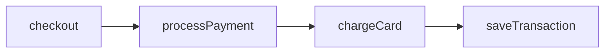
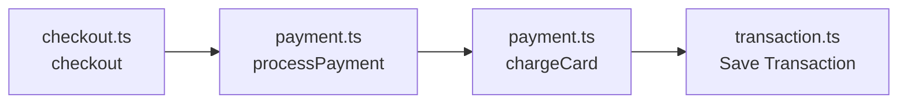
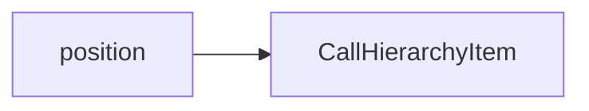
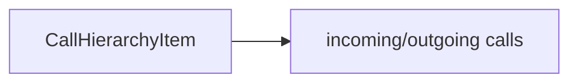
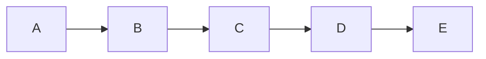
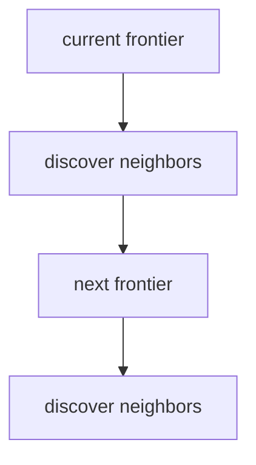
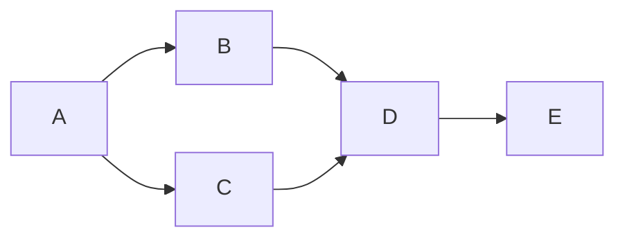
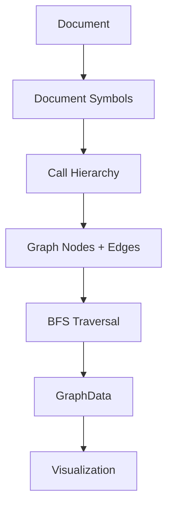

# {{ $frontmatter.title }} 관련

```component VPCard
{
  "title": "TypeScript > Article(s)",
  "desc": "Article(s)",
  "link": "/programming/ts/articles/README.md",
  "logo": "/images/ico-wind.svg",
  "background": "rgba(10,10,10,0.2)"
}
```

[[toc]]

---

<SiteInfo
  name="How to Build a Code Graph in TypeScript Using VS Code's Language APIs"
  desc="Modern codebases are becoming increasingly difficult to navigate. This isn't necessarily because developers are writing more code themselves. It's mostly because coding assistants are generating hundr"
  url="https://freecodecamp.org/news/how-to-build-a-code-graph-in-typescript-using-vs-code-language-apis"
  logo="https://cdn.freecodecamp.org/universal/favicons/favicon.ico"
  preview="https://cdn.hashnode.com/uploads/covers/5e1e335a7a1d3fcc59028c64/2101c28a-d568-4841-95e6-ab066d2cf27f.png"/>

Modern codebases are becoming increasingly difficult to navigate. This isn't necessarily because developers are writing more code themselves. It's mostly because coding assistants are generating hundreds or even thousands of lines of code, and the problem has become code review.

In the pre-LLM era, you might spend days writing a few lines of code. This meant your context on any project grew incrementally with your contribution. You only had to review and get acquainted with new code if you joined a new team or got into a new job.

But today, one prompt can generate thousands of lines of code across 100s of files in minutes. At that scale, the traditional format of reviewing code begins to collapse, and you spend more time reviewing code than actually writing it.

For instance, if you open a large TypeScript project and want to answer a seemingly simple question such as:

> "What calls this function?"

you'll probably start by searching through files. You might use your editor's "Find References" feature. You might jump between definitions. You might search for imports, exports, and function names.

But there's another way to think about the problem. Instead of treating a codebase as a collection of files, we can model it as a graph.

Functions become nodes and calls become edges.



<!--  -->

Once code is represented as a graph, questions such as "what calls this function?" or "what does this function eventually call?" become graph traversal problems.

In this tutorial, we'll build the core of a code graph using TypeScript and VS Code's built-in language APIs. We won't write our own TypeScript parser. Instead, we'll use the semantic information VS Code and the installed language extension already provide. The result will be a graph containing files, functions, methods, and call relationships that can be displayed in a VS Code Webview.

::: info What We're Building

We’ll build a small code-graph engine that uses VS Code’s Call Hierarchy API to discover relationships between functions and methods, then traverses those relationships across multiple hops. Along the way, we’ll handle concurrency, stale language-tooling references, caching, and duplicate traversal so the graph remains reliable and efficient.

:::

::: note Prerequisites

Before following along, you should be comfortable with:

- TypeScript and basic asynchronous programming with `async`/`await`
- Any VS Code compartible code, VS Code extension APIs, and `vscode.commands.executeCommand`
- Basic graph concepts such as nodes, edges, and Breadth-First Search (BFS)
- Working with maps, arrays, and generic functions in TypeScript

:::

Let's go!

Suppose we have the following code:

```ts
function checkout() {
  processPayment();
}

function processPayment() {
  chargeCard();
}

function chargeCard() {
  saveTransaction();
}

function saveTransaction() {
  // persist transaction
}
```

We want to transform the source code into a graph. For a real codebase, the graph may span multiple files:



<!--  -->

The implementation has two main parts. The extension host uses VS Code's language APIs to discover the graph. The Webview displays the resulting graph. The interesting part of this architecture is the graph builder.

---

## 1. Understanding the VS Code Language APIs

VS Code already exposes several commands that extensions can use to query language intelligence. For this project, four are particularly useful:

| Command | Purpose |
| --- | --- |
| `vscode.executeDocumentSymbolProvider` | Find symbols in a document |
| `vscode.prepareCallHierarchy` | Resolve a position to a call hierarchy item |
| `vscode.provideIncomingCalls` | Find callers |
| `vscode.provideOutgoingCalls` | Find callees |

These APIs sit above the language-specific implementation. For TypeScript and JavaScript, the TypeScript language service provides the underlying information. Other languages expose similar capabilities through their own language extensions and language servers, such as gopls for Go, rust-analyser for Rust, and Pyright or Pylance for Python.

This is particularly important because we don't need to build a separate parser and call graph engine for every language. If a language extension provides document symbols and call hierarchy support through VS Code, the same graph-building architecture can consume that information directly.

An AST can tell you that a function contains a call expression. It doesn't automatically tell you which function that call refers to across imports, files, modules, classes, aliases, and other language constructs.

The language server already performs much of that semantic work. So instead of building another parser and symbol resolver, we can ask VS Code for the information it already knows.

---

## 2. Setting Up the Extension

Our <VPIcon icon="iconfont icon-json"/>`package.json` declares a command:

```json title="package.json"
{
  "main": "./out/extension.js",
  "engines": {
    "vscode": "^1.85.0"
  },
  "activationEvents": [],
  "contributes": {
    "commands": [
      {
        "command": "codeGraphView.open",
        "title": "Code Graph: Open Graph for Active File",
        "icon": "$(type-hierarchy)"
      }
    ],
    "menus": {
      "editor/title": [
        {
          "command": "codeGraphView.open",
          "group": "navigation",
          "when": "resourceLangId == typescript"
        }
      ]
    }
  },
  "dependencies": {
    "elkjs": "^0.9.3"
  }
}
```

The extension host and Webview run in different environments, so they're bundled separately. A simplified esbuild configuration would look like this:

```js
const extensionConfig = {
  entryPoints: ['src/extension.ts'],
  bundle: true,
  outfile: 'out/extension.js',
  external: ['vscode'],
  format: 'cjs',
  platform: 'node',
};

const webviewConfig = {
  entryPoints: ['webview/main.ts'],
  bundle: true,
  outfile: 'out/webview/main.js',
  format: 'iife',
  platform: 'browser',
};
```

The extension code runs in Node, while the Webview code runs in a browser environment.

---

## 3. Designing the Graph Data Model

Before calling the language APIs, we need to decide what our graph looks like. A useful model is:

```ts
export interface SymbolRow {
  id: string;
  name: string;
  kind: 'function' | 'method';
  line: number;
  character: number;
}

export interface FileNode {
  id: string;
  label: string;
  file: string;
  symbols: SymbolRow[];
}

export interface CallEdge {
  id: string;
  source: string;
  target: string;
}

export interface GraphData {
  rootFileId: string;
  rootSymbolId?: string;
  roots: string[];
  files: FileNode[];
  edges: CallEdge[];
  truncated: boolean;
}
```

There are two important concepts.

1. A `FileNode` contains the functions or methods belonging to a file.
2. A `CallEdge` represents a relationship between two symbols.

We keep the edge direction consistent:

```text
caller → callee
```

So if `checkout()` calls `processPayment()`, the graph always contains:

```text
checkout → processPayment
```

even if we discovered that relationship while asking for incoming calls.

### Stable Symbol IDs

Function names aren't unique. A project can easily contain:

```ts title="users.ts"
function save() {}
```

and:

```ts title="payments.ts"
function save() {}
```

We therefore need an identifier based on the symbol's location.

```ts
function idOf(
  uri: vscode.Uri,
  pos: vscode.Position
): string {
  return `${uri.toString()}#${pos.line}:${pos.character}`;
}
```

For call hierarchy items, we use their `selectionRange`:

```ts
function itemId(
  item: vscode.CallHierarchyItem
): string {
  return idOf(
    item.uri,
    item.selectionRange.start
  );
}
```

Using `selectionRange` is useful because it identifies the symbol's name rather than the entire body or declaration range. This stable ID becomes the foundation for deduplication. If the same function is discovered from several paths through the graph, we can recognise that all discoveries refer to the same node.

---

## 4. Finding Functions and Methods

The first step in building the graph is discovering the symbols in the active file. VS Code exposes document symbols through:

```text
vscode.executeDocumentSymbolProvider
```

We can call it like this:

```ts
/*
 * Get all symbols in a document using VS Code's
 * built-in language service instead of parsing the code ourselves. This was we can get the methods, functions, variables within a document
 */
async function getDocumentSymbols(
  uri: vscode.Uri
): Promise<vscode.DocumentSymbol[]> {

  /*
   * `vscode.executeDocumentSymbolProvider` delegates the analysis
   * to the language provider registered for the document's language.
   */

  const result =
    await vscode.commands.executeCommand<
      vscode.DocumentSymbol[] | undefined
    >(
      'vscode.executeDocumentSymbolProvider',
      uri
    );

  // Return an empty list if no symbols are found.
  return result ?? [];
}
```

The returned symbols form a hierarchy. For example:


We need to walk that hierarchy and collect symbols that could represent callable code.

```ts
// Check whether a symbol can be treated as a callable node.
const isCallableKind = (
  kind: vscode.SymbolKind,
  includeConstructors: boolean
) =>
  kind === vscode.SymbolKind.Function ||
  kind === vscode.SymbolKind.Method ||
  (
    includeConstructors &&
    kind === vscode.SymbolKind.Constructor
  );
```

We can recursively inspect the symbol tree:

```ts
// Recursively collect functions, methods, and variables from a symbol tree
function collectCandidates(
  symbols: vscode.DocumentSymbol[],
  isCallable: (
    kind: vscode.SymbolKind
  ) => boolean,
  out: vscode.DocumentSymbol[] = []
) {
  for (const symbol of symbols) {
    if (
      isCallable(symbol.kind) ||
      symbol.kind === vscode.SymbolKind.Variable
    ) {
      out.push(symbol);
    } else if (
      symbol.children.length
    ) {
      collectCandidates(
        symbol.children,
        isCallable,
        out
      );
    }
  }
  return out;
}
```

Variables are worth considering because functions assigned to variables can be reported differently by language tooling. For example:

```ts
const handler = () => {
  // ...
};
```

The symbol may be reported as a variable even though it participates in the call hierarchy.

---

## 5. Finding the Symbol at a Position

When the user opens the graph for a particular method, we need to determine which symbol contains the cursor position. Because document symbols are hierarchical, we can recursively find the deepest symbol containing the position.

```ts
// Find the most specific symbol containing a given position.
function symbolAt(
  symbols: vscode.DocumentSymbol[],
  position: vscode.Position
) {
  for (const symbol of symbols) {
    if (symbol.range.contains(position)) {
      return (
        symbolAt(
          symbol.children,
          position
        ) ?? symbol
      );
    }
  }
  return undefined;
}
```

This gives us the bridge between the editor and the graph. The user selects a location in the source file. We resolve that location to a symbol. Then we resolve that symbol into a call hierarchy item.

---

## 6. Resolving the Call Hierarchy

The call hierarchy API works in two stages. First:



Then:



We can prepare the item like this:

```ts
async function prepare(
  uri: vscode.Uri,
  position: vscode.Position
) {
  // VS Code's language tooling already knows how to resolve
  // symbols in a source file.
  // So we can use it to prepare a call hierarchy for the symbol at this location.
  const items =
    await vscode.commands.executeCommand<
      vscode.CallHierarchyItem[] | undefined
    >(
      'vscode.prepareCallHierarchy',
      uri,
      position
    );

  // The command returns an array of hierarchy items. In our case,
  // we are interested in the symbol directly under the cursor,
  // so we use the first result.
  // Optional chaining also handles the case where no symbol
  // could be resolved at the given position.
  return items?.[0];
}
```

Once we have the item, we can ask for callers:

```ts
async function callers(
  item: vscode.CallHierarchyItem
) {
  // Ask VS Code for all symbols that call this item.
  const calls =
    await vscode.commands.executeCommand<
      vscode.CallHierarchyIncomingCall[] | undefined
    >(
      'vscode.provideIncomingCalls',
      item
    );

  // Return the calling symbols, defaulting to an empty list when none are found.
  return (
    calls ?? []
  ).map(call => call.from);
}
```

Or callees:

```ts
async function callees(
  item: vscode.CallHierarchyItem
) {
  // Ask VS Code for all symbols called by this item.
  const calls =
    await vscode.commands.executeCommand<
      vscode.CallHierarchyOutgoingCall[] | undefined
    >(
      'vscode.provideOutgoingCalls',
      item
    );

  // Return the called symbols, defaulting to an empty list when none are found.
  return (
    calls ?? []
  ).map(call => call.to);
}
```

If we have:


and we ask for incoming calls to `processPayment`, the language API gives us:

```text
checkout
retryPayment
```

We then normalise those results into:

```text
checkout → processPayment
retryPayment → processPayment
```

The same graph structure can therefore represent both incoming and outgoing traversal.

---

## 7. Building a Symbol Registry

As we crawl the graph, the same symbol can appear repeatedly. Consider:


We should create one node for `C`, not three. A registry provides that deduplication layer.

```ts :collapsed-lines
class Registry {
  // Keep files and their symbols separately so they can be reused across the graph.
  private readonly files =
    new Map<string, FileNode>();

  // Store symbols by ID for fast lookup and duplicate detection.
  private readonly rows =
    new Map<string, SymbolRow>();

  get size() {
    return this.rows.size;
  }

  has(id: string) {
    return this.rows.has(id);
  }

  register(
    uri: vscode.Uri,
    name: string,
    kind: vscode.SymbolKind,
    position: vscode.Position
  ): string {
    // Generate a stable ID from the file and symbol position.
    const id =
      idOf(uri, position);

    // Avoid registering the same symbol more than once.
    if (this.rows.has(id)) {
      return id;
    }

    const fileId =
      uri.toString();

    let file =
      this.files.get(fileId);

    // Create the file entry the first time we encounter it.
    if (!file) {
      file = {
        id: fileId,
        label:
          vscode.workspace
            .asRelativePath(uri),
        file: uri.fsPath,
        symbols: [],
      };

      this.files.set(
        fileId,
        file
      );
    }

    // Normalize VS Code's symbol kind into the graph's simpler representation.
    const row: SymbolRow = {
      id,
      name,
      kind:
        kind ===
        vscode.SymbolKind.Method
          ? 'method'
          : 'function',
      line: position.line,
      character:
        position.character,
    };

    // Store the symbol globally and under its containing file.
    this.rows.set(id, row);
    file.symbols.push(row);

    return id;
  }
}
```

Now the graph builder can repeatedly register symbols without worrying about duplicates.

---

## 8. Traversing the Graph with BFS

A single call hierarchy lookup gives us one hop. A useful code graph needs multiple hops. A lookup from `A()` might tell us that it calls `B()`, but it tells us nothing about what `B()` calls next.

To build a useful graph, we repeatedly follow these relationships: `A → B → C → D`. Each lookup expands the graph by another level, which is why we need a traversal strategy such as BFS to explore multiple hops in an efficient way.

For example:

Assuming a graph with 4 hops



If we start from `A` and request a depth of three (3 hops), we want:

```text
Depth 0: A
Depth 1: B
Depth 2: C
Depth 3: D
```

Breadth-first search (BFS) is a natural fit because the graph is explicitly organised around hop depth. The traversal maintains a frontier:



A basic implementation looks like this:

```ts :collapsed-lines
const walk = async (
  start: Handle,
  direction: 'incoming' | 'outgoing',
  limit: number
) => {
  // Traverse the call graph one level at a time, starting from the given symbol.
  let frontier: Handle[] = [start];

  for (
    let depth = 0;
    depth < limit &&
    frontier.length > 0;
    depth++
  ) {
    // Resolve the next level in parallel, limiting concurrency to six lookups.
    const results =
      await mapLimit(
        frontier,
        6,
        handle =>
          oneHop(
            handle,
            direction
          )
      );

    const next: Handle[] = [];

    frontier.forEach(
      (handle, index) => {
        for (
          const other
            of results[index]
        ) {
          // Register newly discovered symbols before adding their relationships.
          if (
            !registry.has(
              other.node.id
            )
          ) {
            registry.register(
              other.node.uri,
              other.node.name,
              other.node.kind,
              other.node.pos
            );
          }

          // Preserve the direction of the call relationship in the graph.
          if (
            direction === 'outgoing'
          ) {
            addEdge(
              handle.node.id,
              other.node.id
            );
          } else {
            addEdge(
              other.node.id,
              handle.node.id
            );
          }

          next.push(other);
        }
      }
    );

    // Continue the traversal from the symbols discovered at this depth.
    frontier = next;
  }
};
```

The `mapLimit` helper keeps the number of concurrent language-server requests under control:

```ts :collapsed-lines
async function mapLimit<T, R>(
  items: T[],
  limit: number,
  fn: (item: T) => Promise<R>
): Promise<R[]> {
  // Run at most `limit` async operations at the same time.
  const results =
    new Array<R>(items.length);

  let next = 0;

  // Create workers that share the next available item.
  const workers =
    Array.from(
      {
        length:
          Math.min(
            limit,
            items.length
          ),
      },
      async () => {
        while (
          next < items.length
        ) {
          const index = next++;

          results[index] =
            await fn(
              items[index]
            );
        }
      }
    );
  await Promise.all(workers);
  return results;
}
```

The key distinction is that BFS is just local computation, while resolving a symbol often requires asking VS Code's language tooling to do real work.

For each symbol we visit, Code Graph View may need to query the language service for its incoming or outgoing calls. Those lookups can involve parsing source files, resolving symbols, and communicating with the language server. As the graph grows, the number of these requests grows with it.

So even though the traversal itself is simple, doing those lookups sequentially can make the whole process much slower. `mapLimit` addresses this by allowing several independent language-tooling requests to run concurrently, while still putting a cap on concurrency so that we don't overwhelm the language service.

---

## 9. Handling Cycles

Real code isn't a tree. It's a graph. That means cycles are normal.

For example:


A naïve recursive traversal could continue indefinitely. We therefore need to track what we've already explored. But there's a subtle detail. A simple:

```ts
Set<string>
```

isn't always enough if the same node can be reached at different depths. Instead, we can store how much traversal depth remains when we explore a node.

```ts
const explored =
  new Map<string, number>();
```

Then:

```ts
// Track the deepest remaining traversal already performed for this node.
const key =
  `${direction}:${node.id}`;
if (
  (explored.get(key) ?? -1)
  < remainingDepth
) {
  // Revisit only when this traversal can explore deeper than before.
  explored.set(
    key,
    remainingDepth
  );
  next.push(node);
}
```

This means that if we previously reached a node with one hop remaining, but later discover it with three hops remaining, we're allowed to explore it again. That's more precise than treating the node as "visited".

---

## 10. Bounding the Graph

A graph can grow extremely quickly. A highly connected function might have dozens of callers. Those callers may each have dozens of callers of their own. For that reason, the graph builder should have explicit limits.

For example:

```ts
const MAX_SYMBOLS = 400;
const MAX_CALLS_PER_SYMBOL = 50;
const HOP_CONCURRENCY = 6;
```

If the graph reaches a limit, we don't want to pretend that the graph is complete. Instead:

```ts
let truncated = false;
```

and:

```ts
if (
  registry.size >=
  MAX_SYMBOLS
) {
  truncated = true;
  continue;
}
```

The resulting `GraphData` can then tell the UI:

```text
This graph was truncated.
```

This is better than allowing an unexpectedly large codebase to make the extension appear frozen.

---

## 11. Filtering Files

The language server may return relationships into files that aren't part of the application we're exploring. These could be build files or outputs that are created by dependency installations or language-specific build/runtime actions. For example, a TypeScript project can lead into:

```text
node_modules
```

A Python project might lead into:

```text
site-packages
```

We can filter those paths before adding them to the graph.

```ts
const DEPENDENCY_DIRS =
  /\/(node_modules|vendor|target|.venv|venv|site-packages|__pycache__|build|obj|.dart_tool)\//;

function isWorkspaceFile(
  uri: vscode.Uri
): boolean {
  if (
    uri.scheme !== 'file' ||
    DEPENDENCY_DIRS.test(uri.path)
  ) {
    return false;
  }
  return !!vscode.workspace
    .getWorkspaceFolder(uri);
}
```

This keeps the graph focused on the user's workspace. It also demonstrates an important distinction between language intelligence and application behaviour. The language server tells us what it can resolve. Our graph builder decides what should become part of the graph.

---

## 12. Why Some Edges Silently Disappear

On a large graph, some functions that clearly call each other can end up with no connection, and nothing reports an error. The problem is that a `CallHierarchyItem` is tied to language-service state. If that state becomes stale, asking for its callers or callees can return an empty array. From the graph builder's perspective, that looks exactly like a function with no callers.

In the VS Code implementation, call hierarchy sessions are kept for a limited number of recent requests. Our crawler can also have several lookups in flight at once, so older items can become unusable while the graph is being traversed. The graph builder deals with this in three ways.

### 1. It stores plain data, not live items.

Each function is represented by a `NodeRef` containing its ID, URI, name, kind, and position. One-hop results are also cached as `NodeRef`s. This gives us enough information to recreate a call hierarchy item when necessary.

```ts
interface NodeRef {
  id: string;
  uri: vscode.Uri;
  name: string;
  kind: vscode.SymbolKind;
  pos: vscode.Position;
}
```

### 2. It tracks the age of each prepared item.

A global `epoch` counter increases whenever a new call hierarchy item is prepared. Each handle records the epoch at which its item was created. If an item becomes sufficiently old, the crawler prepares a fresh one from the stored `NodeRef`.

### 3. It retries suspicious empty results.

A trimmed version of `oneHop` looks like this:

```ts :collapsed-lines
const SESSION_WINDOW = 7;

// Refresh stale language-tooling references and retry once if necessary.
for (let attempt = 0; attempt < 2; attempt++) {
  const stale =
    !current.item ||
    epoch - current.epoch > SESSION_WINDOW;

  if (stale) {
    // Re-resolve the symbol before using an expired CallHierarchyItem.
    const fresh = await prepareFresh(
      current.node.uri,
      current.node.pos
    );

    if (!fresh) {
      return [];
    }

    current = fresh;
  }

  const items =
    await lookup(
      current.item!,
      direction
    );

  // A stale reference may return nothing, so invalidate it and retry once.
  if (
    items.length === 0 &&
    attempt === 0 &&
    epoch - current.epoch > SESSION_WINDOW
  ) {
    current = {
      node: current.node,
      epoch: -1,
    };

    continue;
  }

  // Cache the resolved relationships to avoid repeating the language-tooling lookup.
  hopCache.set(key, {
    nodes: items.map(refOf),
    at: Date.now(),
  });

  return items.map(child => ({
    node: refOf(child),
    item: child,
    epoch: current.epoch,
  }));
}
```

Here, `lookup` is shorthand for the `vscode.provideIncomingCalls` or `vscode.provideOutgoingCalls` command discussed earlier. The exact session limit is an implementation detail of VS Code rather than something the extension should depend on. The crawler therefore doesn't assume that a particular limit will always exist. The `SESSION_WINDOW` simply gives us a conservative threshold for refreshing old handles.

This reduces lost edges, but it can't guarantee a complete graph. Language tooling can still return incomplete information or fail to resolve certain relationships.

The broader lesson applies to language-service APIs beyond call hierarchy: store what you need to recreate an object from a language service, not the object itself. Treat an empty result from stale state as potentially unknown, not automatically as none.

---

## 13. Connecting the Graph to a Webview

Once the graph has been constructed, the extension needs somewhere to display it. VS Code Webviews are a natural fit.

The extension host creates the panel:

```ts
const panel =
  vscode.window.createWebviewPanel(
    'codeGraphView',
    'Code Graph',
    vscode.ViewColumn.Beside,
    {
      enableScripts: true,
      retainContextWhenHidden: true,
    }
  );
```

The graph is sent to the Webview as serializable data:

```ts
panel.webview.postMessage({
  command: 'graphData',
  data: graphData,
});
```

The Webview can then receive it:

```ts
window.addEventListener(
  'message',
  event => {
    const message =
      event.data;

    if (
      message.command !==
      'graphData'
    ) {
      return;
    }

    renderGraph(
      message.data
    );
  }
);
```

At this point, the language-server side of the problem is complete.

We have transformed:

```text
source code
```

into:

```text
symbols + relationships
```

and then into:

```text
GraphData
```

The visualisation layer can now use that data to render the graph.

A library such as ELK can be used to calculate positions for the graph without affecting the graph-building logic.

---

## 14. Testing the Graph Builder

Testing this kind of extension can be difficult if every test requires a running VS Code instance and a real language server. A better approach is to isolate the graph-building logic from VS Code itself. The crawler only really needs a few operations:

```text
prepareCallHierarchy
provideIncomingCalls
provideOutgoingCalls
```

We can create a fake implementation of those commands. For example:

```ts :collapsed-lines
const sessions = new Map();

let sessionCounter = 0;

async function executeCommand(
  command,
  ...args
) {
  // Simulate VS Code creating a session when resolving a symbol.
  if (
    command ===
    'vscode.prepareCallHierarchy'
  ) {
    const id =
      'session-' +
      ++sessionCounter;

    sessions.set(id, true);

    return [
      createFakeItem(
        args,
        id
      ),
    ];
  }

  // Simulate call lookups that depend on a still-valid session.
  if (
    command ===
      'vscode.provideIncomingCalls' ||
    command ===
      'vscode.provideOutgoingCalls'
  ) {
    const item = args[0];

    // Return nothing when the CallHierarchyItem belongs to an expired session.
    if (
      !sessions.has(
        item.sessionId
      )
    ) {
      return [];
    }

    return getFakeCalls(
      item
    );
  }
}
```

The mock can model edge cases such as expired call hierarchy state. Importantly, if the fake uses a particular session limit, that should be understood as a **test model**, not automatically as an official VS Code API guarantee.

We can then generate a deterministic graph and compare the crawler's output against a simple reference BFS.

For example:



The reference implementation knows the expected edges. The production crawler runs against the fake language service. If the two results differ, the test fails. This approach lets us test the difficult graph logic without depending entirely on the editor runtime.

---

## 15. The Limitations of a Code Graph

A language-server-based call graph is useful, but it's not a complete representation of program execution. Some relationships can be difficult or impossible for static call hierarchy analysis to resolve.

Examples include:

- dynamic dispatch
- reflection
- dependency injection
- event emitters
- callbacks
- runtime-generated code
- framework-specific behavior

Consider:

```ts
eventEmitter.on(
  'payment.completed',
  handlePayment
);
```

A developer may understand that this creates a runtime relationship between the event and `handlePayment`. A static call graph may not represent that relationship as a normal function call. The quality of the graph therefore depends partly on the language server and the kinds of relationships it can resolve.

This is why the graph should be understood as a semantic approximation, not as a perfect runtime model. There's also a language-specific dimension.

The graph builder itself can remain largely language-agnostic, but different language extensions may provide different levels of support for document symbols and call hierarchy.

---

## Conclusion

Building a code graph doesn't require writing a compiler or implementing a parser from scratch. VS Code already exposes a significant amount of semantic information through its language APIs.

The core process is:



The most important engineering decisions aren't about drawing the graph. They're about choosing a useful graph model, creating stable symbol identities, correctly interpreting incoming and outgoing calls, controlling traversal depth and concurrency, handling cycles, and treating language-server state as something that can change.

Once those pieces are in place, the visualisation becomes a separate problem. That separation is what makes the architecture useful beyond a single VS Code extension.

The same graph model can eventually power dependency exploration, change-impact analysis, architecture views, AI context selection, and other ways of navigating increasingly complex codebases.

::: info

I built a working version based on this, accessible at: [<VPIcon icon="iconfont icon-github"/>`otobongfp/code-graph-view`](https://github.com/otobongfp/code-graph-view).

:::

I'll be looking forward to seeing all the cool things you can make out of graphs to contribute to the software engineering process.

<!-- TODO: add ARTICLE CARD -->
```component VPCard
{
  "title": "How to Build a Code Graph in TypeScript Using VS Code's Language APIs",
  "desc": "Modern codebases are becoming increasingly difficult to navigate. This isn't necessarily because developers are writing more code themselves. It's mostly because coding assistants are generating hundr",
  "link": "https://chanhi2000.github.io/bookshelf/freecodecamp.org/how-to-build-a-code-graph-in-typescript-using-vs-code-language-apis.html",
  "logo": "https://cdn.freecodecamp.org/universal/favicons/favicon.ico",
  "background": "rgba(10,10,35,0.2)"
}
```
