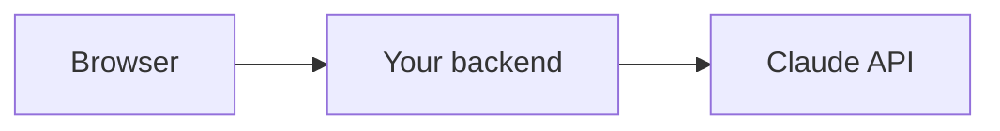
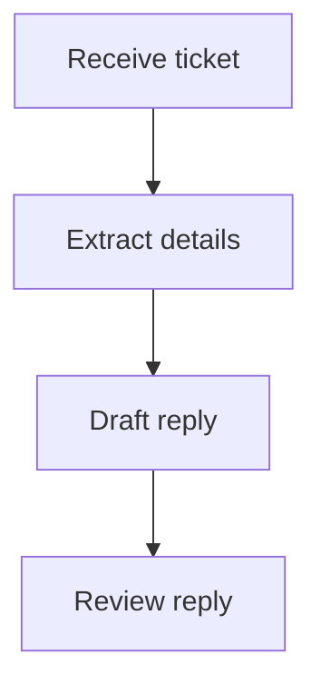

# {{ $frontmatter.title }} 관련

```component VPCard
{
  "title": "Python > Article(s)",
  "desc": "Article(s)",
  "link": "/programmging/py/articles/README.md",
  "logo": "/images/ico-wind.svg",
  "background": "rgba(10,10,10,0.2)"
}
```

```component VPCard
{
  "title": "Claude > Article(s)",
  "desc": "Article(s)",
  "link": "/ai/claude/articles/README.md",
  "logo": "/images/ico-wind.svg",
  "background": "rgba(10,10,10,0.2)"
}
```

[[toc]]

---

<SiteInfo
  name="How to Build a Reliable AI Assistant with the Claude API"
  desc="Large language models can answer questions, summarise documents, write code, and interact with external systems. But building a reliable AI application requires more than sending a prompt and displayi"
  url="https://freecodecamp.org/news/how-to-build-a-reliable-ai-assistant-with-the-claude-api"
  logo="https://cdn.freecodecamp.org/universal/favicons/favicon.ico"
  preview="https://cdn.hashnode.com/uploads/covers/5e1e335a7a1d3fcc59028c64/c4c96758-54f5-4b88-9f00-639ecff705f9.png"/>

Large language models can answer questions, summarise documents, write code, and interact with external systems. But building a reliable AI application requires more than sending a prompt and displaying the response.

A production-ready application must manage conversation history, provide relevant context, use tools safely, handle different response types, and evaluate whether the generated output is useful.

In this tutorial, we’ll build **ShopHelper**, a customer-support assistant for an imaginary online shop. By the end, ShopHelper will be able to:

- Answer general questions in a consistent tone
- Remember what a customer said earlier
- Look up order statuses by calling a function in your code
- Handle Claude’s multi-block responses safely
- Process support tickets using workflows
- Evaluate whether prompt changes improve results

Each section adds one piece, so you can follow along in your own editor.

::: note Prerequisites

You should have:

- Basic Python knowledge
- Python 3.9 or later
- An Anthropic API key
- Familiarity with functions and JSON

:::

---

## How to Set Up the Project and Keep Your API Key Secure

Create a virtual environment and install the Anthropic Python SDK:

```sh
python -m venv .venv
source .venv/bin/activate
pip install anthropic python-dotenv
```

On Windows:

```sh
.venv\Scripts\activate
```

Create a <VPIcon icon="iconfont icon-dotenv"/>`.env` file:

```sh title=".env"
ANTHROPIC_API_KEY=your_api_key_here
```

An API key is a secret credential. Never place it in browser JavaScript, mobile-app code, or client-side configuration. Never commit it to a repository:

```sh
echo ".env" >> .gitignore
```

If you add a web interface later, keep the key on your backend:



Create <VPIcon icon="fa-brands fa-python"/>`app.py`:

```py title="app.py"
import os

from anthropic import Anthropic
from dotenv import load_dotenv

load_dotenv()

MODEL = "claude-sonnet-5"

client = Anthropic(
    api_key=os.environ["ANTHROPIC_API_KEY"]
)
```

`load_dotenv()` loads the value from <VPIcon icon="iconfont icon-dotenv"/>`.env`. The `MODEL` constant means you only need to change the model name in one place. Confirm that the model identifier is available to your account before running the example.

---

## How to Make Your First Request

```py title="app.py"
response = client.messages.create(
    model=MODEL,
    max_tokens=500,
    messages=[
        {
            "role": "user",
            "content": "Explain what an API is in simple terms."
        }
    ],
)

answer = "".join(
    block.text
    for block in response.content
    if block.type == "text"
)

print(answer)
```

A request contains three important parts:

- `model` selects the Claude model that handles the request. Models can differ in capability, speed, and cost.
- `max_tokens` limits the maximum amount of text Claude can generate. A smaller value can reduce latency, but Claude may stop before completing its answer.
- `messages` contains the conversation. Each message has a `role` and `content`. The role is usually `user` or `assistant`.

For example, a one-off request contains one user message. A multi-turn conversation contains earlier user and assistant messages.

Claude returns `response.content`, which is a list of typed content blocks. Common blocks include:

| Block type | Meaning |
| --- | --- |
| `text` | Generated text |
| `tool_use` | A request for your application to call a tool |
| `thinking` | Reasoning content when enabled |

The example collects text blocks instead of assuming `response.content[0]` is always text.

You can inspect usage information for monitoring:

```py
print(response.usage.input_tokens)
print(response.usage.output_tokens)
```

---

## How to Manage Conversation History

Claude doesn't automatically remember separate API requests. Send relevant history with every request:

```py
messages = [
    {
        "role": "user",
        "content": "What is your returns policy?"
    },
    {
        "role": "assistant",
        "content": "Items can be returned within 30 days."
    },
    {
        "role": "user",
        "content": "How long do I have?"
    },
]

response = client.messages.create(
    model=MODEL,
    max_tokens=300,
    messages=messages,
)
```

The assistant message records Claude’s earlier answer, allowing the final question to be interpreted in context.

A simple chat function can maintain the history:

```py :collapsed-lines
def chat(history, user_text):
    history.append({
        "role": "user",
        "content": user_text,
    })

    response = client.messages.create(
        model=MODEL,
        max_tokens=500,
        messages=history,
    )

    reply = "".join(
        block.text
        for block in response.content
        if block.type == "text"
    )

    history.append({
        "role": "assistant",
        "content": reply,
    })

    return reply


history = []

print(chat(history, "What is your returns policy?"))
print(chat(history, "How long do I have?"))
```

Each call adds the new user message, sends the complete history, and stores Claude’s response for the next turn. In production, store histories by customer or session ID.

### How to Manage History as it Grows

Unlimited history increases input size and may make it harder for Claude to focus. One option is to retain only recent messages:

```py
def trim_history(history, max_messages=10):
    trimmed = history[-max_messages:]

    while trimmed and trimmed[0]["role"] != "user":
        trimmed.pop(0)

    return trimmed
```

Another option is to summarise older turns while keeping recent messages:

```py :collapsed-lines
def summarise_history(history, keep_last=6):
    old = history[:-keep_last]
    recent = history[-keep_last:]

    transcript = "\n".join(
        f"{message['role']}: {message['content']}"
        for message in old
    )

    response = client.messages.create(
        model=MODEL,
        max_tokens=250,
        messages=[{
            "role": "user",
            "content": (
                "Summarise this conversation in under 100 words. "
                "Keep order numbers and unresolved issues.\n\n"
                f"<conversation>{transcript}</conversation>"
            ),
        }],
    )

    summary = "".join(
        block.text
        for block in response.content
        if block.type == "text"
    )

    return summary, recent
```

Keep the summary as separate application state and include it as context in the next request. Don't insert it as an additional user message before `recent`, because that can create invalid consecutive user messages.

Sensitive information should also be redacted before storage or transmission:

```py
import re

def redact(text):
    return re.sub(
        r"\b(?:\d[ -]?){13,16}\b",
        "[REDACTED CARD]",
        text,
    )
```

---

## How to Structure Prompts with Clear Boundaries

XML-style tags are ordinary text, not special API commands. They make each part of a prompt explicit:

```py
prompt = """
<customer_reviews>
The product is comfortable, but the available colours are limited.
Customers also describe it as durable.
</customer_reviews>

<sales_data>
January: 120 units
February: 150 units
March: 98 units
</sales_data>

<task>
Compare the reviews with the sales data.
Identify possible relationships and state uncertainty.
</task>
"""
```

Here, `<customer_reviews>` identifies reference material, `<sales_data>` identifies the data, and `<task>` identifies the instruction. Use similar boundaries for policies, user-generated content, examples, and output requirements.

---

## How to Use a System Prompt

A system prompt defines ShopHelper’s general behaviour:

```py
system_prompt = """
You are ShopHelper, a friendly customer-support assistant.

Keep answers concise and clear.
Do not invent prices, policies, or order details.
If information is missing, ask for it.
"""
```

Pass it separately from the conversation:

```py
response = client.messages.create(
    model=MODEL,
    max_tokens=500,
    system=system_prompt,
    messages=[
        {"role": "user", "content": "Where is my order?"}
    ],
)
```

Because the customer didn't provide an order number, ShopHelper should ask for one instead of guessing.

---

## How to Add Tools

Claude can't directly access your database. A tool gives it a structured way to request information from your application:

```py
def get_order_status(order_id):
    orders = {
        "ORD-1001": "shipped",
        "ORD-1002": "processing",
    }

    return {
        "order_id": order_id,
        "status": orders.get(order_id, "not_found"),
    }
```

The function accepts an order ID, looks it up, and returns predictable data. In production, the dictionary would be replaced by a database query. Claude doesn't execute the function. Your application does.

Describe the function with a schema:

```py
tools = [{
    "name": "get_order_status",
    "description": "Get the current status of a customer order.",
    "input_schema": {
        "type": "object",
        "properties": {
            "order_id": {
                "type": "string",
                "description": "An order ID such as ORD-1001."
            }
        },
        "required": ["order_id"],
    },
}]
```

Claude may return a `tool_use` block instead of a final answer:

```text
type="tool_use"
id="toolu_example"
name="get_order_status"
input={"order_id": "ORD-1001"}
```

The `name` identifies the function, `input` contains its arguments, and `id` is needed when returning the result. A `stop_reason` of `"tool_use"` means your application should handle the request before asking Claude to continue.

---

## How to Handle a Tool-Use Response

A tool-use response is a response containing the `tool_use` block described above.

Validate the tool name, arguments, and user permissions before execution:

```py :collapsed-lines
import re

ORDER_ID_PATTERN = re.compile(r"^ORD-\d{4}$")

def validate_tool_request(name, tool_input, current_user):
    if name != "get_order_status":
        return False, "Unknown tool"

    order_id = tool_input.get("order_id")

    if not isinstance(order_id, str):
        return False, "order_id must be a string"

    if not ORDER_ID_PATTERN.fullmatch(order_id):
        return False, "Invalid order ID format"

    if order_id not in current_user["order_ids"]:
        return False, "The customer cannot access this order"

    return True, None
```

A complete loop can then validate and execute the request:

```py :collapsed-lines
def run_conversation(user_text, current_user):
    messages = [{"role": "user", "content": user_text}]

    while True:
        response = client.messages.create(
            model=MODEL,
            max_tokens=500,
            system=system_prompt,
            tools=tools,
            messages=messages,
        )

        if response.stop_reason != "tool_use":
            return "".join(
                block.text
                for block in response.content
                if block.type == "text"
            )

        messages.append({
            "role": "assistant",
            "content": response.content,
        })

        results = []

        for block in response.content:
            if block.type != "tool_use":
                continue

            valid, error = validate_tool_request(
                block.name,
                block.input,
                current_user,
            )

            if valid:
                result = get_order_status(block.input["order_id"])
                results.append({
                    "type": "tool_result",
                    "tool_use_id": block.id,
                    "content": str(result),
                })
            else:
                results.append({
                    "type": "tool_result",
                    "tool_use_id": block.id,
                    "content": error,
                    "is_error": True,
                })

        messages.append({
            "role": "user",
            "content": results,
        })
```

The `tool_use_id` connects the result to the original request. The application remains responsible for authorisation and execution.

---

## Claude Responses Can Contain Multiple Blocks

This assumption is fragile:

```py
answer = response.content[0].text
```

It assumes that the first block exists and is text. Instead, inspect each block:

```py
for block in response.content:
    if block.type == "text":
        print(block.text)
    elif block.type == "tool_use":
        print("Validate and execute:", block.name)
    elif block.type == "thinking":
        continue
    else:
        print("Unhandled block type:", block.type)
```

ShopHelper displays text, validates and executes approved tool requests, doesn't display internal thinking, and logs unknown block types.

---

## Workflows vs Agents

A workflow follows a predefined sequence:



```py :collapsed-lines
def ask(prompt, max_tokens=500):
    response = client.messages.create(
        model=MODEL,
        max_tokens=max_tokens,
        messages=[{"role": "user", "content": prompt}],
    )

    return "".join(
        block.text
        for block in response.content
        if block.type == "text"
    )


def handle_ticket_workflow(ticket):
    details = ask(
        f"<ticket>{ticket}</ticket>\n"
        "<task>Extract the problem and desired outcome.</task>"
    )

    draft = ask(
        f"<details>{details}</details>\n"
        "<task>Draft a concise support reply.</task>"
    )

    review = ask(
        f"<draft>{draft}</draft>\n"
        "<task>List unsupported promises, or say OK.</task>"
    )

    return draft, review
```

An agent is more flexible: Claude decides whether to use a tool and what to do next. Agents still require validation and a maximum step count. The `run_conversation()` function above can be reused inside an agent loop.

Use workflows when the steps are known and repeatability matters. Use agents when the next action depends on the current result.

---

## Chaining, Parallelisation, Routing, and Evaluator-Optimizer

**Chaining** passes each result to the next stage:

```py :collapsed-lines
def chained_reply(ticket, policy):
    draft = ask(
        f"<ticket>{ticket}</ticket>\n"
        "<task>Draft a support reply.</task>"
    )

    issues = ask(
        f"<policy>{policy}</policy>\n"
        f"<draft>{draft}</draft>\n"
        "<task>List unsupported claims.</task>"
    )

    return ask(
        f"<draft>{draft}</draft>\n"
        f"<issues>{issues}</issues>\n"
        "<task>Rewrite the final reply.</task>"
    )
```

**Parallelisation** runs independent tasks concurrently:

```py :collapsed-lines
from concurrent.futures import ThreadPoolExecutor

tickets = [
    "My headphones arrived broken.",
    "I was charged twice.",
    "How do I change my address?",
]

def summarise(ticket):
    return ask(
        f"<ticket>{ticket}</ticket>\n"
        "<task>Summarise in one sentence.</task>",
        max_tokens=100,
    )

with ThreadPoolExecutor(max_workers=3) as pool:
    summaries = list(pool.map(summarise, tickets))

digest = ask(
    "<summaries>\n"
    + "\n".join(summaries)
    + "\n</summaries>\n"
    "<task>Summarise today's support themes.</task>"
)
```

**Routing** classifies a request before selecting a specialised workflow:

```py
def route(ticket):
    label = ask(
        f"<ticket>{ticket}</ticket>\n"
        "<task>Return exactly refund, delivery, or general.</task>",
        max_tokens=10,
    ).strip().lower()

    return label if label in {"refund", "delivery", "general"} else "general"
```

**Evaluator-optimizer** generates, reviews, and revises an answer:

```py
def improve_reply(ticket, rounds=2):
    reply = ask(
        f"<ticket>{ticket}</ticket>\n"
        "<task>Write a support reply.</task>"
    )

    for _ in range(rounds):
        review = ask(
            f"<reply>{reply}</reply>\n"
            "<task>List accuracy or tone problems, or say PASS.</task>"
        )

        if review.strip().upper() == "PASS":
            break

        reply = ask(
            f"<reply>{reply}</reply>\n"
            f"<review>{review}</review>\n"
            "<task>Rewrite the reply.</task>"
        )

    return reply
```

Use chaining for dependent stages, parallelisation for independent work, routing for specialised paths, and evaluator-optimizer loops when additional quality justifies extra API calls.

---

## How to Evaluate Prompt Quality

Use representative test cases:

```py
test_cases = [
    {
        "ticket": "I want a refund for broken headphones.",
        "expected": "refund",
    },
    {
        "ticket": "Where is ORD-1002?",
        "expected": "delivery",
    },
    {
        "ticket": "Do you sell gift cards?",
        "expected": "general",
    },
]
```

These cases cover different request types. Run the same cases after changing the system prompt, examples, model, token limit, or routing instructions:

```py
def evaluate(route_fn, cases):
    passed = 0

    for case in cases:
        result = route_fn(case["ticket"])

        if result == case["expected"]:
            passed += 1
        else:
            print("Failed:", case["ticket"], result)

    score = passed / len(cases)
    print(f"{passed}/{len(cases)} passed")
    return score
```

Use code-based graders for labels and JSON. Use human or model-based graders for tone, accuracy, and helpfulness.

---

## Conclusion

Building with the Claude API involves more than writing prompts. A reliable application needs structured context, managed conversation state, validated tool execution, deliberate response handling, suitable workflows, and repeatable evaluation.

The goal isn't to find one perfect prompt. It's to build a system around Claude that provides the right context, limits unsafe actions, handles uncertainty, and measures whether changes improve the result.

<!-- TODO: add ARTICLE CARD -->
```component VPCard
{
  "title": "How to Build a Reliable AI Assistant with the Claude API",
  "desc": "Large language models can answer questions, summarise documents, write code, and interact with external systems. But building a reliable AI application requires more than sending a prompt and displayi",
  "link": "https://chanhi2000.github.io/bookshelf/freecodecamp.org/how-to-build-a-reliable-ai-assistant-with-the-claude-api.html",
  "logo": "https://cdn.freecodecamp.org/universal/favicons/favicon.ico",
  "background": "rgba(10,10,35,0.2)"
}
```
