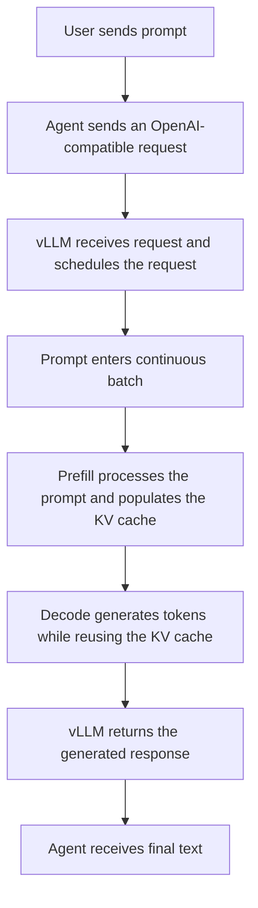

# {{ $frontmatter.title }} 관련

```component VPCard
{
  "title": "vLLM > Article(s)",
  "desc": "Article(s)",
  "link": "/programming/py-vllm/articles/README.md",
  "logo": "/images/ico-wind.svg",
  "background": "rgba(10,10,10,0.2)"
}
```

```component VPCard
{
  "title": "OpenAI > Article(s)",
  "desc": "Article(s)",
  "link": "/ai/openai/articles/README.md",
  "logo": "/images/ico-wind.svg",
  "background": "rgba(10,10,10,0.2)"
}
```

[[toc]]

---

<SiteInfo
  name="How to Scale LLM Inference for AI Agents Using vLLM"
  desc="In this tutorial, I’ll show you how to scale LLM inference for AI agents using vLLM. I'll help you build an intuition for how LLM inference works, explore why agent workloads create GPU scheduling and"
  url="https://freecodecamp.org/news/how-to-scale-llm-inference-for-ai-agents-using-vllm"
  logo="https://cdn.freecodecamp.org/universal/favicons/favicon.ico"
  preview="https://cdn.hashnode.com/uploads/covers/5e1e335a7a1d3fcc59028c64/21960832-2f24-4f74-b132-439c174d9cc8.png"/>

In this tutorial, I’ll show you how to scale LLM inference for AI agents using vLLM. I'll help you build an intuition for how LLM inference works, explore why agent workloads create GPU scheduling and memory pressure, and examine how vLLM is designed to improve throughput.

We’ll then run a local vLLM server and connect to it through its OpenAI-compatible API using an AI agent.

---

## Background

A simple AI agent usually works fine with one user, one request, and one model response. But production environments look very different.

Imagine hundreds of users sending prompts at the same time. And user requests can easily turn into 10 to 30 separate LLM calls for planning, tool selection, summarization, retries, and final response generation. Multiply that across dozens or hundreds of users, and the inference layer quickly becomes the bottleneck.

::: note Prerequisites

To follow this tutorial, you should be comfortable with basic Python and terminal commands. You should also have Python, a package manager such as `pip` or `uv`, and a code editor installed.

Some familiarity with LLM prompts and API clients will help, but no prior experience with AI Agents, vLLM or inference optimization is required. To learn more about AI Agents, you can read this [**article**](/freecodecamp.org/how-to-build-your-own-local-ai-agent-with-tool-calling-and-memory.md).

This tutorial uses vLLM-Metal so the example can run locally on Apple Silicon. This tutorial works on macOS, Windows, and Linux. I’m using a MacBook Pro with 32 GB of RAM without an external GPU, but the workflow can also run on more limited hardware by using a smaller pre-trained model.

:::

---

## What Is LLM Inference?

Inference is the process of using a trained model to generate output from an input. For a large language model, this means processing a prompt and predicting the output one token at a time.

Inference is different from training. During training, the model learns by adjusting its weights. During inference, those weights remain fixed, and the model uses what it has already learned to generate a response.

Although the model is no longer learning, inference can still be expensive. Larger models require more memory and computation, longer prompts take more work to process, and longer responses require more generation steps. When many users submit requests concurrently, the inference layer can quickly become a performance bottleneck.

---

## How LLM Inference Uses the CPU and GPU

A model-serving system has two broad responsibilities: coordinating requests and executing the model.

On the host side, the serving system accepts requests, tokenizes prompts, tracks request state, and decides which requests should be included in each execution step. On the accelerator side, usually a GPU, the model performs the tensor operations needed to process prompts and generate tokens.

LLM inference consists of two primary phases: **prefill** and **decode**.

During prefill, the model processes all the tokens in the input prompt. Because many prompt tokens can be processed in parallel, prefill tends to be compute-intensive. A long prompt containing conversation history, retrieved documents, or tool instructions can therefore increase the time before the first output token appears.

During decode, the model generates output one token at a time. Each new token depends on the tokens that came before it, making generation sequential across decoding steps. So a long response requires many separate model-execution steps.

In simple terms:

- Long inputs make prefill more expensive.
- Long outputs make decode more expensive.
- More concurrent requests increase both scheduling and memory pressure.

The GPU is limited by both compute capacity and memory. It must hold the model weights, temporary execution data, and the state associated with active requests.

One of the most important pieces of request state is the **KV cache**. During attention, the model creates key and value representations for previously processed tokens. Storing those representations allows the model to reuse them while generating subsequent tokens instead of recomputing the entire sequence during every decoding step.

KV caching makes autoregressive generation practical, but it also consumes memory. As prompts and generated responses grow, each active request requires more KV cache space. This means that available KV cache memory can directly affect how many requests the server can process concurrently.

---

## Why AI Agent Workloads Are Hard to Serve

AI agents amplify these inference challenges because one user request may trigger many model calls.

An agent might call the model to plan its next action, select a tool, interpret a tool result, summarize retrieved information, recover from an error, or decide whether more work is needed or generate the final response.

A single user interaction can become 10, 20, or even more inference requests. When dozens or hundreds of users are active, the number of model calls grows quickly.

Agent requests are also uneven. One request might contain a short question, while another includes a long system prompt, conversation history, retrieved documents, and several tool results. Their generated responses can also vary significantly in length.

This creates a dynamic workload in which requests arrive at different times, consume different amounts of memory, and finish at different times. Serving these requests efficiently requires more than simply loading a model onto a GPU. The serving layer must continuously schedule work, manage memory, and prevent short requests from being unnecessarily delayed by longer ones.

---

## How vLLM Serves Agent Workloads

[<VPIcon icon="fas fa-globe"/>vLLM](https://docs.vllm.ai/) is an open-source inference runtime and serving engine designed for large language models. It exposes an OpenAI-compatible API while managing model execution, request scheduling, batching, and KV cache memory.

Instead of loading the model directly inside the application and calling a method such as `model.generate()`, the application sends an HTTP request to the vLLM server. This separates the application or agent logic from the inference infrastructure underneath it.

When multiple requests are active, vLLM schedules them together instead of processing each request through an isolated model loop. This allows the serving layer to use the available accelerator more efficiently.

Several vLLM features are particularly relevant to agent workloads:

- **Continuous batching** updates the active batch as requests arrive and finish. When one request completes, another can take its place in a subsequent execution step without waiting for every request in the original batch to finish.
- **PagedAttention** manages KV cache memory in fixed-size blocks rather than requiring each request to occupy one large contiguous region. This reduces memory fragmentation and makes freed cache blocks easier to reuse.
- **Automatic prefix caching** allows requests with matching prompt prefixes to reuse existing KV cache blocks. This can be valuable when agent requests share the same system prompt, tool definitions, conversation history, or retrieved document.
- **OpenAI-compatible APIs** allow existing applications and agent frameworks to connect to vLLM with relatively small config changes.

Ordinary KV caching is a standard part of modern autoregressive inference. vLLM’s advantage comes from how it schedules requests and manages, allocates, and reuses KV cache memory across concurrent workloads.

Prefix caching specifically reduces repeated work during the prefill phase. It doesn't make the generation of new output tokens faster, so its benefit is greatest when requests share long prefixes.

Together, these optimizations make vLLM useful when an agent application moves beyond a single-user prototype and begins handling concurrent, uneven, and memory-intensive inference workloads.

---

## Motivation and Architecture

Once an AI agent starts handling concurrent traffic, model inference can become one of its main performance bottlenecks. The agent may spend most of its time waiting for the model to process prompts and generate tokens.

Instead of rewriting the agent logic, you can improve the model-serving layer underneath it. This is where vLLM fits: it provides an OpenAI-compatible inference server designed to process concurrent requests efficiently through features such as continuous batching and KV cache management.

The request flow looks like this:



When multiple requests arrive concurrently, vLLM can combine compatible work into continuously changing batches. New requests can enter as earlier requests finish, helping improve hardware utilization and overall throughput.

---

## Step 1: Install vLLM

Standard vLLM installations are primarily designed for Linux systems with supported accelerators such as NVIDIA GPUs. On an Apple Silicon Mac, you can use vLLM-Metal, a community-maintained vLLM hardware plugin that uses MLX and Apple’s Metal framework.

```sh
curl -fsSL https://raw.githubusercontent.com/vllm-project/vllm-metal/main/install.sh | bash
source ~/.venv-vllm-metal/bin/activate
pip install openai
```

The official docs provide platform- and environment-specific installation notes, especially for GPU and CUDA setups (read more here in the [<VPIcon icon="iconfont icon-vllm"/>docs](https://docs.vllm.ai/projects/vllm-metal/en/latest/installation/)).

---

## Step 2: Start the vLLM Server

Now start the OpenAI-compatible server with a model:

```sh
vllm serve mlx-community/Qwen2.5-0.5B-Instruct-4bit --host 127.0.0.1 --port 8000
```

The `vllm serve` command launches a local OpenAI-compatible API server for model inference.

The vLLM server will show output like below on startup:

```plaintext
...
(APIServer pid=35422) INFO 08-13 22:17:00 [launcher.py:99] API server: waiting for HTTP server to start
(APIServer pid=35422) INFO:     Started server process [35422]
(APIServer pid=35422) INFO:     Waiting for application startup.
(APIServer pid=35422) INFO:     Application startup complete.
(APIServer pid=35422) INFO 08-13 22:17:01 [launcher.py:105] API server: HTTP server started
```

Once it starts, your server will usually listen on a local endpoint like:

```text
http://localhost:8000/v1
```

You can verify that the server is running and inspect the model name it exposes:

```plaintext
$ curl http://localhost:8000/v1/models

{"object":"list","data":[{"id":"mlx-community/Qwen2.5-0.5B-Instruct-4bit","object":"model","created":1786685135,"owned_by":"vllm","root":"mlx-community/Qwen2.5-0.5B-Instruct-4bit","parent":null,"max_model_len":32768,"permission":[{"id":"modelperm-b05a3fc5dd824296","object":"model_permission","created":1786685135,"allow_create_engine":false,"allow_sampling":true,"allow_logprobs":true,"allow_search_indices":false,"allow_view":true,"allow_fine_tuning":false,"organization":"*","group":null,"is_blocking":false}]}]}%                               
```

---

## Step 3: Connect Your AI Agent to vLLM

Now connect your agent to the vLLM server. Since vLLM is OpenAI-compatible, you can use the OpenAI Python client and point it at your local server. Save the below file as <VPIcon icon="fa-brands fa-python"/>`vllm_agent.py`:

```py title="vllm_agent.py"
from openai import OpenAI

client = OpenAI(
    base_url="http://localhost:8000/v1",
    api_key="NA",
)

def ask_model(user_input: str) -> str:
    response = client.chat.completions.create(
        model="mlx-community/Qwen2.5-0.5B-Instruct-4bit",
        messages=[
            {"role": "system", "content": "You are a helpful assistant."},
            {"role": "user", "content": user_input},
        ],
        temperature=0,
    )

    return response.choices[0].message.content


print(ask_model("Why are automated tests useful?"))
```

You don't need a real OpenAI API key here because the request is going to your local vLLM server, not the OpenAI API.

---

## Step 4: Run the Agent

Run the agent in a new terminal. Make sure that the vLLM server is running.

```sh
python vllm_agent.py
```

The agent will send a request to vLLM for inference. The vLLM will run inference using the model and generate the response.

---

## Sample Output

The vLLM server log shows:

```plaintext
(APIServer pid=35422) INFO:     127.0.0.1:59866 - "POST /v1/chat/completions HTTP/1.1" 200 OK
(APIServer pid=35422) INFO 08-13 22:36:11 [loggers.py:310] Engine 000: Avg prompt throughput: 2.5 tokens/s, Avg generation throughput: 20.4 tokens/s, Running: 0 reqs, Waiting: 0 reqs, GPU KV cache usage: 0.0%, Prefix cache hit rate: 33.7%
```

The prefix-cache hit rate of 33.7% shows that 33.7% of eligible prompt-prefix tokens were found in vLLM’s cache and reused instead of being recomputed. This reduces redundant computation and saves processing time, demonstrating one of vLLM’s key performance advantages.

The agent outputs:

```text
Automated tests are useful for several reasons:

1. Efficiency: Automated tests can be run quickly and efficiently, allowing developers to focus on other aspects of the codebase.

...

Overall, automated tests are a valuable tool for ensuring that code is well-written and that it is tested thoroughly. They can help ensure that the code is well-written and that it is tested thoroughly, which can help ensure that the code is well-written and that it is tested thoroughly.
The main benefit is not just that the response works. The real benefit is that the same agent can now sit on top of a serving layer built for higher concurrency and better GPU utilization.
```

---

## Why KV Caching, PagedAttention, Continuous Batching, and Prefix Caching Matter

These features are easier to understand with a few simple calculations.

### KV Cache

Inside a transformer model, the attention mechanism creates internal representations often called queries, keys, and values.

During generation, the model needs the key and value information from earlier tokens so it can attend to what came before. Instead of recomputing that information from scratch every time, the model stores it in memory. That stored state is called the KV cache.

The KV cache makes generation much faster, but it also uses GPU memory. The more tokens a request has, the more KV cache memory it needs. This is one reason long prompts, long conversations, and retrieved context can make inference much more expensive.

A rough estimate for KV cache memory per token is:

```plaintext
2 × number of layers × number of KV heads × head dimension × bytes per value
```

For a model with 32 layers, 8 KV heads, head dimension 128, and FP16 precision, the KV cache is roughly 128 KB per token. Different models will have different KV cache sizes, but the general trend is the same: longer contexts consume more GPU memory.

### PagedAttention

PagedAttention is vLLM’s memory-management approach for KV cache. Instead of requiring each sequence's KV cache to occupy one contiguous region of GPU memory, PagedAttention stores it in smaller fixed-size blocks that can be allocated and reused independently.

Why does that help? In a naïve system, reserving large contiguous regions for sequences with unpredictable lengths can waste memory through fragmentation. PagedAttention divides the KV cache into fixed-size blocks that are allocated on demand and don't need to be physically contiguous. When requests finish, their blocks can be returned to the free pool and reused by other requests. This improves memory utilization and can allow the server to handle more active sequences concurrently.

### Continuous Batching

Traditional batching usually works in fixed rounds. The server collects a group of requests, runs a decoding step for that batch, and keeps decoding for the same group until the batch cycle is finished. In other words, the active set of requests stays mostly fixed while the batch is being processed.

That works poorly for LLM serving because requests don't finish at the same time. A short request may finish early, but its slot may sit unused while longer requests continue decoding.

With continuous batching, the server can refill those open slots immediately. New requests can join the next decoding step as soon as space becomes available, instead of waiting for the whole batch to finish.

For example:

- Request A needs 100 output tokens
- Request B needs 20 output tokens
- Request C arrives while A is still running

With fixed batching, B may finish early, but C may still need to wait for the current batch cycle to end. With continuous batching, B frees a slot and C can join the very next decoding step. That keeps the GPU busier and improves throughput under load.

### Prefix Caching

Agents often reuse the same long system prompt, tool instructions, or workflow prefix. Prefix caching allows vLLM to reuse the KV cache for a shared prompt prefix instead of recomputing it every time. The docs describe this as automatic prefix caching.

A simple example:

- shared system prompt = 800 tokens
- 50 requests all start with that same prefix

Without prefix caching, that 800-token prefix is processed 50 times:

```text
800 × 50 = 40,000 prefix tokens processed
```

With prefix caching, that shared prefix can be computed once and reused, reducing repeated work substantially.

---

## When Should You Use vLLM?

vLLM is a good fit when you:

- Self-host open-weight language models
- Serve multiple concurrent users
- Need higher inference throughput
- Run agents, chatbots, or RAG systems that make frequent model calls
- Want an OpenAI-compatible API over your own inference infrastructure

For a small, single-user prototype with light traffic, a simpler local model runner may be sufficient. vLLM becomes more valuable when inference throughput, concurrency, or KV cache memory becomes a bottleneck.

---

## Conclusion

In this tutorial, we explored how vLLM can improve the serving layer behind an AI application. We started a local vLLM server and connected to it using an OpenAI-compatible Python client.

vLLM is designed to improve concurrent inference through continuous batching, PagedAttention, and prefix caching. The local example demonstrates the integration, while a concurrent load test is needed to measure the actual throughput and latency improvements on a particular machine.

From here, you can try another model, add load testing, or connect an existing LangChain or custom agent to the same vLLM endpoint. Happy tinkering!

::: info

If you enjoyed this tutorial, you can find more of my writing on my [<VPIcon icon="fas fa-globe"/>blog](http://darshshah.org/blog) (recent posts include a system design paper series), my work on my personal [<VPIcon icon="fas fa-globe"/>website](https://darshshah.org/), and updates on [LinkedIn (<VPIcon icon="fa-brands fa-linkedin"/>`darshs`)](https://linkedin.com/in/darshs).

:::

<!-- TODO: add ARTICLE CARD -->
```component VPCard
{
  "title": "How to Scale LLM Inference for AI Agents Using vLLM",
  "desc": "In this tutorial, I’ll show you how to scale LLM inference for AI agents using vLLM. I'll help you build an intuition for how LLM inference works, explore why agent workloads create GPU scheduling and",
  "link": "https://chanhi2000.github.io/bookshelf/freecodecamp.org/how-to-scale-llm-inference-for-ai-agents-using-vllm.html",
  "logo": "https://cdn.freecodecamp.org/universal/favicons/favicon.ico",
  "background": "rgba(10,10,35,0.2)"
}
```
