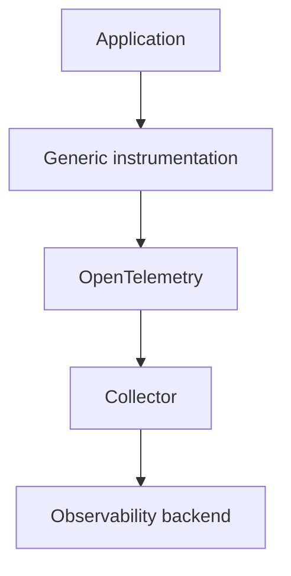
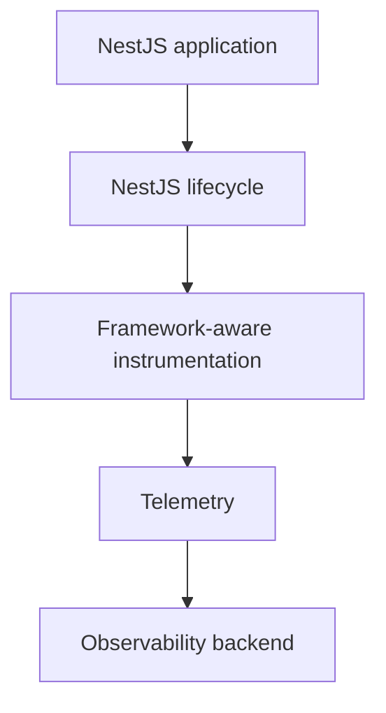

# {{ $frontmatter.title }} 관련

```component VPCard
{
  "title": "Nest.js > Article(s)",
  "desc": "Article(s)",
  "link": "/programming/js-nest/articles/README.md",
  "logo": "/images/ico-wind.svg",
  "background": "rgba(10,10,10,0.2)"
}
```

```component VPCard
{
  "title": "System Design > Article(s)",
  "desc": "Article(s)",
  "link": "/academics/system-design/articles/README.md",
  "logo": "/images/ico-wind.svg",
  "background": "rgba(10,10,10,0.2)"
}
```

[[toc]]

---

<SiteInfo
  name="How to Use NestJS Observe: An Observability Handbook for Devs"
  desc="Observability isn't a new problem, and NestJS is certainly not the first ecosystem to tackle it. But NestJS Observe is interesting because it asks a more specific question: what happens when observabi"
  url="https://freecodecamp.org/news/how-to-use-nestjs-observe-an-observability-handbook-for-devs"
  logo="https://cdn.freecodecamp.org/universal/favicons/favicon.ico"
  preview="https://cdn.hashnode.com/uploads/covers/5e1e335a7a1d3fcc59028c64/89c7ca34-578d-4782-9f12-25664410cdff.png"/>

Observability isn't a new problem, and NestJS is certainly not the first ecosystem to tackle it.

But NestJS Observe is interesting because it asks a more specific question: what happens when observability understands the framework it's observing?

Before looking at the implementation, let's establish the problem and why framework context might matter.

## The Observability Problem

If you've built and maintained a server application long enough, you've probably experienced moments when your API is slow for some reason and don’t understand why.

You check the logs, and there's nothing obvious. The database is up, and there are no errors. The endpoint works perfectly on your machine.

So you add a few logs:

```plaintext
11:30:02 AM LOG Starting order creation
11:34:11 AM LOG Inventory checked
11:34:12 AM LOG Payment started
11:39:03 AM LOG Payment completed
```

And you run the request again. Now you have a pretty good idea where the time went, but you've also just started building your own primitive tracing system.

That's where things get interesting. Modern applications can produce enormous amounts of information: logs, metrics, traces, profiles, errors, database queries, HTTP calls, background jobs, queue messages, and more.

The challenge isn't necessarily **collecting more information.** It's being able to answer a much simpler question:

> What exactly happened inside my application?

For a NestJS app, this question becomes particularly interesting because Nest already understands a lot about what's happening.

It knows about controllers, providers, middleware, guards, interceptors, and pipes. It knows when a GraphQL resolver is executed, or when a microservice handler receives a message.

So what happens if observability is allowed to use that knowledge? That's the idea behind [<VPIcon icon="iconfont icon-nestjs"/>NestJS Observe](https://observe.nestjs.com/). And that's what we're going to explore in this article.

But rather than treating Observe as just another package to install, we're going to use it to understand a bigger idea and question: what does framework-aware observability actually give us, and when is it worth using?

We'll start with the basics of observability, build a small NestJS application, introduce a real performance problem, instrument it with Observe, and then compare the approach with the more framework-neutral world of OpenTelemetry.

::: note Prerequisites

To follow along, you should have basic TypeScript and NestJS knowledge, and some familiarity with HTTP APIs.

You don't need prior observability experience. We'll introduce the concepts as we build.

:::

---

## What Problem Is Observe Actually Solving?

Let's make the problem concrete. Imagine this NestJS application: a `POST /orders` request comes in and takes three seconds. That's all our HTTP client tells us.


The diagram above shows how a single `POST /orders` request can trigger several layers of work inside an application, illustrating why the request duration alone doesn't tell us where the time was spent.

What we know:

```plaintext
POST /orders → 3 seconds
```

But that isn't enough. We want to know whether the three seconds came from:

```plaintext
Controller → Service → Database
```

or:

```plaintext
Controller → Service → External API
```

or perhaps from something entirely different:

```plaintext
Node.js process → CPU-heavy operation → Event loop contention
```

This is the problem observability tries to solve. And NestJS Observe approaches it from an interesting position: **The framework already knows part of the answer.**

Observability is one of those engineering words that can quickly become vague. A useful definition would be:

> Observability is our ability to understand the internal state and behavior of a system from the information it exposes.

That information is called **telemetry,** and the most common telemetry signals are:

- logs
- metrics
- traces
- profiles

They all answer different questions.

Logs describe events: what happened?

For example:

```plaintext
2026-08-31 14:21:04
Payment provider returned HTTP 502
```

This is useful, but if you're investigating one request, you may still have to manually connect this log to everything else that happened.

Metrics aggregate information: how often did it happen?

```plaintext
request_count = 1,240,231
error_rate = 2.4%
p95_latency = 840ms
```

Metrics are excellent for understanding trends, so you can quickly answer “Did latency increase after yesterday's deployment?". But a metric doesn't usually explain the complete story of one request. That’s why we also need “traces”

A trace follows one logical operation: what happened during this operation?

For example:

```plaintext
POST /orders
│
├── authentication
├── OrdersController.create()
├── InventoryService.reserve()
├── PaymentService.charge()
└── Payment API
```

Now we’re able to see the execution path. More importantly, we can see how long individual operations took.

Then we have profiles. Profiling answers a different question: where's the runtime spending resources? Suppose an endpoint is slow, but there's no obvious slow database or HTTP request.

A CPU profile might reveal:

```plaintext
CPU
│
├── JSON serialization
├── application code
├── garbage collection
└── cryptographic operations
```

The four signals complement one another.

This is a useful mental model:


This illustration groups the main observability signals (logs, metrics, traces, and profiles), showing how each provides a different view of application behavior and how they complement one another.

In fact, you don't necessarily need every signal for every application. The point is to have enough information to answer operational questions.

---

## From Application Monitoring to Framework-aware Observability

The traditional approach gives us powerful, standardized ways to collect telemetry. But frameworks already understand how our applications are structured and executed. **What if observability could use that context instead of treating the application as a generic process?**

### Before Observe

There are several ways we could approach our slow `/orders` endpoint. The simplest is logging:

```ts
console.log('Starting payment');
await paymentService.charge();
console.log('Payment completed');
```

It works until the application grows. Then we might introduce metrics:

```plaintext
payment_latency_ms
orders_created_total
payment_failures_total
```

Now we can understand behavior across many requests. Then we might introduce distributed tracing:

```plaintext
POST /orders
│
├── OrdersController
├── OrdersService
├── InventoryService
└── PaymentService
```

This is where [**OpenTelemetry has become particularly important**](/freecodecamp.org/how-opentelemetry-works.md) ecome particularly important. OpenTelemetry is a vendor-neutral observability framework and toolkit for generating, collecting, and exporting telemetry.

It's deliberately not an observability backend. We'll come back to that distinction later, because it becomes important when comparing OpenTelemetry with Observe.

### So Why Do We Need NestJS Observe?

This is the interesting part. A generic instrumentation layer can observe an HTTP request, but NestJS knows that the request went through a specific application structure.

For example:

```plaintext
HTTP Request → Middleware → Guard → Interceptor → Pipe → Controller → Provider
```

These aren't arbitrary JavaScript functions. They're concepts that Nest itself understands. So there's potentially valuable information available to an observability system that sits close to the framework.

Instead of only seeing:

```plaintext
HTTP GET /users/42 (took 4s to execute)
```

we can potentially understand:

```plaintext
HTTP GET /users/42 → UsersController.findOne() → UsersService.findUser() → UsersRepository.findById()
```

That distinction is the reason framework-level instrumentation is interesting

### Framework-aware Observability

Let's give the idea a name. **Framework-aware observability** means that instrumentation understands the framework's execution model instead of treating the application as a generic process.

The traditional model looks roughly like this:



A framework-integrated approach looks more like:



The difference isn't necessarily the final telemetry format. The difference is **how much context the instrumentation can understand automatically**.

That is where **Observe** enters the picture.

---

## Meet NestJS Observe

NestJS Observe is an official observability tool built specifically for NestJS applications. The project is open source. It's purpose is not to invent logs, metrics, or traces because those already exist and do a good job. Its value comes from integrating observability with the NestJS application model.

The current project documentation describes automatic instrumentation across several NestJS execution paths, including:

- HTTP
- GraphQL
- microservices / RPC
- BullMQ
- scheduled jobs

It also provides runtime metrics and profiling capabilities, which gives us something worth testing.

Before moving forward, beware that **Observe is still a relatively new part of the NestJS ecosystem**, so its APIs, supported integrations, pricing, and capabilities can evolve quickly.

Now, let's stop talking about it and build something

But hold on before we go further. If you want to see what this looks like before setting up your own application, NestJS now has a public [<VPIcon icon="iconfont icon-nestjs"/>Observe demo dashboard](https://observe-demo.nestjs.com/dashboard) you can explore directly. It runs on a generated dataset from a busy service, so you can explore requests, traces, waterfall views, errors, background jobs, and alerts without creating an account or installing anything.

I'd recommend spending a few minutes clicking through it before continuing. In particular, open a request or trace and follow the execution from the high-level operation down into the individual work it performed. It gives you a much better intuition for what we're building in this example than looking at a screenshot or a list of features ever could.

---

## Our Practical Project

We're going to build a tiny checkout API. It has three small components:

- **Orders**: receives the HTTP request and coordinates the checkout flow.
- **Inventory**: simulates reserving the requested product.
- **Payments**: simulates an external payment provider and intentionally introduces latency.

See Figure 1 above for the overall flow of what we'll be reproducing

The `Orders` component sits at the center of the request, while `Inventory` and `Payments` represent work that happens further down the execution path. That gives us just enough structure to create a realistic slow request and later see whether Observe can show us where the time went.

The payment provider will intentionally be slow.

Our goal is to see if we can identify where the request is spending its time without manually instrumenting every operation.

We're not building an e-commerce platform. We're building just enough complexity to create a realistic observability problem.

To follow along, you'll need a recent Node.js installation and the NestJS CLI. You don't need to know OpenTelemetry or an existing APM platform, nor do you need a production application.

### Create the NestJS Application

Start with a regular NestJS project:

```sh
npm i -g @nestjs/cli # if not installed yet
nest new nest-observe-demo
cd nest-observe-demo
```

The `nest new` command will prompt you with “**Would you like to enable auto-instrumented observability (@nestjs/observe)?”.** Say yes 😀 when prompted

Start it:

```sh
npm run start:dev
```

Now generate your modules using the Nest CLI:

```sh
nest g module orders
nest g controller orders
nest g service orders

nest g module inventory
nest g service inventory

nest g module payments
nest g service payments
```

The project should look roughly like:

```sh title="file structure"
src/
├── app.module.ts
├── main.ts
│
├── orders/
│   ├── orders.controller.ts
│   ├── orders.service.ts
│   └── orders.module.ts
│
├── inventory/
│   ├── inventory.service.ts
│   └── inventory.module.ts
│
└── payments/
    ├── payments.service.ts
    └── payments.module.ts
```

Our payment service represents an external payment provider. For the tutorial, we'll simulate network latency:

```ts
import { Injectable } from '@nestjs/common';

@Injectable()
export class PaymentsService {
  async charge(amount: number) {
    await new Promise((resolve) =>
      setTimeout(resolve, 750),
    );

    return {
      id: `payment_${Date.now()}`,
      amount,
      status: 'succeeded',
    };
  }
}
```

The important part is the `setTimeout()`. We're deliberately creating a slow dependency.

In a real application, this could be:

- an HTTP request
- a database query
- a third-party API
- another microservice

For our purposes, the source of the latency doesn't matter.

### Add Inventory

Our inventory service will be much faster:

```ts
import { Injectable } from '@nestjs/common';

@Injectable()
export class InventoryService {
  async reserve(productId: string) {
    await new Promise((resolve) =>
      setTimeout(resolve, 40),
    );

    return {
      productId,
      reserved: true,
    };
  }
}
```

Again, the delay represents external work.

### Create the Orders Service

Now we'll combine both operations:

```ts :collapsed-lines title="orders.service.ts"
import { Injectable } from '@nestjs/common';
import { InventoryService } from '../inventory/inventory.service';
import { PaymentsService } from '../payments/payments.service';

@Injectable()
export class OrdersService {
  constructor(
    private readonly inventoryService: InventoryService,
    private readonly paymentsService: PaymentsService,
  ) {}

  async createOrder(
    productId: string,
    amount: number,
  ) {
    const inventory =
      await this.inventoryService.reserve(productId);

    const payment =
      await this.paymentsService.charge(amount);

    return {
      id: `order_${Date.now()}`,
      productId,
      amount,
      inventory,
      payment,
    };
  }
}
```

Notice something important: there's no observability code here. It's just application code, at least for now!

### Create the Controller

In the generated controller file, fill in the following content:

```ts :collapsed-lines
import { Body, Controller, Post } from '@nestjs/common';
import { OrdersService } from './orders.service';

@Controller('orders')
export class OrdersController {
  constructor(
    private readonly ordersService: OrdersService,
  ) {}

  @Post()
  create(
    @Body()
    body: {
      productId: string;
      amount: number;
    },
  ) {
    return this.ordersService.createOrder(
      body.productId,
      body.amount,
    );
  }
}
```

The controller is deliberately thin: it accepts the HTTP request, extracts `productId` and `amount`, and delegates the actual work to `OrdersService`.

The `OrdersService` is provided through the controller's constructor using NestJS dependency injection (DI). In other words, we don't create `new OrdersService()` ourselves. Instead, Nest creates the service and supplies it to the controller when the application starts. This keeps the controller focused on HTTP concerns and lets Nest manage the application's dependencies.

The module configuration below is what makes that injection possible across module boundaries. `OrdersModule` provides `OrdersService` and imports the modules that export `InventoryService` and `PaymentsService`. Those `exports` make the services available to modules that import them. That's the small piece of NestJS DI you need for this example. The linked NestJS resource is there only if you want to go deeper into how the dependency-injection system works.

Make sure your modules import and provide the required services. You can [<VPIcon icon="iconfont icon-nestjs"/>learn more about Nest’s DI here](https://docs.nestjs.com/fundamentals/custom-providers#di-fundamentals).

For example, this code:

```ts
import { Module } from '@nestjs/common';
import { OrdersController } from './orders.controller';
import { OrdersService } from './orders.service';
import { InventoryModule } from '../inventory/inventory.module';
import { PaymentsModule } from '../payments/payments.module';

@Module({
  imports: [
    InventoryModule,
    PaymentsModule,
  ],
  controllers: [OrdersController],
  providers: [OrdersService],
})
export class OrdersModule {}
```

Export the services from the corresponding modules so that `OrdersModule` can consume them:

```ts
@Module({
  providers: [InventoryService],
  exports: [InventoryService],
})
export class InventoryModule {}
```

and:

```ts
@Module({
  providers: [PaymentsService],
  exports: [PaymentsService],
})
export class PaymentsModule {}
```

Finally, import `OrdersModule` into `AppModule`. This should be done automatically by the CLI, but just double-check in case you didn’t use the CLI.

### Test the Application

Before adding observability, let's first confirm that the application itself works. This request exercises the complete checkout path: the controller receives the request, `OrdersService` calls Inventory, then Payments, and the API returns the combined result.

The roughly 790ms response time is intentional: it gives us a concrete performance problem to investigate once Observe is enabled.

Start the application again running `npm run start:dev`.

Then call:

```sh
curl -X POST http://localhost:3000/orders \
-H "Content-Type: application/json" \
-d '{"productId":"book-123","amount":49}'
```

You should get something similar to:

```ts
{
  "id": "order_...",
  "productId": "book-123",
  "amount": 49,
  "inventory": {
    "productId": "book-123",
    "reserved": true
  },
  "payment": {
    "id": "payment_...",
    "amount": 49,
    "status": "succeeded"
  }
}
```

The request should take approximately 40ms + 750ms ≈ 790ms

### We Already Have a Problem at a Smaller Scale

Imagine a user reports this in production: **"Creating an order is slow."**

- You're able to reproduce the problem `POST /orders ≈ 800ms`
- Then the question: “Where did those 800ms go?” Of course, we know the answer because we wrote this bad code.

But imagine you didn't, or the service looked more like this:

```md
OrdersService
    |
    +-- PostgreSQL
    |
    +-- Redis
    |
    +-- Inventory service
    |
    +-- Tax service
    |
    +-- Payment provider
    |
    +-- Fraud service
```

Now what? This is where observability becomes valuable.

### The Basic Solution: Logging

Initially, we could add:

```js
console.log('Starting inventory');
await this.inventoryService.reserve(productId);
console.log('Inventory complete');
console.log('Starting payment');
await this.paymentsService.charge(amount);
console.log('Payment complete');
```

Now our logs might look like this:

```md
Starting inventory
Inventory complete
Starting payment
Payment complete
```

We can infer that inventory was relatively fast and payment was slow, but notice what we're doing. We're manually adding instrumentation around our application logic. As the application grows, this becomes increasingly expensive.

And we still haven't created a structured representation of the request.

### What a Trace Gives Us

A trace gives us an execution tree:

```plaintext
POST /orders
│
└── OrdersController.create()
    │
    └── OrdersService.createOrder()
        │
        ├── InventoryService.reserve()
        │
        └── PaymentsService.charge()
```

Now imagine timings attached:

```plaintext
POST /orders                       ~790ms
│
└── OrdersController.create        ~790ms
    │
    └── OrdersService.createOrder  ~790ms
        │
        ├── InventoryService        ~40ms
        │
        └── PaymentsService        ~750ms
```

The problem becomes clear: the endpoint is no longer mysteriously slow. The payment operation is consuming most of the time.

That's the difference between **having logs** and **understanding execution**.

---

## Let's Put Observe to Work

From the `nest new` command, you could have opted in already to have your code instrumented by default. If you accepted that, you may have seen errors like:

```plaintext
[Nest] 87392  - 09/13/2026, 9:09:11 PM   ERROR [ObserveAgentWorker] Error: Telemetry rejected (401). Check that appKey and appSecret are valid; the application is taken from the key. Credentials are read once at start-up, so this will not recover without a restart - further rejections are counted, not logged.
```

Now let's do the same by hand by instrumenting our NestJS application, starting with installing Observe:

```sh
npm install @nestjs/observe
```

The Observe package exposes helpers for integrating its instrumentation into a Nest application. Let’s now create an <VPIcon icon="fas fa-folder-open"/>`src/`<VPIcon icon="iconfont icon-typescript"/>`observe.ts` file in the src folder with the following content:

```ts title="observe.ts"
import { createObserveModule } from '@nestjs/observe';

export const {
  ObserveModule,
  ObserveInstrument,
} = createObserveModule();
```

This gives us the NestJS integration we need.

### Configure Observe

Update `app.module.ts`:

```ts title="app.module.ts"
import { Module } from '@nestjs/common';
import { ConfigModule, ConfigService } from '@nestjs/config';
import { AppController } from './app.controller';
import { AppService } from './app.service';
import { OrdersModule } from './orders/orders.module';
import { InventoryModule } from './inventory/inventory.module';
import { PaymentsModule } from './payments/payments.module';
import { ObserveModule } from './observe';

@Module({
  imports: [
    ConfigModule.forRoot({ isGlobal: true }),
    // we're loading secrets from env file - which is an async operation (hence we use forRootAsync()
    ObserveModule.forRootAsync({
      inject: [ConfigService],
      // useFactory defers reading the env vars until Nest has loaded .env, instead of evaluating process.env when the @Module decorator first runs 
      useFactory: (config: ConfigService) => ({
        appKey: config.getOrThrow<string>('OBSERVE_APP_KEY'),
        appSecret: config.getOrThrow<string>('OBSERVE_APP_SECRET'),
        serviceId: config.getOrThrow<string>('OBSERVE_SERVICE_ID'),
      }),
    }),
    OrdersModule,
    InventoryModule,
    PaymentsModule,
  ],
  controllers: [AppController],
  providers: [AppService],
})
export class AppModule {}
```

There are three things happening in this configuration.

`ConfigModule.forRoot({ isGlobal: true })` loads our environment variables and makes `ConfigService` available throughout the application.

`ObserveModule.forRootAsync()` tells Nest to initialize the Observe integration using a factory function rather than a fixed object. Nest injects `ConfigService` into that factory, and we read the Observe credentials only after configuration has been loaded.

Finally, `serviceId` gives the telemetry a stable identity so the Observe platform knows which application/service the data belongs to.

Using `getOrThrow()` is intentional too. If one of these required values is missing, the application fails clearly at startup instead of silently starting with incomplete observability configuration.

The credentials come from the Observe dashboard when you create a service. Go to the [<VPIcon icon="iconfont icon-nestjs"/>Observe platform](https://observe.nestjs.com/login) and grab yours. If you're new to the Nest ecosystem, pay attention to comments in the code snippets.

Put them in your environment:

```sh title=".env"
OBSERVE_APP_KEY=...
OBSERVE_APP_SECRET=...
```

Treat them like any other application secret.

### Instrument the Nest Application

Now update <VPIcon icon="iconfont icon-typescript"/>`main.ts`:

```ts title="main.ts"
import { NestFactory } from '@nestjs/core';
import { AppModule } from './app.module';
import { ObserveInstrument } from './observe';

async function bootstrap() {
  const app = await NestFactory.create(AppModule, {
    instrument: ObserveInstrument,
  });
  await app.listen(process.env.PORT ?? 3000);
}
void bootstrap();
```

This is the interesting part. We haven't manually wrapped `OrdersController.create()` or `OrdersService.createOrder()` with observability code. Instead, we're allowing the NestJS integration to instrument the application based on the framework's execution model.

This is what makes the approach different from simply adding logging statements everywhere.

### Generate Some Traffic

Restart the application:

```sh
npm run start:dev
```

Generate a few requests, just to simulate some sort of load:

```sh
for i in {1..20}; do
  curl -s -X POST http://localhost:3000/orders \
    -H "Content-Type: application/json" \
    -d '{"productId":"book-123","amount":49}' \
    > /dev/null
done
```

Now inspect the Observe dashboard, it should look like the following screenshot:


The Observe dashboard shows telemetry for the `/orders` endpoint, giving a high-level view of request activity and latency so we can investigate which part of the request is consuming the most time.

The exact UI and available views can change as the product evolves. And now we can answer the question: “**Which block consumes much of the time out of the 800ms?**” It gets even more interesting under real application load.

### The Important Part Isn't the Dashboard

It's tempting to stop here and say: "Cool, NestJS now has tracing." That's underselling what we're looking at. The interesting thing is the vocabulary.

We're not merely looking at HTTP or Node.js or db, we're potentially looking at concepts that exist directly in our NestJS application: controller, providers, service, and so on.

That's the potential benefit of framework-aware instrumentation. The framework already understands these components. Observe can use that understanding when producing telemetry.

Let's make the application genuinely problematic by changing the timeout from 750 to 2500. Generate traffic once again. Now the endpoint should take approximately 40ms + 2500ms ≈ 2540ms. Let’s pretend we're debugging a production incident.

Don't look at the source code. Start with the trace asking: ”Why is `/orders` taking 2.5 seconds?”

The trace should allow you to move from `POST /orders` to `OrdersService.createOrder` to `PaymentsService.charge` and identify the slow operation. That's the workflow good observability should enable.

---

## How to Go Beyond the First Trace

### Automatic Instrumentation vs Manual Instrumentation

Automatic instrumentation is powerful, but it can't understand everything. Nest knows about it all (HTTP, controllers, and so on). It doesn't automatically know that this function is particularly important to your business:

```ts
async calculateCheckoutDiscount(cart: Cart) {
  // complicated business logic
}
```

Maybe this operation takes 400ms, and it's one of the most important parts of your checkout pipeline. The framework can't necessarily infer that.

This is where manual instrumentation becomes useful.

The general model is:

```plaintext
Automatic instrumentation
            +
Manual instrumentation
            =
Useful application telemetry
```

Automatic instrumentation gives us the skeleton. Manual instrumentation adds application-specific meaning.

This is an easy trap. Once you discover tracing, it's tempting to instrument every function:

```ts
functionA()
functionB()
functionC()
functionD()
functionE()
functionF()
```

But you shouldn't do this. Don’t instrument everything. The goal isn't to create the biggest trace possible, but to create **useful telemetry**.

Good candidates for manual instrumentation are often:

- expensive business operations
- external calls
- critical workflows
- expensive computations
- operations whose latency matters
- important business events

For example:

```plaintext
checkout.calculatePrice
fraud.evaluate
payment.authorize
invoice.generate
```

Those names carry meaning.

### Metrics: When Traces Aren't Enough

Suppose we want to know how many orders are being created. A trace isn't the best tool for this.

We want a metric, something like `orders.created` or `payments.failed` or `checkout.duration`. Metrics give us the aggregate picture.

For example:

```sh
orders.created_total
    12,430
payment.failures_total
    183
checkout_latency_p95
    840ms
```

Now we can ask and reply to questions like: “Is the system getting worse after the recent release at 2 AM?”

Traces answer “What happened to this particular operation?”, while metrics answer “What's happening across the system?”. Both are useful, especially as your application gets some traction.

### Errors Are Also Telemetry

Consider the following code:

```ts
try {
  await this.paymentsService.charge(amount);
} catch (error) {
  return {
    status: 'pending',
  };
}
```

From the application's perspective, the exception was handled. From an operational perspective, we may still care deeply that it happened.

This leads to an important distinction: application correctness and operational visibility aren't always the same thing.

An error can be handled by the application and simultaneously important to operations. That's why observability needs to account for handled failures as well as unhandled crashes.

### Beyond HTTP: Following Work Across Your Application

So far, we've only looked at HTTP requests. Real NestJS applications rarely stop there. They often contain BullMQ jobs, scheduled tasks, RPC handlers, GraphQL resolvers, and other forms of background work. The Observe project currently includes automatic instrumentation for several of these Nest-specific execution paths.

Consider an order-processing flow where the initial HTTP request creates an order and then queues the payment:

```plaintext
POST /orders -> Create order -> Queue payment -> BullMQ -> Payment worker
```

Now imagine a user says, "My order was created, but payment took ten minutes." The HTTP request itself may have completed in a few hundred milliseconds. The delay could be somewhere in the queue, inside the worker, in a downstream service, or in the payment provider.

That's a very different debugging problem from simply finding a slow HTTP endpoint. Tracing becomes especially useful when one logical operation crosses process boundaries because the important part of the story may happen after the original request has already finished.

This is where context becomes important. An operation can carry information such as a trace ID, span ID, request ID, service, environment, and region as it moves through the system:

```plaintext
HTTP request
      |
      +---- Service A
      |
      +---- Queue
              |
              +---- Worker
                      |
                      +---- Service B
```

Instead of manually searching through logs from every service and trying to determine which entries belong to the same operation, distributed tracing gives us a way to correlate those pieces of work. This is one of the important ideas behind distributed tracing and OpenTelemetry's context propagation model.

There's another dimension to observability that becomes important when the application itself is the problem.

Imagine that a trace tells you:

```plaintext
POST /orders
≈ 2 seconds
```

But there's no slow database query, no slow external API, no queue delay, and no obvious dependency problem. What if the Node.js process itself is struggling?

Now we need a different type of telemetry. We might ask whether the process is CPU-bound, whether memory usage is increasing, whether garbage collection is contributing to latency, whether the event loop is under pressure, or whether one function is consuming excessive CPU.

This is where runtime metrics and profiling become useful. Observe's current feature set includes runtime metrics and CPU profiling in addition to application instrumentation. Application observability therefore doesn't have to stop at the HTTP request itself. Sometimes the problem is the runtime executing the application.

There's also an important limitation worth keeping in mind: a trace doesn't automatically tell you the root cause.

Suppose we see:

```plaintext
POST /orders       3 seconds
PaymentsService    2.9 seconds
```

We've localized the problem, but we haven't necessarily explained it. `PaymentsService` could be slow because the payment provider is slow, a database query is taking too long, network latency has increased, a connection pool is exhausted, or the provider is retrying an operation.

Observability narrows the search space. It doesn't replace engineering judgment. A good observability system makes investigation faster. It doesn't make investigation unnecessary.

---

## Where Observe Fits: NestJS, OpenTelemetry, and the Broader Ecosystem

At this point, it's worth putting Observe into the larger observability landscape.

Observe and OpenTelemetry aren't simply two interchangeable products. OpenTelemetry is a vendor-neutral observability framework and toolkit that gives applications and infrastructure a standardized way to generate, collect, and export telemetry.

A simplified architecture might look like this:

```plaintext
NestJS
   |
OpenTelemetry
   |
Collector
   |
   +---- Grafana
   +---- Jaeger
   +---- Datadog
   +---- New Relic
   +---- other backend
```

Observe is more opinionated:

```plaintext
NestJS
   |
Observe
   |
Observe platform
```

So the interesting difference isn't "one has tracing and the other doesn't." The more useful question is:

> How much of the NestJS execution model should the instrumentation understand automatically?

OpenTelemetry's major strength is portability. Imagine a company operating eight NestJS services, two Go services, four Python services, and three .NET services. You probably don't want four completely different observability architectures. You want common telemetry, context, terminology, backend, and operational practices.

That's exactly the kind of problem OpenTelemetry is designed to address.

Observe makes a different trade-off. Imagine an organization with twelve NestJS services and developers who naturally think in terms of controllers, providers, modules, guards, interceptors, resolvers, queues, and other NestJS concepts. If observability tooling can understand those concepts automatically, the developer experience can become simpler because telemetry is expressed in terms engineers already use to reason about their applications.

These approaches don't necessarily have to compete.

A useful architecture could look like:


The architecture above illustrates a layered approach where NestJS provides framework-level context, OpenTelemetry provides standardized telemetry and interoperability, and an observability backend handles storage, visualization, alerting, and analysis.

The framework can provide execution context and framework-level instrumentation. A telemetry standard can provide common semantics, context propagation, and interoperability. The backend can provide storage, querying, visualization, alerting, and analysis.

That separation makes sense.

NestJS is also not alone in moving observability closer to the application framework and runtime.

The .NET ecosystem, for example, has framework and runtime diagnostics built around concepts such as `Activity`, metrics, and logging, with OpenTelemetry providing a standardized way to correlate and export telemetry.

Java has mature observability tooling around frameworks such as Spring Boot and libraries such as Micrometer.

Python has OpenTelemetry integrations for frameworks such as Django and FastAPI, while Go applications commonly use OpenTelemetry instrumentation around HTTP, gRPC, and other libraries.

The implementations differ, but the broader direction is similar: **the closer observability gets to the application's execution model, the more useful context it can potentially capture automatically.**

That's the interesting idea behind looking at Observe. NestJS didn't invent observability, and framework-specific instrumentation isn't a replacement for the broader ecosystem. Rather, NestJS is making a framework-level bet about how observability can feel to developers working inside the NestJS execution model.

There is a natural trade-off here. The more deeply an observability system understands NestJS, the more useful it can become to NestJS developers, but that specialization can also make it less portable.

If your organization is heavily invested in NestJS, framework-specific context may be extremely valuable. If you're operating dozens of services across several languages, a common OpenTelemetry-based architecture may matter more. Neither approach is automatically appropriate for every environment. The architecture determines what matters.

---

## How to Evaluate Observe in a Real Application

There's another part of the decision that's easy to overlook: cost.

When people compare observability solutions, they often reduce the decision to something like:

```plaintext
Tool A = $X
Tool B = $Y
OpenTelemetry = free
```

That's incomplete.

The real cost of an observability solution can include software, infrastructure, storage, engineering time, maintenance, configuration, and the operational cost of responding to incidents.

OpenTelemetry itself is open source, but if you build an observability platform around it, somebody still has to operate collectors, storage, dashboards, alerts, retention policies, security, and upgrades.

A hosted platform reduces some of that infrastructure burden, but that convenience has a price. Conversely, an open-source stack gives you more control, but operating that stack also has a cost.

Pricing should therefore always be checked against the current official pricing page before making a production decision. At the time of writing, the Observe project advertises a free tier of 300,000 events per month, which can make experimentation relatively accessible. But event-based pricing introduces another important concept: telemetry volume.

One application request may produce an HTTP operation, multiple spans, logs, errors, and other telemetry. At high traffic volumes, that can grow quickly. Observability therefore needs its own capacity planning.

More telemetry isn't automatically better either.

Imagine attaching the following to every event:

```plaintext
userId
requestId
transactionId
tenantId
email
```

You've created more context, but you've also potentially created higher cardinality, increased storage requirements, privacy concerns, larger bills, and more complicated queries.

Some information should never be sent to an observability platform casually. Be particularly careful with authorization headers, cookies, passwords, API keys, tokens, payment information, and personal information.

For example, this is something you shouldn't do blindly:

```ts
span.setAttribute(
  'headers',
  JSON.stringify(request.headers),
);
```

You could end up sending authentication tokens or cookies to your telemetry backend.

Telemetry is data. Treat it like production data.

At higher traffic volumes, sampling can also become important. Recording everything may be perfectly reasonable for a small application, while a system processing thousands of requests per second may need to reduce the amount of telemetry it retains.

A strategy might look something like:

```plaintext
100% of errors
100% of slow requests
10% of successful requests
```

The exact strategy depends entirely on the application and its operational requirements. The important point is that observability itself needs engineering.

So when would I seriously evaluate NestJS Observe?

A heavily NestJS application is an obvious candidate, particularly when there's no existing observability infrastructure and the team wants useful production visibility without having to build and operate an entire observability platform themselves.

It becomes even more interesting when the application goes beyond conventional HTTP APIs and makes heavy use of BullMQ, GraphQL, microservices, scheduled jobs, or other execution paths that framework-aware instrumentation can understand.

It can also be useful when developers naturally reason about the application in NestJS concepts such as:

```plaintext
OrdersController
OrdersService
PaymentService
```

Having telemetry reflect those same concepts can reduce the cognitive overhead of moving between the application and the observability system during an incident.

That doesn't mean every NestJS application should adopt it.

If you already have a mature OpenTelemetry-based observability stack with collectors, dashboards, alerts, SLOs, tracing, metrics, logs, and cross-service correlation, introducing another platform could create unnecessary duplication.

The same consideration applies to heavily polyglot architectures. If your company operates NestJS alongside .NET, Go, Java, Python, and Rust, a standardized telemetry architecture may be more important than framework-specific convenience.

You should also consider your backend and deployment requirements. If your organization has standardized on an existing observability platform, the available integrations and export model matter. And if you require self-hosting for compliance or architectural reasons, remember that an open-source instrumentation library doesn't automatically mean that a hosted observability platform is self-hostable.

Finally, not every application needs sophisticated observability. A tiny internal API with one developer and minimal operational risk may not justify a full observability stack.

The best way to evaluate a tool like Observe is not to compare feature checklists. Run an experiment against real problems.

Take a representative application and introduce a few controlled failures:

```plaintext
1. Slow database query
2. Slow external API
3. Increased error rate
4. CPU-heavy operation
5. Slow background job
```

Then measure something that actually matters: **How long does it take an engineer to identify the cause?**

Try the existing stack first. Then try the new stack.

That's a much more meaningful evaluation than counting dashboards or metrics. The actual value of observability is closer to time to diagnosis.

If an incident takes two hours to diagnose today and twenty minutes with better telemetry, that difference has real operational value for a team.

---

## Final Thoughts

The most interesting part of Observe isn't simply that NestJS now has another way to produce traces. We've had ways to do that for years.

The more interesting idea is that the framework itself can become part of the observability model.

Think about what NestJS already knows: Module, Controller, Pipe, Queue consumer, and so on. These aren't arbitrary pieces of code. They're meaningful application boundaries.

If telemetry can understand those boundaries automatically, observability becomes closer to the developer's mental model. Instead of asking engineers to learn an entirely separate representation of their application, the observability system can build on concepts they already understand.

That's potentially a big deal.

At the same time, framework awareness shouldn't mean that every observability concern belongs inside the framework. NestJS doesn't need to become framework + APM + log aggregation + metric backend + distributed tracing, and so on.

Those are different concerns.

A framework is particularly well positioned to provide execution context, lifecycle information, component boundaries, and framework-level instrumentation.

A telemetry standard can provide common semantics, context propagation, interoperability, and vendor neutrality. An observability backend can provide storage, querying, visualization, alerting, and analysis.

That separation is useful because each layer can focus on what it does best.

So, if you're new to observability, the simplest mental model I would keep is:

```plaintext
Logs
What happened?

Metrics
How often is it happening?

Traces
What happened during this operation?

Profiles
Where is the runtime spending resources?

Framework-aware instrumentation
What does the framework already know about how this operation happened?
```

That's the connection.

Frameworks have traditionally been responsible for helping us **build** applications. They give us routing, dependency injection, validation, middleware, authentication, queues, scheduling, and many other building blocks.

But the framework also knows how those pieces execute.

That means the same knowledge can potentially help us diagnose, profile, trace, measure, and debug the applications we build.

The framework doesn't just know how the application is structured. It knows something about **how the application behaves**.

And that's valuable information.

<!-- TODO: add ARTICLE CARD -->
```component VPCard
{
  "title": "How to Use NestJS Observe: An Observability Handbook for Devs",
  "desc": "Observability isn't a new problem, and NestJS is certainly not the first ecosystem to tackle it. But NestJS Observe is interesting because it asks a more specific question: what happens when observabi",
  "link": "https://chanhi2000.github.io/bookshelf/freecodecamp.org/how-to-use-nestjs-observe-an-observability-handbook-for-devs.html",
  "logo": "https://cdn.freecodecamp.org/universal/favicons/favicon.ico",
  "background": "rgba(10,10,35,0.2)"
}
```
