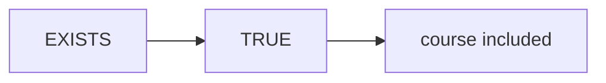
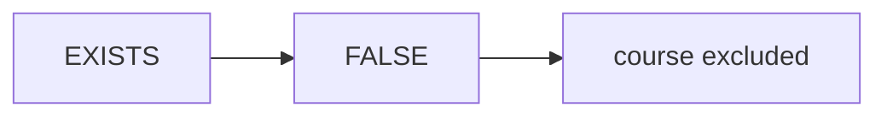

# {{ $frontmatter.title }} 관련

```component VPCard
{
  "title": "Data Science > Article(s)",
  "desc": "Article(s)",
  "link": "/data-science/articles/README.md",
  "logo": "/images/ico-wind.svg",
  "background": "rgba(10,10,10,0.2)"
}
```

[[toc]]

---

<SiteInfo
  name="How to Work with Subqueries in SQL"
  desc="Whenever you see a query nested inside another query in SQL, that's a subquery. A subquery is also known as an inner query while the one that contains it is called the main or outer query. Subqueries "
  url="https://freecodecamp.org/news/how-to-work-with-subqueries-in-sql"
  logo="https://cdn.freecodecamp.org/universal/favicons/favicon.ico"
  preview="https://cdn.hashnode.com/uploads/covers/5e1e335a7a1d3fcc59028c64/e9107adb-f183-460c-8978-6320ff1eadfe.png"/>

Whenever you see a query nested inside another query in SQL, that's a subquery. A subquery is also known as an inner query while the one that contains it is called the main or outer query.

Subqueries are used to provide the main query with additional data in the form of a derived column or derived table, or they can filter the rows returned by the main query.

Subqueries can be quite difficult to understand, especially for beginners who are just starting out in SQL. This article will help simplify this concept so that it is much easier to understand. By the end, you should be able to use subqueries more easily to solve problems.

::: note Prerequisites

Subqueries are an advanced SQL concept, so it's important to have a solid understanding of the basics of SQL: SELECT, FROM, WHERE, JOINS, the CASE statement, and the proper order for query execution.

:::

---

## How Subqueries Work

Let's start by considering an example of a query with a subquery.

```sql
SELECT * FROM registration WHERE 1=1
AND student_id IN (
  SELECT id FROM student WHERE 1=1
  AND location = 'Lagos'
)
```

The above query has two parts: the main query and the subquery.

This is the main query:

```sql
SELECT * FROM registration WHERE 1=1
AND student_id IN (...)
```

Notice that there is currently nothing in the brackets of the main query.

The part of the query that's enclosed in the brackets is the subquery. It's used to filter the rows returned by the main query. Let's look at the subquery code now:

```sql
SELECT id FROM student WHERE 1=1
AND location = 'Lagos'
```

### Execution Order

When you run the whole query in your management system like this:

```sql
SELECT *
FROM registration
WHERE 1=1
AND student_id IN (
  SELECT id FROM student WHERE 1=1
  AND location = 'Lagos'
)
```

You'll get the result below:


The result is showing the registration details of all students from Lagos. But to get this result, SQL follows an execution order which we'll discuss below.

When you execute the whole query, behind the scenes, the subquery is evaluated first:

```sql
SELECT id FROM student WHERE 1=1
AND location = 'Lagos'
```

The subquery retrieves the IDs of students from Lagos from the student table. You get a result like this:


Behind the scenes, these `IDs` returned by the subquery are provided to the main query, transforming the query to look like this:

```sql
SELECT * FROM registration WHERE 1=1
AND student_id IN (
  'STU1','STU13','STU2','STU4','STU23','STU27'
)
```

The main query compares each value in its `student_id` column with the `IDs` returned by the subquery. If a match is found, it returns the registration details of that student. Otherwise, the record is ignored.

You might wonder, "Why not just retrieve the `IDs` from the student table and directly pass them to the main query instead of using a subquery?"

Well, that's hardcoding. While the query will work at the moment, later when there are new students and you rerun the query, you'll only get details of the old students for whom you manually passed `IDs` to the main query. It'll exclude the new ones.

The subquery approach is dynamic: it continuously queries the student table to ensure that the results are always current.

---

## Types of Subqueries

There are two types of subqueries based on dependency: non-correlated (independent) and correlated (dependent).

### Non-correlated Subqueries

These are subqueries that are independent of the main query. When executed outside the main query, they'll work. A good example is the one used in the query above.

```sql
SELECT * FROM registration WHERE 1=1
AND student_id IN ( 
  SELECT id FROM student WHERE 1=1
  AND location = 'Lagos'
)
```

It's important to note that subqueries, whether correlated or non-correlated, can appear in different parts of a SQL query. Where a subquery appears determines its role in the main query. It can function as a derived column, a derived table, or a filter.

Let's discuss the various parts of the main query where a subquery can appear and how they support the main query.

#### 1. Subquery as a derived column

When you see a subquery in the `SELECT` statement, it's a derived column. A derived column is a column created by a query using values from other columns in a table. It's not stored in the database and exists only for the duration of the query.

For example, to calculate the percentage of total registrations for each course, you need the following three pieces of information in the same row:

- Course name
- Registration count for each course (numerator)
- Total registrations across all courses (denominator)

To start, you can write a main query that returns the names of all courses and the registration count for each of them:

```sql
SELECT
  course_name
  , COUNT(reg_id) AS registrations
FROM course AS l
LEFT JOIN registration AS r ON l.id = r.course_id
WHERE 1=1
GROUP BY course_name
```

::: info Result


:::

The main query lists each course with its registration count. To calculate each course's percentage of total registrations, the total registrations for all courses must also be included in each row of the main query's result.

To achieve this, you can nest a subquery that returns the total number of registrations for all courses as a column to the main query, like this:

```sql
SELECT COUNT(reg_id) FROM registration
```

When this subquery is executed outside the main query, it returns the result below:


30 is total number of registrations for all courses. Now, to make the subquery a column of the main query, first enclose it in brackets like this:

```sql
(SELECT COUNT(reg_id) FROM registration)
```

Next, insert the subquery into the column list of the main query as shown below:

```sql
SELECT
  course_name,
  COUNT(reg_id) AS regs,
  (SELECT COUNT(reg_id) FROM registration) AS total --subquery
FROM course AS l
LEFT JOIN registration AS r ON l.id = r.course_id
WHERE 1=1
GROUP BY course_name
```

When executed, it returns the following result:


In the table above, the main query returns the course names and their registration counts, aliased as `regs`. The subquery adds a `total` column containing the total number of registrations for all courses, which is 30. The value (30) appears on every row of the result.

With the course names, registration counts, and the total number of registrations across all courses in each row, we can now calculate the percentage of total registrations for each course.

::: info Formula

$$
\text{Percentage of Total}=\frac{\text{regs}}{\text{total}}\times{100}
$$

:::

First, both the `regs` and `total` column have integer values. If divided directly, the result will be 0. To prevent this, always cast the numerator to the `FLOAT` data type using the `CAST()` function as shown below:

```sql
-- casting numerator to float data type
CAST(COUNT(reg_id) AS FLOAT)
```

After casting the numerator to `FLOAT`, proceed with the division like this:

```sql
CAST(COUNT(reg_id) AS FLOAT) -- Numerator

/ -- Divide sign

(SELECT COUNT(reg_id) FROM registration) -- Denominator

* 100 -- Convert to percentage
```

Let's bring it all together:

```sql
SELECT
  course_name,
  CAST(COUNT(reg_id) AS FLOAT)/
  (SELECT COUNT(reg_id) FROM registration) * 100 AS percent_of_total
FROM course AS l
LEFT JOIN registration AS rON l.id = r.course_id
WHERE 1=1
GROUP BY course_name
```

When the query above is executed, you get this result:


The result shows all courses with their percentages of total registrations. To control the number of decimal places of the values in the `percent_of_total` column, we can use the SQL `ROUND()` function to round them to one decimal place. See the updated query below:

```sql
SELECT
  course_name,
  ROUND(CAST(COUNT(reg_id) AS FLOAT)/
  (SELECT COUNT(reg_id) FROM registration) * 100,1) AS percent_of_total
FROM course AS l
LEFT JOIN registration AS r ON l.id = r.course_id
WHERE 1=1
GROUP BY course_name
```

Result:


Finally, we have the percentage contribution of each course to the total registrations.

#### 2. Subquery as a derived table

When you see a subquery in the `FROM` clause, it's a derived table. A derived table is a temporary table created from the result of a query. It's not permanently stored in the database and exists only while the query runs.

As an example, let's say you want to write a query that returns the number of students by region.

But when the student table is queried using the query below:

```sql
SELECT * FROM student
```

you discover it has no `region`, and instead it has a `state` column:


To solve this problem, you can leverage values in the `state` column to create a derived `region` column using the SQL `CASE` statement like this:

```sql
SELECT
  * -- all columns of the student table
  , CASE
    WHEN location IN('Abeokuta','Ibadan','Mokola','Iyana Ipaja','Lagos') 
    THEN 'West'
    WHEN location IN('Anambra','Owerri','Enugu','Port Harcourt') 
    THEN 'East'
    WHEN location IN('Abuja','Ilorin','Kaduna','Kano','Jos') 
    THEN 'North'
  END AS region -- a derived region column
FROM student
```

When the above query is executed, it returns the result below:


The result now shows all column from the student table with the region column created using the `CASE` statement.

Now that we have a region column, let's convert the entire query into a table subquery.

First, enclose the whole query in brackets and give it an alias:

```sql
(SELECT
  *
  , CASE
    WHEN location IN('Abeokuta','Ibadan','Mokola','Iyana Ipaja','Lagos') 
    THEN 'West'
    WHEN location IN('Anambra','Owerri','Enugu','Port Harcourt') 
    THEN 'East'
    WHEN location IN('Abuja','Ilorin','Kaduna','Kano','Jos') 
    THEN 'North'
  END AS region 
FROM student
) AS data_prep -- aliased data_prep
```

To use `data_prep`, place the entire query, including the brackets and alias, into a `FROM` clause, just as you would with a regular table:

```sql
FROM (
  SELECT
    *, 
    CASE
      WHEN location IN('Abeokuta','Ibadan','Mokola','Iyana Ipaja','Lagos') 
      THEN 'West'
      WHEN location IN('Anambra','Owerri','Enugu','Port Harcourt') 
      THEN 'East'
      WHEN location IN('Abuja','Ilorin','Kaduna','Kano','Jos') 
      THEN 'North'
    END AS region 
  FROM student
) AS data_prep
```

From this moment, you can select any data from `data_prep`. It will work like a regular table.

Now, let's use data from `data_prep` to calculate the number of students by region:

```sql
SELECT
  region
  , COUNT(id) AS students
FROM (
  SELECT
    *
    , CASE
      WHEN location IN('Abeokuta','Ibadan','Mokola','Iyana Ipaja','Lagos') 
      THEN 'West'
      WHEN location IN('Anambra','Owerri','Enugu','Port Harcourt') 
      THEN 'East'
      WHEN location IN('Abuja','Ilorin','Kaduna','Kano','Jos') 
      THEN 'North'
    END AS region 
  FROM student
  WHERE 1=1
) AS data_prep
WHERE 1=1
GROUP BY region 
```

When the above query is executed, it returns the result below:


The result shows the count of students by region.

#### 3. Subquery as a filter

When you see a subquery in the `WHERE` clause, it's a filter to the main query. There are different group of operators you can use to filter the main query.

**Logical operators**

These include `IN`, `ANY`, and `ALL`. You can use them when a subquery returns multiple values, allowing you to compare column values in your dataset against those returned by the subquery.

You saw an example using `IN` earlier, so we'll move on to the remaining two.

Scenario: Retrieve records of all male students who are older than any female student. Below is how to achieve this using `ANY`:

```sql
SELECT * FROM student WHERE 1=1
AND gender = 'Male'
AND age > ANY (
  SELECT DISTINCT age FROM student WHERE 1=1
  AND gender = 'Female'
)
```

The above query has two parts: the main query and subquery.

Here's the main query:

```sql
SELECT * FROM student WHERE 1=1
AND gender = 'Male' 
AND age > ANY (...)
```

And here's the subquery:

```sql
SELECT DISTINCT age 
FROM student 
WHERE 1=1
AND gender = 'Female'
```

When you execute the whole query in your management system, it looks like this:

```sql
SELECT * FROM student WHERE 1=1
AND gender = 'Male' 
AND age > ANY (
  SELECT DISTINCT age FROM student WHERE 1=1
  AND gender = 'Female'
)
```

Behind the scenes, the subquery is evaluated first:

```sql
SELECT DISTINCT age FROM student WHERE 1=1
AND gender = 'Female'
```

The subquery returns distinct ages of female students from the student table:


The result of the subquery is passed to the main query, making the entire query appear as shown below, behind the scenes:

```sql
SELECT * FROM student WHERE 1=1
AND gender = 'Male' 
AND age > ANY (23, 25, 26, 27, 28, 29, 30)
```

Now, the age of each male student is compared to those of the female students returned by the subquery. The main query will return only those male students whose age is greater than at least one of the female students' ages:


The result shows the details of male students older than at least one female student.

In the query above, the `ANY` operator needs the male student to be older than at least one of the female students for his record to be returned by the main query.

With `ALL`, things work a bit differently. The male student has to be older than **all** female students for his record to be returned. See the query example using `ALL` below:

```sql
SELECT * FROM student WHERE 1=1
AND gender = 'Male' 
AND age > ALL (
  SELECT DISTINCT age FROM student WHERE 1=1
  AND gender = 'Female'
)
```

Result:


The query returned the only male student older than all the female students.

**Comparison operators**

These are used to compare column values with a single scalar value returned by the subquery. They include:

1. Equals to (`==`)
2. Greater than (`>`)
3. Greater than or equal to (`>=`)
4. Less than (`<`)
5. Less than or equal to (`=<`)
6. Not equal to (`<>` or `!=`)

For example, say you want to retrieve the details of students whose ages are greater than the average age of all students. See the query below:

```sql
SELECT * FROM student WHERE 1=1
AND age > (SELECT AVG(age) FROM student)
```

When executed, the query returns the details of student whose age is greater than the average age of all students:


Let's talk about the execution order of the query.

First, when you execute the whole query, behind the scenes, the subquery gets evaluated first:

```sql
SELECT AVG(age) FROM student
```

The subquery returns a single value of 25 which is the average age of all students:


Once the subquery returns the value 25, behind the scenes, the whole query looks like the one below:

```sql
SELECT * FROM student WHERE 1=1
AND age > 25
```

The main query compares each student's age in the student table with the 25 returned by the subquery. If a student's age is greater than 25, their record is included in the result. Otherwise, it's ignored.

Check out the result of the main query below. Notice that all the values in the age column exceed 25.


You can also change the comparison operator depending on what you want to see. Below are some use cases of other comparison operators.

```sql
-- retrieve students whose age is greater or equal to the average age of all students
SELECT * FROM student WHERE 1=1
AND age >= (SELECT AVG (age) FROM student)

-- retrieve students whose age is less than the average age of all students
SELECT * FROM student WHERE 1=1
AND age < (SELECT AVG (age) FROM student)

-- retrieve students whose age is less than or equal the average age of all students
SELECT * FROM student WHERE 1=1
AND age =< (SELECT AVG (age) FROM student)

-- retrieve students whose age is equal to the average age of all students
SELECT * FROM student WHERE 1=1
AND age = (SELECT AVG (age) FROM student)

-- retrieve student whose age is not equal to the average age of all students
SELECT * FROM student WHERE 1=1
AND age <> (SELECT AVG (age) FROM student)

-- Alternatively, you can also use !=, which stands for not equal to
SELECT * FROM student WHERE 1=1
AND age != (SELECT AVG (age) FROM student)
```

### Correlated Subqueries

These types of subqueries depend on a value of the main query in order to work. If executed outside the main query, it won't work.

As an example, say you want to count the number of registrations for each course using a correlated subquery.

First, let's begin with a query that includes a non-correlated subquery as a column, returning the total number of registrations for all courses.

```sql
SELECT 
  course_name
  , (SELECT COUNT(reg_id) FROM registration) AS regs --subquery
FROM course
WHERE 1=1
```

When executed, the main query retrieves the name of each course from the `course` table, while the subquery calculates the total number of registrations from the `registration` table. The subquery's result is returned as a derived column and displayed alongside the `course_name`. See the result below:


But the result above isn't what we need. We actually want the registration counts for each course to appear next to it, not the total registrations for all courses.

To address this, we'll modify the initial non-correlated subquery to be filtered based on a value from the main query, transforming it into a correlated subquery.

See the non-correlated subquery here:

```sql
(SELECT COUNT(reg_id) FROM registration) AS regs
```

To update the above subquery to a correlated subquery, do the following.

First, copy the whole query used earlier and alias the tables of the main and subquery:

```sql
-- Alias the course table l and registrations as r
SELECT 
  course_name
  , (SELECT COUNT(reg_id) FROM registration AS r) AS regs 
FROM course AS l
WHERE 1=1
```

Next, you connect the table of the main query to that of the subquery using the `id` column from the course table and the `course_id` column from the registration table, like this:

```sql
SELECT COUNT(reg_id) FROM registration AS r WHERE 1=1
AND r.course_id = l.id -- the connection
```

Now, the above subquery is a correlated subquery. If executed in isolation of the main query, you'll get the result below.


This error simply means that the `l.id` in the `WHERE` clause of the subquery is not recognized because it comes from the main query.

For it to work, it must be nested as a column to the main query. See the whole query below:

```sql
SELECT 
  course_name,
  (
    SELECT COUNT(reg_id) FROM registration AS r WHERE 1=1
    AND r.course_id = l.id
  ) AS regs -- correlated subquery
FROM course AS l
WHERE 1=1
```

When executed, it returns the result below:


The result above shows the name of courses and the registration count for each of them.

Now, let's understand the execution order of the query.

When the whole query is executed, behind the scenes, the main query gets evaluated first:

```sql
SELECT course_name FROM course AS lWHERE 1=1
```

The main query doesn't run just once and return all the course names. Instead, it returns the course names one at a time. Also, for each course name returned by the main query, the subquery gets executed for that particular course.

For instance, during the first iteration of the whole query, the first course name the main query returned was data analytics and its ID is `CS01`. The main query then provides `CS01` to the subquery, making the subquery to look like the one below behind the scenes:

```sql
SELECT COUNT(reg_id) FROM registration AS r WHERE 1=1
AND r.course_id = CS01 -- ID for data analytics
```

The subquery above counts only the registrations where the course_id matches the value provided by the main query, in this case, CS01. The registration count is then returned alongside the course name.

In the next iteration,

- The main query retrieves a course name and provides its `ID` to the subquery.
- The subquery counts the registrations for that specific course.
- The registration count is displayed alongside the course name.

This process continues until all courses in the main query table have been processed. Essentially, the number of courses in the table determines the number of iterations the query will perform.

See final result below:


The final result displays all course names along with their registration counts. Courses with no registrations yet are shown with a count of 0. #### The EXISTS operator

`EXISTS` checks whether a matching row exists in a related table and returns `TRUE` if one is found and `FALSE` if none is found.

For example, if you want to identify courses with at least a registration:

```sql
SELECT course_name FROM course AS l WHERE 1=1
AND EXISTS (
  SELECT 1 FROM registration AS r WHERE 1=1
  AND r.course_id = l.id
)
```

The above query is made up of a main query and a correlated subquery.

Here's the main query:

```sql
SELECT course_name FROM course AS l WHERE 1=1
AND EXISTS (...)
```

In the main query above, notice that there's no column name before the `EXISTS` operator. This is because the `EXISTS` doesn't compare a value in a column of the main query to those returned by the subquery. Instead, `EXISTS` checks whether the subquery returns at least one row. It evaluates to `TRUE` if a row is found and `FALSE` if no row is found:

```sql
SELECT 1 FROM registration AS r WHERE 1=1
AND r.course_id = l.id
```

The subquery's role is to check the registration table to see if the `ID` provided by the main query has any registrations. In the subquery's SELECT statement, you'll notice that no columns are listed, just a placeholder of 1. This is used because the actual value returned by the subquery is irrelevant. What matters is whether a row exists or not.

Now that we've discussed the anatomy of the query, let's dive into understanding it execution.

Let's look at the whole query once again:

```sql
SELECT course_name FROM course AS l WHERE 1=1
AND EXISTS (
  SELECT 1 FROM registration AS r WHERE 1=1
  AND r.course_id = l.id
)
```

Once the whole query above is executed, behind the scenes, its evaluation starts from the `FROM` clause:

```sql
FROM course AS l
```

Then, the first row of the course table is considered, and the `EXISTS` checks whether a matching row exists in the subquery:

```sql
WHERE EXISTS (
  SELECT 1 FROM registration AS r WHERE 1=1
  AND r.course_id = l.id
)
```

Now, assume the first row it considered from the course table is from data analytics and its `ID` is `CS01`. This `ID` will be passed to the subquery, making the subquery look like the one below:

```sql
SELECT 1 FROM registration AS r WHERE 1=1
AND r.course_id = CS01 --- ID for data analytics
```

The value, `CS01` is compared with values in the `course_id` column of the registration table. If a matching row is found, `EXISTS` evaluates to `TRUE` and data analytics will be included among the courses returned by the main query.

See how `EXISTS` evaluates the condition below:



But if an `ID` supplied to the subquery finds no matching row in the `course_id` column of the registration table, `EXISTS` evaluates to `FALSE` and the course name won't be included in the result.

See the evaluation flow below:



This process continues for each row in the main query until all rows have been evaluated. See final result of the whole query below:


The result shows all courses with at least one registration.

What if we want to show those with no registrations yet?

```sql
SELECT course_name FROM course AS l WHERE 1=1
AND NOT EXISTS (
  SELECT 1 FROM registration AS r WHERE 1=1
  AND r.course_id = l.id
)
```

By adding `NOT` before `EXISTS`, we reverse the condition. Instead of returning courses with at least one registration, the query returns courses with no registrations:


The result shows the two courses with no registrations yet.

---

## Conclusion

Subqueries can look intimidating at first, especially when they're nested inside larger queries. But once you understand that their purpose is simply to **support the main query**, they become much easier to work with.

The important thing isn't to memorize every possible subquery pattern. Instead, learn to recognize **what the main query needs and how a subquery can provide it**. With that mindset, concepts such as derived columns, derived tables, `IN`, `EXISTS`, and `NOT EXISTS` become practical tools rather than complicated SQL syntax.

With enough practice, you'll start seeing subqueries not as a complicated feature of SQL, but as a natural way to break down and solve more complex questions.

<!-- TODO: add ARTICLE CARD -->
```component VPCard
{
  "title": "How to Work with Subqueries in SQL",
  "desc": "Whenever you see a query nested inside another query in SQL, that's a subquery. A subquery is also known as an inner query while the one that contains it is called the main or outer query. Subqueries ",
  "link": "https://chanhi2000.github.io/bookshelf/freecodecamp.org/how-to-work-with-subqueries-in-sql.html",
  "logo": "https://cdn.freecodecamp.org/universal/favicons/favicon.ico",
  "background": "rgba(10,10,35,0.2)"
}
```
