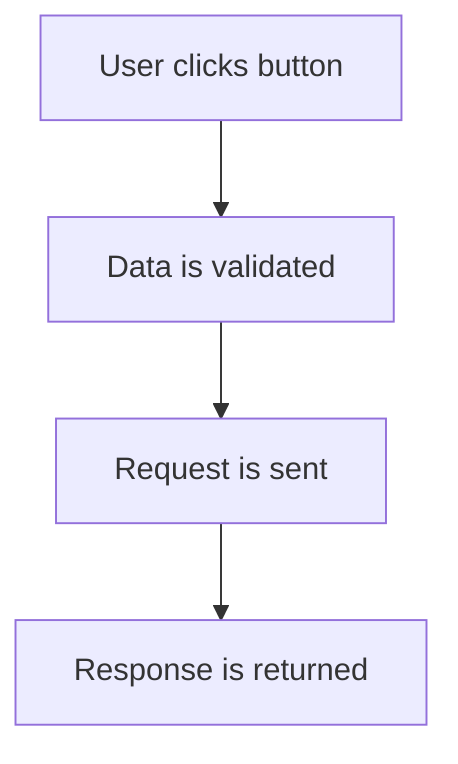
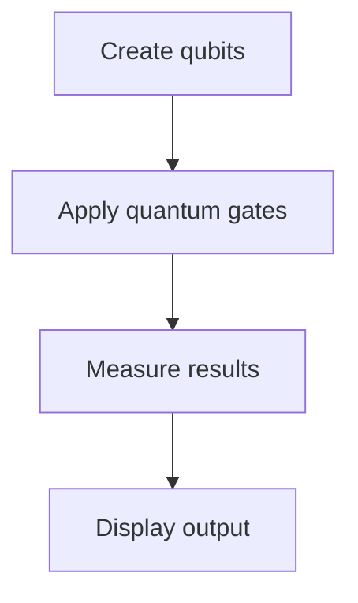

# {{ $frontmatter.title }} 관련

```component VPCard
{
  "title": "Qiskit > Article(s)",
  "desc": "Article(s)",
  "link": "/programming/py-qiskit/articles/README.md",
  "logo": "/images/ico-wind.svg",
  "background": "rgba(10,10,10,0.2)"
}
```

```component VPCard
{
  "title": "Matplotlib > Article(s)",
  "desc": "Article(s)",
  "link": "/programming/py-matplotlib/articles/README.md",
  "logo": "/images/ico-wind.svg",
  "background": "rgba(10,10,10,0.2)"
}
```

[[toc]]

---

<SiteInfo
  name="How to Write Your First Quantum Circuit in Python: A Beginner's Step-by-Step Guide"
  desc="Imagine opening your laptop and writing code that follows the laws of Quantum Physics. Sounds like science fiction, right? That's exactly what I thought the first time I heard about quantum computing."
  url="https://freecodecamp.org/news/how-to-write-your-first-quantum-circuit-in-python-a-beginner-s-step-by-step-guide"
  logo="https://cdn.freecodecamp.org/universal/favicons/favicon.ico"
  preview="https://cdn.hashnode.com/uploads/covers/5e1e335a7a1d3fcc59028c64/ce5d0476-b953-4865-810b-3f86021152c7.png"/>

Imagine opening your laptop and writing code that follows the laws of Quantum Physics. Sounds like science fiction, right?

That's exactly what I thought the first time I heard about quantum computing. I assumed quantum computers were machines hidden inside secret laboratories. I imagined researchers in white coats working with equipment worth millions of dollars.

Then I discovered something surprising: you can write and run your first quantum program using Python on a regular laptop.

No quantum computer required. No physics degree required. No advanced mathematics required.

Just Python.

In this tutorial, you'll learn how to build your first quantum circuit using Python and Qiskit.

By the end, you'll understand what a quantum circuit is, how qubits work, and how to create one of the most famous experiments in quantum computing called a Bell State.

Let's get started.

---

## What Is Quantum Computing?

Most software developers work on **regular computers**, just like yours - a laptop, smartphone, or gaming console.

Every one of these devices processes information using bits. A bit can only have one value at a time: `0 or 1` Nothing in between.

Quantum computers use something different. They use **qubits**. A qubit can behave like a `0` and a `1` at the same time until it's measured.

Don't worry if that sounds strange. It sounds strange to everyone the first time.

Think about a coin. When a coin is lying flat on a table, it's either heads or tails. That's exactly how a regular computer bit works. But now, imagine spinning that coin. While it's spinning, it's a blur of both heads and tails at the same time. That's exactly how a quantum bit works

This isn't a perfect explanation. But it's a useful one for beginners.

This ability allows quantum computers to solve certain types of problems differently from regular computers.

### Why Should Python Developers Care About Quantum Computing?

You might be thinking: "I'm a Python developer. Why should I learn quantum computing?"

Good question.

The truth is that quantum computing is still in its early stages, but so was artificial intelligence a few years ago. Developers who learn early often gain an advantage.

Python has become one of the most popular languages for quantum programming because it is simple and beginner friendly. Many major quantum platforms provide Python libraries. These include:

- [<VPIcon icon="iconfont icon-ibm"/>IBM Qiskit](https://ibm.com/quantum/qiskit)
- [Google Cirq (<VPIcon icon="fa-brands fa-medium"/>`@adnanmasood`)](https://medium.com/@adnanmasood/quantum-sundays-24-cirq-for-noisy-intermediate-scale-quantum-nisq-circuit-programming-c2c3f951d21d)
- [<VPIcon icon="fa-brands fa-aws"/>Amazon Braket](https://aws.amazon.com/braket/)

Among these options, Qiskit is one of the easiest places to start. That's what you'll use in this tutorial.

If you already know variables, functions, and basic Python syntax, you're ready to begin.

---

## What Is a Quantum Circuit?

If you've built web applications before, you're probably familiar with workflows.

For example:



A quantum circuit works in a similar way. Instead of processing user input, it processes qubits.

A quantum circuit is simply a sequence of instructions applied to qubits.

Here's a simplified view:



At its core, a quantum circuit simply involves initializing qubits, performing operations, and measuring the results.

---

## Quantum Gates Explained Like a Python Developer

If you've written Python before, you've probably changed values many times.

For example:

```py
light = False
light = not light
print(light)
#
# True
```

The `not` operator changes the value. It takes `False` and turns it into `True`.

Quantum computers also need ways to change values. Instead of using operators like `not`, they use something called **quantum gates**.

Think of quantum gates as special instructions that tell a qubit what to do.

Just like Python has:

- `not`
- `+`
- `-`
- `*`

Quantum computing has:

- X Gate
- H Gate
- CX Gate

Let's understand them one at a time.

### X Gate: The Quantum Light Switch

Imagine the light switch in your room.

When the switch is OFF: `OFF`. Press the switch. Now it becomes: `ON`. Press it again. It becomes `OFF`.

The switch keeps flipping between the two states, and that's exactly what the X Gate does.

### Classical Example

```plaintext
0 → 1
1 → 0
```

### Quantum Example

```plaintext
qc.x(0)
```

This means: Apply an X Gate to qubit `0`.

If qubit `0` was behaving like a `0`, it now behaves like a `1`.

If it was behaving like a `1`, it becomes a `0`.

Think of the `X Gate` as the quantum version of a light switch or a Python `not` operator.

### H Gate: The Spinning Coin Trick

Now things get interesting. Imagine I place a coin on a table. It can only be `Heads` or `Tails`, right?

That's how a normal computer works. A bit is either `0` or `1`

Now imagine I spin that coin. While it's spinning, can you confidently say it's heads at any given moment?

No.

Can you confidently say it's tails?

No.

It hasn't landed yet. It's in a special state where both outcomes are possible.

That's the easiest way to think about what the [<VPIcon icon="fas fa-globe"/>H Gate](https://quera.com/glossary/hadamard-gate) (or Hadamard Gate) does.

::: tip  Example

```plaintext
qc.h(0)
```

This tells Qiskit to put qubit `0` into a superposition.

In beginner language, the qubit is no longer locked to just `0` or just `1`. It now has a chance of becoming either when we measure it. Think of it like a spinning coin waiting to land.

:::

::: tabs

@tab:active Before H Gate:

```plaintext
0
```

@tab After H Gate:

```plaintext
0 and 1 are both possible
```

:::

This idea is one of the reasons quantum computers are so powerful.

Instead of exploring only one possibility at a time, they can work with multiple possibilities.

### CX Gate: Making Two Qubits Work Together

The **CX Gate**, also called the **CNOT (Controlled NOT Gate)**, is different from the X and H gates because it works with two qubits instead of one.

To understand how it works, let's use a simple real-life example.

Imagine you and your friend are playing a game. Before the game starts, you both agree on one rule.

If you raise your hand, your friend must immediately switch what they're doing. If they were standing, they should sit. If they were sitting, they should stand.

But if you keep your hand down, your friend does nothing and stays exactly as they are.

Notice something important: your friend's action depends entirely on what you do. They don't decide on their own.

That's very similar to how the CX Gate works.

Here's how we use it in Qiskit:

```plaintext
qc.cx(0, 1)
```

This line tells Qiskit: "Use qubit `0` to control what happens to qubit `1`."

In this case:

```plaintext
Qubit 0 → Control qubit

Qubit 1 → Target qubit
```

The control qubit makes the decision, and the target qubit responds.

#### Here's what happens behind the scenes:

If the control qubit is `0`, nothing happens. The target qubit stays exactly the same.

If the control qubit is `1`, the target qubit flips: `0` becomes `1`.

Think of the control qubit as a manager giving instructions to an employee. The employee doesn't act randomly. They only change what they're doing when the manager gives the signal.

By itself, the CX Gate is already useful.

But when we combine it with the Hadamard gate, something amazing happens. The two qubits become connected in a special way called entanglement. You'll learn about that later in this tutorial. Now, it's time to practice what you've learned using Python.

### How to Set Up Your Python Environment

Here comes the fun part. Let's prepare your machine. Before you continue, make sure Python is installed on your local computer. For this tutorial, use Python version `3.12.8` or `3.13.8`. Those versions work well with all the dependencies you'll be installing.

```properties
3.12.8
```

#### Step 1: Create a New Project Folder

Create a folder called: <VPIcon icon="fas fa-folder-open"/>`quantum-python` and then open it in VS Code.

#### Step 2: Create a Virtual Environment

In your terminal (here I'm using Git Bash), run:

```sh
python -m venv .venv
```

Then activate it. On Windows using Git Bash, run:

```sh
source .venv/Scripts/activate
```

And on MacOS/Linux:

```sh
source .venv/bin/activate
```

#### Step 3: Install Qiskit

Run:

```sh
pip install qiskit qiskit-aer matplotlib
```

This installs:

- Qiskit
- Quantum simulator
- Chart visualization tools

#### Step 4: Verify Installation

Create a file called: <VPIcon icon="fa-brands fa-python"/>`test.py`

```py title="test.py"
import qiskit

print(qiskit.__version__)
```

Run:

```sh
python test.py
```

If you see a version number, you're ready.

Congratulations! You've officially entered the world of quantum programming.

---

## Building Your First Quantum Circuit

Create a new file called <VPIcon icon="fa-brands fa-python"/>`bell_state.py`. This file will contain your first quantum program.

Now you need to import Qiskit. Add:

```py title="bell_state.py"
from qiskit import QuantumCircuit

qc = QuantumCircuit(2, 2)
```

This imports the `QuantumCircuit` class.

What does this mean? QuantumCircuit(2, 2) creates 2 qubits and 2 classical bits.

The classical bits will store the final results after measurement.

Let's print the circuit.

```py
print(qc)
#
# q_0:
# q_1:
# c:
```

Right now, nothing is happening. The circuit is empty. You're about to change that.

### Creating Superposition

Let's add our first quantum gate: `qc.h(0)`.

This applies a Hadamard Gate to qubit `0`.

Your code becomes:

```py
from qiskit import QuantumCircuit

qc = QuantumCircuit(2, 2)

qc.h(0)

print(qc)
#
#       ───
# q_0: ┤ H  ├
#       ───
# q_1: ─────
#           
# c: 2/═════
```

The H gate places qubit `0` into superposition. This is where quantum behavior begins.

You have officially created your first quantum state.

### Creating Entanglement With the CNOT Gate

So far, we've only worked with a single qubit. Let's do something much more interesting.

You can make two qubits work together. This phenomenon is called **entanglement**.

If you've spent time on tech Twitter or watched science videos on YouTube, you've probably heard people call entanglement "spooky action at a distance."

Don't worry about the fancy name, just focus on the code.

Add this line beneath your Hadamard gate: `qc.cx(0, 1)`.

Your program should now look like this:

```py
from qiskit import QuantumCircuit

qc = QuantumCircuit(2, 2)

qc.h(0)

qc.cx(0, 1)

print(qc)
#
#       ───     
# q_0: ┤  H ├─■──
#       ───  ─┴─
# q_1: ────┤ X  ├
#             ───
# c: 2/══════════
```

But what exactly happened?

The first qubit entered superposition when we applied the H gate. The CNOT gate then linked the second qubit to the first. Now the two qubits behave as a connected system, not two separate pieces of information. Just one shared quantum state.

Think about two perfectly synchronized dice. Every time you roll them, they somehow always show the same number.

Sounds impossible, right? That's because it is impossible in normal classical computing.

But quantum mechanics plays by different rules.

### Measuring the Qubits

Right now our qubits exist in a quantum state, but computers can't display quantum states directly.

We need to measure them. Measurement converts quantum information into classical information.

Add the following line: `qc.measure([0, 1], [0, 1])`.

Your code now becomes:

```py
from qiskit import QuantumCircuit
qc = QuantumCircuit(2, 2)
qc.h(0)
qc.cx(0, 1)
qc.measure([0, 1], [0, 1])
print(qc)
```

What does this line do?

It means:

- Measure qubit `0`
- Store result in classical bit `0`

and

- Measure qubit `1`
- Store result in classical bit `1`

At this point our circuit is complete. Now we need to execute it.

### Running the Circuit on a Quantum Simulator

Here's the cool part. You don't need a quantum computer. Your laptop can simulate one.

Create a new section beneath your circuit.

```py
from qiskit_aer import AerSimulator
simulator = AerSimulator()
result = simulator.run(
    qc,
    shots=1024
).result()

counts = result.get_counts()
print(counts)
```

Let's break it down.

#### What Is AerSimulator That You Installed?

AerSimulator is Qiskit's local quantum simulator.

Instead of sending your program to a real quantum machine, it runs everything on your computer.

This is perfect for learning and experimentation, and it's completely free.

#### What Are Shots?

Notice this line: `shots=1024`.

A shot is a single execution of the quantum circuit. Quantum outcomes are probabilistic, which means that one execution isn't enough.

Running 1,024 shots lets us see the overall pattern.

Think of it like flipping a coin. One flip tells you nothing but a thousand flips reveal the probabilities.

### Your Complete Bell State Program

At this point your file should look like this:

```py title="bell_state.py"
from qiskit import QuantumCircuit
from qiskit_aer import AerSimulator

qc = QuantumCircuit(2, 2)
qc.h(0)
qc.cx(0, 1)
qc.measure([0, 1], [0, 1])

simulator = AerSimulator()
result = simulator.run(
    qc,
    shots=1024
).result()

counts = result.get_counts()
print(counts)
```

Save the file.

Run:

```sh
python bell_state.py
#
# {
#     '00': 504,
#     '11': 520
# }
```

Your numbers will be slightly different, which is normal. The important thing is that you see: `00`and `11`.

You should never see: `01` or `10`

And that's the clue that tells us entanglement is working.

### For Windows Users: A Common Qiskit Aer Error

If you're using Windows, you might run into this error when importing `AerSimulator`:

```plaintext
ImportError: DLL load failed while importing controller_wrappers:
The specified module could not be found.
```

This usually isn't a problem with your code. It happens because Microsoft Visual C++ Redistributable 2015–2022 (x64) isn't installed on your system.

To fix it:

1. Download and install the Microsoft Visual C++ Redistributable 2015–2022 (x64) from the official [<VPIcon icon="fa-brands fa-windows"/>Microsoft website](https://learn.microsoft.com/en-us/cpp/windows/latest-supported-vc-redist?view=msvc-170).
2. Restart your computer.
3. Reopen your terminal and run your program again.

Once the runtime is installed, `AerSimulator` should import successfully, and you can continue with the rest of the tutorial.

### Other Common Mistakes Beginners Make

If your code doesn't work immediately, don't panic. Everyone hits errors.

Common issues include:

#### Module Not Found

```plaintext
ModuleNotFoundError
```

Solution: `pip install qiskit`.

#### Wrong Virtual Environment

Make sure your virtual environment is activated before running the script.

#### Missing Simulator

Install: 

```sh
pip install qiskit-aer
```

#### Indentation Errors

Remember that Python cares about spacing. Check your indentation carefully.

---

## Visualizing Results With a Histogram

Developers love visual feedback. A chart makes quantum behavior easier to understand. You can create one.

Add:

```py
from qiskit.visualization import plot_histogram
import matplotlib.pyplot as plt

plot_histogram(counts)

plt.show()
```

Your <VPIcon icon="fa-brands fa-python"/>`bell_state.py` file will now look like this:

```py :collapsed-lines title="bell_state.py"
# IMPORT DEPENDENCIES
from qiskit import QuantumCircuit
from qiskit_aer import AerSimulator
from qiskit.visualization import plot_histogram 
import matplotlib.pyplot as plt

# Create a Quantum Circuit with 2 qubits and 2 classical bits
qc = QuantumCircuit(2, 2)

# Create a Bell state (entanglement) using a Hadamard and a CNOT gate
qc.h(0)
qc.cx(0, 1)

# Measure all qubits into their corresponding classical bits
qc.measure([0, 1], [0, 1])


# Initialize the Aer simulator and execute the circuit for 1024 shots
simulator = AerSimulator()
result = simulator.run(
    qc,
    shots=1024
).result()

# Gather the resulting measurement counts
counts = result.get_counts()

# Print raw text counts and plot the histogram data
print(counts)
plot_histogram(counts) 
plt.show()
```

Run your program again, a histogram should appear.

It will look something like this:


::: info

For the complete project folder, you can get it from [Github (<VPIcon icon="iconfont icon-github"/>`nuelcas/quantum-python`)](https://github.com/nuelcas/quantum-python.git).

<SiteInfo
  name="nuelcas/quantum-python"
  desc="Writing your first Quantum Circuit using Python"
  url="https://github.com/nuelcas/quantum-python/"
  logo="https://github.githubassets.com/favicons/favicon-dark.svg"
  preview="https://opengraph.githubassets.com/14949d7da343f95f00a07984375e775c2839ad4d4575587552a3053005351bfd/nuelcas/quantum-python"/>

:::

---

## Understanding What Just Happened

Let's pause for a second because something incredible just happened.

- You created entanglement using Python on your laptop without owning a quantum computer.
- The first qubit entered superposition.
- The second qubit became linked to it.

When measurement happened, both became `0` or both become `1`. The outcome was random, but they always agreed. That's the key observation.

---

## What Is a Bell State?

The Bell State is one of the most famous examples in quantum computing. It's often the first experiment beginners learn.

Why? Because it demonstrates two important quantum ideas:

- Superposition
- Entanglement

Without Bell States, many quantum algorithms wouldn't exist because:

1. Quantum communication systems depend on them.
2. Quantum cryptography depends on them.
3. Future quantum networks depend on them.

The Bell State is basically the "Hello World" of quantum computing. Every quantum developer encounters it sooner or later.

### Why Bell States Matter

At first glance, this experiment seems small: Two qubits, Two gates, and a few lines of Python. Yet, the idea behind it is huge.

Bell States do much more than demonstrate entanglement. Researchers use them as benchmark experiments to verify that quantum hardware can reliably create and measure entangled qubits.

For example, Bell State circuits are commonly executed on superconducting quantum processors to evaluate how accurately the hardware prepares entangled states before running more complex quantum algorithms.

Bell States also play an important role in quantum communication and serve as building blocks for larger quantum algorithms.

Think of them like functions in programming. A single function may seem small but complex applications are built from thousands of them.

The same idea applies here. Large quantum systems are built from smaller quantum operations.

---

## Real World Applications of Quantum Entanglement

A common question beginners ask is: "When will I actually use this?"

Fair question.

Here are some real examples.

### Quantum Cryptography

While traditional encryption relies on mathematical difficulty, quantum cryptography relies on the laws of physics, ensuring that any attempt to intercept data changes the quantum state and makes eavesdropping immediately detectable.

### Quantum Networking

Researchers developing quantum internet technologies are heavily leveraging quantum entanglement to connect quantum devices across large distances.

### Drug Discovery

Quantum computers may eventually simulate molecules more accurately than classical computers. This could help researchers discover new medicines, improve materials, and understand chemical reactions.

### Financial Modeling

Large financial institutions are exploring quantum algorithms for:

- Portfolio optimization
- Risk analysis
- Market simulation

The field is still developing, but the potential is enormous.

---

## Beginner Experiments to Try

The best way you can learn quantum computing is exactly how developers learn programming:

- Break things.
- Experiment.
- Change the code.
- Observe the results.

Let's try a few simple experiments.

### Experiment 1: Remove the Hadamard Gate

Delete: `qc.h(0)` and run the circuit again. What changes?

Observe the output. Why do you think that happened?

### Experiment 2: Increase the Number of Shots

Change: `shots=1024` to `shots=100000`.

Run the simulation again. Notice how the results become more balanced. This is probability in action.

### Experiment 3: Add an X Gate

Insert: `qc.x(1)` before the CNOT gate.

Run the circuit.

While studying the new output distribution, try predicting the results before running the code.

### Experiment 4: Create Three Qubits

Change: `QuantumCircuit(2, 2)` to `QuantumCircuit(3, 3)`.

Can you create a larger entangled system? Experiment and see.

---

## What Should You Learn Next?

You've now built your first quantum circuit. That's a big milestone.

Here are some great next steps you can explore through [<VPIcon icon="iconfont icon-ibm"/>IBM Quantum Platform](https://quantum.cloud.ibm.com/learning/en):

- X Gate
- Y Gate
- Z Gate
- S Gate
- T Gate

### Build Larger Circuits

Try:

- GHZ States
- Quantum Teleportation
- Deutsch Algorithm

### Explore Real Quantum Hardware

IBM allows developers to run circuits on actual quantum computers. This is one of the coolest experiences in modern programming.

### Learn Quantum Algorithms

Once you're comfortable with circuits, explore:

- Grover's Algorithm
- Shor's Algorithm
- Quantum Fourier Transform

---

## Final Thoughts

A few years ago, quantum computing felt impossible to approach. It seemed reserved for physicists and researchers.

Today, that's no longer true. If you know Python, you already have a pathway into quantum development.

In this tutorial, you learned:

- What quantum computing is
- How qubits differ from bits
- What quantum gates do
- How to install Qiskit
- How to create a Bell State
- How to simulate a quantum circuit
- How to visualize results
- Why entanglement matters

Most importantly, you wrote your first quantum program. That's how every quantum developer starts.

One circuit. One experiment. One curiosity-driven question at a time.

Now open your editor and modify the code. Break things. Try new gates. And start exploring the quantum world for yourself.

<!-- TODO: add ARTICLE CARD -->
```component VPCard
{
  "title": "How to Write Your First Quantum Circuit in Python: A Beginner's Step-by-Step Guide",
  "desc": "Imagine opening your laptop and writing code that follows the laws of Quantum Physics. Sounds like science fiction, right? That's exactly what I thought the first time I heard about quantum computing.",
  "link": "https://chanhi2000.github.io/bookshelf/freecodecamp.org/how-to-write-your-first-quantum-circuit-in-python-a-beginner-s-step-by-step-guide.html",
  "logo": "https://cdn.freecodecamp.org/universal/favicons/favicon.ico",
  "background": "rgba(10,10,35,0.2)"
}
```
