# {{ $frontmatter.title }} 관련

```component VPCard
{
  "title": "TypeScript > Article(s)",
  "desc": "Article(s)",
  "link": "/programming/ts/articles/README.md",
  "logo": "/images/ico-wind.svg",
  "background": "rgba(10,10,10,0.2)"
}
```

```component VPCard
{
  "title": "LLM > Article(s)",
  "desc": "Article(s)",
  "link": "/ai/llm/articles/README.md",
  "logo": "/images/ico-wind.svg",
  "background": "rgba(10,10,10,0.2)"
}
```

```component VPCard
{
  "title": "Computer Engineering > Article(s)",
  "desc": "Article(s)",
  "link": "/academics/coen/articles/README.md",
  "logo": "/images/ico-wind.svg",
  "background": "rgba(10,10,10,0.2)"
}
```

[[toc]]

---

<SiteInfo
  name="How to Migrate a Legacy Monolith Incrementally Without a Big-Bang Rewrite"
  desc="Large legacy migrations often fail long before the final cutover. The failure usually starts when the migration is framed as a single event. Move the application. Move the database. Move all the users"
  url="https://freecodecamp.org/news/migrate-legacy-monolith-incrementally"
  logo="https://cdn.freecodecamp.org/universal/favicons/favicon.ico"
  preview="https://cdn.hashnode.com/uploads/covers/5e1e335a7a1d3fcc59028c64/086653d6-268e-4d13-8f7d-b42c92847361.png"/>

Large legacy migrations often fail long before the final cutover.

The failure usually starts when the migration is framed as a single event. Move the application. Move the database. Move all the users. Switch the traffic. Turn the old system off.

That creates a dangerous assumption: the legacy system and the new system need to exchange places all at once.

They usually don't.

If you already understand the legacy behavior, protect it with characterization tests, create migration-friendly boundaries, and compare old and new implementations, you have another option.

You can migrate one capability at a time. That changes the problem completely.

Instead of:

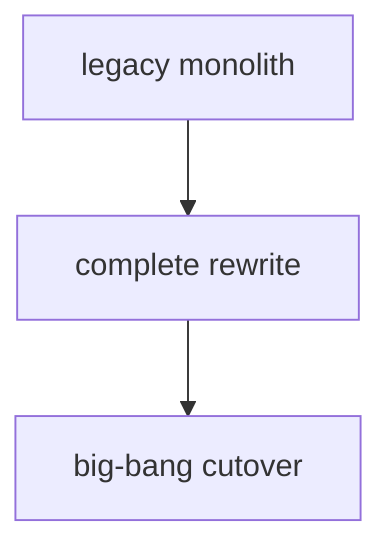

you can move toward:

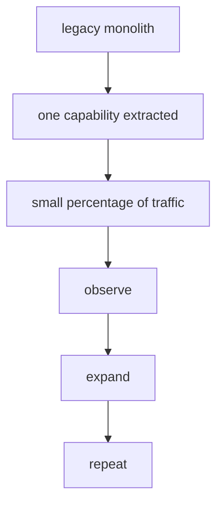

The goal isn't to make the migration slower. The goal is to make each change smaller, observable, and reversible.

In this tutorial, I'll show you how to migrate a legacy monolith incrementally by:

- choosing a safe first migration slice
- defining a boundary between legacy and new code
- routing requests between implementations
- using the Strangler Fig pattern
- migrating by business capability instead of technical layer
- keeping old and new implementations running together
- introducing progressive traffic
- detecting failures before full cutover
- designing rollback paths
- handling data ownership carefully
- removing migrated legacy behavior
- using AI without turning an incremental migration into an automated rewrite

The examples use TypeScript, but the approach applies to most languages, runtimes, and architectures.

The objective is simple: make migration a sequence of controlled changes instead of one irreversible event.

::: note Prerequisites

To follow along, you should be comfortable with:

- TypeScript or a similar language
- API and service boundaries
- integration testing
- dependency injection
- routing and reverse proxies
- database transactions
- observability
- incremental refactoring
- legacy modernization

You should also already understand the behavior of the capability you want to migrate.

Ideally, you know:

- its inputs
- its outputs
- its important business rules
- its side effects
- its dependencies
- its external contracts
- how you'll detect behavioral differences

If you haven't reached that point yet, migration may be premature.

:::

---

## Why Big-Bang Migrations Are So Risky

Imagine a legacy commerce application.

It contains:

```text
customers
orders
payments
inventory
shipping
invoicing
notifications
reporting
```

The modernization plan says:

```text
replace the monolith
```

That sounds like one project.

Operationally, it may mean changing:

```text
runtime
framework
database
deployment model
API contracts
authentication
networking
observability
data model
business logic
external integrations
```

at the same time.

If the final cutover fails, the number of possible causes is enormous.

For example:

```text
Did pricing change?

Did the database migration lose data?

Is the payment provider failing?

Did authentication behave differently?

Did the new runtime change date handling?

Did a timeout become shorter?

Did an event stop being published?

Did the new deployment configuration fail?
```

This is one of the central problems with big-bang migration: too many variables change together.

Incremental migration tries to reduce the number of changing variables at each step.

---

## Think in Migration Slices, Not Applications

Instead of asking:

> How do we migrate this monolith?

ask:

> What's the smallest meaningful business capability we can move independently?

For example:

```text
Calculate Order Total
Generate Invoice
Send Order Confirmation
Create Shipment
Renew Subscription
Approve Customer
```

A migration slice should ideally have:

```text
clear input
clear output
known side effects
understood dependencies
observable behavior
a rollback path
```

That gives you something concrete to move.

For example:

```text
Generate Invoice
```

might become:

```text
input:
orderId

behavior:
load order
calculate taxes
generate invoice number
create invoice

side effects:
store invoice
publish invoice.created

output:
invoice
```

That's much easier to migrate than:

```text
billing module
```

or:

```text
src/services/
```

Business capabilities make better migration units than folders.

---

## Choose the First Capability Carefully

The first slice matters.

I would usually avoid starting with the most critical capability in the system.

You want something meaningful enough to validate the migration approach, but not so dangerous that a mistake creates catastrophic consequences.

A useful first slice often has:

```text
moderate traffic
limited external dependencies
clear behavior
good test coverage
few transactional boundaries
low blast radius
```

For example:

```text
Generate Customer Statement
```

may be a better first migration candidate than:

```text
Authorize Payment
```

The first migration is partly technical work, but it's also a learning exercise.

You're validating:

```text
routing
deployment
observability
rollback
data access
testing
team workflow
```

before applying the pattern to more critical capabilities.

---

## Create a Boundary Between Legacy and New

Suppose the legacy application has:

```ts
async function generateInvoice(
  orderId: string
) {
  // legacy implementation
}
```

Before migration, introduce a boundary:

```ts
interface InvoiceGenerator {
  generate(
    orderId: string
  ): Promise<Invoice>;
}
```

The legacy implementation becomes:

```ts
class LegacyInvoiceGenerator
  implements InvoiceGenerator {
  async generate(
    orderId: string
  ): Promise<Invoice> {
    // existing behavior
  }
}
```

The new implementation becomes:

```ts
class NewInvoiceGenerator
  implements InvoiceGenerator {
  async generate(
    orderId: string
  ): Promise<Invoice> {
    // migrated behavior
  }
}
```

Now the caller doesn't need to know which implementation is active.

That creates an important capability:

```text
replace implementation
without replacing caller
```

which is one of the foundations of incremental migration.

---

## Use the Strangler Fig Pattern

A common way to describe incremental replacement is the Strangler Fig pattern.

Instead of replacing the entire application at once, new behavior gradually grows around the old system.

Conceptually:

```text
            incoming request
                   │
                   ↓
                router
              /        \
             /          \
      legacy path     new path
```

At first:

```text
legacy: 100%
new:      0%
```

Later:

```text
legacy: 95%
new:      5%
```

Then:

```text
legacy: 50%
new:     50%
```

Eventually:

```text
legacy:  0%
new:    100%
```

At that point, the old implementation for that capability can be removed.

The key is that the replacement happens gradually. The legacy application continues serving parts of the system while the new implementation takes over others.

---

## Migrate Capabilities, Not Technical Layers

One tempting migration strategy is:

```text
move database
then move services
then move APIs
then move UI
```

That can create long periods where every capability spans both old and new architecture.

For example:

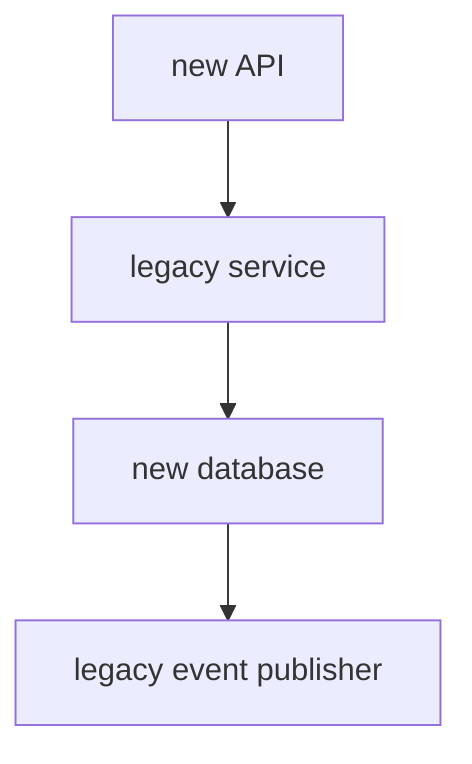

This is sometimes unavoidable.

But whenever possible, I prefer vertical slices.

A vertical slice might be:

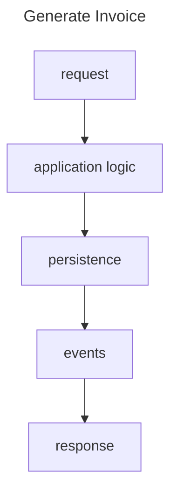

That capability can move as one coherent unit.

Then:

```text
Create Shipment
```

can move separately.

Then:

```text
Renew Subscription
```

and so on.

This gives you working migrated capabilities earlier. It also reduces the number of temporary cross-system dependencies.

---

## Keep Legacy and New Implementations Running Together

During an incremental migration, coexistence is normal.

For some period of time, you may have:

```text
LegacyInvoiceGenerator
NewInvoiceGenerator
```

both deployed.

That's not duplication by accident. It's part of the migration strategy.

The important question is how requests choose between them.

You may use:

```text
feature flag
tenant
user group
request header
region
percentage rollout
specific account IDs
```

For example:

```ts
class InvoiceRouter {
  constructor(
    private readonly legacy:
      InvoiceGenerator,
    private readonly migrated:
      InvoiceGenerator
  ) {}

  async generate(
    orderId: string,
    useMigrated: boolean
  ) {
    if (useMigrated) {
      return this.migrated.generate(
        orderId
      );
    }

    return this.legacy.generate(
      orderId
    );
  }
}
```

This is deliberately simple. The important part is that routing is explicit. You know which implementation handled each request.

---

## Route Traffic Explicitly

Avoid migration logic that's difficult to observe.

For example:

```ts
try {
  return await newService.call();
} catch {
  return legacyService.call();
}
```

This may look resilient, but it can hide failures.

Suppose the new implementation fails 40% of the time. If every failure silently falls back to legacy, users may see no problem. But the migration isn't healthy.

The problem is that the first version mixes two decisions together: **which implementation should receive the request** and **what should happen when that implementation fails**. Because the fallback happens inside the `catch`, the migrated path can fail repeatedly without producing an explicit routing signal that you can measure.

A better approach is to make the routing decision first, record it, and then call the selected implementation. That separates migration policy from error handling and gives you a clear record of how much traffic actually reached each path.

For example:

```ts
const route =
  migrationPolicy.route(request);

metrics.increment(
  `invoice.route.${route}`
);

if (route === "migrated") {
  return migrated.generate(
    request.orderId
  );
}

return legacy.generate(
  request.orderId
);
```

Now you can measure:

```text
requests routed to legacy
requests routed to migrated
migration failures
fallback count
latency
business outcomes
```

Migration should be observable as a first-class system behavior.

---

## Start with Internal or Low-Risk Traffic

Before routing a large percentage of customers to the migrated path, start with safer traffic.

For example:

```text
development
test environments
internal users
staff accounts
test tenants
specific low-risk customers
```

This lets you validate:

```text
deployment
routing
observability
data access
external integrations
failure handling
```

with lower risk.

You can then expand.

For example:

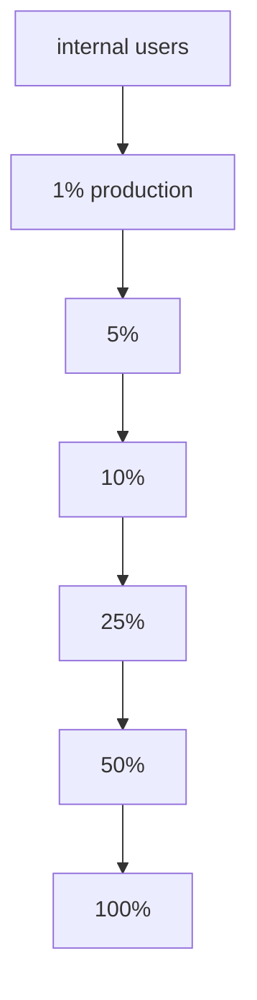

The exact percentages aren't important, but the principle is.

Each increase should happen because the previous stage produced enough evidence.

---

## Progressively Increase Production Traffic

Suppose you have:

```text
10,000 invoice requests/day
```

Instead of switching all requests:

```text
legacy → new
```

at once, route:

```text
1%
```

first.

That gives roughly:

```text
100 real requests/day
```

through the migrated path.

Now monitor:

```text
error rate
latency
output differences
side effects
customer-visible failures
business metrics
```

If the system behaves correctly, increase traffic. If it doesn't, reduce or disable migrated routing.

The migration becomes a controlled experiment. That's very different from a cutover event.

---

## Use Differential Testing Before and During Rollout

The [**previous article in this series focused on differential testing**](/freecodecamp.org/differential-testing-legacy-migration.md). That technique becomes especially useful here.

Differential testing means running the legacy and migrated implementations with the same input and comparing their observable behavior. Depending on the capability, that may include return values, errors, state changes, and side effects.

The goal isn't to prove that the implementations are internally identical. It's to detect meaningful behavioral differences before those differences reach all of your production traffic.

Before live routing, you can compare:

```text
same input
↓
legacy result

same input
↓
new result
```

During rollout, you can also sample real traffic and compare behavior where it is safe to do so.

For example:

```text
real request
      │
      ├────→ active implementation
      │
      └────→ shadow implementation
```

Then compare:

```text
output
errors
side effects
business state
```

This gives you evidence before increasing traffic.

A rollout decision can then be based on:

```text
divergence
error rate
latency
business outcomes
```

instead of:

> It seems fine.

---

## A Small End-to-End Invoice Migration Example

The individual pieces are easier to understand when you see them working together.

Here's a deliberately small, in-memory example based on the invoice capability we've been using throughout the article. It doesn't include a real database, reverse proxy, queue, or deployment platform. The point is to show the migration control flow in one place.

Start with a shared contract:

```ts
type InvoiceInput = {
  orderId: string;
  subtotal: number;
};

type Invoice = {
  orderId: string;
  total: number;
};

interface InvoiceGenerator {
  generate(
    input: InvoiceInput
  ): Promise<Invoice>;
}
```

The legacy implementation calculates the invoice total like this:

```ts
class LegacyInvoiceGenerator
  implements InvoiceGenerator {
  async generate(
    input: InvoiceInput
  ): Promise<Invoice> {
    return {
      orderId: input.orderId,
      total: input.subtotal * 1.21,
    };
  }
}
```

Now imagine we've migrated that capability into a new implementation:

```ts
class MigratedInvoiceGenerator
  implements InvoiceGenerator {
  async generate(
    input: InvoiceInput
  ): Promise<Invoice> {
    const tax =
      input.subtotal * 0.21;

    return {
      orderId: input.orderId,
      total: input.subtotal + tax,
    };
  }
}
```

The code is different, but the intended behavior is the same.

Next, define a deterministic rollout function. This example assigns each `orderId` to a bucket from 0 to 99 so the same order always follows the same route:

```ts
function bucketFor(
  value: string
): number {
  const sum = [...value].reduce(
    (total, char) =>
      total + char.charCodeAt(0),
    0
  );

  return sum % 100;
}

function shouldUseMigrated(
  orderId: string,
  percentage: number
): boolean {
  return (
    bucketFor(orderId) < percentage
  );
}
```

If `percentage` is `10`, roughly 10% of IDs will be assigned to the migrated path.

Now add some tiny in-memory metrics:

```ts
const metrics = {
  legacyRequests: 0,
  migratedRequests: 0,
  mismatches: 0,
};
```

Then put the legacy and migrated implementations behind one migration-aware entry point:

```ts :collapsed-lines
class IncrementalInvoiceService {
  migratedEnabled = true;
  rolloutPercentage = 10;

  constructor(
    private readonly legacy:
      InvoiceGenerator,
    private readonly migrated:
      InvoiceGenerator
  ) {}

  async generate(
    input: InvoiceInput
  ): Promise<Invoice> {
    const legacyResult =
      await this.legacy.generate(
        structuredClone(input)
      );

    const migratedResult =
      await this.migrated.generate(
        structuredClone(input)
      );

    if (
      migratedResult.orderId !==
        legacyResult.orderId ||
      migratedResult.total !==
        legacyResult.total
    ) {
      metrics.mismatches += 1;
    }

    const useMigrated =
      this.migratedEnabled &&
      shouldUseMigrated(
        input.orderId,
        this.rolloutPercentage
      );

    if (useMigrated) {
      metrics.migratedRequests += 1;
      return migratedResult;
    }

    metrics.legacyRequests += 1;
    return legacyResult;
  }
}
```

This small service combines several ideas from the article.

First, it runs both implementations with the same input and compares their results. Because this example is entirely in memory and has no external side effects, doing that is safe.

Second, it routes only a percentage of requests to the migrated result.

Third, it records how many requests used each path and how many behavioral mismatches occurred.

You can exercise it with a few requests:

```ts
const service =
  new IncrementalInvoiceService(
    new LegacyInvoiceGenerator(),
    new MigratedInvoiceGenerator()
  );

for (let i = 1; i <= 100; i++) {
  await service.generate({
    orderId: `order-${i}`,
    subtotal: 1000,
  });
}

console.log(metrics);
```

You might see something like:

```text
legacyRequests:   89
migratedRequests: 11
mismatches:        0
```

The exact split may not be exactly 90/10 with only 100 inputs because the bucket function is intentionally simple. The important point is that routing is deterministic, measurable, and controlled by `rolloutPercentage`.

If the migrated implementation starts producing differences, the mismatch counter gives you an observable signal.

And if you decide the rollout should stop, rollback is explicit:

```ts
service.migratedEnabled = false;
```

From that point forward, all returned responses come from the legacy implementation again.

This is intentionally a simplified example. A production system would need stronger routing, real metrics, error handling, persistent state, and careful treatment of side effects.

In particular, you shouldn't blindly execute both implementations if generating an invoice sends email, writes to two production databases, charges a customer, or publishes externally visible events. In those cases, the shadow path needs recording adapters, isolated infrastructure, or another mechanism that lets you compare behavior without duplicating real effects.

But the control loop is the same:

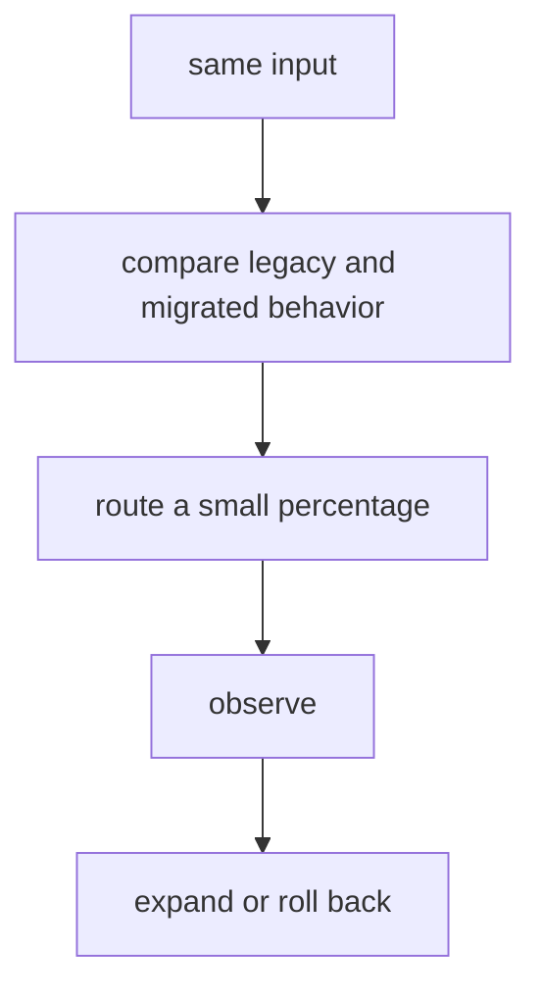

That is incremental migration in its smallest useful form.

---

## Design Rollback Before You Need It

Rollback shouldn't be invented during an incident. Before moving traffic, ask what happens if the migrated path fails.

For routing-level migrations, rollback may be simple:

```text
migration flag = false
```

and traffic returns to:

```text
legacy implementation
```

For example:

```ts
if (
  featureFlags.useNewInvoices
) {
  return migrated.generate(
    orderId
  );
}

return legacy.generate(orderId);
```

If the migrated path behaves incorrectly:

```text
useNewInvoices = false
```

Rollback is almost immediate.

But rollback becomes more complicated when:

```text
data format changes
new data is written
events differ
external systems are updated
legacy code cannot read new records
```

In those cases, rollback may require more than flipping a feature flag. You might need backward-compatible schemas so both versions can read the same records, compensating actions for external side effects, replayable events, reconciliation jobs, or a short period where the legacy system remains able to consume data written by the new path.

For higher-risk migrations, it can also help to define a rollback boundary in advance. For example: traffic can return to legacy until a new schema version is written, or after a particular external event is emitted, recovery requires compensation instead of a simple rollback. The important part is knowing when rollback is still reversible and when you've crossed into a different recovery strategy.

That's why rollback design needs to happen before deployment.

---

## Treat Data Migration as a Separate Problem

Application migration and data migration are related, but they aren't the same problem.

Suppose the legacy system stores:

```json
{
  "customer_type": "P",
  "status": 2
}
```

while the new system stores:

```json
{
  "customerType": "PREMIUM",
  "status": "APPROVED"
}
```

You now need to answer:

```text
Which database is authoritative?

Can both systems read the same data?

Do we transform on read?

Do we migrate records in batches?

Do we replicate changes?

When does ownership change?
```

These decisions should be explicit. Otherwise the application migration may appear successful while the data boundary remains ambiguous.

---

## Be Careful with Dual Writes

One common transition strategy is:

```text
write to legacy database
+
write to new database
```

This is called dual writing, and it looks simple.

For example:

```ts
await legacyOrders.save(order);
await newOrders.save(order);
```

But what happens if:

```text
legacy write succeeds
new write fails
```

Now the two systems disagree.

Or:

```text
legacy write fails
new write succeeds
```

Same problem.

Dual writes create a distributed consistency problem.

If you use them, you need to think about:

```text
retries
idempotency
reconciliation
ordering
partial failure
monitoring
```

Sometimes a safer approach is:

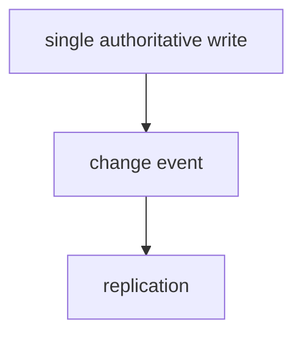

or a transactional outbox.

There's no universal solution. The important point is not to treat dual writing as a trivial migration technique.

---

## Decide Who Owns the Data

During coexistence, data ownership can become confusing.

Imagine:

```text
legacy system writes customers

new system writes invoices

both systems read orders
```

That may be perfectly reasonable, but it should be documented.

For each migrated capability, define:

```text
system of record
write owner
readers
replication direction
consistency expectations
```

For example:

```text
Invoices

Write owner:
new system

Source of truth:
new database

Legacy access:
read-only adapter

Replication:
new → legacy reporting store
```

Now the architecture has an explicit direction.

Without ownership rules, migrations often create permanent synchronization problems.

---

## Observe Business Behavior, Not Just Infrastructure

During rollout, teams often monitor:

```text
CPU
memory
latency
HTTP 500s
database connections
```

Those are important. But they're not enough.

Suppose:

```text
HTTP 200 rate = 99.99%
```

while:

```text
invoice totals are wrong
```

Infrastructure monitoring says:

```text
healthy
```

But the business system is not healthy.

Migration observability should include domain signals.

For example:

```text
orders processed
payments authorized
invoices generated
discount distribution
failed renewals
average invoice total
events published
```

If you know normal business behavior, unusual changes can expose migration defects that technical metrics miss.

---

## Know When a Migration Slice Is Complete

A capability isn't fully migrated just because traffic reached 100%.

Before declaring it complete, I would verify:

```text
100% traffic on new path
acceptable error rate
acceptable latency
behavioral differences resolved
side effects verified
data ownership established
rollback window completed
legacy callers removed
legacy writes stopped
observability in place
```

Then ask:

> Is the legacy implementation still serving any purpose?

If not, remove it.

Leaving both implementations permanently active creates:

```text
maintenance cost
confusion
duplicate bugs
unclear ownership
future migration debt
```

Incremental migration should eventually simplify the system, not permanently duplicate it.

---

## Remove the Legacy Path

This step is often delayed.

Teams migrate traffic but leave the old path in place:

```text
just in case
```

Months later:

```text
nobody knows whether it is still used
```

Before deleting it, verify:

```text
routing metrics show zero traffic
no callers depend on it
data dependencies are removed
rollback period is complete
operational documentation is updated
```

Then remove:

```text
legacy implementation
legacy feature flags
legacy database access
unused integration code
temporary compatibility layers
```

Deletion is part of migration.

A migration that only adds new architecture without removing old architecture can increase complexity rather than reduce it.

---

## How to Use AI During an Incremental Migration

AI can help with many parts of this process.

For example, it can inspect the legacy codebase and help answer:

```text
Which modules implement this capability?

Which callers depend on it?

Which database tables does it touch?

Which external services does it call?

Which side effects occur?

Which feature flags already exist?

Which paths need adapters?
```

A useful prompt might be:

```md title="prompt"
Analyze the Generate Invoice capability.

Identify:

1. entry points,
2. business rules,
3. persistence dependencies,
4. external integrations,
5. side effects,
6. callers,
7. data ownership,
8. possible migration seams.

Do not redesign the system.

Return evidence for each finding using file paths
and relevant code references.
```

AI can also help compare migration changes.

For example:

```md title="prompt"
Compare the legacy and migrated implementations.

Identify possible behavioral differences in:

- return values,
- errors,
- side effects,
- persistence,
- event ordering,
- retries,
- idempotency,
- transaction boundaries.

Do not assume the new implementation is correct.
```

This is useful because migration involves a lot of repetitive analysis, and AI can accelerate that analysis.

### Don't Let AI Turn the Migration into a Rewrite

There's a common failure mode.

You ask:

> Help me migrate this legacy capability.

The model responds with:

```text
new architecture
new domain model
new API
new event model
new database schema
new validation layer
new framework
```

At that point, you're no longer migrating one capability, you're redesigning it.

Sometimes redesign is necessary, but it should be intentional.

During incremental migration, I prefer prompts with explicit constraints.

::: tip For example:

```md title="prompt"
Migrate this capability without intentionally changing
observable behavior.

Preserve:

- inputs,
- outputs,
- errors,
- side effects,
- ordering where relevant,
- transactional behavior.

Only introduce the minimum structural changes required
to run it in the target environment.

List any behavior you cannot preserve with confidence.
```

That keeps the transformation narrow.

:::

AI should help reduce mechanical effort. It shouldn't silently expand project scope.

---

## A Practical Incremental Migration Workflow

Here's the workflow I would use.

### 1. Understand the Capability

Identify:

```text
inputs
outputs
rules
side effects
dependencies
unknowns
```

### 2. Characterize Existing Behavior

Protect important behavior with:

```text
characterization tests
integration tests
contract tests
```

### 3. Refactor for Migration

Create:

```text
seams
adapters
explicit dependencies
clear orchestration
```

without intentionally changing behavior.

### 4. Build the New Implementation

Implement the capability in the target environment. Keep its observable contract clear.

### 5. Differentially Test Old and New

Compare:

```text
outputs
errors
side effects
business state
```

using representative cases.

### 6. Introduce Explicit Routing

Allow requests to choose:

```text
legacy
or
migrated
```

through an observable migration policy.

### 7. Start with Safe Traffic

Use:

```text
internal users
test tenants
selected customers
```

### 8. Increase Traffic Gradually

For example:

```text
1%
5%
10%
25%
50%
100%
```

only when evidence supports the next stage.

### 9. Monitor Technical and Business Metrics

Observe both:

```text
system health
business behavior
```

### 10. Keep Rollback Available

Make returning to the legacy path fast and understood.

### 11. Transfer Data Ownership

Explicitly define which system owns:

```text
writes
reads
replication
```

### 12. Remove the Legacy Path

After the migration has stabilized:

```text
delete old implementation
remove temporary routing
remove obsolete dependencies
```

Then choose the next capability.

---

## What Incremental Migration Doesn't Solve

Incremental migration reduces risk, but it doesn't eliminate complexity.

You may still need to deal with:

```text
distributed transactions
shared databases
old schemas
tight coupling
unsupported runtimes
poor test coverage
organizational ownership
regulatory constraints
```

There are also systems where partial migration is extremely difficult.

For example:

```text
highly stateful systems
strongly coupled desktop applications
large transactional batch systems
systems with shared global state
```

Sometimes the migration boundary needs to be larger.

The principle remains the same:

> Make the smallest reversible change that produces useful migration progress.

Incremental doesn't always mean tiny. It means controlled.

---

## The Complete Legacy Modernization Workflow

This article closes the workflow we've been building throughout this series.

We started with a basic problem:

> How do you modernize a legacy application without accidentally turning the project into a rewrite?

The first step was understanding.

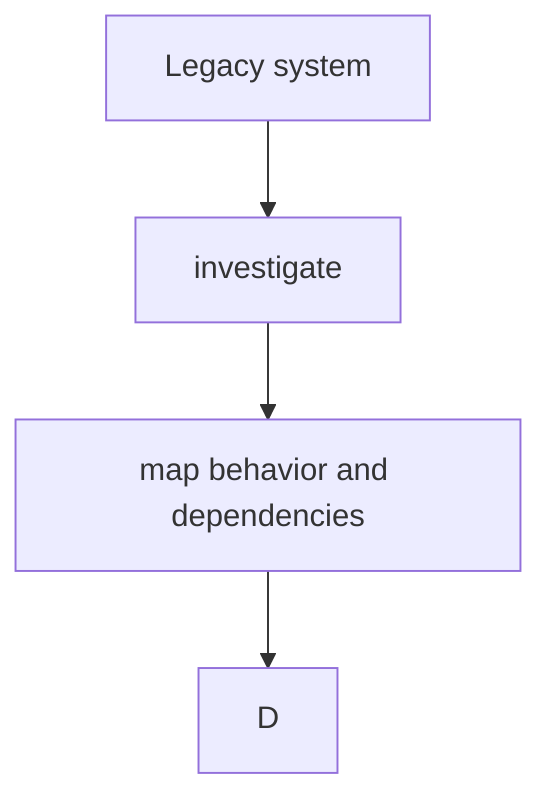

Then characterization.

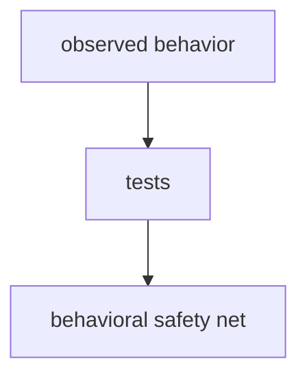

Then refactoring.

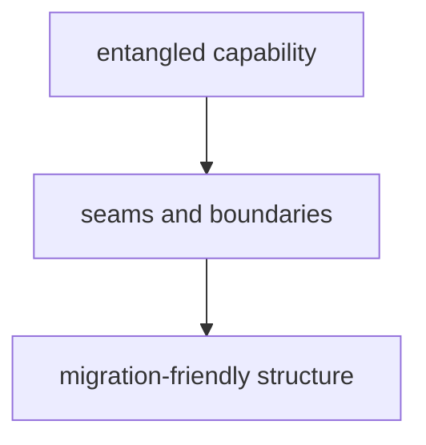

Then differential testing.

```text
legacy implementation
        +
new implementation
        ↓
behavior comparison
```

And finally incremental migration.

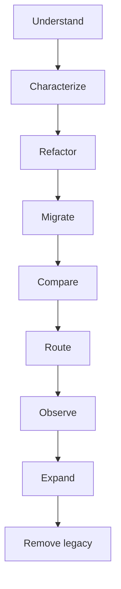

The sequence matters.

If you skip understanding, you may migrate the wrong behavior.

If you skip characterization, you may not notice behavioral changes.

If you skip refactoring, the migration boundary may remain too large.

If you skip comparison, differences remain hidden.

If you skip incremental rollout, you discover problems at full blast radius.

Each step reduces a different kind of uncertainty.

---

## Conclusion

Modernizing a legacy application doesn't require replacing everything at once.

In many cases, the safer strategy is to create a path where old and new implementations can coexist temporarily.

Move one capability, then compare it.

Route a small amount of traffic and observe what happens.

Increase traffic when the evidence supports it, and roll back when it doesn't.

Transfer ownership explicitly, then remove the legacy path.

And repeat.

The full workflow becomes:

```text
Understand
↓
Characterize
↓
Refactor
↓
Migrate incrementally
↓
Compare behavior
↓
Progressively route traffic
↓
Observe
↓
Remove legacy
```

AI can make every stage faster.

It can help map code, identify dependencies, generate adapters, compare implementations, analyze failures, and inspect migration diffs.

But speed isn't the same as confidence.

The important decisions still require engineering judgment:

```text
What behavior matters?

What can change?

What should remain compatible?

What is the migration boundary?

What evidence is enough?

When is rollback necessary?

When can the legacy path be removed?
```

Those aren't code-generation questions. They're migration decisions.

And that's the larger lesson behind this entire series.

AI makes it increasingly cheap to produce new code. But that doesn't make legacy modernization trivial. It makes the quality of the decisions around the code more important.

Because the safest migration is rarely the one that changes the most software. It's the one that lets you change the system while continuously knowing what changed, why it changed, and whether it's safe to keep going.

<!-- TODO: add ARTICLE CARD -->
```component VPCard
{
  "title": "How to Migrate a Legacy Monolith Incrementally Without a Big-Bang Rewrite",
  "desc": "Large legacy migrations often fail long before the final cutover. The failure usually starts when the migration is framed as a single event. Move the application. Move the database. Move all the users",
  "link": "https://chanhi2000.github.io/bookshelf/freecodecamp.org/migrate-legacy-monolith-incrementally.html",
  "logo": "https://cdn.freecodecamp.org/universal/favicons/favicon.ico",
  "background": "rgba(10,10,35,0.2)"
}
```
