# {{ $frontmatter.title }} 관련

```component VPCard
{
  "title": "NumPy > Article(s)",
  "desc": "Article(s)",
  "link": "/programming/py-numpy/articles/README.md",
  "logo": "/images/ico-wind.svg",
  "background": "rgba(10,10,10,0.2)"
}
```

[[toc]]

---

<SiteInfo
  name="Neural Networks Explained: What They Are and How to Build One in Python"
  desc="Have you ever wondered how a computer can recognize a handwritten number, predict whether an email is spam, recommend a video, or understand a sentence? A lot of modern AI systems rely on something ca"
  url="https://freecodecamp.org/news/neural-networks-explained-simply-in-python"
  logo="https://cdn.freecodecamp.org/universal/favicons/favicon.ico"
  preview="https://cdn.hashnode.com/uploads/covers/5e1e335a7a1d3fcc59028c64/e140594f-daab-4c39-8b59-91bc794d6430.png"/>

Have you ever wondered how a computer can recognize a handwritten number, predict whether an email is spam, recommend a video, or understand a sentence?

A lot of modern AI systems rely on something called a **neural network**.

Now, the name can make them sound much more complicated than they really are. You might imagine that you need advanced calculus, a huge computer, and thousands of lines of code to build one.

You don't.

At its most basic level, a neural network is a mathematical model that takes some numbers as input, performs calculations on those numbers, makes a prediction, checks how far that prediction was from the correct answer, and then adjusts itself so it can do a little better next time.

In this tutorial, we're going to build one ourselves using Python and NumPy.

We'll start with a single artificial neuron, then gradually put together a complete neural network. By the end, you'll understand what weights and biases are, what activation functions do, how a network learns from its mistakes, what backpropagation and gradient descent actually mean, and how all of those pieces fit together.

You don't need to know advanced machine learning to follow along. Some basic Python and algebra will help, but I'll explain the important math as we go.

---

## 1. What Is a Neural Network?

Let's start with a simple example.

Imagine that we want a computer to predict whether a student will pass an exam.

We could give the computer information such as:

- How many hours the student studied
- How many practice questions they completed
- Their previous test score

For example:

```plaintext
Study Hours = 5 Practice Questions = 80 Previous Score = 82
```

We also know whether the student actually passed:

```plaintext
Passed = 1
```

After seeing many examples like this, we want the computer to learn a pattern.

Maybe students who study more tend to perform better. Maybe previous test scores are useful. Maybe practice questions are helpful, too.

Instead of writing all of those rules ourselves, we can give the examples to a neural network and let it learn the relationships.

The basic idea looks like this:


The prediction could be something like: `0.92`

If we're predicting the probability of passing, we could interpret that as approximately a 92% predicted chance of passing.

The important thing is that we didn't tell the network that...

> "Study hours are important, and previous scores are slightly more important."

Instead, the network learns numbers called **weights** that determine how strongly different inputs affect its predictions.

---

## 2. Why Are They Called Neural Networks?

The name comes from biological brains.

Your brain contains neurons that receive signals, process information, and pass signals to other neurons.

Artificial neural networks are **not artificial brains**. They don't work exactly like biological neurons. But the general idea of connecting many simple processing units inspired the name.

A very simplified artificial neuron looks like this:


The neuron receives numbers, performs some mathematical operations, and produces another number.

A neural network is made by connecting many of these artificial neurons together.

### Here's What We'll Cover:

- [3. The Three Main Parts of a Neural Network](#heading-3-the-three-main-parts-of-a-neural-network)
- [4. What Is a Neuron?](#heading-4-what-is-a-neuron)
- [5. What Is a Weight?](#heading-5-what-is-a-weight)
- [6. What Is a Bias?](#heading-6-what-is-a-bias)
- [7. Why Do We Need Activation Functions?](#heading-7-why-do-we-need-activation-functions)
- [8. Building Our First Neuron in Python](#heading-8-building-our-first-neuron-in-python)
- [9. From One Neuron to a Layer](#heading-9-from-one-neuron-to-a-layer)
- [10. How Does a Neural Network Actually Learn?](#heading-10-how-does-a-neural-network-actually-learn)
- [11. Predictions and Loss](#heading-11-predictions-and-loss)
- [12. What Are Gradients?](#heading-12-what-are-gradients)
- [13. What Is Gradient Descent?](#heading-13-what-is-gradient-descent)
- [14. What Is Backpropagation?](#heading-14-what-is-backpropagation)
- [15. The Complete Learning Cycle](#heading-15-the-complete-learning-cycle)
- [16. Let's Build a Neural Network From Scratch](#heading-16-lets-build-a-neural-network-from-scratch)
- [17. Understanding the Network Architecture](#heading-17-understanding-the-network-architecture)
- [18. Setting Up the Data](#heading-18-setting-up-the-data)
- [19. Creating the Weights and Biases](#heading-19-creating-the-weights-and-biases)
- [20. The Sigmoid Function](#heading-20-the-sigmoid-function)
- [21. Forward Propagation](#heading-21-forward-propagation)
- [22. Calculating the Loss](#heading-22-calculating-the-loss)
- [23. Backpropagation in Code](#heading-23-backpropagation-in-code)
- [24. Updating the Weights](#heading-24-updating-the-weights)
- [25. The Complete NumPy Neural Network](#heading-25-the-complete-numpy-neural-network)
- [26. Testing the Network](#heading-26-testing-the-network)
- [27. Why Did We Need a Hidden Layer?](#heading-27-why-did-we-need-a-hidden-layer)
- [28. What Happens in a Larger Neural Network?](#heading-28-what-happens-in-a-larger-neural-network)
- [29. Do You Have to Build Neural Networks From Scratch?](#heading-29-do-you-have-to-build-neural-networks-from-scratch)
- [30. Building the Same Network With PyTorch](#heading-30-building-the-same-network-with-pytorch)
- [31. Training the Network With PyTorch](#heading-31-training-the-network-with-pytorch)
- [32. NumPy vs. PyTorch](#heading-32-numpy-vs-pytorch)
- [33. What Is Deep Learning?](#heading-33-what-is-deep-learning)
- [34. Where Are Neural Networks Used?](#heading-34-where-are-neural-networks-used)
- [35. The Whole Process in One Picture](#heading-35-the-whole-process-in-one-picture)
- [36. The Most Important Ideas to Remember](#heading-36-the-most-important-ideas-to-remember)
- [37. What Should You Learn Next?](#heading-37-what-should-you-learn-next)
- [Final Takeaway](#heading-final-takeaway)

---

## 3. The Three Main Parts of a Neural Network

A simple neural network can be divided into three types of layers:

1. Input Layer
2. Hidden Layer(s)
3. Output Layer

Let's look at each one.

### The Input Layer

The input layer contains the information we give the network.

For our student example, we could have three inputs:

```text
Input 1 = Study Hours
Input 2 = Practice Questions
Input 3 = Previous Score
```

So one student's input might look like:

```text
[5, 80, 82]
```

The network doesn't necessarily understand that these numbers mean "study hours" or "test score." To the mathematical part of the network, they're simply numbers.

That's an important idea to remember:

> Neural networks work with numbers.

Images, text, audio, and other information must eventually be represented as numbers before a neural network can process them.

### Hidden Layers

After the input layer come the hidden layers.

A network might look like:


The hidden layer contains neurons that perform calculations on the inputs.

A network can have one hidden layer or many hidden layers.

When a network has many layers, we often call it a **deep neural network**.

### The Output Layer

The output layer produces the final result.

For a simple yes/no problem, we might represent the answers as:

```text
0 = No
1 = Yes
```

For example:

```text
0.12 → probably No
0.91 → probably Yes
```

For a problem with multiple categories, the output could contain several numbers:

```text
Cat  = 0.05
Dog  = 0.90
Bird = 0.05
```

The largest value is associated with "Dog," so the model would predict Dog.

---

## 4. What Is a Neuron?

Now let's zoom in on one neuron.

Suppose our neuron receives three inputs:

- $x_1$
- $x_2$
- $x_3$

Each input has a corresponding **weight**:

- $w_1$
- $w_2$
- $w_3$

The neuron multiplies each input by its weight and adds the results together.

It also adds something called a **bias**.

The equation is:

$$
z=x_1w_1+x_2w_2+x_3w_3+b
$$

Don't worry if that equation looks intimidating.

It's basically just:

$$
\begin{*align}
\text{input}\times\times{\text{weight}}+\\
\text{input}\times\times{\text{weight}}+\\
\text{input}\times\times{\text{weight}}+\\
\text{bias}
\end{align*}
$$

Let's use actual numbers.

Suppose:

$$
\begin{align*}
x_1&=2\\
x_2&=3\\
x_3&=4\\
\\
w_1&=0.5\\
w_2&=0.2\\
w_3&=0.8\\
\\
b&=1
\end{align*}
$$

Then:

$$
z=\left(2\times{0.5}\right)+(3\times{0.2}\right)+\left(4\times{0.8}\right)+1
$$

Calculate each part:

$$
\begin{align*}
2\times{0.5}&=1.0\\
3\times{0.2}&=0.6\\
4\times{0.8}&=3.2
\end{align*}
$$

Now add them:

$$
\begin{align*}s
z&=1.0+0.6+3.2+1
z&=5.8
\end{align*}
$$

The neuron has produced `5.8`.

But we're not finished yet.

---

## 5. What Is a Weight?

A weight controls how strongly an input affects a neuron.

Imagine we have:

$$
x=5
$$

If the weight is:

$$
w=2
$$

then:

$$
x\times{w}=5\times{2}=10
$$

But if the weight is:

$$
w = 0.1
$$

then:

$$
x\times{w}=5\times{0.1}=0.5
$$

The same input produced a very different result because the weight changed.

You can think of a weight as a volume knob.

A large positive weight makes an input have a stronger positive influence. A weight close to zero makes the input have little influence. A negative weight can push the result in the opposite direction.

The network learns these weights during training.

---

## 6. What Is a Bias?

The bias is another number added to the neuron's calculation.

Without the bias, we would have:

$$
z = x_1w_1+x_2w_2+x_3w_3
$$

With the bias:

$$
z=x_1w_1+x_2w_2+x_3w_3+b
$$

Why add another number? Because it gives the neuron more flexibility.

Think of it like adjusting the starting point of the neuron's calculation.

The network learns the bias during training just like it learns the weights.

So when you see:

$$
\text{weights}+\text{bias}
$$

you're looking at some of the parameters the neural network can change while it learns.

---

## 7. Why Do We Need Activation Functions?

At this point, our neuron can calculate a weighted sum:

$$
z=x_1w_1+x_2w_2+\cdots+b
$$

But neural networks need to learn more complicated relationships than simple weighted sums.

That's where **activation functions** come in. An activation function takes the neuron's calculated value and transforms it.

One common activation function is **ReLU**. ReLU stands for **Rectified Linear Unit**.

Its equation is:

$$
\text{ReLU}\left(x\right)=\text{max}\left(0,\:x\right)
$$

In simple terms:

- If the number is positive, keep it.
- If the number is negative, turn it into zero.

For example:

$$
\begin{align*}
\text{ReLU}\left(-5\right)&=0
\text{ReLU}\left(-2\right)&=0
\text{ReLU}\left(0\right)&=0
\text{ReLU}\left(3\right)&=3
\text{ReLU}\left(10\right)&=10
\end{align*}
$$

In Python:

```py
def relu(x):
    return max(0, x)
```

With NumPy arrays, we can use:

```py
def relu(x):
    return np.maximum(0, x)
```

Activation functions are important because they allow neural networks with multiple layers to learn more complicated patterns.

---

## 8. Building Our First Neuron in Python

Let's turn the math into Python.

First, import NumPy:

```py
import numpy as np
```

NumPy gives us tools for working with numbers, arrays, vectors, and matrices.

Now let's create our inputs:

```py
x = np.array([2, 3, 4])
```

This creates an array containing three values:

```text
[2, 3, 4]
```

Now create the weights:

```py
weights = np.array([0.5, 0.2, 0.8])
```

We have one weight for each input:

```text
x₁ = 2    w₁ = 0.5
x₂ = 3    w₂ = 0.2
x₃ = 4    w₃ = 0.8
```

Next, create the bias:

```py
bias = 1
```

Now we calculate the weighted sum:

```py
z = np.dot(x, weights) + bias
```

`np.dot()` performs the multiplication-and-addition operation we described earlier.

In this case:

```text
np.dot(x, weights)
```

is equivalent to:

$$
\left(2\times{0.5}\right)+\left(3\times{0.2}\right)+\left(4\times{0.8}\right)
$$

which equals:

$$
4.8
$$

Then we add the bias:

$$
4.8+1=5.8
$$

Now apply ReLU:

```py
output = np.maximum(0, z)
```

Since `z` is `5.8`, ReLU leaves it unchanged:

$$
\text{output}=5.8
$$

Finally:

```py
print(output)
#
# 5.8
```

So our entire neuron is:

```py
import numpy as np

x = np.array([2, 3, 4])
weights = np.array([0.5, 0.2, 0.8])
bias = 1

z = np.dot(x, weights) + bias
output = np.maximum(0, z)

print(output)
```

We have just created a tiny artificial neuron.

---

## 9. From One Neuron to a Layer

One neuron isn't enough for most interesting problems.

Instead, we can connect several neurons together.

For example:


Those neurons together form a **layer**.

A small neural network might look like:

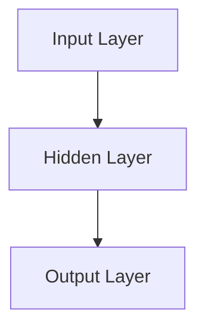

Every neuron in one layer can send its output to neurons in the next layer.

This is where neural networks start becoming much more powerful.

---

## 10. How Does a Neural Network Actually Learn?

So far, we've manually chosen the weights:

```text
0.5
0.2
0.8
```

But a real neural network doesn't start out knowing the correct weights.

Instead, it starts with weights that are usually initialized to small random values.

Then it goes through a cycle:

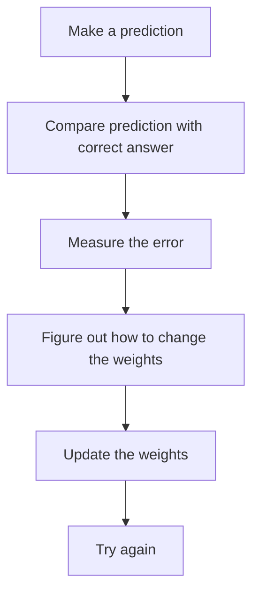

This process happens over and over, and the network gradually adjusts its parameters to make better predictions on the training data.

Let's break each part down.

---

## 11. Predictions and Loss

Suppose the correct answer is:

$$
1
$$

but our network predicts:

$$
0.3
$$

The prediction isn't very close to the target.

We need a way to measure how wrong it is. That's what a **loss function** does.

A loss function takes the prediction and the correct answer and produces a number representing the model's error.

For a simple example, we could use squared error:

$$
\text{Loss}=\left(\text{prediction}-\text{actual}\right)^2
$$

Using our numbers:

$$
\text{Loss}=\left(0.3-1\right)^2
$$

First:

$$
0.3-1 = -0.7
$$

Then square it:

$$
(-0.7)^2=0.49
$$

So:

$$
\text{Loss}=0.49
$$

Generally, a smaller loss means the prediction is closer to the target.

In real neural networks, different problems use different loss functions. For binary classification, binary cross-entropy is commonly used.

---

## 12. What Are Gradients?

Now we have a problem.

We know that the prediction was wrong, but how should we change the weights?

This is where **gradients** become useful. A gradient tells us how changing a parameter would affect the loss.

You can think of it like standing on a hill. Imagine that your goal is to reach the lowest point. If you know which direction slopes upward, you can move in the opposite direction to go downhill.

Training a neural network works with a similar idea. We want to reduce the loss. The gradients give us information about which direction the parameters should move.

---

## 13. What Is Gradient Descent?

**Gradient descent** is the process of using gradients to adjust the network's parameters.

A simplified update rule is:

$$
\text{new\:weight}=\text{old weight}-\text{learning rate}\times\text{gradient}
$$

In Python:

```py
weight = weight - learning_rate * gradient
```

The **learning rate** controls how large the update is.

For example:

```py
learning_rate = 0.01
```

If the learning rate is too large, the network can make huge changes and potentially jump around instead of settling on a good solution.

If it's too small, learning can take a very long time.

So training involves finding parameter updates that move the model toward lower loss without making the process unstable.

---

## 14. What Is Backpropagation?

There's still one important question:

If a neural network has thousands or millions of weights, how does it figure out which weights contributed to the error?

That's where **backpropagation** comes in. Backpropagation calculates gradients for the parameters by working backward through the network.

Imagine a network like this:

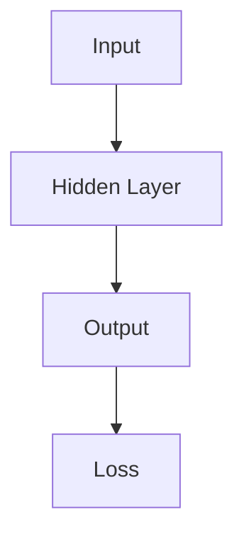

During the forward pass, information moves:

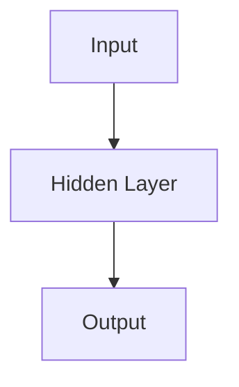

During backpropagation, gradient information moves backward:

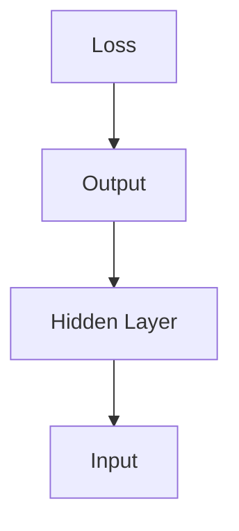

The network uses these gradients to determine how its weights and biases should change.

You don't normally calculate all of these derivatives by hand when building real neural networks. Libraries such as PyTorch can calculate them automatically.

But understanding the basic idea is important:

> Backpropagation calculates how the parameters contributed to the error, and gradient descent uses that information to update them.

---

## 15. The Complete Learning Cycle

Now we can put everything together.


More specifically:

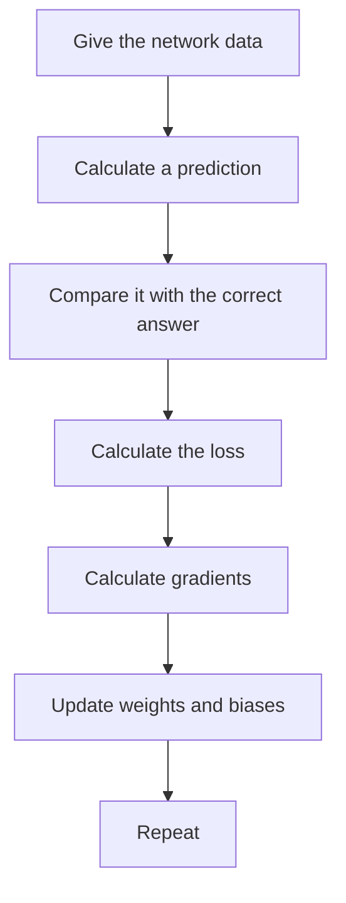

One complete pass through the training data is often called an **epoch**.

For example:

```text
Epoch 1 → Loss: 0.82
Epoch 2 → Loss: 0.61
Epoch 3 → Loss: 0.43
Epoch 4 → Loss: 0.29
Epoch 5 → Loss: 0.18
```

These numbers are just an example, but ideally the loss decreases as training progresses.

---

## 16. Let's Build a Neural Network From Scratch

Congrats! You now understand the basics of neural networks. Now it's time to put these ideas together.

We're going to build a small neural network using only:

```text
Python + NumPy
```

Our network will learn a classic machine learning problem called **XOR**.

XOR is a logical operation with two inputs.

Its rules are:

```text
0 XOR 0 → 0
0 XOR 1 → 1
1 XOR 0 → 1
1 XOR 1 → 0
```

In other words, the output is `1` when exactly one of the inputs is `1`.

Our training data will therefore be:

```py
X = np.array([
    [0, 0],
    [0, 1],
    [1, 0],
    [1, 1]
])
```

And the correct answers are:

```py
y = np.array([
    [0],
    [1],
    [1],
    [0]
])
```

We want our neural network to learn this pattern.

---

## 17. Understanding the Network Architecture

Our network will contain:

```plaintext
flowchart TD
  A[2 input neurons] --> B[4 hidden neurons]
  B --> C[1 output neuron]
```

The two inputs represent the two numbers in each XOR example.

The four hidden neurons give the network enough flexibility to learn the XOR relationship.

The output neuron produces a number between `0` and `1`.

---

## 18. Setting Up the Data

Let's start our Python program.

```py
import numpy as np
```

This imports NumPy. We'll use NumPy for arrays, matrix multiplication, and mathematical operations.

Next:

```py
X = np.array([
    [0, 0],
    [0, 1],
    [1, 0],
    [1, 1]
])
```

`X` contains our four training examples.

Each row is one example:

```text
[0, 0]
[0, 1]
[1, 0]
[1, 1]
```

Now create the correct answers:

```py
y = np.array([
    [0],
    [1],
    [1],
    [0]
])
```

The first row of `X` corresponds to the first row of `y`.

So:

```text
[0, 0] → 0
[0, 1] → 1
[1, 0] → 1
[1, 1] → 0
```

---

## 19. Creating the Weights and Biases

Now we need the parameters of our network.

First:

```py
np.random.seed(42)
```

This makes our random numbers reproducible.

Without this line, the network would receive different random starting weights each time we ran the program.

Now create the first layer's weights:

```py
W1 = np.random.randn(2, 4)
```

Why `(2, 4)`?

Because:

- We have 2 input values.
- We have 4 neurons in the hidden layer.

So `W1` needs a weight connecting each input to each hidden neuron.

There are:

$$
2\times{4}=8
$$

weights.

Next:

```py
b1 = np.zeros((1, 4))
```

This creates four biases, one for each hidden neuron.

Now the second layer:

```py
W2 = np.random.randn(4, 1)
```

There are four hidden neurons and one output neuron, so we need:

$$
4\times{1}=4
$$

weights.

Finally:

```py
b2 = np.zeros((1, 1))
```

This gives the output neuron one bias.

Our network parameters are therefore:

```text
W1 → input-to-hidden weights
b1 → hidden-layer biases

W2 → hidden-to-output weights
b2 → output-layer bias
```

---

## 20. The Sigmoid Function

Our output represents a probability, so we'd like it to be between `0` and `1`.

We can use the **sigmoid function**.

Its equation is:

$$
\text{sigmoid}\left(x\right)=\frac{1}{\left(1+e^{-x})\right}
$$

In Python:

```py
def sigmoid(x):
    return 1 / (1 + np.exp(-x))
```

Let's see what it does:

$$
\begin{align*}
\text{sigmoid}\left(-5\right)\approx{0.007}
\text{sigmoid}\left(0\right)=0.5
\text{sigmoid}\left(5\right)\approx{0.993}
\end{align*}
$$

No matter how large or small the input is, the result stays between `0` and `1`.

That's useful when our output represents a probability.

---

## 21. Forward Propagation

Now we can send the data through the network. This is called **forward propagation**.

First, calculate the hidden layer:

```py
z1 = X @ W1 + b1
```

There's a new symbol here:

```text
@
```

In Python, `@` performs matrix multiplication.

You can think of this operation as performing many weighted sums at once.

Instead of manually calculating every neuron:

$$
\text{input}\times\text{weight}+\text{input}\times\text{weight}+\text{bias}
$$

NumPy can calculate all of them together.

The result is stored in `z1`.

Next:

```py
a1 = np.tanh(z1)
```

Here we're using the **tanh activation function** for the hidden layer.

Tanh converts its input into values between `-1` and `1`.

Why use tanh here?

Because XOR isn't something a single simple linear calculation can solve. The nonlinear activation gives the hidden layer the flexibility it needs to learn the pattern.

Now calculate the output layer:

```py
z2 = a1 @ W2 + b2
```

This takes the hidden layer's outputs and combines them using the second set of weights.

Finally:

```py
a2 = sigmoid(z2)
```

Now `a2` contains our predictions.

For example, before training, the network might produce something like:

```text
0.52
0.61
0.48
0.55
```

Those predictions aren't useful yet, but that's expected. The network hasn't learned anything yet.

---

## 22. Calculating the Loss

Now we need to measure how good those predictions are.

For binary classification, we'll use **binary cross-entropy**, which is a loss function used in machine learning for binary classification. It measures the performance of a model whose output is a probability value between 0 and 1. The formula is:

```text
Loss = -mean(
    y × log(prediction)
    +
    (1 - y) × log(1 - prediction)
)
```

That looks much more complicated than the squared-error example from earlier, but we don't need to memorize the formula.

In Python:

```py
loss = -np.mean(
    y * np.log(a2 + 1e-8) +
    (1 - y) * np.log(1 - a2 + 1e-8)
)
```

The `1e-8` is a very small number.

It prevents problems if `a2` gets extremely close to `0` or `1`, because taking the logarithm of exactly zero isn't valid.

At the beginning of training, the loss will probably be relatively high. But as the network learns, we'd like it to decrease.

---

## 23. Backpropagation in Code

Now comes the most mathematical part of our program.

We need to calculate the gradients.

Start with:

```py
dz2 = a2 - y
```

This gives us the gradient of the loss with respect to the output layer's pre-activation value for the sigmoid + binary cross-entropy combination.

Next:

```py
dW2 = (a1.T @ dz2) / len(X)
```

This calculates the gradient for `W2`.

The `.T` means transpose.

Our hidden-layer output has four neurons, while `dz2` represents the output layer's error. Matrix multiplication combines them to determine how each hidden-to-output weight contributed to the loss.

We divide by:

```py
len(X)
```

because we have four training examples and we're calculating the average gradient.

Now calculate the output bias gradient:

```py
db2 = np.mean(dz2, axis=0, keepdims=True)
```

This calculates the average gradient for the output bias.

Next:

```py
da1 = dz2 @ W2.T
```

This sends the gradient information backward from the output layer toward the hidden layer.

Now we need to account for the derivative of the tanh activation function.

The derivative of tanh can be written as:

$$
1-\tanh\left(x\right)^2
$$

Since we already have the hidden layer's activated values in `a1`, we can write:

```py
dz1 = da1 * (1 - a1**2)
```

This tells us how the hidden layer's pre-activation values affected the loss.

Now calculate the gradients for the first layer's weights:

```py
dW1 = (X.T @ dz1) / len(X)
```

And the hidden-layer biases:

```py
db1 = np.mean(dz1, axis=0, keepdims=True)
```

At this point, we have gradients for all of our trainable parameters.

---

## 24. Updating the Weights

Now we use gradient descent.

First:

```py
W2 -= learning_rate * dW2
```

This updates the second layer's weights.

The `-=` means:

```py
W2 = W2 - learning_rate * dW2
```

Then:

```py
b2 -= learning_rate * db2
```

updates the output bias.

And:

```py
W1 -= learning_rate * dW1
```

updates the first layer's weights.

Finally:

```py
b1 -= learning_rate * db1
```

updates the hidden-layer biases.

These updates are what actually allow the network to learn.

---

## 25. The Complete NumPy Neural Network

Now let's put everything together.

```py :collapsed-lines
import numpy as np

# 1. Training data

X = np.array([
    [0, 0],
    [0, 1],
    [1, 0],
    [1, 1]
])

y = np.array([
    [0],
    [1],
    [1],
    [0]
])

# 2. Initialize parameters

np.random.seed(42)

W1 = np.random.randn(2, 4)
b1 = np.zeros((1, 4))

W2 = np.random.randn(4, 1)
b2 = np.zeros((1, 1))

learning_rate = 0.1

# 3. Activation functions

def sigmoid(x):
    return 1 / (1 + np.exp(-x))

# 4. Training

for epoch in range(10000):

    # Forward propagation

    z1 = X @ W1 + b1
    a1 = np.tanh(z1)

    z2 = a1 @ W2 + b2
    a2 = sigmoid(z2)

    # Calculate loss

    loss = -np.mean(
        y * np.log(a2 + 1e-8) +
        (1 - y) * np.log(1 - a2 + 1e-8)
    )

    # Backpropagation

    dz2 = a2 - y

    dW2 = (a1.T @ dz2) / len(X)
    db2 = np.mean(dz2, axis=0, keepdims=True)

    da1 = dz2 @ W2.T

    dz1 = da1 * (1 - a1**2)

    dW1 = (X.T @ dz1) / len(X)
    db1 = np.mean(dz1, axis=0, keepdims=True)

    # Update parameters

    W2 -= learning_rate * dW2
    b2 -= learning_rate * db2

    W1 -= learning_rate * dW1
    b1 -= learning_rate * db1

    # Display progress

    if epoch % 1000 == 0:
        print(f"Epoch {epoch}, Loss: {loss:.4f}")
```

Let's go through the program from top to bottom.

### Line-by-Line Explanation of the Full Code

#### Importing NumPy:

```py
import numpy as np
```

We import NumPy because our network will work with arrays and matrix operations.

#### Creating the inputs

```py
X = np.array([
    [0, 0],
    [0, 1],
    [1, 0],
    [1, 1]
])
```

Each row is one XOR example.

There are four examples and two input values per example.

So the shape of `X` is:

$$
4\times{2}
$$

#### Creating the answers

```py
y = np.array([
    [0],
    [1],
    [1],
    [0]
])
```

There are four correct answers, one for each row in `X`.

#### Making random initialization reproducible

```py
np.random.seed(42)
```

This makes NumPy generate the same starting random values each time.

The number `42` isn't special. You could use another number.

#### Creating the first weight matrix

```py
W1 = np.random.randn(2, 4)
```

This creates a matrix containing random numbers.

Its shape is $2\times{4}$

There are two inputs and four hidden neurons.

#### Creating the first biases

```py
b1 = np.zeros((1, 4))
```

This creates four zeros:

```text
[0, 0, 0, 0]
```

There is one bias for every hidden neuron.

#### Creating the second weight matrix

```py
W2 = np.random.randn(4, 1)
```

There are four hidden neurons and one output neuron.

Therefore:

$$
4\times{1}
$$

weights are needed.

#### Creating the output bias

```py
b2 = np.zeros((1, 1))
```

The output layer has one neuron, so it needs one bias.

#### Setting the learning rate

```py
learning_rate = 0.1
```

This controls how strongly the gradients affect each update.

#### Creating sigmoid

```py
def sigmoid(x):
    return 1 / (1 + np.exp(-x))
```

This converts the output into a value between `0` and `1`.

### Starting the Training Loop

```py
for epoch in range(10000):
```

This tells Python to repeat the training process 10,000 times.

Each repetition is an epoch, which is one complete pass of the entire training dataset through a neural network

#### Calculating the hidden layer

```py
z1 = X @ W1 + b1
```

This performs the weighted-sum calculation for all four hidden neurons and all four training examples.

#### Applying tanh

```py
a1 = np.tanh(z1)
```

This applies the nonlinear activation function to the hidden layer.

#### Calculating the output layer

```py
z2 = a1 @ W2 + b2
```

This takes the hidden layer's values and calculates the output neuron's weighted sum.

#### Applying sigmoid

```py
a2 = sigmoid(z2)
```

This turns the output into probabilities between `0` and `1`.

#### Calculating the loss

```py
loss = -np.mean(
    y * np.log(a2 + 1e-8) +
    (1 - y) * np.log(1 - a2 + 1e-8)
)
```

This measures how different the predictions are from the correct answers.

A lower value generally means the predictions are better.

#### Calculating the output gradient

```py
dz2 = a2 - y
```

This calculates the gradient needed to update the output layer.

#### Updating the second-layer weight gradients

```py
dW2 = (a1.T @ dz2) / len(X)
```

This determines how each weight connecting the hidden layer to the output layer contributed to the loss.

#### Updating the output bias gradient

```py
db2 = np.mean(dz2, axis=0, keepdims=True)
```

This calculates the average gradient for the output bias.

#### Moving backward toward the hidden layer

```py
da1 = dz2 @ W2.T
```

This passes the gradient information backward through the output layer.

#### Applying the tanh derivative

```py
dz1 = da1 * (1 - a1**2)
```

This accounts for the effect of the tanh activation function.

#### Calculating the first-layer gradients

```py
dW1 = (X.T @ dz1) / len(X)
```

This determines how the input-to-hidden weights contributed to the loss.

Then:

```py
db1 = np.mean(dz1, axis=0, keepdims=True)
```

calculates the gradients for the hidden-layer biases.

#### Updating the parameters

```py
W2 -= learning_rate * dW2
b2 -= learning_rate * db2

W1 -= learning_rate * dW1
b1 -= learning_rate * db1
```

These four lines are where the network changes what it has learned.

The gradients tell us which direction to move, while the learning rate determines how large the movement should be.

#### Printing the loss

```py
if epoch % 1000 == 0:
    print(f"Epoch {epoch}, Loss: {loss:.4f}")
```

The `%` operator gives us the remainder after division.

So:

```py
epoch % 1000 == 0
```

is true every 1,000 epochs.

That means we don't print something 10,000 times. Instead, we get occasional updates such as:

```text
Epoch 0, Loss: ...
Epoch 1000, Loss: ...
Epoch 2000, Loss: ...
...
```

If training is working well, the loss should generally decrease.

---

## 26. Testing the Network

After training, we can use the network to make predictions.

```py
z1 = X @ W1 + b1
a1 = np.tanh(z1)

z2 = a1 @ W2 + b2
predictions = sigmoid(z2)

print(predictions)
```

The network should produce values close to:

```text
[[0],
 [1],
 [1],
 [0]]
```

The actual values probably won't be exactly `0` and `1`.

You might get something more like:

```text
[[0.01],
 [0.98],
 [0.99],
 [0.02]]
```

That's fine.

The network is producing probabilities.

We can convert those probabilities into classes using a threshold:

```py
classes = (predictions >= 0.5).astype(int)

print(classes)
```

The result should be:

```text
[[0],
 [1],
 [1],
 [0]]
```

Our network has learned the XOR pattern.

---

## 27. Why Did We Need a Hidden Layer?

You might wonder why we couldn't just connect the two inputs directly to the output.

The reason is that XOR isn't something a single linear layer can represent.

The hidden layer gives the network additional transformations that allow it to learn the more complicated relationship.

This is one of the most important ideas behind neural networks: a network doesn't necessarily learn one giant rule. Instead, different layers can transform information step by step.

For an image recognition system, you can imagine a simplified process like:


Real neural networks don't literally create neat layers called "edges," "shapes," and "objects." This is just an intuition for how increasingly complex representations can emerge through multiple layers.

---

## 28. What Happens in a Larger Neural Network?

The network we built is tiny. Modern neural networks can have millions, billions, or even more parameters.

A simplified network might look like:


Each connection can have its own weight.

The more neurons and connections a network has, the more parameters it may need to learn.

Large models therefore require significant amounts of computing power and memory.

But remember the basic process:

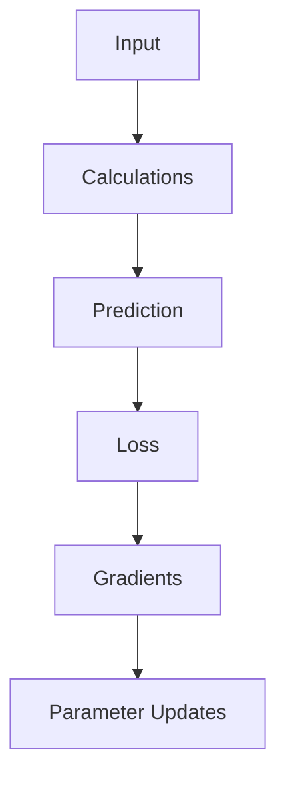

The size of the network changes dramatically, but the basic training idea remains.

---

## 29. Do You Have to Build Neural Networks From Scratch?

No. Building a neural network from scratch is useful for learning because it forces you to understand what's happening underneath the libraries.

But you normally wouldn't manually calculate every gradient when building a real machine learning application.

That's where machine learning frameworks come in. Some commonly used Python libraries include:

- NumPy
- PyTorch
- TensorFlow
- Keras
- scikit-learn

For deep learning, **PyTorch** is one of the most commonly used frameworks. It can automatically calculate gradients and handle many of the mathematical operations involved in training.

---

## 30. Building the Same Network With PyTorch

Let's see how much shorter the network becomes with PyTorch.

First, install it:

```sh
pip install torch
```

Then import it:

```py
import torch
import torch.nn as nn
```

Now create the model:

```py
model = nn.Sequential(
    nn.Linear(2, 4),
    nn.Tanh(),
    nn.Linear(4, 1),
    nn.Sigmoid()
)
```

Let's break that down.

```py
nn.Linear(2, 4)
```

creates a layer that takes two inputs and produces four outputs.

That's our hidden layer.

Next:

```py
nn.Tanh()
```

applies the tanh activation function.

Then:

```py
nn.Linear(4, 1)
```

connects the four hidden neurons to one output neuron.

Finally:

```py
nn.Sigmoid()
```

converts the output into a value between `0` and `1`.

So the architecture is:

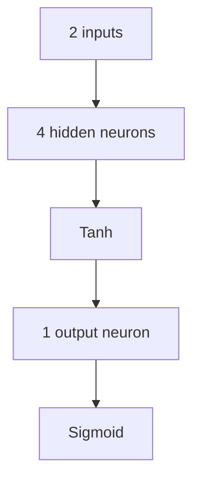

Notice how much shorter this is than our NumPy implementation.

That's because PyTorch handles many of the calculations for us.

---

## 31. Training the Network With PyTorch

First, create the training data:

```py
X = torch.tensor([
    [0., 0.],
    [0., 1.],
    [1., 0.],
    [1., 1.]
])

y = torch.tensor([
    [0.],
    [1.],
    [1.],
    [0.]
])
```

The decimal points are important because neural networks normally work with floating-point numbers.

Now create the model:

```py
model = nn.Sequential(
    nn.Linear(2, 4),
    nn.Tanh(),
    nn.Linear(4, 1),
    nn.Sigmoid()
)
```

Next, choose our loss function:

```py
loss_function = nn.BCELoss()
```

`BCELoss` calculates binary cross-entropy loss.

Now create an optimizer:

```py
optimizer = torch.optim.Adam(
    model.parameters(),
    lr=0.01
)
```

Adam is an optimization algorithm that updates the model's parameters during training.

`model.parameters()` tells the optimizer which values it should update.

`lr=0.01` sets the learning rate.

Now we can train:

```py
for epoch in range(5000):

    predictions = model(X)

    loss = loss_function(predictions, y)

    optimizer.zero_grad()

    loss.backward()

    optimizer.step()

    if epoch % 500 == 0:
        print(
            f"Epoch {epoch}, Loss: {loss.item():.4f}"
        )
```

Let's look at the important parts.

First:

```py
predictions = model(X)
```

This sends the training data through the network.

Then:

```py
loss = loss_function(predictions, y)
```

compares the predictions with the correct answers.

Next:

```py
optimizer.zero_grad()
```

clears gradients from the previous training step.

Then:

```py
loss.backward()
```

calculates the gradients automatically using backpropagation.

Finally:

```py
optimizer.step()
```

uses those gradients to update the model's parameters.

That's the same basic learning process we implemented manually with NumPy. The difference is that PyTorch takes care of many of the calculations.

---

## 32. NumPy vs. PyTorch

So why did we build the network twice? Well, because the two versions teach different things.

With NumPy, we manually handled weights, biases, forward propagation,  
loss, gradients, backpropagation, and parameter updates. That makes the mechanics easier to see.

With PyTorch, we can write the same general idea in much less code because the framework handles many of those calculations.

You can think of it like this:


Learning how the NumPy version works makes the PyTorch version much less mysterious.

---

## 33. What Is Deep Learning?

You may have heard the term **deep learning**. Deep learning is a part of machine learning that uses neural networks with multiple layers.

For example:

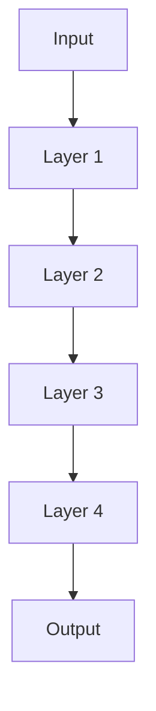

The word "deep" refers to the depth of the network, or the number of layers involved.

There isn't a magical point where a neural network suddenly becomes intelligent. Adding layers simply gives the model more opportunities to transform the input into useful representations.

---

## 34. Where Are Neural Networks Used?

Neural networks are used in many different areas. Here are a few examples...

### Computer Vision

Neural networks can process images.

For example:

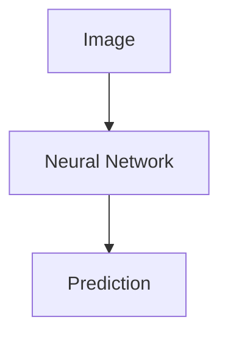

They can be used for tasks such as image classification and object detection.

### Natural Language Processing

Neural networks can also process text.

For example:

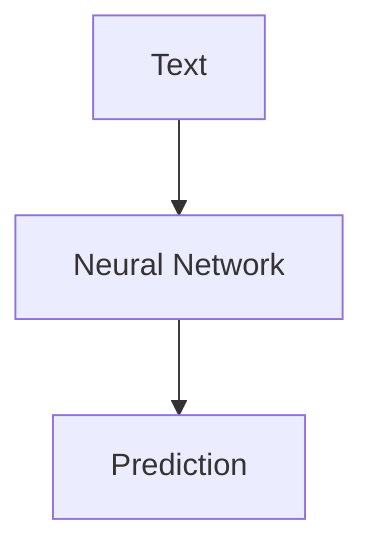

Modern language models use neural networks to process and generate text.

### Speech Recognition

Neural networks can process audio and help convert spoken language into text.

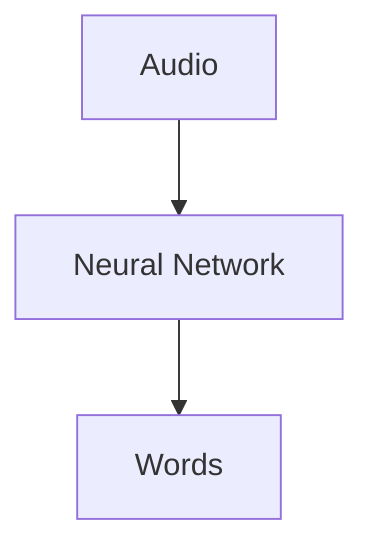

### Recommendation Systems

Neural networks can learn patterns from user behavior and help predict which content or products might be useful to someone.

### Generative AI

Large neural networks can also be used to generate text, images, audio, code, video, and much more.

These systems are much more complicated than the small XOR network we built, but they still rely on the same general idea of learning parameters from data.

---

## 35. The Whole Process in One Picture

At this point, we've covered a lot.

Here's the entire training process:

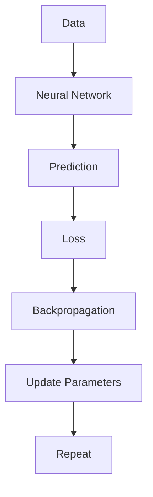

Once training is finished, we use the learned parameters to make predictions on new data:

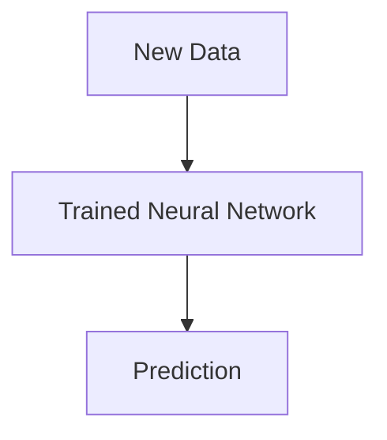

That's the basic idea behind neural network training.

---

## 36. The Most Important Ideas to Remember

If you don't remember every equation from this tutorial, that's okay.

Start with these concepts.

### Inputs

The numbers we give to the network.

$$
x_1,\:x_2,\:x_3\cdots
$$

### Weights

Numbers that determine how strongly inputs affect neurons.

$$
w_1,\:w_2,\:w_3\cdots
$$

### Biases

Additional values that give neurons more flexibility.

$$
b
$$

### Activation Functions

Functions that transform neuron outputs and allow networks to learn nonlinear patterns.

Examples include:

```text
ReLU
Tanh
Sigmoid
```

### Forward Propagation

Sending data from the input toward the output.

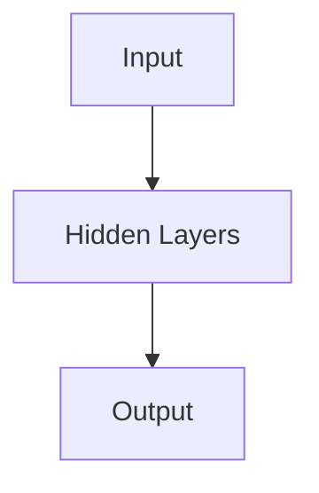

### Loss

A measurement of how different the prediction is from the correct answer.

### Backpropagation

Calculating gradients by working backward through the network.

### Gradient Descent

Using those gradients to update the network's parameters.

And the entire learning process can be summarized as:

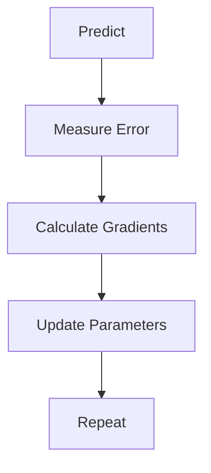

---

## 37. What Should You Learn Next?

If you want to continue learning neural networks with Python, you don't need to jump directly into complicated research papers.

A useful learning path is:

```mermaid
flowchart TD
  A[Python] -->. B[NumPy]
  B --> C[Basic Linear Algebra]
  C --> D[Probability & Statistics]
  D --> E[Machine Learning Basics]
  E --> F[Neural Networks]
  F --> G[PyTorch]
  G --> H[Deep Learning]
  H --> I[Computer Vision / NLP / Generative AI]
```

You can also learn by building small projects.

For example:

1. XOR classifier
2. House price predictor
3. Handwritten digit classifier
4. Simple image classifier
5. Spam message classifier
6. Neural network that learns a mathematical function

The projects don't need to be huge. A small project that you completely understand is often more useful than a large project where you copied code without understanding it.

---

## Final Takeaway

Neural networks can look intimidating because the systems used in modern AI can contain enormous numbers of parameters.

But the basic idea is much smaller.

A neural network takes numbers as input, combines them using weights and biases, applies mathematical functions, produces a prediction, measures how wrong that prediction was, and then adjusts its parameters.

The cycle looks like this:

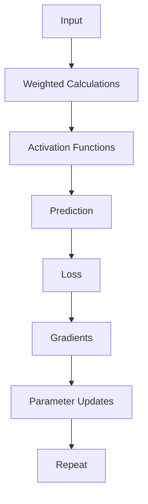

That's the foundation.

The XOR network we built in this tutorial is tiny compared with the neural networks used in modern AI. But the ideas you just learned (parameters, layers, activation functions, forward propagation, loss, backpropagation, gradients, and optimization) are fundamental ideas that appear again and again in deep learning.

The next time you hear that an AI model has millions or billions of parameters, it might still sound overwhelming.

But underneath all that scale, the basic learning loop is still familiar:

1. Make a prediction.
2. Measure the error.
3. Figure out how to improve.
4. Update the parameters.
5. Try again.

And that's the core idea behind a neural network.

Happy coding and keep learning!

<!-- TODO: add ARTICLE CARD -->
```component VPCard
{
  "title": "Neural Networks Explained: What They Are and How to Build One in Python",
  "desc": "Have you ever wondered how a computer can recognize a handwritten number, predict whether an email is spam, recommend a video, or understand a sentence? A lot of modern AI systems rely on something ca",
  "link": "https://chanhi2000.github.io/bookshelf/freecodecamp.org/neural-networks-explained-simply-in-python/",
  "logo": "https://cdn.freecodecamp.org/universal/favicons/favicon.ico",
  "background": "rgba(10,10,35,0.2)"
}
```
