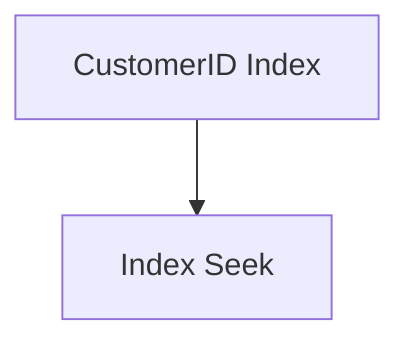

# {{ $frontmatter.title }} 관련

```component VPCard
{
  "title": "Microsoft SQL Server > Article(s)",
  "desc": "Article(s)",
  "link": "/data-science/mssql/articles/README.md",
  "logo": "/images/ico-wind.svg",
  "background": "rgba(10,10,10,0.2)"
}
```

[[toc]]

---

<SiteInfo
  name="How to Optimize Enterprise Application Performance with T-SQL Query Tuning and Indexing Strategies"
  desc="In this article, you'll learn how to optimize SQL Server performance using T-SQL query tuning, indexing strategies, execution plans, and real-world optimization techniques for enterprise applications."
  url="https://freecodecamp.org/news/optimize-enterprise-app-performance-with-t-sql-query-tuning-and-indexing-strategies"
  logo="https://cdn.freecodecamp.org/universal/favicons/favicon.ico"
  preview="https://cdn.hashnode.com/uploads/covers/5e1e335a7a1d3fcc59028c64/1df4fdd1-4c5d-4f0b-a0e6-f40a75de6a8e.png"/>

In this article, you'll learn how to optimize SQL Server performance using T-SQL query tuning, indexing strategies, execution plans, and real-world optimization techniques for enterprise applications.

Slow SQL queries are one of the biggest bottlenecks in enterprise applications. This guide demonstrates how to analyze execution plans, design effective indexes, rewrite inefficient T-SQL queries, optimize joins and aggregations, and monitor performance using SQL Server tools.

By working through several practical examples, you'll learn how to build faster, scalable, and more maintainable SQL Server workloads.

---

## Introduction

Enterprise application performance often depends more on the database than the application itself. Whether you're building with ASP.NET Core, Java Spring Boot, or Node.js, inefficient database queries can lead to slow API responses, page load delays, timeout errors, and increased infrastructure costs.

While adding CPU, memory, or database replicas may temporarily improve performance, the root cause is often inefficient T-SQL queries, poorly designed indexes, outdated statistics, or suboptimal execution plans. Since the same queries may execute thousands of times per minute, even small optimizations can significantly reduce latency and resource consumption.

In enterprise environments, where databases often contain millions of records and support highly concurrent workloads, query tuning becomes essential for maintaining scalability and responsiveness.

In this article, you'll learn how SQL Server executes queries, how to analyze execution plans, optimize T-SQL, design effective indexing strategies, and apply practical techniques to improve database performance in real-world applications.

::: note Prerequisites

To get the most from this tutorial, you should be familiar with:

- Basic SQL and T-SQL syntax
- Microsoft SQL Server fundamentals
- Primary keys and foreign keys
- Basic understanding of indexes
- SQL Server Management Studio (SSMS) or Azure Data Studio
- Basic knowledge of relational database concepts

:::

---

## Why Query Performance Matters in Enterprise Applications

Database performance directly affects every layer of an enterprise application. Even if the frontend is highly optimized and the application servers are properly scaled, slow database operations quickly become the limiting factor.

Consider a typical enterprise architecture:


Figure 1. High-Level Architecture Showing Client, ASP.NET Core API, Business Services, and SQL Server Database

Figure 1 illustrates the high-level architecture of a typical ASP.NET Core application. Client requests are received by the ASP.NET Core API, which serves as the application's entry point. The API forwards these requests to the Business Services layer, where the core business logic is executed. The Business Services layer then interacts with the SQL Server Database to retrieve or persist data. The sequential flow of requests through these components is represented by the arrows in the diagram.

Although this architecture separates responsibilities and improves maintainability, its overall performance is often constrained by the database. Every request that requires data eventually reaches the SQL Server database. If the database responds slowly, every upstream component (including the Business Services layer, the API, and ultimately the client) must wait for the query to complete.

Consider an order management system in which a dashboard displays customer information, recent orders, invoices, inventory levels, and shipment status. Loading this dashboard may require several independent database queries. While these queries may execute concurrently, the user perceives the combined response time. Consequently, even a small number of poorly optimized queries can significantly increase page load times and degrade the overall user experience.

As database size and application usage grow, performance issues often become increasingly apparent.

Common symptoms include:

- APIs that gradually become slower as data grows
- High CPU utilization on the SQL Server
- Excessive disk I/O
- Blocking between concurrent transactions
- Deadlocks during peak usage
- Timeout exceptions in application logs

Many of these problems originate from inefficient SQL rather than insufficient hardware.

For example, suppose a customer table contains ten million records. Searching for customers by email without an appropriate index forces SQL Server to examine every row.

```sql
SELECT * FROM Customers WHERE 1=1 AND Email = 'john@example.com';
```

Without an index on the Email column, SQL Server performs a table scan, reading every page before locating the desired row.

Adding a properly designed index transforms the same query into an index seek, allowing SQL Server to locate the record almost immediately.

As enterprise datasets continue growing, these differences become increasingly significant.

---

## How SQL Server Executes Queries

Understanding SQL Server's execution process is essential before attempting optimization.

Every query passes through several stages before data is returned.

### Step 1: Parsing

SQL Server first validates the syntax.

```sql
SELECT Name FROM Customers;
```

If the statement contains syntax errors, execution stops immediately.

### Step 2: Binding

Next, SQL Server verifies that referenced tables, columns, functions, and objects exist.

For example,

```sql
SELECT CustomerName FROM Customers;
```

If CustomerName doesn't exist, SQL Server reports an error before optimization begins.

### Step 3: Query Optimization

The SQL Server Query Optimizer evaluates multiple possible execution strategies.

It estimates the cost of various approaches, including table scans, index seeks, different join algorithms, parallel execution, and sorting methods.

The optimizer chooses the plan with the lowest estimated cost based on available statistics.

Importantly, developers don't tell SQL Server *how* to execute a query. They specify *what* data they need.

### Step 4: Execution Plan Generation

The optimizer then generates an execution plan.

The execution plan acts as a blueprint describing every operation required to satisfy the query.

For example:

```sql
SELECT *FROM Orders WHERE 1=1 AND CustomerID = 1250;
```

Depending on available indexes, SQL Server may choose either clustered Index Seek, Nonclustered Index Seek, Index Scan, or Table Scan. Understanding these operators is the foundation of effective tuning.

---

## Understanding Execution Plans

Execution plans reveal how SQL Server actually processes a query. Rather than guessing why a query performs poorly, execution plans identify the most expensive operations directly.

SQL Server provides two primary plan types:

1. **Estimated Execution Plan:** Generated without executing the query. It predicts the optimizer's chosen strategy using available statistics.
2. **Actual Execution Plan:** Generated after the query runs, showing the real execution path along with runtime statistics such as row counts and operator costs.

For performance tuning, the actual execution plan is generally more valuable because it exposes differences between estimated and actual behavior.

In SQL Server Management Studio, you can enable the actual execution plan by selecting **Include Actual Execution Plan** before running your query.

---

## Common Execution Plan Operators

Understanding a handful of common operators makes execution plans much easier to interpret.

### Table Scan

A table scan reads every row in a table.

`Customers ──► Table Scan`

This is acceptable for small lookup tables but becomes increasingly expensive as tables grow.

### Index Scan

An index scan reads every entry within an index.

Although better than scanning the full table, it still processes every index page.

**Index Seek**

An index seek navigates directly to matching rows.



This is generally the most efficient access method for selective queries.

### Nested Loop Join

Nested Loop joins perform well when one input contains relatively few rows.

```plaintext
Customers  
  │  
  ▼  
Nested Loop  
  ▲
  │
Orders
```

They're commonly used for OLTP workloads.

### Hash Match

Hash joins excel when processing large datasets with no useful indexes. But keep in mind that they consume more memory and may spill to disk if insufficient memory is available.

### Merge Join

Merge joins require sorted inputs but can process large result sets efficiently. They're often selected when both datasets are already indexed appropriately.

### Key Lookup

One operator that frequently surprises developers is the **Key Lookup**.

Suppose an index contains only the `CustomerID` column, but the query also requests `Address` and `PhoneNumber`.

SQL Server first performs an Index Seek to locate matching rows, then executes additional lookups against the clustered index to retrieve missing columns.

Although acceptable for a few rows, thousands of key lookups can significantly degrade performance.

In many cases, creating a covering index eliminates these extra lookups entirely. This is a topic we'll explore later in the article.

---

## Finding Slow Queries

SQL Server provides several built-in tools that help locate performance bottlenecks in production environments.

### Using Query Store

Query Store records query history, execution plans, runtime statistics, and performance trends over time. Rather than relying on temporary monitoring sessions, it continuously captures valuable performance information, making it one of the most useful features for enterprise SQL Server deployments.

For example, if an application suddenly becomes slower after a deployment, Query Store can compare execution plans before and after the change to determine whether the optimizer selected a less efficient plan.

Typical metrics available include:

- Average execution time
- CPU consumption
- Logical reads
- Execution count
- Query plan history

This historical view helps identify regressions that may otherwise be difficult to reproduce.

### Using Dynamic Management Views (DMVs)

Dynamic Management Views expose internal SQL Server performance information while the server is running.

One commonly used DMV is:

```sql
SELECT TOP 10 qs.execution_count,
  qs.total_worker_time,
  qs.total_elapsed_time,
  SUBSTRING(
    qt.text,
    qs.statement_start_offset / 2,
    (
      CASE
        WHEN qs.statement_end_offset = -1 THEN LEN(CONVERT(NVARCHAR(MAX), qt.text)) * 2
        ELSE qs.statement_end_offset
      END - qs.statement_start_offset
    ) / 2
  ) AS QueryText
FROM sys.dm_exec_query_stats qs
  CROSS APPLY sys.dm_exec_sql_text(qs.sql_handle) qt
ORDER BY qs.total_worker_time DESC;
```

This query identifies statements consuming the most CPU time, helping prioritize optimization efforts.

### Measuring I/O and Execution Time

SQL Server also provides lightweight commands for measuring query performance.

```sql
SET STATISTICS IO ON;
SET STATISTICS TIME ON;
```

After enabling these options, executing a query displays additional information such as:

- Logical reads
- Physical reads
- CPU time
- Total elapsed time

Consider the following query:

```sql
SELECT * FROM Orders WHERE 1=1
AND CustomerID = 1025;
```

The output might resemble:

```plaintext
Table 'Orders'.
Logical reads: 4832
```

SQL Server Execution Times:  

```plaintext
CPU time = 215 ms
Elapsed time = 287 ms
```

After adding an appropriate index, the same query could produce:

```plaintext
Logical reads: 6
CPU time = 3 ms
Elapsed time = 5 ms
```

These measurements provide objective evidence that an optimization has improved performance.

---

## Writing Efficient WHERE Clauses

One of the simplest ways to improve query performance is to write **SARGable** predicates. A query is considered SARGable (Search ARGument Able) when SQL Server can efficiently use an index to locate matching rows.

Many developers unintentionally prevent index usage by applying functions directly to indexed columns.

Consider this example:

```sql
SELECT * FROM Orders WHERE 1=1
AND YEAR(OrderDate) = 2025;
```

Although the logic is correct, SQL Server must evaluate the YEAR() function for every row before performing the comparison. As a result, it can't efficiently seek into an index on `OrderDate`.

A better approach is to compare the column directly.

```sql
SELECT * FROM Orders WHERE 1=1
AND OrderDate >= '2025-01-01'
AND OrderDate < '2026-01-01';
```

This version allows SQL Server to perform an index seek rather than scanning the entire table.

Similarly, avoid implicit data type conversions.

Instead of:

```sql
WHERE CustomerID = '100'
```

prefer:

```sql
WHERE CustomerID = 100
```

Matching the column's data type eliminates unnecessary conversions during query execution.

---

## Optimizing JOIN Operations

Enterprise applications rarely query a single table. Most business operations involve combining data from multiple related tables, making joins one of the most important optimization areas.

Consider an order management system:

```sql
SELECT
  c.Name,
  o.OrderDate,
  o.TotalAmount
FROM Customers c
INNER JOIN Orders o ON c.CustomerID = o.CustomerID;
```

When both `CustomerID` columns are indexed, SQL Server can efficiently join the tables.

But poor indexing often forces SQL Server to scan one or both tables, dramatically increasing execution time.

#### `EXISTS` vs. `IN`

Another common optimization involves replacing `IN` with `EXISTS` for large subqueries.

Less efficient:

```sql
SELECT * FROM Customers WHERE 1=1
AND CustomerID IN (
  SELECT CustomerID FROM Orders
);
```

Better:

```sql
SELECT * FROM Customers c
WHERE 1=1
AND EXISTS (
  SELECT 1 FROM Orders o WHERE o.CustomerID = c.CustomerID
);
```

For correlated lookups involving large datasets, `EXISTS` often enables more efficient execution plans.

#### Eliminate Unnecessary Joins

Sometimes queries include tables whose data is never used.

For example:

```sql
SELECT
  o.OrderID, c.Name
FROM
  Orders o
INNER JOIN Customers c ON o.CustomerID = c.CustomerID
INNER JOIN Regions r ON c.RegionID = r.RegionID;
```

If no columns from Regions are selected or filtered, removing the join reduces unnecessary work and simplifies the execution plan.

---

## Optimizing Aggregations

Aggregations become increasingly expensive as datasets grow. Reporting systems frequently summarize millions of rows using functions such as `SUM()`, `COUNT()`, `AVG()`, and `MAX()`.

A straightforward aggregation might look like this:

```sql
SELECT
  CustomerID, SUM(TotalAmount)
FROM Orders
WHERE 1=1
GROUP BY CustomerID;
```

Although simple, performance depends heavily on indexing and data distribution.

If the query repeatedly scans millions of rows, consider creating an index on `CustomerID`.

Window functions often provide a cleaner alternative to complex subqueries.

For example, identifying each customer's most recent order:

```sql
SELECT
  CustomerID, OrderDate,
  ROW_NUMBER() OVER (
    PARTITION BY CustomerID
    ORDER BY OrderDate DESC
  ) AS RowNum
FROM Orders;
```

Window functions allow SQL Server to calculate rankings and running totals without complicated self-joins.

Whenever possible, avoid unnecessary sorting operations, since sorting large result sets consumes considerable CPU and memory.

---

## Common Table Expressions vs. Temporary Tables

Both Common Table Expressions (CTEs) and temporary tables help simplify complex queries, but they serve different purposes.

A CTE provides a readable way to structure intermediate query logic.

```sql
WITH RecentOrders AS
(
  SELECT * FROM Orders WHERE 1=1
  AND OrderDate >= DATEADD(DAY, -30, GETDATE())
)
SELECT * FROM RecentOrders;
```

CTEs improve readability and maintainability but aren't materialized automatically. SQL Server may execute the underlying logic multiple times depending on the execution plan.

Temporary tables, on the other hand, physically store intermediate results.

```sql
SELECT * INTO #RecentOrders
FROM Orders
WHERE 1=1
AND OrderDate >= DATEADD(DAY, -30, GETDATE());

SELECT * FROM #RecentOrders;
```

Temporary tables become particularly useful when:

- Intermediate results are reused multiple times
- Large datasets need additional indexing
- Complex joins benefit from breaking queries into stages

Choosing between the two depends on workload characteristics rather than personal preference.

---

## Avoiding Common T-SQL Performance Anti-Patterns

Many performance issues stem from common coding habits rather than complex database problems.

### Avoid `SELECT *`

Fetching every column increases network traffic, memory consumption, and I/O.

Instead of this:

```sql
SELECT * FROM Customers;
```

Retrieve only the required columns:

```sql
SELECT
  CustomerID, Name, Email
FROM
  Customers;
```

This reduces both data transfer and execution costs.

### Avoid Scalar Functions in `WHERE` Clauses

Scalar functions execute once per row, preventing efficient index usage.

Instead of:

```sql
WHERE UPPER(Name) = 'JOHN'
```

store normalized values or use case-insensitive collations where appropriate.

### Avoid Cursors for Row-by-Row Processing

Cursors process records sequentially.

```sql
DECLARE CustomerCursor CURSOR 
FOR
SELECT CustomerID
FROM Customers;
```

Although sometimes necessary, cursor-based solutions rarely scale well for enterprise workloads.

Most cursor logic can be rewritten using set-based operations.

For example:

Instead of updating rows individually:

```sql
UPDATE Customers
SET Status = 'Active'
WHERE 1=1
AND LastLogin >= DATEADD(DAY, -30, GETDATE());
```

SQL Server processes the entire set efficiently rather than iterating row by row.

### Reduce Correlated Subqueries

Correlated subqueries execute repeatedly for each outer row.

For example:

```sql
SELECT
  CustomerID,
  (
    SELECT COUNT(*)
    FROM Orders o
    WHERE o.CustomerID = c.CustomerID
  ) AS OrderCount
FROM Customers c;
```

Rewriting this using joins and aggregation often produces more efficient execution plans.

```sql
SELECT
  c.CustomerID,
  COUNT(o.OrderID) AS OrderCount
FROM Customers c
LEFT JOIN Orders o
    ON c.CustomerID = o.CustomerID
GROUP BY c.CustomerID;
```

The rewritten version allows SQL Server to process the data in a single pass rather than executing thousands of nested queries.

---

## Measuring Before and After Optimization

Effective tuning always follows the same cycle:

1. Measure the original query using Query Store or SET STATISTICS.
2. Analyze the execution plan.
3. Identify expensive operators such as scans, sorts, or key lookups.
4. Apply one targeted optimization, such as rewriting the query or adding an index.
5. Measure again using the same workload.

This iterative approach ensures that every optimization is evidence-based rather than relying on assumptions. In enterprise environments, even small improvements to frequently executed queries can significantly reduce CPU usage, disk I/O, and response times.

---

## Monitoring Query Performance

Query tuning is an ongoing process rather than a one-time optimization effort. As enterprise databases grow, data distributions change, index fragment, and application workloads evolve. Queries that once performed well may gradually become inefficient.

SQL Server provides several built-in tools for identifying performance issues.

### Query Store

Query Store records query history, execution statistics, execution plans, and runtime information.

It helps answer questions such as:

- Which queries consume the most CPU?
- Which execution plans changed recently?
- Which query became slower after deployment?
- Which indexes are no longer being used?

Enable Query Store:

```sql
ALTER DATABASE SalesDB
SET QUERY_STORE = ON;
```

View top resource-consuming queries:

```sql
SELECT
  qt.query_sql_text,
  rs.avg_duration,
  rs.avg_cpu_time
FROM sys.query_store_query_text qt
JOIN sys.query_store_query q ON qt.query_text_id = q.query_text_id
JOIN sys.query_store_plan p ON q.query_id = p.query_id
JOIN sys.query_store_runtime_stats rs ON p.plan_id = rs.plan_id
ORDER BY rs.avg_duration DESC;
```

Instead of relying on user complaints, administrators can proactively detect regressions before they affect production workloads.

### Dynamic Management Views (DMVs)

SQL Server exposes runtime statistics through Dynamic Management Views.

Example:

```sql
SELECT TOP 10
  qs.execution_count,
  qs.total_elapsed_time / qs.execution_count AS AvgTime,
  st.text
FROM sys.dm_exec_query_stats qs
CROSS APPLY sys.dm_exec_sql_text(qs.sql_handle) st
ORDER BY AvgTime DESC;
```

This query highlights expensive SQL statements currently cached by SQL Server.

### Actual Execution Plans

Execution plans remain one of the most valuable tuning tools.

When reviewing plans, look for:

- Table scans
- Index scans on large tables
- Key lookups
- Sort operators
- Hash Match operations
- Missing index recommendations
- Large memory grants

The graphical execution plan often pinpoints the exact operator responsible for poor performance.

---

## Real-World Example: Optimizing a Reporting Query

Consider an enterprise reporting system that generates monthly sales summaries.

Original query:

```sql
SELECT
  CustomerName,
  SUM(TotalAmount)
FROM Orders
WHERE 1=1
AND YEAR(OrderDate) = 2025
GROUP BY CustomerName;
```

Although simple, this query performs poorly because `YEAR()` prevents index seeks and the entire Orders table must be scanned.

Rewrite it like this:

```sql
SELECT
  CustomerName,
  SUM(TotalAmount)
FROM Orders
WHERE 1=1
AND OrderDate >= '2025-01-01'
AND OrderDate < '2026-01-01'
GROUP BY CustomerName;
```

Then create an appropriate index:

```sql
CREATE INDEX IX_Orders_OrderDate
ON Orders(OrderDate)
INCLUDE (CustomerName, TotalAmount);
```

Performance improvements may include:

- Index Seek instead of Table Scan
- Lower logical reads
- Reduced CPU utilization
- Faster execution time
- Better scalability under concurrent reporting workloads

This illustrates that query rewriting and indexing typically produce much larger gains than simply adding hardware.

---

## When NOT to Optimize Prematurely

Performance optimization should be driven by evidence, not assumptions. Premature or unnecessary tuning can increase complexity, make queries harder to maintain, and sometimes even reduce overall system performance.

Before making changes, use tools such as Query Store, execution plans, and SQL Server DMVs to identify the actual bottlenecks.

### Avoid Optimizing Without Profiling

Don't rewrite queries simply because they look inefficient. Measure execution time, logical reads, CPU usage, and execution plans first so that optimization efforts target real performance problems rather than perceived ones.

### Don't Create Indexes for Every Query

While indexes can dramatically improve read performance, every additional index increases storage requirements and slows `INSERT`, `UPDATE`, and `DELETE` operations. Create indexes only for frequently executed queries that demonstrate a measurable benefit.

### Don't Force Query Hints Unnecessarily

Query hints such as `OPTION (FORCE ORDER)` or `OPTION (RECOMPILE)` can override SQL Server's optimizer. They should be used only after careful testing, as they may solve one problem while causing performance regressions elsewhere.

```sql
SELECT * FROM Orders WHERE 1=1
AND CustomerID = @CustomerID
OPTION (RECOMPILE);
```

### Don't Over-Normalize or De-Normalize Without Evidence

Highly normalized schemas may require expensive joins, while excessive denormalization can introduce redundant data and update anomalies. Choose the appropriate design based on actual workload characteristics rather than assumptions.

### Balance Read and Write Performance

An optimization that accelerates reporting queries may slow transactional workloads due to additional index maintenance. Always evaluate how tuning changes affect both read-heavy and write-heavy operations before deploying them to production.

---

## Best Practices for Enterprise T-SQL Optimization

Successful tuning is about applying consistent engineering practices rather than isolated optimizations. We've already discussed some of these best practices, but I'll list them all here for review and completeness (and as a quick reference):

### Design Indexes Around Queries

Indexes should reflect actual application workloads.

Instead of indexing every column, identify common `WHERE` clauses, frequently joined columns, `ORDER BY` columns, and `GROUP BY` columns.

Build indexes that support these operations efficiently.

### Avoid Over-Indexing

More indexes are not always better.

Every `INSERT`, `UPDATE`, and `DELETE` operation must maintain every index.

Too many indexes increase storage, write latency, maintenance time, and fragmentation. Keep only indexes that provide measurable value.

### Keep Statistics Updated

Outdated statistics lead to poor execution plans.

Update statistics regularly:

```sql
UPDATE STATISTICS Orders;
```

Or update the entire database:

```sql
EXEC sp_updatestats;
```

Many performance issues disappear after SQL Server receives accurate distribution statistics.

### Monitor Index Fragmentation

Indexes become fragmented as data changes.

Check fragmentation:

```sql
SELECT
  avg_fragmentation_in_percent,
  page_count
FROM
  sys.dm_db_index_physical_stats
  (
    DB_ID(),
    OBJECT_ID('Orders'),
    NULL,
    NULL,
    'LIMITED'
  );
```

### Avoid `SELECT *`

Retrieve only required columns.

Instead of:

```sql
SELECT * FROM Customers;
```

Use this:

```sql
SELECT CustomerID, CustomerName, Email
FROM Customers;
```

Benefits include smaller network payloads, better covering index usage, lower memory consumption, and reduced I/O.

### Test with Production-Like Data

Queries that perform well on development databases containing thousands of rows may behave very differently against production systems with hundreds of millions of records.

Always validate execution plans, memory grants, CPU usage, parallelism, and logical reads using realistic datasets.

---

## Future Trends in SQL Performance Optimization

### 1. Intelligent Query Processing

Modern versions of SQL Server include features such as adaptive query processing, memory grant feedback, and automatic plan correction. These capabilities allow the query optimizer to adjust execution strategies based on actual workload patterns, improving performance without manual tuning.

### 2. Cloud-Native Database Optimization

Cloud database platforms provide built-in capabilities such as automatic indexing recommendations, continuous performance monitoring, and self-tuning features. These services reduce administrative overhead while helping maintain consistent query performance as workloads grow.

### 3. AI-Assisted Performance Tuning

Artificial intelligence is becoming a valuable assistant for database optimization. AI-powered tools can analyze execution plans, recommend indexes, identify inefficient queries, and even suggest T-SQL rewrites, enabling developers to resolve performance issues earlier in the development lifecycle.

### 4. Performance Engineering by Default

Database optimization is shifting from reactive troubleshooting to proactive performance engineering. By incorporating query analysis, indexing reviews, and performance testing into CI/CD pipelines, teams can detect regressions before they reach production.

### Strong Fundamentals Still Matter

Despite advances in automation, understanding execution plans, indexing strategies, query design, and statistics remains essential. Automated tools provide recommendations, but experienced developers and DBAs are still needed to validate trade-offs and ensure optimizations align with business requirements.

---

## Conclusion

Effective T-SQL performance optimization isn't about applying isolated tricks or adding indexes indiscriminately. It requires understanding how SQL Server executes queries, accesses data, and chooses execution plans.

By combining efficient query design with well-planned indexing strategies, accurate statistics, and continuous monitoring, you can dramatically reduce latency, lower resource consumption, and improve scalability across enterprise applications.

Rather than waiting for performance problems to appear in production, teams should make query tuning a routine part of the development lifecycle. Regularly reviewing execution plans, monitoring workload patterns through Query Store, validating indexes against real application behavior, and testing with production-scale datasets creates a foundation for predictable and reliable database performance.

As enterprise systems continue to grow in complexity and data volume, organizations that treat performance optimization as an ongoing engineering discipline will be better equipped to deliver responsive, scalable, and cost-effective applications.

<!-- TODO: add ARTICLE CARD -->
```component VPCard
{
  "title": "How to Optimize Enterprise Application Performance with T-SQL Query Tuning and Indexing Strategies",
  "desc": "In this article, you'll learn how to optimize SQL Server performance using T-SQL query tuning, indexing strategies, execution plans, and real-world optimization techniques for enterprise applications.",
  "link": "https://chanhi2000.github.io/bookshelf/freecodecamp.org/optimize-enterprise-app-performance-with-t-sql-query-tuning-and-indexing-strategies.html",
  "logo": "https://cdn.freecodecamp.org/universal/favicons/favicon.ico",
  "background": "rgba(10,10,35,0.2)"
}
```
