# {{ $frontmatter.title }} 관련

```component VPCard
{
  "title": "TypeScript > Article(s)",
  "desc": "Article(s)",
  "link": "/programming/ts/articles/README.md",
  "logo": "/images/ico-wind.svg",
  "background": "rgba(10,10,10,0.2)"
}
```

```component VPCard
{
  "title": "LLM > Article(s)",
  "desc": "Article(s)",
  "link": "/ai/llm/articles/README.md",
  "logo": "/images/ico-wind.svg",
  "background": "rgba(10,10,10,0.2)"
}
```

[[toc]]

---

<SiteInfo
  name="How to Refactor a Legacy Application Before Migrating It"
  desc="The moment a team decides to migrate a legacy application, there's usually pressure to start moving code. Move the database, the API, or the UI. Move the application to a new framework, runtime, cloud"
  url="https://freecodecamp.org/news/refactor-legacy-application-before-migration"
  logo="https://cdn.freecodecamp.org/universal/favicons/favicon.ico"
  preview="https://cdn.hashnode.com/uploads/covers/5e1e335a7a1d3fcc59028c64/d9d0b4b3-b9f4-4f86-98ba-ec079ac68284.png"/>

The moment a team decides to migrate a legacy application, there's usually pressure to start moving code.

Move the database, the API, or the UI. Move the application to a new framework, runtime, cloud provider, or architecture.

That sounds reasonable, but there's a problem.

If the current system mixes business rules, persistence, infrastructure, external integrations, and orchestration inside the same modules, migration becomes much harder than it needs to be.

You're not just moving software. You're trying to move several responsibilities that have become entangled over years of development.

This is why I often prefer to refactor **before** migrating. Not to make the legacy system beautiful or redesign everything. And definitely not to turn the preparation phase into another rewrite.

The goal is much narrower: change the structure enough that important behavior can move independently.

In the [**previous**](/freecodecamp.org/modernize-legacy-applications-with-ai.md) [**steps**](/freecodecamp.org/understand-a-legacy-codebase-with-ai.md) of this workflow, we first tried to understand the codebase and then used characterization tests to protect the behavior we were about to change.

Now you'll learn how you can start changing the structure.

In this tutorial, I'll show you how to prepare a legacy application for migration by:

- choosing a migration boundary,
- separating business rules from infrastructure,
- introducing seams,
- isolating side effects,
- creating adapters around external systems,
- reducing dependency direction problems,
- extracting cohesive application behavior,
- using characterization tests throughout the refactor,
- using AI without letting it redesign the system blindly,
- and knowing when the application is ready to start migrating.

The examples use TypeScript, but the process applies to most languages and architectures.

The objective is not:

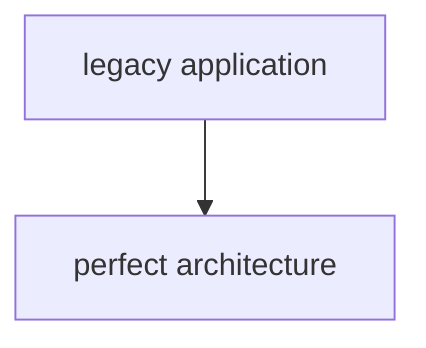

Instead, it's:

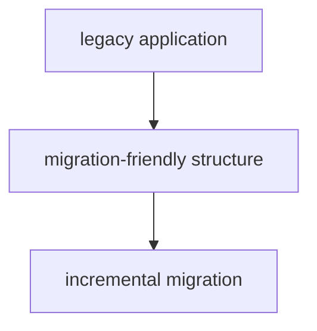

That difference can save a lot of unnecessary work.

::: note Prerequisites

You should be comfortable with:

- reading an existing codebase
- TypeScript or a similar language
- unit and integration testing
- dependency injection
- interfaces and adapters
- basic software architecture
- incremental refactoring

You should also have some behavioral protection around the capability you plan to modify.

That may include:

- characterization tests
- integration tests
- contract tests

or another reliable way to verify existing behavior.

Refactoring without that protection is possible. But it's also much harder to distinguish a structural improvement from an accidental behavioral change.

:::

---

## Why Migration Problems Often Start Before the Migration

Imagine you need to migrate an order-processing application.

You inspect the main service and find something like this:

```ts :collapsed-lines
async function processOrder(orderId: string) {
  const connection = await mysql.getConnection();

  const [rows] = await connection.query(
    "SELECT * FROM orders WHERE id = ?",
    [orderId]
  );

  const order = rows[0];

  if (!order) {
    throw new Error("Order not found");
  }

  if (order.customer_type === "PREMIUM") {
    order.total = order.total * 0.9;
  }

  if (
    order.country === "AR" &&
    order.payment_method === "TRANSFER"
  ) {
    order.total -= 500;
  }

  await connection.query(
    "UPDATE orders SET total = ?, status = ? WHERE id = ?",
    [order.total, "PROCESSED", order.id]
  );

  await paymentProvider.createPayment({
    orderId: order.id,
    amount: order.total,
  });

  await eventBus.publish("order.processed", {
    id: order.id,
    total: order.total,
  });

  await emailClient.send({
    to: order.customer_email,
    template: "order-processed",
  });

  return order;
}
```

Suppose the migration goal is:

```text
MySQL       → PostgreSQL
Old runtime → New runtime
Legacy API  → New service
```

The obvious temptation is to begin translating this function into the target stack.

But what exactly are you migrating?

The function contains:

```text
database access
business rules
state transition
payment integration
event publication
email delivery
application orchestration
```

Changing the database now risks affecting pricing, while changing the payment client risks affecting persistence. And moving the function into another service means moving all of its dependencies at once.

The migration difficulty is partly caused by the current structure. So before migrating, you'll want to create enough separation that those concerns can move independently.

---

## Choose a Migration Boundary Before Refactoring

Don't begin with:

> Let's clean up the application.

Begin with:

> What do we want to migrate first?

Suppose you decide the first capability will be Process Order. That gives your refactor a boundary.

Now you can map:

```text
Input:
orderId

Business behavior:
load order
calculate adjustments
mark as processed

Side effects:
persist order
create payment
publish event
send email

Output:
processed order
```

This is much more useful than deciding to refactor:

```sh
src/services/
```

because a folder isn't necessarily a business boundary.

Migration works better when you can reason about capabilities.

For example:

```text
Process Order
Cancel Order
Generate Invoice
Register Customer
Renew Subscription
```

Each can potentially become a migration unit.

---

## Don't Refactor the Entire Application

Once you start identifying architectural problems, it becomes tempting to fix all of them.

You may notice:

```text
circular dependencies
duplicated repositories
global configuration
large services
static helpers
direct database access
inconsistent error handling
mixed domain models
```

All of those may deserve attention, but the migration doesn't require all technical debt to disappear.

Suppose your target is the order-processing capability. A useful rule is to refactor only what prevents this capability from moving safely.

For example:

```md title="prompt"
Problem:
Order processing calls MySQL directly.

Relevant?
Yes.

Problem:
The reporting module uses inconsistent date formatting.

Relevant?
Probably not.

Problem:
Order processing calls the payment SDK directly.

Relevant?
Yes.

Problem:
The admin UI contains duplicated CSS.

Relevant?
No.
```

This prevents preparation from becoming an open-ended cleanup project.

Legacy modernization needs scope discipline.

---

## Separate Business Rules from Infrastructure

The most valuable structural change is often separating business behavior from technology-specific details.

Take this code:

```ts
async function processOrder(orderId: string) {
  const order = await mysqlOrders.find(orderId);

  if (order.customerType === "PREMIUM") {
    order.total *= 0.9;
  }

  if (
    order.country === "AR" &&
    order.paymentMethod === "TRANSFER"
  ) {
    order.total -= 500;
  }

  await mysqlOrders.update(order);

  await stripe.createPayment({
    orderId: order.id,
    amount: order.total,
  });
}
```

The pricing behavior itself doesn't need MySQL or Stripe.

You can extract it:

```ts
type Order = {
  id: string;
  total: number;
  customerType: "STANDARD" | "PREMIUM";
  country: string;
  paymentMethod: "CARD" | "TRANSFER";
};

function calculateOrderTotal(order: Order): number {
  let total = order.total;

  if (order.customerType === "PREMIUM") {
    total *= 0.9;
  }

  if (
    order.country === "AR" &&
    order.paymentMethod === "TRANSFER"
  ) {
    total -= 500;
  }

  return Math.max(total, 0);
}
```

Now:

```text
pricing behavior
```

is no longer coupled to:

```text
MySQL
Stripe
```

This doesn't require a complete domain-driven redesign. It's simply a useful separation.

The next migration step can replace infrastructure while leaving this behavior unchanged.

---

## Introduce Seams Around Hard Dependencies

Legacy code often contains dependencies that can't easily be replaced in tests or migration code.

For example:

```ts
class OrderService {
  async process(orderId: string) {
    const client = new LegacyDatabaseClient();

    const order = await client.findOrder(orderId);

    // ...
  }
}
```

The database dependency is created inside the method.

That makes substitution difficult.

A small preparatory refactor can introduce a seam:

```ts
interface OrderRepository {
  findById(id: string): Promise<Order | null>;
  save(order: Order): Promise<void>;
}
```

Then:

```ts
class OrderService {
  constructor(
    private readonly orders: OrderRepository
  ) {}

  async process(orderId: string) {
    const order = await this.orders.findById(orderId);

    if (!order) {
      throw new Error("Order not found");
    }

    // existing behavior
  }
}
```

Now the existing MySQL implementation can satisfy the interface:

```ts
class MySqlOrderRepository implements OrderRepository {
  async findById(id: string) {
    // existing MySQL behavior
  }

  async save(order: Order) {
    // existing MySQL behavior
  }
}
```

Later, the migration can introduce:

```ts
class PostgresOrderRepository implements OrderRepository {
  // new implementation
}
```

Notice what we didn't change: we didn't change the business behavior. We changed the **replaceability of a dependency**.

That's exactly the kind of refactoring that helps migration.

---

## Isolate Side Effects from Decision Logic

Another useful separation is between:

```text
deciding
```

and:

```text
performing
```

Suppose cancellation currently looks like this:

```ts
async function cancelOrder(order: Order) {
  if (order.status === "SHIPPED") {
    throw new Error("Cannot cancel shipped order");
  }

  order.status = "CANCELLED";

  await orders.save(order);
  await inventory.release(order.id);
  await payment.refund(order.id);
  await audit.log("ORDER_CANCELLED", order.id);
}
```

There are two different responsibilities here.

The business decision:

```text
Can this order be cancelled?
What should its new state be?
```

And the operational effects:

```text
persist
release inventory
refund
audit
```

You could first extract the decision:

```ts
function cancelOrderState(order: Order): Order {
  if (order.status === "SHIPPED") {
    throw new Error("Cannot cancel shipped order");
  }

  return {
    ...order,
    status: "CANCELLED",
  };
}
```

Then orchestration remains:

```ts
async function cancelOrder(order: Order) {
  const cancelled = cancelOrderState(order);

  await orders.save(cancelled);
  await inventory.release(cancelled.id);
  await payment.refund(cancelled.id);
  await audit.log("ORDER_CANCELLED", cancelled.id);

  return cancelled;
}
```

The behavior is still the same, but now the state transition can be tested and migrated independently.

That matters if the target architecture changes how side effects are executed.

For example, the future version might use:

```text
transactional outbox
event-driven workflow
queue
workflow engine
```

You don't need to introduce those mechanisms yet. You only need to stop the current decision logic from depending directly on them.

---

## Put External Systems Behind Adapters

External SDKs often leak deeply into legacy code.

For example:

```ts
const result = await stripe.paymentIntents.create({
  amount: order.total,
  currency: "usd",
  metadata: {
    orderId: order.id,
  },
});
```

If dozens of application modules depend directly on the Stripe SDK, replacing or relocating payment processing becomes difficult.

Create an application-level boundary instead:

```ts
type PaymentRequest = {
  orderId: string;
  amount: number;
};

type PaymentResult = {
  paymentId: string;
};

interface PaymentGateway {
  charge(
    request: PaymentRequest
  ): Promise<PaymentResult>;
}
```

The Stripe adapter contains the provider-specific details:

```ts
class StripePaymentGateway implements PaymentGateway {
  async charge(
    request: PaymentRequest
  ): Promise<PaymentResult> {
    const result =
      await stripe.paymentIntents.create({
        amount: request.amount,
        currency: "usd",
        metadata: {
          orderId: request.orderId,
        },
      });

    return {
      paymentId: result.id,
    };
  }
}
```

The application now knows about:

```text
PaymentGateway
```

instead of:

```text
Stripe SDK
```

This is useful for migration because provider-specific code is localized.

The same pattern works for:

```text
email providers
message brokers
cloud storage
ERP integrations
CRM APIs
identity providers
search engines
```

The adapter isn't valuable because interfaces are fashionable. It's valuable because it creates a boundary you can move.

---

## Improve Dependency Direction Without Rebuilding Everything

Legacy systems often have dependency relationships such as:

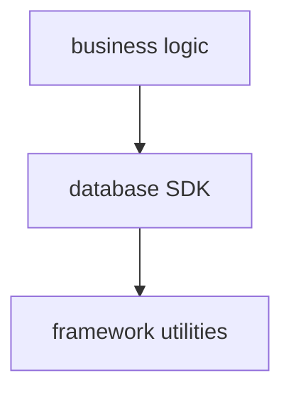

That makes infrastructure difficult to replace.

You don't necessarily need to implement full Clean Architecture. You only need to improve dependency direction where migration requires it.

For example:

Before:

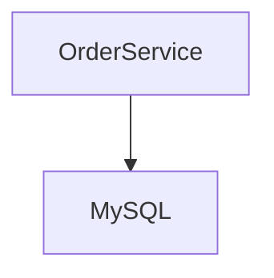

After:

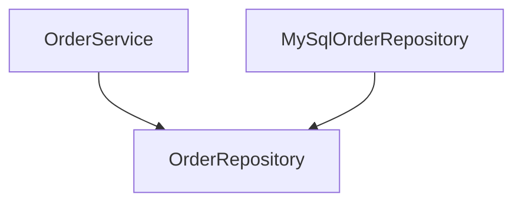

The application depends on an abstraction. The infrastructure implements it.

The same can happen with payments:

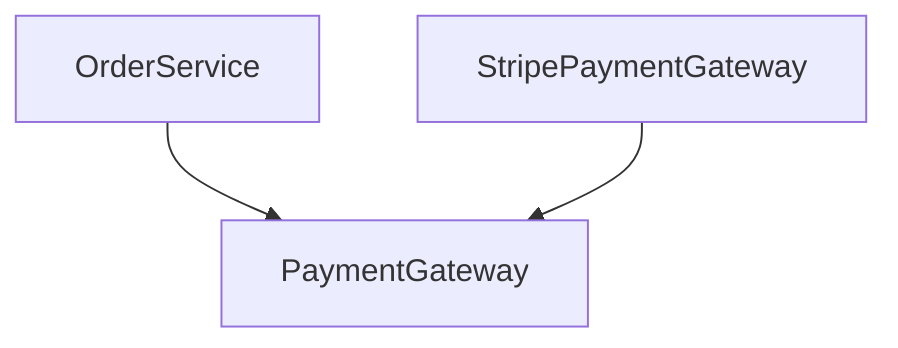

and messaging:

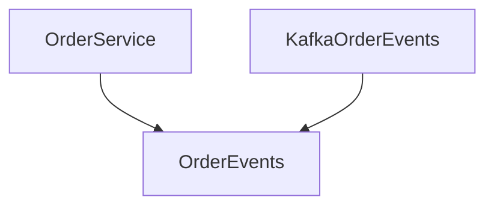

Now replacing infrastructure no longer requires rewriting the application service. That's the important outcome.

---

## Extract a Cohesive Application Boundary

After several small refactors, the capability may start to look like this:

```ts :collapsed-lines
interface OrderRepository {
  findById(id: string): Promise<Order | null>;
  save(order: Order): Promise<void>;
}

interface PaymentGateway {
  charge(request: {
    orderId: string;
    amount: number;
  }): Promise<void>;
}

interface OrderEvents {
  processed(order: Order): Promise<void>;
}

class ProcessOrder {
  constructor(
    private readonly orders: OrderRepository,
    private readonly payments: PaymentGateway,
    private readonly events: OrderEvents
  ) {}

  async execute(orderId: string) {
    const order = await this.orders.findById(orderId);

    if (!order) {
      throw new Error("Order not found");
    }

    const total = calculateOrderTotal(order);

    const processed: Order = {
      ...order,
      total,
      status: "PROCESSED",
    };

    await this.orders.save(processed);

    await this.payments.charge({
      orderId: processed.id,
      amount: processed.total,
    });

    await this.events.processed(processed);

    return processed;
  }
}
```

This isn't necessarily the final architecture. That's important.

We aren't claiming:

> This is how the application should look forever.

We're just saying:

> This capability now has boundaries that make migration easier.

The infrastructure can change independently.

The business rules are testable. The orchestration is visible. And the external contracts are explicit.

That's enough to start considering migration.

---

## Keep Behavioral Tests Running During the Refactor

This is where the characterization tests from the previous step become useful.

Suppose the original behavior was protected with:

```ts
it("preserves premium order processing behavior", async () => {
  const result = await processOrder("order-1");

  expect(result.total).toBe(9000);
  expect(result.status).toBe("PROCESSED");

  expect(payment.charge).toHaveBeenCalledWith({
    orderId: "order-1",
    amount: 9000,
  });

  expect(events.processed).toHaveBeenCalled();
});
```

Now you can change:

```text
direct database access
```

into:

```text
repository
```

and run the test.

Then change:

```text
direct payment SDK
```

into:

```text
payment adapter
```

and run the test.

Then extract:

```text
pricing logic
```

and run the test.

The rhythm becomes:

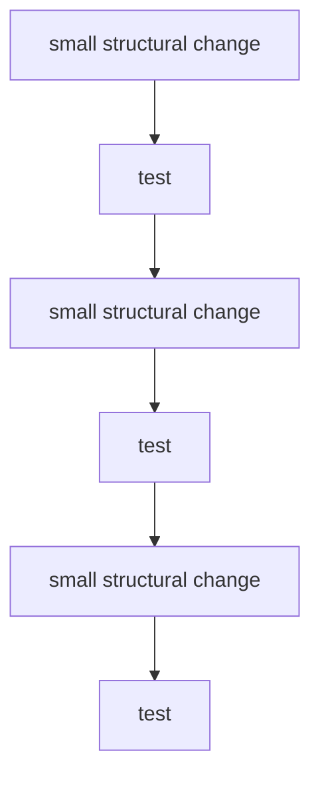

This matters because structural refactoring is much easier to reason about when behavioral changes aren't happening at the same time.

If a test fails after one small change, the possible cause is narrow.

If a test fails after a two-week rewrite, the possible cause is almost everything.

---

## How to Use AI During Structural Refactoring

AI can help a lot during this phase.

But the useful prompts are different from:

```md title="prompt"
Refactor this application using Clean Architecture.
```

Instead, give the model a constrained transformation.

For example:

```md title="prompt"
This service currently accesses MySQL directly.

I want to introduce an OrderRepository seam without
changing observable behavior.

Tasks:

1. identify every database operation used by this service,
2. propose the smallest repository interface needed,
3. move existing database calls behind an adapter,
4. preserve return values, errors, and call order where relevant,
5. do not change business rules,
6. do not introduce additional abstractions.

Explain every structural change before generating code.
```

That gives AI a much narrower job.

Another useful request is:

```md title="prompt"
Compare the implementation before and after this refactor.

Identify any observable behavior that may have changed.

Check specifically:

- exceptions,
- return values,
- side effects,
- ordering of side effects,
- null handling,
- transaction boundaries,
- retry behavior.

Do not assume equivalence because the code looks similar.
```

This is where AI can be valuable as a second reviewer.

It can inspect differences faster than you can manually scan large changes. But the tests still provide stronger evidence.

---

## Don't Ask AI to Design the Target Architecture Too Early

AI is very good at recognizing common architecture patterns. But that can also be dangerous.

Give a model a large legacy service and ask:

```text
How should this be modernized?
```

and you may receive:

```text
microservices
event-driven architecture
CQRS
repository pattern
domain events
message broker
API gateway
distributed cache
```

All of those are legitimate technologies or patterns, but none of them are automatically justified.

Before choosing a target architecture, you need constraints.

For example:

```text
deployment frequency
team size
transactional requirements
latency
failure tolerance
data ownership
integration boundaries
operational maturity
traffic
cost
regulatory requirements
```

A monolith with good boundaries may be a better target than microservices. A synchronous workflow may be better than event-driven processing. And a database migration may not require changing the domain model.

Architecture should follow constraints, not pattern recognition.

Use AI to evaluate options. Don't let the presence of a familiar pattern become the reason to adopt it.

---

## How to Know When a Capability Is Ready to Migrate

At some point, you have to stop refactoring. And that decision matters.

You don't need perfect code. A capability is usually much closer to migration-ready when you can answer these questions clearly.

### Can I Describe its Inputs?

For example:

```text
orderId
customer
request payload
event
```

### Can I Describe its Outputs?

For example:

```text
processed order
HTTP response
event
database change
```

### Are its Important Business Rules Visible?

They don't have to be perfect, but you should know where they live.

### Are External Dependencies Explicit?

For example:

```text
OrderRepository
PaymentGateway
OrderEvents
EmailSender
```

### Can Infrastructure Be Substituted?

If replacing MySQL requires changing pricing logic, the boundary is probably not ready.

### Are Important Behaviors Protected?

You should have enough tests to detect accidental changes.

### Do You Know the Side Effects?

For example:

```text
persist order
create payment
publish event
send email
```

### Are Major Unknowns Documented?

Some uncertainty may remain. But it shouldn't be invisible.

If you can answer those questions, you probably have enough structure to begin migrating that capability.

---

## A Practical Pre-Migration Refactoring Workflow

Here's the workflow I would use.

### 1. Choose One Capability

Don't refactor the whole application.

Pick:

```text
Process Order
Generate Invoice
Renew Subscription
```

### 2. Confirm Behavioral Protection

Before structural changes, make sure critical behavior has tests.

Capture:

```text
outputs
state transitions
side effects
errors
contracts
```

### 3. Identify Migration Blockers

Look for coupling such as:

```text
direct database access
provider SDKs
global state
framework-specific objects
static dependencies
shared mutable state
```

### 4. Extract Pure Business Logic Where Possible

Move calculations and decisions away from infrastructure.

For example:

```text
calculate price
validate transition
choose status
calculate commission
```

### 5. Introduce Seams

Create minimal boundaries around:

```text
database
payments
events
email
storage
external APIs
```

Don't create abstractions without a migration reason.

### 6. Localize Infrastructure

Move technology-specific behavior into adapters.

For example:

```text
MySqlOrderRepository
StripePaymentGateway
KafkaOrderEvents
SendGridEmailSender
```

### 7. Make Orchestration Visible

Aim for a capability where the sequence is understandable:

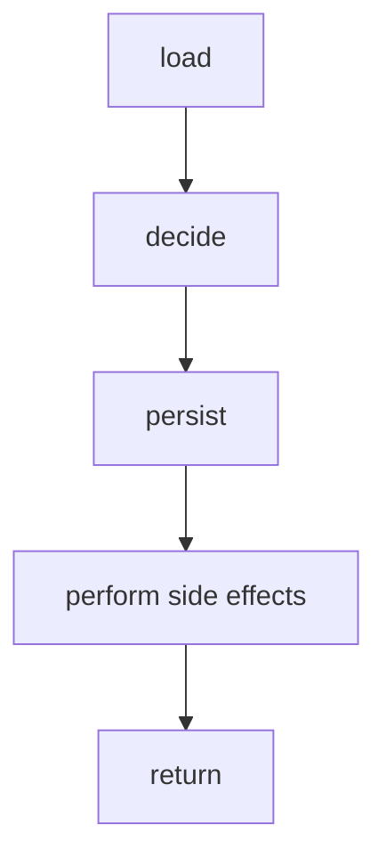

### 8. Run Behavioral Tests After Every Step

Don't batch ten refactors together. Keep the changes small.

### 9. Compare Before and After

Check:

```text
inputs
outputs
errors
side effects
data shapes
ordering
transactions
```

### 10. Stop When Migration Becomes Possible

Don't continue refactoring because the code could still be cleaner. It always could.

The objective is migration readiness.

---

## What Not to Refactor Before Migration

There are several things I would usually avoid changing during this phase unless they directly block migration.

### Naming Everywhere

You may dislike hundreds of old names. But renaming everything produces large diffs with little migration value.

### Formatting the Entire Repository

Same problem. Noise makes behavioral changes harder to review.

### Replacing Every Pattern

A legacy system may contain:

```text
singletons
service locators
static utilities
large classes
```

Some may remain temporarily. Fix the ones crossing your migration boundary.

### Rewriting Stable Algorithms

If an old calculation is ugly but protected and isolated, it may be safer to move it first and improve it later.

### Fixing Every Discovered Bug

This one is especially important.

If you discover a bug while preparing a migration, record it. Then decide whether fixing it belongs in the same change.

Mixing:

```text
structural refactor
+
behavioral correction
+
platform migration
```

makes failures much harder to understand.

Sometimes the right answer is:

```text
preserve bug
migrate
fix bug intentionally afterward
```

That sounds uncomfortable. But accidental behavior changes during migration can be much more dangerous.

---

## Refactoring Is Preparation, Not the Migration

It's easy for pre-migration refactoring to become an endless architecture project.

You start with:

> We need to isolate the database.

Then:

> We should redesign the domain model.

Then:

> Maybe we should introduce events.

Then:

> If we're doing that, maybe this should become a microservice.

Months later, nothing has migrated. The refactor has become the project.

That's a failure mode, too. The objective should remain concrete.

Before:

```text
ProcessOrder
├── MySQL
├── pricing rules
├── Stripe
├── Kafka
├── email
└── framework internals
```

After:

```text
ProcessOrder
├── OrderRepository
├── pricing rules
├── PaymentGateway
├── OrderEvents
└── EmailSender
```

That may be enough.

Now you have choices.

You can migrate:

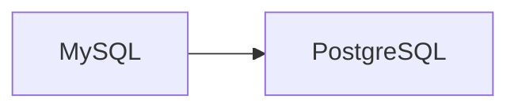

without redesigning pricing.

You can replace:

```text
Stripe adapter
```

without changing order orchestration.

You can move:

```text
ProcessOrder
```

into another runtime while preserving its contracts.

The refactor created options. That's the value.

---

## Conclusion

Legacy migrations become risky when several types of change happen at once.

You change:

```text
behavior
architecture
infrastructure
runtime
data
deployment
```

and then try to understand which change caused the failure.

A safer approach is to reduce that uncertainty before migration begins.

First understand the capability, then characterize its behavior, and then change its structure without intentionally changing what it does.

Create boundaries around dependencies. Separate business decisions from infrastructure. Localize external systems. Keep side effects visible. Run behavioral tests after every structural change. And stop refactoring when the capability becomes movable.

The sequence becomes:

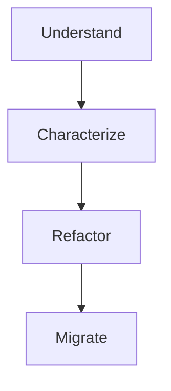

AI can make the refactoring phase dramatically faster.

It can identify dependencies, extract interfaces, move calls behind adapters, compare implementations, and review large diffs.

But faster refactoring doesn't remove the need for architectural judgment. It makes that judgment more important.

Because the goal isn't to produce the cleanest version of the legacy system. The goal is to create **just enough structure to move it safely**.

And once you can change the infrastructure without changing the behavior, migration stops looking like a rewrite.

It starts looking like a sequence of controlled changes.

<!-- TODO: add ARTICLE CARD -->
```component VPCard
{
  "title": "How to Refactor a Legacy Application Before Migrating It",
  "desc": "The moment a team decides to migrate a legacy application, there's usually pressure to start moving code. Move the database, the API, or the UI. Move the application to a new framework, runtime, cloud",
  "link": "https://chanhi2000.github.io/bookshelf/freecodecamp.org/refactor-legacy-application-before-migration.html",
  "logo": "https://cdn.freecodecamp.org/universal/favicons/favicon.ico",
  "background": "rgba(10,10,35,0.2)"
}
```
