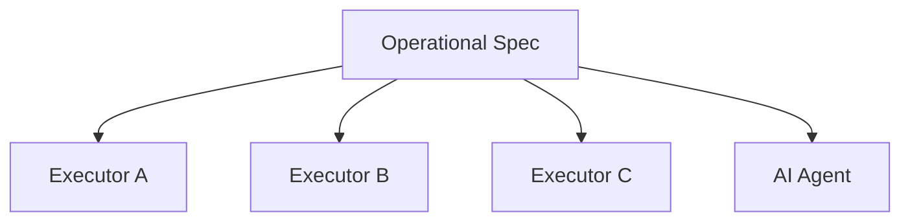
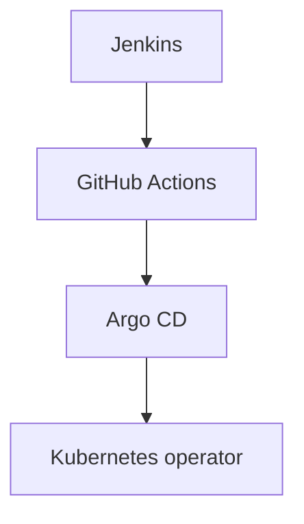

# {{ $frontmatter.title }} 관련

```component VPCard
{
  "title": "TypeScript > Article(s)",
  "desc": "Article(s)",
  "link": "/programming/ts/articles/README.md",
  "logo": "/images/ico-wind.svg",
  "background": "rgba(10,10,10,0.2)"
}
```

```component VPCard
{
  "title": "LLM > Article(s)",
  "desc": "Article(s)",
  "link": "/ai/llm/articles/README.md",
  "logo": "/images/ico-wind.svg",
  "background": "rgba(10,10,10,0.2)"
}
```

[[toc]]

---

<SiteInfo
  name="How to Separate Operational Intent from the Executor"
  desc="In my previous article, I argued that software automation needs a layer between operational intent and execution. The reason is simple: the specification should describe what success means, and the ex"
  url="https://freecodecamp.org/news/separate-operational-intent-from-executor"
  logo="https://cdn.freecodecamp.org/universal/favicons/favicon.ico"
  preview="https://cdn.hashnode.com/uploads/covers/5e1e335a7a1d3fcc59028c64/8b78496e-2ca5-4585-8cfa-f25cb56b56c7.png"/>

In [**my previous article**](/freecodecamp.org/software-automation-intent-execution-layer.md), I argued that software automation needs a layer between operational intent and execution.

The reason is simple: the specification should describe what success means, and the executor should decide how to achieve it.

That separation creates a useful possibility.

If the operational specification is independent from the execution mechanism, then more than one executor should be able to satisfy the same specification.

That sounds straightforward. But in practice, it raises several difficult questions:

- Can two different executors achieve the same operational outcome?
- How do we compare them?
- What must remain stable when the executor changes?
- Which differences are acceptable?
- What evidence should each executor produce?
- How do we know whether executor independence is real or just theoretical?

These questions matter because modern software systems rarely keep one execution mechanism forever.

Teams change:

```plaintext
CI/CD platforms
cloud providers
deployment systems
infrastructure tools
orchestration engines
incident automation
AI agents
```

If changing the executor also changes the meaning of the operation, then the system isn't really specification-driven. The executor still owns too much of the intent.

In this article, I’ll show you how to separate an operational specification from its executors, run the same specification through two different implementations, collect evidence, compare outcomes, and identify where executor independence breaks down.

The goal isn't to prove that two executors behave identically internally.

The goal is to determine whether they can satisfy the same operational contract.

::: note Prerequisites

You should be comfortable with:

- software architecture
- interfaces and dependency inversion
- TypeScript or a similar language
- CI/CD and deployment concepts
- observability
- basic testing
- operational specifications

You don't need Kubernetes, Terraform, or any specific cloud platform. The examples are intentionally small and in-memory so the architecture stays visible.

:::

---

## What Executor Independence Actually Means

Executor independence means that the operational specification remains valid even if the mechanism that performs the work changes.

For example, suppose the specification says:

```plaintext
Deploy Orders version v42. Constraints:
- at least 3 replicas available
- error rate <= 1%
- p95 latency <= 400 ms
- rollback must remain possible
```

One executor may implement that using:

```plaintext
Kubernetes rolling deployment
```

Another may use:

```plaintext
blue/green deployment
```

Another may use:

```plaintext
a managed cloud deployment service
```

And later, an AI agent may generate its own execution plan.

If every executor can be evaluated against the same specification, then the specification is doing its job.

Conceptually:



The specification stays stable while the execution mechanism changes.

That's executor independence.

---

## Why Executor Independence Matters

Software teams replace tools constantly. A deployment workflow might move from:



If every migration requires rediscovering:

```plaintext
what success means
what constraints matter
what evidence is required
when rollback is allowed
```

then the operational meaning was never truly independent from the old tool.

This creates several risks.

1. Tool lock-in: The system may be technically portable while the operational rules are not.
2. Hidden behavior changes: A new executor may preserve the same deployment steps but lose an important constraint.
3. Reimplementation drift: Teams may recreate the old behavior approximately rather than exactly.
4. Audit gaps: It becomes difficult to prove that the new executor preserves the same operational contract.

Executor independence gives you a stronger migration target: preserve the specification, replace the mechanism.

---

## Start with One Stable Operational Specification

To test executor independence, first define something stable.

For example:

```ts
type DeploymentSpec = {
  service: string;
  version: string;
  minReplicas: number;
  maxErrorRate: number;
  maxP95LatencyMs: number;
};
```

Then:

```ts
const spec: DeploymentSpec = {
  service: "orders",
  version: "v42",
  minReplicas: 3,
  maxErrorRate: 0.01,
  maxP95LatencyMs: 400,
};
```

This specification shouldn't contain:

```plaintext
kubectl
helm
terraform
AWS
Azure
Argo
GitHub Actions
```

Those belong to executors.

The specification describes the operational contract.

---

## Define an Executor Contract

Now define the minimum interface an executor must satisfy.

For example:

```ts
type ExecutionEvidence = {
  deployedVersion: string;
  availableReplicas: number;
  errorRate: number;
  p95LatencyMs: number;
};

interface DeploymentExecutor {
  execute(
    spec: DeploymentSpec
  ): Promise<ExecutionEvidence>;
}
```

This interface doesn't say how deployment happens.

It only says:

```plaintext
given a specification,
perform the operation,
return evidence
```

In this article, **evidence** means the observable facts produced or collected after execution that let us evaluate what actually happened. For a deployment, that might include the version that is running, the number of available replicas, the measured error rate, and p95 latency.

Evidence isn't the executor's opinion that the operation succeeded. It's the data we can compare against the specification.

That's important. If the executor interface includes tool-specific concepts, portability starts leaking.

For example, this would be more coupled:

```ts
interface DeploymentExecutor {
  executeKubectlCommand(
    namespace: string,
    manifestPath: string
  ): Promise<void>;
}
```

Now the interface already assumes Kubernetes.

That's not executor-independent.

---

## Build a First Executor

Let’s create a simple in-memory executor.

```ts
class RollingDeploymentExecutor
  implements DeploymentExecutor {
  async execute(
    spec: DeploymentSpec
  ): Promise<ExecutionEvidence> {
    return {
      deployedVersion: spec.version,
      availableReplicas:
        spec.minReplicas,
      errorRate: 0.004,
      p95LatencyMs: 280,
    };
  }
}
```

This executor simulates a rolling deployment.

Internally, you can imagine that it:

```plaintext
starts new replicas
waits for health
gradually replaces old replicas
```

But none of that appears in the specification. The executor owns the mechanism.

---

## Build a Second Executor

Now create a different strategy.

```ts
class BlueGreenExecutor
  implements DeploymentExecutor {
  async execute(
    spec: DeploymentSpec
  ): Promise<ExecutionEvidence> {
    return {
      deployedVersion: spec.version,
      availableReplicas:
        spec.minReplicas + 2,
      errorRate: 0.003,
      p95LatencyMs: 260,
    };
  }
}
```

This executor may conceptually:

```plaintext
create a parallel environment
verify it
switch traffic
keep the old environment available
```

Its internal process is different, but its evidence shape is the same. That means both can be evaluated against the same operational specification.

---

## Run the Same Specification Through Both Executors

Now execute both.

```ts
const rolling =
  new RollingDeploymentExecutor();

const blueGreen =
  new BlueGreenExecutor();

const rollingEvidence =
  await rolling.execute(spec);

const blueGreenEvidence =
  await blueGreen.execute(spec);
```

At this point, we have:

```plaintext
same specification
different executors
different internal behavior
different evidence values
```

The important question isn't whether they performed the same steps. They didn't. The question is if they both satisfied the same operational contract.

---

## Compare Evidence, Not Internal Steps

Executor independence depends on comparing outcomes rather than implementation details.

Suppose:

```plaintext
Rolling deployment:
replicas = 3
error rate = 0.4%
p95 = 280 ms

Blue/green:
replicas = 5
error rate = 0.3%
p95 = 260 ms
```

Those outputs aren't identical, but both may be conformant. That matters.

Executor independence doesn't require:

```plaintext
same commands
same number of steps
same topology
same timing
same infrastructure
```

It requires:

```plaintext
same operational intent
satisfied constraints
required evidence
acceptable outcome
```

This is similar to interface-based programming. Two implementations can behave differently internally while satisfying the same contract.

---

## Normalize Executor-Specific Evidence

Real executors often return different evidence formats.

Suppose executor A returns:

```json
{
  "readyReplicas": 3,
  "image": "orders:v42",
  "latencyP95": 280
}
```

Executor B returns:

```json
{
  "instancesHealthy": 5,
  "releaseVersion": "v42",
  "p95Ms": 260
}
```

These can't be compared directly. You need adapters.

For example:

```ts
type CanonicalEvidence = {
  version: string;
  availableReplicas: number;
  p95LatencyMs: number;
};
```

Adapter A:

```ts
function normalizeRolling(
  raw: {
    readyReplicas: number;
    image: string;
    latencyP95: number;
  }
): CanonicalEvidence {
  return {
    version:
      raw.image.split(":")[1],
    availableReplicas:
      raw.readyReplicas,
    p95LatencyMs:
      raw.latencyP95,
  };
}
```

This adapter translates the rolling executor's native output into the canonical evidence model. It extracts the version from the image tag, maps `readyReplicas` to `availableReplicas`, and renames `latencyP95` to `p95LatencyMs`.

The important point is that the adapter doesn't change the operational meaning. It only converts executor-specific field names and formats into the shared representation expected by the specification layer.

Adapter B:

```ts
function normalizeBlueGreen(
  raw: {
    instancesHealthy: number;
    releaseVersion: string;
    p95Ms: number;
  }
): CanonicalEvidence {
  return {
    version:
      raw.releaseVersion,
    availableReplicas:
      raw.instancesHealthy,
    p95LatencyMs:
      raw.p95Ms,
  };
}
```

This adapter does the same job for the blue/green executor. Its raw output uses different names, but those values represent the same operational concepts: version, available capacity, and p95 latency.

With both adapters in place, the rest of the system no longer needs to understand the executor-specific shapes. It can evaluate both results using the same canonical model.

Now both executors produce evidence that can be evaluated using the same model.

This is an important architectural boundary. Executor-specific evidence stays near the executor, while canonical evidence belongs to the specification layer.

---

## Separate Execution Evidence from Conformance

The executor should produce evidence. It shouldn't decide whether the operation was successful from the perspective of the specification.

That distinction prevents another form of coupling.

For example, avoid:

```ts
return {
  success: true,
};
```

A generic success flag tells you very little.

Instead, return evidence:

```ts
return {
  deployedVersion: "v42",
  availableReplicas: 3,
  errorRate: 0.004,
  p95LatencyMs: 280,
};
```

Then evaluate it separately.

```ts
type ConformanceResult = {
  conformant: boolean;
  failures: string[];
};

function evaluateConformance(
  spec: DeploymentSpec,
  evidence: ExecutionEvidence
): ConformanceResult {
  const failures: string[] = [];

  if (
    evidence.deployedVersion !==
    spec.version
  ) {
    failures.push(
      "wrong-version"
    );
  }

  if (
    evidence.availableReplicas <
    spec.minReplicas
  ) {
    failures.push(
      "insufficient-replicas"
    );
  }

  if (
    evidence.errorRate >
    spec.maxErrorRate
  ) {
    failures.push(
      "error-rate-too-high"
    );
  }

  if (
    evidence.p95LatencyMs >
    spec.maxP95LatencyMs
  ) {
    failures.push(
      "latency-too-high"
    );
  }

  return {
    conformant:
      failures.length === 0,
    failures,
  };
}
```

The evaluator receives two things: the specification that defines what should be true, and the evidence that describes what was actually observed.

It checks each constraint independently. A wrong version adds `wrong-version`, too few replicas adds `insufficient-replicas`, and the error-rate and latency checks work the same way.

At the end, `conformant` is `true` only when no failures were recorded. Returning the individual failure names is useful because it explains *why* an execution didn't conform instead of collapsing everything into a generic `false`.

This is why the executor should return facts rather than a final verdict. The same evidence can be reevaluated later if the specification changes, if an audit needs to reconstruct the decision, or if you want to compare multiple executors using exactly the same rules.

Now:

```plaintext
executor → evidence

specification + evidence → conformance
```

This separation will become important later.

---

## What Counts as Equivalent Execution?

Two executors don't need to produce identical evidence. They need to produce evidence that satisfies the same specification.

Suppose:

```plaintext
Executor A
replicas: 3
error rate: 0.4%
latency: 280 ms

Executor B
replicas: 5
error rate: 0.3%
latency: 260 ms
```

Both may pass.

Now suppose executor B produces:

```plaintext
replicas: 2
error rate: 0.3%
latency: 260 ms
```

It fails one constraint.

That means:

```plaintext
Executor A:
conformant

Executor B:
non-conformant
```

The executors are still independent implementations, but only one satisfied the specification for this execution.

That distinction matters.

Executor independence doesn't guarantee executor correctness. It only gives you a stable contract against which correctness can be evaluated.

---

## Where Executor Independence Usually Breaks

There are several common failure modes.

### Tool-Specific Fields in the Specification

For example:

```yaml
kubernetesNamespace: production
helmChart: orders
```

If those are truly implementation details, they shouldn't live in the operational specification.

### Executor-Owned Success Rules

If each executor defines its own thresholds, the specification is no longer authoritative.

### Missing Evidence Normalization

Different executors may expose different concepts that are never mapped into a common model.

### Hidden Preconditions

Executor A may require an approval. Executor B may not.

If approval is part of operational intent, that rule shouldn't live only inside one executor.

### Hidden Recovery Behavior

One executor may rollback automatically, while another may leave the failed state running.

If recovery behavior matters, the specification should express that expectation.

### Semantic Mismatch

Two tools may use the same words differently.

For example:

```plaintext
healthy
ready
available
running
```

Those concepts need explicit definitions. Otherwise executor portability is superficial.

---

## How to Test Executor Portability

You can test executor independence explicitly.

Start with a suite of specifications.

For example:

```ts
const cases: DeploymentSpec[] = [
  {
    service: "orders",
    version: "v42",
    minReplicas: 3,
    maxErrorRate: 0.01,
    maxP95LatencyMs: 400,
  },
  {
    service: "payments",
    version: "v18",
    minReplicas: 5,
    maxErrorRate: 0.005,
    maxP95LatencyMs: 250,
  },
];
```

Then run each specification against every executor.

```ts
const executors:
  DeploymentExecutor[] = [
    new RollingDeploymentExecutor(),
    new BlueGreenExecutor(),
  ];

for (const spec of cases) {
  for (const executor of executors) {
    const evidence =
      await executor.execute(spec);

    const result =
      evaluateConformance(
        spec,
        evidence
      );

    console.log({
      spec: spec.service,
      executor:
        executor.constructor.name,
      result,
    });
  }
}
```

This produces a useful matrix:

```plaintext
               Rolling    BlueGreen
Orders v42     PASS       PASS
Payments v18   PASS       FAIL
```

Now you have evidence about executor portability.

That is much stronger than assuming that both tools support deployments, so they're equivalent.

---

## Why This Matters for AI Agents

AI agents make executor independence even more interesting.

An AI agent may generate a new plan every time.

For example:

```plaintext
Execution 1:
scale
deploy
verify
route

Execution 2:
create parallel environment
verify
switch traffic

Execution 3:
deploy canary
observe
expand rollout
```

The plans differ, and the executor behavior is dynamic. That makes step-by-step equivalence unrealistic.

But the specification can still remain stable.

For example:

```plaintext
Deploy Orders v42. Constraints:
replicas >= 3
error rate <= 1%
latency <= 400 ms

Evidence:
running version
replicas
error rate
latency
```

The AI agent can choose any acceptable plan, and its result is still evaluated using the same contract.

This creates a powerful boundary:

```plaintext
agent autonomy
inside
operational constraints
```

The agent can optimize execution. It can't silently redefine success.

---

## A Small End-to-End Example

Let’s put the pieces together.

Start with the specification:

```ts
const spec: DeploymentSpec = {
  service: "orders",
  version: "v42",
  minReplicas: 3,
  maxErrorRate: 0.01,
  maxP95LatencyMs: 400,
};
```

Create two executors:

```ts
const executors:
  DeploymentExecutor[] = [
    new RollingDeploymentExecutor(),
    new BlueGreenExecutor(),
  ];
```

Run them:

```ts
for (const executor of executors) {
  const evidence =
    await executor.execute(spec);

  const conformance =
    evaluateConformance(
      spec,
      evidence
    );

  console.log(
    executor.constructor.name,
    evidence,
    conformance
  );
}
```

Possible result:

```plaintext
RollingDeploymentExecutor

evidence:
version = v42
replicas = 3
error rate = 0.004
p95 = 280

conformance:
PASS
```

and:

```plaintext
BlueGreenExecutor

evidence:
version = v42
replicas = 5
error rate = 0.003
p95 = 260

conformance:
PASS
```

The executors didn't behave identically, and they didn't need to. They satisfied the same operational specification.

Now imagine the second executor reports:

```plaintext
replicas = 2
```

The result becomes:

```plaintext
BlueGreenExecutor

conformance:
FAIL

reason:
insufficient-replicas
```

That's exactly what we want: the specification remains stable, and the executor changes.

Evidence reveals whether the execution satisfies the contract.

---

## A Practical Workflow

If you want to test executor independence in a real system, I would use this sequence.

### 1. Pick One Operation

For example:

```plaintext
deploy service
restore backup
rotate certificate
scale worker pool
```

### 2. Extract the Operational Specification

Define:

```plaintext
objective
constraints
evidence requirements
recovery expectations
```

### 3. Remove Tool-Specific Language

Look for:

```plaintext
kubectl
Terraform
GitHub Actions
AWS CLI
specific resource IDs
```

Keep only what is truly part of the operational intent.

### 4. Define an Executor Interface

Make the executor responsible for:

```plaintext
performing the operation
producing evidence
```

### 5. Build the First Adapter

Wrap the current implementation, don't rewrite it.

### 6. Build a Second Executor

Use:

```plaintext
another tool
another deployment strategy
a simulator
a test double
an AI agent
```

### 7. Normalize Evidence

Map executor-specific observations into a canonical evidence model.

### 8. Evaluate Conformance Separately

Don't let the executor decide whether it passed.

### 9. Compare Portability

Run the same specifications through multiple executors.

### 10. Investigate Differences

Ask:

```plaintext
Is the executor wrong?

Is the specification incomplete?

Is evidence missing?

Are the concepts actually equivalent?
```

Those differences are useful. They expose hidden coupling.

---

## What Executor Independence Does Not Mean

Executor independence doesn't mean that all tools are interchangeable.

Different executors may have different:

```plaintext
capabilities
costs
latency
failure modes
security models
operational complexity
```

A specification may also require a capability that one executor simply can't provide.

For example:

```plaintext
zero-downtime deployment
```

may be feasible in one platform and impossible in another.

That's not a failure of the specification. It's useful information. The executor can't satisfy the contract.

Executor independence also doesn't mean ignoring implementation details. Implementation details still matter for:

```plaintext
performance
security
cost
reliability
maintainability
```

The point is narrower: the operational meaning shouldn't depend on one specific execution mechanism.

---

## From Replaceable Tools to Stable Operational Intent

Software infrastructure changes constantly.

Tools come and go, execution strategies evolve, cloud platforms change, and agents become more capable.

If operational intent is embedded inside each executor, every change risks becoming a semantic migration.

But if intent is represented independently:

```plaintext
Operational specification
          ↓
     stable contract
          ↓
   replaceable executor
```

then the system becomes easier to evolve.

This also gives us something else:

```plaintext
evidence from multiple executors
evaluated against the same specification
```

At that point, we can stop asking:

> Did the tool finish?

and start asking:

> To what degree did this execution conform to the specification?

That's the next problem.

---

## Conclusion

Executor independence isn't about pretending every tool is the same. It's about protecting operational intent from implementation churn.

A specification describes:

```plaintext
what should happen
what constraints must hold
what evidence is required
```

An executor decides:

```plaintext
how to make it happen
```

Then execution produces evidence. And evidence can be evaluated independently.

That gives us:

```plaintext
Specification
      ↓
Executor A ──→ Evidence A
Executor B ──→ Evidence B
      ↓
Evaluation
```

Two executors can use completely different strategies and still satisfy the same operational contract.

That's a useful property for ordinary automation.

It becomes even more important when executors are autonomous agents whose internal plans may change from one run to the next.

But once multiple executors can operate against the same specification, a new question becomes unavoidable:

> How should we measure conformance between the specification and what actually happened?

That's where I want to go next.

<!-- TODO: add ARTICLE CARD -->
```component VPCard
{
  "title": "How to Separate Operational Intent from the Executor",
  "desc": "In my previous article, I argued that software automation needs a layer between operational intent and execution. The reason is simple: the specification should describe what success means, and the ex",
  "link": "https://chanhi2000.github.io/bookshelf/freecodecamp.org/separate-operational-intent-from-executor.html",
  "logo": "https://cdn.freecodecamp.org/universal/favicons/favicon.ico",
  "background": "rgba(10,10,35,0.2)"
}
```
