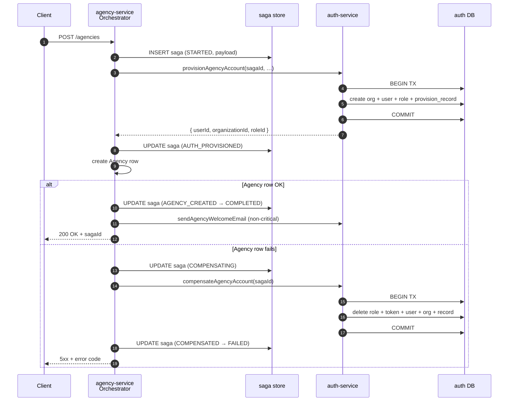

# {{ $frontmatter.title }} 관련

```component VPCard
{
  "title": "Nest.js > Article(s)",
  "desc": "Article(s)",
  "link": "/programming/js-nest/articles/README.md",
  "logo": "/images/ico-wind.svg",
  "background": "rgba(10,10,10,0.2)"
}
```

[[toc]]

---

<SiteInfo
  name="The Saga Pattern in Node.js: How to Roll Back Distributed Transactions Across Microservices"
  desc="Building reliable workflows across multiple microservices is challenging. In a monolith, a database transaction can ensure that multiple operations either succeed or fail together. But once data is sp"
  url="https://freecodecamp.org/news/the-saga-pattern-in-node-js-roll-back-distributed-transactions-across-microservices"
  logo="https://cdn.freecodecamp.org/universal/favicons/favicon.ico"
  preview="https://cdn.hashnode.com/uploads/covers/5e1e335a7a1d3fcc59028c64/b0e126ec-8b90-470a-b5c0-55e5e1673731.png"/>

Building reliable workflows across multiple microservices is challenging. In a monolith, a database transaction can ensure that multiple operations either succeed or fail together. But once data is spread across different services and databases, that guarantee disappears.

This is where the Saga Pattern comes in. Instead of using distributed transactions, a saga coordinates a sequence of local transactions and runs compensation actions when something goes wrong.

In this article, we'll build an orchestrated Saga Pattern using NestJS, gRPC, PostgreSQL, and Sequelize. You'll learn how to coordinate work across services, implement compensation-based rollbacks, handle idempotency, and track workflow progress in a production-style microservice architecture.

::: note Prerequisites

This article assumes you're already familiar with some backend development concepts. You don't need prior experience with the Saga Pattern, but you should be comfortable with:

- JavaScript, TypeScript, Node.js
- NestJS fundamentals (controllers, services, dependency injection)
- Basic PostgreSQL concepts
- Database transactions
- Docker (recommended for local development)
- Microservice architecture basics
- gRPC fundamentals (helpful but not required)

If you've already built a few backend services with NestJS and PostgreSQL, you'll have everything you need to follow this guide.

:::

---

## 1. Introduction

A **saga** is a sequence of local transactions across multiple services. Each step commits its own database transaction. If a later step fails, the saga runs **compensating transactions** to semantically undo the work already committed.

The pattern was first described by Hector Garcia-Molina and Kenneth Salem in 1987 for long-lived database transactions. It was rediscovered a decade ago when companies started splitting monoliths into microservices and realised that the database transaction — the single most powerful tool in a backend developer's belt — stops working at the service boundary.

This article walks through an orchestrated saga in Node.js (NestJS + gRPC) for onboarding an agency, where two services must agree on a single business outcome:

- `agency-service`: owns the agency record.
- `auth-service`: owns the organization, user and role.

If either side fails, the system must end up as if nothing ever happened. No half-created users, orphan organizations, or 3am Slack threads.

---

## 2. The Problem in One Picture

Here's the bug a saga is built to prevent:

```plaintext
Step 1: auth-service     ✅ creates Organization #42
Step 2: auth-service     ✅ creates User #99
Step 3: agency-service   ❌ fails (DB down, validation, network blip…)

Result without a saga:
   Organization #42 and User #99 still exist.
   There is no Agency row.
   The user can log in but has nothing to manage.
   Support gets a ticket. Engineer writes a one-off SQL cleanup.
   Repeat every week.
```

The saga's job is to detect that step 3 failed and **explicitly delete Organization #42 and User #99**, so the system is consistent again — even though those rows live in a different service's database.

---

## 3. Why You Need a Saga

In a monolith, you wrap everything in one DB transaction and let the database handle atomicity:

```ts
await sequelize.transaction(async (tx) => {
  await Organization.create({...}, { transaction: tx });
  await User.create({...}, { transaction: tx });
  await Agency.create({...}, { transaction: tx });
});
```

In microservices, each service has its own database. You can't wrap two services in one ACID transaction. The classic alternatives all have problems:

| Option | Problem |
| --- | --- |
| **Two-Phase Commit (2PC)** | Locks rows across services, coordinator is a single point of failure, and doesn't scale. Most modern databases don't support it well across HTTP/gRPC. |
| **"Just hope it works"** | Leaves orphan users / billing rows when half the flow fails. Real data corruption — and the longer the system runs, the more orphans accumulate. |
| **Manual cleanup scripts** | Works for a week. Bugs hide for months. New engineers don't know they exist. |
| **Eventual consistency without compensation** | Fine for some domains (analytics) but completely wrong for billing, identity, or anything with money. |
| **Saga pattern** | Each service commits locally. The orchestrator owns the workflow and runs explicit compensation on failure. It's auditable, restartable, and reasonable. |

The saga gives you eventual consistency with a clear, auditable rollback path — without distributed locks.

---

## 4. Choreography vs Orchestration

There are two ways to implement a saga:

### Choreography

With Choreography, services emit events and other services subscribe and react.

```plaintext
auth-service → emits "UserCreated"
agency-service → listens, creates agency, emits "AgencyCreated"
billing-service → listens, creates subscription…
```

It's simple at first, but brittle later. The workflow is scattered across N codebases. Nobody owns it. Debugging means tracing events across logs. Adding a step means changing several services.

### Orchestration

With Orchestration, one service is the conductor. It calls the others in order.

```plaintext
orchestrator:
   1. authClient.provisionAccount(...)
   2. agencyRepo.create(...)
   3. authClient.sendWelcomeEmail(...)
```

There's slightly more coupling here (the orchestrator imports clients), but the entire workflow lives in one file. Onboarding new engineers becomes a one-hour task. Adding a step is a single PR.

**Pick orchestration unless you have a strong reason not to.** This article — and the reference implementation — uses orchestration.

---

## 5. The Example Project

Our goal here is to create an Agency in the system. This is the moment a new B2B customer signs up.

It requires two services to agree on a single outcome:

`auth-service` **must create:**

- an `Organization` row (the tenant)
- a `User` row (the agency admin who will log in)
- a `UserRole` row linking the user to the `AGENCY_ADMIN` role

`agency-service` **must create:**

- an `Agency` row containing business details (size, registration number, website, branches…), linked to the user/organization above

These rows have foreign-key relationships *within* a service, but *not* across services — Postgres can't enforce that the user in auth's DB matches the `authUserId` in agency's DB. The application has to do it.

```plaintext
auth-service DB                    agency-service DB
─────────────────                  ─────────────────
organizations  ◄────────┐
   │                    │
   │ (1:1)              │   foreign reference (no FK)
   ▼                    │           agencies
users  ──────► user_roles                     ─ authUserId
                                              └ authOrganizationId
```

If step 2 fails *after* step 1 succeeded, we end up with a user who can authenticate but has no agency — the exact bug from 2. That's what the saga prevents.

---

## 6. Architecture

```plaintext
                     ┌───────────────────────────────┐
                     │        API Gateway            │
                     └──────────────┬────────────────┘
                                    │ HTTP
                                    ▼
   ┌──────────────────────────────────────────────────┐
   │              agency-service                      │
   │   ┌─────────────────────────────────────────┐    │
   │   │   AgencyOnboardingOrchestrator (SAGA)   │    │
   │   └───────────────┬─────────────────────────┘    │
   │                   │ writes state                 │
   │                   ▼                              │
   │      agency_onboarding_sagas  (Postgres)         │
   └───────────────┬─────────────────┬────────────────┘
                   │ gRPC            │ gRPC
       provisionAgencyAccount   compensateAgencyAccount
                   │                 │
                   ▼                 ▼
   ┌──────────────────────────────────────────────────┐
   │              auth-service                        │
   │   AgencyProvisioningService  (Participant)       │
   │                                                  │
   │   organizations · users · user_roles             │
   │   agency_provision_records  ← idempotency log    │
   └──────────────────────────────────────────────────┘
```
<!-- TODO: mermaid환-->

Three components do all the work:

1. `AgencyOnboardingOrchestrator` in `agency-service` — drives the workflow.
2. `agency_onboarding_sagas` table in `agency-service` — the durable log of the saga's progress.
3. `AgencyProvisioningService` in `auth-service` — exposes a `do` operation (`provisionAgencyAccount`) and an `undo` operation (`compensateAgencyAccount`). It's backed by its own `agency_provision_records` idempotency table.

The orchestrator never reaches into the auth database directly. The boundary is enforced by gRPC.

---

## 7. The Saga Flow, Step by Step

This sequence diagram shows the complete lifecycle of the onboarding saga. The workflow begins when a client sends a request to create a new agency. The orchestrator first creates a saga record in its database and marks it as `STARTED`, giving it a durable record of the workflow before any business action takes place.

At a high level, the orchestrator begins by creating a saga record and then asks `auth-service` to provision the organization, user, and role. Once that succeeds, the orchestrator creates the agency record in its own database.

If every step succeeds, the saga reaches the `COMPLETED` state. If the agency creation fails after the auth resources have already been created, the orchestrator triggers a compensation step that instructs `auth-service` to remove everything it previously provisioned.

The key idea is that each service commits its own local transaction, while the saga coordinates the overall business workflow and ensures the system can return to a consistent state when failures occur.



Read this once top to bottom and you'll understand the entire onboarding workflow. That's the value of orchestration — the sequence diagram *is* the architecture.

---

## 8. The State Machine

Every transition is written to `agency_onboarding_sagas` **before** the next step runs. That is what makes the saga observable and recoverable.

```ts
export enum AgencyOnboardingSagaStatus {
  STARTED            = 'STARTED',            // Row exists, no side effects yet
  AUTH_PROVISIONED   = 'AUTH_PROVISIONED',   // Auth side committed
  AGENCY_CREATED     = 'AGENCY_CREATED',     // Agency row committed
  COMPLETED          = 'COMPLETED',          // Happy-path terminal state
  COMPENSATING       = 'COMPENSATING',       // Rollback in progress
  COMPENSATED        = 'COMPENSATED',        // Rollback finished
  FAILED             = 'FAILED',             // Terminal failure (with or without compensation)
}
```

Why so many states? Because *"what went wrong here?"* is a question someone will ask at 2am. A saga that only stores `success | failure` is useless for forensics.

```plaintext
                ┌── auth fails ──────────► FAILED  (nothing to compensate)
                │
STARTED ──► AUTH_PROVISIONED ──► AGENCY_CREATED ──► COMPLETED  (happy path)
                                       │
                       agency fails ───┘
                                       ▼
                                COMPENSATING
                                       │
                                       ▼
                                COMPENSATED ──► FAILED  (consistent again)
```
<!-- TODO: mermaid화 -->

The “point of no return” is `AUTH_PROVISIONED`. Before it, we can fail fast — there's nothing to undo. After it, every failure path *must* go through compensation.

---

## 9. Implementing the Orchestrator

The orchestrator is the *only* place that knows the workflow. Each step is a private method, and each step persists its result before returning.

### Creating the Saga Record

```ts title="agency-onboarding.saga.repository.ts"
async createSaga(payload: CreateAgencyOrchestrationInput) {
  return this.sagaModel.create({
    sagaId: randomUUID(),                          // correlation id for everything
    status: AgencyOnboardingSagaStatus.STARTED,
    currentStep: 'STARTED',
    payload,                                       // full input snapshot for replay
  });
}
```

The `sagaId` is a UUID generated once and **propagated to every downstream call**. It's the single identifier that ties the saga log on the orchestrator side to the provision record on the participant side.

### The Main Loop

```ts title="agency-onboarding.orchestrator.ts"
// trimmed for the article
async execute(input: CreateAgencyOrchestrationInput) {
  const saga = await this.sagaRepository.createSaga(input); // STARTED

  try {
    // Step 1 — auth-service work
    const authStep = await this.provisionAuth(saga, input);
    if (!authStep.ok) {
      await this.markFailed(saga, authStep.failure); // nothing to compensate
      return authStep.failure;
    }

    // Step 2 — agency-service work
    let activeSaga = authStep.saga; // status: AUTH_PROVISIONED
    try {
      activeSaga = await this.createAgencyRow(activeSaga, input, authStep.authIds);
    } catch (err) {
      // The expensive case: undo what auth-service did
      await this.compensateAuth(activeSaga, 'SAGA_FAILED');
      const failure = mapSagaFailure(err.message, 'SAGA_FAILED', 'CREATE_AGENCY');
      await this.markFailed(activeSaga, failure);
      return failure;
    }

    // Step 3 — mark done and run non-critical side effects
    activeSaga = await this.sagaRepository.updateSaga(activeSaga, {
      status: AgencyOnboardingSagaStatus.COMPLETED,
    });
    await this.sendWelcomeEmail(input, activeSaga); // best-effort

    return mapSagaSuccess(activeSaga, await this.agencyModel.findByPk(activeSaga.agencyId!));
  } catch (error) {
    // Defensive catch-all (lost DB connection, unexpected throw)
    await this.compensateAuth(saga, 'SAGA_FAILED');
    const failure = mapSagaFailure(error.message, 'SAGA_FAILED', 'SAGA');
    await this.markFailed(saga, failure);
    return failure;
  }
}
```

### A Single Step in Detail

```ts
private async provisionAuth(saga: AgencyOnboardingSaga, input: ...) {
  this.logger.log(`[${saga.sagaId}] PROVISION_AUTH`);

  const auth = await firstValueFrom(
    this.authClient.provisionAgencyAccount({
      sagaId: saga.sagaId,                  // <-- correlation
      organizationName: input.agencyName.trim(),
      email: input.email.trim().toLowerCase(),
      // …
    }),
  );

  if (!auth.status || !auth.data) {
    return { ok: false, failure: mapAuthProvisionFailure(auth) };
  }

  // Persist the IDs we will need if we have to compensate later
  const updated = await this.sagaRepository.updateSaga(saga, {
    authOrganizationId: Number(auth.data.organizationId),
    authUserId: Number(auth.data.userId),
    authUserRoleId: Number(auth.data.userRoleId),
    status: AgencyOnboardingSagaStatus.AUTH_PROVISIONED,
  });

  return { ok: true, saga: updated, authIds: auth.data };
}
```

The line that does most of the work is the `updateSaga` call. It stores the foreign IDs returned by `auth-service` on the saga row, so even if the orchestrator process crashes and restarts, a recovery job can read that row and still know what to compensate.

### Habits Worth Copying

- **Persist after every successful step**, including the IDs you'll need to undo it.
- **Distinguish critical vs non-critical steps.** Welcome emails, audit logs and analytics events are *not* worth rolling a saga back for. They're best-effort.
- **One log line per transition**, prefixed with `[${sagaId}]`. Grep is your debugger.

---

## 10. Implementing the Participant

The participant (`auth-service`) wraps all of its own work in a local DB transaction. Inside that boundary it's still ACID — the saga only handles the cross-service problem.

```ts :collapsed-lines title="agency-provisioning.service.ts"
// trimmed
async provisionAgencyAccount(req: ProvisionAgencyAccountInput) {

  // 1. Idempotency — return the previous result if this sagaId already provisioned.
  const existing = await this.provisionRecordModel.findOne({
    where: { sagaId: req.sagaId },
  });
  if (existing) {
    return serviceSuccess('Agency admin already onboarded', {
      userId: Number(existing.userId),
      organizationId: Number(existing.organizationId),
      userRoleId: Number(existing.roleId),
    });
  }

  // 2. Domain validation BEFORE the transaction (fail fast).
  if (await this.emailExists(req.email)) {
    return serviceFailure('Email already exists', { code: 'EMAIL_EXISTS' });
  }
  if (await this.organizationExists(req.organizationName)) {
    return serviceFailure('Organization already exists', { code: 'ORGANIZATION_EXISTS' });
  }

  // 3. The actual work — atomic at the auth-service boundary.
  return withSequelizeTransaction(this.sequelize, async (tx) => {
    const org = await this.organizationModel.create({ ... }, { transaction: tx });
    const user = await this.userModel.create({ ..., organizationId: org.id }, { transaction: tx });
    await this.userRoleModel.create({ userId: user.id, roleId: agencyAdminRole.id }, { transaction: tx });

    // The audit record that makes compensation possible later.
    await this.provisionRecordModel.create(
      { sagaId: req.sagaId, organizationId: org.id, userId: user.id, roleId: agencyAdminRole.id },
      { transaction: tx },
    );

    return serviceSuccess('Provisioned', {
      userId: user.id, organizationId: org.id, userRoleId: agencyAdminRole.id,
    });
  });
}
```

::: info Three things make this method "saga-safe"

1. **Idempotency check first:** If the orchestrator retries (network blip, gRPC timeout), the second call is a no-op that returns the same IDs. No duplicate users.
2. **Validation outside the transaction:** Cheap reads first, expensive writes second.
3. **One transaction wraps every write:** If any insert fails, the whole thing rolls back automatically. The orchestrator sees a clean failure response and knows nothing was persisted.

:::

The `agency_provision_records` table is the single most important piece of the participant. It's **both** the idempotency key *and* the compensation lookup — keyed by the same `sagaId` the orchestrator uses.

---

## 11. Rollback (Compensation)

Compensation is just another gRPC call. The orchestrator sends the `sagaId` and the IDs it remembers. The participant deletes everything it created, **in reverse dependency order**, inside its own DB transaction.

### On the Orchestrator Side

```ts :collapsed-lines
private async compensateAuth(saga: AgencyOnboardingSaga, errorCode?: string) {
  if (!saga.authUserId && !saga.authOrganizationId) {
    // Nothing was provisioned — nothing to compensate.
    return;
  }

  // Mark the saga as compensating BEFORE the call, so the row is consistent
  // even if the compensating RPC times out.
  await this.sagaRepository.updateSaga(saga, {
    status: AgencyOnboardingSagaStatus.COMPENSATING,
    currentStep: 'COMPENSATING',
    errorCode,
  });

  try {
    const rollback = await firstValueFrom(this.authClient.compensateAgencyAccount({
      sagaId: saga.sagaId,
      organizationId: saga.authOrganizationId,
      userId: saga.authUserId,
    }));
    if (!rollback.status) {
      this.logger.error(`[\({saga.sagaId}] Auth compensation returned failure: \){rollback.message}`);
    }
  } catch (err) {
    this.logger.error(`[\({saga.sagaId}] Auth compensation RPC failed: \){err.message}`);
  }

  await this.sagaRepository.updateSaga(saga, {
    status: AgencyOnboardingSagaStatus.COMPENSATED,
    currentStep: 'COMPENSATED',
  });
}
```

### On the Participant Side

```ts
private async rollbackProvisionedAuth(req, sagaId: string, tx: Transaction) {
  // Use the saga log as the source of truth — even if the caller forgot IDs.
  const record = await this.provisionRecordModel.findOne({
    where: { sagaId }, transaction: tx,
  });
  const userId         = req.userId         ?? record?.userId;
  const organizationId = req.organizationId ?? record?.organizationId;

  if (userId) {
    const user = await this.userModel.findByPk(userId, { transaction: tx, attributes: ['email'] });
    await this.userRoleModel.destroy({ where: { userId }, transaction: tx });
    if (user?.email) {
      await this.passwordResetTokenModel.destroy({ where: { email: user.email }, transaction: tx });
    }
    await this.userModel.destroy({ where: { id: userId }, transaction: tx });
  }
  if (organizationId) {
    await this.organizationModel.destroy({ where: { id: organizationId }, transaction: tx });
  }
  if (record) {
    await record.destroy({ transaction: tx });
  }
}
```

::: important Rules of a Good Compensation

1. **Reverse the order of creation:** Children first (user_roles, tokens), then parents (users, organizations). The same rule you follow for `DROP TABLE` statements.
2. **Be idempotent:** Receiving the same `sagaId` twice must be safe — every `destroy` is a no-op if the row is already gone.
3. **Use the saga log, not just the request:** If the caller forgets an ID or sends a partial payload, look it up by `sagaId`. Defence in depth.
4. **Wrap it in a local transaction:** The rollback must itself be atomic — half-undone is worse than not-undone.
5. **Always close the loop on the orchestrator side:** Mark `COMPENSATED` even if the RPC failed. The failure should also be surfaced (log, metric, alert). A stuck `COMPENSATING` row is an operational landmine.

:::

### What Happens if the Compensation Itself Fails?

This is the worst case in any saga design. There are three reasonable strategies:

First, you can retry with exponential backoff. This works for transient failures (network, deadlocks).

Second, you can dead-letter the saga — write it to a "needs human attention" queue and alert.

Third, you can expose a manual rollback endpoint. This reference implementation does that via `RollbackAgencyOnboarding` gRPC, so an operator can replay compensation with the same `sagaId`.

A production system should combine all three. The pattern doesn't decide for you. *You* decide based on your business risk.

---

## 12. Tracking, Idempotency and Observability

Two tables, both keyed by the same UUID `sagaId`, give you full traceability across services.

### Orchestrator Side — `agency_onboarding_sagas`

| column | purpose |
| --- | --- |
| `sagaId` (UUID, unique) | Propagated to every RPC. The join key across services. |
| `status` | Current state in the state machine. |
| `currentStep` | Human-readable label for dashboards (`PROVISION_AUTH`, `CREATE_AGENCY`…). |
| `payload` (JSONB) | Snapshot of the input — used for replay, debug, support. |
| `authOrganizationId`, `authUserId`, `authUserRoleId` | Foreign IDs needed for compensation. |
| `agencyId` | Set once the agency row exists. |
| `errorCode`, `errorMessage` | Filled on failure. |
| `createdAt`, `updatedAt` | Timeline for the saga. |

A real row in `COMPLETED` state looks roughly like this:

```json
{
  "sagaId": "0a4f3e2c-7b11-4f8d-9a2c-90b6f5f5b8a1",
  "status": "COMPLETED",
  "currentStep": "COMPLETED",
  "agencyId": 17,
  "authOrganizationId": 42,
  "authUserId": 99,
  "authUserRoleId": 3,
  "errorCode": null,
  "errorMessage": null,
  "payload": { "agencyName": "Acme Education", "email": "admin@acme.com", "...": "..." },
  "createdAt": "2026-05-22T10:14:32.118Z",
  "updatedAt": "2026-05-22T10:14:33.412Z"
}
```

### Participant Side — `agency_provision_records`

| column | purpose |
| --- | --- |
| `sagaId` (unique) | Idempotency key. The same `sagaId` from the orchestrator. |
| `userId`, `organizationId`, `roleId` | What to delete on compensation. |
| `createdAt`, `updatedAt` | Audit timestamps. |

### Observability for Free

Because every log line is prefixed with `[${sagaId}]`, a single grep across both services gives the full timeline:

```plaintext
[0a4f3e2c…] PROVISION_AUTH                  agency-service
[0a4f3e2c…] provisionAgencyAccount: ok      auth-service
[0a4f3e2c…] CREATE_AGENCY                   agency-service
[0a4f3e2c…] Agency step failed: ...         agency-service
[0a4f3e2c…] Auth compensation completed     auth-service
```

In a structured-logging setup (Loki, Elasticsearch, Datadog) this becomes a one-click filter. **The** `sagaId` **is your distributed trace.**

---

## 13. Testing a Saga

A saga is just a state machine, so the test matrix is finite and small. Cover at least these cases:

| # | Scenario | Expected end state |
| --- | --- | --- |
| 1 | Happy path | `COMPLETED`, agency exists, user exists |
| 2 | Auth step fails (e.g. email exists) | `FAILED`, no rows on either side |
| 3 | Agency step fails | `COMPENSATED`, auth rows gone, no agency |
| 4 | Compensation RPC times out | `COMPENSATING` → operator-driven recovery |
| 5 | Caller retries with the same `sagaId` | Second call returns the first call's result; no duplicate rows |
| 6 | Welcome email fails | `COMPLETED` still — non-critical step did not cascade |

Two practical tips for testing:

First, mock the gRPC client at the orchestrator level, not the network. You want to assert that `compensateAgencyAccount` *was called with the right* `sagaId`, not that bytes hit a socket.

Second, spin up a real Postgres in integration tests (Testcontainers, or a Docker Compose `postgres` service). The saga state machine is too easy to "test" against a mock and too easy to break against a real DB.

---

## 14. When NOT to Use a Saga

Sagas are not free. Skip them when:

- **One service does all the writes.** Use a regular DB transaction. Don't reinvent the wheel.
- **The workflow is read-only or analytical.** No rollback semantics exist for a SELECT.
- **The "rollback" is impossible.** You sent a real email. You charged a credit card and the gateway doesn't support refunds. In those cases, design forward: send an apology email, queue a manual refund. Sagas can't unsend physical actions.
- **You don't actually have multiple services yet.** A saga in a monolith is over-engineering. Wait until the service boundary is real.

A saga adds a state table, a compensation method per step, and an operational habit of grepping by `sagaId`. That cost is worth paying when the alternative is orphaned data — and not before.

---

## 15. Trade-offs and Lessons Learned

Things that worked well in this design:

- Synchronous orchestration is easier to debug than choreography. A new engineer reads one file and understands the whole flow.
- Idempotency at the participant is non-negotiable. Retries from the orchestrator must be safe. Build it in from day one — retro-fitting is painful.
- The saga table replaces tribal knowledge. Ops can answer *"what happened to this signup?"* with a single SQL query. The payload JSONB is gold during incidents.
- `sagaId` as the trace key plays nicely with OpenTelemetry / Datadog / Loki — no extra infra to set up.

Things to know before copying this pattern:

- A failing compensation is the worst case. If `compensateAgencyAccount` itself errors, you have inconsistent state. Plan for retries + dead-letter + a manual rollback endpoint from the start.
- Non-critical steps must be marked explicitly. Here, the welcome email is allowed to fail without rolling back the agency. Don't accidentally compensate over a flaky SMTP provider.
- Sagas aren't a replacement for local transactions. Inside each service, still use a real DB transaction. The saga only handles the cross-service seam.
- Synchronous gRPC is simple but couples availability. If `auth-service` is down, agency creation fails. Swap the gRPC calls for a durable message bus (RabbitMQ / Kafka) and treat each step as a command + reply when you need higher resilience.
- The orchestrator becomes a critical service. Treat its uptime accordingly — monitor saga durations, alert on stuck `COMPENSATING` rows, and run more than one replica.

---

## 16. Conclusion

The saga pattern isn't magic. It's a disciplined version of what experienced engineers already do by hand: *commit locally, record what you did, and know how to undo it.*

In Node.js with NestJS, you only need three ingredients:

1. **A state table** to track the saga.
2. **An orchestrator** that drives the workflow and writes that state.
3. **A participant** that exposes a `do` and an `undo` operation, both idempotent and keyed by `sagaId`.

Get those three right and your microservices can offer the same "all-or-nothing" feel as a monolithic transaction — without the operational pain of distributed locks.

Start simple, use orchestration, make every step idempotent, persist before you call, and always know how to undo. That's the whole pattern.

<!-- TODO: add ARTICLE CARD -->
```component VPCard
{
  "title": "The Saga Pattern in Node.js: How to Roll Back Distributed Transactions Across Microservices",
  "desc": "Building reliable workflows across multiple microservices is challenging. In a monolith, a database transaction can ensure that multiple operations either succeed or fail together. But once data is sp",
  "link": "https://chanhi2000.github.io/bookshelf/freecodecamp.org/the-saga-pattern-in-node-js-roll-back-distributed-transactions-across-microservices.html",
  "logo": "https://cdn.freecodecamp.org/universal/favicons/favicon.ico",
  "background": "rgba(10,10,35,0.2)"
}
```
