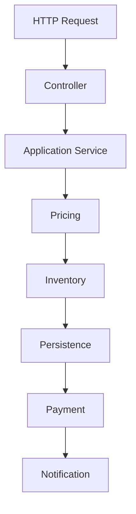
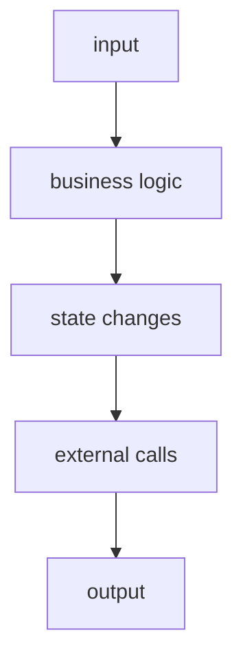
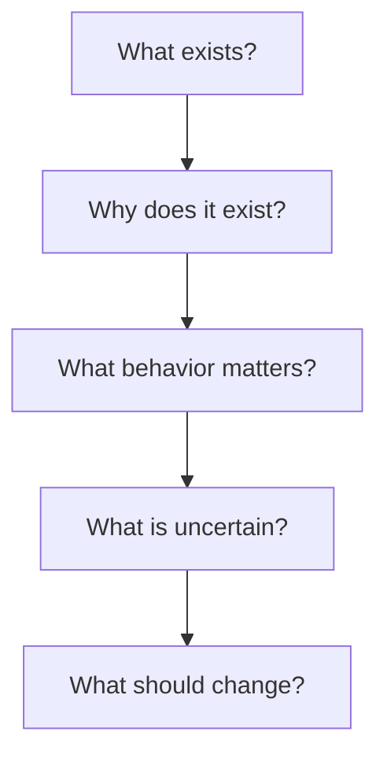

# {{ $frontmatter.title }} 관련

```component VPCard
{
  "title": "TypeScript > Article(s)",
  "desc": "Article(s)",
  "link": "/programming/ts/articles/README.md",
  "logo": "/images/ico-wind.svg",
  "background": "rgba(10,10,10,0.2)"
}
```

```component VPCard
{
  "title": "LLM > Article(s)",
  "desc": "Article(s)",
  "link": "/ai/llm/articles/README.md",
  "logo": "/images/ico-wind.svg",
  "background": "rgba(10,10,10,0.2)"
}
```

[[toc]]

---

<SiteInfo
  name="How to Understand a Legacy Codebase Using AI Before Changing it"
  desc="The first thing many engineers want to do when they inherit a legacy codebase is change it. And I understand the impulse. You open a class that's 1,500 lines long. There are database calls mixed with "
  url="https://freecodecamp.org/news/understand-a-legacy-codebase-with-ai"
  logo="https://cdn.freecodecamp.org/universal/favicons/favicon.ico"
  preview="https://cdn.hashnode.com/uploads/covers/5e1e335a7a1d3fcc59028c64/7d94c780-37eb-4bd6-a1e2-da6e25bdfdcb.png"/>

The first thing many engineers want to do when they inherit a legacy codebase is change it. And I understand the impulse.

You open a class that's 1,500 lines long. There are database calls mixed with business rules, configuration values scattered across the repository, methods nobody wants to touch, and comments that refer to systems that disappeared years ago.

Then an AI coding assistant offers to explain the whole thing.

So you ask:

> Refactor this class.

But that's usually too early.

One of the lessons I've learned from working with legacy systems is that code can be ugly and still contain important knowledge.

A strange condition may encode a business exception. A duplicated calculation may exist because two processes that look identical aren't actually identical. A database column with a terrible name may still be part of an external contract.

And a method nobody understands may be the only thing preventing a production incident that happened eight years ago from happening again.

AI makes it much easier to read unfamiliar software, and that's valuable. But it also makes it much easier to change software before you understand it.

In this tutorial, I'll show you how to use AI for something I believe should happen before refactoring or migration: **codebase archaeology.**

You'll learn how to use AI to help you:

- map a repository,
- identify entry points,
- trace dependencies,
- separate business rules from infrastructure,
- find hidden side effects,
- inspect data flow,
- discover implicit contracts,
- detect duplicated behavior,
- build a dependency map,
- identify areas of uncertainty,
- and turn those findings into a modernization plan.

The examples use TypeScript, but the process works with most languages and stacks.

The goal isn't to ask AI what the code means and trust the answer. The goal is to use AI to reduce the amount of time you spend looking for the right questions.

---

## Prerequisites

You should be comfortable with:

- reading an existing codebase
- TypeScript or a similar object-oriented language
- basic software architecture
- dependency injection
- unit and integration testing
- using an AI coding assistant that can inspect repository files

You don't need a specific AI provider, as the workflow matters more than the model.

---

## Why Understanding Has to Come Before Refactoring

Legacy code often creates a false sense of urgency.

You see something obviously coupled or duplicated and immediately want to clean it up.

Consider this function:

```ts
async function approveOrder(order: Order) {
  if (order.total > 10000 && !order.customer.verified) {
    throw new Error("Manual verification required");
  }

  if (
    order.customer.country === "AR" &&
    order.paymentMethod === "TRANSFER"
  ) {
    order.status = "PENDING";
  } else {
    order.status = "APPROVED";
  }

  await orders.save(order);

  if (order.status === "APPROVED") {
    await billing.createInvoice(order);
  }

  await audit.log({
    action: "ORDER_APPROVAL",
    orderId: order.id,
    status: order.status,
  });

  return order;
}
```

At first glance, there are several clear refactoring opportunities:

- You could extract validation.
- You could isolate status calculation.
- You could move billing behind an interface.
- You could create an approval policy.

All of those ideas may be reasonable, but there are questions you should answer first:

- Why is `10000` important?
- Why does an Argentine bank transfer remain pending?
- Does invoice creation have to happen after persistence?
- Is `ORDER_APPROVAL` consumed by another system?
- Can orders transition from `PENDING` to `APPROVED` somewhere else?
- Does anything depend on the exact exception message?

You can't answer those questions from syntax alone.

That's where understanding begins.

Instead of asking your AI tool:

```plaintext
Refactor this function using clean architecture.
```

start with:

```plaintext
Analyze this function without changing it.

Identify:

1. explicit business rules,
2. likely business rules that need confirmation,
3. side effects,
4. external dependencies,
5. state transitions,
6. magic values,
7. assumptions that cannot be proven from this file alone.

Do not propose a refactor yet.
```

That last line is important: **Do not propose a refactor yet.**

You want the model in investigation mode, not solution mode.

---

## How to Start with the Repository, Not the Classes

When I approach an unfamiliar legacy system, I don't start by reading every file. I start by trying to understand the shape of the application.

A repository already contains architectural clues.

Look for directories such as:

```plaintext
src/
controllers/
services/
repositories/
models/
jobs/
workers/
scripts/
migrations/
config/
integrations/
tests/
```

But don't assume the directory names describe the real architecture.

A directory called <VPIcon icon="fas fa-folder-open"/>`services` can contain business logic, infrastructure, orchestration, and random utility functions.

A directory called <VPIcon icon="fas fa-folder-open"/>`models` might contain database entities rather than domain models.

A folder called <VPIcon icon="fas fa-folder-open"/>`utils` can hide half the application's business logic.

Use the structure as evidence, not truth.

A useful first AI request is:

```md title="prompt"
Inspect the repository structure.

Do not analyze individual implementation details yet.

Identify:

- application entry points,
- major modules,
- database technologies,
- external integrations,
- background processing,
- scheduled tasks,
- authentication mechanisms,
- configuration sources,
- tests,
- likely architectural boundaries.

For each conclusion, reference the files or directories
that support it.

Mark anything uncertain explicitly.
```

The requirement to reference files matters. Without it, AI can give you a perfectly reasonable architecture that doesn't actually exist.

You want something closer to:

```md title="prompt"
HTTP API
Evidence:
- src/server.ts
- src/routes/orders.ts
- src/routes/customers.ts

Background processing
Evidence:
- src/workers/paymentWorker.ts
- src/queues/index.ts

Scheduled jobs
Evidence:
- src/jobs/reconcileInvoices.ts
- src/cron.ts
```

Now you have a map you can verify.

---

## How to Find the Real Entry Points

Web applications often have an obvious HTTP entry point. But legacy systems frequently have several more.

A business operation may begin from:

- an API request,
- a scheduled job,
- a queue consumer,
- a database trigger,
- a CLI script,
- a file import,
- an email handler,
- a webhook,
- or another application calling the database directly.

If you only analyze controllers, you may miss half the system.

Suppose you search for order creation and find:

```plaintext
POST /orders
```

It would be easy to assume that all orders enter through that endpoint.

Then you discover:

```plaintext
jobs/importMarketplaceOrders.ts
workers/retryFailedOrders.ts
scripts/migratePendingOrders.ts
integrations/shopify/webhook.ts
```

Now the same business object has four additional entry paths.

This changes how you think about refactoring.

Ask AI:

```plaintext
Find every location that can create, modify,
approve, cancel, or persist an Order.

Include:

- HTTP endpoints,
- background workers,
- scheduled jobs,
- scripts,
- imports,
- webhooks,
- direct repository calls.

Group the results by operation.

For every result, include the file path and
the relevant function or class.
```

Then verify those results with repository search.

For example:

```sh
rg "orders.save|orders.insert|createOrder|approveOrder" src
```

AI should accelerate search, not replace it.

---

## How to Trace a Business Capability Through the Codebase

Understanding individual files isn't enough.

What usually matters is understanding a **business capability**.

For example:

> Create an order.

That capability may travel through several layers:



The code may not be organized that cleanly, and that's precisely why tracing the capability is useful.

Choose one real workflow and ask:

```md title="prompt"
Trace the "Create Order" capability from its entry point
until all observable side effects are complete.

For each step, show:

- file,
- function or class,
- input,
- output,
- state change,
- external call,
- error behavior.

Do not summarize multiple steps into one.
```

You want a sequence that you can inspect.

For example:

```plaintext
1. POST /orders
   src/routes/orders.ts

2. OrdersController.create()
   src/controllers/OrdersController.ts

3. OrderService.create()
   src/services/OrderService.ts

4. calculatePrice()
   src/services/pricing.ts

5. inventory.reserve()
   src/integrations/inventory.ts

6. ordersRepository.save()
   src/repositories/orders.ts

7. paymentQueue.publish()
   src/queues/payment.ts
```

This becomes far more useful than a generic explanation of the architecture.

Now you can ask questions such as:

- Where does the transaction actually begin?
- What happens if payment publishing fails?
- Is inventory reservation reversible?
- Can the order be saved twice?
- Which steps are synchronous?
- Which failures are retried?

Those are modernization questions.

---

## How to Separate Business Rules from Infrastructure

One of the most useful things you can do during codebase archaeology is identify where business behavior lives.

Legacy applications frequently mix it with infrastructure.

Consider:

```ts
async function saveCustomer(customer: Customer) {
  if (
    customer.type === "ENTERPRISE" &&
    customer.creditLimit < 50000
  ) {
    throw new Error("Invalid enterprise credit limit");
  }

  const connection = await mysql.getConnection();

  await connection.query(
    "INSERT INTO customers (...) VALUES (...)",
    [...]
  );

  await redis.del(`customer:${customer.id}`);

  await eventBus.publish(
    "customer.updated",
    customer
  );
}
```

There's at least one business rule:

```md title="prompt"
Enterprise customers must have a credit limit >= 50000.
```

And several infrastructure concerns:

```plaintext
MySQL
Redis
Event bus
```

Ask AI to classify the code:

```md title="prompt"
Classify each responsibility in this function as one of:

- business rule,
- application orchestration,
- persistence,
- caching,
- messaging,
- logging,
- validation,
- unknown.

Explain why.

Do not move or rewrite any code.
```

The `unknown` category is useful. You don't want the model to force every line into a clean architectural theory.

Some code really is ambiguous until you inspect more context.

---

## How to Find Hidden Side Effects

Side effects are one of the biggest sources of migration risk.

A function called:

```ts
updateCustomer()
```

may do much more than update a customer.

It may:

- write to the database
- invalidate cache
- emit an event
- send an email
- update analytics
- write an audit record
- schedule another job

If you refactor the function and preserve only its return value, you can break production behavior without any compiler error.

A useful investigation prompt is:

```md title="prompt"
List every observable side effect produced directly
or indirectly by this function.

For each one, identify:

- the side effect,
- where it happens,
- whether it is synchronous or asynchronous,
- whether failure propagates,
- whether it appears retryable,
- whether it is idempotent,
- whether it can be safely repeated.

Mark uncertain answers as unknown.
```

That last property, idempotency, matters a lot.

Suppose a worker does this:

```ts
await chargeCard(order);
await markOrderAsPaid(order);
```

If the worker crashes between those two lines and retries, what happens? You may charge the customer twice. And that's not visible from the function name.

Understanding retry semantics is part of understanding the codebase.

---

## How to Discover Implicit Contracts

Not every contract is declared with an interface. Legacy applications contain many implicit contracts.

For example:

```ts
return {
  status: "ok",
  value: customer.balance.toFixed(2),
};
```

Some external consumer may depend on:

```json
{
  "status": "ok",
  "value": "100.00"
}
```

Changing `value` from a string to a number can look like an improvement:

```json
{
  "status": "ok",
  "value": 100
}
```

It can also break a client.

Look for contracts in:

- API responses,
- events,
- database structures,
- CSV exports,
- filenames,
- environment variables,
- error messages,
- queue payloads,
- and webhook bodies.

Ask:

```md title="prompt"
Identify outputs from this module that could be consumed
outside the module.

Include:

- HTTP responses,
- emitted events,
- queue messages,
- files,
- database records,
- exceptions,
- logs used for automated processing.

For each output, explain what evidence suggests that it
may be an external or implicit contract.
```

The wording matters:

> what evidence suggests

not:

> tell me which contracts exist

because you may not be able to prove the consumer from the current repository.

---

## How to Use AI to Find Duplicated Business Rules

Duplicated code is easy to detect. Duplicated **business meaning** is harder.

You may find:

```ts
if (customer.type === "PREMIUM") {
  discount = total * 0.1;
}
```

in one module.

And elsewhere:

```ts
if (account.plan === "GOLD") {
  price = price * 0.9;
}
```

Those might represent the same business rule, or they might not.

AI is useful for identifying candidates.

Ask:

```md title="prompt"
Search the repository for business rules related to
customer discounts.

Group implementations that appear semantically related,
even if variable names differ.

For each group:

- list file locations,
- describe the apparent rule,
- highlight differences,
- do not assume the rules should be unified.
```

That final instruction is important.

Duplication is sometimes accidental.

Sometimes it represents two domains that evolved independently.

Don't let an AI assistant turn:

```plaintext
similar
```

into:

```plaintext
must be merged
```

without evidence.

---

## How to Build a Lightweight Dependency Map

At some point, you need to understand which parts of the system depend on which others.

You don't need a perfect enterprise architecture diagram. A lightweight dependency map is enough to start.

For example:

```plaintext
Orders
 ├── Customers
 ├── Inventory
 ├── Payments
 ├── Notifications
 └── Database

Payments
 ├── Payment Provider
 ├── Audit
 └── Database
```

Ask AI to extract module-level dependencies:

```md title="prompt"
Build a module dependency map from the repository.

Only include dependencies supported by imports,
constructor dependencies, explicit calls, or configuration.

Output:

Module A -> Module B

For each dependency, provide at least one source file
that demonstrates it.

Do not infer dependencies from names alone.
```

You can then compare the result with automated tools.

For JavaScript or TypeScript projects, dependency analysis tools can help you find:

- circular dependencies
- cross-module imports
- high fan-in
- high fan-out

AI is useful for explaining why those dependencies may matter. Static analysis is better at proving that they exist.

Use both.

---

## How to Mark What You Still Do Not Understand

This is one of the most important parts of the process.

A useful system map doesn't only contain answers. It also contains uncertainty.

I like keeping an explicit list such as:

```md
---

## Open Questions

- Why is the enterprise credit threshold 50,000?
- Is `ORDER_APPROVAL` consumed outside this repository?
- Can marketplace orders bypass inventory validation?
- Is `customer.balance` allowed to be negative?
- What process transitions PENDING orders to APPROVED?
- Is `legacy_customer_id` still used by another system?
```

You can ask AI to generate this list:

```md title="prompt"
Based on everything analyzed so far, list the questions
that can't be answered safely from the repository.

Focus on questions that would matter during:

- refactoring,
- migration,
- schema changes,
- interface changes,
- removal of code.

Do not answer the questions.
```

I like this prompt because it does the opposite of what we normally ask AI to do. It asks the model to identify where it should **not** pretend to know.

A modernization plan should include those unknowns.

---

## How to Validate AI Findings Against the System

AI-generated explanations can sound convincing even when they're incomplete. So every important finding should have another source of evidence.

I use a simple hierarchy.

### Repository Search

If AI says a function is called only once, search for it.

```sh
rg "approveOrder" .
```

### Tests

Tests often reveal assumptions that implementation code doesn't explain.

Look for:

```plaintext
expected errors
special values
boundary cases
fixture data
historical behavior
```

### Database Schema

The schema may reveal key things like:

- nullable fields
- foreign keys
- defaults
- legacy columns
- constraints
- status values

### Logs and Observability

Production telemetry can tell you whether a supposedly unused path is still active.

### Version History

Git history can sometimes answer questions that source code can't.

For example:

```sh
git log -S "Manual verification required" --all
```

or:

```sh
git blame src/orders/approveOrder.ts
```

The commit that introduced a strange condition may contain the explanation.

This is an area where AI can help summarize history:

```md title="prompt"
Review the commits that changed this function.

Build a timeline of behavior changes.

For each change, include:

- commit,
- date,
- behavior changed,
- stated reason if available.

Do not infer a reason if the commit history does not provide one.
```

That can save a surprising amount of time.

---

## How to Turn Codebase Understanding into a Migration Plan

Once you understand one capability, you can begin making decisions. But not before.

Suppose your investigation produces this:

```md title="prompt"
Create Order

Business rules:
- active customer required
- premium customers receive 10% discount
- inventory must be available

Side effects:
- order persisted
- inventory reserved
- payment queued
- confirmation email sent

External contracts:
- POST /orders response
- payment queue payload
- order.created event

Unknowns:
- retry semantics for inventory reservation
- whether event consumers require exact field names
```

Now you can decide what to protect.

For example:

```md title="prompt"
Protect first:
- pricing behavior
- API response
- payment payload
- event schema
```

Then decide what can be refactored.

```md title="prompt"
Candidate boundaries:
- pricing policy
- inventory gateway
- payment publisher
- notification service
```

Then decide what needs investigation.

```md title="prompt"
Block migration until understood:
- inventory retry behavior
- event consumers
```

That's already a migration plan.

Notice what AI did not do: it didn't decide the target architecture.

It helped make the current architecture observable enough for you to make that decision.

---

## A Practical Codebase Archaeology Workflow

If I had to reduce this process to something repeatable, I would use these steps.

### 1. Map the Repository

Identify:

- entry points
- modules
- persistence
- integrations
- workers
- jobs
- tests
- configuration

Don't refactor anything.

### 2. Choose One Capability

Pick something concrete:

```md title="prompt"
Create Order
Approve Loan
Generate Invoice
Register Customer
Cancel Subscription
```

Avoid trying to understand the whole product at once.

### 3. Trace It End to End

Follow:



Record every file involved.

### 4. Extract Business Rules

Separate:

- explicit rules
- likely rules
- infrastructure behavior
- unknowns

### 5. Identify Side Effects

Find:

- writes
- messages
- emails
- jobs
- cache changes
- external calls

### 6. Discover Contracts

Look for:

- APIs
- event schemas
- database assumptions
- exported files
- error behavior

### 7. Map Dependencies

Document:

```plaintext
module -> module
```

and identify coupling.

### 8. Record Unknowns

Don't hide uncertainty. Create an explicit list.

### 9. Verify

Use:

- repository search
- tests
- schema
- logs
- Git history
- production telemetry

### 10. Only Then Plan the Change

Decide:

- what behavior must survive,
- what code can disappear,
- what boundaries should be introduced,
- what needs tests,
- and what can migrate first.

---

## What I Would Not Ask AI to Do First

There are several prompts I avoid at the beginning of a legacy modernization project.

For example:

```md title="prompt"
Rewrite this application using Clean Architecture.
```

or:

```md title="prompt"
Convert this monolith into microservices.
```

or:

```md title="prompt"
Modernize this entire repository.
```

or even:

```md title="prompt"
Find all the bad code.
```

The problem isn't that AI can't produce useful output from those prompts. It can.

The problem is that those questions already contain a solution.

You're asking for:

```plaintext
Clean Architecture
Microservices
Rewrite
Bad code
```

before you've established what the system actually needs.

A better sequence is:



That sequence is slower for the first hour, but it's usually much faster for the rest of the project.

---

## The Most Useful AI Output Is Sometimes a Question

There's a tendency to evaluate AI coding tools by how much code they generate.

For legacy systems, I think that misses part of their value.

One of the most useful outputs can be:

> I cannot determine why this condition exists from the available code.

Or:

> This event appears to have no consumer in the current repository, but external consumers cannot be ruled out.

Or:

> These two discount calculations look similar, but their behavior differs for zero-value orders.

Those are useful findings that tell an engineer where to investigate.

A confident but incorrect answer is much more dangerous.

When working with legacy systems, uncertainty is information. Treat it that way.

---

## Conclusion

AI makes unfamiliar codebases much easier to explore.

You can use it to summarize modules, trace execution paths, extract candidate business rules, find side effects, compare implementations, analyze Git history, and build dependency maps.

That can remove a large amount of mechanical investigation work.

But understanding a system isn't the same as generating an explanation of it. Legacy applications contain context that may exist outside the source code:

- production behavior,
- old incidents,
- external consumers,
- business exceptions,
- undocumented integrations,
- and organizational history.

AI can help you find evidence. It can't manufacture missing history.

That's why I prefer to use it as an investigator before I use it as a transformer.

Start with:

```md title="prompt"
What does this system actually do?
```

Then ask:

```md title="prompt"
What do I still not understand?
```

Only after that should you ask:

```md title="prompt"
What should I change?
```

The faster AI lets you modify software, the more important that sequence becomes.

Because changing code you understand is engineering. But changing code you don't understand is experimentation.

And production is usually the most expensive place to run that experiment.

<!-- TODO: add ARTICLE CARD -->
```component VPCard
{
  "title": "How to Understand a Legacy Codebase Using AI Before Changing it",
  "desc": "The first thing many engineers want to do when they inherit a legacy codebase is change it. And I understand the impulse. You open a class that's 1,500 lines long. There are database calls mixed with ",
  "link": "https://chanhi2000.github.io/bookshelf/freecodecamp.org/understand-a-legacy-codebase-with-ai.html",
  "logo": "https://cdn.freecodecamp.org/universal/favicons/favicon.ico",
  "background": "rgba(10,10,35,0.2)"
}
```
