# {{ $frontmatter.title }} 관련

```component VPCard
{
  "title": "Mermaid.js > Article(s)",
  "desc": "Article(s)",
  "link": "/programmnig/js-mermaid/articles/README.md",
  "logo": "/images/ico-wind.svg",
  "background": "rgba(10,10,10,0.2)"
}
```

[[toc]]

---

<SiteInfo
  name="How to Use the Mermaid JavaScript Library to Create Flowcharts"
  desc="If you’ve recently searched for an online diagramming tool, you might have noticed that most of them rely on drag-and-drop functionality. While this is helpful for people who can’t code, it can be hard to maintain. It can also be a bit difficult to m..."
  url="https://freecodecamp.org/news/use-mermaid-javascript-library-to-create-flowcharts"
  logo="https://cdn.freecodecamp.org/universal/favicons/favicon.ico"
  preview="https://cdn.hashnode.com/res/hashnode/image/upload/v1736777930250/cbc8af84-7109-45c9-9ee1-3d10c6b1b475.png"/>

If you’ve recently searched for an online diagramming tool, you might have noticed that most of them rely on drag-and-drop functionality. While this is helpful for people who can’t code, it can be hard to maintain. It can also be a bit difficult to manipulate, having to move all those shapes into an editor, and it’s not as intuitive when trying to arrange lines and boxes so they don’t overlap.

Luckily, there are solutions that have taken a different path. They are based on libraries that can organize the shapes and lines for you. What you have to do instead is provide a script designed specifically for that tool outlining what kind of shapes you want to see and their relationships.

In this article, we’ll talk about a popular script-based diagramming tool called Mermaid. You’ll learn how Mermaid works and how you can use it to create flowcharts. We’ll also cover how to style your flowcharts in Mermaid. By the end, you should be able to use this helpful tool to create your own flowcharts.

---

## What is Mermaid?

[**<VPIcon icon="iconfont icon-mermaid"/>Mermaid**](https://mermaid.js.org/) is a JavaScript library that *translates written declarations of entities and relationships into diagrams*. It’s like coding a diagram. The instructions are also Markdown-compliant.

Mermaid is not the only tool of this kind. There are other ones, like [<VPIcon icon="fas fa-globe"/>PlantUML](https://plantuml.com/), that have been around longer. But scripting with Mermaid has a very gentle learning curve, and it distinguishes itself from similar tools in many ways:

- As opposed to other tools like PlantUML, Mermaid is *made for the web*. It is Node-compatible, and the diagrams show as modified SVGs with inserted "[<VPIcon icon="fa-brands fa-firefox"/>foreign objects](https://developer.mozilla.org/en-US/docs/Web/SVG/Element/foreignObject)”. These are more compliant with HTML and CSS frameworks.
- Also compared to other scripting libraries, the resulting charts are more visually appealing, as they use advanced algorithms to place the shapes and arrows.
- Mermaid also makes strong use of Markdown for labelling, and has more recently started using JavaScript object-like formatting for shape declaration.
- It also has a strong support, is actively maintained, and makes use of well-known, robust JS graphics libraries like [<VPIcon icon="fas fa-globe"/>d3.js](https://d3js.org/), [<VPIcon icon="fas fa-globe"/>cytospace.js](https://cytoscape.org/what_is_cytoscape.html), and [<VPIcon icon="iconfont icon-github"/>`dagrejs/dagre-d3`](https://github.com/dagrejs/dagre-d3).

When compared to the most common drag-and-drop types of diagramming tools, Mermaid has the same advantages as other script-based diagramming tools. With a script, we can talk about **version control, reusability, and many other terms** associated with programming and automation that might not be possible with drag-and-drop tools.

### Challenges with Mermaid

Of course, it is not a perfect tool. One of the main challenges with Mermaid - and with many script-based diagramming tools - is that it’s a WYSIWYG tool: Mermaid’s results are almost impossible to predict, and after that they are hard to customize.

Also, for each diagram you can make with Mermaid, there are prescribed shapes and arrows - the introduction of new shapes or relationships are limited.

Some other limitations are:

- As with other script-based tools, the script is not easy to debug, and for large diagrams the script can get very messy.
- Even if the syntax is usually very intuitive, you have to learn a different syntax for each type of diagram.
- Specifically for Mermaid, if you want to post-process the resulting diagram, you must find appropriate tools that can read the modified Mermaid SVGs.

But if you use Mermaid for the cases where it performs well, you will have an excellent tool at your service.

Mermaid allows you to create about 21 types of diagrams, each with its own syntactic rules. In this tutorial, we’ll take a closer look at the flowchart syntax, which I’ve been working with recently. This guide is for those comfortable with scripting, looking to build flowcharts, and seeking a quick reference to Mermaid syntax before diving deeper into the full documentation.

To keep this content focused on Mermaid syntax, I will avoid going into details about using JavaScript in combination with Mermaid and will instead refer to the relevant Mermaid documentation where applicable.

I’ll also highlight a few minor issues I’ve noticed while using the latest version of the tool (version 11) to help you avoid potential pitfalls.

Finally, if you need more guidance on creating flowcharts in general, [**I’ve created a separate post**](/freecodecamp.org/how-to-make-flowcharts-with-mermaid.md) that walks you through the process step-by-step. While the examples in that post use Mermaid, its use is entirely optional.

---

## Getting Started with Mermaid

You can use Mermaid in several different ways.

**For those comfortable with web technologies**, you can install Mermaid as a package or plugin and integrate it into applications using the Mermaid API, CLI, or plugins.

Once installed, you can render Mermaid diagrams wherever Mermaid syntax is included in your HTML or markdown files. The official documentation provides an example of rendering diagrams using a CDN (ESM style):

```html :collapsed-lines
<html>
  <body>
    Here is one mermaid diagram:
    <pre class="mermaid">
            graph TD
            A[Client] --> B[Load Balancer]
            B --> C[Server1]
            B --> D[Server2]
    </pre>

    And here is another:
    <pre class="mermaid">
            graph TD
            A[Client] -->|tcp_123| B
            B(Load Balancer)
            B -->|tcp_456| C[Server1]
            B -->|tcp_456| D[Server2]
    </pre>

    <script type="module">
      import mermaid from 'https://cdn.jsdelivr.net/npm/mermaid@11/dist/mermaid.esm.min.mjs';
      mermaid.initialize({ startOnLoad: true });
    </script>
  </body>
</html>
```

If you're using GitHub, Mermaid is supported in GitHub markdown. Additionally, [**Zaira Hira has written a helpful guide**](/freecodecamp.org/diagrams-as-code-with-mermaid-github-and-vs-code.md) for Visual Studio Code users. Check your IDE for available plugins and extensions.

::: note Important Note on CSS Collisions

When installing Mermaid in your project, watch for CSS naming conflicts. Mermaid (version 11) uses fixed classes and IDs to render SVGs, which may overlap with your project’s styles, causing hard-to-detect errors.

:::

If you’re not interested in integrating Mermaid directly into your coding, online editors and cloud tools are a great option. Mermaid provides two key tools: **Mermaid Chart** and **Mermaid Live**.

- [<VPIcon icon="fas fa-globe"/>Mermaid Chart](https://mermaidchart.com/) is a cloud-based project manager designed for collaboration and sharing. It offers features like templates, version history, and presentation capabilities, making it ideal for project management.
- [<VPIcon icon="fas fa-globe"/>Mermaid Live](https://mermaid.live/) is best for quick, one-off diagrams. You can see a view of Mermaid Live on my computer in the image below. You can select a diagram from sample options, modify its code in the editor under the **"</> Code”** tab, or paste your own script. Changes instantly appear in the Diagram window, and diagrams can be exported as PNG or SVG from the **Actions** menu.


While Live is convenient, it’s not a reliable way to track your scripts, so save your work externally. There are other online editors similar to Mermaid Live, and [**Zaira Hira’s article**](/freecodecamp.org/diagrams-as-code-with-mermaid-github-and-vs-code.md) provides insights into one of them.

For the following explanations, any installation you choose will work just the same, as we are going to put emphasis on the code. So choose your tools and let’s check out some Mermaid flowchart syntax.

---

## How to Start Your Flowchart in Mermaid

In order to create your first Mermaid diagram, you have to tell Mermaid what type of diagram you want to make. We are making a flowchart, so to start one you can just write this:

```mermaid :collapsed-lines
flowchart
```

Mermaid can distribute the shapes in two directions: top-down (default) or left-right. If you want to be specific about the layout direction, you have to write TD for top-down:

```mermaid :collapsed-lines
flowchart TD
```

and LR for left-right:

```mermaid :collapsed-lines
flowchart LR
```

Just keep in mind that you can select only one direction for your flowchart (either TD or LR).

### How to Write a Comment

Now, before we start using shapes, let’s see how to write a comment in a Mermaid flowchart. A comment will not render on the chart - they’re just there to help you out. You likely know how useful they are as a developer.

To write a comment, just precede the text of the comment with "`%%`” :

```mermaid :collapsed-lines
flowchart
  %% This is a comment!!!
```

### How to Configure your Flowchart

There are (or were) at least three ways to configure your flowcharts in Mermaid. The first one, using directives, is deprecated but still works for some cases. The second one is a frontmatter config. The other one is through a configuration file.

If you were using old versions of Mermaid (<10.5.0) you could’ve configured your chart using [<VPIcon icon="iconfont icon-mermaid"/>directives](https://mermaid.js.org/config/directives.html). You do that by declaring a JavaScript-object-like statement enclosed between percentages ("`%%…%%`”) symbols, usually after declaring the diagram type, like so:

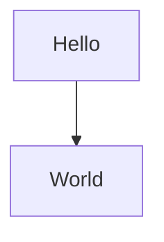

::: note

By the time of this writing, the Mermaid documentation sometimes still refers to directives as a way to configure your diagram. But keep in mind that the use of directives doesn’t work correctly in some renderers.

:::

The frontmatter configuration method has replaced the directive method since version 10.5.0. It’s based on the YAML format. In that case, you have to use a YAML block before initializing your flowchart:

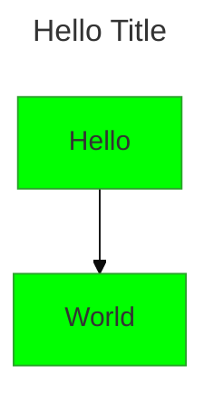

Directives and frontMatters are limited in scope compared to other configuration methods. They apply only to the graph below the configuration statement.

For developers who are installing the Mermaid package, the recommended method for configuration is using JavaScript. Mermaid is also configurable through a JSON configuration file that exists in the folder of the library. For more details about those methods, consult the [<VPIcon icon="iconfont icon-mermaid"/>documentation chapter about API usage](https://mermaid.js.org/config/usage.html#configuration).

You can find a list of the attributes and properties that you can affect when configuring your diagram on [<VPIcon icon="iconfont icon-mermaid"/>this page of the Mermaid documentation](https://mermaid.js.org/config/schema-docs/config.html).

I won’t go into much detail about configuration in this article, although I might refer to it a couple of times just to clarify a couple of things that can only be done by configuring the tool.

---

## Nodes and Shapes in Mermaid

Across the Mermaid documentation, **nodes** are used as a generic term to refer to any step that is added to the flowchart. Mermaid documentation then introduces the **shapes**, also called **node shapes**. They are the representations of what happens in that node.

### How to Create Your First Node (The Process Shape)

Adding a node to a flowchart with Mermaid is very easy. Just think of a unique name - or its **ID** according to the Mermaid documentation. For the sake of clarity, I’ll also refer to this ID as the **node ID**.

The node ID should be a single word with no space and preferably no other characters other than alphanumeric ones. The node ID will hold for the rest of the script and you will use it to recall that shape in other parts of the script.

Then adding the node consists in simply writing down the node ID under the diagram type declaration (here it’s `A`):

```mermaid :collapsed-lines title="What the shape will look like on your diagram - a square with an A in it."
flowchart
  A
```

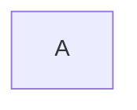

<!--  -->

Notice that so far we haven’t declared any shape for that node. When no shape is declared, the default shape is a rectangle, which is also the **Process** shape.

::: note

In Mermaid flowchart syntax, there is no way to declare a node without declaring at least one shape (the process shape)

:::

The text that appears inside the shape is its **label**. There are different ways to label your shape. If you don’t label the shape, the ID is used as the label.

You can be as descriptive as you want with your node ID. You can provide a more meaningful name that can also be read as a label:

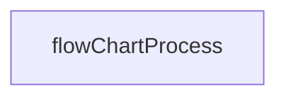


<!--  -->

::: note

The indentation is not required when scripting with Mermaid, but I am doing it in order to keep the script organized.

:::

As a rule, the name should be a single word, with some limitations when not using alphanumeric characters. For example, using some characters such as spaces is not allowed, like in this case: `flowChart Process` . Here the rendering would result in an error.

::: note

There are reserved words and characters, such as the word "end” or the parenthesis "(…)”, that can’t be used as an id as they have specific uses. But you can use any reserved word as labels when labels are specified, as long as the label is enclosed between quotes.

:::

### How to Declare Shapes and Shape Labels with Mermaid: Two Different Syntaxes

In Mermaid, you declare a node with an ID. Then you define a **shape for that node**.

You’ll need to be aware of the two different syntaxes available when declaring shapes with Mermaid. They are both live and can coexist in the same script as long as the interpreter is updated to the last version.

Let’s see the several ways of declaring those shapes. The following are two examples of the two available syntaxes. You can see how they’re used in the following example to render similar results:

```mermaid :collapsed-lines title="Ways to declare shapes and labels with different Mermaid versions"
flowchart LR
  flowChartProcess01[Process shape, version 10 syntax declaration, simplest labelling]
  flowChartProcess02["Process shape, version 10 syntax declaration, double-quoted labelling"]
  flowChartProcess03@{ shape: rect, label: "Process shape, version 11 syntax declaration, simplest labelling"}
```

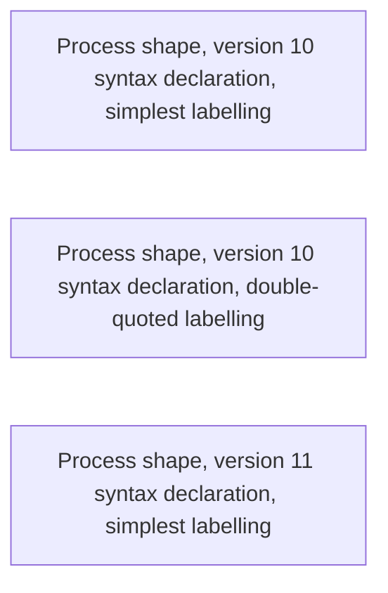

<!--  -->

Notice that in the example above, the first declared node didn’t require any quotes. That was because there were no special characters.

::: note

As soon as you need to include reserved characters or words in your label, you must use quotes.

:::

The first two declared nodes are examples of the original syntax. Even if not completely accurate, we will refer to that kind of syntax as the **version 10 syntax**.

As you can see from the script above, the version 10 declaration always contains:

1. the name id,
2. followed by a combination of characters that describe the shape and that act as shape’s **opening** and **closing** characters,
3. with a text labelling between the shape characters.

A shape’s opening and closing characters are mostly a combination of punctuation characters. Examples of special shape enclosing / opening characters are parenthesis, brackets, curly brackets, "less than", "greater than”, and slashes. How you combine the enclosing characters will determine the kind of shape you want. For example, in the previous case, the Process shape was declared as `ID[<LABEL>]`.

::: note

When declaring shapes with version 10 syntax, you always must provide a label. If you don’t do that, it will throw an error.

:::

Starting with version 11.3, Mermaid introduced syntax updates aimed at greater flexibility. The last example of our script above is written using that new syntax.

For the version 11 declaration, you would use JavaScript-object-like syntax in this way: `ID@{shape: shape-alias, label: ”This is a label”}`. We will refer to that kind of syntax as the **version 11 syntax**. With this version, both properties are optional. If no shape is provided, it will show a rectangle instead. If you don’t add a label, then the renderer will use the node ID as a label.

The documentation provides a list of the **proper names** for each shape. Furthermore, you can use several **aliases** instead of the proper name as shape value. In this project, for the sake of simplicity we will stick to a single option for the naming with no reference to whether it is a proper name or an alias. If you want to get the full list, just [<VPIcon icon="iconfont icon-mermaid"/>consult the documentation](https://mermaid.js.org/syntax/flowchart.html#expanded-node-shapes-in-mermaid-flowcharts-v11-3-0).

::: note

Either using version 10 or version 11, you have to define labels and shapes *only once* in your script.

:::

In other words, if you have a node that is used in more than one relationship in your script, you will be ok defining the shape just for one of those node ID calls, as in the following example:

```mermaid :collapsed-lines title="You need just one shape declaration per node"
flowchart
  A --> B
  A --> C
  D --> A[one time is enough]
  F --> D
  %%F --> A(uncommenting this will change the shape and the label too)
```

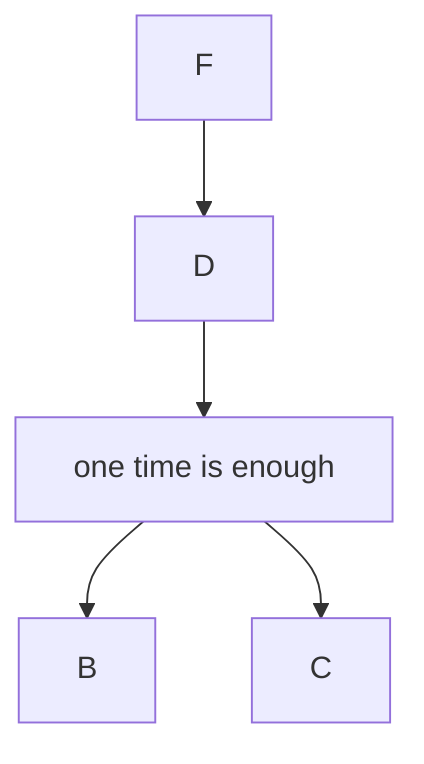

<!--  -->

But notice in that example that I’ve commented out one of the lines. If you uncomment that line, the label and shape will update to the new definitions for node **A**. In general, if you define different shapes or labels for the same node in different parts of the script, the last definition will take precedence.

I have found that, when using the modern declaration, you have to add a space after the colon (":”) before the text, otherwise the interpreter won’t find the text.

> This one I have found to be incorrect (no space between `shape` and `text`):
>
> `{shape:text, label:text}`
>
> And this one was correct (a space after `shape:`):
>
> `{shape: text, label: text}`

### Quick Look at the Most Typical Shapes

There are more than 40 shapes available for flowcharts, as reported by the [<VPIcon icon="iconfont icon-mermaid"/>Mermaid documentation about shapes](https://mermaid.js.org/syntax/flowchart.html#node-shapes). In the Mermaid documentation, shapes are named based on their geometry but also based on what they mean. Some of those shapes are named only based on their meanings, especially when there is not an easy word in geometry terminology that you can use to describe the shape.

::: note

In case you just want a list of essential shapes to start working on your flowchart but you don’t know which ones to pick, you can check out my article about flowcharts, where I give you some ideas.

:::

These are the most common shapes that you’ll typically use when building a flowchart:

](https://cdn.hashnode.com/res/hashnode/image/upload/v1733765176295/06d45bcd-38c1-4c88-854d-c91bdb7e0a7c.jpeg)

As you can see in the table above, we have the following shapes:

- A start or end point (some people represent those kind of points with ovals, but in the Mermaid documentation the start point is represented by a circle, while the end point is represented by two nested circles)
- Arrow (a connector that shows relationships between shapes)
- Parallelogram (an input or output)
- Rectangle (a process)
- Diamond (a decision)

Let’s go through each of these shapes now and see how to make them with Mermaid.

### The Terminator Shape

As mentioned above, Mermaid use circles as the representation of the start point and the end point instead of the oval. The start and end points mark the starting and ending points of the process/system.

If we stick to the Mermaid documentation, the way to make them in Mermaid using version 10 and version 11 is as follows:

```mermaid :collapsed-lines title="start and end points with different versions of Mermaid"
flowchart TD
  startv10((start v10))
  stopv10(((stop v10)))
  startv11A@{shape: circle, label: Start v11}
  startv11B@{shape: start, label: Start (small circle) v11}
  stopv11@{shape: dbl-circ, label: Stop v11}
  stopv11B@{ shape: framed-circle, label: Stop (small circle) v11 }
```

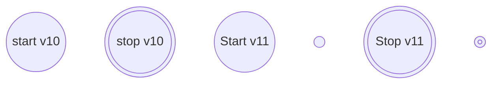

<!--  -->

In Mermaid v11, there are two types of circles you can use as a start and end points: a small shape and a regular shape. The small shapes don’t render the labelling.

If you decide to use the oval as the terminal (start/end points) shape, the simple circle might acquire other meanings. For example, it might become a **connector shape** (one that’s the exit point of a flowchart that continues in a separate flowchart or another point of the same flowchart). Or it might become another kind of connector that brings together several flowlines into a single flowline ( not as a multiprocess join, but just one that reduces the number of links when you’re looking for clarity).

If you prefer to use the oval (which in Mermaid is called the **terminal shape**), you can create it with the following code:

```mermaid :collapsed-lines title="terminal points with different versions of Mermaid"
flowchart TD
  terminalv10([Terminal point v10])
  terminalv11@{ shape: stadium, label: "Terminal point v11" }
```

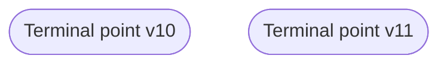

<!--  -->

### The Arrow (Rectangle) Shape

We’ll talk more about this one later on in this article.

### The Input/Output (Parallelogram) Shape

You can use the parallelogram shape as an abstraction for data that’s available for input or output or for resources used or generated. It indicates that some information is required at this point in the workflow.

You can make this shape with Mermaid using the existing versions as follows:

```mermaid :collapsed-lines title="inputoutput shape with different versions of Mermaid"
flowchart TD
  inputoutputv10[/Input / Output v10/]
  inputoutputv11@{ shape: in-out, label: "Input / Output v11"}
```

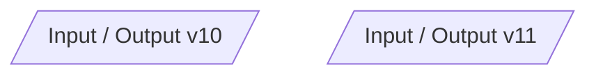

<!--  -->

### The Process (Rectangle) Shape

You can represent a process using a rectangle in a flowchart. It represent a **single step** in your workflow, like an expression (for example, $x=y\times{x}^{2}$), a **entire block statement**, like "`loop through array and update values by multiplying by 2`”, or an **entire sub-process**, like an existing function or even a module.

It’s also referred to as a box (using the two versions):

```mermaid :collapsed-lines title="process shape with different versions of Mermaid"
flowchart TD
  processv10[Process v10]
  processv11@{ shape: rect, label: Process v11 }
```

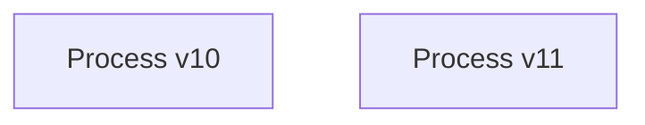

<!--  -->

### The Decision (Diamond) Shape

A decision is represented by a diamond. It’s an abstraction for a **condition’s test**, a YES/NO, or TRUE/FALSE question. It is the equivalent of an IF/ELSE statement in coding.

Using version 10 and version 11, you can make a diamond as follows:

```mermaid :collapsed-lines title="decision shape with different versions of Mermaid"
flowchart TD
  decisionv10{Decision v10}
  decisionv11@{ shape: diam, label: Decision v11 }
```

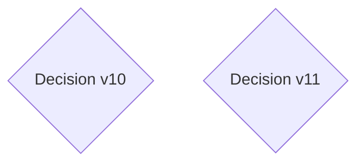

<!--  -->

### Markdown and HTML in Mermaid

One of the most helpful features of Mermaid is that it accepts Markdown syntax for its labelling, as well as HTML. I would advise that you use Markdown notation, as HTML notation can result in silent errors.

Using double quotes and Markdown allows you to use special characters in your labels. But with Markdown syntax, you can also access various Markdown functionalities.

To use Markdown, you have to enclose your text in double quotes (") followed by a backtick (\`), like so:

```mermaid :collapsed-lines title="Use of markdown for shape labelling in Mermaid flowchart"
flowchart TD
    flowChartProcess["`**flowChart Process**:
                        - typical shape declaration 
                        - *Markdown-style* labelling`"]
```

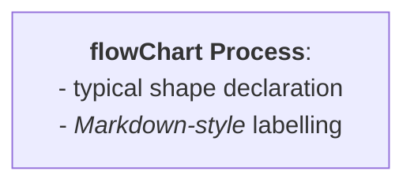

<!--  -->

::: note

Be aware that not all Markdown functionalities are recognized.

:::

Now that you know how to use some basic shapes as well as how to use Markdown in Mermaid, let’s go on to the next step: how to draw relationships between shapes.

### Edges (Relationships) and Edge Labels in Mermaid

**Edges**, also referred as **arrows** or **links** in Mermaid’s documentation, are the connections between nodes. They are officially called **flowline shape** by the ANSI standard. This is because a link might not be an arrow in some situations.

::: note

I will refer to them as edges or links here, not arrows.

:::

Drawing relationships between two nodes is as easy as adding nodes. To draw a simple arrow link between two shapes, you just have to do the following:

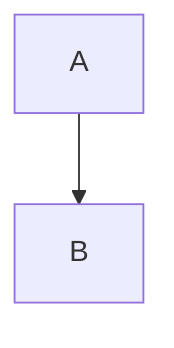


<!--  -->

Technically, a link in Mermaid is the combination of a **line** and a **marker**. The marker is the small icon added at the end of the line. There are several types of links/edges you can draw by combining the different kinds of lines and markers that Mermaid provides:

```mermaid :collapsed-lines title="Different types of edges that can be added to Mermaid flowcharts"
flowchart TD
  %% dotted line, triangle marker
  A -.-> B
  %% thick line, triangle marker
  C ==> D
  %% solid cross-edged (solid line, cross marker)
  E --x F
  %% solid circle-edged (solid line, circle marker)
  G --o H
  %% combining circle marker with dotted line
  I -.-o J
  %% hidden
  K ~~~ L
```

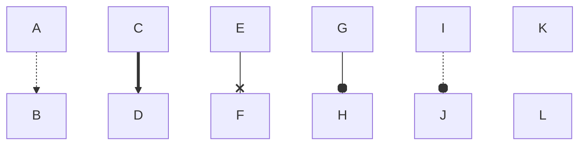

<!--  -->

::: note

Be aware that "o” and "x” become reserved characters when used as markers. If you need to use them as the first character of the node ID, either leave a space after the edge operator, or use capital letters.

:::

Edges can also be bidirectional, for example:

```mermaid :collapsed-lines title="Edges can also be bidirectional"
flowchart TD
  A <--> B
```

```mermaid
flowchart TD
  A <--> B
```

<!--  -->

When drawing edges, you can use "syntactic sugar” in your script to reduce redundancy when defining relationships between nodes. For instance, if you have a node **B** situated in the middle of a sequence, you can simplify your script by chaining relationships instead of repeatedly specifying connections between **B** and its preceding and succeeding nodes. Also, operators can indicate crossed relationships between the same nodes.

The following script illustrates the difference between a verbose syntax (shown as comments) and a simplified syntax using chaining and operators:

```mermaid :collapsed-lines title="Chaining and Operators in Mermaid flowchart syntax"
flowchart TD
  %% ommitting a shape in between (chaining). the same as:
  %% A --> B
  %% B --> C
  A --> B --> C

  %% use of special character. the same as:
  %% D --> F
  %% D --> J
  %% F --> K
  %% J --> K
  D --> F & J --> K
```

```mermaid
flowchart TD
  %% ommitting a shape in between (chaining). the same as:
  %% A --> B
  %% B --> C
  A --> B --> C

  %% use of special character. the same as:
  %% D --> F
  %% D --> J
  %% F --> K
  %% J --> K
  D --> F & J --> K
```

<!--  -->

Labelling links is also possible with Mermaid syntax, and it is very easy to do. There are different ways you can label a single arrow, as explained in the comments of the script: either inserting the label in between the line operator (`—`), or using **vertical bars** (`|...|`) placed after the marker (or when no marker, after the line operator) and before declaring the node:

```mermaid :collapsed-lines title="The two ways of adding labels to a links in Mermaid flowcharts"
flowchart TD
  %% inserting the label between the link operator
  A --"This is a label **between the link operator**"--> B

  %% adding a link label between vertical bars, |...|
  A --> |"This is a label **between special characters**"| B
```

```mermaid
flowchart TD
  %% inserting the label between the link operator
  A --"This is a label **between the link operator**"--> B

  %% adding a link label between vertical bars, |...|
  A --> |"This is a label **between special characters**"| B
```

<!--  -->

Both of those formats accept simple double-quoted or Markdown-style labelling. I have found myself more comfortable adding labels to links using the vertical bars.

::: note

Edge labelling is subject to the same restrictions as shape labelling when using reserved characters and words.

:::

Now, before going on to the next section, let’s look at a quick example using what we have learned so far! I will use the typical syntax format for the example. Here it is:

```mermaid :collapsed-lines title="Example of edge labelling"
flowchart TD
  A["Process A"] --> |"Process A is followed by Process B"|B["Process B"]
  C["Process C"] -.-> |"Process C relates to Process B"| B
  D["Process D"] --> |"Process D is followed by Process C"| C
```

```mermaid
flowchart TD
  A["Process A"] --> |"Process A is followed by Process B"|B["Process B"]
  C["Process C"] -.-> |"Process C relates to Process B"| B
  D["Process D"] --> |"Process D is followed by Process C"| C
```

<!--  -->

### Subgraphs

In Mermaid you can also group sections of nodes under subgraphs. Here is an example right from the Mermaid documentation on how to create the syntax for a subgraph:

```mermaid :collapsed-lines title="Example of edge labelling"
flowchart LR
  subgraph TOP
    direction TB
    subgraph B1
      direction RL
      i1 -->f1
    end
    subgraph B2
      direction BT
      i2 -->f2
    end
  end
  A --> TOP --> B
  B1 --> B2
```

```mermaid
flowchart LR
  subgraph TOP
    direction TB
    subgraph B1
      direction RL
      i1 -->f1
    end
    subgraph B2
      direction BT
      i2 -->f2
    end
  end
  A --> TOP --> B
  B1 --> B2
```

<!--  -->

Notice that in that example, we were also able to declare different flow directions for the different (sub) graphs.

But the Mermaid documentation also clarifies a caveat: if a node inside a subgraph is connected to another node outside that subgraph, any declaration of subgraph direction will be overridden by the one declared for the most external (parent) subgraph. Again, here’s an example right from the Mermaid documentation:

```mermaid :collapsed-lines title="Example of direction inheritance with subgraphs"
flowchart LR
  subgraph subgraph1
    direction TB
    top1[top] --> bottom1[bottom]
  end
  subgraph subgraph2
    direction TB
    top2[top] --> bottom2[bottom]
  end
  outside --> subgraph1
  outside ---> top2
```

```mermaid
flowchart LR
  subgraph subgraph1
    direction TB
    top1[top] --> bottom1[bottom]
  end
  subgraph subgraph2
    direction TB
    top2[top] --> bottom2[bottom]
  end
  outside --> subgraph1
  outside ---> top2
```

<!--  -->

In the case above, the `subgraph2` was declared to be a top-bottom subgraph, but inherited the direction of the external subgraph which was declared as a left-right one. That happened because of the connection between two nodes belonging to different subgraphs at different declaration layers (the `subgraph2` is inside the "global” subgraph). In this case, `subgraph2` is a child of the global subgraph, so it inherits is direction.

---

## How to Add Styling with Mermaid

Styling in Mermaid is very CSS-compliant.

Let’s start with styling shapes. One way of doing it is by using the `style` command. It works as follows:

1. Use the reserved word `style`,
2. followed by the name ID of the shape you want to style,
3. then indicate the properties you want to change and their new values.

We’ll implement that pattern in the following example. Let’s assume that I want to differentiate between using different colors, and change the color of the letters of the labels:

```mermaid :collapsed-lines title="Shape styling with Mermaid"
flowchart TD
  A([this should be black with white letters]) --> B([this should be grey with white letters])
  style A fill: black, color: white
  style B fill:grey, color:#fff
```

```mermaid
flowchart TD
  A([this should be black with white letters]) --> B([this should be grey with white letters])
  style A fill: black, color: white
  style B fill:grey, color:#fff
```

<!--  -->

It’s important to understand that in Mermaid, styling is read up to the node level, not the shape level. You can apply different styles for the same node, too. They are read sequentially in order of appearance, so for two competing styles, the last one will be the valid one.

You can place the `style` expression anywhere in your code, but I would recommend doing it at the end of the script so you can track all changes.

::: note

Keep in mind that if, when styling, you refer to a non-existing node ID, Mermaid will create a new node without warning you.

:::

Another useful way to add styling to your flowcharts, especially when you want to add the same styling to more than one node, is by *defining classes*. For that, you can use the special word `classDef` like so:

1. Write `classDef` on one line
2. followed by the name you have chosen for the class
3. followed by the styling attributes that you want to change and their new values.

To apply the class:

1. Find the nodes for which you want to implement the change
2. add three colons (`:::`) at the end of the node declaration, and if labeling, at the end of the labeling expression
3. add the name of the class.

The following is an example on how to add classes to shapes:

```mermaid :collapsed-lines title="Adding classes with Mermaid classDef"
flowchart TD
  A[label A, no class] --> B[label B, class bar]:::bar
  B --> C[label C, class foo]:::foo
  C --> D[label D, class bar]:::bar
  C --> E[label E, class foo]:::foo
  
  classDef foo fill:green, color:#fff
  classDef bar fill:orange, color:#666
```

```mermaid
flowchart TD
  A[label A, no class] --> B[label B, class bar]:::bar
  B --> C[label C, class foo]:::foo
  C --> D[label D, class bar]:::bar
  C --> E[label E, class foo]:::foo

  classDef foo fill:green, color:#fff
  classDef bar fill:orange, color:#666
```

<!--  -->

::: note

Same as shape declaration, classes can be assigned to a node just once, no matter where in the flowchart. But you can add only one class per node.

:::

Unfortunately, this kind of `classDef` is only applicable to **shapes** using **version 10 syntax**.

Something that the documentation doesn’t mention is that you can also style subgraphs. In fact, the name that you provide to a subgraph becomes its ID.

The styling formats applicable to shapes work almost the same for subgraphs. But the use of the `classDef` styling only works if the subgraph is also a node in the diagram.

The following example shows the application of the `style` command and the `classDef` command and how you can use them to add styling to subgraphs:

```mermaid :collapsed-lines title="Styling nodes and subgraphs"
flowchart LR
  %% applying a class as follow will give an error:
  %% "subgraph subgraph1:::asNode"
  subgraph subgraph1
    direction TB
    top1[top] --> bottom1[bottom]
  end
  subgraph subgraph2
    direction TB
    top2[top] --> bottom2[bottom]
  end
  outside:::asNode --> subgraph1:::asNode
  outside ---> top2

style subgraph2 fill:oranged
classDef asNode fill:grey, color:orange
```

```mermaid
flowchart LR
  %% applying a class as follow will give an error:
  %% "subgraph subgraph1:::asNode"
  subgraph subgraph1
    direction TB
    top1[top] --> bottom1[bottom]
  end
  subgraph subgraph2
    direction TB
    top2[top] --> bottom2[bottom]
  end
  outside:::asNode --> subgraph1:::asNode
  outside ---> top2

style subgraph2 fill:orange
classDef asNode fill:grey, color:orange
```

<!--  -->

If you want to style edges, then you have to proceed differently. What actually worked for me was the use of another reserved word, `linkStyle`, which styles the **line** of the edge.

The problem with edges is that they don’t have IDs: they are treated more like being part of an array, so they should be referred with an index - which won’t always correspond to the edge you want. Here is an example, based on [<VPIcon icon="iconfont icon-obsedian"/>this discussion](https://forum.obsidian.md/t/styling-links-in-mermaid/38789/2):

```mermaid :collapsed-lines title="Styling links"
flowchart TD
  A --> B
  B --> C
  B --> D
  D --> E
  D --> F
  
linkStyle default stroke:red
linkStyle 0 stroke-width:4px,stroke:green
linkStyle 3 stroke:blue
linkStyle 4 stroke:blue
```

```mermaid
flowchart TD
  A --> B
  B --> C
  B --> D
  D --> E
  D --> F
  
linkStyle default stroke:red
linkStyle 0 stroke-width:4px,stroke:green
linkStyle 3 stroke:blue
linkStyle 4 stroke:blue
```

<!--  -->

The other problem with styling edges is that markers are decoupled from lines. So this method won’t affect the marker.

In general, I have found that adopting a consistent styling for edges is not simple with Mermaid. But it might be that for most of your projects, styling edges isn’t necessary.

Apart from deciding the styling of the line, the documentation suggests that we can apply some styling to the curvature of the line configuring the diagram using directives:

```mermaidjs
%%{ init: { 'flowchart': { 'curve': 'stepBefore' } } }%%
graph LR
  A --> B
  B --> C
  B --> D
  D --> E
  D --> F
```

The change should apply to all the edges in the flowchart and it should be based on the [<VPIcon icon="fas fa-globe"/>d3-shape library](https://d3js.org/d3-shape/curve). But to date I haven’t been able to reliably configure curvature using either the directive method or the frontMatter method.

Keep in mind that the utilities to style edges with Mermaid might improve in the future. Meanwhile, I suggest asking dedicated communities about how to better style links with Mermaid if this is something you would like to implement for your diagrams. Share your findings with me to complement this article!

Finally, another way we can add more styling by affecting **themes, layouts, and looks**, which are set pre-set styling formats that you can modify. They will affect the styling of the whole diagram.

For example, out of the Mermaid documentation about the general syntax is [<VPIcon icon="iconfont icon-mermaid"/>this script using the frontMatter method](https://mermaid.js.org/intro/syntax-reference.html):

```mermaid :collapsed-lines title="Example of a theme in Mermaid"
---
config:
  layout: elk
  look: handDrawn
  theme: dark
---
flowchart TB
  A[Start] --> B{Decision}
  B -->|Yes| C[Continue]
  B -->|No| D[Stop]
```

```mermaid
---
config:
  layout: elk
  look: handDrawn
  theme: dark
---
flowchart TB
  A[Start] --> B{Decision}
  B -->|Yes| C[Continue]
  B -->|No| D[Stop]
```

<!--  -->

There are more ways to add styling, but they are more advanced. For the sake of simplicity, I will not discuss those more advanced solutions and will instead invite you to explore the Mermaid documentation.

### Directives or frontMatter?

As I explained previously in this article, you can configure some attributes of the flowchart with either directives or YAML frontMatter. The documentation suggests that directives are deprecated.

Those methods can be used to configure the look-in-field of the whole diagram and/or some properties of the flowchart.

But I have been able to modify some properties of the flowchart with frontMatter as well as directives. For example, have a look at the following two examples, where the `fill` attribute is set based on a template `theme`, and the `nodeSpacing` is also modified:

```mermaid :collapsed-lines title="Configuring using frontMatter"
---
title: Hello Chart
config:
    theme: base
    flowchart:
        nodeSpacing: 200
---
flowchart LR
  A --> B
  B --> C
  B --> D
  D --> E
  D --> F
```

```mermaid
---
title: Hello Chart
config:
    theme: base
    flowchart:
        nodeSpacing: 200
---
flowchart LR
  A --> B
  B --> C
  B --> D
  D --> E
  D --> F
```

<!--  -->

```mermaid :collapsed-lines title="Configuring using a directive"
%%{init:{'theme': 'base', 'flowchart':{'nodeSpacing': 200}}}%%
graph LR
  A --> B
  B --> C
  B --> D
  D --> E
  D --> F
```

```mermaid
%%{init:{'theme': 'base', 'flowchart':{'nodeSpacing': 200}}}%%
graph LR
  A --> B
  B --> C
  B --> D
  D --> E
  D --> F
```

<!--  -->

The results of both are almost the same, although on this occasion I couldn’t add a title to the one using a directive. There must be some advantages in preferring the YAML frontMatter approach, but be aware that you can still use both for some cases.

For details about the configurable flowchart properties using these and JavaScript methods, [<VPIcon icon="iconfont icon-mermaid"/>visit the Mermaid documentation](https://mermaid.js.org/config/schema-docs/config-defs-flowchart-diagram-config.html). If you want examples on how to configure themes, [<VPIcon icon="iconfont icon-mermaid"/>follow this resource](https://mermaid.js.org/config/theming.html). At the time of this writing, configuring through directives or frontMatter is something that I haven’t explored in depth. I invite you to give it a try and let me know what you discover.

### Interactivity

Another thing that you can do with Mermaid is [<VPIcon icon="iconfont icon-mermaid"/>adding simple interactivity](https://mermaid.js.org/syntax/flowchart.html#interaction). You can do this by using the following pattern, using the reserved words `click`, `call` and `callback`, where `callback` is the name of a callback function:

```mermaid :collapsed-lines
click nodeId callback "Tooltip when hovering"
click nodeId externalLink "Tooltip when hovering"
click nodeId call callback() "Tooltip when hovering"
```

This kind of interactivity is applicable when you have rendered the Mermaid flowchart in HTML and you have a JavaScript file associated with it. But for simple solutions, you can also make calls to a external pages by using the following pattern, as suggested by the documentation:

```mermaid :collapsed-lines
flowchart LR
  A-->B
  B-->C
  C-->D
  click A callback "Tooltip for a callback"
  click B "https://www.github.com" "This is a tooltip for a link"
  click C call callback() "Tooltip for a callback"
```

Be aware that the configuration of *the whole project*, and not only the Mermaid configuration, might prevent you from using the interactive functionalities successfully. For example, the script given above cannot work from this article.

Visit the recommended resource given by the documentation itself for a working example for tooltips, but no links:

```component VPCard
{
  "title": "Edit fiddle - JSFiddle - Code Playground",
  "desc": "JSFiddle - Test your JavaScript, CSS, HTML or CoffeeScript online with JSFiddle.",
  "link": "https://jsfiddle.net/yk4h7qou/2/",
  "logo": "https://jsfiddle.net/img/favicon.png",
  "background": "rgba(223,168,74,0.2)"
}
```

Check the examples in the Mermaid documentation to see how links work, but the tooltips won’t work:

```component VPCard
{
  "title": "Flowcharts Syntax | Mermaid",
  "desc": "Create diagrams and visualizations using text and code.",
  "link": "https://mermaid.js.org/syntax/flowchart.html#interaction/",
  "logo": "https://mermaid.js.org/favicon.ico",
  "background": "rgba(201,59,118,0.2)"
}
```

If this is something you want to try, read the documentation carefully for more insights about what you have to take in consideration when implementing this kind of solution.

### Mermaid, CSS, and SVG

::: note

Mermaid documentation makes no reference to how SVGs are structured. Here I have made a quick review on how SVGs are rendered in the most recent versions.

:::

You can go further than the functionalities provided by Mermaid by acting on the SVGs that the tool produces. The resulting SVG can be styled, the shapes can be modified, and so on based on your own needs and requirements.

So far, I have found that Mermaid produces an SVG that has a higher level structure like the following:

```plaintext title="svg structure"
svg -----
        |
        (group)
        |
        markers and defs
        |
        group: class root ----
                              |
                              group: clusters (subgraphs)
                              |
                              group: edgePaths (edges)
                              |
                              group: edgeLabels (edge labels)
                              |
                              group: nodes
```

All those SVG elements might contain other groups for each node, label, edge, or subgraph you add to the diagram. For each of them, Mermaid assigns special naming, which is not strictly dynamic. For example, it might use the same id name for all the flowcharts you are creating on the same page.

But you can always intervene in the SVG and add specific modifications. For example, if you don’t have any other SVG on the same page you are working on, you can modify all the Process shapes using the following styling on your page:

```html
<style>
  .cssClass > rect {
    fill: #ff0000;
    stroke: #ffff00;
    stroke-width: 4px;
  }
</style>
```

Notice that this is more about SVG than Mermaid, and deep diving into this is out of the scope of this article. I advise you to read more about SVGs if you want to know how to post-process Mermaid diagrams with additional features once you have created a diagram.

I also recommend reading the [<VPIcon icon="iconfont icon-mermaid"/>Mermaid API usage section](https://mermaid.js.org/config/usage.html) in the Mermaid documentation to better understand how to apply JavaScript to Mermaid configurations and diagram manipulation.

---

## Conclusion

This article introduced you to the basics of Mermaid for creating flowcharts. We covered an overview of Mermaid, flowchart syntax, shapes, links, subgraphs, themes, and styling options. Key tips and examples, including some not found in the documentation, are included to help you learn the syntax.

With this guide, you should feel confident using Mermaid to integrate flowcharts into your workflow. Flowcharts are a valuable visual tool for improving understanding, and Mermaid makes creating them quick and easy.

To explore further, consider diving deeper into Mermaid's library for other diagram types, advanced customization, and interactivity. If you need more help, check out my other article on building flowcharts. Happy coding!

<!-- TODO: add ARTICLE CARD -->
```component VPCard
{
  "title": "How to Use the Mermaid JavaScript Library to Create Flowcharts",
  "desc": "If you’ve recently searched for an online diagramming tool, you might have noticed that most of them rely on drag-and-drop functionality. While this is helpful for people who can’t code, it can be hard to maintain. It can also be a bit difficult to m...",
  "link": "https://chanhi2000.github.io/bookshelf/fcc/use-mermaid-javascript-library-to-create-flowcharts.html",
  "logo": "https://cdn.freecodecamp.org/universal/favicons/favicon.ico",
  "background": "rgba(10,10,35,0.2)"
}
```
