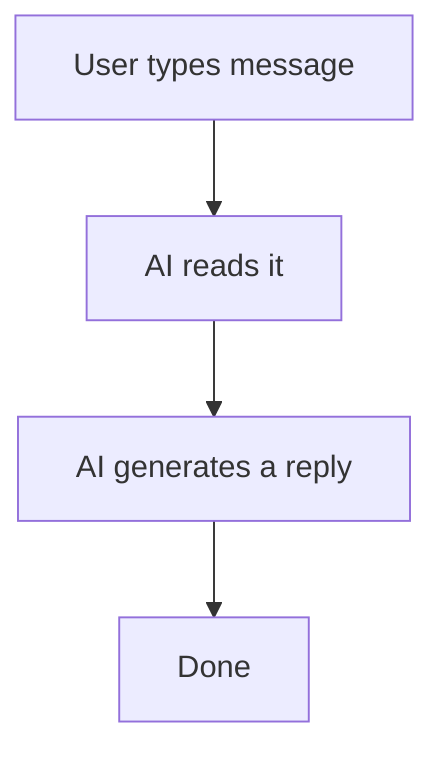
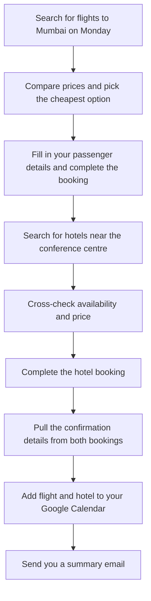

# {{ $frontmatter.title }} 관련

```component VPCard
{
  "title": "LLM > Article(s)",
  "desc": "Article(s)",
  "link": "/ai/llm/articles/README.md",
  "logo": "/images/ico-wind.svg",
  "background": "rgba(10,10,10,0.2)"
}
```

[[toc]]

---

<SiteInfo
  name="What is Agentic AI? How AI Is Evolving From Chatbot to Co-Worker"
  desc="You ask ChatGPT a question. It answers. You ask another. It answers again. That back-and-forth has been the standard way most people experience AI: a smart, fast assistant that responds when spoken to"
  url="https://freecodecamp.org/news/what-is-agentic-ai-from-chatbot-to-co-worker"
  logo="https://cdn.freecodecamp.org/universal/favicons/favicon.ico"
  preview="https://cdn.hashnode.com/uploads/covers/5fc16e412cae9c5b190b6cdd/66ea50ee-f208-47c2-a35b-cd6823464f21.png"/>

You ask ChatGPT a question. It answers. You ask another. It answers again. That back-and-forth has been the standard way most people experience AI: a smart, fast assistant that responds when spoken to.

But something big is changing. AI is no longer just responding. It is planning, deciding, and acting on its own. This new kind of AI is called **agentic AI**, and it is quickly becoming one of the most important shifts in technology today.

In this article, we'll break down what agentic AI is, how it works, where it is being used, and what risks it brings along.

---

## What Does "Agentic" Even Mean?

The word comes from "agency": the ability to act independently toward a goal.

A regular chatbot waits for you to ask something. An agentic AI system is given a goal and then figures out the steps needed to reach it. It can use tools, browse the web, write and run code, send emails, and loop back to fix its own mistakes, without you guiding every move.

Think of the difference this way: A chatbot is like a very knowledgeable colleague who only speaks when spoken to. An AI agent is like giving that colleague a task and saying, "Handle this for me," then walking away.

---

## How a Chatbot Works vs. How an Agent Works

To understand agentic AI, it helps to see the difference in action.

A chatbot follows a simple loop:



An AI agent follows a much more complex loop:

```plaintext
User gives a goal
  → Agent breaks it into steps
  → Agent picks a tool (web search, code runner, email, etc.)
  → Agent takes action
  → Agent checks the result
  → If result is wrong or incomplete, agent adjusts and tries again
  → Agent moves to the next step
  → Repeats until the goal is achieved
```

That ability to plan, act, check, and retry is what makes agentic AI fundamentally different. It is not just predicting the next word in a sentence. It is running a small project.

---

## A Real Example: Booking a Business Trip

Here is a concrete example to make this tangible.

You tell an AI agent: *"Book me the cheapest flight to Mumbai next Monday, find a hotel near the conference centre, and add both to my calendar."*

A chatbot would give you links or suggestions and leave the rest to you.

An AI agent would:



Each of those steps involves calling a different tool or service. The agent handles all of it. You just gave it the goal.

---

## The Building Blocks of an AI Agent

Every AI agent, no matter how complex, is built on a few core components.

**A brain (the language model).** This is the reasoning engine: usually a [<VPIcon icon="fa-brands fa-wikipedia-w"/>large language model](https://en.wikipedia.org/wiki/Large_language_model) like [<VPIcon icon="fa-brands fa-wikipedia-w"/>GPT-4](https://en.wikipedia.org/wiki/GPT-4) or Claude. It reads the goal, thinks through the plan, and decides what to do next.

**Memory.** Agents need to remember what they have already done. Short-term memory keeps track of the current task. Long-term memory lets the agent store information across sessions: so it remembers your preferences from last time.

**Tools.** An agent without tools is just a chatbot. Tools are what give agents power. Common tools include web search, code execution, file reading, API calls, email, and calendar access. The agent decides which tool to use and when.

**A feedback loop.** After taking an action, the agent checks whether it worked. If a step failed or returned a wrong result, it tries a different approach. This self-correction is what makes agents reliable for multi-step tasks.

---

## Why Is This Happening Now?

Agentic AI is not a brand new idea. Researchers have explored autonomous agents for decades. So why is it suddenly everywhere in 2026?

Three things came together at the right time.

First, language models got dramatically better at reasoning. Earlier models were good at writing text but poor at logical planning. Newer models can break down complex tasks, spot errors in their own output, and change strategy mid-task.

Second, tool integration became much easier. Frameworks like [<VPIcon icon="iconfont icon-langchain"/>LangChain](https://langchain.com), [<VPIcon icon="fa-brands fa-microsoft"/>AutoGen](https://microsoft.com/en-us/research/project/autogen/), and OpenAI's function calling made it straightforward for developers to connect a language model to real-world tools. What once took months of custom engineering now takes days.

Third, businesses started demanding it. Copy-pasting AI suggestions into forms and emails gets old quickly. Companies want AI that completes workflows, not just assists with them.

---

## Where Agentic AI Is Being Used Today

Agentic AI is already showing up across many industries, not just in tech companies.

In software development, AI agents write code, run tests, find bugs, and open pull requests: all from a single instruction like "fix the login error on the checkout page."

In customer support, agents handle entire conversations. They look up order history, process refunds, escalate complex cases to a human, and follow up via email: without a support agent touching the ticket.

In research, agents search dozens of sources, extract key data, cross-reference findings, and produce a summarized report. A task that used to take hours gets done in minutes.

In marketing, agents draft campaign content, schedule social posts, monitor performance metrics, and suggest adjustments based on what is working.

---

## What Are the Risks?

Agentic AI is powerful, but it comes with real concerns that are worth knowing about.

The biggest one is unintended actions. An agent that misunderstands a goal can take a chain of wrong steps before anyone notices. Unlike a chatbot that gives a wrong answer you can simply ignore, an agent that makes a wrong booking or sends the wrong email has already caused a real-world consequence.

There is also the issue of security. Agents that can read emails, access files, and browse the web are attractive targets. A technique called "[<VPIcon icon="iconfont icon-owasp"/>prompt injection](https://owasp.org/www-community/attacks/PromptInjection)" can trick an agent into following malicious instructions hidden inside a webpage or document it reads during a task.

Finally, there is accountability. When an AI agent makes a mistake across a ten-step workflow, it can be genuinely hard to trace exactly where things went wrong, and who or what is responsible.

This is why most well-designed agentic systems today include a "human in the loop": a checkpoint where a person reviews and approves key decisions before the agent acts on them.

---

## What This Means for You

You do not need to be a developer to feel the impact of agentic AI. These systems are already being built into the tools people use every day: email clients, project management apps, CRM systems, and more.

The shift worth understanding is this: AI is moving from a tool you interact with to a system that works alongside you. The chatbot answered your questions. The agent handles your tasks.

That is a meaningful change: not just in how AI works, but in how we work with it. The more you understand what agents can and cannot do, the better placed you are to use them well, delegate wisely, and catch mistakes before they snowball.

Agentic AI is not science fiction. It is already in your workplace, and it is only going to become more capable from here.

Understanding the technology is the first step. The next is deciding how to put it to work.

::: info

Hope you enjoyed this article. You can [connect with me on LinkedIn (<VPIcon icon="fa-brands fa-linkedin"/>`manishmshiva`)](https://linkedin.com/in/manishmshiva).

:::

<!-- TODO: add ARTICLE CARD -->
```component VPCard
{
  "title": "What is Agentic AI? How AI Is Evolving From Chatbot to Co-Worker",
  "desc": "You ask ChatGPT a question. It answers. You ask another. It answers again. That back-and-forth has been the standard way most people experience AI: a smart, fast assistant that responds when spoken to",
  "link": "https://chanhi2000.github.io/bookshelf/freecodecamp.org/what-is-agentic-ai-from-chatbot-to-co-worker.html",
  "logo": "https://cdn.freecodecamp.org/universal/favicons/favicon.ico",
  "background": "rgba(10,10,35,0.2)"
}
```
