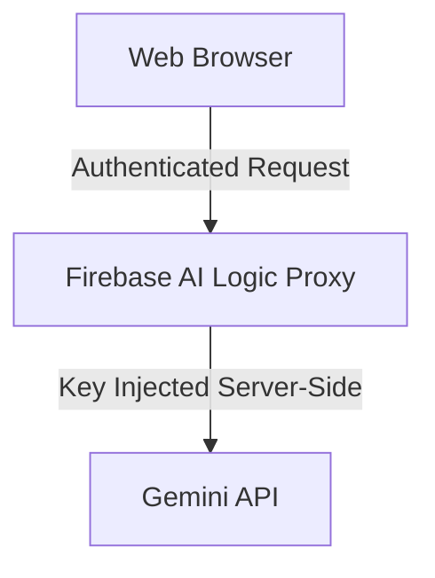

# {{ $frontmatter.title }} 

```component VPCard
{
  "title": "Node.js > Article(s)",
  "desc": "Article(s)",
  "link": "/programming/js-node/articles/README.md",
  "logo": "/images/ico-wind.svg",
  "background": "rgba(10,10,10,0.2)"
}
```

```component VPCard
{
  "title": "Google Cloud > Article(s)",
  "desc": "Article(s)",
  "link": "/devops/gcp/articles/README.md",
  "logo": "/images/ico-wind.svg",
  "background": "rgba(10,10,10,0.2)"
}
```

```component VPCard
{
  "title": "Google Gemini > Article(s)",
  "desc": "Article(s)",
  "link": "/ai/gemini/articles/README.md",
  "logo": "/images/ico-wind.svg",
  "background": "rgba(10,10,10,0.2)"
}
```

[[toc]]

---

<SiteInfo
  name="Why You Should Never Embed Your Gemini API Key in Client Code (And How Firebase AI Logic Fixes It)"
  desc="The explosion of generative AI has pushed thousands of web developers to add intelligent features to their apps. The first instinct is usually to call the Gemini API's SDK directly from the browser. T"
  url="https://freecodecamp.org/news/why-you-should-never-embed-your-gemini-api-key-in-client-code-and-how-firebase-ai-logic-fixes-it"
  logo="https://cdn.freecodecamp.org/universal/favicons/favicon.ico"
  preview="https://cdn.hashnode.com/uploads/covers/5e1e335a7a1d3fcc59028c64/3a42885a-9cac-4fbc-8fac-affbafd7785c.png"/>

The explosion of generative AI has pushed thousands of web developers to add intelligent features to their apps.

The first instinct is usually to call the Gemini API's SDK directly from the browser. That instinct comes with a serious security risk: exposing your API key to the world.

In this article, you'll learn why shipping a raw Gemini API key to the client is dangerous, how Firebase AI Logic's proxy architecture solves it, and how Firebase App Check closes the second half of the problem that a proxy alone doesn't fix.

By the end, you'll have a working, production-style setup: a protected AI Logic client, a properly configured App Check flow (debug token included), and real usage patterns, streaming, multi-turn chat, and structured JSON output, not just a single `console.log`.

::: note Prerequisites

Before you start, make sure you have the following:

- **Node.js v18 or later** (`node --version`)
- A **Google account** to create a Firebase project (the free Spark plan works for the Gemini Developer API)
- Basic familiarity with JavaScript, `async`/`await`, and ES modules
- A code editor and a terminal

You don't need prior experience with Firebase, App Check, or the Gemini API, as this guide builds that understanding from the ground up.

:::

---

## The Problem With Client-Side API Keys

Embedding an API key inside a JavaScript bundle, or in an `.env` file that ends up shipped to the browser, is a critical security flaw, and it's trivially easy to exploit. Here's what that actually looks like in practice.

Say you call the Gemini API directly from client code like this:

```js
// DON'T do this in a browser-shipped app
const genAI = new GoogleGenerativeAI("AIzaSyD4-your-real-key-here");
```

Bundle that with any build tool and the key lands in your output JS as plain text. Anyone can find it in under a minute, no special tools required:

```sh
# Anyone can run this against your deployed bundle
curl -s https://your-app.com/assets/main.js | grep -oE "AIzaSy[A-Za-z0-9_-]{33}"
```

That one command extracts a Gemini API key from a minified production bundle if it's in there. From the Network tab in the browser's dev tools, it's even more visible, every outgoing request to `generativelanguage.googleapis.com` shows the key directly in the query string or headers.

If your Gemini API key leaks this way, an attacker can:

- Drain your entire usage quota
- Cause your Cloud bill to spike unpredictably (Gemini calls are billed per token, unlike a flat-rate database read)
- Use your resources to run their own requests, which can get your Google Cloud project suspended for abuse

Historically, the only fix was to build, deploy, and maintain a custom backend server (Node.js, Python, Go...) that acted as a proxy between your app and the Gemini API, just to keep one string secret. That's real infrastructure to run for what should be a simple feature.

---

## Step 1 – How Firebase AI Logic's Proxy Architecture Works

**Firebase AI Logic** gives you that proxy gateway without you having to build or host it. You still write client-side code, but the key never leaves Google's infrastructure.



Your Gemini API key stays stored securely, tied to your Firebase project. The client SDK sends a request to the proxy gateway, and the proxy injects the key and forwards the call to your chosen "Gemini API" provider. The key is never present in your JS bundle, your network requests, or anything the browser can inspect.

Firebase AI Logic supports two providers, chosen when you set up the service in the console:

|  | Gemini Developer API | Agent Platform Gemini API (formerly Vertex AI) |
| --- | --- | --- |
| Billing plan | Works on the free Spark plan | Requires the Blaze (pay-as-you-go) plan |
| Best for | Getting started fast, prototyping, most web/mobile apps | Data-residency requirements, teams already on Google Cloud/Vertex AI |
| Region control | Limited | Choose specific regions (`us`, `eu`) for model access, depending on the model |
| Setup friction | Minimal, no billing needed | Requires linking a Cloud Billing account |

For most apps, start with the Gemini Developer API, that's what this tutorial uses. Switching providers later is a config change, not a code rewrite, since both go through the same `getGenerativeModel()` interface.

---

## Step 2 – What Firebase App Check Actually Does

A proxy hides the key. It does not, by itself, stop *anyone* from calling that proxy. Your Firebase config object (`apiKey`, `projectId`, and so on) isn't a secret, it's meant to be public, and it's visible in every deployed app's bundle by design. Without another layer, a bot could copy that config, initialize its own Firebase app pointed at your project, and call your AI Logic proxy directly, running up your Gemini bill with none of your actual users involved.

This is exactly what **Firebase App Check** is for, and it's worth understanding precisely what it does, because it's easy to confuse with authentication.

**App Check is attestation, not authentication.** Firebase Authentication answers "who is this user?" App Check answers a different question: "is this request coming from a genuine, untampered instance of *my app*, and not a script, a bot, or someone else's app using my config?" You can, and should, use both together, but App Check is what protects you from abuse even when a request comes with zero user context.

**How the flow actually works, step by step:**

1. When your app initializes App Check, the SDK triggers an **attestation challenge** with the configured provider. On the web, that's reCAPTCHA Enterprise, it runs an invisible risk assessment (mouse movement, browser fingerprint, network signals) and returns a token asserting "this looks like a legitimate browser session."
2. Your app's SDK sends that reCAPTCHA token to Firebase's App Check backend, which exchanges it for a **Firebase App Check token**, a short-lived, signed JWT.
3. That App Check token is cached locally and automatically attached to every subsequent request your app makes to Firebase AI Logic (and other App Check-integrated services like Firestore or Cloud Functions).
4. Before the AI Logic proxy forwards your request to Gemini, it verifies the App Check token's signature and validity. No valid token, no request reaches the model.

The reason this matters *specifically* for generative AI, more than for a typical CRUD backend, is cost shape. A blocked Firestore read costs you nothing. A blocked Gemini call, if it weren't blocked, could cost real money per request, and at scale, a scripted abuse loop can burn through a monthly budget in hours. App Check is the gate that makes sure only your actual app can trigger that spend.

::: note Heads up

Google has announced that App Check enforcement will become **mandatory for Firebase AI Logic starting November 2, 2026**. Starting even earlier, in July 2026, the guided setup workflow in the Firebase console already enables App Check automatically for new AI Logic integrations. Any unverified request made after the enforcement date will be rejected outright, so it's worth wiring this up now rather than scrambling later.

:::

---

## Step 3 – Set Up Your Firebase Project

1. Go to the [<VPIcon icon="iconfont icon-firebase"/>Firebase console](https://console.firebase.google.com/) and create a new project (or open an existing one).
2. In the left sidebar, open **Build** and then **AI Logic**, then click **Get started**. Choose **Gemini Developer API** as your provider to follow along without setting up billing.
3. Back in **Project settings**, go to **General** and then **Your apps**. Register a web app if you haven't already, and copy the Firebase config object. You'll need it in the next steps.

We'll leave the App Check setup for the next step, as it deserves its own walkthrough.

---

## Step 4 – Integrate Firebase App Check

### Register Your App for reCAPTCHA Enterprise

In the Firebase console, go to **Build** and then **App Check**, select your web app, and choose **reCAPTCHA Enterprise** as the provider. Firebase generates a **site key** tied to your app's domain. Copy it, as you'll pass it into your code below.

### Install the SDK

```sh
npm install firebase
```

That's the only package you need. `ReCaptchaEnterpriseProvider` ships inside `firebase/app-check`, part of the same `firebase` package. There's no separate reCAPTCHA SDK to install and no `<script>` tag to add manually. Firebase loads the reCAPTCHA Enterprise script for you as soon as `initializeAppCheck()` runs.

### Initialize App Check with a Debug Token for Local Development

reCAPTCHA Enterprise doesn't behave reliably on `localhost`, so before writing production code, set up the App Check **debug provider**. This lets you develop locally without fighting false rejections:

```js title="app-check-setup.js"
import { initializeApp } from "firebase/app";
import { initializeAppCheck, ReCaptchaEnterpriseProvider } from "firebase/app-check";

const firebaseConfig = {
  apiKey: "AIzaSy...",
  authDomain: "your-project.firebaseapp.com",
  projectId: "your-project",
  storageBucket: "your-project.firebasestorage.app",
  messagingSenderId: "123456789",
  appId: "1:1234:web:abcd",
};

const app = initializeApp(firebaseConfig);

// Enable the debug provider ONLY in local/dev environments.
// This prints a debug token to the console the first time it runs.
if (location.hostname === "localhost") {
  self.FIREBASE_APPCHECK_DEBUG_TOKEN = true;
}

export const appCheck = initializeAppCheck(app, {
  provider: new ReCaptchaEnterpriseProvider("YOUR_RECAPTCHA_ENTERPRISE_SITE_KEY"),
  isTokenAutoRefreshEnabled: true,
});

export { app };
```

The first time this runs locally, check your browser console for a line like:

```plaintext
App Check debug token: 5f2b1a3c-....-....-.... You will need to add it to your app's App Check settings in the Firebase console before the token can be used.
```

Copy that token into **App Check → Apps → [your app] → Manage debug tokens** in the console. From then on, requests from your local machine are treated as verified, without needing a real reCAPTCHA challenge. Never ship this debug-token block to production. You should gate it behind an environment check as shown above.

### Verifying it's Working

Once your app makes its first App Check-protected request (you'll wire that up in Step 5), go to **App Check** and then **APIs** in the console. You'll see a live breakdown of verified vs. unverified requests hitting Firebase AI Logic. If everything is wired correctly, your traffic shows up as "Verified."

---

## Step 5 – Implement Firebase AI Logic

With App Check in place, here's how to actually use the model, beyond a single request/response round trip.

### Basic Setup:

```js title="ai-client.js"
import { getAI, GoogleAIBackend, getGenerativeModel } from "firebase/ai";
import { app } from "./app-check-setup.js";

// useLimitedUseAppCheckTokens issues short-lived tokens for extra protection
// against replay attacks on top of standard App Check verification.
const ai = getAI(app, {
  backend: new GoogleAIBackend(),
  useLimitedUseAppCheckTokens: true,
});

export const model = getGenerativeModel(ai, { model: "gemini-3.8-flash" });
```

::: note

Gemini model names and availability change frequently, `gemini-2.0-flash` and its Lite variant were retired on June 1, 2026, and the Gemini 2.5 line is now deprecated in favor of the Gemini 3.x series.

:::

Always check the [<VPIcon icon="iconfont icon-firebase"/>supported models page](https://firebase.google.com/docs/ai-logic/models) before hardcoding a model name in production. Or better yet, load it from Firebase Remote Config so you can swap models without shipping a new build.

### Example 1 — a Single Request

```js
import { model } from "./ai-client.js";

async function generateAIText(prompt) {
  try {
    const result = await model.generateContent(prompt);
    const response = result.response;
    return response.text();
  } catch (error) {
    console.error("Firebase AI Logic request failed:", error);
  }
}

generateAIText("Explain the purpose of an API proxy in two sentences.");
```

### Example 2 — Streaming into the UI

For anything longer than a sentence, streaming gives users a response that starts appearing immediately instead of a multi-second blank wait. Here's a real DOM-wired example, not just a console log:

```js
import { model } from "./ai-client.js";

async function streamIntoElement(prompt, targetElement) {
  targetElement.textContent = "";

  const result = await model.generateContentStream(prompt);

  for await (const chunk of result.stream) {
    targetElement.textContent += chunk.text();
  }

  // The aggregated final response is also available once streaming finishes
  const finalResponse = await result.response;
  console.log("Total tokens used:", finalResponse.usageMetadata?.totalTokenCount);
}

const output = document.querySelector("#ai-output");
streamIntoElement("Write a 3-sentence product description for a smart water bottle.", output);
```

### Example 3 — Multi-turn Chat

For a chatbot-style feature, you don't want to manually track and resend the whole conversation on every call. `startChat()` handles that for you:

```js
import { model } from "./ai-client.js";

const chat = model.startChat({
  history: [
    { role: "user", parts: [{ text: "I'm building a task management app." }] },
    { role: "model", parts: [{ text: "Got it, what would you like help with?" }] },
  ],
});

async function sendChatMessage(message) {
  const result = await chat.sendMessage(message);
  return result.response.text();
}

sendChatMessage("Suggest 3 status labels for a Kanban board.");
// A follow-up call automatically has the prior turns as context:
sendChatMessage("Now suggest color codes for each of those.");
```

### Example 4 — Structured JSON Output

If you're feeding the model's output into your app's logic (rendering a card, populating a form), free-text output is fragile to parse. Pass a `responseSchema` to force valid, typed JSON back:

```js :collapsed-lines
import { getGenerativeModel, Schema } from "firebase/ai";
import { ai } from "./ai-client.js"; // assuming `ai` is also exported from ai-client.js

const taskSchema = Schema.object({
  properties: {
    title: Schema.string(),
    priority: Schema.enumString({ enum: ["low", "medium", "high"] }),
    tags: Schema.array({ items: Schema.string() }),
  },
});

const structuredModel = getGenerativeModel(ai, {
  model: "gemini-3.8-flash",
  generationConfig: {
    responseMimeType: "application/json",
    responseSchema: taskSchema,
  },
});

async function extractTaskFromText(text) {
  const result = await structuredModel.generateContent(
    `Extract a task from this note: "${text}"`
  );
  return JSON.parse(result.response.text());
}

extractTaskFromText("Need to review the PR from Sarah by Friday, this is urgent");
//
// → { title: "Review PR from Sarah", priority: "high", tags: ["review"] }
```

### Example 5 — Handling Rate Limits and Transient Errors

Gemini calls can hit rate limits or transient failures, especially under load. A simple exponential backoff keeps your app resilient without hammering the API:

```js
import { model } from "./ai-client.js";

async function generateWithRetry(prompt, maxRetries = 3) {
  for (let attempt = 0; attempt <= maxRetries; attempt++) {
    try {
      const result = await model.generateContent(prompt);
      return result.response.text();
    } catch (error) {
      const isRetryable = error.message?.includes("429") || error.message?.includes("503");
      if (!isRetryable || attempt === maxRetries) throw error;

      const delayMs = 2 ** attempt * 1000; // 1s, 2s, 4s...
      await new Promise((resolve) => setTimeout(resolve, delayMs));
    }
  }
}
```

---

## Debugging Common Issues

### Issue 1: `API key not valid. Please pass a valid API key.`

This usually means the `apiKey` in your Firebase config doesn't match your project, or the required APIs weren't enabled. Double-check the value against **Project settings → General** in the console. 

### Issue 2: `403` or requests silently blocked, even though your code looks correct

Almost always an App Check registration mismatch. Confirm that the domain you're testing from matches what you registered for the reCAPTCHA Enterprise site key, and that App Check shows your requests as "Verified" (not "Unenforced" or missing entirely) under **App Check** and then **APIs**.

### Issue 3: App Check works in production but fails on `localhost`

Expected, reCAPTCHA Enterprise doesn't run reliably on `localhost`. Make sure the debug-token block from Step 4 is active in your dev environment, and that you've added the printed debug token to **App Check** and then **Manage debug tokens** in the console. If you rotate machines or clear browser storage, a fresh token gets printed, and you'll need to re-register it.

### Issue 4: Model errors or unexpected shutdowns

Google periodically retires older Gemini models with a few months' notice, `gemini-2.0-flash` and its Lite variant, for instance, were shut down on June 1, 2026. If a request that used to work suddenly returns a 404, check the [<VPIcon icon="iconfont icon-firebase"/>models page](https://firebase.google.com/docs/ai-logic/models) for a deprecation notice before assuming it's a bug in your code.

### Issue 5: Streaming stops partway with no error

This is usually a `usageMetadata`/token-limit issue, not a network failure. Check `finalResponse.candidates[0].finishReason` (available once `result.response` resolves), a value like `MAX_TOKENS` tells you the response was cut off, not that something crashed.

### Conclusion

Building generative AI features means adopting production-grade security from the prototyping stage, not bolting it on afterward. Firebase AI Logic's proxy architecture keeps your Gemini API key out of client code entirely, and Firebase App Check makes sure that even with the key hidden, only genuine instances of your app can spend your quota. Together, they cover the two failure modes that matter most: key theft and scripted abuse.

A few things worth exploring next:

- **Function calling / tool use**, so Gemini can call your own app functions as part of its response
- **Server-side prompt templates**, if you want to keep your prompts out of client code entirely, not just your API key
- **Hybrid inference**, which falls back to on-device models in supported browsers when available, cutting cost and latency for simple requests
- **Firebase Remote Config for model names**, so you can roll out a new Gemini model to users without shipping a new app version

<!-- TODO: add ARTICLE CARD -->
```component VPCard
{
  "title": "Why You Should Never Embed Your Gemini API Key in Client Code (And How Firebase AI Logic Fixes It)",
  "desc": "The explosion of generative AI has pushed thousands of web developers to add intelligent features to their apps. The first instinct is usually to call the Gemini API's SDK directly from the browser. T",
  "link": "https://chanhi2000.github.io/bookshelf/freecodecamp.org/why-you-should-never-embed-your-gemini-api-key-in-client-code-and-how-firebase-ai-logic-fixes-it.html",
  "logo": "https://cdn.freecodecamp.org/universal/favicons/favicon.ico",
  "background": "rgba(10,10,35,0.2)"
}
```
