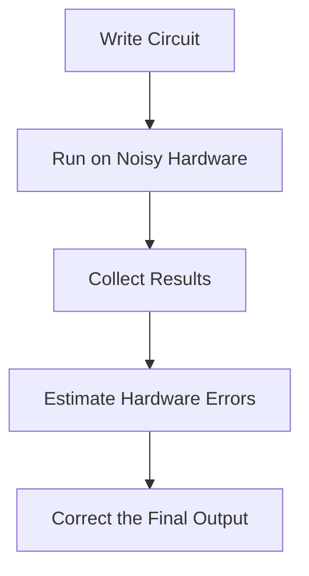
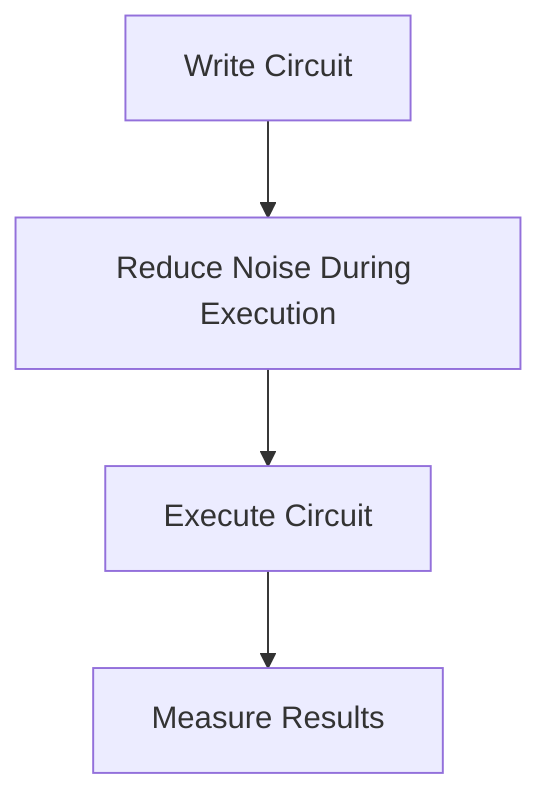
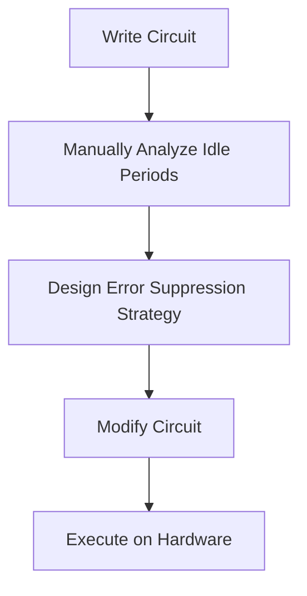
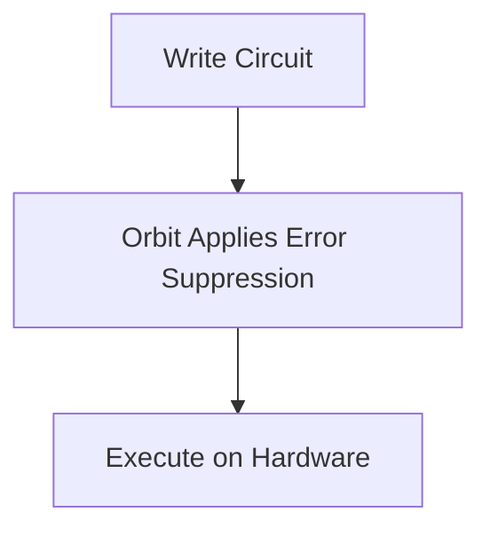
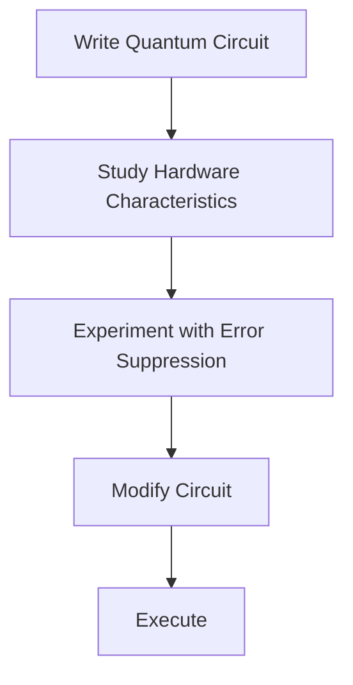
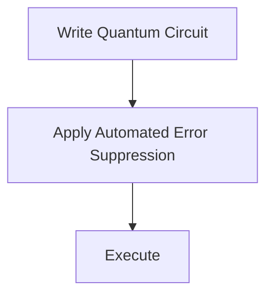

# {{ $frontmatter.title }} 관련

```component VPCard
{
  "title": "Qiskit > Article(s)",
  "desc": "Article(s)",
  "link": "/programming/py-qiskit/articles/README.md",
  "logo": "/images/ico-wind.svg",
  "background": "rgba(10,10,10,0.2)"
}
```

```component VPCard
{
  "title": "Hardware > Article(s)",
  "desc": "Article(s)",
  "link": "/hw/articles/README.md",
  "logo": "/images/ico-wind.svg",
  "background": "rgba(10,10,10,0.2)"
}
```

[[toc]]

---

<SiteInfo
  name="Why Your Quantum Circuit Works in a Simulator but Fails on Real Hardware [Full Handbook]"
  desc="If the exact same quantum circuit works perfectly in a simulator, why does it often produce different results on a real quantum computer? That question catches almost every quantum developer by surpri"
  url="https://freecodecamp.org/news/why-your-quantum-circuit-works-in-a-simulator-but-fails-on-real-hardware-full-handbook"
  logo="https://cdn.freecodecamp.org/universal/favicons/favicon.ico"
  preview="https://cdn.hashnode.com/uploads/covers/5fc16e412cae9c5b190b6cdd/8e79825e-752f-4667-88fd-548e3687455d.png"/>

If the exact same quantum circuit works perfectly in a simulator, why does it often produce different results on a real quantum computer?

That question catches almost every quantum developer by surprise. Understanding it is essential if you plan to build larger, more reliable quantum applications.

This tutorial assumes you're already comfortable creating and executing basic quantum circuits in [<VPIcon icon="iconfont icon-ibm"/>Qiskit](https://ibm.com/quantum/qiskit).

The first time you execute a circuit on real hardware, you'd expect the output to match the simulator. After all, the code, algorithm, and compiler remain the same. Yet the results often do.

Sometimes the difference is barely noticeable. Other times, a circuit that looked perfect in simulation suddenly produces outputs that are difficult to explain. As your circuits become deeper, involve more qubits, or include more gates, those differences become increasingly significant.

When I first encountered this behavior, my instinct was the same as many beginners: *I must have made a mistake somewhere.*

I reviewed my code, checked my gates, and compared the circuit diagrams. I reran the simulator. Everything looked correct. The problem wasn't the algorithm. It was the hardware.

Unlike the ideal environment simulated by Qiskit Aer, real quantum processors operate in a world filled with imperfections. Qubits gradually lose their quantum information. Gates are never perfectly accurate. Measurements introduce uncertainty. Even qubits waiting for their turn in a computation continue interacting with their environment, accumulating errors before they perform another operation.

These challenges are collectively known as **quantum noise**, and they are one of the biggest obstacles preventing today's quantum computers from performing long, complex calculations reliably.

Fortunately, quantum researchers haven't been standing still. Over the years, they've developed a growing collection of techniques to reduce the impact of noise and improve the quality of quantum computations. Broadly speaking, these techniques fall into two categories:

- **Error mitigation**, which estimates and compensates for errors after a circuit has executed.
- **Error suppression**, which attempts to prevent many of those errors from occurring in the first place while the circuit is running.

More recently, these advanced techniques have started becoming accessible through developer-friendly tools instead of requiring researchers to manually tune every circuit.

One of the newest examples is **Orbit**, an automated quantum error suppression solution available through the Qiskit Functions Catalog. Rather than requiring developers to become specialists in techniques like dynamical decoupling, Orbit is designed to integrate advanced error suppression into existing Qiskit workflows with minimal additional effort.

But before we can appreciate why tools like Orbit matter, we first need to understand the problem they're solving.

That's exactly what we'll do in this tutorial. Instead of jumping straight into a new tool, we'll investigate one of the most common and most important questions in quantum computing:

**Why do quantum circuits behave differently on real hardware than they do in a simulator?**

Along the way, you'll learn where quantum errors come from, how to reproduce many of them locally using Qiskit Aer, why larger circuits become increasingly difficult to execute reliably, and how modern error suppression techniques help developers get more useful results from today's quantum computers.

By the end of this guide, you'll understand not only *what* causes quantum circuits to fail on real hardware, but also *what developers can do about it*.

---

## The Experiment: Running the Same Circuit in a Simulator and on Real Hardware

One of the biggest advantages of learning quantum computing with Qiskit is that you don't need immediate access to a quantum computer. You can write, test, and debug your circuits locally using Qiskit Aer before running them on real IBM Quantum hardware.

Let's begin with one of the first circuits you may likely build as a quantum developer: **the Bell State**.

### Starting with a Familiar Circuit

The Bell State is often the first example developers encounter when learning quantum programming because it demonstrates one of quantum computing's most fascinating properties: [<VPIcon icon="fa-brands fa-microsoft"/>entanglement](https://quantum.microsoft.com/en-us/insights/education/concepts/entanglement).

Create <VPIcon icon="fa-brands fa-python"/>`bell_state.py` file:

```py
from qiskit import QuantumCircuit

# Create a quantum circuit with two qubits and two classical bits 
qc = QuantumCircuit(2, 2)

# Place the first qubit into superposition 
qc.h(0)

# Entangle the second qubit with the first 
qc.cx(0, 1) 

# Measure both qubits 
qc.measure([0, 1], [0, 1]) 

print(qc)
```

In this code, the Hadamard gate places the first qubit into a superposition, while the CNOT gate entangles the second qubit with it. Once measured, both qubits should always produce matching values.

In an ideal quantum computer, you should expect only two measurement outcomes:

- `00`
- `11`

Each outcome should appear with roughly the same probability.

States like `01` and `10` shouldn't appear at all because they violate the expected Bell State correlations.

### Step 1: Running the Circuit on the Simulator

You will begin by executing the circuit using the Qiskit Aer simulator:

```py
from qiskit_aer import AerSimulator

simulator = AerSimulator()

result = simulator.run(
    qc,
    shots=4096
).result()

counts = result.get_counts()

print(counts)
```

Adding your simulator to <VPIcon icon="fa-brands fa-python"/>`bell_state.py`, you now have:

```py
from qiskit import QuantumCircuit
from qiskit_aer import AerSimulator

qc = QuantumCircuit(2, 2)
qc.h(0)
qc.cx(0, 1)
qc.measure([0, 1], [0, 1])

simulator = AerSimulator()
result = simulator.run(
    qc,
    shots=4096
).result()
counts = result.get_counts()
print(counts)
```

Make sure your virtual environment is activated (`source .venv/bin/activate`), and you installed Qiskit and Qiskit Aer (`pip install qiskit qiskit-aer`).

Run: `python bell_state.py`, a typical output looks like this:

```plaintext
{'00': 2039, '11': 2057}
```

Your numbers will likely be slightly different because quantum measurements are probabilistic. However, the overall pattern should remain the same.

Only `00` and `11` appear. There are no unexpected measurement outcomes, and everything behaves exactly as quantum theory predicts.

At this point, it's easy to feel confident that your circuit is correct. And it is. But there's an important detail hiding behind these perfect results.

::: note

The simulator assumes an ideal quantum computer.

:::

It doesn't have to worry about hardware limitations because it's simply calculating the mathematical evolution of your quantum state.

Among other things, the simulator assumes that:

- Every quantum gate is executed perfectly.
- Qubits never lose their quantum state.
- Measurements are always accurate.
- The environment never interferes with the computation.
- No additional noise is introduced while the circuit runs.

Those assumptions make simulators incredibly valuable for learning, debugging, and verifying quantum algorithms.

Unfortunately, real quantum processors don't operate under ideal conditions.

### Step 2: Running the Same Circuit on a Real Quantum Computer

Now imagine taking this exact same circuit and executing it on a real quantum processor.

Notice that nothing changes. Not the code, algorithm, or the Bell State itself. The only thing we're changing is **where the circuit runs**.

If you submit this circuit to a real quantum computer, you might expect results that closely match the simulator. After all, if the algorithm is correct, shouldn't the output be the same?

In reality, you'll often observe something more like this:

```json
{
  "00": 1912,
  "11": 1834,
  "01": 161,
  "10": 189
}
```

The first thing that stands out is the appearance of two unexpected outcomes: `01` and `10`.

Those states weren't present in the simulator. So where did they come from? The answer isn't that your code suddenly became incorrect.

The Bell State circuit hasn't changed. The simulator wasn't misleading you.

Instead, the quantum hardware is introducing small imperfections while your circuit executes.

A gate may be applied with slightly less than perfect accuracy. A qubit may begin losing its quantum information before the computation finishes. A measurement may occasionally report the wrong value.

Individually, these errors are usually very small. Collectively, they begin to change the final measurement statistics. For a simple Bell State, the differences are relatively minor.

But quantum algorithms rarely stop at two qubits and two gates.

As circuits become deeper and more complex, these small imperfections accumulate. Eventually, they can overwhelm the quantum information your algorithm is trying to preserve, making the final results less reliable.

This is one of the biggest challenges facing today's quantum computers.

A simulator shows us **how a quantum algorithm is expected to behave** under ideal conditions.

Real hardware shows us **how that same algorithm behaves in the presence of noise**. Closing that gap is one of the central goals of modern quantum computing research.

Before you explore techniques like **quantum error suppression** or see how tools like **Orbit** help automate parts of that process, you first need to understand where these errors come from.

---

## What Happens Inside a Real Quantum Computer?

At this point, we've established something that surprises almost every new quantum developer:

The same quantum circuit can produce different results depending on where it runs.

But that naturally leads to another question:

> **What exactly is happening inside a real quantum computer that doesn't happen inside a simulator?**

To answer that, you need to look beyond your Python code and understand what happens after you click **Run**.

### From Python Code to Physical Qubits

When you execute a circuit with Qiskit Aer, the simulator performs mathematical calculations to determine how the quantum state evolves. It works with complex numbers and linear algebra, faithfully applying each gate exactly as quantum mechanics predicts.

Nothing interferes with the computation unless you explicitly introduce a noise model.

Real quantum computers work very differently. Instead of manipulating mathematical objects, they manipulate **physical qubits**.

Depending on the hardware architecture, these qubits might be:

- superconducting circuits cooled to temperatures colder than outer space
- trapped ions suspended by electromagnetic fields
- neutral atoms held in optical tweezers
- another emerging quantum technology.

Although these platforms use different hardware, they all share one important characteristic:

**Qubits are extremely fragile.**

Unlike classical bits, which remain either `0` or `1` until they're changed, qubits must preserve delicate quantum properties such as superposition and entanglement throughout an entire computation.

Maintaining those properties is far more difficult than it sounds.

### Every Quantum Operation Is a Physical Process

When you write code like this:

```py
qc.h(0)
qc.cx(0, 1)
```

It looks almost effortless. Two lines of Python, less than a second to execute.

Behind the scenes, however, the quantum processor performs a carefully orchestrated series of physical operations.

Control electronics generate microwave pulses or laser pulses. Those signals travel through specialized hardware.

The pulses interact with individual qubits for incredibly short periods of time. The timing must be extraordinarily precise.

If any part of this process deviates even slightly from what was intended, the resulting quantum state can change.

Now imagine repeating this process dozens, hundreds, or even thousands of times within a single algorithm. Tiny imperfections begin to accumulate.

Eventually, those small errors become noticeable in the final measurement results. This is what we broadly refer to as **quantum noise**.

### What Is Quantum Noise?

This is a general term for anything that causes a quantum computer to drift away from the ideal behavior predicted by quantum mechanics.

It doesn't usually mean something dramatic has happened.

Most of the time, the errors are incredibly small.

A gate may rotate a qubit by an angle that's only slightly different from the intended value.

A qubit may lose a little of its quantum information while waiting for another operation. A measurement might occasionally report the wrong state.

Each error seems insignificant on its own. The challenge is that quantum algorithms often involve many operations.

Even tiny inaccuracies begin to add up. Imagine trying to copy a handwritten page. One typo probably doesn't matter.

Copy the same page hundreds of times, introducing one small typo during each copy, and eventually the final document barely resembles the original.

Quantum circuits behave in much the same way. The longer the computation continues, the more opportunities there are for errors to accumulate.

### Four Common Sources of Quantum Noise

Although researchers study many different types of quantum errors, most developers encounter four major categories.

Understanding these will help you make sense of why quantum hardware behaves differently from an ideal simulator.

#### 1. Decoherence

One of the biggest challenges in quantum computing is **decoherence**. A qubit can maintain its quantum state only for a limited amount of time. Eventually, interactions with its surrounding environment cause it to lose the information stored in its superposition.

Think of spinning a coin on a table. When you first spin it, the coin exists in a rapidly changing state that's neither clearly heads nor tails. As time passes, friction slows it down until it finally settles.

Qubits experience a similar loss of information. Except instead of friction, they're affected by tiny interactions with the surrounding environment.

If your circuit takes too long to execute, some qubits may begin losing their quantum information before the computation finishes.

#### 2. Gate Errors

Every quantum gate is a physical operation. Ideally, a Hadamard gate always performs exactly the same transformation. In reality, no hardware is perfect.

The pulse implementing the gate may be slightly stronger, weaker, or slightly delayed than intended. These tiny inaccuracies create **gate errors**.

One imperfect gate isn't usually a problem, hundreds of imperfect gates quickly become one

This is one reason deeper quantum circuits tend to perform worse than shallow ones.

#### 3. Measurement Errors

Even if your computation completes successfully, there's still one final challenge:

Reading the result.

Measuring a qubit is itself a physical process. Sometimes the hardware incorrectly identifies a qubit as `1` when it should be `0`, or vice versa.

Imagine stepping on a bathroom scale that occasionally reports your weight two kilograms heavier than it actually is.

The measurement instrument — not you — is introducing the error.

Quantum computers face a similar problem when reading qubit states.

#### 4. Idle Errors

One of the least intuitive sources of quantum noise occurs when a qubit isn't doing anything at all.

Suppose one qubit is waiting while another qubit is being measured or participating in a multi-qubit operation.

Although it appears idle, it doesn't freeze in time. The qubit continues interacting with its environment. During that waiting period, it can gradually lose coherence.

As quantum circuits become larger, these idle periods become more common.

Reducing the impact of these waiting times is one of the motivations behind advanced **error suppression** techniques such as **dynamical decoupling** — a technique we'll explore later when we discuss Orbit.

### Why Simulators Don't Show These Problems

If you've only worked with Qiskit Aer so far, you may wonder why you've never encountered any of these issues.

The answer is simple.

By default, the simulator isn't trying to model an imperfect quantum computer. It's trying to model **an ideal one**.

That makes it an excellent learning environment because you can verify whether your algorithm is logically correct without worrying about hardware limitations.

But it also means a simulator can't fully prepare you for what happens on real quantum devices.

To understand that difference, you need to recreate it yourself.

Fortunately, Qiskit gives us a way to do exactly that.

Instead of waiting until you have access to a real quantum computer, you can intentionally introduce realistic noise into your local simulator and observe how your Bell State begins to change.

---

## Simulating Quantum Noise with Qiskit Aer

So far, you've compared two different worlds.

In the first world, our Bell State circuit runs inside an ideal simulator, where every quantum operation is mathematically perfect.

In the second world, that same circuit runs on a real quantum processor, where qubits are constantly affected by noise from their surrounding environment.

The obvious challenge is this:

**What if you don't have access to a quantum computer?**

Can you still learn how noise affects your algorithms? Fortunately, you can.

One of Qiskit's most useful features is its ability to simulate realistic hardware imperfections locally using **Qiskit Aer**. Instead of waiting until your circuit reaches a real quantum processor, you can inject different kinds of noise into your simulator and observe how those imperfections influence the final results.

This allows you to experiment, debug, and better understand the behavior of quantum algorithms — all from your own computer.

Let's see how it works.

### Creating a Simple Noise Model

Qiskit Aer includes a collection of tools for building custom noise models. These models let you simulate many of the errors you've just learned about, including gate errors, measurement errors, and qubit decoherence.

For your first experiment, keep things simple by introducing a small amount of random error after every single-qubit and two-qubit gate:

```py
from qiskit_aer.noise import NoiseModel, depolarizing_error

# Create an empty noise model
noise_model = NoiseModel()

# Define gate errors
single_qubit_error = depolarizing_error(0.01, 1)
two_qubit_error = depolarizing_error(0.03, 2)

# Apply errors to common quantum gates
noise_model.add_all_qubit_quantum_error(
    single_qubit_error,
    ["h", "x", "y", "z"]
)

noise_model.add_all_qubit_quantum_error(
    two_qubit_error,
    ["cx"]
)
```

In this code you created an empty `NoiseModel` and defined two **depolarizing errors**.

A depolarizing error is one of the most common ways to simulate hardware noise. Instead of applying a gate perfectly every time, the simulator introduces a small probability that the qubit's state becomes partially randomized.

Think of it like taking a slightly blurry photograph.

The picture still resembles the original, but every small imperfection makes it a little harder to recover the exact details.

That's essentially what depolarizing noise does to a quantum state.

Notice that we're using two different error probabilities:

- **1%** for single-qubit gates
- **3%** for two-qubit gates

This reflects an important reality of today's quantum hardware.

Two-qubit operations are generally more difficult to perform accurately than single-qubit operations, which is why they often have lower fidelities on real quantum processors.

### Running the Bell State with Noise

Rename the <VPIcon icon="fa-brands fa-python"/>`bell_state.py` we used earlier to <VPIcon icon="fa-brands fa-python"/>`bell_state_noise.py` to specify adding a `NoiseModel`.

Reconfigure the simulator with our noise model:

```py
from qiskit_aer import AerSimulator

noisy_simulator = AerSimulator(
    noise_model=noise_model
)

compiled = transpile(qc, noisy_simulator)

job = noisy_simulator.run(
    compiled,
    shots=4096
)

result = job.result()

counts = result.get_counts()

print(counts)
```

At this point your <VPIcon icon="fa-brands fa-python"/>`bell_state_noise.py` should look like this:

```py :collapsed-lines title="bell_state_noise.py"
from qiskit import QuantumCircuit
from qiskit_aer import AerSimulator
from qiskit_aer.noise import NoiseModel, depolarizing_error

# Step 1: Build the Bell State circuit
qc = QuantumCircuit(2, 2)

# Put qubit 0 into superposition
qc.h(0)

# Entangle qubit 1 with qubit 0
qc.cx(0, 1)

# Measure both qubits
qc.measure([0, 1], [0, 1])

print("Bell State Circuit")
print(qc)


# Step 2: Run on the ideal simulator

ideal_simulator = AerSimulator()

ideal_result = ideal_simulator.run(
    qc,
    shots=4096
).result()

ideal_counts = ideal_result.get_counts()

print("\nIdeal Simulator Results")
print(ideal_counts)


# Step 3: Create a noise model
noise_model = NoiseModel()

single_qubit_error = depolarizing_error(0.01, 1)
two_qubit_error = depolarizing_error(0.03, 2)

noise_model.add_all_qubit_quantum_error(
    single_qubit_error,
    ["h", "x", "y", "z"]
)

noise_model.add_all_qubit_quantum_error(
    two_qubit_error,
    ["cx"]
)

# Step 4: Run with simulated noise
noisy_simulator = AerSimulator(
    noise_model=noise_model
)

noisy_result = noisy_simulator.run(
    qc,
    shots=4096
).result()

noisy_counts = noisy_result.get_counts()

print("\nNoisy Simulator Results")
print(noisy_counts)
```

For windows, to run:

Activate your virtual environment `source .venv/Scripts/activate` then run 

```sh
python bell_state_noise.py
```

You may see output similar to this:


Your exact numbers will be different, but one thing should immediately stand out.

Unlike the ideal simulator, two unexpected states have appeared:

- `01`
- `10`

These outcomes shouldn't exist in a perfect Bell State.

Yet they now appear because we intentionally introduced hardware imperfections into the simulation.

Without changing a single line of our quantum algorithm, the results became noticeably less reliable.

### Comparing the Results

Let's compare all three scenarios we've discussed so far.

| Environment | Typical Results |
| --- | --- |
| Ideal simulator | Only `00` and `11` |
| Noisy simulator | Mostly `00` and `11`, with a few `01` and `10` |
| Real hardware | Similar behavior, but influenced by the actual device's physical characteristics |

The noisy simulator isn't trying to perfectly reproduce a specific IBM Quantum processor. Instead, it helps you understand **how quantum noise changes the behavior of an algorithm**.

That's an important distinction. You're no longer asking whether your Bell State circuit is correct. You already know it is.

Instead, you're asking a new question:

> **How resilient is my circuit when the hardware isn't perfect?**

That's the kind of question quantum developers ask every day.

### Making the Noise Worse

To see how quickly errors accumulate, try increasing the depolarizing probabilities.

For example, change the code to:

```py
single_qubit_error = depolarizing_error(0.05, 1)
two_qubit_error = depolarizing_error(0.10, 2)
```

Run the circuit again.

You'll likely notice that the incorrect outcomes become much more common.

The Bell State begins to lose its characteristic correlation, and the measurement distribution drifts farther away from the ideal 50/50 split.

This simple experiment illustrates an important principle of quantum computing.

Small increases in hardware noise can have a surprisingly large impact on the quality of your results.

Now imagine running a circuit containing hundreds of gates instead of just two.

Each additional operation introduces another opportunity for error.

By the time the computation finishes, the accumulated noise may overwhelm the useful quantum information your algorithm was trying to preserve.

This is why reducing noise has become one of the biggest priorities in quantum computing.

### Why Not Just Remove the Noise?

At this point, you might wonder:

> **If noise causes so many problems, why can't you simply eliminate it?**

Researchers have been working toward that goal for decades.

The challenge is that quantum systems are extraordinarily sensitive.

Completely isolating qubits from their environment while simultaneously controlling and measuring them is one of the hardest engineering problems in modern science.

Instead of waiting for perfect hardware, researchers have developed techniques that help quantum computers produce more reliable results even when noise is unavoidable. These techniques fall into two categories as mentioned: **Error mitigation and Error suppression**

Although both approaches aim to improve the quality of quantum computations, they solve the problem in fundamentally different ways.

Understanding that distinction is essential before we explore how Orbit brings automated error suppression into modern Qiskit workflows.

---

## Error Mitigation vs. Error Suppression: What's the Difference?

After seeing how even a small amount of noise can change the outcome of a simple Bell State circuit, it's natural to ask an important question:

> **If quantum hardware is so noisy, how do researchers still run useful quantum algorithms?**

The answer is that they rarely rely on raw hardware results alone. Instead, they use **error mitigation** and **error suppression** to improve the quality of quantum computations.

Although these terms are sometimes used interchangeably, they solve two different problems.

Understanding the difference is essential because **Orbit** belongs to one of these categories — not the other.

Let's look at each approach.

### What Is Error Mitigation?

Imagine taking a slightly blurry photograph. Once the picture has been taken, you open an editing application to sharpen the image, adjust the colors, and reduce the blur.

You didn't prevent the camera from capturing a blurry image. Instead, you improved the image **after** it was captured.

That's essentially what **error mitigation** does.

Error mitigation doesn't stop errors from occurring while the quantum circuit runs. Instead, it uses mathematical and statistical techniques to estimate how much noise affected the computation and then attempts to compensate for it after execution.

The goal isn't to create a perfect quantum computer. The goal is to extract a better approximation of the correct answer from imperfect hardware.

A simplified workflow looks like this:



This approach has become an important part of today's quantum computing landscape because it doesn't require fault-tolerant quantum hardware.

Instead, it works with the devices we have today.

Some common error mitigation techniques include:

- Measurement error mitigation
- Zero-noise extrapolation (ZNE)
- Probabilistic error cancellation (PEC)
- Clifford data regression (CDR)

You don't need to understand these techniques in detail right now.

The important takeaway is that error mitigation tries to improve the final answer after the computation has already finished.

### What Is Error Suppression?

Error suppression takes a very different approach.

Instead of correcting errors after the circuit finishes, it tries to **prevent many of those errors from happening in the first place**.

Imagine you're hiking through a muddy trail. Error mitigation is like cleaning your boots after the hike. Error suppression is like wearing waterproof boots before you start walking.

Both approaches improve the final outcome. One acts **after** the problem occurs. The other acts **during** the journey to reduce the problem altogether.

A simplified workflow looks like this:



Instead of estimating corrections afterward, error suppression focuses on protecting fragile quantum information while the computation is taking place.

This often involves techniques that reduce the impact of environmental noise, improve gate execution, or protect qubits during idle periods.

One of the best-known examples is dynamical decoupling, a technique you'll explore shortly

### Comparing the Two Approaches

Although both methods improve quantum computations, they operate at different stages of the workflow.

| Error Mitigation | Error Suppression |
| --- | --- |
| Applied after circuit execution | Applied while the circuit executes |
| Estimates and compensates for errors | Attempts to reduce errors before they accumulate |
| Focuses on improving measured results | Focuses on protecting the quantum state itself |
| Often relies on classical post-processing | Often modifies or augments the quantum circuit |

Neither approach completely eliminates quantum noise.

Instead, they complement each other.

In fact, you'll often get better results by combining both techniques

### Why Error Suppression Is Becoming More Important

As quantum algorithms become larger, the number of opportunities for noise to accumulate also increases.

Imagine a circuit containing only two gates, a tiny error may have almost no noticeable effect.

Now imagine a circuit containing hundreds or thousands of gates. Those same tiny errors can accumulate until the final result becomes unreliable.

This is especially challenging for algorithms that require qubits to remain coherent over longer periods or spend time waiting while other operations complete.

In these situations, reducing noise during execution becomes increasingly valuable.

Rather than trying to recover lost information afterward, researchers look for ways to preserve that information before it disappears.

That's where error suppression techniques have attracted significant attention.

### Introducing Dynamical Decoupling

This is one of the most widely studied error suppression techniques. The name sounds intimidating, but the underlying idea is surprisingly intuitive.

Imagine balancing a broomstick upright on your hand. If you leave your hand perfectly still, the broomstick quickly falls over. But if you make small, carefully timed adjustments, you can keep it balanced much longer.

You're not changing the broomstick. You're continually making tiny corrections that prevent small disturbances from growing into larger problems.

Dynamical decoupling works in a similar way.

While a qubit is temporarily idle, carefully chosen pulse sequences are applied to help reduce the effects of environmental noise and preserve its quantum state for longer.

The underlying theory has been studied for decades and has become one of the foundational techniques in quantum error suppression research.

However, applying these techniques hasn't always been straightforward.

Developers often needed specialized knowledge to determine when and where these pulse sequences should be inserted into a circuit.

For many software developers, that level of hardware expertise sits well outside their day-to-day workflow.

### Where Orbit Fits

This brings us to the motivation behind **Orbit**.

Rather than expecting every developer to become an expert in dynamical decoupling and other advanced error suppression techniques, Orbit is designed to make those capabilities more accessible through a familiar Qiskit workflow.

Conceptually, the workflow changes from this:



to something much simpler:



Notice what hasn't changed. You still design your quantum algorithm. You still write your Qiskit circuit. You still execute it on quantum hardware.

The difference is that the error suppression strategy can become part of the workflow instead of another manual optimization task.

In other words, Orbit isn't trying to replace Qiskit.

It's designed to help developers get more reliable results from the quantum circuits they already know how to build.

---

## How Automated Error Suppression Fits into a Modern Quantum Workflow

By this point, we've established two important ideas.

First, today's quantum computers are inherently noisy. As circuits become larger and more complex, even small hardware imperfections accumulate and reduce the quality of the final results.

Second, developers have two broad ways to deal with that noise: **error mitigation**, which improves results after execution, and **error suppression**, which attempts to reduce errors while the circuit is running.

The obvious question now is:

> **How do developers actually apply error suppression in practice?**

Historically, the answer hasn't been particularly simple.

Many error suppression techniques require a deep understanding of quantum hardware. Developers often need to analyze their circuits, identify where qubits remain idle, experiment with different optimization strategies, and repeatedly execute the circuit to determine which approach produces the best results.

That process can be both time-consuming and highly specialized.

Even worse, a strategy that improves one circuit may provide little benefit for another.

As Quantum Elements explains in its recent technical blog, developers often end up repeating a cycle of testing, tuning, and rerunning experiments because there isn't a one-size-fits-all solution to quantum noise.

### Moving from Manual Optimization to Automated Workflows

Modern software development has steadily moved toward automation.

We use formatters instead of manually adjusting indentation. We use linters instead of searching for style issues ourselves. We use CI/CD pipelines instead of deploying applications by hand.

Quantum software is beginning to follow the same pattern.

Instead of asking every developer to become an expert in hardware-aware optimization techniques, newer tools aim to automate parts of that workflow while allowing developers to continue writing standard Qiskit circuits.

One example is **Orbit**, which Quantum Elements recently made available as a **Qiskit Function** for IBM Quantum Network members.

Conceptually, the workflow changes from something like this:



To a simpler workflow:



The important thing to notice is that **your algorithm doesn't change**.

You still design the circuit and write Qiskit code. The goal is to make advanced optimization techniques easier to integrate into an existing development workflow.

### What Orbit Publicly Says It Does

Quantum Elements has shared a high-level overview of how Orbit works without disclosing its proprietary implementation.

Orbit accepts an existing Qiskit circuit through the Qiskit Functions interface and prepares it for execution by applying a combination of techniques that may include:

- circuit-level optimization during transpilation,
- measurement error mitigation, and
- advanced **dynamical decoupling** sequences inserted during idle periods where qubits would otherwise accumulate additional noise.

Notice that none of these techniques require developers to redesign their algorithms from scratch.

Instead, the emphasis is on improving how an existing circuit executes on today's quantum hardware.

Exactly how those optimizations are chosen internally is part of Orbit's implementation, but from a developer's perspective the workflow remains familiar:

1. Build your quantum circuit.
2. Submit it through the supported workflow.
3. Execute the optimized circuit on compatible IBM Quantum hardware.

### A Real Hardware Example

So far, you've seen how noise affects a simple Bell-state circuit. But the real challenge appears when circuits become larger and qubits spend more time waiting for other operations to finish.

That's exactly the kind of situation Quantum Elements used in a recent public benchmark for Orbit.

In the experiment, the circuit was executed on IBM's ibm_aachen quantum processor. The goal wasn't to show a completely different quantum algorithm. It was to test what happens when a circuit contains more operations, more waiting periods, and more opportunities for noise to accumulate.

As circuits grow, some qubits often remain idle while other qubits are being measured or processed. Earlier in this article, you learned that idle qubits don't freeze in time. They continue interacting with their environment, and that interaction can gradually destroy the quantum information you're trying to preserve.

According to Quantum Elements' published benchmark, Orbit applies error-suppression techniques during these idle periods and combines them with other circuit-level optimizations.

The company compared three versions of the same workload:

- a standard implementation,
- a dynamic implementation without additional protection, and
- the dynamic implementation with Orbit enabled.

The reported results showed that the protected version maintained stronger performance across multiple runs on ibm_aachen.

Quantum Elements also reported an increase in the effective qubit lifetime for this particular experiment, which allowed larger versions of the circuit to remain usable for longer.

The important takeaway isn't that every quantum circuit will improve by the same amount.

The more useful lesson is the one you've been building throughout this tutorial:

As quantum circuits become larger and qubits spend more time idle, reducing the accumulation of noise becomes just as important as designing the algorithm itself.

That's why automated error suppression is becoming an increasingly interesting part of modern quantum software workflows. Instead of manually analyzing every idle period and tuning every optimization yourself, tools such as Orbit aim to make those hardware-aware improvements easier to apply to circuits you've already written in Qiskit.

### Should You Use Orbit?

If you're just beginning your quantum-computing journey, probably not yet.

Your time is better spent learning how quantum circuits work, becoming comfortable with Qiskit, and understanding concepts such as superposition, entanglement, quantum noise, and circuit depth.

However, once you start running larger circuits on IBM Quantum hardware, you'll likely encounter situations where noise becomes a practical limitation rather than just a theoretical concept.

That's the kind of workflow automated error-suppression tools are designed to support.

At the time of writing, Quantum Elements is offering developers **three months of complimentary access** to Orbit for eligible users through a request process. If you're already experimenting with IBM Quantum hardware and would like to evaluate how automated error suppression fits into your workflow, you can request access from [<VPIcon icon="fas fa-globe"/>Quantum Elements](https://quantumelements.ai/orbit-access).

::: note Whether you eventually use Orbit or another solution, the bigger lesson remains the same:

Writing a correct quantum algorithm is only part of the challenge. Learning how that algorithm behaves on real quantum hardware — and learning how to reduce the impact of noise — is becoming an increasingly important skill for every quantum developer.

:::

<!-- TODO: add ARTICLE CARD -->
```component VPCard
{
  "title": "Why Your Quantum Circuit Works in a Simulator but Fails on Real Hardware [Full Handbook]",
  "desc": "If the exact same quantum circuit works perfectly in a simulator, why does it often produce different results on a real quantum computer? That question catches almost every quantum developer by surpri",
  "link": "https://chanhi2000.github.io/bookshelf/freecodecamp.org/why-your-quantum-circuit-works-in-a-simulator-but-fails-on-real-hardware-full-handbook.html",
  "logo": "https://cdn.freecodecamp.org/universal/favicons/favicon.ico",
  "background": "rgba(10,10,35,0.2)"
}
```
