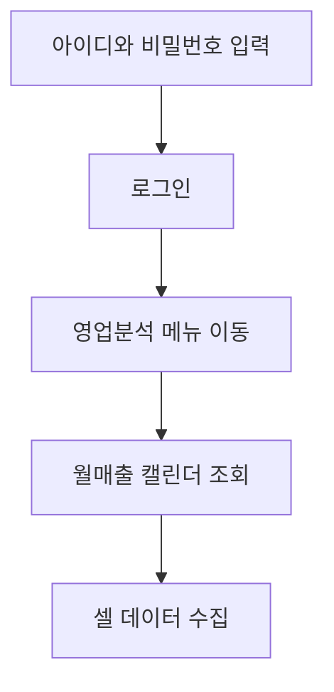
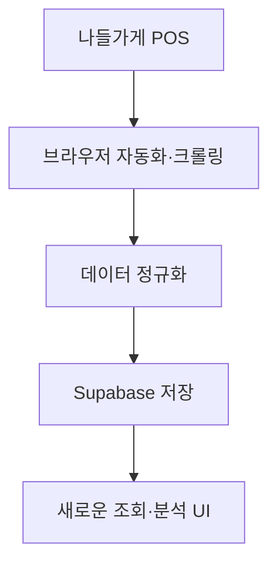

# {{ $frontmatter.title }} 관련

```component VPCard
{
  "title": "Supabase > Article(s)",
  "desc": "Article(s)",
  "link": "/programming/js-supabase/articles/README.md",
  "logo": "/images/ico-wind.svg",
  "background": "rgba(10,10,10,0.2)"
}
```

```component VPCard
{
  "title": "LLM > Article(s)",
  "desc": "Article(s)",
  "link": "/ai/llm/articles/README.md",
  "logo": "/images/ico-wind.svg",
  "background": "rgba(10,10,10,0.2)"
}
```

[[toc]]

---

<SiteInfo
  name="23년 동안 살아남은 동네슈퍼를 데이터로 분석해봤습니다"
  desc="부모님 가게의 15년 치 매출 데이터를 디지털로 복원했습니다. API가 없는 낡은 POS라 웹 크롤러를 직접 만들어 데이터를 추출하고 구조화했죠. 단순히 AI를 도입하는 게 아니라, 현장의 맥락을 파악하고 정보를 빠르게 이해할 수 있는 대시보드를 만드는 것부터 시작했습니다. 숨어있던 데이터를 실질적인 의사결정 도구로 바꾸는 과정, 이것이 제가 고민하는 진짜 AX(AI 전환)의 첫걸음입니다."
  url="https://yozm.wishket.com/magazine/detail/3883/"
  logo="https://yozm.wishket.com/favicon.ico"
  preview="https://yozm.wishket.com/media/news/3883/image1.png"/>

저희 부모님은 23년째 동네 슈퍼마켓을 운영하고 계십니다. 그 덕에 저는 어릴 때부터 아버지를 따라 세무서, 회계사무소, 구청, 물류도매센터를 다니며, 유통과 장사의 뒷면을 지켜볼 수 있었습니다. 제조사·대리점·영업사원 사이에 얽힌 인센티브 구조, 같은 규정도 담당자에 따라 다르게 해석되던 행정 처리, 작은 창고 하나에서 시작해 공장까지 세운 납품업체의 성장 과정까지, 그 모든 장면이 결국 하나의 시스템이었다는 걸 시간이 지나 깨닫게 됐습니다.

이런 경험은 중학생 때 직접 사업자등록을 내고 작은 온라인 판매를 해본 것으로 이어졌는데요. 지금은 해군 복무 중 LLM, RAG, 온톨로지를 공부하며 "이 기술을 어디에 써야 할까"라는 질문에 도달했습니다. 그리고 그 답을 가장 가까운 현장, 부모님 가게에서 찾아보기로 했습니다.

이번 글에서는 부모님이 운영하고 계신 나들가게 POS 데이터를 실제로 들여다보는 과정을 정리했습니다. 거창한 AI 대시보드가 아니라, 데이터를 정리하고 기본 지표(일별·시간대별 매출, 상품별 판매량, 객단가)를 뽑아보는 것부터 시작했는데요. 최근 화제가 된 클로드(Claude)의 페이블 5를 사용해보게 됐습니다.


페이블 5는 앤트로픽이 장시간 이어지는 복잡한 코딩과 에이전트 작업을 위해 내놓은 상위 모델입니다. 한동안 접근이 제한됐다가 한시적으로 다시 사용할 수 있게 됐습니다(2026년 7월 12일까지). 일상적인 개발에서는 다시 오푸스(Opus)를 주로 쓰게 될 가능성이 커서, 사용할 수 있을 때 제대로 한번 써보고 싶었습니다.

써본 소감은 아주 단순했습니다. **확실히 프런티어 모델은 알잘딱깔센을 잘했습니다.**

제가 모든 버튼과 간격, 상태 처리 방식을 하나하나 지시하지 않아도 됐습니다. 모델이 기존 코드와 화면을 확인하고, 원하는 방향을 어느 정도 추론한 뒤 결과물을 만들어냈습니다. 물론 모델이 제품의 방향까지 대신 결정해준 것은 아닙니다.

어떤 데이터를 남길 것인지, 과거 데이터와 현재 데이터를 어떻게 구분할 것인지, 무엇을 가장 먼저 보여줄 것인지, 이 서비스가 결국 어떤 의사결정을 도와야 하는지는 여전히 제가 판단해야 했습니다.

부모님은 23년 동안 동네 슈퍼마켓을 운영하셨고, 저는 가게에 쌓인 데이터를 꺼내 단순한 매출표가 아니라, 실제 운영자가 더 나은 결정을 내릴 수 있는 시스템을 만들어보고 싶었습니다. POS 데이터와 상품, 시간대, 거래처, 결제수단, 재고, 날씨, 상권을 연결하고, 나중에는 온톨로지와 LLM을 활용해 숫자 너머의 맥락까지 보고 싶었죠. 그런데 프로젝트를 실제로 시작하면서 가장 먼저 알게 된 것이 있습니다.

*AI를 붙이는 것보다 먼저 해야 할 일이 있었습니다. 바로 ‘데이터’부터 꺼내야 했습니다.*

---

## 엑셀도 API도 없다면, 브라우저가 대신 읽게 하자

처음에는 간단하게 생각했습니다. POS 사이트에서 조회한 자료를 엑셀로 내려받고, 파이썬(Python)이나 판다스(Pandas)로 정리하면 되지 않을까?

하지만 실제로 확인해보니 엑셀 추출이 되지 않았습니다. 화면에서는 월매출, 일별 거래건수, 객단가, 현금매출과 카드매출 같은 데이터를 볼 수 있었습니다. 다만 그 데이터를 분석 가능한 파일로 내려받는 기능은 사실상 쓸 수 없었습니다.

API 문서도 찾을 수 없었습니다. 결국 선택지는 하나였습니다. 사람이 화면에서 읽을 수 있다면, 브라우저가 대신 읽게 해보자.

::: note

나들가게 POS는 생각보다 오래된 시스템이었습니다.

:::

정확한 최초 개발일을 공개 문서만으로 확정하기는 어려웠습니다. 다만 실제 관리 화면 하단에는 Copyright © 2009가 표시되어 있었고, 2010년에는 이미 점주들을 대상으로 나들가게 POS 교육이 진행되고 있었습니다. 적어도 현재 화면의 계보가 2000년대 말에서 2010년대 초반에 만들어진 시스템이라는 것은 확인할 수 있었습니다.

공식 안내를 보면 나들가게 POS는 판매와 반품뿐 아니라 상품관리, 재고관리, 영업관리, 정산과 마감까지 다루는 시스템입니다. 별도의 경영분석시스템도 POS 판매기록을 바탕으로 매출과 이익, 방문객 수, 일·월 영업실적 등을 보여주도록 설계되어 있습니다.

데이터가 없었던 것은 아니었습니다. 오히려 필요한 데이터는 이미 상당 부분 존재했습니다. 문제는 그 데이터가 오래된 웹 화면 안에 흩어져 있고, 외부에서 쉽게 사용할 수 있는 형태로 열려 있지 않았다는 점이었습니다.

기존 화면은 오래된 GWT(Google Web Toolkit) 기반 웹 애플리케이션 형태였고, 메뉴와 프레임, 조회 결과가 여러 단계로 나뉘어 있었습니다.


그래서 클로드(Claude)와 코덱스(Codex)를 활용해 HTML 구조와 프레임을 하나씩 확인하고, 로그인부터 메뉴 이동, 조회, 테이블 파싱까지 브라우저가 자동으로 수행하게 만들었습니다.



첫 번째 목표는 이것뿐이었습니다. 그리고 결국 월매출 캘린더의 데이터를 가져오는 데 성공했습니다.


처음 데이터를 가져오는 데 약 40초가 걸렸습니다.

---

## 40초를 5초로 줄이기까지

처음에는 성공했다는 사실만으로도 만족했습니다. 그런데 새로고침을 한 번 할 때마다 40초 가까이 기다려야 했습니다. 테스트 한 번은 괜찮았지만, 실제 서비스라면 쓸 수 없는 속도였습니다. 로그를 나눠서 확인해보니 사이트가 원래 느린 것 외에도, AI가 만든 크롤러 안에 불필요한 낭비가 꽤 많았습니다.


<!-- TODO: 테이블 변형 -->

가장 큰 문제는 이중 로그인이었습니다. 한 번 로그인한 뒤 바로 메뉴를 클릭하면 되는데, 캘린더 주소로 직접 접근하면서 로그인 페이지로 되돌아가고 있었습니다. 그 결과 로그인과 GWT 초기화가 두 번씩 발생했습니다.

셀을 읽는 방식도 비효율적이었습니다. 화면에 있는 약 400개의 셀을 하나씩 파이썬으로 가져오면서 브라우저와 수백 번 통신하고 있었습니다. 이를 frame.evaluate 한 번으로 모든 셀의 텍스트를 묶어서 가져오는 방식으로 바꿨습니다.

스크린샷과 HTML 저장도 실패했을 때나 디버깅이 필요할 때만 실행하도록 바꿨습니다. 브라우저와 로그인 세션은 계속 살려뒀습니다. 새로고침을 누르면 다시 로그인하는 대신 이미 열린 세션에서 조회 버튼만 누르고 데이터를 읽도록 했습니다. 세션이 만료된 경우에만 자동으로 초기화하고 한 번 다시 시도하게 했습니다.

마지막으로 배경 예열을 추가했습니다. 서비스가 시작되면 데이터를 미리 가져오고, 기본 10분마다 다시 갱신해 캐시를 채우도록 했습니다.

그 결과 속도는 다음과 같이 줄었습니다.

- 캐시된 일반 접속: 거의 즉시
- 수동 새로고침: 약 5초
- 최초 배포 후 콜드 스타트: 약 15초
- 기존 방식: 약 40초
- 그런데 속도를 줄이고 나니 또 다른 문제가 보였습니다.

---

## 바뀌지 않는 데이터를 왜 매번 다시 조회해야 할까?

2012년 1월 매출을 조회한다고 가정해보겠습니다. 처음 조회할 때 오래 걸리는 것은 어느 정도 이해할 수 있습니다. 하지만 같은 달의 데이터를 며칠 뒤 다시 보고 싶을 때도, 또 오래된 POS에 로그인하고 또 같은 화면을 불러오고 또 같은 데이터를 크롤링해야 했습니다. 이상했습니다. 2012년 1월 매출은 더 이상 바뀌지 않습니다. 지난달 데이터도 마감이 끝났다면 바뀔 가능성이 거의 없습니다.

그런데 왜 볼 때마다 원본 POS를 다시 조회해야 할까? 그래서 데이터 구조를 바꾸기로 했습니다. 과거 데이터는 한 번 가져오면 데이터베이스에 저장하고, 현재 진행 중인 달만 다시 조회하는 방식입니다.

Supabase에 `monthly_sales`, `daily_sales` 등의 테이블을 만들었습니다. 월별 총매출, 거래건수, 객단가, 일평균 매출, 반품 건수와 금액, 수집 시각, 월 마감 여부를 저장했습니다. 현재 달은 계속 변하므로 새로고침할 때 POS에서 다시 가져옵니다.

반면, 이미 끝난 달은 Supabase에서 즉시 읽습니다.



기존 POS는 여전히 원천 시스템입니다. 제가 만든 서비스는 운영 데이터를 수정하지 않고, 그것을 가져와 조회와 분석에 적합한 형태로 저장하는 새로운 읽기 계층입니다. 그리고 2011년 7월, 부모님 가게에 POS가 처음 도입된 시점부터 월별 데이터를 순차적으로 가져와 저장했습니다.

가게 자체의 역사는 23년이지만, 디지털로 남은 매출의 역사는 약 15년입니다.


이제 2012년 1월을 보든, 2018년 6월을 보든 매번 오래된 POS를 다시 기다릴 필요가 없습니다. 한 번 가져온 과거 데이터는 데이터베이스에서 바로 불러옵니다. 이 결정 하나로 서비스의 성격이 바뀌었습니다. 이전에는 오래된 POS 화면을 대신 열어주는 크롤러였다면, 이제는 매장의 역사를 자체적으로 보관하고 조회하는 서비스가 됐습니다.

---

## 조회할 수 있는 화면에서 이해할 수 있는 화면으로

데이터를 가져온 뒤에는 화면도 다시 만들었습니다. 기존 POS에도 필요한 숫자는 있었습니다. 문제는 정보가 너무 많은 표와 메뉴 안에 흩어져 있다는 점이었습니다. 월매출을 보려면 월매출 캘린더를 열어야 하고, 날짜를 누르면 오른쪽에 세부 결제수단이 나옵니다. 지난달과 비교하려면 다른 화면을 열어야 하고, 월별 흐름을 보려면 숫자를 직접 기억하거나 옮겨 적어야 했습니다.

기존 화면이 틀렸다는 의미는 아닙니다. 당시의 업무 환경에서는 많은 기능을 한 화면에 제공하는 것이 중요했을 것입니다. 하지만 제가 만들고 싶은 서비스의 목적은 달랐습니다. “조회할 수 있는 화면”보다 “빠르게 이해할 수 있는 화면”이 필요했습니다.

그래서 토스증권의 정보 구조를 참고했습니다. 토스증권은 모든 숫자를 한꺼번에 보여주기보다, 사용자가 현재 가장 궁금해할 정보부터 위계를 만들어 보여줍니다. 제가 만든 화면도 같은 원칙으로 다시 구성했습니다.

상단에는 이번 달 총매출을 가장 크게 배치했습니다. 바로 아래에는 전월 대비 변화, 거래건수, 객단가, 일평균 매출, 최고 매출일을 두었습니다. 그다음에는 일별 매출 그래프와 최근 6개월·12개월 흐름을 배치했습니다. 아래에는 현금매출, 카드매출, 포인트매출 등 결제수단의 구성을 정리했습니다.

현재 진행 중인 달은 완료된 달과 구분해 진행 중 상태로 표시했습니다. 아직 끝나지 않은 달을 전월과 단순 비교하면, 큰 폭으로 하락한 것처럼 오해할 수 있기 때문입니다.


단순히 색상을 바꾸고 카드 형태로 만든 것은 아닙니다. 사용자가 숫자를 이해하는 순서를 다시 설계했습니다.

- 지금 매출이 얼마인가?
- 지난달보다 올랐는가?
- 거래건수와 객단가 중 무엇이 변했는가?
- 어느 날 매출이 높았는가?
- 최근 흐름은 상승인가 하락인가?
- 어떤 결제수단으로 매출이 발생했는가?

기존 POS의 메뉴와 표를 그대로 복사하지 않고, 사용자의 질문을 기준으로 정보를 다시 배열했습니다.

---

## 동네슈퍼에서 해본 아주 작은 차세대 프로젝트

만들고 보니 아주 작은 ‘차세대 프로젝트’ 같았습니다. IT 업계에서 차세대 프로젝트라는 말을 자주 사용합니다. 오래된 ERP나 업무 시스템을 새로운 데이터 구조와 화면, 인프라로 다시 만드는 프로젝트를 의미합니다.

제가 한 일이 기업 단위의 거대한 차세대 프로젝트와 같다고 말할 수는 없습니다. 하지만 구조는 꽤 닮아 있었습니다.

- 오래된 시스템은 원천 시스템으로 유지하고
- 필요한 데이터를 새롭게 수집하고
- 새로운 데이터베이스에 표준화해 저장하고
- 조회 성능을 개선하고
- 현대적인 사용자 경험으로 재구성했습니다.

작은 동네 슈퍼마켓을 대상으로 한 아주 작은 레거시 현대화 프로젝트였던 셈입니다.

---

## 코드를 쓰는 비용이 낮아지면 무엇이 남을까?

이 작업을 하면서 기존에 ERP, MES(제조실행시스템), 관리자 대시보드를 구축해온 업체들의 해자가 예전보다 많이 낮아질 수 있겠다는 생각도 들었습니다. 과거에는 오래된 시스템을 분석하고, 별도의 데이터베이스와 화면을 만들고, 자동화 코드를 작성하려면 상당한 개발 인력과 비용이 필요했습니다.

지금은 클로드 코드(Claude Code)나 코덱스 같은 도구를 쓸 수 있습니다. 기존 HTML을 분석하고, 크롤러를 만들고, 데이터베이스 스키마를 설계하고, 프런트엔드를 구현하는 데 드는 비용과 시간이 크게 줄었습니다.

물론 모든 해자가 사라지는 것은 아닙니다. 실제 현장을 이해하고, 데이터의 의미를 정의하고, 기존 시스템과 안정적으로 연결하고, 장애와 예외를 관리하는 역량은 여전히 중요합니다.

오히려 코드를 작성하는 비용이 낮아질수록 이런 판단 역량이 더 중요해질 것 같습니다. “어떻게 개발할 것인가”보다, **“무엇을 왜 만들어야 하는가”**가 더 큰 차이가 되는 것입니다.

---

## 15년치 데이터가 보여준 변화

**2011년의 데이터를 열어보니, 매출표가 아니라 시간의 기록처럼 보였습니다.**처음에는 월별 숫자를 저장하는 것만 생각했습니다. 그런데 2011년과 2012년 데이터를 실제로 조회해보니 예상보다 훨씬 많은 질문이 생겼습니다.

2012년 1월의 객단가는 5,566원이었습니다. 최근에는 대체로 9,000원 안팎까지 올라와 있습니다.


2012년에는 현금매출이 압도적으로 많았고, 카드매출의 비중은 훨씬 작았습니다.


지금은 반대입니다. 카드와 각종 전자결제가 매출의 대부분을 차지합니다. 한 가게의 데이터 안에 한국 사회의 결제 방식 변화가 그대로 남아 있었습니다. 객단가가 5,000원대에서 9,000원대로 오른 것도 흥미로웠습니다. 물론 이것을 단순히 “물가가 올랐기 때문”이라고 단정할 수는 없습니다.

상품 가격의 상승도 영향을 줬겠지만, 상품 구성과 고객층, 한 번에 구매하는 물품 수, 주변 경쟁점, 소비 습관도 함께 바뀌었을 수 있습니다. 그렇기 때문에 오히려 다른 데이터를 연결할 필요가 생깁니다.

- 소비자물가지수
- 품목별 가격 변화
- 날씨와 기온
- 공휴일과 요일
- 지역 지원금 지급 시기
- 주변 편의점과 대형마트의 개업일
- 인근 상권 변화
- 가게의 가격과 진열 변경

2020년, 재난지원금이 지급된 뒤 매출이 눈에 띄게 올랐던 시기가 있었습니다. 주변에 편의점이 생긴 뒤 매출이 크게 떨어졌던 기억도 있습니다. 지금까지는 부모님의 기억으로만 남아 있던 사건입니다. 하지만 15년치 월별·일별 데이터를 확보하면 실제 변화가 발생한 날짜를 찾을 수 있습니다. 지원금 지급 전후로 거래건수와 객단가가 어떻게 변했는지, 편의점 개점 이후 어떤 품목과 시간대의 매출이 먼저 떨어졌는지 확인할 수 있습니다.

이때부터 데이터는 단순한 매출표가 아니라, 현장의 사건과 연결되는 기록이 됩니다.

---

## 숫자만으로는 보이지 않는 현장의 구조

숫자만 많다고 현장을 이해하는 것은 아닙니다. 기존의 회귀분석이나 머신러닝으로도 매출과 날씨, 요일, 가격 사이의 상관관계를 찾을 수 있습니다. 하지만 숫자만 놓고 보면 그 사이에 숨어 있는 현장의 구조를 놓치기 쉽습니다.

예를 들어, 편의점이 생긴 뒤 매출이 떨어졌다고 해도, 모든 상품이 똑같이 영향을 받은 것은 아닐 것입니다. 편의점이 강한 담배, 음료, 간편식이 먼저 영향을 받았을 수 있습니다. 반대로 대용량 생필품이나 동네 단골이 외상으로 구매하던 상품은 영향을 덜 받았을 수도 있습니다.

정책지원금이 풀린 뒤 매출이 올랐다고 해도, 단순히 손님이 많아진 것인지, 기존 고객의 객단가가 올라간 것인지, 특정 상품군에만 소비가 집중된 것인지 나눠봐야 합니다.

숫자만 보면 매출 상승입니다. 현장의 구조를 연결하면 다음처럼 바뀝니다.

**정책지원금 지급**

- 특정 결제수단 사용 증가
- 기존 고객의 객단가 상승
- 생필품과 고단가 상품 판매 증가
- 월매출 증가

또는 다음과 같을 수도 있습니다.

**인근 편의점 개점**

- 야간·출근시간 고객 이동
- 담배·음료 거래건수 감소
- 전체 고객수 감소
- 월매출 하락

---

## 온톨로지로 담고 싶은 세 계층

제가 온톨로지에 관심을 갖는 이유도 여기에 있습니다. 온톨로지는 단순히 그래프를 멋지게 그리는 기술이 아닙니다. 상품과 카테고리, 거래처, 결제수단, 시간, 날씨, 정책, 경쟁점, 매장의 의사결정을 서로 연결해 현장의 구조를 표현하는 방법입니다. 저는 앞으로 이 구조를 세 계층으로 만들고 싶습니다.

첫 번째는 매장의 기본 개체입니다.

> 상품, 카테고리, 거래처, 결제수단, 날짜, 시간대, 고객군

두 번째는 실제 발생한 사건입니다.

> 판매, 반품, 가격 변경, 지원금 지급, 경쟁점 개점, 비와 폭염

세 번째는 가게의 의사결정입니다.

> 무엇을 더 발주할지, 가격을 바꿀지, 어디에 진열할지, 어떤 상품을 묶어 팔지

이 세 계층이 연결돼야 단순히 “무슨 일이 있었는가”를 넘어서 “왜 그랬고, 다음에는 무엇을 바꿀 것인가”에 답할 수 있다고 생각합니다.

---

## 조직에 맞는 AX는 무엇부터 구조화해야 할까?

이 프로젝트를 하면서 AX에 대해서도 다시 생각하게 됐습니다. 최근 많은 기업과 조직이 AX를 이야기합니다. 문서를 요약하고, 사내 자료를 검색하고, 회의록을 정리하는 AI를 도입합니다.

이런 기능도 분명히 유용합니다. 하지만 단건의 문서 요약이나 검색만으로 조직이 AI 네이티브로 바뀌었다고 보기는 어렵습니다.

진짜 조직에 맞는 AX를 하려면, 그 조직이 실제로 어떻게 판단하고 움직이는지를 먼저 구조화해야 한다고 생각합니다.

- 어떤 단계로 업무가 진행되는가
- 누가 어떤 시점에 판단하는가
- 어떤 데이터와 규정을 참고하는가
- 정상적인 경우와 예외적인 경우는 무엇인가
- 문서에는 없지만 구성원들이 당연하게 여기는 가정은 무엇인가
- 의사결정 결과가 다음 단계에 어떤 영향을 미치는가
- 이런 암묵지와 의사결정 구조가 워크플로에 담겨 있어야 합니다.

LLM은 학습 과정에서 역전파를 통해 방대한 언어 패턴을 익히고, 실제 생성 과정에서는 주어진 문맥을 바탕으로 다음 토큰의 확률 분포를 계산해 결과를 만듭니다. 이 방식은 매우 강력하지만, 조직 고유의 맥락이 없으면 자연스럽게 일반적이고 평균적인 답변으로 흐를 수 있습니다. 다음 토큰 예측은 현대 언어모델의 핵심 학습·생성 구조지만, 그것만으로 특정 조직의 규칙과 예외, 책임 구조가 자동으로 생기는 것은 아닙니다.


그래서 AI에 문서만 많이 넣는다고 우리 조직에 맞는 AI가 만들어지는 것은 아닙니다. 우리 조직의 개체와 관계, 이벤트, 규칙, 예외, 의사결정 단계를 먼저 정리해야 합니다. 그 위에서 AI가 워크플로를 따라 움직여야 합니다.

조직이 AI의 방식에 맞추는 것이 아니라, AI가 조직의 실제 구조를 이해하고 따라가게 만들어야 합니다. 동네 슈퍼마켓 프로젝트는 아주 작은 사례지만 본질은 비슷합니다. 단순히 POS 매출표를 LLM에 넣고 “인사이트를 알려줘”라고 하면 그럴듯한 말은 만들 수 있습니다.

하지만 왜 특정 상품을 계속 취급했는지, 거래처와 어떤 조건으로 거래했는지, 편의점이 언제 들어왔는지, 특정 정책이 어떤 고객에게 영향을 줬는지는 알기 어렵습니다. 이런 맥락을 모르면 현장에 맞는 판단을 내릴 수 없습니다.

결국 AI보다 먼저 필요한 것은 조직과 현장의 구조입니다.

---

## 아직 이 프로젝트에 AI가 없다

아직 이 프로젝트에는 AI가 거의 없습니다. 현재까지 가져온 데이터는 나들가게 POS의 월매출 캘린더 정보가 중심입니다.

지금 볼 수 있는 것은 다음 정도입니다.

- 월별 총매출
- 월별 거래건수
- 객단가
- 일평균 매출
- 일별 매출
- 현금매출
- 카드매출
- 포인트매출
- 최근 6개월과 12개월 흐름

아직 상품별 판매 데이터도 충분히 가져오지 못했습니다. 카드사별 매출, 카테고리별 매출과 이익, 거래처별 상품, 재고와 발주 데이터도 추가해야 합니다. 그래프 데이터베이스도 없습니다. 온톨로지도 아직 만들지 않았습니다. LLM에 자연어로 질문하는 기능도 없습니다.

그렇지만 저는 지금 단계가 중요하다고 생각합니다. AI를 붙이기 위한 가장 기본적인 토대를 만들었기 때문입니다. 데이터가 어디에 있는지 확인했고, 사람이 화면을 열지 않아도 자동으로 가져올 수 있게 만들었습니다. 변하지 않는 과거 데이터를 데이터베이스에 쌓았고, 사용자가 빠르게 이해할 수 있는 화면으로 다시 구성했습니다.

앞으로는 여기에 하나씩 데이터를 붙여갈 생각입니다. 먼저 상품별 매출과 이익, 카테고리와 거래처 데이터를 가져옵니다. 그다음 날씨와 공휴일, 물가, 상권, 정책 데이터를 연결합니다. 이후 상품, 거래처, 시간, 외부 사건, 운영 의사결정을 그래프와 온톨로지로 구조화합니다.

마지막에 LLM을 붙이려고 합니다. LLM이 숫자를 직접 계산하고 근거 없이 판단하게 하려는 것은 아닙니다. 구조화된 데이터와 규칙, 과거 실험 결과를 바탕으로 설명하고 다음 행동을 제안하게 만들고 싶습니다.

AI는 마지막입니다. 먼저 현장을 담아야 합니다.

---

## 마치며

이번 단계에서 제가 한 일은, 어쩌면 데이터를 구출한 것에 가깝습니다. 가게에는 이미 15년치 디지털 기록이 있었습니다. 하지만 그 데이터는 오래된 POS 화면을 한 달씩 넘겨보지 않으면 볼 수 없었습니다.

한 번 본 과거 데이터를 다시 보기 위해 또 로그인하고, 또 기다리고, 또 조회해야 했습니다. 저는 그 데이터를 꺼내 데이터베이스에 쌓고, 다시 빠르게 볼 수 있는 화면을 만들었습니다. 아직 이 시스템은 제가 최종적으로 만들고 싶은 의사결정 도구가 아닙니다.

지금은 토대에 가깝습니다. 하지만 이제 최소한 2011년의 가게와 2026년의 가게를 같은 화면에서 비교할 수 있습니다. 현금 중심의 매장이 카드 중심의 매장으로 바뀐 과정도 볼 수 있습니다. 객단가가 5,000원대에서 9,000원대로 이동한 과정도, 부모님의 기억 속에 있던 사건을 실제 날짜와 숫자로 다시 확인하는 일도 가능합니다.

1편에서는 이런 질문을 했습니다. 부모님 가게는 어떻게 23년 동안 망하지 않고 살아남았을까? 아직 답을 찾지는 못했습니다. 다만 이제 그 질문에 답할 수 있는 데이터를 처음으로 한곳에 모으기 시작했습니다. 그리고 다음 단계에서는 단순히 매출이 오르고 내린 것을 보는 것을 넘어, 어떤 상품과 거래처, 어떤 시간대와 외부 사건이 그 변화에 영향을 줬는지 연결해보려고 합니다.

데이터가 없었던 것이 아니었습니다. 오래된 화면 안에 갇혀 있었을 뿐입니다.

이번에는 그 데이터를 꺼냈습니다. 이제부터는 그 데이터에 현장의 맥락을 연결해 보려고 합니다.

::: info 원문

<SiteInfo
  name="23년 동안 살아남은 동네슈퍼를 데이터로 분석해보려 합니다. (2편)"
  desc="한동안 블로그에 글을 올리지 못했습니다. 현재 저는 군에서 복무하고 있습니다. 전역한 뒤에는 가능한 한 빨리 PM, PO, AI-native, AX와 관련된 현업에 들어가 실제 제품을 만들고, 조직이 일하는 방식을 경험해보고 싶습니다. 그 마음이 생각보다 꽤 간절해"
  url="https://velog.io/@minority_report/23년-동안-살아남은-동네슈퍼를-데이터로-분석해보려-합니다.-2편/"
  logo="https://static.velog.io/favicons/favicon-16x16.png"
  preview="https://velog.velcdn.com/images/minority_report/post/b61ec61f-008c-4cae-8a81-05588b77bd27/image.png"/>

:::

<!-- TODO: add ARTICLE CARD -->
```component VPCard
{
  "title": "23년 동안 살아남은 동네슈퍼를 데이터로 분석해봤습니다",
  "desc": "부모님 가게의 15년 치 매출 데이터를 디지털로 복원했습니다. API가 없는 낡은 POS라 웹 크롤러를 직접 만들어 데이터를 추출하고 구조화했죠. 단순히 AI를 도입하는 게 아니라, 현장의 맥락을 파악하고 정보를 빠르게 이해할 수 있는 대시보드를 만드는 것부터 시작했습니다. 숨어있던 데이터를 실질적인 의사결정 도구로 바꾸는 과정, 이것이 제가 고민하는 진짜 AX(AI 전환)의 첫걸음입니다.",
  "link": "https://chanhi2000.github.io/bookshelf/yozm.wishket.com/3883.html",
  "logo": "https://yozm.wishket.com/favicon.ico",
  "background": "rgba(84,7,224,0.2)"
}
```
