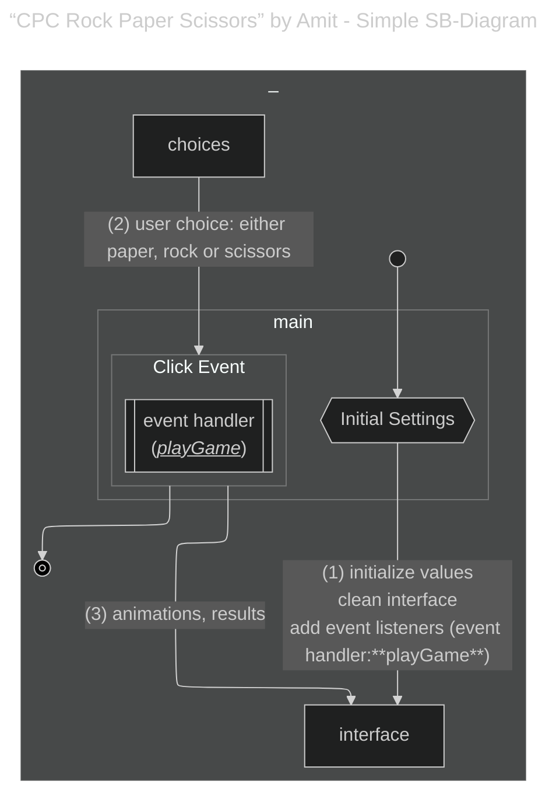
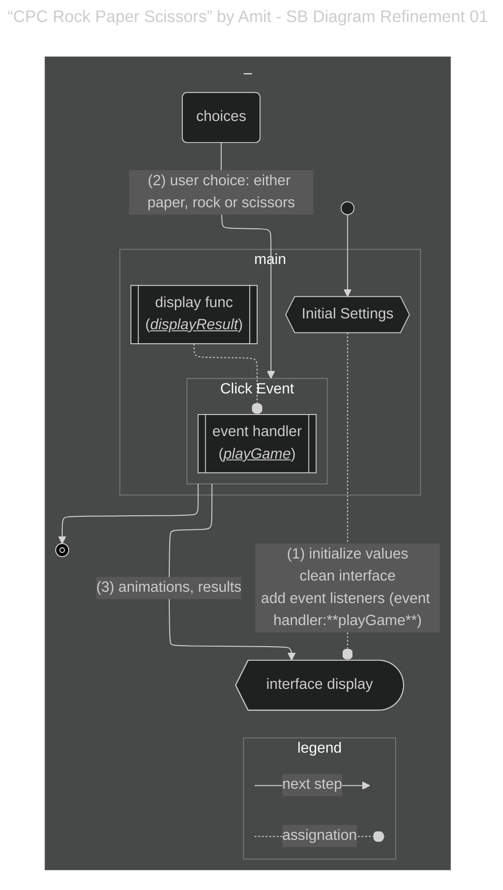
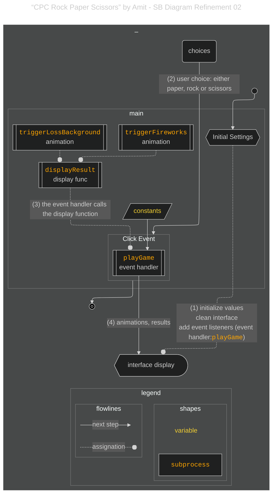
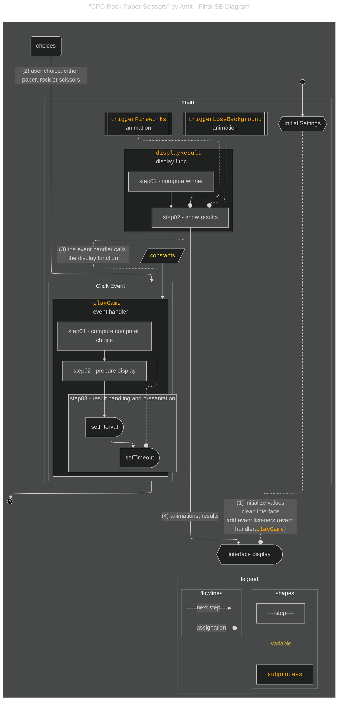

# {{ $frontmatter.title }} 관련

```component VPCard
{
  "title": "How to Become an Analytical Programmer - Solve the “Rock, Paper, Scissors” Game 5 Ways Using JavaScript & Mermaid.js",
  "desc": "Over the past year, I’ve explored tools and practices that help developers build an analytical mindset. One recurring theme is how experienced programmers often describe understanding code as forming a mental picture - a conceptual map of the program...",
  "link": "/freecodecamp.org/how-to-become-an-analytical-programmer-compare-five-projects/README.md",
  "logo": "https://cdn.freecodecamp.org/universal/favicons/favicon.ico",
  "background": "rgba(10,10,35,0.2)"
}
```

[[toc]]

---

<SiteInfo
  name="How to Become an Analytical Programmer - Solve the “Rock, Paper, Scissors” Game 5 Ways Using JavaScript & Mermaid.js"
  desc="Over the past year, I’ve explored tools and practices that help developers build an analytical mindset. One recurring theme is how experienced programmers often describe understanding code as forming a mental picture - a conceptual map of the program..."
  url="https://freecodecamp.org/news/how-to-become-an-analytical-programmer-compare-five-projects#heading-1-cpc-rock-paper-scissors-by-amit-a-project-with-fireworks-animations"
  logo="https://cdn.freecodecamp.org/universal/favicons/favicon.ico"
  preview="https://cdn.hashnode.com/res/hashnode/image/upload/v1746812725602/cd4a5bc4-71f2-4678-8f5d-5571d9cc38e8.png"/>

<CodePen
  user="ghaste"
  slug-hash="XWLxQEw"
  title="CPC Rock Paper Scissors"
  :default-tab="['css','result']"
  :theme="$isDarkmode ? 'dark': 'light'"/>

Amit is a prolific CodePen user who has been uploading about 2-3 projects per week since as early as 2021. Their most recent projects (year 2025) have increased in complexity and quality while maintaining the high productivity rate.

But in Sept 2024, Amit made a simple (JavaScript) version of the Rock, Paper, Scissors game. This code is a lightweight, user-friendly implementation with fun visual elements like result display, animations, and visual feedback for wins and losses.

Key features of this project are:

- It provides a complete Rock, Paper, Scissors game with a visual spinning effect when the computer is selecting its choice.
- The game has animated fireworks to celebrate wins and changes the background color to red for losses.
- The game keeps the interface interactive and fun through the use of emoji, quick animations, and visual feedback for the player’s performance.

---

## Analysis of the Project

### Quickly discovering of the start and end of the workflow

The code of this pen runs immediately once it’s called. Several variables are initialized (the `animationContainer`, the `choices`, the `emojiMap`, and so on).

Amit also made three separate functions for each item (that is, “rock”, “paper” and “scissors”). Each of them will be added as a **click event** to the interface (the HTML) and they all run the same function after clicking (`playGame`) each with a different argument based on what the user clicked.

After the interface is cleared, some variables are initialized, and the click event is added to the different emoji. The interface will wait for click interactions from the user, which will trigger the `playGame` function.

Let’s make a quick diagram showing this high level of generalization:




<!-- TODO: 내용 비교 후 이미지 삭제 -->


### The `playGame` Event Handler

Let’s take a closer look at the `playGame` function:

```js
function playGame(playerChoice) {
  const computerChoice = choices[Math.floor(Math.random() * choices.length)];
  const animationDiv = document.getElementById("animation");
  const resultDiv = document.getElementById("result");

  clearInterval(animationInterval);
  let currentIndex = 0;

  animationInterval = setInterval(() => {
    animationDiv.textContent = emojiMap[choices[currentIndex]];
    currentIndex = (currentIndex + 1) % choices.length;
  }, 100);

  setTimeout(() => {
    clearInterval(animationInterval);
    animationDiv.textContent = emojiMap[computerChoice];
    displayResult(playerChoice, computerChoice);
  }, 1500);
}
```

It seems that there is a lot going on only in this function that could be assumed as separated functionalities. Although not explicit, there are different sections in it:

- one dedicated to calculating the computer’s choice
- then a `setInterval` to handle an animation
- then a `setTimeout` to clear the previous animation and run the `displayResult` function

### Refinement

The first functionality operation that’s easy to identify within the whole code, and that could be set apart, is the one in charge of displaying the results: the `displayResult` func.

But we need to clarify the relationships in our diagram. The `displayResult` function is not coming after the event handler but is called from the event handler itself. We could argue that the event handler *uses* the `displayResult` function. Let’s clarify these definitions on the diagram, and also add a legend:




<!-- TODO: 내용 비교 후 이미지 삭제 -->


Similarly, the `displayResult` function uses two functions dedicated to the animations: `triggerFireworks` and `triggerLossBackground`. All the functions are declared on the *main scope*.




<!-- TODO: 내용 비교 후 이미지 삭제 -->


### Imperative Programming

This code is very much imperative. Here’s a definition of imperative programming from Wikipedia:

> Imperative programming focuses on describing *how* a program operates step by step (generally order of the steps being determined in source code by the placement of statements one below the other), rather than on high-level descriptions of its expected results

Finding that the project follows an imperative paradigm is helpful as it provides some general idea of what we can expect in terms of how the code is organized and the type of logic we might use. We can expect that the computation logic will follow a certain workflow.

### Finalizing the diagram

Now that we have uncovered the most explicit modules and their relationships, we can work on identifying sections of the code that might be considered separated functional/operational units. These separate units can be defined as “use cases” and will become the steps of the workflow.

As a way of enhancing the diagram, I have differentiated between steps and process blocks to prevent confusion between “modules” and “cases”.




<!-- TODO: 내용 비교 후 이미지 삭제 -->


Let’s summarize what’s happening here:

- In this project, a function acting as an event handler contains most of the project logic and it assumes full execution responsibility over some of the steps of the workflow.
- Once the event handler is triggered, the choice of the user is passed to it and the same function calculates the choice of the computer.
- That calculation is followed by part of the preparation of the interface, then an animation managed by an `Interval` - followed by a nested `Timeout` JavaScript method.
- The Timeout method has the `displayResult` function as a callback function. This function will take the responsibility of the remaining steps.
- It is inside the `displayResult` where the calculation of the winner takes place. The same function controls the rest of the display of results with different displays delegated to two other functions based on who wins the game.
