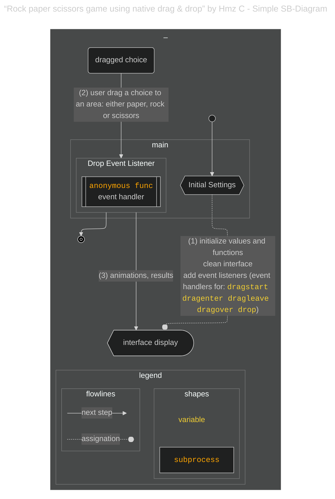
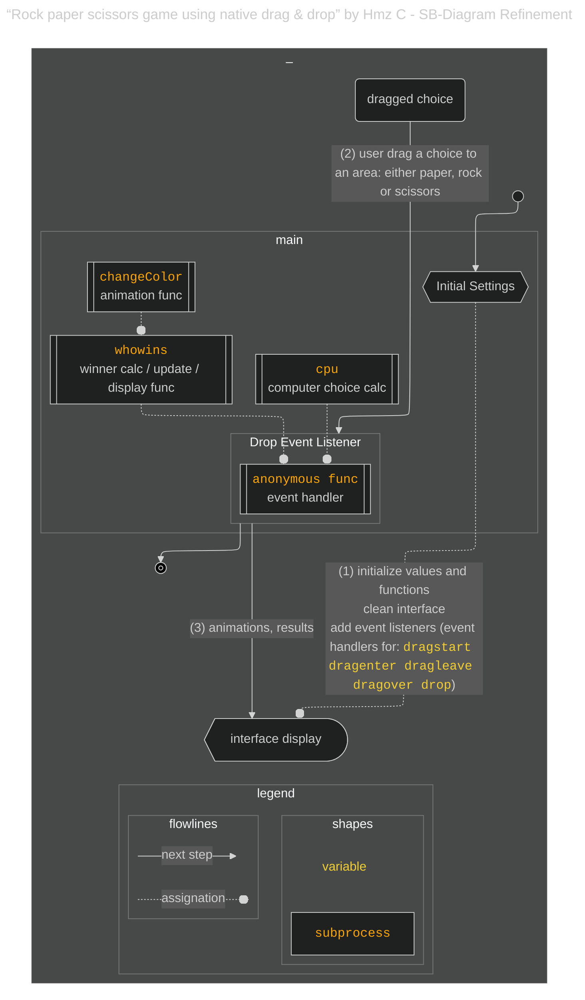
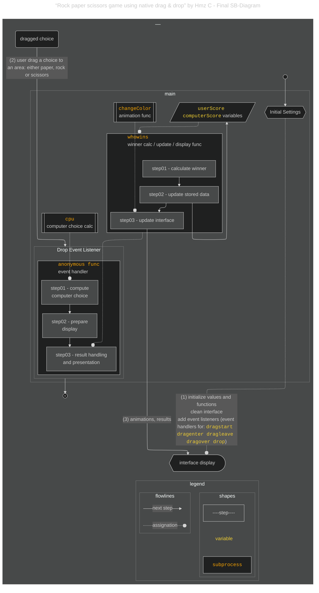

# {{ $frontmatter.title }} 관련

```component VPCard
{
  "title": "How to Become an Analytical Programmer – Solve the “Rock, Paper, Scissors” Game 5 Ways Using JavaScript & Mermaid.js",
  "desc": "Over the past year, I’ve explored tools and practices that help developers build an analytical mindset. One recurring theme is how experienced programmers often describe understanding code as forming a mental picture – a conceptual map of the program...",
  "link": "/freecodecamp.org/how-to-become-an-analytical-programmer-compare-five-projects/README.md",
  "logo": "https://cdn.freecodecamp.org/universal/favicons/favicon.ico",
  "background": "rgba(10,10,35,0.2)"
}
```

[[toc]]

---

<SiteInfo
  name="How to Become an Analytical Programmer – Solve the “Rock, Paper, Scissors” Game 5 Ways Using JavaScript & Mermaid.js"
  desc="Over the past year, I’ve explored tools and practices that help developers build an analytical mindset. One recurring theme is how experienced programmers often describe understanding code as forming a mental picture – a conceptual map of the program..."
  url="https://freecodecamp.org/news/how-to-become-an-analytical-programmer-compare-five-projects#heading-2-rock-paper-scissors-game-using-native-drag-drop-by-hmz-c-a-project-using-the-html-drag-element"
  logo="https://cdn.freecodecamp.org/universal/favicons/favicon.ico"
  preview="https://cdn.hashnode.com/res/hashnode/image/upload/v1746812725602/cd4a5bc4-71f2-4678-8f5d-5571d9cc38e8.png"/>

Hmz C has not been so active as Amit, with just 7 projects in CodePen across 10 years since 2014. The pen we are going to analyze is his very first contribution to CodePen. The project appears to be a demo of the [<FontIcon icon="fa-brands fa-firefox"/>HTML Drag and Drop API](https://developer.mozilla.org/en-US/docs/Web/API/HTML_Drag_and_Drop_API) that came with HTML5 by the time of its release. The game provides a clean and interactive experience of "Rock, Paper, Scissors" using intuitive drag-and-drop gestures, visual effects, and live score updates. It focuses on user experience and interactivity.

Key features of this project are:

- The drag and drop interaction, with simple but clean animations.
- The scoring is central to this application. Both user and computer scores are updated and displayed in real-time.
- The game provides a very clean, easy-to-understand interface without looking static.

---

## Analysis of the Project

### Quickly discovering of the start and end of the workflow

By inspecting the code, you will be able to realize that this code follows a similar general pattern as the code we previously examined:

- Variables and states are initialized immediately when the project is accessed.
- Similarly, an event handler is added to elements in the interface, but this time they won’t respond to click events but to **drag and drop** events.
- That event handler is the one that starts and coordinates the workflow.
- The workflow ends by showing results on the interface.

Given the similarities between this project and the previous at this level of analysis, I reused the script I created for the previous chart and modified it accordingly.




<!-- TODO: 내용 비교 후 이미지 삭제 -->


### IIFE

This project is the only one that uses an IIFE (Immediately Invoked Function Expression) pattern to register the drag and drop listeners. It is inside that IIFE (`user`) where the **drop listener** is also declared.

```js
(function user() {
  for (var i = 0; i < hand.length; i++) {
    hand[i].ondragstart = dragStart;
  }

  function dragStart() {
    userChoice = this.getAttribute("data-hand");
  }

  userArea.addEventListener('dragenter', function(e) {
    e.preventDefault();
    this.style.borderColor = "red";
    user_icon.style.visibility = "hidden";
  });

  userArea.addEventListener('dragleave', function(e) {
    e.preventDefault();
    this.style.borderColor = "#dedede";
    user_icon.style.visibility = "initial";
  });

  userArea.addEventListener('dragover', function(e) {
    e.preventDefault();
  });

  userArea.addEventListener('drop', function(e) {
    e.preventDefault();
    computerChoice = cpu();
    user_icon.classList.remove("fa-spin");
    user_icon.className = "fa fa-hand-" + userChoice + "-o fa-2x fa-fw";
    computer_icon.className = "fa fa-hand-" + computerChoice + "-o fa-2x fa-fw";
    this.style.borderColor = "#dedede";
    user_icon.style.visibility = "initial";
    whowins(computerChoice, userChoice);
  });
})();
```

This project was completed before the release of ES6 in 2015. One of the uses of the pattern is to keep the variables and functions within the IIFE isolated from the global scope. Although the IIFE is still a valid syntax, in modern JavaScript most of the functional operations where the IIFE pattern is applicable can now be implemented with the use of special keywords, special operations, and standards.

### Refinement

Apart of the event handler, there are two other functions – the `cpu` function and the `whowins` function – that will take care of other aspects of the functionality. Those functions are declared in the global scope.




<!-- TODO: 내용 비교 후 이미지 삭제 -->


Now that we have an overview of how the declared functions are related, let’s identify the functional operations they are taking care of and have a better idea of the full workflow.

### Finalizing the diagram and comparison to previous project

After inspecting the code and making several iterations over the previous diagram, I came up with the following final result. Reusing parts of the script I made for the previous project helped me reduce the number of iterations.




<!-- TODO: 내용 비교 후 이미지 삭제 -->


Notice the strong similarities between this project and the previous one:

- The order of the steps
- The imperative code structure
- The event handler delegates the final steps to another function
- That function (`whowins`) executes the calculation of the winner
- That same function delegates the display of the results to a different function (`changeColor`)
- There is a preference for using functions and variables declared in the global scope

What is different in this project is:

- The event handler is declared as an anonymous callback function directly in the listener
- This event handler delegates the execution of the calculation of choice of the computer to a different function, the `cpu` function.
- There are no async functionalities in this project
- Different from the previous project, this one has a slightly more advanced **data handling**. Data were stored in global variables (`userScore`, `computerScore`) that are updated just after the calculation of the winner.
