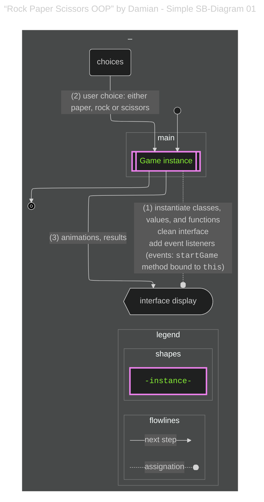
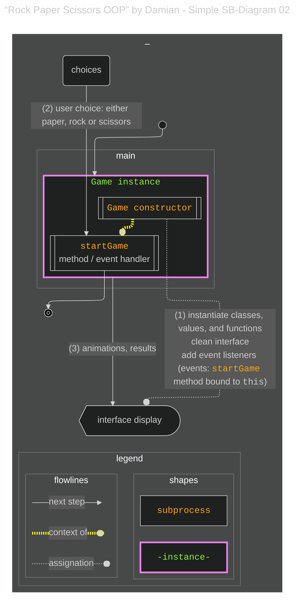
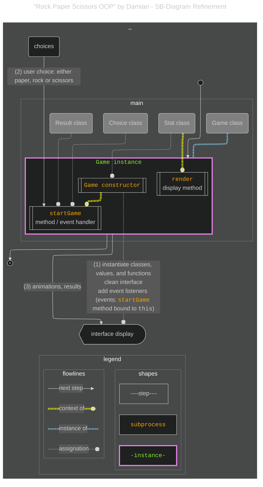

# {{ $frontmatter.title }} 관련

```component VPCard
{
  "title": "How to Become an Analytical Programmer – Solve the “Rock, Paper, Scissors” Game 5 Ways Using JavaScript & Mermaid.js",
  "desc": "Over the past year, I’ve explored tools and practices that help developers build an analytical mindset. One recurring theme is how experienced programmers often describe understanding code as forming a mental picture – a conceptual map of the program...",
  "link": "/freecodecamp.org/how-to-become-an-analytical-programmer-compare-five-projects/README.md",
  "logo": "https://cdn.freecodecamp.org/universal/favicons/favicon.ico",
  "background": "rgba(10,10,35,0.2)"
}
```

[[toc]]

---

<SiteInfo
  name="How to Become an Analytical Programmer – Solve the “Rock, Paper, Scissors” Game 5 Ways Using JavaScript & Mermaid.js"
  desc="Over the past year, I’ve explored tools and practices that help developers build an analytical mindset. One recurring theme is how experienced programmers often describe understanding code as forming a mental picture – a conceptual map of the program..."
  url="https://freecodecamp.org/news/how-to-become-an-analytical-programmer-compare-five-projects#heading-4-rock-paper-scissors-oop-by-damian-a-project-written-in-oop"
  logo="https://cdn.freecodecamp.org/universal/favicons/favicon.ico"
  preview="https://cdn.hashnode.com/res/hashnode/image/upload/v1746812725602/cd4a5bc4-71f2-4678-8f5d-5571d9cc38e8.png"/>

Damian has 3 projects on CodePen, all of them made in 2020. One of them is this game. The JavaScript code implements another variation of the "Rock, Paper, Scissors" game but with a more object-oriented approach using classes to manage the game logic, player choices, and statistics.

This is a well-organized, object-oriented version of the "Rock, Paper, Scissors" game with a clean separation of concerns (result calculation, player/computer choice, and game statistics). The use of animations and UI interactions enhances the user experience.

Key features of this project are:

- **Object-oriented design**: The code is structured into classes, making it modular, reusable, and easier to maintain.
- **Interactive UI**: It dynamically updates the player’s and computer’s choices using visual cues (CSS classes) and shows animations for draws.
- **Statistics**: The game tracks and updates the number of wins, draws, and losses, which are displayed in real-time.

---

## Analysis of the Project

### Quickly discovering the start and end of the workflow

This code seems more complex than what we’ve previously examined. But a closer look suggests certain resemblance to the previous ones, at least at a high level of generalization:

- Again, variables and states are initialized once the project is accessed.
- One of the variables that’s initialized when the project is accessed is an instance of a class, the `Game` class. The instance is called `newGame`.




<!-- TODO: 내용 비교 후 이미지 삭제 -->


Again, we can see aspects of this workflow that coincide with what we found in the previous projects – but this time those similarities are more difficult to capture. As in the previous code, the **controller pattern** is prevalent in this code, but instead of being associated with an anonymous function or a global one, it is now a **class’s module**.

The instantiation of the class runs the constructor which includes the immediate assignment of click event handlers into the interface (just as with the other projects). They use a module of the class, the `startGame` module, as a callback function.

The (syntactic) approach that Damian chose adds additional complexities to the code in terms of scope definition. You can spot some of the complexities by realizing the need to use the JavaScript `bind` method in order to keep the `this` context of the module function the same as the one of the instance when assigned to the event.

```js
class Game {
  constructor() {
    this.optionsImg = document.querySelectorAll('.img');
    this.optionsBtns = document.querySelectorAll('button');

    this.optionsBtns.forEach(option => option.addEventListener('click', 
                                                                this.startGame.bind(this) //see the bind here
                                                                )
                            )

    this.youWins = document.querySelector('.results > .you-win');
    this.draw = document.querySelector('.results > .draw');
    this.PcWins = document.querySelector('.results > .pc-win');

    this.stats = new Stats(0, 0, 0);

    this.render.call(this, this.stats.getStats());
  }
  ...
}
```

In order to represent that, I used a colored link, indicating that the game instance (through the constructor) is set to be the `this` context of the module.




<!-- TODO: 내용 비교 후 이미지 삭제 -->


### Refinement

By adding the evaluation of the classes, the flow diagram gets more detailed but also more complicated.

Damian defined 4 classes for this project: `Result`, which was just a static method, `Choice`, `Stats` and `Game`:

```js :collapsed-lines
class Result {
  static whoWin(yourChoice, PCchoice) {
    ...
  }
}

class Choice {
  constructor(yourChoice) {
    ...
  }

  getYourChoice = () => this.yourChoice;
  getPcChoice = () => this.PCchoice;

  drawPcChoice() {
    ...
  }
}

class Stats {
  constructor(wins, draws, loses) {
    ...
  }
  getStats = () => this.status;

  refreshStats(result) {
    ...
  }
}

class Game {
  constructor() {
    ...
  }

  startGame(e) {
    ...
  }

  render(stats) {
    ...
  }
}

const newGame = new Game();
```

The best way to keep the diagram simpler is not to detail all the steps of the functionalities. But since I’m mentioning instances, I also felt the urgency to relate those to the corresponding class. I did it using a different line type and color.




<!-- TODO: 내용 비교 후 이미지 삭제 -->


With the diagram above, I tried to highlight some exceptional aspects of the architecture of this code. At some point, a `Stats` class’s instance will be context for the `render` method of the `Game` class’s instance. I added connections between classes and the workflow to indicate that the classes were used on those steps of the workflow.

### OOP Encapsulation

One way to improve the SoC of your project is through encapsulation. **Encapsulation** is a concept usually related to OOP and it’s about keeping data and the methods that work with that data bundled in the same class.

This project shows efforts to achieve encapsulation:

The `Stats` instance it is the one that will store the data, and the methods are in accordance to its task:

```js
class Stats {
  constructor(wins, draws, loses) {
    this.status = {
      wins: wins,
      draws: draws,
      loses: loses,
    }
  }
  getStats = () => this.status;

  refreshStats(result) {
    switch (result) {
    case "win":
      this.status.wins++;
      break;
    case "draw":
      this.status.draws++;
      break;
    case "lose":
      this.status.loses++;
      break;
    }
  }
}
```

The `Choice` instance will be dedicated to the calculation of the choices, and so it contains methods that respond to that task:

```js
class Choice {
  constructor(yourChoice) {
    this.yourChoice = yourChoice;
    this.PCchoice = this.drawPcChoice();
  }

  getYourChoice = () => this.yourChoice;
  getPcChoice = () => this.PCchoice;

  drawPcChoice() {
    const options = ["rock", "paper", "scissors"];
    return options[Math.floor(Math.random() * options.length)];
  }
}
```

### Finalizing the diagram and comparison to previous projects

For the final diagram of the project, I wanted to:

- Emphasize the importance of the **methods** in the classes by mentioning them in their corresponding class, and
- Indicate the apparent importance of the `Stats` instance in the workflow.

Here the final diagram of this project:

```mermaid :collapsed-lines title=""
---
title: “Rock Paper Scissors OOP” by Damian - Final SB-Diagram
config:
    theme: dark
    layout: "elk"
    flowchart:
        nodeSpacing: 50
        rankSpacing: 50
---
flowchart TD
subgraph _
subgraph main
    subgraph gameInst[<code>Game instance</code>]
        subgraph gameConstrt["<code style="color:orange;">Game constructor</code>"]
            init@{shape: hex, label: "Initial Settings"} --> statInst@{shape: fr-rect, label: "<code>Stat instance</code>"}
        end
        subgraph eventHandler["<code style="color:orange;">startGame</code><br/>method / event handler"]
            step01[step01 - animation] --> step02[step02 - calculate computer choice]
            step02 --> step03[step03 - prepare display]
            step03 --> step04[step04 - calculate winner and update data]
            step04 --> step05[step05 - show result]
        end
        gameConstrt -.-o eventHandler
        statInst -.-o |"use calc'd winner to update <code style='color:#f1ce32'>status</code> running <code style="color:orange;">refreshStats</code>"| step04
        render@{shape: fr-rect, label: "<code style="color:orange;">render</code>\ndisplay method"}
    end
    classGame@{shape: rounded, label: "Game class<br/>---------------"} -.- gameInst
    classStat@{shape: rounded, label: "Stat class<br/>-----------------------<br/>+status (obj / data)<br/>-----------------------<br/>+refreshStats()<br/>+getStats(result)"} -.- statInst
    classResult@{shape: rounded, label: "Result class<br/>--------------------------<br/>+<u>whoWin(yourCh, pcCh)</u>"} -.-o |"use Result <code style='color:orange'>static method</code> to calculate winner"| step04
    classChoice@{shape: rounded, label: "Choice class<br/>--------------------<br/>+yourCh, pcCh<br/>--------------------<br/>+getYourChoice()<br/>+getPcChoice()<br/>+drawChoice()"} -.-o |use <code style="color:#87f134;">Choice instance</code> to draw PC choice| step02
    statInst -.-o render
    render -.-o |"take Stat's <code style='color:#f1ce32'>status</code> and show <code style='color:#f1ce32'>yourCh</code> / <code style='color:#f1ce32'>pcCh</code><br/>last score"| step05
end
gameConstrt -.-o |"(1) instantiate classes, values, and functions<br>clean interface<br>add event listeners (events: <code style="color:orange;">startGame</code> method bound to <code>this</code>)"|interface
eventHandler --> stop@{shape: framed-circle}
start@{shape: start} --> init
choices@{shape: rounded} --> |"(2) user choice: either paper, rock or scissors"| eventHandler
eventHandler --> |"(3) animations, results"| interface@{shape: curv-trap, label: "interface display"}
subgraph legend
      direction LR
      subgraph flowlines
        start1[ ] -->|"next step"| stop1[ ]
        style start1 height:0px;
        style stop1 height:0px;
        start2[ ] -.-o|"assignation"| stop2[ ]
        style start2 height:0px;
        style stop2 height:0px;
        start3[ ] --o|"context of"| stop3[ ]
        linkStyle 20 stroke:yellow, stroke-width:5px
        style start3 height:0px;
        style stop3 height:0px;
        start4[ ] -.-|"instance of"| stop4[ ]
        linkStyle 21 stroke:skyblue, stroke-width:4px
        style start4 height:0px;
        style stop4 height:0px;
      end
      subgraph shapes
      variable["variable"]
      style variable width:135px, fill:none, stroke:none, color:#f1ce32
      subprocess[<code style="color:orange;">subprocess</code>]
      instance[<code style="color:#87f134;">-instance-</code>]
      style instance stroke:violet, stroke-width: 3px;
      stepLegend["----step----"]
      style stepLegend fill:#474949, stroke: #CCC, color:#CCC
      end
end
end
interface ~~~ legend

style start fill:black
style stop fill:black, fill-stroke:white
classDef isaclass fill:grey
class classGame,classChoice,classResult,classStat isaclass
classDef subProc fill:#1f2020, stroke: #CCC, color:#CCC
class eventHandler,gameConstrt subProc
classDef step fill:#474949, stroke: #CCC, color:#CCC
class init,step01,step02,step03,step04,step05 step
classDef inst fill:#1f2020, color:#87f134, stroke:violet, stroke-width: 3px
class statInst,gameInst inst
linkStyle 5,11 stroke:yellow, stroke-width: 5px
linkStyle 7,8 stroke:skyblue, stroke-width:4px
```




<!-- TODO: 내용 비교 후 이미지 삭제 -->


What makes this code similar to the previous ones is the following:

- The order of the steps is very similar
- A initial step is taken to set variables to initial stages and register an event handler function to the corresponding click events
- This project is also imperative in its design

This project shares more similarities to the project by Brad Traversy.

- The design of the event handler is closer to a controller pattern
- Therefore, modularity and SoC seem to be concepts that guided the design.
- The processing of the operations are organized according to procedural programming.

That’s where the similarities stop.

The initialization of the game is through the instantiation of a class:

```js
const newGame = new Game();
```

Different to all the previous projects, the event handler / controller is now a method of the instantiated class. The method is then registered as event handler of the click events right from the constructor when the class is instantiated.

- Modularity occurs through calling methods of instantiated classes, instead of (globally declared) functions.
- By using the OOP paradigm, this project shows a higher level of SoC by adding encapsulation.
- There are special cases in this code where it was required to bind to the appropriate this context. Examples are the binding of the `Game` class methods.
