# {{ $frontmatter.title }} 관련

```component VPCard
{
  "title": "How to Become an Analytical Programmer – Solve the “Rock, Paper, Scissors” Game 5 Ways Using JavaScript & Mermaid.js",
  "desc": "Over the past year, I’ve explored tools and practices that help developers build an analytical mindset. One recurring theme is how experienced programmers often describe understanding code as forming a mental picture – a conceptual map of the program...",
  "link": "/freecodecamp.org/how-to-become-an-analytical-programmer-compare-five-projects/README.md",
  "logo": "https://cdn.freecodecamp.org/universal/favicons/favicon.ico",
  "background": "rgba(10,10,35,0.2)"
}
```

[[toc]]

---

<SiteInfo
  name="How to Become an Analytical Programmer – Solve the “Rock, Paper, Scissors” Game 5 Ways Using JavaScript & Mermaid.js"
  desc="Over the past year, I’ve explored tools and practices that help developers build an analytical mindset. One recurring theme is how experienced programmers often describe understanding code as forming a mental picture – a conceptual map of the program..."
  url="https://freecodecamp.org/news/how-to-become-an-analytical-programmer-compare-five-projects#heading-5-recurrent-neural-network-rock-paper-scissors-by-andrew-worcerster-a-project-implementing-ai"
  logo="https://cdn.freecodecamp.org/universal/favicons/favicon.ico"
  preview="https://cdn.hashnode.com/res/hashnode/image/upload/v1746812725602/cd4a5bc4-71f2-4678-8f5d-5571d9cc38e8.png"/>

Andrew Worcester hasn’t been a regular contributor to CodePen but has created about 50 projects since 2013. The project we are going to analyze was created in 2019, one year after the first release of <FontIcon icon="fa-brands fa-js"/>`brain.js`.

This code implements a more advanced version of the "Rock, Paper, Scissors" game, which uses neural networks (via the <FontIcon icon="fa-brands fa-js"/>`brain.js` library) to predict the player’s next move and even simulate emotions for the computer opponent based on its win/loss patterns.

This code creates an engaging, AI-driven version of "Rock, Paper, Scissors" with advanced features like move prediction and emotional simulation using neural networks.

Key features of this project are:

- **Neural Network for prediction**: a model to predict the player’s next move based on their move history creates an adaptive gameplay experience, where the CPU adjusts its strategy.
- **Emotion simulation**: another model simulating emotions based on the game results (win/loss history), and it displays appropriate emojis like `😫`, `😊`, and so on, next to its moves.
- **Interactive UI**: The game uses DOM manipulation to display the player’s move, the CPU’s move, the result, and the CPU’s emotional state after each round.
- **Dynamic scoring**: Both player and CPU scores are updated and displayed after each round.

---

## Analysis of the Project

### Quickly discovering of the start and end of the workflow

At a high level of generalization, this code follows the same pattern as the other projects, although the complexity of the functionalities has grown:

- Again, variables and states are initialized once the project is accessed.
- Apart from that, an event handler of the click event is assigned carrying an anonymous function as a callback function. The **contoller pattern** seems to reappear in this project too.

```mermaid
---
title: “Recurrent Neural Network – Rock, Paper, Scissors” by A. Worcerster - Simple SB-Diagram
config:
    theme: dark
    layout: "elk"
    flowchart:
        nodeSpacing: 50
        rankSpacing: 50
---
flowchart TD
subgraph _
subgraph main
init
subgraph clickEventListener["Click Event (<code>forEach</code> on <code style="color:#f1ce32">options</code>)"]
    eventHandler@{shape: fr-rect, label: "<code style="color:orange">anonymous func</code><br/>event handler"}
end
end
init --> |"(1) initialize values (dummies for <code style="color:#f1ce32">cpuNextMove data</code>) and functions (functions: brain.recurrent.LSTM <code style="color:orange">net</code> brain.NeuralNetwork <code style="color:orange">emoNet</code>, <code style="color:orange">calcNextMove</code>)<br>clean interface<br>add event listeners (event handlers: <code style="color:orange">anoymous function</code>)"|interface
clickEventListener --> stop@{shape: framed-circle}
start@{shape: start} --> init@{shape: hex, label: "Initial Settings"}
choices --> |"(2) user choice: either paper, rock or scissors"| clickEventListener
clickEventListener --> |"(3) animations, results"| interface
end
style start fill:black
style stop fill:black, fill-stroke:white
```




<!-- TODO: 내용 비교 후 이미지 삭제 -->


A key difference from previous projects is the **training of the neural network operations**. Some of those functionalities are initialized to a initial state even before the user clicks.

### Refinement

If we still keep a high level of generalization, we can see that several of the responsibilities of the workflow will be taken by functions and even operations outside the event handler.

The project has several <FontIcon icon="fa-brands fa-js"/>`brain.js` functionalities in place. The most evident ones are:

- The LSTM (Long Short Term Memory), which it is a neural network designed to capture associations and patterns that are separated in time or place - and it is the one associated with the prediction of the user’s next move.
- A default feed-forward neural network of just one layer, designed to compare immediate patterns, and it is the one associated with the simulation of the emotions.

The LSTM is used by another function, `calcNextMove`, to provide an immediate result even before the user interacts with the click event: a value for the `cpuNextMove` variable.

`cpuNextMove` is indeed the **calculation of the computer’s choice** and it occurs *before* the user clicks, starting with a default value based on fake data.

```mermaid
---
title: “Recurrent Neural Network – Rock, Paper, Scissors” by A. Worcerster - SB-Diagram Refinement 01
config:
    theme: dark
    layout: "elk"
    flowchart:
        nodeSpacing: 50
        rankSpacing: 50
---
flowchart TD
subgraph _
subgraph main
init
constvar@{shape: lean-r, label: "<span style="color:#f1ce32">constants and variables</span>"} -.-o clickEventListener
LSTM@{shape: fr-rect, label: "<code style="color:orange">net</code><br/>LSTM"} -.-o calcNextMove
calcNextMove@{shape: fr-rect, label: "<code style="color:orange">calcNextMove</code><br/>computer choice"} --> cpuNextMove@{shape: lean-r, label: "<code style="color:#f1ce32">cpuNextMove</code>"}
NN@{shape: fr-rect, label: "<code style="color:orange">emoNet</code><br/>NN"} -.-o clickEventListener
cpuNextMove -.-o clickEventListener
subgraph clickEventListener["Click Event<br/>(<code style="font-size:13px">forEach</code> on <code style="color:#f1ce32">options</code>)"]
    eventHandler@{shape: fr-rect, label: "<code style="color:orange">anonymous func</code><br/>event handler"}
end
end
init --> |"(1) initialize values (dummies for <code style="color:#f1ce32">cpuNextMove data</code>) and functions (functions: brain.recurrent.LSTM <code style="color:orange">net</code> brain.NeuralNetwork <code style="color:orange">emoNet</code>, <code style="color:orange">calcNextMove</code>)<br>clean interface<br>add event listeners (event handlers: <code style="color:orange">anoymous function</code>)"|interface
clickEventListener --> stop@{shape: framed-circle}
start@{shape: start} --> init@{shape: hex, label: "Initial Settings"}
choices --> |"(2) user choice: either paper, rock or scissors"| clickEventListener
clickEventListener --> |"(3) animations, results"| interface

subgraph legend
      direction LR
      subgraph flowlines
        start1[ ] -->|"next step"| stop1[ ]
        style start1 height:0px;
        style stop1 height:0px;
        start2[ ] -.-o|"assignation"| stop2[ ]
        style start2 height:0px;
        style stop2 height:0px;
      end
      subgraph shapes
      variable["variable"]
      style variable width:135px, fill:none, stroke:none, color:#f1ce32
      subprocess[<code style="color:orange;">subprocess</code>]
      instance[<code style="color:#87f134;">-instance-</code>]
      style instance stroke:violet, stroke-width: 3px;
      end
end
end
interface ~~~ legend

style start fill:black
style stop fill:black, fill-stroke:white
classDef inst fill:#1f2020, color:#87f134, stroke:violet, stroke-width: 3px
class NN,LSTM inst
```




<!-- TODO: 내용 비교 후 이미지 삭제 -->


### Further Refinement

This project has some complexities not seen in previous projects, so I will try to go through it slowly. Let’s first see another level of refinement where the steps are shown:

```mermaid
---
title: “Recurrent Neural Network – Rock, Paper, Scissors” by A. Worcerster - SB-Diagram Refinement 02
config:
    theme: dark
    layout: "elk"
    flowchart:
        nodeSpacing: 50
        rankSpacing: 50
---
flowchart TD
subgraph _
subgraph main
init
constvar@{shape: lean-r, label: "<span style="color:#f1ce32">constants and variables</span>"} -.-o clickEventListener
step05 --> data@{shape: lean-r, label: "<code style="color:#f1ce32">data</code>"}
data -.-o calcNextMove
subgraph step00["stepInit - calculate computer choice"]
    calcNextMove@{shape: fr-rect, label: "<code style="color:orange">calcNextMove</code><br/>computer choice"} --> cpuNextMove@{shape: lean-r, label: "<code style="color:#f1ce32">cpuNextMove</code>"}
    LSTM@{shape: fr-rect, label: "<code style="color:orange">net</code><br/>LSTM instance"} -.-o calcNextMove
    cpuNextMove -.-o Dout((A))
    cpuNextMove -.-o Eout((B))
end
NN@{shape: fr-rect, label: "<code style="color:orange">emoNet</code><br/>NN"} -.-o step03
subgraph clickEventListener["Click Event<br/>(<code style="font-size:13px">forEach</code> on <code style="color:#f1ce32">options</code>)"]
    subgraph eventHandler["<code style="color:orange">anonymous func</code><br/>event handler"]
        step01["step01 - prepare a scoring table for that option"] --> step02["step02 - calculate winner"]
        step02 --> step03["step03 - calculate cpu emotion"]
        step03 --> step04["step04 - result handling and presentation: Winner"]
        step04 --> step05["step05 - update data"]
        step05 --> step06["step06 - recalculate winner and prepare display"]
        step06 --> step07["step07 - calc next move; result handling and presentation: Scores"]
        Din((A)) -.-o step02
        Ein((B)) -.-o step06    
    end
end
end
init --> |"(1) initialize values (dummies for <code style="color:#f1ce32">cpuNextMove data</code>) and functions (functions: brain.recurrent.LSTM <code style="color:orange">net</code> brain.NeuralNetwork <code style="color:orange">emoNet</code>, <code style="color:orange">calcNextMove</code>)<br>clean interface<br>add event listeners (event handlers: <code style="color:orange">anoymous function</code>)"|interface
clickEventListener --> stop@{shape: framed-circle}
start@{shape: start} --> init@{shape: hex, label: "Initial Settings"}
choices --> |"(2) user choice: either paper, rock or scissors"| clickEventListener
clickEventListener --> |"(3) animations, results"| interface

subgraph legend
      direction LR
      subgraph flowlines
        start1[ ] -->|"next step"| stop1[ ]
        style start1 height:0px;
        style stop1 height:0px;
        start2[ ] -.-o|"assignation"| stop2[ ]
        style start2 height:0px;
        style stop2 height:0px;
      end
      subgraph shapes
      variable["variable"]
      style variable width:135px, fill:none, stroke:none, color:#f1ce32
      subprocess[<code style="color:orange;">subprocess</code>]
      instance[<code style="color:#87f134;">-instance-</code>]
      style instance stroke:violet, stroke-width: 3px;
      end
end
end
interface ~~~ legend

style start fill:black
style stop fill:black, fill-stroke:white
classDef subProc fill:#1f2020, stroke: #CCC, color:#CCC
class eventHandler,gameConstrt subProc
classDef inst fill:#1f2020, color:#87f134, stroke:violet, stroke-width: 3px
class NN,LSTM inst
classDef step fill:#474949, stroke: #CCC, color:#CCC
class step00,step01,step02,step03,step04,step05,step06,step07 step
classDef connectorcpuNextMove fill:skyblue, color:black
class Dout,Din,Eout,Ein connectorcpuNextMove
```




<!-- TODO: 내용 비교 후 이미지 삭제 -->


We can see from the diagram that:

1. The `cpuNextMove` is pre-calculated, and so the calculation of the computer’s choice occurs *before* the user’s next click. I have referred to this step as “stepInit” to indicate that the first calculation occurs at initialization.
2. After the choice of the user is captured, its value and the value of `cpuNextMove` are eventually used to calculate the winner. The result is stored to keep the history of computer scoring.
3. The history of computer scoring is the input used for the calculation of the emotions using the `emoNet`.
4. The user’s choice is then used to create the next entry for data, which keeps the history of user scoring within the `data` in a dedicated format.
5. After calculating the winner and displaying the results, the project will use data to calculate the cpuNextMove *before* the user clicks again.

### Finalizing the diagram and comparison to previous projects

We could have finished with the previous diagram as it is largerly refined, but I wanted to practice another level of refinement to reveal the role of that the *data flow* has in this project. This resulted in a more complex diagram that those previously shown:


<!-- TODO: 내용 비교 후 이미지 삭제 -->


I think the use of the data in this project deserved additional explanation. In fact, it is not only the use of machine learning procedures that makes this project more complex – but also its associated use of more advanced data structures.

Here’s a selection of some possible values for some of the variables used to collect data at different points of the workflow:

```js
data structures:

"cpuNextMove: " "👊"

"cpuEmotions: " // [object Array] (4)
["😟","😨","😕","🤨"]

"data: " // [object Array] (3)
[// [object Array] (4)
["✌️","👊","✋","✌️"],// [object Array] (4)
["👊","✋","✌️","✌️"],// [object Array] (4)
["✋","✌️","✌️","✋"]]

"scoreValues: " // [object Object] 
{
  "✋": 0.3,
  "✌️": 1,
  "👊": 0
}

"cpuWinLoss: " // [object Array] (5)
[0.3,0.3,0.3,1,0]
```

The way `data` is made (an array of arrays) is a requirement for the LSTM algorithm in this particular case.

Also interesting is the use of the `scoreValues` object.

```js
const scoreValues = {
  [options[myMoveIdx]]: 0.3,         // tie
  [options[(myMoveIdx + 1) % 3]]: 1, // cpu wins
  [options[(myMoveIdx + 2) % 3]]: 0  // cpu loses
};
```

Notice how the user’s choice (`myMoveIdx`) is used to compute the different possible *computer’s choices* as key, with the values associated to each key being the potential result *for the computer* given that user’s choice. The values have the form of a “score”:

- 0 if the computer lost the match
- 0.3 if there was a tie
- 1 if the computer won the match

With this object, finding if the computer won, lost or drew consists in finding the value, or score, which key is equals to `cpuNextMove`. In other words, `scoreValues` is a template used to calculate the winner.

The computer’s score will be then saved in an array, `cpuWindLoss`:

```js
cpuWinLoss.push(scoreValues[cpuNextMove]);
```

Values of the `cpuWinLoss` array will be eventually used to calculate the emotions. `cpuEmotions` is an array of emotion predictions based on the last 4 CPU scores. The predictions are obtained from a “table of emotions” that was arbitrarily suggested by the author (the `emo` object).

Aspects of this project that we can relate to previous ones are:

- It is made using imperative programming.
- The existence of a event handler with poor modularity makes it more comparable to the way the event handler was designed in the less advanced projects, where the event handler took most of the responsibilities of the operations and the variables and utilities were declared at the global scope.
- At a high level of generalization, the essential steps of the game design stay the same:
  - a function (`calcNextMove`) calculates the computer’s choice.
  - another functionality (the operations around the emotion calculation) takes part in the realization of the “animation” associated with the corresponding display of the results.
  - An operation to calculate the winner is also present.
  - This project has also data handling logic, although much more advanced than previous projects

But how some of those steps are realized is very different in this project:

- The computer’s choice is based on the user’s scoring history, not a random function.
- The computer’s choice calculation occurs *before* the user clicks. While the calculation could have been done before user interaction in previous projects without affecting their outcomes (assuming the user wouldn’t have access to the value of the computer’s choice before playing), performing it at click time here might have caused performance issues due to its higher CPU demand compared to the simpler `Math.random`. Thus, performance likely influenced the design choices.
- The calculation of the winner is based not on a typical conditional control flow (`if-else`) or even a ternary operator, but rather obtained from a search across a customized data structure.
- Instead of using logic that generates feedback independently of previous results, this game uses a more advanced process that factors in both the computer’s move and recent game history to generate contextual UI feedback after each turn.
- The different implementations for the operations carried out by this project required different types of data structures with different levels of complexity, so data handling was more complex.

If you were able to follow the analysis specifically for this project and want to compare it to a similar project implementing the same game, check the [<FontIcon icon="fas fa-globe"/>example provided by brain.js team](https://rockpaperscissors-ai.vercel.app/). You might need to have a basic knowledge of Vue.js though.
