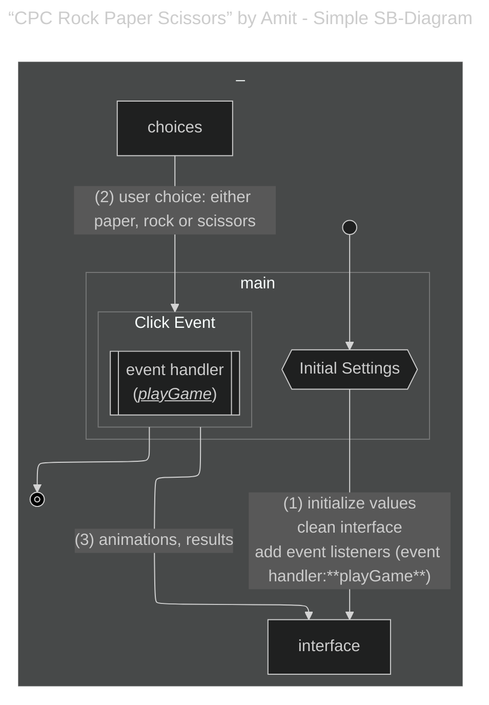
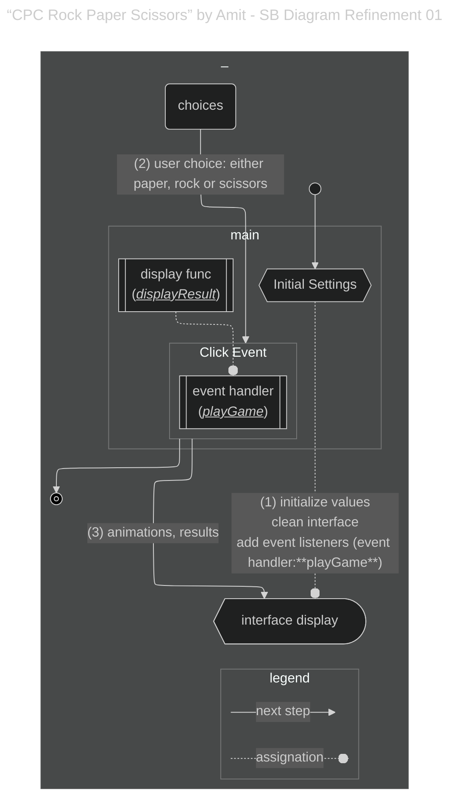
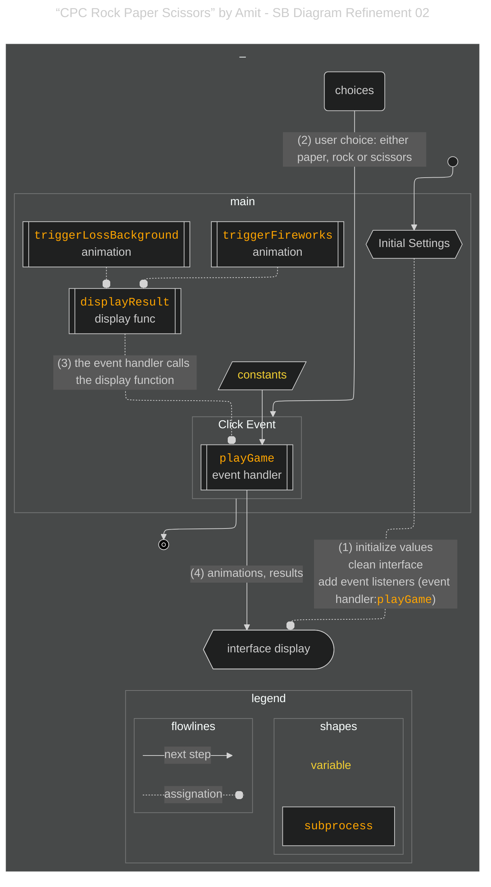
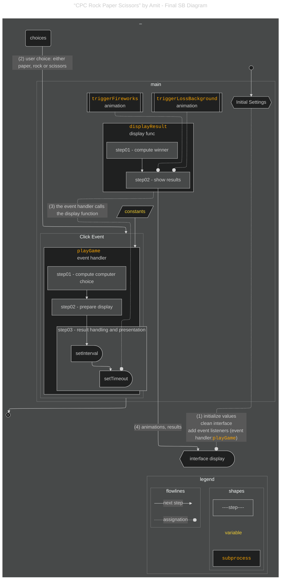
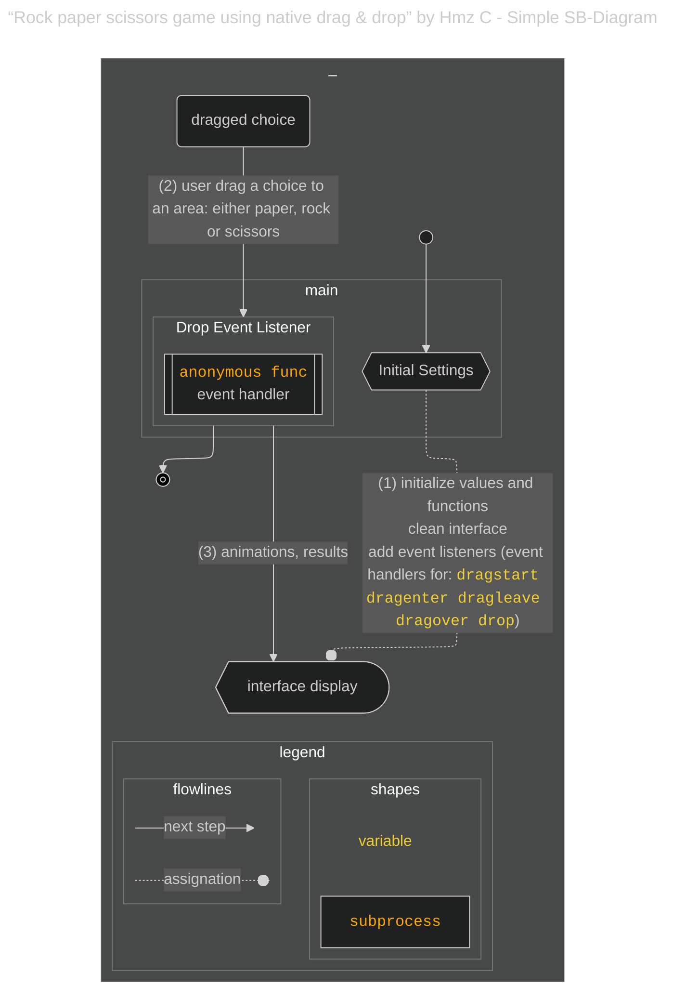
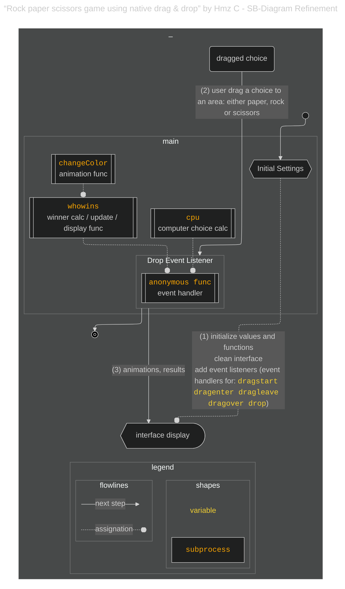
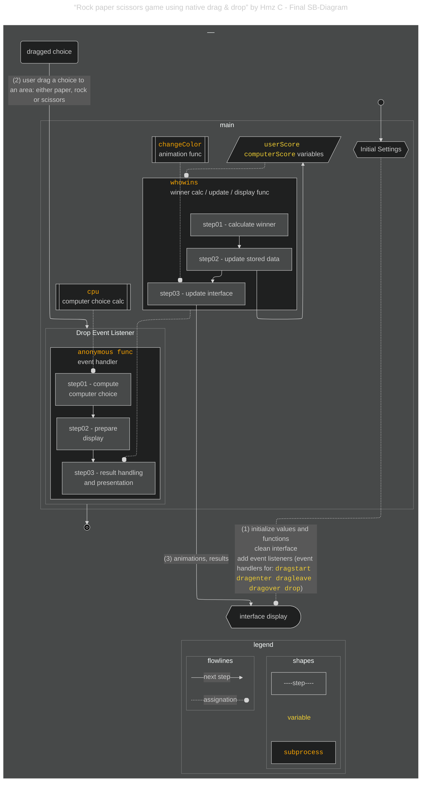
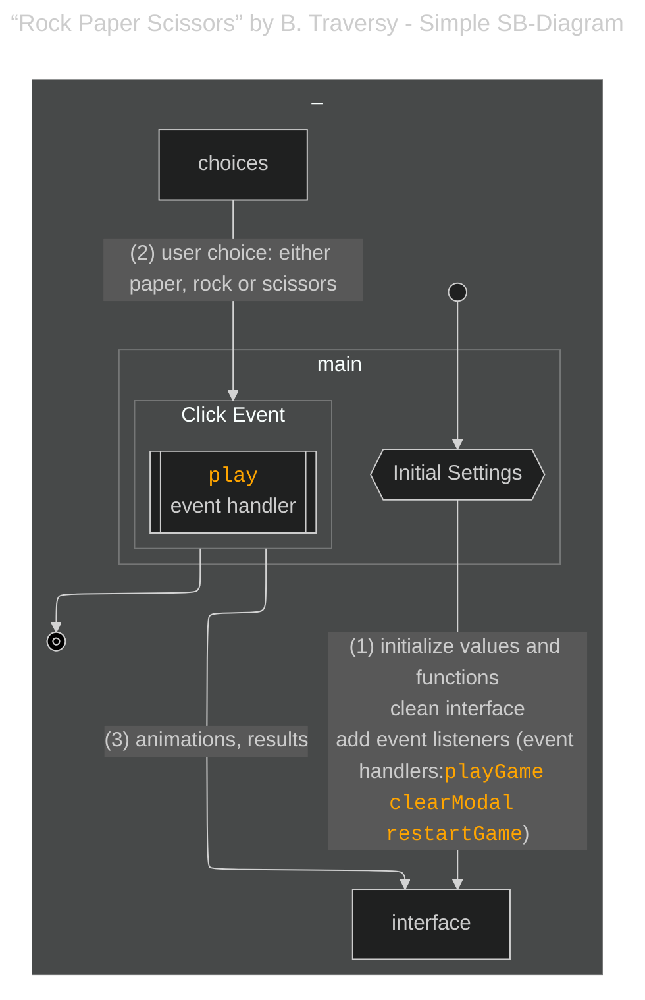
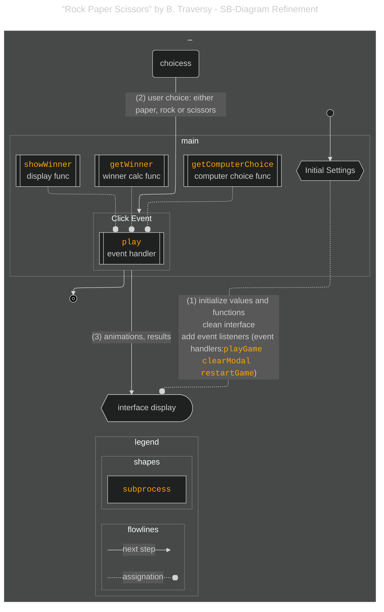
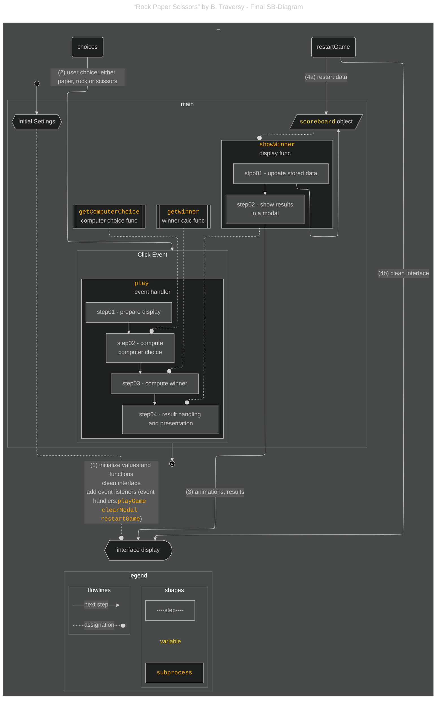

# {{ $frontmatter.title }} 관련

```component VPCard
{
  "title": "Mermaid.js > Article(s)",
  "desc": "Article(s)",
  "link": "/programmnig/js-mermaid/articles/README.md",
  "logo": "/images/ico-wind.svg",
  "background": "rgba(10,10,10,0.2)"
}
```

[[toc]]

---

<SiteInfo
  name="How to Become an Analytical Programmer – Solve the “Rock, Paper, Scissors” Game 5 Ways Using JavaScript & Mermaid.js"
  desc="Over the past year, I’ve explored tools and practices that help developers build an analytical mindset. One recurring theme is how experienced programmers often describe understanding code as forming a mental picture – a conceptual map of the program..."
  url="https://freecodecamp.org/news/how-to-become-an-analytical-programmer-compare-five-projects"
  logo="https://cdn.freecodecamp.org/universal/favicons/favicon.ico"
  preview="https://cdn.hashnode.com/res/hashnode/image/upload/v1746812725602/cd4a5bc4-71f2-4678-8f5d-5571d9cc38e8.png"/>

Over the past year, I’ve explored tools and practices that help developers build an analytical mindset. One recurring theme is how experienced programmers often describe understanding code as forming a mental picture – a conceptual map of the program’s flow.

When it comes to software development, finding ways to visualize these mental models is a common thread. Many developers describe sketching workflows or imagining them mentally to reason through code. And in my own experience working with senior developers and software architects, this visualization habit is extremely common.

A 2013 Quora post captures this well:

> “A top coder sees a program graphically (…) A data structure as a hierarchy of relationships, a program as a network of data pipes… The first and only time he reduces pictures to words is when he writes code.” —Rober Wagner

So it appears that developing our ability to recognize patterns in code could help us to develop our expertise. But programming is rarely that straightforward – there are often multiple ways to solve the same problem. It also reflects a developer’s personal habits, experiences, and styles. So which patterns matter, then?

Imagine you assign the same task to five developers: build a small game using HTML, CSS, and JavaScript. Each solution should follow the same functional rules. What are the chances their code will look the same?

You’d expect that their implementations might differ, but the underlying **mental workflow** – the internal logic they follow – might be remarkably similar. If you can reconstruct this mental flow from each codebase, you can create a shared referential point for comparison. Once this conceptual diagram is in place, you can “overlay” it on each codebase to identify where they diverge in structure, logic, or abstraction.

Ever since I started coding, spotting “patterns” while comparing other people’s code has fascinated me. I’ve found the process of comparing code not only educational but also enjoyable.

Up until now, I’ve approached it mostly by intuition – but I’ve always felt the need for a more structured method. This article explores a more systematic approach to code comparison, reflecting on what works well and what can be improved.

::: tip How to Read this Article

This article is intentionally extensive. Instead of just showing the end result, I’ll walk you through the methodology so you can recreate or adapt it for your own code comparisons.

That said, there are different ways you might approach this article, depending on your interests:

- **Just curious about the idea?** The core argument is already laid out in the introduction. Maybe read the conclusion too, and that might be enough for your needs.
- **Looking to improve your portfolio?** Skim through the analyses. If you're working on a game project, you’ll find comparisons of five JavaScript implementations of Rock, Paper, Scissors. These may give you practical ideas for your own code.
- **Interested in code analysis?** Read the whole thing. This article goes deeper into why analyzing code is valuable and presents a practical methodology – including tools – you can apply.

:::

---

## Visual Tools for Code Comparison

There are many tools and approaches for code analysis, and although there are more and more “automatic” ways of doing it, **flow diagrams** are still incredibly useful. Unfortunately, while they’re widely used in programming education and analysis, their use for comparing different implementations is rarely discussed or illustrated in tutorials.

Still, the potential is clear. Flow diagrams capture structure and logic in a compact, readable form. They're heavily used in compiler design for analyzing control flow, optimizing logic, and identifying bugs.

When applied to comparative analysis, they can highlight differences in:

- Modularity and abstraction
- Execution flow
- Separation of concerns or unnecessary complexity

But not all diagram types are equally effective for this purpose. Traditional flowcharts often dive too deep into the nitty-gritty, repeating low-level logic like if-else branches already visible in the source. While helpful for understanding a single script, they may obscure broader design patterns when comparing multiple implementations.

When comparing codebases, a better option is to focus on code structure: how functions, modules, and scopes relate and interact. For that, **system block diagrams** are a better fit.

### Why Use System Block Diagrams?

System block diagrams visualize a program at a higher level. They use labeled blocks to represent major components (functions, classes, modules) and arrows to show how data or control flows between them. This lets you focus on architecture: which part does what, and how do they work together?

Used for code comparison, placing two system block diagrams side by side immediately highlights structural and design differences. You can see at a glance how one solution favors modularity, another embeds logic in fewer blocks, or which one better separates concerns.

Still, system block diagrams can be drawn in different ways – some emphasizing structure, others workflow. Is there a format that combines both?

### The Use Case-Driven System Block Diagram

A strong candidate is the **use case-driven system block diagram**. [<FontIcon icon="fas fa-globe"/>An example](https://clear.rice.edu/comp310/JavaResources/systemblockdiagrams.html) of this variant is suggested as part of the resources for a computer science curriculum (“Advanced Object-Oriented Programming and Design” COMP310) of Rice University.

Unlike use case diagrams (which focus only on actors and goals), use case-driven system block diagrams are more implementation-focused. They still show modules and data flow, but through the lens of system functionality and user-driven logic.


Interestingly, the example above effectively exemplifies its usage for **evaluating existing architectures**. This confirms the suitability of this type of diagram for comparisons between codebases. Simply draw one diagram per implementation, striving to find their same functional goal. Then, compare their workflows and structures side by side. You’ll quickly spot which solution is more modular, more efficient, or easier to maintain.

---

## What We Are Going to Do

To elaborate upon the suitability of this methodology for code analysis, we’ll apply the fundamentals of use case-driven system block diagram methodology to analyze five JavaScript projects’ code – each created by a different developer – implementing the Rock, Paper, Scissors game on [<FontIcon icon="fa-brands fa-codepen"/>CodePen](https://codepen.io/).

The Rock, Paper, Scissors (RPS) game is a simple two-player challenge where each participant simultaneously shows either a “rock”, a “paper”, or “scissors” depicted by one of their hands, usually after a countdown. Then they apply the following rule to decide the “winner”:


- Rock beats scissors
- Scissors beats paper
- Paper beats rock

If both players choose the same option, it’s a tie.

In most programming versions, the player faces off against the computer, which makes random (or pseudo-random) choices. It’s a favorite beginner’s project because it’s easy to understand and fun to build.

### The Code Examples

We are going to compare the (vanilla) JavaScript code for the following 5 projects, ordered by complexity:

1. **“CPC Rock Paper Scissors”** by Amit (@ghaste in CodePen)
2. **“Rock Paper Scissor game using native drag & drop”** by Hmz C (@HmZ2 in CodePen)
3. **“Rock Paper Scissors“** by Brad Traversy (@bradtraversy in CodePen)
4. **“Rock Paper Scissors OOP“** by Damian (@CvtS in CodePen)
5. **“Recurrent Neural Network - Rock, Paper, Scissors“** by Andrew Worscerter (@amwmedia in CodePen)

In order to keep the article shorter, the full code won’t be provided here, except for some exceptional cases. You are encouraged to visit the corresponding projects in CodePen to have a look at the code alongside the analysis. Because the authors can update or even delete the code in CodePen at any time, I’ll also add links to Gists with the code I analyzed at the time I wrote the article.

::: info Follow this link: 

<SiteInfo
  name="Five Code Examples of Rock, Paper, Scissors"
  desc="Five Code Examples of Rock, Paper, Scissors. GitHub Gist"
  url="https://gist.github.com/evaristoc/81dc9f508aa54c355f3f89b08a2450d5/"
  logo="https://github.githubassets.com/favicons/favicon-dark.svg"
  preview="https://github.githubassets.com/assets/gist-og-image-54fd7dc0713e.png"/>

if you want to find the copy of the JavaScript codes used for this article.

#### How to Choose Your Projects

To find the projects, I searched CodePen for any pen about “Rock Paper Scissors”. Then I checked out the edits of some of them, and chose the ones I found the most interesting. I made a point to choose ones with varying complexities.


### The Scope

First of all, our goal here isn’t to judge the quality of the codebases. Instead, it’s to demonstrate how we can use this diagram-based methodology to compare them.

CodePen projects often include quick demos, experiments, or even AI-generated snippets. Some developers might be more interested in the HTML/CSS of the project. But while they don’t always follow best practices, that’s what makes this exercise interesting – the diversity of approaches reveals valuable contrasts worth analyzing.

### The Methodology

For the comparison, we’re using a methodology inspired by Rice University’s COMP310 course, which suggests the following high-level steps for constructing use case-driven system block diagrams:

1. **Add all system use cases** to a single diagram. These use cases will be similar to “steps in a workflow”.
2. **Group related cases** within conceptually – or functionally – related operations.
3. **Encapsulate groups** into modules (or blocks) based on roles and responsibilities. Start drawing the relationships (note: what we should understand for encapsulation here shouldn’t be confused with other definitions like the one given in OOP).
4. **Decouple operations** as much as possible – refine scope and minimize interconnections.

In order to allow the comparison between code examples, we will try to find cases (or steps), modules, and relations that are consistently similar between each code example, independently of the “architecture”.

Although UML compliance is encouraged in the original course, we’ll take a lighter approach – preserving the intent and structure without strictly following every UML rule.

### How We’ll Build the Diagrams

The Rice course focuses more on **what** the diagram should show, but not so much on **how** to actually build it. For that, I refer to a [**previous article**](/freecodecamp.org/how-to-make-flowcharts-with-mermaid.md) where I broke down the diagram creation process. Here’s how the two approaches align:

| **Step** (from earlier article) | **Corresponds to** (Rice methodology) |
| --- | --- |
| Define a scope | Identify the goal and context for your diagram |
| Find the start and end of the workflow | Identify use cases (actually, a general scanning of the workflow) |
| Identify deep-dive vs. generalized sections | Identify groups of cases. Prepare for modular encapsulation |
| Iterative refining and generalization | Applied throughout to improve module clarity and decoupling |
| Enhance and extend | Equivalent to fine-tuning and breaking dependencies |

Feel free to revisit that article if you want a more detailed walkthrough of these steps.

### Our Tool: Mermaid.js

To create the diagrams, we’ll use [<FontIcon icon="iconfont icon-mermaid"/>Mermaid.js](https://mermaid.js.org/), a JavaScript library that converts text into diagrams. It’s Markdown-compatible, which makes it especially handy for online projects, blog posts, and documentation.

The main reason I chose Mermaid.js is that diagrams are easily editable, so we can:

- Focus on defining relationships instead of worrying about layout
- Easily iterate and update as we discover more structure in the code
- Allows code reusability

Mermaid.js is also highly configurable, allowing a certain level of customization. It was also made for the web, so it’s compatible with JavaScript, CSS and Markdown. But it’s not a perfect tool, and its use poses challenges both because of the limitations of the tool itself and even because of the limitations of using visual diagrams for code analysis.

If you aren’t familiar with using Mermaid.js, I wrote [**an extensive tutorial**](/freecodecamp.org/use-mermaid-javascript-library-to-create-flowcharts.md) about the tool, along with its pros and cons. Although I will refrain from talking in-depth about Mermaid.js here, I will make use of some other tricks that were not included in previous articles.

Be aware that to keep consistency in sizing and titling all resulting diagrams were subjected to post-treatment, which also included color filtering to improve contrast.

---

## Five Code Examples of Rock, Paper, Scissors

### 1. “CPC Rock Paper Scissors” by Amit: A project with fireworks animations

<CodePen
  user="ghaste"
  slug-hash="XWLxQEw"
  title="CPC Rock Paper Scissors"
  :default-tab="['css','result']"
  :theme="$isDarkmode ? 'dark': 'light'"/>

Amit is a prolific CodePen user who has been uploading about 2-3 projects per week since as early as 2021. Their most recent projects (year 2025) have increased in complexity and quality while maintaining the high productivity rate.

But in Sept 2024, Amit made a simple (JavaScript) version of the Rock, Paper, Scissors game. This code is a lightweight, user-friendly implementation with fun visual elements like result display, animations, and visual feedback for wins and losses.

Key features of this project are:

- It provides a complete Rock, Paper, Scissors game with a visual spinning effect when the computer is selecting its choice.
- The game has animated fireworks to celebrate wins and changes the background color to red for losses.
- The game keeps the interface interactive and fun through the use of emoji, quick animations, and visual feedback for the player’s performance.

### Analysis of the Project

#### Quickly discovering of the start and end of the workflow

The code of this pen runs immediately once it’s called. Several variables are initialized (the `animationContainer`, the `choices`, the `emojiMap`, and so on).

Amit also made three separate functions for each item (that is, “rock”, “paper” and “scissors”). Each of them will be added as a **click event** to the interface (the HTML) and they all run the same function after clicking (`playGame`) each with a different argument based on what the user clicked.

After the interface is cleared, some variables are initialized, and the click event is added to the different emoji. The interface will wait for click interactions from the user, which will trigger the `playGame` function.

Let’s make a quick diagram showing this high level of generalization:




<!-- TODO: 내용 비교 후 이미지 삭제 -->


#### The `playGame` Event Handler

Let’s take a closer look at the `playGame` function:

```js
function playGame(playerChoice) {
  const computerChoice = choices[Math.floor(Math.random() * choices.length)];
  const animationDiv = document.getElementById("animation");
  const resultDiv = document.getElementById("result");

  clearInterval(animationInterval);
  let currentIndex = 0;

  animationInterval = setInterval(() => {
    animationDiv.textContent = emojiMap[choices[currentIndex]];
    currentIndex = (currentIndex + 1) % choices.length;
  }, 100);

  setTimeout(() => {
    clearInterval(animationInterval);
    animationDiv.textContent = emojiMap[computerChoice];
    displayResult(playerChoice, computerChoice);
  }, 1500);
}
```

It seems that there is a lot going on only in this function that could be assumed as separated functionalities. Although not explicit, there are different sections in it:

- one dedicated to calculating the computer’s choice
- then a `setInterval` to handle an animation
- then a `setTimeout` to clear the previous animation and run the `displayResult` function

#### Refinement

The first functionality operation that’s easy to identify within the whole code, and that could be set apart, is the one in charge of displaying the results: the `displayResult` func.

But we need to clarify the relationships in our diagram. The `displayResult` function is not coming after the event handler but is called from the event handler itself. We could argue that the event handler *uses* the `displayResult` function. Let’s clarify these definitions on the diagram, and also add a legend:




<!-- TODO: 내용 비교 후 이미지 삭제 -->


Similarly, the `displayResult` function uses two functions dedicated to the animations: `triggerFireworks` and `triggerLossBackground`. All the functions are declared on the *main scope*.




<!-- TODO: 내용 비교 후 이미지 삭제 -->


#### Imperative Programming

This code is very much imperative. Here’s a definition of imperative programming from Wikipedia:

> Imperative programming focuses on describing *how* a program operates step by step (generally order of the steps being determined in source code by the placement of statements one below the other), rather than on high-level descriptions of its expected results

Finding that the project follows an imperative paradigm is helpful as it provides some general idea of what we can expect in terms of how the code is organized and the type of logic we might use. We can expect that the computation logic will follow a certain workflow.

#### Finalizing the diagram

Now that we have uncovered the most explicit modules and their relationships, we can work on identifying sections of the code that might be considered separated functional/operational units. These separate units can be defined as “use cases” and will become the steps of the workflow.

As a way of enhancing the diagram, I have differentiated between steps and process blocks to prevent confusion between “modules” and “cases”.




<!-- TODO: 내용 비교 후 이미지 삭제 -->


Let’s summarize what’s happening here:

- In this project, a function acting as an event handler contains most of the project logic and it assumes full execution responsibility over some of the steps of the workflow.
- Once the event handler is triggered, the choice of the user is passed to it and the same function calculates the choice of the computer.
- That calculation is followed by part of the preparation of the interface, then an animation managed by an `Interval` – followed by a nested `Timeout` JavaScript method.
- The Timeout method has the `displayResult` function as a callback function. This function will take the responsibility of the remaining steps.
- It is inside the `displayResult` where the calculation of the winner takes place. The same function controls the rest of the display of results with different displays delegated to two other functions based on who wins the game.

### 2. “Rock paper scissors game using native drag & drop” by Hmz C: A project using the HTML Drag element

Hmz C has not been so active as Amit, with just 7 projects in CodePen across 10 years since 2014. The pen we are going to analyze is his very first contribution to CodePen. The project appears to be a demo of the [<FontIcon icon="fa-brands fa-firefox"/>HTML Drag and Drop API](https://developer.mozilla.org/en-US/docs/Web/API/HTML_Drag_and_Drop_API) that came with HTML5 by the time of its release. The game provides a clean and interactive experience of "Rock, Paper, Scissors" using intuitive drag-and-drop gestures, visual effects, and live score updates. It focuses on user experience and interactivity.

Key features of this project are:

- The drag and drop interaction, with simple but clean animations.
- The scoring is central to this application. Both user and computer scores are updated and displayed in real-time.
- The game provides a very clean, easy-to-understand interface without looking static.

### Analysis of the Project

#### Quickly discovering of the start and end of the workflow

By inspecting the code, you will be able to realize that this code follows a similar general pattern as the code we previously examined:

- Variables and states are initialized immediately when the project is accessed.
- Similarly, an event handler is added to elements in the interface, but this time they won’t respond to click events but to **drag and drop** events.
- That event handler is the one that starts and coordinates the workflow.
- The workflow ends by showing results on the interface.

Given the similarities between this project and the previous at this level of analysis, I reused the script I created for the previous chart and modified it accordingly.




<!-- TODO: 내용 비교 후 이미지 삭제 -->


#### IIFE

This project is the only one that uses an IIFE (Immediately Invoked Function Expression) pattern to register the drag and drop listeners. It is inside that IIFE (`user`) where the **drop listener** is also declared.

```js
(function user() {
  for (var i = 0; i < hand.length; i++) {
    hand[i].ondragstart = dragStart;
  }

  function dragStart() {
    userChoice = this.getAttribute("data-hand");
  }

  userArea.addEventListener('dragenter', function(e) {
    e.preventDefault();
    this.style.borderColor = "red";
    user_icon.style.visibility = "hidden";
  });

  userArea.addEventListener('dragleave', function(e) {
    e.preventDefault();
    this.style.borderColor = "#dedede";
    user_icon.style.visibility = "initial";
  });

  userArea.addEventListener('dragover', function(e) {
    e.preventDefault();
  });

  userArea.addEventListener('drop', function(e) {
    e.preventDefault();
    computerChoice = cpu();
    user_icon.classList.remove("fa-spin");
    user_icon.className = "fa fa-hand-" + userChoice + "-o fa-2x fa-fw";
    computer_icon.className = "fa fa-hand-" + computerChoice + "-o fa-2x fa-fw";
    this.style.borderColor = "#dedede";
    user_icon.style.visibility = "initial";
    whowins(computerChoice, userChoice);
  });
})();
```

This project was completed before the release of ES6 in 2015. One of the uses of the pattern is to keep the variables and functions within the IIFE isolated from the global scope. Although the IIFE is still a valid syntax, in modern JavaScript most of the functional operations where the IIFE pattern is applicable can now be implemented with the use of special keywords, special operations, and standards.

#### Refinement

Apart of the event handler, there are two other functions – the `cpu` function and the `whowins` function – that will take care of other aspects of the functionality. Those functions are declared in the global scope.




<!-- TODO: 내용 비교 후 이미지 삭제 -->


Now that we have an overview of how the declared functions are related, let’s identify the functional operations they are taking care of and have a better idea of the full workflow.

#### Finalizing the diagram and comparison to previous project

After inspecting the code and making several iterations over the previous diagram, I came up with the following final result. Reusing parts of the script I made for the previous project helped me reduce the number of iterations.




<!-- TODO: 내용 비교 후 이미지 삭제 -->


Notice the strong similarities between this project and the previous one:

- The order of the steps
- The imperative code structure
- The event handler delegates the final steps to another function
- That function (`whowins`) executes the calculation of the winner
- That same function delegates the display of the results to a different function (`changeColor`)
- There is a preference for using functions and variables declared in the global scope

What is different in this project is:

- The event handler is declared as an anonymous callback function directly in the listener
- This event handler delegates the execution of the calculation of choice of the computer to a different function, the `cpu` function.
- There are no async functionalities in this project
- Different from the previous project, this one has a slightly more advanced **data handling**. Data were stored in global variables (`userScore`, `computerScore`) that are updated just after the calculation of the winner.

### 3. “Rock Paper Scissors” by Brad Traversy: A project with a modal and a reset

If you started self-learning JavaScript at some point between 2015 and today (2025), you might have heard of this guy. [Brad Traversy (<FontIcon icon="fa-brands fa-linkedin"/>`bradtraversy`)](https://linkedin.com/in/bradtraversy) is a legend among those learning to code and has also made his own learning program.

The number of resources produced by Brad is immense. His first contribution to CodePen dates back to 2017. His activity in CodePen has declined with the time, but he has been posting valuable resources nonetheless.

In 2019 he made this Rock Paper Scissors game. This code delivers a straightforward but engaging implementation with a dynamic user interface. The integration of a randomized computer choice, score tracking, and modal result display creates an interactive and visually appealing experience for users.

Key features of this project are:

- **Randomized opponent choice**: The computer's move is randomized each round to simulate an unpredictable opponent.
- **Dynamic modal display**: A modal window shows round results for a polished, user-friendly experience.
- **Re-starting the game**.
- **Score persistence across rounds**: The scoreboard tracks scores until the game is manually reset, allowing for continuous gameplay.

### Analysis of the Project

#### Quickly discovering of the start and end of the workflow

Inspecting this other code reveals a definitive pattern in the way the game is set. Similarly to the previous projects, in this one:

- it initializes variables and states immediately after the project is accessed
- it has event handlers added to the corresponding HTML elements in the interface
- a function is usually associated to the event handler which is the one that coordinates the workflow – in this case the `play` function.
- the workflow ends by showing results on the interface

Also, this project in particular involves a second event handler with a function to close a modal used to show the results. A third event handler is added to restart the game.

Again, given the similarities between this project and the previous ones at this level of analysis, I reused the script I created and modified it accordingly.




<!-- TODO: 내용 비교 후 이미지 삭제 -->


#### Refinement

This project takes a step forward in designing an event handler, the `play` function. Its sole responsibility would be to delegate operations to other functions.

Three functions are called from this event handler:

- `getComputerChoice`
- `getWinner`
- `showWinner`

Notice that again, all those functions are declared in the global scope – but this time, the `play` function is also in the same scope.




<!-- TODO: 내용 비교 후 이미지 삭제 -->


#### The `play` event handler as a Controller

In this project, the `play` function resembles more the idea of a **controller**. The tasks of this event handler are reduced to act as a delegator, something that we have not seen fully implemented in the previous projects.

```js
// Play game
function play(e) {
  restart.style.display = 'inline-block';
  const playerChoice = e.target.id;
  const computerChoice = getComputerChoice();
  const winner = getWinner(playerChoice, computerChoice);
  showWinner(winner, computerChoice);
}
```

The **Controller Pattern** is a common architectural pattern used in interactive applications to manage user input by directing it to other components for processing and coordination. The `play` controller will be the one coordinating the actions once the user calls the function from the interface.

#### Modularity and Separatation of Concerns (SoC)

However, this one is very **modular**, following a structured procedural flow.

That modularity could be associated to achieving a better Separation of Concerns, or SoC. SoC involves designing code so each section of the code is handled by a different operational unit. Despite its size, this code shows attention to that principle in the form of functions.

#### Procedural Programming

**Procedural programming** is a form of imperative programming where procedures are delegated to functions. The way the project is designed is more in accordance to those practices.

#### Finalizing the diagram and comparison to previous projects

The functional operations of the functions called by the controller are more evident from the final diagram for this project:




<!-- TODO: 내용 비교 후 이미지 삭제 -->


Let’s point out the different steps carried out by the delegated functions:

- The `getComputerChoice` is in charge of calculating the computer’s choice.
- Results are collected by the controller and passed to another function, `getWinner`, which is in charge of calculating the winner.
- Then the results of the `getWinner` function are collected by the controller and passed to the next function, `showWinner`.
- The `showWinner` function has a similar design as the one made by Hmz C for his project. It will have just one less responsibility, and will take only responsibilities for data handling of a slightly more complex data type for the capture and maintance of the current score (the `scoreboard` object), as well as displaying results.

Despite of the differences in the way the code was designed, the order of the steps is very similar to the projects we have discussed before.

Other features different from the previous code examples are the existence of a modal for result presentation and a reset functionality. We are not discussing them as they fall outside of the scope of the analyses, which is the design of the Rock, Paper, Scissors game.

### 4. “Rock Paper Scissors OOP” by Damian: A project written in OOP

Damian has 3 projects on CodePen, all of them made in 2020. One of them is this game. The JavaScript code implements another variation of the "Rock, Paper, Scissors" game but with a more object-oriented approach using classes to manage the game logic, player choices, and statistics.

This is a well-organized, object-oriented version of the "Rock, Paper, Scissors" game with a clean separation of concerns (result calculation, player/computer choice, and game statistics). The use of animations and UI interactions enhances the user experience.

Key features of this project are:

- **Object-oriented design**: The code is structured into classes, making it modular, reusable, and easier to maintain.
- **Interactive UI**: It dynamically updates the player’s and computer’s choices using visual cues (CSS classes) and shows animations for draws.
- **Statistics**: The game tracks and updates the number of wins, draws, and losses, which are displayed in real-time.

### Analysis of the Project

#### Quickly discovering the start and end of the workflow

This code seems more complex than what we’ve previously examined. But a closer look suggests certain resemblance to the previous ones, at least at a high level of generalization:

- Again, variables and states are initialized once the project is accessed.
- One of the variables that’s initialized when the project is accessed is an instance of a class, the `Game` class. The instance is called `newGame`.

```mermaid :collapsed-lines title=""
---
title: “Rock Paper Scissors OOP” by Damian - Simple SB-Diagram 01
config:
    theme: dark
    layout: "elk"
    flowchart:
        nodeSpacing: 50
        rankSpacing: 50
---
flowchart TD
subgraph _
subgraph main
    gameInst@{shape: fr-rect, label: "Game instance"}
end
gameInst -.-o |"(1) instantiate classes, values, and functions<br>clean interface<br>add event listeners (events: <code>startGame</code> method bound to <code>this</code>)"|interface
gameInst --> stop@{shape: framed-circle}
start@{shape: start} --> gameInst
choices@{shape: rounded} --> |"(2) user choice: either paper, rock or scissors"| gameInst
gameInst --> |"(3) animations, results"| interface@{shape: curv-trap, label: "interface display"}

subgraph legend
      direction LR
      subgraph flowlines
        start1[ ] -->|"next step"| stop1[ ]
        style start1 height:0px;
        style stop1 height:0px;
        start2[ ] -.-o|"assignation"| stop2[ ]
        style start2 height:0px;
        style stop2 height:0px;
      end
      subgraph shapes
      instance[<code style="color:#87f134;">-instance-</code>]
      style instance stroke:violet, stroke-width: 3px;
      end
end
end
interface ~~~ legend

style start fill:black
style stop fill:black, fill-stroke:white
classDef inst fill:#1f2020, color:#87f134, stroke:violet, stroke-width: 3px
class gameInst inst
```

```mermaid
---
title: “Rock Paper Scissors OOP” by Damian - Simple SB-Diagram 01
config:
    theme: dark
    layout: "elk"
    flowchart:
        nodeSpacing: 50
        rankSpacing: 50
---
flowchart TD
subgraph _
subgraph main
    gameInst@{shape: fr-rect, label: "Game instance"}
end
gameInst -.-o |"(1) instantiate classes, values, and functions<br>clean interface<br>add event listeners (events: <code>startGame</code> method bound to <code>this</code>)"|interface
gameInst --> stop@{shape: framed-circle}
start@{shape: start} --> gameInst
choices@{shape: rounded} --> |"(2) user choice: either paper, rock or scissors"| gameInst
gameInst --> |"(3) animations, results"| interface@{shape: curv-trap, label: "interface display"}

subgraph legend
      direction LR
      subgraph flowlines
        start1[ ] -->|"next step"| stop1[ ]
        style start1 height:0px;
        style stop1 height:0px;
        start2[ ] -.-o|"assignation"| stop2[ ]
        style start2 height:0px;
        style stop2 height:0px;
      end
      subgraph shapes
      instance[<code style="color:#87f134;">-instance-</code>]
      style instance stroke:violet, stroke-width: 3px;
      end
end
end
interface ~~~ legend

style start fill:black
style stop fill:black, fill-stroke:white
classDef inst fill:#1f2020, color:#87f134, stroke:violet, stroke-width: 3px
class gameInst inst
```

<!-- TODO: 내용 비교 후 이미지 삭제 -->


Again, we can see aspects of this workflow that coincide with what we found in the previous projects – but this time those similarities are more difficult to capture. As in the previous code, the **controller pattern** is prevalent in this code, but instead of being associated with an anonymous function or a global one, it is now a **class’s module**.

The instantiation of the class runs the constructor which includes the immediate assignment of click event handlers into the interface (just as with the other projects). They use a module of the class, the `startGame` module, as a callback function.

The (syntactic) approach that Damian chose adds additional complexities to the code in terms of scope definition. You can spot some of the complexities by realizing the need to use the JavaScript `bind` method in order to keep the `this` context of the module function the same as the one of the instance when assigned to the event.

```js
class Game {
  constructor() {
    this.optionsImg = document.querySelectorAll('.img');
    this.optionsBtns = document.querySelectorAll('button');

    this.optionsBtns.forEach(option => option.addEventListener('click', 
                                                                this.startGame.bind(this) //see the bind here
                                                                )
                            )

    this.youWins = document.querySelector('.results > .you-win');
    this.draw = document.querySelector('.results > .draw');
    this.PcWins = document.querySelector('.results > .pc-win');

    this.stats = new Stats(0, 0, 0);

    this.render.call(this, this.stats.getStats());
  }
  ...
}
```

In order to represent that, I used a colored link, indicating that the game instance (through the constructor) is set to be the `this` context of the module.

```mermaid :collapsed-lines
---
title: “Rock Paper Scissors OOP” by Damian - Simple SB-Diagram 02
config:
    theme: dark
    layout: "elk"
    flowchart:
        nodeSpacing: 50
        rankSpacing: 50
---
flowchart TD
subgraph _
subgraph main
    subgraph gameInst[<code>Game instance</code>]
        gameConstrt@{shape: fr-rect, label: "<code style="color:orange;">Game constructor</code>"}
        startGame@{shape: fr-rect, label: "<code style="color:orange;">startGame</code><br/>method / event handler"}
        gameConstrt -.-o startGame 
    end
end
gameConstrt -.-o |"(1) instantiate classes, values, and functions<br>clean interface<br>add event listeners (events: <code style="color:orange;">startGame</code> method bound to <code>this</code>)"|interface
startGame --> stop@{shape: framed-circle}
start@{shape: start} --> gameInst
choices@{shape: rounded} --> |"(2) user choice: either paper, rock or scissors"| startGame
gameInst --> |"(3) animations, results"| interface@{shape: curv-trap, label: "interface display"}

subgraph legend
      direction LR
      subgraph flowlines
        start1[ ] -->|"next step"| stop1[ ]
        style start1 height:0px;
        style stop1 height:0px;
        start2[ ] -.-o|"assignation"| stop2[ ]
        style start2 height:0px;
        style stop2 height:0px;
        start3[ ] -.-o|"context of"| stop3[ ]
        linkStyle 8 stroke:yellow, stroke-width:5px
        style start3 height:0px;
        style stop3 height:0px;
      end
      subgraph shapes
      subprocess[<code style="color:orange;">subprocess</code>]
      instance[<code style="color:#87f134;">-instance-</code>]
      style instance stroke:violet, stroke-width: 3px;
      end
end
end
interface ~~~ legend

style start fill:black
style stop fill:black, fill-stroke:white
classDef subProc fill:#1f2020, stroke: #CCC, color:#CCC
class eventHandler,gameConstrt subProc
classDef inst fill:#1f2020, color:#87f134, stroke:violet, stroke-width: 3px
class gameInst inst
linkStyle 0 stroke:yellow, stroke-width: 5px
```

```mermaid
---
title: “Rock Paper Scissors OOP” by Damian - Simple SB-Diagram 02
config:
    theme: dark
    layout: "elk"
    flowchart:
        nodeSpacing: 50
        rankSpacing: 50
---
flowchart TD
subgraph _
subgraph main
    subgraph gameInst[<code>Game instance</code>]
        gameConstrt@{shape: fr-rect, label: "<code style="color:orange;">Game constructor</code>"}
        startGame@{shape: fr-rect, label: "<code style="color:orange;">startGame</code><br/>method / event handler"}
        gameConstrt -.-o startGame 
    end
end
gameConstrt -.-o |"(1) instantiate classes, values, and functions<br>clean interface<br>add event listeners (events: <code style="color:orange;">startGame</code> method bound to <code>this</code>)"|interface
startGame --> stop@{shape: framed-circle}
start@{shape: start} --> gameInst
choices@{shape: rounded} --> |"(2) user choice: either paper, rock or scissors"| startGame
gameInst --> |"(3) animations, results"| interface@{shape: curv-trap, label: "interface display"}

subgraph legend
      direction LR
      subgraph flowlines
        start1[ ] -->|"next step"| stop1[ ]
        style start1 height:0px;
        style stop1 height:0px;
        start2[ ] -.-o|"assignation"| stop2[ ]
        style start2 height:0px;
        style stop2 height:0px;
        start3[ ] -.-o|"context of"| stop3[ ]
        linkStyle 8 stroke:yellow, stroke-width:5px
        style start3 height:0px;
        style stop3 height:0px;
      end
      subgraph shapes
      subprocess[<code style="color:orange;">subprocess</code>]
      instance[<code style="color:#87f134;">-instance-</code>]
      style instance stroke:violet, stroke-width: 3px;
      end
end
end
interface ~~~ legend

style start fill:black
style stop fill:black, fill-stroke:white
classDef subProc fill:#1f2020, stroke: #CCC, color:#CCC
class eventHandler,gameConstrt subProc
classDef inst fill:#1f2020, color:#87f134, stroke:violet, stroke-width: 3px
class gameInst inst
linkStyle 0 stroke:yellow, stroke-width: 5px
```

<!-- TODO: 내용 비교 후 이미지 삭제 -->


#### Refinement

By adding the evaluation of the classes, the flow diagram gets more detailed but also more complicated.

Damian defined 4 classes for this project: `Result`, which was just a static method, `Choice`, `Stats` and `Game`:

```js :collapsed-lines
class Result {
  static whoWin(yourChoice, PCchoice) {
    ...
  }
}

class Choice {
  constructor(yourChoice) {
    ...
  }

  getYourChoice = () => this.yourChoice;
  getPcChoice = () => this.PCchoice;

  drawPcChoice() {
    ...
  }
}

class Stats {
  constructor(wins, draws, loses) {
    ...
  }
  getStats = () => this.status;

  refreshStats(result) {
    ...
  }
}

class Game {
  constructor() {
    ...
  }

  startGame(e) {
    ...
  }

  render(stats) {
    ...
  }
}

const newGame = new Game();
```

The best way to keep the diagram simpler is not to detail all the steps of the functionalities. But since I’m mentioning instances, I also felt the urgency to relate those to the corresponding class. I did it using a different line type and color.

```mermaid :collapsed-lines title=""
---
title: “Rock Paper Scissors OOP” by Damian - SB-Diagram Refinement
config:
    theme: dark
    layout: "elk"
    flowchart:
        nodeSpacing: 50
        rankSpacing: 50
---
flowchart TD
subgraph _
subgraph main
    subgraph gameInst[<code>Game instance</code>]
        gameConstrt@{shape: fr-rect, label: "<code style="color:orange;">Game constructor</code>"}
        startGame@{shape: fr-rect, label: "<code style="color:orange;">startGame</code><br/>method / event handler"}
        render@{shape: fr-rect, label: "<code style="color:orange;">render</code>\ndisplay method"}
        gameConstrt -.-o startGame
    end
    classGame@{shape: rounded, label: "Game class"} -.- gameInst
    classStat@{shape: rounded, label: "Stat class"} -.-o gameConstrt
    classResult@{shape: rounded, label: "Result class"} -.-o startGame
    classChoice@{shape: rounded, label: "Choice class"} -.-o startGame
    classStat -.-o render
end
gameConstrt -.-o |"(1) instantiate classes, values, and functions<br>clean interface<br>add event listeners (events: <code style="color:orange;">startGame</code> method bound to <code>this</code>)"|interface
gameInst --> stop@{shape: framed-circle}
start@{shape: start} --> gameInst
choices@{shape: rounded} --> |"(2) user choice: either paper, rock or scissors"| startGame
gameInst --> |"(3) animations, results"| interface@{shape: curv-trap, label: "interface display"}

subgraph legend
      direction LR
      subgraph flowlines
        start1[ ] -->|"next step"| stop1[ ]
        style start1 height:0px;
        style stop1 height:0px;
        start2[ ] -.-o|"assignation"| stop2[ ]
        style start2 height:0px;
        style stop2 height:0px;
        start3[ ] -.-o|"context of"| stop3[ ]
        linkStyle 13 stroke:yellow, stroke-width:5px
        style start3 height:0px;
        style stop3 height:0px;
        start4[ ] -.-|"instance of"| stop4[ ]
        linkStyle 14 stroke:skyblue, stroke-width:4px
        style start4 height:0px;
        style stop4 height:0px;
      end
      subgraph shapes
      subprocess[<code style="color:orange;">subprocess</code>]
      instance[<code style="color:#87f134;">-instance-</code>]
      style instance stroke:violet, stroke-width: 3px;
      stepLegend["----step----"]
      style stepLegend fill:#474949, stroke: #CCC, color:#CCC
      end
end
end
interface ~~~ legend

style start fill:black
style stop fill:black, fill-stroke:white
classDef isaclass fill:grey
class classGame,classChoice,classResult,classStat isaclass
classDef subProc fill:#1f2020, stroke: #CCC, color:#CCC
class eventHandler,gameConstrt subProc
classDef inst fill:#1f2020, color:#87f134, stroke:violet, stroke-width: 3px
class gameInst inst
linkStyle 0,5 stroke:yellow, stroke-width: 5px
linkStyle 1 stroke:skyblue, stroke-width:4px
```

```mermaid
---
title: “Rock Paper Scissors OOP” by Damian - SB-Diagram Refinement
config:
    theme: dark
    layout: "elk"
    flowchart:
        nodeSpacing: 50
        rankSpacing: 50
---
flowchart TD
subgraph _
subgraph main
    subgraph gameInst[<code>Game instance</code>]
        gameConstrt@{shape: fr-rect, label: "<code style="color:orange;">Game constructor</code>"}
        startGame@{shape: fr-rect, label: "<code style="color:orange;">startGame</code><br/>method / event handler"}
        render@{shape: fr-rect, label: "<code style="color:orange;">render</code>\ndisplay method"}
        gameConstrt -.-o startGame
    end
    classGame@{shape: rounded, label: "Game class"} -.- gameInst
    classStat@{shape: rounded, label: "Stat class"} -.-o gameConstrt
    classResult@{shape: rounded, label: "Result class"} -.-o startGame
    classChoice@{shape: rounded, label: "Choice class"} -.-o startGame
    classStat -.-o render
end
gameConstrt -.-o |"(1) instantiate classes, values, and functions<br>clean interface<br>add event listeners (events: <code style="color:orange;">startGame</code> method bound to <code>this</code>)"|interface
gameInst --> stop@{shape: framed-circle}
start@{shape: start} --> gameInst
choices@{shape: rounded} --> |"(2) user choice: either paper, rock or scissors"| startGame
gameInst --> |"(3) animations, results"| interface@{shape: curv-trap, label: "interface display"}

subgraph legend
      direction LR
      subgraph flowlines
        start1[ ] -->|"next step"| stop1[ ]
        style start1 height:0px;
        style stop1 height:0px;
        start2[ ] -.-o|"assignation"| stop2[ ]
        style start2 height:0px;
        style stop2 height:0px;
        start3[ ] -.-o|"context of"| stop3[ ]
        linkStyle 13 stroke:yellow, stroke-width:5px
        style start3 height:0px;
        style stop3 height:0px;
        start4[ ] -.-|"instance of"| stop4[ ]
        linkStyle 14 stroke:skyblue, stroke-width:4px
        style start4 height:0px;
        style stop4 height:0px;
      end
      subgraph shapes
      subprocess[<code style="color:orange;">subprocess</code>]
      instance[<code style="color:#87f134;">-instance-</code>]
      style instance stroke:violet, stroke-width: 3px;
      stepLegend["----step----"]
      style stepLegend fill:#474949, stroke: #CCC, color:#CCC
      end
end
end
interface ~~~ legend

style start fill:black
style stop fill:black, fill-stroke:white
classDef isaclass fill:grey
class classGame,classChoice,classResult,classStat isaclass
classDef subProc fill:#1f2020, stroke: #CCC, color:#CCC
class eventHandler,gameConstrt subProc
classDef inst fill:#1f2020, color:#87f134, stroke:violet, stroke-width: 3px
class gameInst inst
linkStyle 0,5 stroke:yellow, stroke-width: 5px
linkStyle 1 stroke:skyblue, stroke-width:4px
```

<!-- TODO: 내용 비교 후 이미지 삭제 -->


With the diagram above, I tried to highlight some exceptional aspects of the architecture of this code. At some point, a `Stats` class’s instance will be context for the `render` method of the `Game` class’s instance. I added connections between classes and the workflow to indicate that the classes were used on those steps of the workflow.

#### OOP Encapsulation

One way to improve the SoC of your project is through encapsulation. **Encapsulation** is a concept usually related to OOP and it’s about keeping data and the methods that work with that data bundled in the same class.

This project shows efforts to achieve encapsulation:

The `Stats` instance it is the one that will store the data, and the methods are in accordance to its task:

```js
class Stats {
  constructor(wins, draws, loses) {
    this.status = {
      wins: wins,
      draws: draws,
      loses: loses,
    }
  }
  getStats = () => this.status;

  refreshStats(result) {
    switch (result) {
    case "win":
      this.status.wins++;
      break;
    case "draw":
      this.status.draws++;
      break;
    case "lose":
      this.status.loses++;
      break;
    }
  }
}
```

The `Choice` instance will be dedicated to the calculation of the choices, and so it contains methods that respond to that task:

```js
class Choice {
  constructor(yourChoice) {
    this.yourChoice = yourChoice;
    this.PCchoice = this.drawPcChoice();
  }

  getYourChoice = () => this.yourChoice;
  getPcChoice = () => this.PCchoice;

  drawPcChoice() {
    const options = ["rock", "paper", "scissors"];
    return options[Math.floor(Math.random() * options.length)];
  }
}
```


#### Finalizing the diagram and comparison to previous projects

For the final diagram of the project, I wanted to:

- Emphasize the importance of the **methods** in the classes by mentioning them in their corresponding class, and
- Indicate the apparent importance of the `Stats` instance in the workflow.

Here the final diagram of this project:

```mermaid :collapsed-lines title=""
---
title: “Rock Paper Scissors OOP” by Damian - Final SB-Diagram
config:
    theme: dark
    layout: "elk"
    flowchart:
        nodeSpacing: 50
        rankSpacing: 50
---
flowchart TD
subgraph _
subgraph main
    subgraph gameInst[<code>Game instance</code>]
        subgraph gameConstrt["<code style="color:orange;">Game constructor</code>"]
            init@{shape: hex, label: "Initial Settings"} --> statInst@{shape: fr-rect, label: "<code>Stat instance</code>"}
        end
        subgraph eventHandler["<code style="color:orange;">startGame</code><br/>method / event handler"]
            step01[step01 - animation] --> step02[step02 - calculate computer choice]
            step02 --> step03[step03 - prepare display]
            step03 --> step04[step04 - calculate winner and update data]
            step04 --> step05[step05 - show result]
        end
        gameConstrt -.-o eventHandler
        statInst -.-o |"use calc'd winner to update <code style='color:#f1ce32'>status</code> running <code style="color:orange;">refreshStats</code>"| step04
        render@{shape: fr-rect, label: "<code style="color:orange;">render</code>\ndisplay method"}
    end
    classGame@{shape: rounded, label: "Game class<br/>---------------"} -.- gameInst
    classStat@{shape: rounded, label: "Stat class<br/>-----------------------<br/>+status (obj / data)<br/>-----------------------<br/>+refreshStats()<br/>+getStats(result)"} -.- statInst
    classResult@{shape: rounded, label: "Result class<br/>--------------------------<br/>+<u>whoWin(yourCh, pcCh)</u>"} -.-o |"use Result <code style='color:orange'>static method</code> to calculate winner"| step04
    classChoice@{shape: rounded, label: "Choice class<br/>--------------------<br/>+yourCh, pcCh<br/>--------------------<br/>+getYourChoice()<br/>+getPcChoice()<br/>+drawChoice()"} -.-o |use <code style="color:#87f134;">Choice instance</code> to draw PC choice| step02
    statInst -.-o render
    render -.-o |"take Stat's <code style='color:#f1ce32'>status</code> and show <code style='color:#f1ce32'>yourCh</code> / <code style='color:#f1ce32'>pcCh</code><br/>last score"| step05
end
gameConstrt -.-o |"(1) instantiate classes, values, and functions<br>clean interface<br>add event listeners (events: <code style="color:orange;">startGame</code> method bound to <code>this</code>)"|interface
eventHandler --> stop@{shape: framed-circle}
start@{shape: start} --> init
choices@{shape: rounded} --> |"(2) user choice: either paper, rock or scissors"| eventHandler
eventHandler --> |"(3) animations, results"| interface@{shape: curv-trap, label: "interface display"}
subgraph legend
      direction LR
      subgraph flowlines
        start1[ ] -->|"next step"| stop1[ ]
        style start1 height:0px;
        style stop1 height:0px;
        start2[ ] -.-o|"assignation"| stop2[ ]
        style start2 height:0px;
        style stop2 height:0px;
        start3[ ] --o|"context of"| stop3[ ]
        linkStyle 20 stroke:yellow, stroke-width:5px
        style start3 height:0px;
        style stop3 height:0px;
        start4[ ] -.-|"instance of"| stop4[ ]
        linkStyle 21 stroke:skyblue, stroke-width:4px
        style start4 height:0px;
        style stop4 height:0px;
      end
      subgraph shapes
      variable["variable"]
      style variable width:135px, fill:none, stroke:none, color:#f1ce32
      subprocess[<code style="color:orange;">subprocess</code>]
      instance[<code style="color:#87f134;">-instance-</code>]
      style instance stroke:violet, stroke-width: 3px;
      stepLegend["----step----"]
      style stepLegend fill:#474949, stroke: #CCC, color:#CCC
      end
end
end
interface ~~~ legend

style start fill:black
style stop fill:black, fill-stroke:white
classDef isaclass fill:grey
class classGame,classChoice,classResult,classStat isaclass
classDef subProc fill:#1f2020, stroke: #CCC, color:#CCC
class eventHandler,gameConstrt subProc
classDef step fill:#474949, stroke: #CCC, color:#CCC
class init,step01,step02,step03,step04,step05 step
classDef inst fill:#1f2020, color:#87f134, stroke:violet, stroke-width: 3px
class statInst,gameInst inst
linkStyle 5,11 stroke:yellow, stroke-width: 5px
linkStyle 7,8 stroke:skyblue, stroke-width:4px
```

```mermaid
---
title: “Rock Paper Scissors OOP” by Damian - Final SB-Diagram
config:
    theme: dark
    layout: "elk"
    flowchart:
        nodeSpacing: 50
        rankSpacing: 50
---
flowchart TD
subgraph _
subgraph main
    subgraph gameInst[<code>Game instance</code>]
        subgraph gameConstrt["<code style="color:orange;">Game constructor</code>"]
            init@{shape: hex, label: "Initial Settings"} --> statInst@{shape: fr-rect, label: "<code>Stat instance</code>"}
        end
        subgraph eventHandler["<code style="color:orange;">startGame</code><br/>method / event handler"]
            step01[step01 - animation] --> step02[step02 - calculate computer choice]
            step02 --> step03[step03 - prepare display]
            step03 --> step04[step04 - calculate winner and update data]
            step04 --> step05[step05 - show result]
        end
        gameConstrt -.-o eventHandler
        statInst -.-o |"use calc'd winner to update <code style='color:#f1ce32'>status</code> running <code style="color:orange;">refreshStats</code>"| step04
        render@{shape: fr-rect, label: "<code style="color:orange;">render</code>\ndisplay method"}
    end
    classGame@{shape: rounded, label: "Game class<br/>---------------"} -.- gameInst
    classStat@{shape: rounded, label: "Stat class<br/>-----------------------<br/>+status (obj / data)<br/>-----------------------<br/>+refreshStats()<br/>+getStats(result)"} -.- statInst
    classResult@{shape: rounded, label: "Result class<br/>--------------------------<br/>+<u>whoWin(yourCh, pcCh)</u>"} -.-o |"use Result <code style='color:orange'>static method</code> to calculate winner"| step04
    classChoice@{shape: rounded, label: "Choice class<br/>--------------------<br/>+yourCh, pcCh<br/>--------------------<br/>+getYourChoice()<br/>+getPcChoice()<br/>+drawChoice()"} -.-o |use <code style="color:#87f134;">Choice instance</code> to draw PC choice| step02
    statInst -.-o render
    render -.-o |"take Stat's <code style='color:#f1ce32'>status</code> and show <code style='color:#f1ce32'>yourCh</code> / <code style='color:#f1ce32'>pcCh</code><br/>last score"| step05
end
gameConstrt -.-o |"(1) instantiate classes, values, and functions<br>clean interface<br>add event listeners (events: <code style="color:orange;">startGame</code> method bound to <code>this</code>)"|interface
eventHandler --> stop@{shape: framed-circle}
start@{shape: start} --> init
choices@{shape: rounded} --> |"(2) user choice: either paper, rock or scissors"| eventHandler
eventHandler --> |"(3) animations, results"| interface@{shape: curv-trap, label: "interface display"}
subgraph legend
      direction LR
      subgraph flowlines
        start1[ ] -->|"next step"| stop1[ ]
        style start1 height:0px;
        style stop1 height:0px;
        start2[ ] -.-o|"assignation"| stop2[ ]
        style start2 height:0px;
        style stop2 height:0px;
        start3[ ] --o|"context of"| stop3[ ]
        linkStyle 20 stroke:yellow, stroke-width:5px
        style start3 height:0px;
        style stop3 height:0px;
        start4[ ] -.-|"instance of"| stop4[ ]
        linkStyle 21 stroke:skyblue, stroke-width:4px
        style start4 height:0px;
        style stop4 height:0px;
      end
      subgraph shapes
      variable["variable"]
      style variable width:135px, fill:none, stroke:none, color:#f1ce32
      subprocess[<code style="color:orange;">subprocess</code>]
      instance[<code style="color:#87f134;">-instance-</code>]
      style instance stroke:violet, stroke-width: 3px;
      stepLegend["----step----"]
      style stepLegend fill:#474949, stroke: #CCC, color:#CCC
      end
end
end
interface ~~~ legend

style start fill:black
style stop fill:black, fill-stroke:white
classDef isaclass fill:grey
class classGame,classChoice,classResult,classStat isaclass
classDef subProc fill:#1f2020, stroke: #CCC, color:#CCC
class eventHandler,gameConstrt subProc
classDef step fill:#474949, stroke: #CCC, color:#CCC
class init,step01,step02,step03,step04,step05 step
classDef inst fill:#1f2020, color:#87f134, stroke:violet, stroke-width: 3px
class statInst,gameInst inst
linkStyle 5,11 stroke:yellow, stroke-width: 5px
linkStyle 7,8 stroke:skyblue, stroke-width:4px
```

<!-- TODO: 내용 비교 후 이미지 삭제 -->


What makes this code similar to the previous ones is the following:

- The order of the steps is very similar
- A initial step is taken to set variables to initial stages and register an event handler function to the corresponding click events
- This project is also imperative in its design

This project shares more similarities to the project by Brad Traversy.

- The design of the event handler is closer to a controller pattern
- Therefore, modularity and SoC seem to be concepts that guided the design.
- The processing of the operations are organized according to procedural programming.

That’s where the similarities stop.

The initialization of the game is through the instantiation of a class:

```js
const newGame = new Game();
```

Different to all the previous projects, the event handler / controller is now a method of the instantiated class. The method is then registered as event handler of the click events right from the constructor when the class is instantiated.

- Modularity occurs through calling methods of instantiated classes, instead of (globally declared) functions.
- By using the OOP paradigm, this project shows a higher level of SoC by adding encapsulation.
- There are special cases in this code where it was required to bind to the appropriate this context. Examples are the binding of the `Game` class methods.

### 5. “Recurrent Neural Network – Rock, Paper, Scissors” by Andrew Worcerster: A Project Implementing AI

Andrew Worcester hasn’t been a regular contributor to CodePen but has created about 50 projects since 2013. The project we are going to analyze was created in 2019, one year after the first release of <FontIcon icon="fa-brands fa-js"/>`brain.js`.

This code implements a more advanced version of the "Rock, Paper, Scissors" game, which uses neural networks (via the <FontIcon icon="fa-brands fa-js"/>`brain.js` library) to predict the player’s next move and even simulate emotions for the computer opponent based on its win/loss patterns.

This code creates an engaging, AI-driven version of "Rock, Paper, Scissors" with advanced features like move prediction and emotional simulation using neural networks.

Key features of this project are:

- **Neural Network for prediction**: a model to predict the player’s next move based on their move history creates an adaptive gameplay experience, where the CPU adjusts its strategy.
- **Emotion simulation**: another model simulating emotions based on the game results (win/loss history), and it displays appropriate emojis like `😫`, `😊`, and so on, next to its moves.
- **Interactive UI**: The game uses DOM manipulation to display the player’s move, the CPU’s move, the result, and the CPU’s emotional state after each round.
- **Dynamic scoring**: Both player and CPU scores are updated and displayed after each round.

### Analysis of the Project

#### Quickly discovering of the start and end of the workflow

At a high level of generalization, this code follows the same pattern as the other projects, although the complexity of the functionalities has grown:

- Again, variables and states are initialized once the project is accessed.
- Apart from that, an event handler of the click event is assigned carrying an anonymous function as a callback function. The **contoller pattern** seems to reappear in this project too.

```mermaid :collapsed-lines title=""
---
title: “Recurrent Neural Network – Rock, Paper, Scissors” by A. Worcerster - Simple SB-Diagram
config:
    theme: dark
    layout: "elk"
    flowchart:
        nodeSpacing: 50
        rankSpacing: 50
---
flowchart TD
subgraph _
subgraph main
init
subgraph clickEventListener["Click Event (<code>forEach</code> on <code style="color:#f1ce32">options</code>)"]
    eventHandler@{shape: fr-rect, label: "<code style="color:orange">anonymous func</code><br/>event handler"}
end
end
init --> |"(1) initialize values (dummies for <code style="color:#f1ce32">cpuNextMove data</code>) and functions (functions: brain.recurrent.LSTM <code style="color:orange">net</code> brain.NeuralNetwork <code style="color:orange">emoNet</code>, <code style="color:orange">calcNextMove</code>)<br>clean interface<br>add event listeners (event handlers: <code style="color:orange">anoymous function</code>)"|interface
clickEventListener --> stop@{shape: framed-circle}
start@{shape: start} --> init@{shape: hex, label: "Initial Settings"}
choices --> |"(2) user choice: either paper, rock or scissors"| clickEventListener
clickEventListener --> |"(3) animations, results"| interface
end
style start fill:black
style stop fill:black, fill-stroke:white
```

```mermaid
---
title: “Recurrent Neural Network – Rock, Paper, Scissors” by A. Worcerster - Simple SB-Diagram
config:
    theme: dark
    layout: "elk"
    flowchart:
        nodeSpacing: 50
        rankSpacing: 50
---
flowchart TD
subgraph _
subgraph main
init
subgraph clickEventListener["Click Event (<code>forEach</code> on <code style="color:#f1ce32">options</code>)"]
    eventHandler@{shape: fr-rect, label: "<code style="color:orange">anonymous func</code><br/>event handler"}
end
end
init --> |"(1) initialize values (dummies for <code style="color:#f1ce32">cpuNextMove data</code>) and functions (functions: brain.recurrent.LSTM <code style="color:orange">net</code> brain.NeuralNetwork <code style="color:orange">emoNet</code>, <code style="color:orange">calcNextMove</code>)<br>clean interface<br>add event listeners (event handlers: <code style="color:orange">anoymous function</code>)"|interface
clickEventListener --> stop@{shape: framed-circle}
start@{shape: start} --> init@{shape: hex, label: "Initial Settings"}
choices --> |"(2) user choice: either paper, rock or scissors"| clickEventListener
clickEventListener --> |"(3) animations, results"| interface
end
style start fill:black
style stop fill:black, fill-stroke:white
```

<!-- TODO: 내용 비교 후 이미지 삭제 -->


A key difference from previous projects is the **training of the neural network operations**. Some of those functionalities are initialized to a initial state even before the user clicks.

#### Refinement

If we still keep a high level of generalization, we can see that several of the responsibilities of the workflow will be taken by functions and even operations outside the event handler.

The project has several <FontIcon icon="fa-brands fa-js"/>`brain.js` functionalities in place. The most evident ones are:

- The LSTM (Long Short Term Memory), which it is a neural network designed to capture associations and patterns that are separated in time or place - and it is the one associated with the prediction of the user’s next move.
- A default feed-forward neural network of just one layer, designed to compare immediate patterns, and it is the one associated with the simulation of the emotions.

The LSTM is used by another function, `calcNextMove`, to provide an immediate result even before the user interacts with the click event: a value for the `cpuNextMove` variable.

`cpuNextMove` is indeed the **calculation of the computer’s choice** and it occurs *before* the user clicks, starting with a default value based on fake data.

```mermaid :collapsed-lines title=""
---
title: “Recurrent Neural Network – Rock, Paper, Scissors” by A. Worcerster - SB-Diagram Refinement 01
config:
    theme: dark
    layout: "elk"
    flowchart:
        nodeSpacing: 50
        rankSpacing: 50
---
flowchart TD
subgraph _
subgraph main
init
constvar@{shape: lean-r, label: "<span style="color:#f1ce32">constants and variables</span>"} -.-o clickEventListener
LSTM@{shape: fr-rect, label: "<code style="color:orange">net</code><br/>LSTM"} -.-o calcNextMove
calcNextMove@{shape: fr-rect, label: "<code style="color:orange">calcNextMove</code><br/>computer choice"} --> cpuNextMove@{shape: lean-r, label: "<code style="color:#f1ce32">cpuNextMove</code>"}
NN@{shape: fr-rect, label: "<code style="color:orange">emoNet</code><br/>NN"} -.-o clickEventListener
cpuNextMove -.-o clickEventListener
subgraph clickEventListener["Click Event<br/>(<code style="font-size:13px">forEach</code> on <code style="color:#f1ce32">options</code>)"]
    eventHandler@{shape: fr-rect, label: "<code style="color:orange">anonymous func</code><br/>event handler"}
end
end
init --> |"(1) initialize values (dummies for <code style="color:#f1ce32">cpuNextMove data</code>) and functions (functions: brain.recurrent.LSTM <code style="color:orange">net</code> brain.NeuralNetwork <code style="color:orange">emoNet</code>, <code style="color:orange">calcNextMove</code>)<br>clean interface<br>add event listeners (event handlers: <code style="color:orange">anoymous function</code>)"|interface
clickEventListener --> stop@{shape: framed-circle}
start@{shape: start} --> init@{shape: hex, label: "Initial Settings"}
choices --> |"(2) user choice: either paper, rock or scissors"| clickEventListener
clickEventListener --> |"(3) animations, results"| interface

subgraph legend
      direction LR
      subgraph flowlines
        start1[ ] -->|"next step"| stop1[ ]
        style start1 height:0px;
        style stop1 height:0px;
        start2[ ] -.-o|"assignation"| stop2[ ]
        style start2 height:0px;
        style stop2 height:0px;
      end
      subgraph shapes
      variable["variable"]
      style variable width:135px, fill:none, stroke:none, color:#f1ce32
      subprocess[<code style="color:orange;">subprocess</code>]
      instance[<code style="color:#87f134;">-instance-</code>]
      style instance stroke:violet, stroke-width: 3px;
      end
end
end
interface ~~~ legend

style start fill:black
style stop fill:black, fill-stroke:white
classDef inst fill:#1f2020, color:#87f134, stroke:violet, stroke-width: 3px
class NN,LSTM inst
```

```mermaid
---
title: “Recurrent Neural Network – Rock, Paper, Scissors” by A. Worcerster - SB-Diagram Refinement 01
config:
    theme: dark
    layout: "elk"
    flowchart:
        nodeSpacing: 50
        rankSpacing: 50
---
flowchart TD
subgraph _
subgraph main
init
constvar@{shape: lean-r, label: "<span style="color:#f1ce32">constants and variables</span>"} -.-o clickEventListener
LSTM@{shape: fr-rect, label: "<code style="color:orange">net</code><br/>LSTM"} -.-o calcNextMove
calcNextMove@{shape: fr-rect, label: "<code style="color:orange">calcNextMove</code><br/>computer choice"} --> cpuNextMove@{shape: lean-r, label: "<code style="color:#f1ce32">cpuNextMove</code>"}
NN@{shape: fr-rect, label: "<code style="color:orange">emoNet</code><br/>NN"} -.-o clickEventListener
cpuNextMove -.-o clickEventListener
subgraph clickEventListener["Click Event<br/>(<code style="font-size:13px">forEach</code> on <code style="color:#f1ce32">options</code>)"]
    eventHandler@{shape: fr-rect, label: "<code style="color:orange">anonymous func</code><br/>event handler"}
end
end
init --> |"(1) initialize values (dummies for <code style="color:#f1ce32">cpuNextMove data</code>) and functions (functions: brain.recurrent.LSTM <code style="color:orange">net</code> brain.NeuralNetwork <code style="color:orange">emoNet</code>, <code style="color:orange">calcNextMove</code>)<br>clean interface<br>add event listeners (event handlers: <code style="color:orange">anoymous function</code>)"|interface
clickEventListener --> stop@{shape: framed-circle}
start@{shape: start} --> init@{shape: hex, label: "Initial Settings"}
choices --> |"(2) user choice: either paper, rock or scissors"| clickEventListener
clickEventListener --> |"(3) animations, results"| interface

subgraph legend
      direction LR
      subgraph flowlines
        start1[ ] -->|"next step"| stop1[ ]
        style start1 height:0px;
        style stop1 height:0px;
        start2[ ] -.-o|"assignation"| stop2[ ]
        style start2 height:0px;
        style stop2 height:0px;
      end
      subgraph shapes
      variable["variable"]
      style variable width:135px, fill:none, stroke:none, color:#f1ce32
      subprocess[<code style="color:orange;">subprocess</code>]
      instance[<code style="color:#87f134;">-instance-</code>]
      style instance stroke:violet, stroke-width: 3px;
      end
end
end
interface ~~~ legend

style start fill:black
style stop fill:black, fill-stroke:white
classDef inst fill:#1f2020, color:#87f134, stroke:violet, stroke-width: 3px
class NN,LSTM inst
```

<!-- TODO: 내용 비교 후 이미지 삭제 -->


#### Further Refinement

This project has some complexities not seen in previous projects, so I will try to go through it slowly. Let’s first see another level of refinement where the steps are shown:

```mermaid :collapsed-lines title=""
---
title: “Recurrent Neural Network – Rock, Paper, Scissors” by A. Worcerster - SB-Diagram Refinement 02
config:
    theme: dark
    layout: "elk"
    flowchart:
        nodeSpacing: 50
        rankSpacing: 50
---
flowchart TD
subgraph _
subgraph main
init
constvar@{shape: lean-r, label: "<span style="color:#f1ce32">constants and variables</span>"} -.-o clickEventListener
step05 --> data@{shape: lean-r, label: "<code style="color:#f1ce32">data</code>"}
data -.-o calcNextMove
subgraph step00["stepInit - calculate computer choice"]
    calcNextMove@{shape: fr-rect, label: "<code style="color:orange">calcNextMove</code><br/>computer choice"} --> cpuNextMove@{shape: lean-r, label: "<code style="color:#f1ce32">cpuNextMove</code>"}
    LSTM@{shape: fr-rect, label: "<code style="color:orange">net</code><br/>LSTM instance"} -.-o calcNextMove
    cpuNextMove -.-o Dout((A))
    cpuNextMove -.-o Eout((B))
end
NN@{shape: fr-rect, label: "<code style="color:orange">emoNet</code><br/>NN"} -.-o step03
subgraph clickEventListener["Click Event<br/>(<code style="font-size:13px">forEach</code> on <code style="color:#f1ce32">options</code>)"]
    subgraph eventHandler["<code style="color:orange">anonymous func</code><br/>event handler"]
        step01["step01 - prepare a scoring table for that option"] --> step02["step02 - calculate winner"]
        step02 --> step03["step03 - calculate cpu emotion"]
        step03 --> step04["step04 - result handling and presentation: Winner"]
        step04 --> step05["step05 - update data"]
        step05 --> step06["step06 - recalculate winner and prepare display"]
        step06 --> step07["step07 - calc next move; result handling and presentation: Scores"]
        Din((A)) -.-o step02
        Ein((B)) -.-o step06    
    end
end
end
init --> |"(1) initialize values (dummies for <code style="color:#f1ce32">cpuNextMove data</code>) and functions (functions: brain.recurrent.LSTM <code style="color:orange">net</code> brain.NeuralNetwork <code style="color:orange">emoNet</code>, <code style="color:orange">calcNextMove</code>)<br>clean interface<br>add event listeners (event handlers: <code style="color:orange">anoymous function</code>)"|interface
clickEventListener --> stop@{shape: framed-circle}
start@{shape: start} --> init@{shape: hex, label: "Initial Settings"}
choices --> |"(2) user choice: either paper, rock or scissors"| clickEventListener
clickEventListener --> |"(3) animations, results"| interface

subgraph legend
      direction LR
      subgraph flowlines
        start1[ ] -->|"next step"| stop1[ ]
        style start1 height:0px;
        style stop1 height:0px;
        start2[ ] -.-o|"assignation"| stop2[ ]
        style start2 height:0px;
        style stop2 height:0px;
      end
      subgraph shapes
      variable["variable"]
      style variable width:135px, fill:none, stroke:none, color:#f1ce32
      subprocess[<code style="color:orange;">subprocess</code>]
      instance[<code style="color:#87f134;">-instance-</code>]
      style instance stroke:violet, stroke-width: 3px;
      end
end
end
interface ~~~ legend

style start fill:black
style stop fill:black, fill-stroke:white
classDef subProc fill:#1f2020, stroke: #CCC, color:#CCC
class eventHandler,gameConstrt subProc
classDef inst fill:#1f2020, color:#87f134, stroke:violet, stroke-width: 3px
class NN,LSTM inst
classDef step fill:#474949, stroke: #CCC, color:#CCC
class step00,step01,step02,step03,step04,step05,step06,step07 step
classDef connectorcpuNextMove fill:skyblue, color:black
class Dout,Din,Eout,Ein connectorcpuNextMove
```

```mermaid
---
title: “Recurrent Neural Network – Rock, Paper, Scissors” by A. Worcerster - SB-Diagram Refinement 02
config:
    theme: dark
    layout: "elk"
    flowchart:
        nodeSpacing: 50
        rankSpacing: 50
---
flowchart TD
subgraph _
subgraph main
init
constvar@{shape: lean-r, label: "<span style="color:#f1ce32">constants and variables</span>"} -.-o clickEventListener
step05 --> data@{shape: lean-r, label: "<code style="color:#f1ce32">data</code>"}
data -.-o calcNextMove
subgraph step00["stepInit - calculate computer choice"]
    calcNextMove@{shape: fr-rect, label: "<code style="color:orange">calcNextMove</code><br/>computer choice"} --> cpuNextMove@{shape: lean-r, label: "<code style="color:#f1ce32">cpuNextMove</code>"}
    LSTM@{shape: fr-rect, label: "<code style="color:orange">net</code><br/>LSTM instance"} -.-o calcNextMove
    cpuNextMove -.-o Dout((A))
    cpuNextMove -.-o Eout((B))
end
NN@{shape: fr-rect, label: "<code style="color:orange">emoNet</code><br/>NN"} -.-o step03
subgraph clickEventListener["Click Event<br/>(<code style="font-size:13px">forEach</code> on <code style="color:#f1ce32">options</code>)"]
    subgraph eventHandler["<code style="color:orange">anonymous func</code><br/>event handler"]
        step01["step01 - prepare a scoring table for that option"] --> step02["step02 - calculate winner"]
        step02 --> step03["step03 - calculate cpu emotion"]
        step03 --> step04["step04 - result handling and presentation: Winner"]
        step04 --> step05["step05 - update data"]
        step05 --> step06["step06 - recalculate winner and prepare display"]
        step06 --> step07["step07 - calc next move; result handling and presentation: Scores"]
        Din((A)) -.-o step02
        Ein((B)) -.-o step06    
    end
end
end
init --> |"(1) initialize values (dummies for <code style="color:#f1ce32">cpuNextMove data</code>) and functions (functions: brain.recurrent.LSTM <code style="color:orange">net</code> brain.NeuralNetwork <code style="color:orange">emoNet</code>, <code style="color:orange">calcNextMove</code>)<br>clean interface<br>add event listeners (event handlers: <code style="color:orange">anoymous function</code>)"|interface
clickEventListener --> stop@{shape: framed-circle}
start@{shape: start} --> init@{shape: hex, label: "Initial Settings"}
choices --> |"(2) user choice: either paper, rock or scissors"| clickEventListener
clickEventListener --> |"(3) animations, results"| interface

subgraph legend
      direction LR
      subgraph flowlines
        start1[ ] -->|"next step"| stop1[ ]
        style start1 height:0px;
        style stop1 height:0px;
        start2[ ] -.-o|"assignation"| stop2[ ]
        style start2 height:0px;
        style stop2 height:0px;
      end
      subgraph shapes
      variable["variable"]
      style variable width:135px, fill:none, stroke:none, color:#f1ce32
      subprocess[<code style="color:orange;">subprocess</code>]
      instance[<code style="color:#87f134;">-instance-</code>]
      style instance stroke:violet, stroke-width: 3px;
      end
end
end
interface ~~~ legend

style start fill:black
style stop fill:black, fill-stroke:white
classDef subProc fill:#1f2020, stroke: #CCC, color:#CCC
class eventHandler,gameConstrt subProc
classDef inst fill:#1f2020, color:#87f134, stroke:violet, stroke-width: 3px
class NN,LSTM inst
classDef step fill:#474949, stroke: #CCC, color:#CCC
class step00,step01,step02,step03,step04,step05,step06,step07 step
classDef connectorcpuNextMove fill:skyblue, color:black
class Dout,Din,Eout,Ein connectorcpuNextMove
```

<!-- TODO: 내용 비교 후 이미지 삭제 -->


We can see from the diagram that:

1. The `cpuNextMove` is pre-calculated, and so the calculation of the computer’s choice occurs *before* the user’s next click. I have referred to this step as “stepInit” to indicate that the first calculation occurs at initialization.
2. After the choice of the user is captured, its value and the value of `cpuNextMove` are eventually used to calculate the winner. The result is stored to keep the history of computer scoring.
3. The history of computer scoring is the input used for the calculation of the emotions using the `emoNet`.
4. The user’s choice is then used to create the next entry for data, which keeps the history of user scoring within the `data` in a dedicated format.
5. After calculating the winner and displaying the results, the project will use data to calculate the cpuNextMove *before* the user clicks again.

#### Finalizing the diagram and comparison to previous projects

We could have finished with the previous diagram as it is largerly refined, but I wanted to practice another level of refinement to reveal the role of that the *data flow* has in this project. This resulted in a more complex diagram that those previously shown:

```mermaid :collapsed-lines title=""
---
title: “Recurrent Neural Network – Rock, Paper, Scissors” by A. Worcerster - Final SB-Diagram
config:
    theme: dark
    layout: "elk"
    flowchart:
        nodeSpacing: 50
        rankSpacing: 50
---
flowchart TD
subgraph _
subgraph main
init
constvar@{shape: lean-r, label: "<span style="color:#f1ce32">constants and variables</span"} -.-o clickEventListener
step05 --> data@{shape: lean-r, label: "<code style="color:#f1ce32">data</code>"}
cpuWinLoss@{shape: lean-r, label: "<code style="color:#f1ce32">cpuWinLoss</code>"} -.-o Aout((A))
cpuWinLoss@{shape: lean-r, label: "<code style="color:#f1ce32">cpuWinLoss</code>"} -.-o Bout((B))
cpuWinLoss@{shape: lean-r, label: "<code style="color:#f1ce32">cpuWinLoss</code>"} -.-o Cout((C))
subgraph step00["stepInit - calculate computer choice"]
    calcNextMove@{shape: fr-rect, label: "<code style="color:orange">calcNextMove</code><br/>computer choice"} --> cpuNextMove@{shape: lean-r, label: "<code style="color:#f1ce32">cpuNextMove</code>"}
    LSTM@{shape: fr-rect, label: "<code style="color:orange">net</code><br/>LSTM instance"} -.-o calcNextMove
    cpuNextMove -.-o Dout((A))
    cpuNextMove -.-o Eout((B))
end
data -.-o calcNextMove
delay01 --> calcNextMove  
NN@{shape: fr-rect, label: "<code style="color:orange">emoNet</code><br/>NN instance"} -.-o step03
subgraph clickEventListener["Click Event<br/>(<code style="font-size:13px">forEach</code> on <code style="color:#f1ce32">options</code>)"]
    subgraph eventHandler["<code style="color:orange">anonymous func</code><br/>event handler"]
        scoreValues@{shape: lean-r, label: "<code style="color:#f1ce32">scoreValues</code>"}
        step01["step01 - prepare a scoring table for this specific option"] --> step02["step02 - calculate winner and update of cpu history"]
        step01 -.-o scoreValues
        subgraph step03["step03 - calculate cpu emotion"]
           likely@{shape: fr-rect, label: "<code style="color:orange">brain.likely</code><br/>estimator func"} ~~~ nonode01[ ]
           style nonode01 height:0px;
        end

        Din((A)) -.-o step02
        scoreValues -.-o step02
        step02 --> step03
        step03 --> step04["step04 - result handling and presentation: Winner"]
        scoreValues -.-o step04
        step04 --> step05["step05 - update data"]
        step05 --> step06["step06 - recalculate of winner and prepare display"]
        subgraph step07["step07 - calc next move"]
             delay01@{shape: delay, label: outer setTimeout}
            subgraph step08["step08 - result handling and presentation: Scores"]
                delay02@{shape: delay, label: inner setTimeout}
            end
        end

        Cin((C)) -.-o delay02
        step06 --> delay01
        delay02 -.-o delay01
        Ain((A)) -.-o step02
        Bin((B)) -.-o likely
        Ein((B)) -.-o step04

    end
end
end
init --> |"(1) initialize values (dummies for <code style="color:#f1ce32">cpuNextMove data</code>) and functions (functions: brain.recurrent.LSTM <code style="color:orange">net</code> brain.NeuralNetwork <code style="color:orange">emoNet</code>, <code style="color:orange">calcNextMove</code>)<br>clean interface<br>add event listeners (event handlers: <code style="color:orange">anoymous function</code>)"|interface
eventHandler --> stop@{shape: framed-circle}
start@{shape: start} --> init@{shape: hex, label: "Initial Settings"}
choices --> |"(2) user choice: either paper, rock or scissors"| clickEventListener
clickEventListener --> |"(3) animations, results"| interface

subgraph legend
      direction LR
      subgraph flowlines
        start1[ ] -->|"next step"| stop1[ ]
        style start1 height:0px;
        style stop1 height:0px;
        start2[ ] -.-o|"assignation"| stop2[ ]
        style start2 height:0px;
        style stop2 height:0px;
      end
      subgraph shapes
      variable["variable"]
      style variable width:135px, fill:none, stroke:none, color:#f1ce32
      subprocess[<code style="color:orange;">subprocess</code>]
      instance[<code style="color:#87f134;">-instance-</code>]
      style instance stroke:violet, stroke-width: 3px;
      end
end
end
interface ~~~ legend

style start fill:black
style stop fill:black, fill-stroke:white
classDef subProc fill:#1f2020, stroke: #CCC, color:#CCC
class eventHandler,gameConstrt subProc
classDef step fill:#474949, stroke: #CCC, color:#CCC
class step00,step01,step02,step03,step04,step05,step06,step07,step08 step
classDef inst fill:#1f2020, color:#87f134, stroke:violet, stroke-width: 3px
class LSTM,NN inst
classDef connectorcpuWinLoss fill:white, color:black
class Aout,Ain,Bout,Bin,Cout,Cin connectorcpuWinLoss
classDef connectorcpuNextMove fill:skyblue, color:black
class Dout,Din,Eout,Ein connectorcpuNextMove
```

```mermaid
---
title: “Recurrent Neural Network – Rock, Paper, Scissors” by A. Worcerster - Final SB-Diagram
config:
    theme: dark
    layout: "elk"
    flowchart:
        nodeSpacing: 50
        rankSpacing: 50
---
flowchart TD
subgraph _
subgraph main
init
constvar@{shape: lean-r, label: "<span style="color:#f1ce32">constants and variables</span"} -.-o clickEventListener
step05 --> data@{shape: lean-r, label: "<code style="color:#f1ce32">data</code>"}
cpuWinLoss@{shape: lean-r, label: "<code style="color:#f1ce32">cpuWinLoss</code>"} -.-o Aout((A))
cpuWinLoss@{shape: lean-r, label: "<code style="color:#f1ce32">cpuWinLoss</code>"} -.-o Bout((B))
cpuWinLoss@{shape: lean-r, label: "<code style="color:#f1ce32">cpuWinLoss</code>"} -.-o Cout((C))
subgraph step00["stepInit - calculate computer choice"]
    calcNextMove@{shape: fr-rect, label: "<code style="color:orange">calcNextMove</code><br/>computer choice"} --> cpuNextMove@{shape: lean-r, label: "<code style="color:#f1ce32">cpuNextMove</code>"}
    LSTM@{shape: fr-rect, label: "<code style="color:orange">net</code><br/>LSTM instance"} -.-o calcNextMove
    cpuNextMove -.-o Dout((A))
    cpuNextMove -.-o Eout((B))
end
data -.-o calcNextMove
delay01 --> calcNextMove  
NN@{shape: fr-rect, label: "<code style="color:orange">emoNet</code><br/>NN instance"} -.-o step03
subgraph clickEventListener["Click Event<br/>(<code style="font-size:13px">forEach</code> on <code style="color:#f1ce32">options</code>)"]
    subgraph eventHandler["<code style="color:orange">anonymous func</code><br/>event handler"]
        scoreValues@{shape: lean-r, label: "<code style="color:#f1ce32">scoreValues</code>"}
        step01["step01 - prepare a scoring table for this specific option"] --> step02["step02 - calculate winner and update of cpu history"]
        step01 -.-o scoreValues
        subgraph step03["step03 - calculate cpu emotion"]
           likely@{shape: fr-rect, label: "<code style="color:orange">brain.likely</code><br/>estimator func"} ~~~ nonode01[ ]
           style nonode01 height:0px;
        end

        Din((A)) -.-o step02
        scoreValues -.-o step02
        step02 --> step03
        step03 --> step04["step04 - result handling and presentation: Winner"]
        scoreValues -.-o step04
        step04 --> step05["step05 - update data"]
        step05 --> step06["step06 - recalculate of winner and prepare display"]
        subgraph step07["step07 - calc next move"]
             delay01@{shape: delay, label: outer setTimeout}
            subgraph step08["step08 - result handling and presentation: Scores"]
                delay02@{shape: delay, label: inner setTimeout}
            end
        end

        Cin((C)) -.-o delay02
        step06 --> delay01
        delay02 -.-o delay01
        Ain((A)) -.-o step02
        Bin((B)) -.-o likely
        Ein((B)) -.-o step04

    end
end
end
init --> |"(1) initialize values (dummies for <code style="color:#f1ce32">cpuNextMove data</code>) and functions (functions: brain.recurrent.LSTM <code style="color:orange">net</code> brain.NeuralNetwork <code style="color:orange">emoNet</code>, <code style="color:orange">calcNextMove</code>)<br>clean interface<br>add event listeners (event handlers: <code style="color:orange">anoymous function</code>)"|interface
eventHandler --> stop@{shape: framed-circle}
start@{shape: start} --> init@{shape: hex, label: "Initial Settings"}
choices --> |"(2) user choice: either paper, rock or scissors"| clickEventListener
clickEventListener --> |"(3) animations, results"| interface

subgraph legend
      direction LR
      subgraph flowlines
        start1[ ] -->|"next step"| stop1[ ]
        style start1 height:0px;
        style stop1 height:0px;
        start2[ ] -.-o|"assignation"| stop2[ ]
        style start2 height:0px;
        style stop2 height:0px;
      end
      subgraph shapes
      variable["variable"]
      style variable width:135px, fill:none, stroke:none, color:#f1ce32
      subprocess[<code style="color:orange;">subprocess</code>]
      instance[<code style="color:#87f134;">-instance-</code>]
      style instance stroke:violet, stroke-width: 3px;
      end
end
end
interface ~~~ legend

style start fill:black
style stop fill:black, fill-stroke:white
classDef subProc fill:#1f2020, stroke: #CCC, color:#CCC
class eventHandler,gameConstrt subProc
classDef step fill:#474949, stroke: #CCC, color:#CCC
class step00,step01,step02,step03,step04,step05,step06,step07,step08 step
classDef inst fill:#1f2020, color:#87f134, stroke:violet, stroke-width: 3px
class LSTM,NN inst
classDef connectorcpuWinLoss fill:white, color:black
class Aout,Ain,Bout,Bin,Cout,Cin connectorcpuWinLoss
classDef connectorcpuNextMove fill:skyblue, color:black
class Dout,Din,Eout,Ein connectorcpuNextMove
```

<!-- TODO: 내용 비교 후 이미지 삭제 -->


I think the use of the data in this project deserved additional explanation. In fact, it is not only the use of machine learning procedures that makes this project more complex – but also its associated use of more advanced data structures.

Here’s a selection of some possible values for some of the variables used to collect data at different points of the workflow:

```js
data structures:

"cpuNextMove: " "👊"

"cpuEmotions: " // [object Array] (4)
["😟","😨","😕","🤨"]

"data: " // [object Array] (3)
[// [object Array] (4)
["✌️","👊","✋","✌️"],// [object Array] (4)
["👊","✋","✌️","✌️"],// [object Array] (4)
["✋","✌️","✌️","✋"]]

"scoreValues: " // [object Object] 
{
  "✋": 0.3,
  "✌️": 1,
  "👊": 0
}

"cpuWinLoss: " // [object Array] (5)
[0.3,0.3,0.3,1,0]
```

The way `data` is made (an array of arrays) is a requirement for the LSTM algorithm in this particular case.

Also interesting is the use of the `scoreValues` object.

```js
const scoreValues = {
  [options[myMoveIdx]]: 0.3,         // tie
  [options[(myMoveIdx + 1) % 3]]: 1, // cpu wins
  [options[(myMoveIdx + 2) % 3]]: 0  // cpu loses
};
```

Notice how the user’s choice (`myMoveIdx`) is used to compute the different possible *computer’s choices* as key, with the values associated to each key being the potential result *for the computer* given that user’s choice. The values have the form of a “score”:

- 0 if the computer lost the match
- 0.3 if there was a tie
- 1 if the computer won the match

With this object, finding if the computer won, lost or drew consists in finding the value, or score, which key is equals to `cpuNextMove`. In other words, `scoreValues` is a template used to calculate the winner.

The computer’s score will be then saved in an array, `cpuWindLoss`:

```js
cpuWinLoss.push(scoreValues[cpuNextMove]);
```

Values of the `cpuWinLoss` array will be eventually used to calculate the emotions. `cpuEmotions` is an array of emotion predictions based on the last 4 CPU scores. The predictions are obtained from a “table of emotions” that was arbitrarily suggested by the author (the `emo` object).

Aspects of this project that we can relate to previous ones are:

- It is made using imperative programming.
- The existence of a event handler with poor modularity makes it more comparable to the way the event handler was designed in the less advanced projects, where the event handler took most of the responsibilities of the operations and the variables and utilities were declared at the global scope.
- At a high level of generalization, the essential steps of the game design stay the same:
  - a function (`calcNextMove`) calculates the computer’s choice.
  - another functionality (the operations around the emotion calculation) takes part in the realization of the “animation” associated with the corresponding display of the results.
  - An operation to calculate the winner is also present.
  - This project has also data handling logic, although much more advanced than previous projects

But how some of those steps are realized is very different in this project:

- The computer’s choice is based on the user’s scoring history, not a random function.
- The computer’s choice calculation occurs *before* the user clicks. While the calculation could have been done before user interaction in previous projects without affecting their outcomes (assuming the user wouldn’t have access to the value of the computer’s choice before playing), performing it at click time here might have caused performance issues due to its higher CPU demand compared to the simpler `Math.random`. Thus, performance likely influenced the design choices.
- The calculation of the winner is based not on a typical conditional control flow (`if-else`) or even a ternary operator, but rather obtained from a search across a customized data structure.
- Instead of using logic that generates feedback independently of previous results, this game uses a more advanced process that factors in both the computer’s move and recent game history to generate contextual UI feedback after each turn.
- The different implementations for the operations carried out by this project required different types of data structures with different levels of complexity, so data handling was more complex.

If you were able to follow the analysis specifically for this project and want to compare it to a similar project implementing the same game, check the [<FontIcon icon="fas fa-globe"/>example provided by brain.js team](https://rockpaperscissors-ai.vercel.app/). You might need to have a basic knowledge of Vue.js though.

---

## Final Thoughts

As a developer, you will be exposed to many different lines of creative code yourself. Or how Robert C. Martin pointed it out in his book “Clean Code”:

> “Indeed, the ratio of time spent reading versus writing is well over 10 to 1. We are constantly reading old code as part of the effort to write new code.”

So, learning to understand other people’s code is an essential skill that every programmer should develop. And this learning only happens by studying other people’s code and trying to reveal their tricks and bugs.

That is why finding good ways to reveal patterns when comparing code is so important. And that has been the main purpose of this project.

When I started, I still wasn’t sure about what to expect from the approach. Let me share with you what I learned.

What I found limiting from this approach was:

- The more complex the code, the more complex the diagram gets, making it difficult to read. And the more difficult the diagram, the more difficult is to work out a diagram with Mermaid.js. You will also have to make more definitions, add more color, use more tricks, and so on in order to seek clarity. And the more “solutions” you have to find to clarify your diagram, the higher the risk of making it less clear.
- It takes time and practice. This kind of technique is not something that you learn all at once. You might find yourself making a lot of changes before getting the “right” result. If you are doing this with Mermaid.js or any other scripting tool, you will have to learn to script with them, too.
- This approach is not about visualizing algorithms or syntax. I suspect that if you read the analyses of this article with no knowledge about machine learning or object-oriented programming, this analysis likely didn’t teach you how to do machine learning or OOP. To understand those projects you have to already have internalized the “patterns” on how to do either OOP or machine learning, or be in the right moment of your learning curve, in order to be able to extract something from the code.

What I found beneficial from this approach:

- Something that I learned the hard way was that *good* programming is not only about algorithms and syntax: it is also about structure and organization. And this approach will give you a lot of information about that.
- It helps you break the code apart into functional operations. You adopt a “divide and conquer” approach to studying code.
- Even if you are not visualizing the algorithms, you learn algorithms. Why? Because the approach forces you to understand the code. In order to find those functional operations, you will find yourself forced to study what some sections of the code are doing. So you will have to study more code.
- You learn by comparison. That is an interesting by-product: once you have found different implementations for a similar functional operation, you learn by their differences. The diagrams will then guide you to the sections of the code that are solving *that* specific problem you are interested in and you’ll be able to compare it within the context of a larger codebase.
- The diagrams acts as mnemotechnical artifacts to remember pieces of code. You can use those diagrams to recall a piece of code that was interesting to you, and then you’ll be able to find it more easily than by having to go through the whole code again.

What I found more interesting about this approach is the numerous questions that came to my mind during and after doing the analyses:

- *Why did the author follow this approach?*
- *What drove their decisions?*
- *How could I better organize it if I worked on it?*
- *Which techniques would I like to combine?*
- *What should I avoid for this project?*

And so on.

Another effect was the feeling that I could now easily recognize the same “template” in other projects without having to make the diagrams. It starts to be more natural.

If you feel you want to implement this approach next time you come across several codebases you want to compare, I recommend you do the following:

- **Don’t stick only to visuals**. Combine this with other tools. This is just one part of the whole process. For example, use AI to get a textual description of the code and use the diagrams to visualize the flow.
- **Always go to the code as it is the “source of truth”.** You (or AI, if you’re using it) might have gotten it wrong at certain points, so always check.
- **Better to compare code examples that are at your level or just a bit higher, and be prepared to challenge yourself by studying new concepts**. For example, if you have just the fundamentals of OOP clear in your head but you haven’t started to work on it, find simple examples at your current level and a few more made in OOP that solve similar problems and compare the approaches. I ensure you that you will start finding the patterns.
- **Come up with questions**. The analysis might reveal structures and workflows and help you get into new programming techniques, but it won’t tell you if those structures or techniques were the “right” solution. You have to investigate more from that point. Then you can compare theory with practice. And then you will come up with more questions!
- Select projects that are not subject to change.
- **Don’t worry about how old the projects are**. Syntax is not what you are looking to learn from this analysis. It is code structure, organization, and logic. The “map in the mind of the developer”.
- **Keep it real**. If your goal is to learn to code and your time is limited, bear in mind that this kind of analyses will take extra time. It won’t result in concrete code either. It might be good planning for analyzing new codebases at a high level of generalization. But even if it’s too general, I assure you that the time you devote to it will be worthy.

<!-- TODO: add ARTICLE CARD -->
```component VPCard
{
  "title": "How to Become an Analytical Programmer – Solve the “Rock, Paper, Scissors” Game 5 Ways Using JavaScript & Mermaid.js",
  "desc": "Over the past year, I’ve explored tools and practices that help developers build an analytical mindset. One recurring theme is how experienced programmers often describe understanding code as forming a mental picture – a conceptual map of the program...",
  "link": "https://chanhi2000.github.io/bookshelf/freecodecamp.org/how-to-become-an-analytical-programmer-compare-five-projects.html",
  "logo": "https://cdn.freecodecamp.org/universal/favicons/favicon.ico",
  "background": "rgba(10,10,35,0.2)"
}
```
