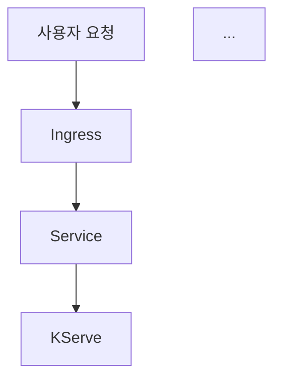

# {{ $frontmatter.title }} 관련

```component VPCard
{
  "title": "LLM > Article(s)",
  "desc": "Article(s)",
  "link": "/ai/llm/articles/README.md",
  "logo": "/images/ico-wind.svg",
  "background": "rgba(10,10,10,0.2)"
}
```

```component VPCard
{
  "title": "Kubernetes > Article(s)",
  "desc": "Article(s)",
  "link": "/devops/k8s/articles/README.md",
  "logo": "/images/ico-wind.svg",
  "background": "rgba(10,10,10,0.2)"
}
```

[[toc]]

---

<SiteInfo
  name="RAG 기반 '사내 지식 챗봇' 이렇게 구축했습니다"
  desc="“그 내용 예전에 누가 정리했는데... 어디 있었더라?”저희가 사내에서 가장 자주 들었던 말입니다. 출시하는 프로덕트가 매년 늘어나고, 관련된 기술 문서가 증가할수록 내부 구성원들은 정보의 홍수 속에서 ‘어디에 있는지 모르는 정보’를 찾아 오랜 시간을 헤맸습니다. 문서가 없는 게 아니라, 문서량이 너무 많아 적합한 정보를 찾을 수 없는 것이 문제였죠. 이런 상황에서 사내 개발자들은 새로운 접근이 필요하다고 판단했고, 문맥 중심의 답변이 가능한 RAG(Retrieval-Augmented Generation) 구조를 실험하게 되었습니다."
  url="https://yozm.wishket.com/magazine/detail/3302/"
  logo="https://yozm.wishket.com/favicon.ico"
  preview="https://yozm.wishket.com/media/news/3302/image2.png"/>

> **왜 ‘RAG’인가?**

“그 내용 예전에 누가 정리했는데… 어디 있었더라?”

저희가 사내에서 가장 자주 들었던 말입니다. 출시하는 프로덕트가 매년 늘어나고, 관련된 기술 문서가 증가할수록 내부 구성원들은 정보의 홍수 속에서 ‘어디에 있는지 모르는 정보’를 찾아 오랜 시간을 헤맸습니다. 문서가 없는 게 아니라, 문서량이 너무 많아 적합한 정보를 찾을 수 없는 것이 문제였죠.

사내 위키, 사내 기술 블로그, 마크다운 형태의 매뉴얼 등, 다양한 지식 자산이 이미 존재하고 있었지만, 기존 키워드 기반 검색이나 일반 챗봇 시스템으로는 맥락 있는 답변을 제공하는 데 한계가 분명했습니다. 실제로 “프로젝트 A 기준으로 어떻게 구현했느냐”라는 질문에, 기존 시스템은 적절한 답을 주지 못하고 결국 담당자에게 직접 물어보는 일이 반복됐습니다.

이런 상황에서 사내 개발자들은 새로운 접근이 필요하다고 판단했고, 문맥 중심의 답변이 가능한 RAG(Retrieval-Augmented Generation) 구조를 실험하게 되었습니다. 일반적인 LLM은 고정된 파라미터 내에 지식을 저장하고 있으므로, 학습 이후의 최신 정보나 훈련 데이터에 포함되지 않는 세부 정보를 알 수 없습니다. 이 문제를 해결하기 위해 RAG는 외부의 정보 소스를 질의 시점에 검색하여, LLM이 참고할 수 있도록 합니다. 즉, RAG는 정보 검색(Retrieval)과 텍스트 생성(Generation)을 결합한 구조로, 질문에 더 정확하고 사실적인 응답을 생성할 수 있도록 돕습니다. 이 구조는 특히 사내 위키, 매뉴얼, 프로젝트 기록 등 비정형 문서가 많을 때 빛을 발합니다


RAG는 다양한 분야에서 실용적으로 활용되고 있습니다. 대표적으로 사내 지식 Q&A 챗봇 시스템에서는 위키, 매뉴얼, 슬랙 대화 등을 벡터화하여 실시간 질의응답이 가능하게 합니다. 고객지원 챗봇에도 적용되어, 제품 설명서나 정책 문서를 기반으로 한 자동화된 상담이 가능합니다. 개발자 도구의 경우 API 문서나 예제 코드 검색을 통해, LLM이 보완적인 정보까지 제공할 수 있습니다.

이 구조를 애플리케이션 배포와 운영이 간편한 쿠버네티스 환경에 맞게 최적화하여 실제 업무에 적용했습니다. 그 결과, 보다 정확하고 신뢰할 수 있는 답변을 제공하는 사내 지식 관리 시스템을 구축할 수 있었습니다. 오늘은 이러한 RAG를 어떻게 구축했는지 그 과정을 살펴보고자 합니다.

---

## 쿠버네티스 기반 RAG 시스템, 이렇게 만들었습니다

RAG 시스템은 단순히 LLM에 사내 데이터를 붙이는 과정뿐만 아니라, 데이터 흐름과 운영 자동화까지 고려해야 하는 꽤 복합적인 구조입니다. 그래서 간단하지만 야심 차게 시작했던 프로젝트가, 결국 쿠버네티스 클러스터 환경에서, 임베딩 파이프라인, 벡터 검색, LLM 추론, UI까지, 전 구성요소를 클러스터 내부에서 통합 운영할 수 있는 형태로 발전했습니다. 전반적인 시스템의 개괄적인 부분만 설명하면 다음과 같습니다.

### 데이터 수집과 임베딩 자동화: Kubeflow + LlamaIndex

- 사내 위키, Markdown 문서, 기술 블로그 등 여러 소스에서 새로운 데이터를 수집합니다.
- 수집된 문서는 문단 단위로 분할한 뒤, LlamaIndex 라이브러리를 사용하여 벡터화합니다.
- 벡터는 오픈소스 벡터 DB인 Milvus에 저장되며, 전 과정을 Kubeflow Pipeline으로 자동화했습니다.
- 문서 변경 시 재처리되며, 이 작업은 매일 새벽 주기적으로 실행됩니다.


### 질문에 맞는 문서 검색: Milvus 벡터 DB

- 사용자가 챗봇에 질문을 입력하면, 해당 질문을 벡터로 변환하여 Milvus에 쿼리 합니다.
- 쿼리 과정에서는 벡터 DB에 저장된 유사도가 가장 높은 문서들을 Top-K로 검색합니다.
- Milvus는 GPU 리소스를 사용할 수 있으며, 쿠버네티스 클러스터 내에서 안정적인 성능을 보여주었습니다.

### 답변 생성: LLaMA 3 + KServe

- 검색된 문서를 기반으로 프롬프트를 구성하고, 질문과 함께 다시 LLaMA 3 LLM에게 해당 내용을 전달합니다.
- LLM 모델은 KServe를 통해 쿠버네티스상에서 서빙되며, 추론을 담당한 쿠버네티스 파드는 GPU 리소스를 사용합니다.
- LLM 모델은 벡터 DB에서 검색된 내용을 토대로 사용자의 프롬프트에 알맞은 증강된 답변을 생성합니다.
- 각 마이크로 서비스의 부하가 높아지면, 자동으로 파드와 노드 수를 늘리도록 스케일링을 설정했습니다.

### 사용자를 위한 웹 UI: Open WebUI 기반의 인터페이스

- 웹 UI는 추후 LLM 모델을 쉽게 추가 및 선택할 수 있도록, Open WebUI 인터페이스를 활용해 구성했습니다.
- 사용자는 단순히 자연어로 질문만 입력하면 되고, 백엔드에서는 Milvus 검색 → 검색 결과 프롬프트 구성 → LLaMA 3 추론 요청 → 순서로 생성된 응답이 반환됩니다.


---

## 기술적 난관 극복하기

프로젝트를 진행하면서 예상보다 많은 기술적 난관에 직면했지만, 그중 가장 핵심적인 두 가지 과제는 다음과 같았습니다. 첫째, 다양한 형식의 문서를 내용과 문맥을 최대한 보존한 채 어떻게 효과적으로 벡터화할 것인가. 둘째, 문서의 양이 계속 증가하더라도 프롬프트에 대한 응답 속도가 느려지지 않도록 시스템의 성능을 유지하는 것이었습니다.

### 문서를 벡터로 변환하기 위한 프로세스

수많은 사내 문서를 벡터 데이터베이스에 저장하기 위한 프로세스를 정립하면서, 대부분의 중요 문서를 마크다운(Markdown) 형식으로 변환하기로 했습니다. 마크다운은 순수 텍스트에 가까워 불필요한 서식이 최소화되어 있으며, 토큰 효율성이 높아 LLM 같은 최신 모델들과도 잘 호환되는 장점이 있습니다. 또한 구조가 명확하고 간결해, 문서의 논리 흐름이나 섹션 구분, 표, 코드 등의 요소를 LLM이 더 쉽게 이해할 수 있습니다.

반면 PDF, PPTX, DOCX와 같은 일반 문서를 그대로 벡터화하려면 내부 구조가 복잡하거나 텍스트가 단절되어 있어, 텍스트 자체는 벡터화할 수 있더라도 문맥을 정확히 분석하기 어려운 단점이 있습니다. 따라서 일반 문서를 마크다운(`.md`)으로 변환할 때, 제목, 강조 표현, 문서 구조 등의 요소를 얼마나 잘 보존하느냐가 RAG 시스템의 품질과 정확도에 직접적인 영향을 미칩니다.

가장 안정적이었던 조합은 변환 시 Marker와 MarkItDown을 함께 사용하는 방식이었으며, 다양한 도구가 존재하는 만큼 충분한 테스트를 통해 최적의 조합을 찾아내는 것이 중요합니다.  

````md title="마크다운(.md) 형식으로 변환된 예제 문서 일부"
---
title: 쿠버네티스 기반 AI 추론 서비스 아키텍처
author: 홍길동
date: 2025-08-01
tags: [AI, 쿠버네티스, GPU, 추론서비스]
purpose: GPU 리소스를 효율적으로 사용하는 쿠버네티스 기반 AI 추론 아키텍처를 소개합니다.
---

# 1. 개요

쿠버네티스 환경에서 AI 추론 서비스를 운영하려면, GPU 자원의 효율적 사용과 자동 스케일링, 관측 가능성이 중요합니다.

본 문서는 사내 AI 팀에서 운영 중인 LLaMA 기반 추론 서비스를 어떻게 구성하고 최적화했는지를 공유합니다.

# 2. 주요 컴포넌트

---

## 2.1 모델 추론 서버

- **모델**: LLaMA 3 13B (int4 quantized)
- **서빙 플랫폼**: KServe + Triton Inference Server
- **배포 방식**: GPU 노드에 pod affinity 지정

---

## 2.2 요청 처리 구조



````

Kubeflow로 문서 임베딩 파이프라인을 자동화하고 있으므로, 마크다운 변환 단계 또한 해당 파이프라인에 포함했습니다. 문서 수집 단계에서 각 문서의 메타데이터 필드를 확인하고, 필수 필드가 누락된 문서는 우선 벡터화 대상에서 제외합니다. 

예컨대, 작성자나 작성 날짜, 작성 목적 등이 빠진 문서는 신뢰도가 낮거나 임시 자료일 수 있으므로, 우선순위를 낮춥니다. 품질 점수를 매겨서 5점 만점 중 5점 (모든 필드 있음)인 문서만 즉시 벡터화하고, 5점 미만은 보완 전까지 보류하는 식으로 정책을 세울 수 있습니다. 이렇게 1차 필터링하면 벡터 DB에 불필요한 저품질 정보 유입을 막고, 검색 시 노이즈를 크게 줄일 수 있죠.

---

## RAG 응답 속도 개선하기

초기 테스트 단계에서는 일부 프롬프트에 대해 전체 애플리케이션의 응답 시간이 최대 10초에 달하는 문제가 있었으며, 이를 2~3초 이내로 단축하기 위해 임베딩 → 검색 → 프롬프트 구성 → LLM 생성에 이르는 전체 파이프라인의 단계별 최적화가 필요했습니다. 각 단계별로 진행한 주요 개선 사항은 다음과 같습니다.

### 청킹(chunking) 전략 개선

문서를 벡터화할 때 사용하는 청크 크기와 분할 방식은 검색 성능과 LLM 응답 품질 모두에 직접적인 영향을 줍니다. 초기에는 문서를 문단 단위로 나눴지만, 문단마다 길이가 들쭉날쭉해 검색 효율이 떨어졌습니다. 이에 따라 한 청크당 토큰 수를 일정하게 유지하는 방식으로 전환했고, 300~500 토큰 크기가 가장 균형 잡힌 결과를 보여주었습니다.

### 청크 분할 방식 개선*

단순히 고정 길이로 자르는 것보다, 문맥 단위를 고려한 시맨틱 청크 분할이 더 효과적입니다. 예를 들어, 슬라이드 한 장, 보고서의 섹션 하나, FAQ의 Q&A 한 쌍처럼 자연스러운 의미 단위로 나누면 LLM이 문서를 더 잘 이해하고 응답의 품질도 향상됩니다.

### Top-K 조절 및 재정렬 전략

벡터 검색 단계에서 LLM에 전달하는 문맥 조각 수인 Top-K 설정도 중요한 요소였습니다. 일반적으로 Top-5를 사용하는 경우가 많지만, 내부 실험 결과 K=4 전후가 속도와 정확도 측면에서 가장 효율적이었습니다. K를 늘리면 정답이 포함될 확률은 높아지지만, 입력 길이 증가로 인해 응답 시간이 늘어나고 노이즈도 함께 포함될 수 있습니다. 반대로 K를 너무 줄이면 필요한 문맥을 놓칠 수 있기에, K=3~4 수준이 가장 합리적인 절충점으로 나타났습니다.

### 기타 최적화 항목

이외에도 전반적인 성능과 정확도를 함께 개선하기 위해 다음과 같은 최적화를 적용했습니다.  
  
- 프롬프트 구성 간결화 및 지시문 정제
- 벡터 DB 검색 결과 캐싱
- LLM 응답 캐싱 및 세션 재사용
- 복수 사용자의 동시 요청에 대한 임베딩 처리 비동기화
  
이러한 개선을 통해 초기의 과도한 지연 문제를 해결하고, 보다 안정적이고 빠른 응답 시스템으로 발전시킬 수 있었습니다.

---

## 결과적으로 정확성과 확장성을 모두 얻었습니다

이 시스템을 운영하면서 가장 크게 체감한 변화는 정확성과 신뢰성이었습니다. 기존 챗봇은 질문에 모호하게 답하는 경우가 많았지만, 이제는 “이 내용은 사내 정책 문서의 3.2절에 나와 있습니다”와 같이 답변과 함께 근거 문서를 제시할 수 있게 되었습니다. 그 결과 구성원들의 신뢰도가 눈에 띄게 높아졌고요.


문맥을 이해한 답변이 가능해진 것도 큰 변화였습니다. 같은 질문이라도 프로젝트나 기간, 담당자에 따라 다른 답변이 필요한 경우가 있었는데, 컨텍스트 기반 생성 방식은 이런 미묘한 차이를 잘 반영해 주었습니다.

운영 측면에서도 이점이 많았습니다. 임베딩 파이프라인이 자동화되어 있어 문서가 늘어나더라도 관리 부담이 거의 없었고, GPU 추론 서버 역시 쿠버네티스의 오토스케일링 기능을 통해 안정적으로 유지됐습니다. 게다가 전체 구성이 컨테이너화되어 있어, 향후 LLM 교체나 멀티 클러스터 전환도 충분히 대응 가능한 구조였습니다.

실제 사용자 피드백 중에는 “이제는 사내 검색보다 이걸 먼저 켠다”라는 반응도 있었고, “내가 쓴 문서가 이렇게 잘 요약되기도 하고, 검색되어 나오니 뿌듯하다”라는 의견도 기억에 남습니다. 반면, 오픈소스 기반 벡터 DB의 쿼리 성능과 검색 최적화, 그리고 LangChain을 활용한 전반적인 시스템 고도화는 다음 버전에서 더 고민하고 개선해야 할 숙제로 남아 있습니다.

---

## RAG 기반, 정보 검색 시스템을 고려 중이라면?

이 글을 읽고 비슷한 시스템을 도입하려는 분이 있다면, 가장 먼저 내부 문서의 품질과 구조를 점검해 보시길 바랍니다. RAG의 핵심은 검색과 문맥에 있기 때문입니다. 문서가 아무리 많아도 문단이 뒤섞여 있거나, 낮은 품질의 중복 문서가 많다면 정확도가 떨어질 수밖에 없습니다. 또한 문서 수집을 처음부터 복잡하게 시작하기보다는, 마크다운 형식의 단일 소스에서 작은 규모로 출발해 점차 확장하는 접근을 추천합니다. Kubeflow나 Milvus 같은 오픈소스 툴, 그리고 LangChain 등은 학습 곡선이 있지만, 일단 환경을 구성하고 나면 안정성과 자동화 기능이 매우 뛰어납니다.

AI는 더 이상 대규모 모델만으로 완성되는 시대가 아닙니다. 중요한 것은 그 모델을 어떻게 활용하느냐입니다. 이 글에서 소개한 RAG, MCP(Model Context Protocol), AI 에이전트처럼 추가 데이터를 어떻게 연결해, 현업에 맞는 구조로 운영 가능한 상태로 만들 수 있는지가 실무에서는 더 핵심적인 과제라고 생각합니다. 이 글이 실제 조직에서 AI 기반 시스템을 고민하는 분들께 현실적인 인사이트로 작게나마 도움이 되었기를 바랍니다.

<!-- TODO: add ARTICLE CARD -->
```component VPCard
{
  "title": "RAG 기반 '사내 지식 챗봇' 이렇게 구축했습니다",
  "desc": "“그 내용 예전에 누가 정리했는데... 어디 있었더라?”저희가 사내에서 가장 자주 들었던 말입니다. 출시하는 프로덕트가 매년 늘어나고, 관련된 기술 문서가 증가할수록 내부 구성원들은 정보의 홍수 속에서 ‘어디에 있는지 모르는 정보’를 찾아 오랜 시간을 헤맸습니다. 문서가 없는 게 아니라, 문서량이 너무 많아 적합한 정보를 찾을 수 없는 것이 문제였죠. 이런 상황에서 사내 개발자들은 새로운 접근이 필요하다고 판단했고, 문맥 중심의 답변이 가능한 RAG(Retrieval-Augmented Generation) 구조를 실험하게 되었습니다.",
  "link": "https://chanhi2000.github.io/bookshelf/yozm.wishket.com/3302.html",
  "logo": "https://yozm.wishket.com/favicon.ico",
  "background": "rgba(84,7,224,0.2)"
}
```
